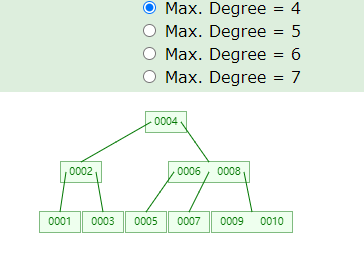
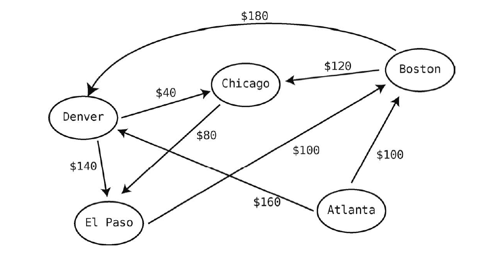
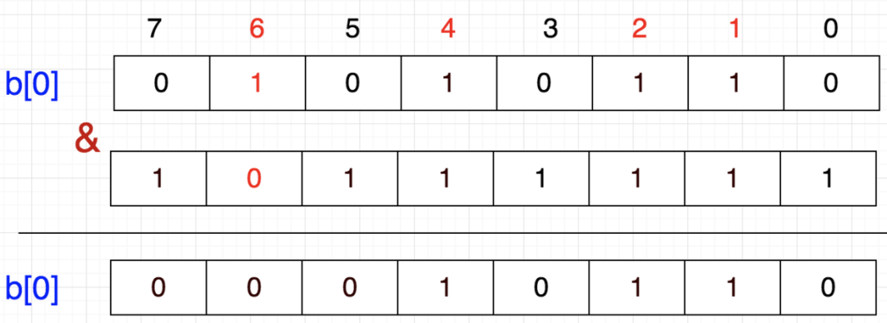

# 目录
- [数据结构](#数据结构)
    - [数组](#数组)，[集合](#集合)，[栈--TODO](#栈)，[队列--TODO](#队列)，[散列表--TODO](#散列表)，[链表](#链表)
    - [二叉树](#二叉树)，[红黑树](#红黑树)，[B Tree--TODO](#B-Tree)，[B+ Tree--TODO](#B+-Tree)
    - [图](#图)（[广度优先搜索--TODO](#广度优先搜索BFS)，[深度优先搜索--TODO](#深度优先搜索DFS)，[最短路径问题](#最短路径问题)）
    - [Bitmap](#Bitmap)

- [算法](#算法)
    - [二分查找](#二分查找)
    - [冒泡排序](#冒泡排序)，[选择排序](#选择排序)，[插入排序](#插入排序)
    - [快速排序](#快速排序)
    - [递归](#递归)

- [设计模式](#设计模式)
    - [设计模式的7个原则](#设计模式的7个原则)
    - 创建型模式：[单例模式 √](#单例模式)，[工厂模式 √](#工厂模式)，[抽象工厂模式 √](#抽象工厂模式)，[建造者模式 √](#建造者模式)，[原型模式 √](#原型模式)
    - 结构型模式：[适配器模式 √](#适配器模式)，[装饰者模式 √](#装饰者模式)，[代理模式 √](#代理模式)，[外观模式 √](#外观模式)，[桥接模式 √](#桥接模式)，[组合模式 √](#组合模式)，[享元模式 √](#享元模式)，[~~过滤器模式~~](#过滤器模式)
    - 行为型模式：[观察者模式 √](#观察者模式)，[责任链模式](#责任链模式)，[迭代器模式](#迭代器模式)，[命令模式](#命令模式)，[备忘录模式 √](#备忘录模式)，[中介者模式](#中介者模式)，[解释器模式](#解释器模式)，[策略模式 √](#策略模式)，[模板方法 √](#模板方法)，[状态模式 √](#状态模式)，[访问者模式](#访问者模式)

- [算法题](https://github.com/Panl99/demo/tree/master/demo-action#leetcode)
  - [leetcode_in_action](https://github.com/Panl99/demo/tree/master/demo-action/src/main/java/com/lp/demo/action/leetcode_in_action)

- [逻辑推理](#逻辑推理)
    - [5个海盗分金](#5个海盗分金)
------

# 数据结构
> [数据结构可视化工具](https://www.cs.usfca.edu/~galles/visualization/Algorithms.html)

## 数组
[数组——leetcode](https://github.com/Panl99/demo/tree/master/demo-action/src/main/java/com/lp/demo/action/leetcode_in_action/ArrayDemo.java)
```java
String[] array = {"apples", "bananas", "cucumbers", "dates", "elderberries"};
int[][] matrix = {{1,2,8,9},{2,4,9,12},{4,7,10,13},{6,8,11,15}};
```
- **读取：** 查看某个索引所指的数据值。`String s = array[0];`
- **查找：** 找出某个数据值的所在的位置。
- **插入：** 增加一个数据值。(数组下标越界：`array[5] = "sss";`)
- **删除：** 移走一个数据值。

***不能直接操作***

## 集合
```java
Set<String> strs = new HashSet<>();
strs.add("apples");
strs.remove("apples");
strs.contains("bananas");
```
- 元素不重复

## 栈
- `Stack` 允许在同一端进行删除插入和删除操作的特殊线性表。
- 特性：先进后出(FILO)
- 栈的实现：
```java

```

## 队列

## 散列表
`Hash Table` 也叫哈希表

## 链表
[链表——leetcode](https://github.com/Panl99/demo/tree/master/demo-action/src/main/java/com/lp/demo/action/leetcode_in_action/ListDemo.java)

每个结点除了保存数据，它还保存着链表里的下一结点的内存地址。


**读取：** 
- 链表的结点可以分布在内存的任何地方，程序只知道第1 个结点的内存地址，要读取一个节点的值，程序必须先读取索引0 的链，然后顺着该链去找索引1。接着再读取索引1 的链，去找索引2，以此类推，找到最终索引中的值。
- 时间复杂度：O(N)

**查找：** 从第一格开始逐个格子地找，直至找到。如果是最坏情况，即所找的值在列表末尾，或完全不在列表里，那就要花O(N)步。

**插入：** 
- 时间复杂度：理论上O(1)，实际上是：O(N)：理论上只需要将上一个节点索引指向自己，自己指向下一个节点。但是要找到上一个节点的查询效率需要O(N)


**删除：** 跟插入类似
- 时间复杂度：O(N) ：删除链表的最后一个结点，其实际的删除动作只需1 步——令倒数第二的结点的链指向null。然而，要找出倒数第二的结点，得花N 步

**链表与数组性能对比：**


### 双向链表
每个结点都含有两个链：一个指向下一结点，另一个指向前一结点。此外，它还能直接访问第一个和最后一个结点。


应用：使用双向链表作为队列实现的底层，可以使队列的插入和删除都为O(1)。
- 队列插入数据只能在末尾。
- 若使用数组、链表插入比较：在数组的末尾插入时间复杂度为O(1)。链表则要O(N)。
- 若使用数组、链表删除比较：链表只要O(1)，而数组是O(N)。
- 使用双向链表：因为双向链表能直接访问前端和末端的结点，所以在两端插入的效率都为O(1)，在两端删除的效率也为O(1)。

[目录](#目录)

## 树
### 二叉树
[树——leetcode](https://github.com/Panl99/demo/tree/master/demo-action/src/main/java/com/lp/demo/action/leetcode_in_action/TreeDemo.java)


**查找：** 二叉树的查找算法先从根结点开始。
1. 检视该结点的值。
2. 如果正是所要找的值，返回！
3. 如果要找的值小于当前结点的值，则在该结点的左子树查找。
4. 如果要找的值大于当前结点的值，则在该结点的右子树查找。

```java
// 树节点表示
public static class TreeNode {
    int val;
    TreeNode left;
    TreeNode right;
    TreeNode(int x) { val = x; }
}

// 构造树
TreeNode tree = new TreeNode(3);
tree.left = new TreeNode(9);
tree.right = new TreeNode(20);
tree.right.left = new TreeNode(15);
tree.right.right = new TreeNode(7);

/**
 * 剑指offer23:层序遍历二叉树
 * @return [3, 9, 20, 15, 7]
 * 解法一：迭代，间复杂度：O(n)，空间复杂度：O(n)
 */
public static ArrayList<Integer> PrintFromTopToBottom(TreeNode root) {
    ArrayList<Integer> list = new ArrayList<>();
    if (root == null) {
        return list;
    }
    Queue<TreeNode> queue = new LinkedList<>();
    queue.offer(root);
    while (!queue.isEmpty()) {
        TreeNode node = queue.poll();
        list.add(node.val);
        if (node.left != null) {
            queue.offer(node.left);
        }
        if (node.right != null) {
            queue.offer(node.right);
        }
    }
    return list;
}

/**
 * 翻转一棵二叉树。
 * 示例：给定二叉树 [4,2,7,1,3,6,9]。返回 [4,7,2,9,6,3,1]
 * 思路：递归：从根节点开始，递归地对树进行遍历，并从叶子结点先开始翻转。如果当前遍历到的节点 root 的左右两棵子树都已经翻转，那么我们只需要交换两棵子树的位置，即可完成以 root 为根节点的整棵子树的翻转。
 * 时间复杂度：O(N)
 * 空间复杂度：O(logN)。而在最坏情况下，树形成链状，空间复杂度为 O(N)
 */
public static TreeNode invertTree(TreeNode root) {
    if (root == null) {
        return null;
    }
    TreeNode left = invertTree(root.left);
    TreeNode right = invertTree(root.right);
    root.left = right;
    root.right = left;
    return root;
}
```


### 红黑树
- Red-Black Tree，是一种自平衡二叉查找树。在红黑树每个节点上都多出一个存储位表示节点的颜色，颜色只能是**红** 或者 **黑**。
- **红黑树特性**：
    - 每个节点非黑即红。
    - 根节点是黑色的。
    - 每个叶子结点(NIL)都是黑色的空节点。
    - 如果一个节点是红色的，那它的子节点必须为黑色的。
    - 从一个节点到它的子孙节点的所有路径上都包含相同数量的黑色节点。


    
### B Tree



### B+ Tree


[目录](#目录)

## 图
每个结点都是一个顶点，每条线段都是一条边。当两个顶点通过一条边联系在一起时，称这两个顶点是相邻的。


单向关联关系的图：有向图。相互关联关系的图：无向图。

### 广度优先搜索BFS


### 深度优先搜索DFS


### 最短路径问题
如何以最低的价钱从Atlanta 飞往ElPaso？：可以使用加权图来解决



**狄克斯特拉(Dijkstra)算法：** 可以应用于：地图软件、GPS等
1. 以起步的顶点为当前顶点。
2. 检查当前顶点的所有邻接点，计算起点到所有已知顶点的权重，并记录下来。
3. 从未访问过（未曾作为当前顶点）的邻接点中，选取一个起点能到达的总权重最小的顶点，作为下一个当前顶点。
4. 重复前3 步，直至图中所有顶点都被访问过。

**Dijkstra算法特点：**

Dijkstra算法使用了广度优先搜索解决赋权有向图或者无向图的单源最短路径问题，算法最终得到一个最短路径树。该算法常用于路由算法或者作为其他图算法的一个子模块。

该算法的时间复杂度是n的平方，可以使用堆优化。

但是，要注意一点，Dijkstra算法只能适用于权值为正的情况下；如果权值存在负数，则不能使用。


[Dijkstra--leetcode](https://github.com/Panl99/demo/tree/master/demo-action/src/main/java/com/lp/demo/action/leetcode_in_action/Dijkstra.java)

[目录](#目录)

## Bitmap
- `Bitmap`：使用一个bit位标记某个元素对应的Value，Key即该元素。

- 作用：大数据查找、去重、快速排序。
    - 使用Bit为单位存储数据，可以大大节省存储空间。

- 举例：在20亿个随机整数中找出某个数是否存在，条件：32位操作系统，4G内存。

- 分析：在Java中，int占4个字节(Byte)，1 byte = 8 bit
    - 如果每个数字使用int存储，需要占空间：2000000000 * 4 / 1024 / 1024 / 1024 ≈ 7.45G
    - 如果数字按bit位存储，需要占空间：2000000000 / 8 / 1024 / 1024 / 1024 ≈ 0.24G
    
- 存储方式：1 bit表示一个数，value = 1表示存在，value = 0表示不存在。
    - 1个int占32位，那么需要申请int数组长度为：`int tmp[1 + N/32]`，N 表示要存储的数字中的最大值。
        - tmp[0]：可以表示0~31
        - tmp[1]：可以表示32~63
        - tmp[2]：可以表示64~95
        - ...
        - 给定任一整数M，那么M的下标为：M / 32，M的位置：M % 32。
    
    

- 添加：例如存放数字：5
    - 计算位置：5/32=0，5%32=5，即5应该在tmp[0]的第5个位置（00100000）。
    - 存放方法：把1向左移动5位，然后按位或。
    - 公式：`p + (i/8)|(1<<(i%8))` 其中，p表示现在的值，i表示待插入的数。
    ``` 
    相当于 86 | 32 = 118 (86为原数组 01010110)
    86 | (1<<5) = 118 （得到118 01110110）
    b[0] = b[0] + (5/8) | (1<<(5%8))
    ```
  
    

- 删除：例如删除数字：6
    - 删除方法：只需将该数所在的位置为0即可：1左移6位，就到达6这个数字所代表的位，然后按位取反，最后与原数按位与。
        - b[0] = b[0] & (~(1<<6))
    - 公式：`b[0] = b[0] & (~(1<<(i%8)))`
    
    
    
- 查找：例如查找数字：3
    - 查找方法：判断该数所在的位是0还是1。
    - 判断 b[0] & (1<<3)，值是0，表示不存在，值是1，表示存在。
    
- 快速排序：例如要对0-7内的5个元素(4,7,2,5,3)排序（假设元素不重复）,就可以采用Bit-map的方法来达到排序的目的。
    - 分析：要表示8个数，我们就只需要8个Bit（1Bytes），
        - 首先，开辟1Byte的空间，将这些空间的所有Bit位都置为0，然后将对应数字位置为1。
        - 最后，遍历一遍Bit区域，将该位是1的位的编号输出（2，3，4，5，7），这样就达到了排序的目的。
        - 时间复杂度：O(n)。
    - 优点:
        - 运算效率高，不需要进行比较和移位；
        - 占用内存少，比如N=10000000；只需占用内存为N/8=1250000Byte=1.25M
    - 缺点:
        - 所有的数据不能重复。即不可对重复的数据进行排序和查找。
        - 只有当数据比较密集时才有优势
        
- 快速去重：例如在20亿个整数中找出不重复的整数的个数，内存不足以容纳这20亿个整数。
    - 分析：首先，根据“内存空间不足以容纳这20亿个整数”可以联想到Bit-map。下边关键的问题就是怎么设计我们的Bit-map来表示这20亿个数字的状态了。
        - 一个数字的状态只有3种，分别为不存在、只有一个、有重复。因此，只需要2bit就可以对一个数字的状态进行存储了。
        - 设定一个数字不存在为00，存在一次01，存在两次及其以上为11。那我们大概需要存储空间2G左右。
        - 接下来把这20亿个数字存进去：如果对应的状态位为00，则将其变为01，表示存在一次；如果对应的状态位为01，则将其变为11，表示已经有一个了，即出现多次；如果为11，则对应的状态位保持不变，仍表示出现多次。
        - 最后，统计状态位为01的个数，就得到了不重复的数字个数。
        - 时间复杂度为：O(n)。
        
- 总结：
    - Bitmap主要用于快速检索关键字状态，通常要求关键字是一个连续的序列（或者关键字是一个连续序列中的大部分）。
    - 1bit可以表示一个关键字的状态（可标示两种状态）；2bit（表示4种状态）；3bit（表示8种状态）。

[目录](#目录)

------

# 算法
**时间复杂度：** `O(1) > O(log N) > O(N)`


和O(logN)对比.png)

## 二分查找
要求元素有序，否则要先排序
- 时间复杂度：`O(log N)`，对数时间：表示数据量翻倍时，查找步数+1。
```java
public static void main(String[] args) {
    int[] nums = {3,4,6,20,40,45,51,62,70,99,110};
    System.out.println(binarySearch(nums, 20)); //3
}
public static int binarySearch(int[] nums, int a) {
    int low = 0;
    int high = nums.length - 1;
    int mid;

    while (low <= high) {
        mid = (low + high) / 2;
        if (nums[mid] == a) {
            return mid;
        } else if (a > nums[mid]) {
            low = mid + 1;
        } else {
            high = mid - 1;
        }
    }
    return -1;
}
```

## 冒泡排序
时间复杂度：`O(N^2)`
```java
/**
 * 冒泡排序
 * 原理：依次比较相邻两个元素，如果左边大于右边，则二者交换位置。如此重复。
 * 示例：[4,5,6,3,2,1]
 *      第1趟：[4,5,3,2,1,6]
 *      第2趟：[4,3,2,1,5,6]
 *      第3趟：[3,2,1,4,5,6]
 *      第4趟：[2,1,3,4,5,6]
 *      第5趟：[1,2,3,4,5,6]
 */
public static void main(String[] args) {
    System.out.println(bubbleSort(nums));
}
public static int[] bubbleSort(int[] nums) {
    // 外层循环控制轮数
    for (int i = 0; i < nums.length - 1; i++) {
        // 内层循环控制每趟次数
        for (int j = 0; j < nums.length - 1 - i; j++) {
            if (nums[j] > nums[j + 1]) {
                int temp = nums[j];
                nums[j] = nums[j + 1];
                nums[j + 1] = temp;
            }
        }
    }
    for (int i = 0; i < nums.length; i++) {
        System.out.print(nums[i] + " ");
    }
    return nums;
}
```

## 选择排序
时间复杂度：`O(N^2 / 2) = O(N^2)` 比冒泡快一倍


```java
/**
 * 选择排序
 * 原理：从左至右检查数组的每个格子，找出值最小的那个。在此过程中，我们会用一个变量来记住检查过的数字的最小值（事实上记住的是索引，但为了看起来方便，下图就直接写出数值）。如果一个格子中的数字比记录的最小值还要小，就把变量改成该格子的索引
 *      知道哪个格子的值最小之后，将该格与本次检查的起点交换。第1 次检查的起点是索引0，第2 次是索引1，以此类推。
 *      重复第(1) (2)步，直至数组排好序。
 * 示例：[2, 6, 1, 3]
 *      第一趟：先从2开始跟后相邻比较，得到1是最小后，跟2交换位置：[1, 6, 2, 3]
 *      第二趟：从6开始跟后边相邻比较，得到2最小，交换位置：[1, 2, 6, 3]
 *      第三趟：[1, 2, 3, 6]
 */
public static int[] SelectSort(int[] nums) {
    // 外层循环控制轮数
    for (int i = 0; i < nums.length; i++) {
        // 最小值的索引
        int lowestNumberIndex = i;
        // 内层循环控制每趟比较
        for (int j = i + 1; j < nums.length; j++) {
            if (nums[j] < nums[lowestNumberIndex]) {
                lowestNumberIndex = j;
            }
        }

        if (lowestNumberIndex != i) {
            int temp = nums[i];
            nums[i] = nums[lowestNumberIndex];
            nums[lowestNumberIndex] = temp;
        }
    }
    for (int i = 0; i < nums.length; i++) {
        System.out.print(nums[i] + " ");
    }
    return nums;
}
```


## 插入排序
时间复杂度：`最好：O(N) 平均：O(N^2) 最坏：O(N^2)`  `O(N2+2N-2) = O(N^2)`
```java
/**
 * 插入排序
 * 原理：将序列分为两个子序列，L默认拿第一个数，然后每次从R中拿一个插入L中从右到左比自己大的后边，将L中比自己大的整体后移，L序总是有序的。
 * 将一个数据插入已经拍好序的序列中，适用于少量数据排序，稳定。
 * 示例：[ 6, 2, 5, 8, 7 ]
 *      将该数组分为两个子集，L:[6];R:[2, 5, 8, 7 ]
 *      每次从R中拿一个插入L中从右到左比自己大的后边，将L中比自己大的整体后移。
 *      第1趟：L：[ 6 ]；            R：[2, 5, 7, 8 ]
 *      第2趟：L：[ 2, 6 ]；         R：[5, 7, 8 ]
 *      第3趟：L：[ 2, 5, 6 ]；      R：[7, 8 ]
 *      第4趟：L：[ 2, 5, 6, 7 ]；   R：[ 8 ]
 *      第5趟：L：[ 6, 2, 5, 7, 8 ]；R：[ ]
 */
public static int[] insertSort(int[] nums) {
    for (int i = 1; i < nums.length; i++) {
        int insertVal = nums[i];
        //被插入位置(和前一个数比较)
        int index = i - 1;
        while (index >= 0 && insertVal < nums[index]) {
            //将nums[index]向后移动
            nums[index + 1] = nums[index];
            //将index向前移动
            index--;
        }
        nums[index + 1] = insertVal;
    }
    for (int i = 0; i < nums.length; i++) {
        System.out.print(nums[i] + " ");
    }
    return nums;
}
```

## 快速排序
时间复杂度：`最好：O(N log N) 平均：O(N log N) 最坏：O(N2)`
```java
/**
 * 快速排序
 * 原理：一趟排序将序列分为两部分，其中一部分的所有数据都比另一部分所有数据小。
 *      选择一个关键值作为基准值(一般第1个)，将比基准值大的放到右序列中，小的放到左序列中。
 *      （1）从后向前比较，用基准值和最后一个值进行比较。如果比基 准值小，则交换位置；如果比基准值大，则继续比较下一个值，直到 找到第1个比基准值小的值才交换位置。
 *      （2）在从后向前找到第1个比基准值小的值并交换位置后，从前向后开始比较。如果有比基准值大的，则交换位置；如果没有，则继续比较下一个，直到找到第1个比基准值大的值才交换位置。
 *      （3）重复执行以上过程，直到从前向后比较的索引大于等于从后向前比较的索引，则结束一次循环。这时对于基准值来说，左右两边都是有序的数据序列。
 *      （4）重复循环以上过程，分别比较左右两边的序列，直到整个数据序列有序。
 * 示例：[6,9,5,7,8]
 *      第一层递归：（基准值6前面的数据都比6小，6后面的数据都比6大）
 *          第1趟（5和6交换）：[5,9,6,7,8]
 *          第2趟（9和6交换）：[5,6,9,7,8]
 *      重复上述递归过程。
 */
public static int[] quickSort(int[] nums, int low, int high) {
    int start = low; //从前向后比较的索引
    int end = high; //从后向前比较的索引
    int key = nums[low]; //基准值

    while (end > start) {
        //从后向前比较
        while (end > start && nums[end] >= key){
            end--;
        }
        //如果没有比基准值小的，则比较下一个，直到有比基准值小的，就交换位置，然后又从前向后比较。
        if (nums[end] <= key){
            int temp = nums[end];
            nums[end] = nums[start];
            nums[start] = temp;
        }
        //从前向后比较
        while (end > start && nums[start] <= key) {
            start++;
        }
        //如果没有比基准值大的，则比较下一个，直到有比基准值大的，就交换位置。
        if (nums[start] >= key){
            int temp = nums[start];
            nums[start] = nums[end];
            nums[end] = temp;
        }
        //第一次循环比较结束
    }
    if (start > low) {
        quickSort(nums, low, start-1);
    }
    if (end < high) {
        quickSort(nums, end+1, high);
    }

    return nums;
}
```

## 递归
```java
/**
 * 返回一个数的阶乘
 */
public static String factorial(int num) {
    if (num == 1) {
        return Integer.toString(1);
    }
    return num + " * " + factorial(num - 1);
}
```

实战：遍历文件系统


[目录](#目录)

------

# 设计模式
设计模式是人们经过长期编程经验总结出来的一种编程思想。

## 设计模式的7个原则
1. 单一职责原则
    - 又称单一功能原则，规定一个类只能有一个职责（功能）。
2. 开闭原则
    - 规定软件中的对象(类、模块、函数等)对扩展开放，对修改封闭。意味着一个实体允许在不改变其源码的前提下改变其行为。
3. 里氏代换原则
    - 对开闭原则的补充，规定在任意父类出现的地方，子类都一定可以出现。
    - 实现开闭原则的关键就是抽象化，父类与子类的继承关系就是抽象化的具体表现，所以里氏代换原则是对实现抽象化的具体步骤的规范。
4. 依赖倒转原则
    - 指程序要依赖于抽象（Java中的抽象类和接口），而不依赖于具体的实现（Java中的实现类）。
    - 简单地说，就是要求对抽象进行编程，不要求对实现进行编程，这就降低了用户与实现模块之间的耦合度。
5. 接口隔离原则
    - 指通过将不同的功能定义在不同的接口中来实现接口的隔离，这样就避免了其他类在依赖该接口（接口上定义的功能）时依赖其不需要的接口，可减少接口之间依赖的冗余性和复杂性。
6. 合成/聚合复用原则
    - 指通过在一个新的对象中引入（注入）已有的对象以达到类的功能复用和扩展的目的。它的设计原则是要尽量使用合成或聚合而不要使用继承来扩展类的功能。
7. 迪米特法则
    - 指一个对象尽可能少地与其他对象发生相互作用，即一个对象对其他对象应该有尽可能少的了解或依赖。
    - 核心思想在于降低模块之间的耦合度，提高模块的内聚性。迪米特法则规定每个模块对其他模块都要有尽可能少的了解和依赖，因此很容易使系统模块之间功能独立，这使得各个模块的独立运行变得更简单，同时使得各个模块之间的组合变得更容易。

[目录](#目录)

## 单例模式
[单例模式](https://github.com/Panl99/demo/tree/master/demo-action/src/main/java/com/lp/demo/action/designpatterns_in_action/singletonpattern/Singleton.java)
   
## 工厂模式

- FactoryPattern：提供了一种简单、快速、高效而安全地创建对象的方式。
- 工厂模式在接口中定义了创建对象的方法，而将具体的创建对象的过程在子类中实现，用户只需通过接口创建需要的对象即可，不用关注对象的具体创建过程。同时，不同的子类可根据需求灵活实现创建对象的不同方法。
- 工厂模式的本质就是用工厂方法代替new操作创建一种实例化对象的方式

[工厂模式](https://github.com/Panl99/demo/tree/master/demo-action/src/main/java/com/lp/demo/action/designpatterns_in_action/factorypattern)

### 抽象工厂模式

- 抽象工厂模式（Abstract Factory Pattern）在工厂模式上添加了一个创建不同工厂的抽象接口（抽象类或接口实现），该接口可叫作超级工厂。在使用过程中，我们首先通过抽象接口创建出不同的工厂对象，然后根据不同的工厂对象创建不同的对象。
- 手机厂商还可能制造其他产品，减少实现多个工厂类

[抽象工厂模式](https://github.com/Panl99/demo/tree/master/demo-action/src/main/java/com/lp/demo/action/designpatterns_in_action/factorypattern/abstractfactorypattern)

[目录](#目录)

## 建造者模式

作用：
- 用于解决软件系统中复杂对象的创建问题

使用场景：
- 常被用于一些基本部件不会变而其组合经常变化的应用场景下。
- 建造者模式与工厂模式的最大区别是，建造者模式更关注产品的组合方式和装配顺序，而工厂模式关注产品的生产本身。

步骤：
- Builder：创建一个复杂产品对象的抽象接口。
- ConcreteBuilder：Builder接口的实现类，用于定义复杂产品各个部件的装配流程。
- Director：构造一个使用Builder接口的对象。
- Product：表示被构造的复杂对象。ConcreteBuilder定义了该复杂对象的装配流程，而Product定义了该复杂对象的结构和内部表示。

[建造者模式](https://github.com/Panl99/demo/tree/master/demo-action/src/main/java/com/lp/demo/action/designpatterns_in_action/builderpattern)

## 原型模式

作用：
- 调用原型实例的clone()方法创建新的对象。

使用场景：
- 以当前对象为原型来创建一个新的对象，无需知道创建的细节。

步骤：
- 原型类实现Cloneable接口并覆写clone()方法。
- clone()改为public类型。

- 浅复制：Java中的浅复制：是通过实现Cloneable接口并覆写其Clone方法实现的。
在浅复制的过程中，对象的基本数据类型的变量值会重新被复制和创建，而引用数据类型仍指向原对象的引用。
也就是说，浅复制不复制对象的引用类型数据。
- 深复制：在深复制的过程中，不论是基本数据类型还是引用数据类型，都会被重新复制和创建。
简而言之，深复制彻底复制了对象的数据（包括基本数据类型和引用数据类型），浅复制的复制却并不彻底（忽略了引用数据类型）。

[原型模式](https://github.com/Panl99/demo/tree/master/demo-action/src/main/java/com/lp/demo/action/designpatterns_in_action/prototypepattern)

## 适配器模式

作用：
- 实现各个接口之间的兼容：将一个类的接口转换为希望的另一个接口，让原本接口不兼容的类可以适配一起工作。

使用场景：
- 希望复用一些现存的类，但是接口(方法)又不符合时。

步骤：
- Source是待适配的类，Targetable是目标接口，Adapter是适配器。
- 在具体应用中通过Adapter 将Source 的功能扩展到Targetable，以实现接口的兼容。
- 适配器的实现主要分为三类：类适配器模式、对象适配器模式、接口适配器模式。

[适配器模式](https://github.com/Panl99/demo/tree/master/demo-action/src/main/java/com/lp/demo/action/designpatterns_in_action/adapterpattern)

## 装饰者模式

作用：
- 动态地给一个对象添加一些额外的职责。（对于增加功能来说，装饰者模式比生成子类更加灵活）
- 把类中的装饰功能从类中移除，区分开类的核心职责 和装饰功能，简化原有的类。
- 每个装饰对象只需要关心自己的功能，不需要关心如何被添加到对象链中。

使用场景：
- 为已有的功能 动态地添加 更多功能。

步骤：
- 定义核心类的，实现核心功能。
- 定义装饰者类，继承核心类，重写核心类功能（先执行核心类功能，再添加装饰类特有功能）。
- 使用装饰者类包装核心类，执行装饰者类的功能方法。

[装饰者模式](https://github.com/Panl99/demo/tree/master/demo-action/src/main/java/com/lp/demo/action/designpatterns_in_action/decoratorpattern)

## 代理模式

作用：
- 为其他对象提供一种代理 来控制对该对象的访问。

使用场景：
- 在客户端不适合或者不能够直接引用一个对象时，可以通过该对象的代理对象来实现对该对象的访问，可以将该代理对象理解为客户端和目标对象之间的中介者。
- 远程代理：为一个对象在不同的地址空间提供局部代表，来隐藏一个对象存在于不同地址空间的事实。
- 虚拟代理：需要创建开销很大的对象，通过它来存放实例化需要很长时间的真实对象。
- 安全代理：用来控制真实对象访问时的权限。（对象有不同的访问权限）
- 智能指引：调用真实对象时，代理处理另外一些事情。

[代理模式](https://github.com/Panl99/demo/tree/master/demo-action/src/main/java/com/lp/demo/action/designpatterns_in_action/proxypattern)

[目录](#目录)

## 外观模式

作用：
- 将子系统中的功能抽象成一个统一的接口或类中以对外提供服务，客户端通过这个接口访问系统，使得系统使用起来更加容易。
- 降低访问拥有多个子系统的复杂系统的难度，简化客户端与其之间的接口。

使用场景：
- 在系统设计初期，有意识的将不同的两个层分离。比如访问层、业务逻辑层、表示层 层层之间建立外观Facade，大大降低耦合度。
- 在开发阶段，子系统不断地演化变得复杂，会产生很多很小的类，使外部调用变得困难，可以增加外观Facade减少它们之间的依赖。
- 在维护遗留的大型系统时，该系统难以维护和扩展，如果有新的需求需要依赖它，可以为新系统开发一个外观Facade类，为老系统提供简单的接口来让新系统与Facade对象交互，让Facade与老系统完成复杂的工作。

步骤：
- 子系统角色：实现了子系统的功能。
- 门面角色：外观模式的核心，熟悉各子系统的功能和调用关系并根据客户端的需求封装统一的方法来对外提供服务。
- 客户角色：通过调用Facade来完成业务功能。

[外观模式](https://github.com/Panl99/demo/tree/master/demo-action/src/main/java/com/lp/demo/action/designpatterns_in_action/facadepattern)

## 桥接模式

作用：
- 将抽象部分与它的实现部分分离，使它们都可以独立的变化。

使用场景：
- 主要用于解决在需求多变的情况下使用继承造成类爆炸的问题，扩展起来不够灵活。
- 可以通过桥接模式将抽象部分与实现部分分离，使其能够独立变化而相互之间的功能不受影响。
- 常用的JDBC和DriverManager就使用了桥接模式，JDBC在连接数据库时，在各个数据库之间进行切换而不需要修改代码，因为JDBC提供了统一的接口，每个数据库都提供了各自的实现，通过一个叫作数据库驱动的程序来桥接即可。

步骤：
- 通过定义一个桥接接口，使得实体类的功能独立于接口实现类，降低它们之间的耦合度。

[桥接模式](https://github.com/Panl99/demo/tree/master/demo-action/src/main/java/com/lp/demo/action/designpatterns_in_action/bridgepattern)

## 组合模式

作用：
- 将对象组合成树形结构以表示"部分-整体"的层次结构，
- 组合模式使用户对单个对象 和组合对象的使用具有一致性。

使用场景：
- 需求是体现 部分-整体 的层次结构时，
- 希望用户忽略组合对象 跟单个对象的不同，统一的使用组合结构中的对象时。

步骤：
- 树结构

[组合模式](https://github.com/Panl99/demo/tree/master/demo-action/src/main/java/com/lp/demo/action/designpatterns_in_action/compositepattern)

## 享元模式

作用：
- 通过对象的复用来减少对象创建的次数和数量，以减少系统内存的使用和降低系统的负载。

使用场景：
- 一个应用使用了大量的对象，这些对象造成了很大的存储开销时。
- ~~对象的大多数状态可以外部状态，如果删除对象的外部状态，可以使用较少的共享对象取来多组对象。~~

步骤：
- 在系统需要一个对象时享元模式首先在系统中查找并尝试重用现有的对象，如果未找到匹配的对象，则创建新对象并将其缓存在系统中以便下次使用。

[享元模式](https://github.com/Panl99/demo/tree/master/demo-action/src/main/java/com/lp/demo/action/designpatterns_in_action/flyweightpattern)

## 观察者模式

作用：
- 解耦：让耦合双方都依赖于抽象，而不是依赖于具体，让各自的变化不会依赖于另一方的变化。
- 发布-订阅模式
- 在被观察者的状态发生变化时，系统基于事件驱动理论将其状态通知到订阅其状态的观察者对象中，以完成状态的修改和事件传播。

使用场景：
- 定义一种1对多的依赖关系，让多个观察者对象监听某一主题对象，当主题对象状态发生变化时，通知所有观察者对象来更新自己。

步骤：
- 抽象主题（Subject）：持有订阅了该主题的观察者对象的集合，同时提供了增加、删除观察者对象的方法和主题状态发生变化后的通知方法。
- 具体主题（Concrete Subject）：实现了抽象主题的通知方法，在主题的内部状态发生变化时，调用该方法通知订阅了主题状态的观察者对象。
- 抽象观察者（Observer）：观察者的抽象类或接口，定义了主题状态发生变化时需要调用的方法。
- 具体观察者（Concrete Observer）：抽象观察者的实现类，在收到主题状态变化的信息后执行具体的触发机制。

[观察者模式](https://github.com/Panl99/demo/tree/master/demo-action/src/main/java/com/lp/demo/action/designpatterns_in_action/observerpattern)

[目录](#目录)

## 责任链模式


[责任链模式](https://github.com/Panl99/demo/tree/master/demo-action/src/main/java/com/lp/demo/action/designpatterns_in_action/chain-of-responsibilitypattern)

[目录](#目录)

## 迭代器模式


[迭代器模式](https://github.com/Panl99/demo/tree/master/demo-action/src/main/java/com/lp/demo/action/designpatterns_in_action/iteratorpattern)

## 命令模式


[命令模式](https://github.com/Panl99/demo/tree/master/demo-action/src/main/java/com/lp/demo/action/designpatterns_in_action/commandpattern)

## 备忘录模式
又叫 快照模式

作用：
- 将当前对象的内部状态保存到对象之外的备忘录中，在需要时能将该对象的状态恢复到原先保存的状态。

使用场景：
- 用于功能复杂的，但需要维护、记录属性历史的类。
- 用于快照的记录、状态的存储。在系统发生故障 或数据发生不一致时 能够方便地将数据恢复到某个历史状态。

步骤：
- 发起人（Originator）：负责创建一个备忘录Memento，记录当前时刻对象的内部状态，和恢复备忘录数据的方法。
- 备忘录（Memento）：负责存储对象的内部状态。并防止Originator之外的其他对象访问备忘录Memento。
- 状态管理者（Caretaker）：对备忘录的历史状态进行存储，定义了保存和获取备忘录状态的功能。
注意，备忘录只能被保存或恢复，不能进行修改。

[备忘录模式](https://github.com/Panl99/demo/tree/master/demo-action/src/main/java/com/lp/demo/action/designpatterns_in_action/mementopattern)  

## 中介者模式


[中介者模式](https://github.com/Panl99/demo/tree/master/demo-action/src/main/java/com/lp/demo/action/designpatterns_in_action/mediatorpattern)

## 解释器模式


[解释器模式](https://github.com/Panl99/demo/tree/master/demo-action/src/main/java/com/lp/demo/action/designpatterns_in_action/interpreterpattern)

## 策略模式

作用：
- 以相同的方式调用算法，减少不同算法跟使用算法类之间的耦合。
- 定义一系列可重用的算法或行为，有助于析取这些算法中的公共功能。
- 简化单元测试

使用场景：
- 要实现相同的算法，只是算法的具体实现不同，可以使用策略模式封装算法。
- 当if/else比较多的时候，可以考虑使用策略模式。

步骤：
- 定义抽象策略类，策略方法
- 定义具体实现类，根据不同具体类实现不同的策略方法。

[策略模式](https://github.com/Panl99/demo/tree/master/demo-action/src/main/java/com/lp/demo/action/designpatterns_in_action/strategypattern)
该示例结合策略模式、模板方法、简单工厂模式。

[目录](#目录)

## 模板方法

作用：
- 可以不改变一个算法的结构 便可重新定义该算法的某些特定步骤，以减少某些重复代码。

使用场景：
- 执行一些列固定步骤的功能，只是步骤的具体实现不同。
- 继承和多态多少会用到

步骤：
- 定义一系列操作的算法框架，将具体步骤放到子类中实现。

[模板方法](https://github.com/Panl99/demo/tree/master/demo-action/src/main/java/com/lp/demo/action/designpatterns_in_action/templatepattern)

[目录](#目录)

## 状态模式

作用：
- 给对象定义不同的状态，将对象的不同行为封装到不同的状态中，在对象的状态发生变换时自动切换状态的行为。
- 状态模式基于对象的状态将对象行为进行了明确的界定，减少了对象行为之间的相互依赖，方便系统的扩展和维护。

使用场景：
- 当一个对象的行为取决于它的状态，并且它必须在运行时刻根据状态变化来改变它的行为。

步骤：
- 环境（Context）：也叫作上下文，用于维护对象当前的状态，并在对象状态发生变化时触发对象行为的变化。
- 抽象状态（AbstractState）：定义了一个接口，用于定义对象中不同状态所对应的行为。
- 具体状态（Concrete State）：实现抽象状态所定义的行为。

[状态模式](https://github.com/Panl99/demo/tree/master/demo-action/src/main/java/com/lp/demo/action/designpatterns_in_action/statepattern)

## 访问者模式


[访问者模式](https://github.com/Panl99/demo/tree/master/demo-action/src/main/java/com/lp/demo/action/designpatterns_in_action/visitorpattern)

[目录](#目录)


# 逻辑推理
## 5个海盗分金
   
5个海盗抢得100枚金币，他们按抽签的顺序依次提方案：首先由1号提出分配方案，然后5人表决，投票要超过半数同意方案才被通过，否则他将被扔入大海喂鲨鱼，依此类推。“海盗分金”其实是一个高度简化和抽象的模型，体现了博弈的思想。在“海盗分金”模型中，任何“分配者”想让自己的方案获得通过的关键是事先考虑清楚“挑战者”的分配方案是什么，并用最小的代价获取最大收益，拉拢“挑战者”分配方案中最不得意的人们。

**问：** 假定“每个海盗都是绝顶聪明且很理智”，那么“第一个海盗提出怎样的分配方案才能够使自己的收益最大化？”

**推理：** 从后向前推

1. 假设1-3号都喂了鲨鱼，只剩4号和5号的话，那么5号一定反对让4号喂了鲨鱼，这样5号可以拿到全部金币。所以：**4号必须要支持3号才能保命。**
2. 3号知道4号一定支持自己，所以他的分配方案就是：(100,0,0)，**3号自己拿全部金币，4号，5号没有。**
3. 2号知道3号的方案，就会提出：（98,0,1,1）的方案，即放弃3号，拉拢4号和5号，这样**2号得到98金币，3号没有，4号、5号各1个。**
4. 1号知道2号的方案，会提出：（97,0,1,0,2）或（97,0,1,2,0）的方案，即放弃2号，**自己拿97金币，给3号1金币，4号或者5号2金币**，这样可以拿到3票通过，是1号获取最多金币的最佳方案

**答案：** 1号自己拿97个，分给3号1个，分给4号 或者5号2个，即（97,0,1,0,2）或（97,0,1,2,0）。


[目录](#目录)