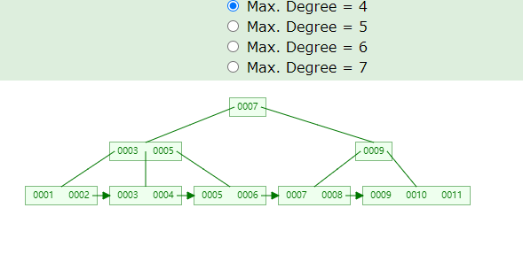

# 目录
- [数据结构](#数据结构)
    - [数组](#数组)，[集合](#集合)，[栈](#栈)，[队列](#队列)，[散列表](#散列表)，[链表](#链表)
    - [二叉树](#二叉树)，[红黑树](#红黑树)，[B Tree](#B-Tree)，[B+ Tree](#B+-Tree)
    - [图](#图)，[Bitmap](#Bitmap)

- [算法](#算法)
    - [二分查找](#二分查找)
    - [冒泡排序](#冒泡排序)，[选择排序](#选择排序)- [插入排序](#插入排序)
    - [快速排序](#快速排序)

- [设计模式](#设计模式)
    - [设计模式的7个原则](#设计模式的7个原则)
    - 创建型模式：[单例模式 √](#单例模式)，[工厂模式 √](#工厂模式)，[抽象工厂模式 √](#抽象工厂模式)，[建造者模式](#建造者模式)，[原型模式](#原型模式)
    - 结构型模式：[适配器模式](#适配器模式)，[装饰者模式](#装饰者模式)，[代理模式 √](#代理模式)，[外观模式](#外观模式)，[桥接模式](#桥接模式)，[组合模式](#组合模式)，[享元模式](#享元模式)，[~~过滤器模式~~](#过滤器模式)
    - 行为型模式：[观察者模式 ](#观察者模式)，[责任链模式](#责任链模式)，[迭代器模式](#迭代器模式)，[命令模式](#命令模式)，[备忘录模式](#备忘录模式)，[中介者模式](#中介者模式)，[解释器模式](#解释器模式)，[策略模式](#策略模式)，[模板方法](#模板方法)，[状态模式](#状态模式)，[访问者模式](#访问者模式)

------

# 数据结构
> [数据结构可视化工具](https://www.cs.usfca.edu/~galles/visualization/Algorithms.html)

## 数组

## 集合

## 栈
- `Stack` 允许在同一端进行删除插入和删除操作的特殊线性表。
- 特性：先进后出(FILO)
- 栈的实现：
```java

```

## 队列

## 散列表
`Hash Table` 也叫哈希表

## 链表


[目录](#目录)

## 树
### 二叉树

### 红黑树
- Red-Black Tree，是一种自平衡二叉查找树。在红黑树每个节点上都多出一个存储位表示节点的颜色，颜色只能是**红** 或者 **黑**。
- **红黑树特性**：
    - 每个节点非黑即红。
    - 根节点是黑色的。
    - 每个叶子结点(NIL)都是黑色的。
    - 如果一个节点是红色的，那它的子节点必须为黑色的。
    - 从一个节点到它的子孙节点的所有路径上都包含相同数量的黑色节点。
    - 
    
### B Tree


### B+ Tree



## 图

## Bitmap
- `Bitmap`：使用一个bit位标记某个元素对应的Value，Key即该元素。

- 作用：大数据查找、去重、快速排序。
    - 使用Bit为单位存储数据，可以大大节省存储空间。

- 举例：在20亿个随机整数中找出某个数是否存在，条件：32位操作系统，4G内存。

- 分析：在Java中，int占4个字节(Byte)，1 byte = 8 bit
    - 如果每个数字使用int存储，需要占空间：2000000000 * 4 / 1024 / 1024 / 1024 ≈ 7.45G
    - 如果数字按bit位存储，需要占空间：2000000000 / 8 / 1024 / 1024 / 1024 ≈ 0.24G
    
- 存储方式：1 bit表示一个数，value = 1表示存在，value = 0表示不存在。
    - 1个int占32位，那么需要申请int数组长度为：`int tmp[1 + N/32]`，N 表示要存储的数字中的最大值。
        - tmp[0]：可以表示0~31
        - tmp[1]：可以表示32~63
        - tmp[2]：可以表示64~95
        - ...
        - 给定任一整数M，那么M的下标为：M / 32，M的位置：M % 32。
    
    

- 添加：例如存放数字：5
    - 计算位置：5/32=0，5%32=5，即5应该在tmp[0]的第5个位置（00100000）。
    - 存放方法：把1向左移动5位，然后按位或。
    - 公式：`p + (i/8)|(1<<(i%8))` 其中，p表示现在的值，i表示待插入的数。
    ``` 
    相当于 86 | 32 = 118 (86为原数组 01010110)
    86 | (1<<5) = 118 （得到118 01110110）
    b[0] = b[0] + (5/8) | (1<<(5%8))
    ```
  
    

- 删除：例如删除数字：6
    - 删除方法：只需将该数所在的位置为0即可：1左移6位，就到达6这个数字所代表的位，然后按位取反，最后与原数按位与。
        - b[0] = b[0] & (~(1<<6))
    - 公式：`b[0] = b[0] & (~(1<<(i%8)))`
    
    
    
- 查找：例如查找数字：3
    - 查找方法：判断该数所在的位是0还是1。
    - 判断 b[0] & (1<<3)，值是0，表示不存在，值是1，表示存在。
    
- 快速排序：例如要对0-7内的5个元素(4,7,2,5,3)排序（假设元素不重复）,就可以采用Bit-map的方法来达到排序的目的。
    - 分析：要表示8个数，我们就只需要8个Bit（1Bytes），
        - 首先，开辟1Byte的空间，将这些空间的所有Bit位都置为0，然后将对应数字位置为1。
        - 最后，遍历一遍Bit区域，将该位是1的位的编号输出（2，3，4，5，7），这样就达到了排序的目的。
        - 时间复杂度：O(n)。
    - 优点:
        - 运算效率高，不需要进行比较和移位；
        - 占用内存少，比如N=10000000；只需占用内存为N/8=1250000Byte=1.25M
    - 缺点:
        - 所有的数据不能重复。即不可对重复的数据进行排序和查找。
        - 只有当数据比较密集时才有优势
        
- 快速去重：例如在20亿个整数中找出不重复的整数的个数，内存不足以容纳这20亿个整数。
    - 分析：首先，根据“内存空间不足以容纳这20亿个整数”可以联想到Bit-map。下边关键的问题就是怎么设计我们的Bit-map来表示这20亿个数字的状态了。
        - 一个数字的状态只有3种，分别为不存在、只有一个、有重复。因此，只需要2bit就可以对一个数字的状态进行存储了。
        - 设定一个数字不存在为00，存在一次01，存在两次及其以上为11。那我们大概需要存储空间2G左右。
        - 接下来把这20亿个数字存进去：如果对应的状态位为00，则将其变为01，表示存在一次；如果对应的状态位为01，则将其变为11，表示已经有一个了，即出现多次；如果为11，则对应的状态位保持不变，仍表示出现多次。
        - 最后，统计状态位为01的个数，就得到了不重复的数字个数。
        - 时间复杂度为：O(n)。
        
- 总结：
    - Bitmap主要用于快速检索关键字状态，通常要求关键字是一个连续的序列（或者关键字是一个连续序列中的大部分）。
    - 1bit可以表示一个关键字的状态（可标示两种状态）；2bit（表示4种状态）；3bit（表示8种状态）。

[目录](#目录)

------

# 算法


[目录](#目录)

------

# 设计模式
设计模式是人们经过长期编程经验总结出来的一种编程思想。

## 设计模式的7个原则
1. 单一职责原则
    - 又称单一功能原则，规定一个类只能有一个职责（功能）。
2. 开闭原则
    - 规定软件中的对象(类、模块、函数等)对扩展开放，对修改封闭。意味着一个实体允许在不改变其源码的前提下改变其行为。
3. 里氏代换原则
    - 对开闭原则的补充，规定在任意父类出现的地方，子类都一定可以出现。
    - 实现开闭原则的关键就是抽象化，父类与子类的继承关系就是抽象化的具体表现，所以里氏代换原则是对实现抽象化的具体步骤的规范。
4. 依赖倒转原则
    - 指程序要依赖于抽象（Java中的抽象类和接口），而不依赖于具体的实现（Java中的实现类）。
    - 简单地说，就是要求对抽象进行编程，不要求对实现进行编程，这就降低了用户与实现模块之间的耦合度。
5. 接口隔离原则
    - 指通过将不同的功能定义在不同的接口中来实现接口的隔离，这样就避免了其他类在依赖该接口（接口上定义的功能）时依赖其不需要的接口，可减少接口之间依赖的冗余性和复杂性。
6. 合成/聚合复用原则
    - 指通过在一个新的对象中引入（注入）已有的对象以达到类的功能复用和扩展的目的。它的设计原则是要尽量使用合成或聚合而不要使用继承来扩展类的功能。
7. 迪米特法则
    - 指一个对象尽可能少地与其他对象发生相互作用，即一个对象对其他对象应该有尽可能少的了解或依赖。
    - 核心思想在于降低模块之间的耦合度，提高模块的内聚性。迪米特法则规定每个模块对其他模块都要有尽可能少的了解和依赖，因此很容易使系统模块之间功能独立，这使得各个模块的独立运行变得更简单，同时使得各个模块之间的组合变得更容易。

[目录](#目录)

## 单例模式
[单例模式](https://github.com/Panl99/demo/tree/master/demo-common/src/main/java/com/outman/democommon/designpatterns/singletonpattern/Singleton.java)
   
## 工厂模式
[工厂模式](https://github.com/Panl99/demo/tree/master/demo-common/src/main/java/com/outman/democommon/designpatterns/factorypattern)

- FactoryPattern：提供了一种简单、快速、高效而安全地创建对象的方式。
- 工厂模式在接口中定义了创建对象的方法，而将具体的创建对象的过程在子类中实现，用户只需通过接口创建需要的对象即可，不用关注对象的具体创建过程。同时，不同的子类可根据需求灵活实现创建对象的不同方法。
- 工厂模式的本质就是用工厂方法代替new操作创建一种实例化对象的方式

#### 实现
以创建手机为例，假设手机的品牌有华为、小米、苹果三种类型，我们要实现的是根据不同的传入参数实例化不同的手机。

1. 定义接口 [Phone](https://github.com/Panl99/demo/tree/master/demo-common/src/main/java/com/outman/democommon/designpatterns/factorypattern/Phone.java) ，在接口中定义品牌 brand()；
2. 定义实现类 [IPhone](https://github.com/Panl99/demo/blob/master/demo-common/src/main/java/com/outman/democommon/designpatterns/factorypattern/IPhone.java) 、[HuaWei](https://github.com/Panl99/demo/blob/master/demo-common/src/main/java/com/outman/democommon/designpatterns/factorypattern/HuaWei.java) 、[XiaoMi](https://github.com/Panl99/demo/blob/master/demo-common/src/main/java/com/outman/democommon/designpatterns/factorypattern/XiaoMi.java) ；
3. 定义工厂类 [Factory](https://github.com/Panl99/demo/tree/master/demo-common/src/main/java/com/outman/democommon/designpatterns/factorypattern/Factory.java) ；
4. 测试 [Main](https://github.com/Panl99/demo/tree/master/demo-common/src/main/java/com/outman/democommon/designpatterns/factorypattern/Main.java) 。
5. 优化3：使用枚举创建手机对象 [PhoneEnum]([HuaWei](https://github.com/Panl99/demo/blob/master/demo-common/src/main/java/com/outman/democommon/designpatterns/factorypattern/PhoneEnum.java))

#### 使用Lambda重构工厂模式
无需暴露实例化的逻辑就能完成对象的创建。  
```java
//1、创建接口和实现类
public interface Phone {
    String brand(); //品牌
}
public class IPhone implements Phone {
    @Override
    public String brand() {
        return "this is a iphone";
    }
}

//2、创建一个工厂类
public static Phone createPhone(PhoneEnum name) {
    Supplier<Phone> p = name.getPhone();
    if (p != null) {
        return p.get();
    } else {
        throw new IllegalArgumentException("no such phone " + name);
    }
}

//3、枚举产品
public enum PhoneEnum {
    HUAWEI(HuaWei::new),
    IPHONE(IPhone::new),
    XIAOMI(XiaoMi::new);

    private final Supplier<Phone> phone;

    PhoneEnum(Supplier<Phone> phone) {
        this.phone = phone;
    }

    public Supplier<Phone> getPhone() {
        return phone;
    }
}

//4、测试
public static void main(String[] args) {
    Phone iphone = Factory.createPhone(PhoneEnum.IPHONE);
    Phone xm = Factory.createPhone(PhoneEnum.XIAOMI);
    System.out.println(iphone.brand());
    System.out.println(xm.brand());

}
```

### 抽象工厂模式
[抽象工厂模式](https://github.com/Panl99/demo/tree/master/demo-common/src/main/java/com/outman/democommon/designpatterns/factorypattern/abstractfactorypattern)

- 抽象工厂模式（Abstract Factory Pattern）在工厂模式上添加了一个创建不同工厂的抽象接口（抽象类或接口实现），该接口可叫作超级工厂。在使用过程中，我们首先通过抽象接口创建出不同的工厂对象，然后根据不同的工厂对象创建不同的对象。
- 手机厂商还可能制造其他产品，减少实现多个工厂类

#### 实现
- 假设品牌有华为、小米两种，
- 创建手机产品
- 创建电脑产品

1. 定义抽象工厂类 [AbstractFactory](https://github.com/Panl99/demo/tree/master/demo-common/src/main/java/com/outman/democommon/designpatterns/factorypattern/abstractfactorypattern/AbstractFactory.java) ,抽象方法`createPhone(String brand);``createComputer(String brand);`  
2. 定义手机接口 [Phone](https://github.com/Panl99/demo/tree/master/demo-common/src/main/java/com/outman/democommon/designpatterns/factorypattern/abstractfactorypattern/Phone.java) ，在接口中定义功能 call()
3. 定义手机实现类 [HuaWeiPhone](https://github.com/Panl99/demo/blob/master/demo-common/src/main/java/com/outman/democommon/designpatterns/factorypattern/abstractfactorypattern/HuaWeiPhone.java) 、[XiaoMiPhone](https://github.com/Panl99/demo/blob/master/demo-common/src/main/java/com/outman/democommon/designpatterns/factorypattern/abstractfactorypattern/XiaoMiPhone.java)
4. 定义手机工厂类 [PhoneFactory](https://github.com/Panl99/demo/tree/master/demo-common/src/main/java/com/outman/democommon/designpatterns/factorypattern/abstractfactorypattern/PhoneFactory.java)

5. 定义电脑接口 [Computer](https://github.com/Panl99/demo/tree/master/demo-common/src/main/java/com/outman/democommon/designpatterns/factorypattern/abstractfactorypattern/Computer.java) ，在接口中定义功能 internet()
6. 定义电脑实现类 [HuaWeiComputer](https://github.com/Panl99/demo/blob/master/demo-common/src/main/java/com/outman/democommon/designpatterns/factorypattern/abstractfactorypattern/HuaWeiComputer.java) 、[XiaoMiComputer](https://github.com/Panl99/demo/blob/master/demo-common/src/main/java/com/outman/democommon/designpatterns/factorypattern/abstractfactorypattern/XiaoMiComputer.java)
7. 定义电脑工厂类 [ComputerFactory](https://github.com/Panl99/demo/tree/master/demo-common/src/main/java/com/outman/democommon/designpatterns/factorypattern/abstractfactorypattern/ComputerFactory.java)

8. 测试 [Main](https://github.com/Panl99/demo/tree/master/demo-common/src/main/java/com/outman/democommon/designpatterns/factorypattern/abstractfactorypattern/Main.java) 。


[目录](#目录)

## 建造者模式
[建造者模式](https://github.com/Panl99/demo/tree/master/demo-common/src/main/java/com/outman/democommon/designpatterns/builderpattern)

## 原型模式
[原型模式](https://github.com/Panl99/demo/tree/master/demo-common/src/main/java/com/outman/democommon/designpatterns/prototypepattern)

## 适配器模式
[适配器模式](https://github.com/Panl99/demo/tree/master/demo-common/src/main/java/com/outman/democommon/designpatterns/adapterpattern)

## 装饰者模式
[装饰者模式](https://github.com/Panl99/demo/tree/master/demo-common/src/main/java/com/outman/democommon/designpatterns/decoratorpattern)

## 代理模式
[代理模式](https://github.com/Panl99/demo/tree/master/demo-common/src/main/java/com/outman/democommon/designpatterns/proxypattern)

- 代理模式指为对象提供一种通过代理的方式来访问并控制该对象行为的方法。在客户端不适合或者不能够直接引用一个对象时，可以通过该对象的代理对象来实现对该对象的访问，可以将该代理对象理解为客户端和目标对象之间的中介者。

### 代理模式实现
以招聘工作为例

1. 定义接口Company：[Company](https://github.com/Panl99/demo/tree/master/demo-common/src/main/java/com/outman/democommon/designpatterns/proxypattern/Company.java)
2. 定义其实现类HR：[HR](https://github.com/Panl99/demo/tree/master/demo-common/src/main/java/com/outman/democommon/designpatterns/proxypattern/HR.java)
3. 定义代理类Proxy：[Proxy](https://github.com/Panl99/demo/tree/master/demo-common/src/main/java/com/outman/democommon/designpatterns/proxypattern/Proxy.java)
4. 测试 [Main](https://github.com/Panl99/demo/tree/master/demo-common/src/main/java/com/outman/democommon/designpatterns/proxypattern/Main.java)

[目录](#目录)

## 外观模式
[外观模式](https://github.com/Panl99/demo/tree/master/demo-common/src/main/java/com/outman/democommon/designpatterns/facadepattern)

## 桥接模式
[桥接模式](https://github.com/Panl99/demo/tree/master/demo-common/src/main/java/com/outman/democommon/designpatterns/bridgepattern)

## 组合模式
[组合模式](https://github.com/Panl99/demo/tree/master/demo-common/src/main/java/com/outman/democommon/designpatterns/compositepattern)

## 享元模式
[享元模式](https://github.com/Panl99/demo/tree/master/demo-common/src/main/java/com/outman/democommon/designpatterns/flyweightpattern)

## 观察者模式
[观察者模式](https://github.com/Panl99/demo/tree/master/demo-common/src/main/java/com/outman/democommon/designpatterns/observerpattern)

### 使用Lambda重构观察者模式  
某些事件发生时，需要自动地通知其他多个对象(观察者)  
```java
//通知系统，报纸机构订阅了新闻，当接收的新闻中包含的关键字时，能得到特别通知。
//1、创建一个观察者接口，且仅有一个名为notify的方法，一旦接收到一条新的新闻，该方法就会被调用：
interface Observer {
    void notify(String tweet);
}
//2、声明不同的观察者，依据新闻中不同的关键字分别定义不同的行为：
class NYTimes implements Observer{
    public void notify(String tweet) {
        if(tweet != null && tweet.contains("money")){
            System.out.println("Breaking news in NY! " + tweet);
        }
    }
}
class Guardian implements Observer{
    public void notify(String tweet) {
        if(tweet != null && tweet.contains("queen")){
            System.out.println("Yet another news in London... " + tweet);
        }
    }
}
class LeMonde implements Observer{
    public void notify(String tweet) {
        if(tweet != null && tweet.contains("wine")){
            System.out.println("Today cheese, wine and news! " + tweet);
        }
    }
}
//3、定义一个接口Subject，registerObserver方法可以注册一个新的观察者，notifyObservers方法通知它的观察者一个新闻的到来。
interface Subject{
    void registerObserver(Observer o);
    void notifyObservers(String tweet);
}
//4、实现Feed类
class Feed implements Subject{
    private final List<Observer> observers = new ArrayList<>();
    public void registerObserver(Observer o) {
        this.observers.add(o);
    }
    public void notifyObservers(String tweet) {
        observers.forEach(o -> o.notify(tweet));
    }
}
//5、Feed类在内部维护了一个观察者列表，一条新闻到达时，它就进行通知。
Feed f = new Feed();
f.registerObserver(new NYTimes());
f.registerObserver(new Guardian());
f.registerObserver(new LeMonde());
f.notifyObservers("The queen said her favourite book is Java 8 in Action!");

//使用Lambda
f.registerObserver((String tweet) -> {
    if(tweet != null && tweet.contains("money")){
        System.out.println("Breaking news in NY! " + tweet);
    }
});
f.registerObserver((String tweet) -> {
    if(tweet != null && tweet.contains("queen")){
        System.out.println("Yet another news in London... " + tweet);
    }
});
```

[目录](#目录)

## 责任链模式
[责任链模式](https://github.com/Panl99/demo/tree/master/demo-common/src/main/java/com/outman/democommon/designpatterns/chain-of-responsibilitypattern)

### 使用Lambda重构责任链模式
一个处理对象可能需要在完成一些工作之后，将结果传递给另一个对象，这个对象接着做一些工作，再转交给下一个处理对象，以此类推。  
```java
//这种模式通常是通过定义一个代表处理对象的抽象类来实现的，在抽象类中会定义一个字段来记录后续对象。一旦对象完成它的工作，处理对象就会将它的工作转交给它的后继。
public abstract class ProcessingObject<T> {
    protected ProcessingObject<T> successor;
    public void setSuccessor(ProcessingObject<T> successor){
        this.successor = successor;
    }
    public T handle(T input){
        T r = handleWork(input);
        if(successor != null){
            return successor.handle(r);
        }
        return r;
    }
    abstract protected T handleWork(T input);
}
//创建两个处理对象，进行一些文本处理工作。
public class HeaderTextProcessing extends ProcessingObject<String> {
    public String handleWork(String text){
        return "From Raoul, Mario and Alan: " + text;
    }
}
public class SpellCheckerProcessing extends ProcessingObject<String> {
    public String handleWork(String text){
        return text.replaceAll("labda", "lambda");
    }
}
//将这两个处理对象结合起来，构造一个操作序列！
ProcessingObject<String> p1 = new HeaderTextProcessing();
ProcessingObject<String> p2 = new SpellCheckerProcessing();
p1.setSuccessor(p2);
String result = p1.handle("Aren't labdas really sexy?!!");
System.out.println(result);

//使用Lambda
UnaryOperator<String> headerProcessing = (String text) -> "From Raoul, Mario and Alan: " + text;
UnaryOperator<String> spellCheckerProcessing = (String text) -> text.replaceAll("labda", "lambda");
Function<String, String> pipeline = headerProcessing.andThen(spellCheckerProcessing);
String result = pipeline.apply("Aren't labdas really sexy?!!");
```

[目录](#目录)

## 迭代器模式
[迭代器模式](https://github.com/Panl99/demo/tree/master/demo-common/src/main/java/com/outman/democommon/designpatterns/iteratorpattern)

## 命令模式
[命令模式](https://github.com/Panl99/demo/tree/master/demo-common/src/main/java/com/outman/democommon/designpatterns/commandpattern)

## 备忘录模式
[备忘录模式](https://github.com/Panl99/demo/tree/master/demo-common/src/main/java/com/outman/democommon/designpatterns/mementopattern)  

## 中介者模式
[中介者模式](https://github.com/Panl99/demo/tree/master/demo-common/src/main/java/com/outman/democommon/designpatterns/mediatorpattern)

## 解释器模式
[解释器模式](https://github.com/Panl99/demo/tree/master/demo-common/src/main/java/com/outman/democommon/designpatterns/interpreterpattern)

## 策略模式
[策略模式](https://github.com/Panl99/demo/tree/master/demo-common/src/main/java/com/outman/democommon/designpatterns/strategypattern)

### 使用Lambda重构策略模式  
解决某类算法的通用方案，包含三部分内容：  
一个代表某个算法的接口（它是策略模式的接口）。  
一个或多个该接口的具体实现，它们代表了算法的多种实现（比如，实体类Concrete-StrategyA或者ConcreteStrategyB）。  
一个或多个使用策略对象的客户。  
```java
//假设希望验证输入的内容是否根据标准进行了恰当的格式化（比如只包含小写字母或数字）。
//1、可以从定义一个验证文本（以String的形式表示）的接口入手：
public interface ValidationStrategy {
    boolean execute(String s);
}
//2、定义了该接口的一个或多个具体实现：
public class IsAllLowerCase implements ValidationStrategy {
    public boolean execute(String s){
        return s.matches("[a-z]+");
    }
}
public class IsNumeric implements ValidationStrategy {
    public boolean execute(String s){
        return s.matches("\\d+");
    }
}
//3、在程序中使用这些略有差异的验证策略：
public class Validator{
    private final ValidationStrategy strategy;
    public Validator(ValidationStrategy v){
        this.strategy = v;
    }
    public boolean validate(String s){
        return strategy.execute(s);
    }
}
Validator numericValidator = new Validator(new IsNumeric());
boolean b1 = numericValidator.validate("aaaa");//返回false
Validator lowerCaseValidator = new Validator(new IsAllLowerCase ());
boolean b2 = lowerCaseValidator.validate("bbbb");//返回true

//使用Lambda（ValidationStrategy是一个函数接口）
Validator numericValidator = new Validator((String s) -> s.matches("[a-z]+"));
boolean b1 = numericValidator.validate("aaaa");
Validator lowerCaseValidator = new Validator((String s) -> s.matches("\\d+"));
boolean b2 = lowerCaseValidator.validate("bbbb");
```

[目录](#目录)

## 模板方法
[模板方法](https://github.com/Panl99/demo/tree/master/demo-common/src/main/java/com/outman/democommon/designpatterns/templatepattern)

### 使用Lambda重构模板方法  
需要采用某个算法的框架，同时又希望有一定的灵活度，能对它的某些部分进行改进  
```java
//processCustomer方法搭建了在线银行算法的框架：获取客户提供的ID，然后提供服务给用户。不同的支行可以通过继承OnlineBanking类，对该方法提供差异化的实现。
abstract class OnlineBanking {
    public void processCustomer(int id){
        Customer c = Database.getCustomerWithId(id);
        makeCustomerHappy(c);
    }
    abstract void makeCustomerHappy(Customer c);
}

//使用Lambda
public void processCustomer(int id, Consumer<Customer> makeCustomerHappy){
    Customer c = Database.getCustomerWithId(id);
    makeCustomerHappy.accept(c);
}
//可以直接插入不同的行为，不再需要继承OnlineBanking类
new OnlineBankingLambda().processCustomer(1337, (Customer c) -> System.out.println("Hello " + c.getName());
```

[目录](#目录)

## 状态模式
[状态模式](https://github.com/Panl99/demo/tree/master/demo-common/src/main/java/com/outman/democommon/designpatterns/statepattern)

## 访问者模式
[访问者模式](https://github.com/Panl99/demo/tree/master/demo-common/src/main/java/com/outman/democommon/designpatterns/visitorpattern)

[目录](#目录)