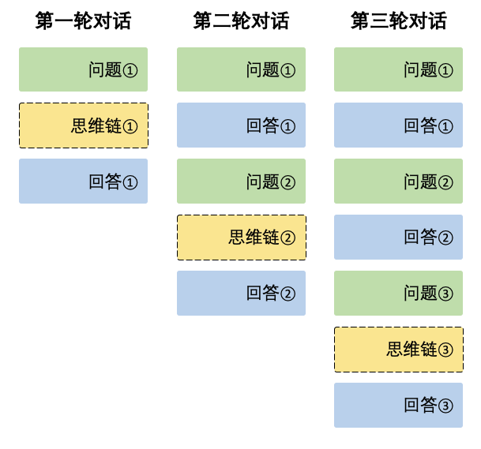

# 本地部署DeepSeek

LLM(Large Language Model)：指使用大量文本数据训练的深度学习模型，使得该模型可以生成自然语言文本或理解语言文本的含义。

## 部署方式（Ollama + Open WebUI + DeepSeek）

### Ollama

Ollama 是一个开源的本地化大语言模型（LLM）部署工具，旨在简化大型语言模型的安装、运行和管理。支持多种流行的大型语言模型，如 Llama2、DeepSeek 等，通过本地部署确保数据隐私，所有处理都在本地设备上完成，不会上传到云端。
Ollama 提供简单直观的命令行工具和 RESTful API 接口，方便开发者快速上手，同时针对不同硬件配置进行了优化，能够充分利用现有资源提供最佳性能。此外，它还支持 Windows、macOS、Linux 等主流操作系统，具有广泛的兼容性。

Ollama 的使用场景非常广泛，尤其适合对数据隐私要求较高的场景。开发者可以在本地环境中快速部署和测试大语言模型，确保敏感信息不离开本地设备，从而满足隐私保护的需求。此外，Ollama 也适用于高性能需求的场景，通过优化配置，能够提供高效的推理性能。其活跃的开源社区提供了丰富的文档和支持，帮助用户更好地使用和管理模型。

安装和使用 Ollama 非常简单。用户可以通过多种方式安装，包括直接下载安装包、通过命令行安装，或者使用 Docker 部署。模型管理也非常便捷，用户可以通过简单的命令行指令拉取、管理和运行模型。此外，Ollama 还支持通过 HTTP API 调用模型，方便与其他应用程序集成，进一步提升了其在实际开发中的灵活性和实用性。

### Open WebUI
Open WebUI 是一款开源的、用于生成式人工智能模型交互的用户界面框架，旨在帮助开发者、研究者和企业快速部署和访问各种 AI 应用，特别是与生成式 AI（如 GPT、图像生成模型等）相关的应用。它提供了一个直观且用户友好的界面，类似于 ChatGPT 的交互体验，支持完全离线运行，确保数据隐私和安全。

Open WebUI 的主要功能包括支持多种生成式 AI 模型，如 OpenAI GPT、Stable Diffusion、Llama 等，并且可以与 Ollama 和 OpenAI 的 API 无缝集成。它还支持本地 RAG（检索增强生成）集成，允许用户将文档、网站和视频等作为上下文信息，供 AI 在回答问题时参考。此外，Open WebUI 提供了全面的 Markdown 和 LaTeX 支持，以及代码语法高亮显示功能，增强了交互体验。

Open WebUI 的特点还包括易于定制的用户界面、灵活的部署方式（支持本地和云部署）、基于角色的访问控制（RBAC）、多语言支持以及持续更新。它还支持网页浏览功能、图像生成集成、语音输入支持等多种扩展功能。

### DeepSeek
DeepSeek-R1 是一款由 DeepSeek 团队开发的高性能推理模型，具备强大的逻辑推理和问题解决能力。该模型通过独特的“深度思考”模式和强化学习技术，能够处理数学、编程、自然语言推理等复杂任务，并在多项基准测试中表现出色。

DeepSeek-R1 的开源性质和高效的资源利用使其成为 AI 领域中值得关注的竞争者。它不仅在性能上与 OpenAI 等领先模型相当，还通过开源策略和低成本的 API 服务，为开发者和企业提供了更具性价比的选择。未来，DeepSeek-R1 有望在教育、科研和办公等领域掀起新的应用热潮。

### 本地部署流程

1. 下载安装 Ollama
   - [Ollama官网](https://ollama.com/)
2. 下载并运行 DeepSeek 模型
   - 在 Ollama 中找到对应模型参数版本后，例如32b的模型，在终端输入 “ollama run deepseek-r1:32b” 命令。此时，Ollama 就会自动开始下载并运行 DeepSeek 模型。
3. 安装 Open WebUI
   - 创建虚拟环境（推荐使用 Conda）：在终端输入 `conda create -n open-webui python=3.11` ，这一步是为 Open WebUI 打造一个专属的运行环境，避免与其他软件产生冲突。
   - 激活虚拟环境：在终端输入 `conda activate open-webui` ，进入 Open WebUI 的 “领地”。
   - 安装 Open WebUI：在终端输入 `pip install open-webui` ，为我们的交互界面做好准备。
   - 启动 Ollama 服务（确保 Ollama 已经在运行）：在终端输入 `ollama` ，让 Ollama 时刻准备好为模型运行提供支持。
   - 启动 Open WebUI 服务：在终端输入 `open-webui serve` ，至此，我们的交互界面已经搭建完成，就等用户来使用啦。
4. 使用 Open WebUI
   - 打开浏览器，访问http://127.0.0.1:8080/ ，首次访问需要创建一个账户并登录。之后，就可以在 Open WebUI 界面中选择 DeepSeek 模型，进行使用。

# DeepSeek使用

- base_url：`https://api.deepseek.com`，兼容OpenAI：`https://api.deepseek.com/v1`
- Authorization：`Bearer <DeepSeek API Key>`
- 流式输出：设置参数`"stream": true`

## deepseek-chat

- `POST https://api.deepseek.com/chat/completions` （`/chat/completions` API 是一个“无状态” API，即服务端不记录用户请求的上下文，用户在每次请求时，需将之前所有对话历史拼接好后，传递给对话 API。）
- API调用方式：设置`model='deepseek-chat'`

[对话模型：DeepSeek-V3](https://api-docs.deepseek.com/zh-cn/api/create-chat-completion)

```java
OkHttpClient client = new OkHttpClient().newBuilder().build();
MediaType mediaType = MediaType.parse("application/json");
RequestBody body = RequestBody.create(mediaType, "{\n  \"messages\": [\n    {\n      \"content\": \"You are a helpful assistant\",\n      \"role\": \"system\"\n    },\n    {\n      \"content\": \"Hi\",\n      \"role\": \"user\"\n    }\n  ],\n  \"model\": \"deepseek-chat\",\n  \"frequency_penalty\": 0,\n  \"max_tokens\": 2048,\n  \"presence_penalty\": 0,\n  \"response_format\": {\n    \"type\": \"text\"\n  },\n  \"stop\": null,\n  \"stream\": false,\n  \"stream_options\": null,\n  \"temperature\": 1,\n  \"top_p\": 1,\n  \"tools\": null,\n  \"tool_choice\": \"none\",\n  \"logprobs\": false,\n  \"top_logprobs\": null\n}");
Request request = new Request.Builder()
  .url("https://api.deepseek.com/chat/completions")
  .method("POST", body)
  .addHeader("Content-Type", "application/json")
  .addHeader("Accept", "application/json")
  .addHeader("Authorization", "Bearer <TOKEN>")
  .build();
Response response = client.newCall(request).execute();
```

## deepseek-reasoner

- API调用方式：设置`model='deepseek-reasoner'`

[推理模型：DeepSeek-R1](https://api-docs.deepseek.com/zh-cn/guides/reasoning_model) ，在输出最终回答之前，模型会先输出一段思维链内容，以提升最终答案的准确性。

### API参数

- 输入参数：
    - `max_tokens`：最终回答的最大长度（不含思维链输出），默认为 4K，最大为 8K。请注意，思维链的输出最多可以达到 32K tokens，控思维链的长度的参数（reasoning_effort）将会在近期上线。
- 输出字段：
    - `reasoning_content`：思维链内容，与 `content` 同级，访问方法见访问样例
    - `content`：最终回答内容
- 上下文长度：API 最大支持 64K 上下文，输出的 reasoning_content 长度不计入 64K 上下文长度中
- 支持的功能：对话补全，对话前缀续写 (Beta)
- 不支持的功能：Function Call、Json Output、FIM 补全 (Beta)
- 不支持的参数：temperature、top_p、presence_penalty、frequency_penalty、logprobs、top_logprobs。
  请注意，为了兼容已有软件，设置 temperature、top_p、presence_penalty、frequency_penalty 参数不会报错，但也不会生效。 设置 logprobs、top_logprobs 会报错。

### DeepSeek对话推理过程

在每一轮对话过程中，模型会输出思维链内容（`reasoning_content`）和最终回答（`content`）。在下一轮对话中，之前轮输出的思维链内容不会被拼接到上下文中：



注意，如果在输入的 messages 序列中，传入了reasoning_content，API 会返回 400 错误。
因此，请删除 API 响应中的 reasoning_content 字段，再发起 API 请求。

### 示例
非流式：
```python
from openai import OpenAI
client = OpenAI(api_key="<DeepSeek API Key>", base_url="https://api.deepseek.com")

# Round 1
messages = [{"role": "user", "content": "9.11 and 9.8, which is greater?"}]
response = client.chat.completions.create(
    model="deepseek-reasoner",
    messages=messages
)

reasoning_content = response.choices[0].message.reasoning_content
content = response.choices[0].message.content

# Round 2
messages.append({'role': 'assistant', 'content': content})
messages.append({'role': 'user', 'content': "How many Rs are there in the word 'strawberry'?"})
response = client.chat.completions.create(
    model="deepseek-reasoner",
    messages=messages
)
# ...
```
流式：
```python
from openai import OpenAI
client = OpenAI(api_key="<DeepSeek API Key>", base_url="https://api.deepseek.com")

# Round 1
messages = [{"role": "user", "content": "9.11 and 9.8, which is greater?"}]
response = client.chat.completions.create(
    model="deepseek-reasoner",
    messages=messages,
    stream=True
)

reasoning_content = ""
content = ""

for chunk in response:
    if chunk.choices[0].delta.reasoning_content:
        reasoning_content += chunk.choices[0].delta.reasoning_content
    else:
        content += chunk.choices[0].delta.content

# Round 2
messages.append({"role": "assistant", "content": content})
messages.append({'role': 'user', 'content': "How many Rs are there in the word 'strawberry'?"})
response = client.chat.completions.create(
    model="deepseek-reasoner",
    messages=messages,
    stream=True
)
# ...
```

## 列出模型

```java
OkHttpClient client = new OkHttpClient().newBuilder().build();
MediaType mediaType = MediaType.parse("text/plain");
RequestBody body = RequestBody.create(mediaType, "");
Request request = new Request.Builder()
  .url("https://api.deepseek.com/models")
  .method("GET", body)
  .addHeader("Accept", "application/json")
  .addHeader("Authorization", "Bearer <TOKEN>")
  .build();
Response response = client.newCall(request).execute();
```

## 查询余额

```java
OkHttpClient client = new OkHttpClient().newBuilder().build();
MediaType mediaType = MediaType.parse("text/plain");
RequestBody body = RequestBody.create(mediaType, "");
Request request = new Request.Builder()
  .url("https://api.deepseek.com/user/balance")
  .method("GET", body)
  .addHeader("Accept", "application/json")
  .addHeader("Authorization", "Bearer <TOKEN>")
  .build();
Response response = client.newCall(request).execute();
```