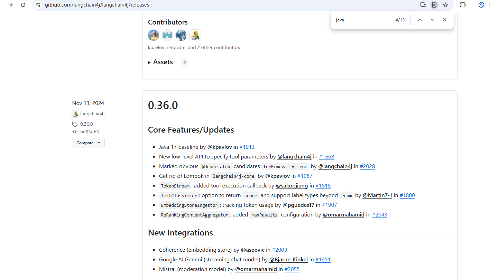

> [https://docs.langchain4j.dev/tutorials/spring-boot-integration/](https://docs.langchain4j.dev/tutorials/spring-boot-integration/)  
> [https://github.com/langchain4j/langchain4j](https://github.com/langchain4j/langchain4j)

# langchain4j支持

## jdk

jdk17+ from version 0.36.0

[Upgrade to JDK 17](https://github.com/langchain4j/langchain4j/pull/1913)

## springboot

对于Spring Boot的集成需要Java 17 和 Spring Boot 3.2.x以上，从版本0.32.0开始

> [https://docs.langchain4j.dev/tutorials/spring-boot-integration#supported-versions](https://docs.langchain4j.dev/tutorials/spring-boot-integration#supported-versions)  
> [New Baseline: Spring Boot 3 and Java 17](https://github.com/langchain4j/langchain4j-spring/pull/24)

## 语言模型

Provider供应商 | 流式 | 工具（同步/流式） | JSON结构（Schema） | JSON模式（Mode） | 支持的模式（输入） | 可观察性 | 可定制HTTP客户端 | 本地部署 | 镜像支持 | 备注
---|---|---|---|---|---|---|---|---|---|---
[OpenAI](https://docs.langchain4j.dev/integrations/language-models/open-ai/) | ✅ | ✅/✅| ✅ | ✅ | 文本, 图片, 音频 | ✅ | ✅ | 兼容: Ollama, LM Studio, GPT4All, 等. | ✅ | 兼容: Groq, 等.
[Ollama](https://docs.langchain4j.dev/integrations/language-models/ollama/) | ✅ | ✅/✅| ✅ | ✅ | 文本, 图片 | ✅ | ✅ | ✅ |  |
[DashScope(Qwen) (阿里百炼)](https://docs.langchain4j.dev/integrations/language-models/dashscope/) | ✅ | ✅/✅|  |  | 文本, 图片, 音频 | ✅ |  |  |  |
[Qianfan(百度千帆)](https://docs.langchain4j.dev/integrations/language-models/qianfan/) | ✅ | ✅/✅|  |  | 文本 |  |  |  |  |
[Zhipu AI(智谱AI)](https://docs.langchain4j.dev/integrations/language-models/zhipu-ai/) | ✅ | ✅/✅|  |  | 文本, 图片 | ✅ |  |  |  |
... |  |  |  |  |  |  |  |  |  |

> [https://docs.langchain4j.dev/integrations/language-models/](https://docs.langchain4j.dev/integrations/language-models/)

