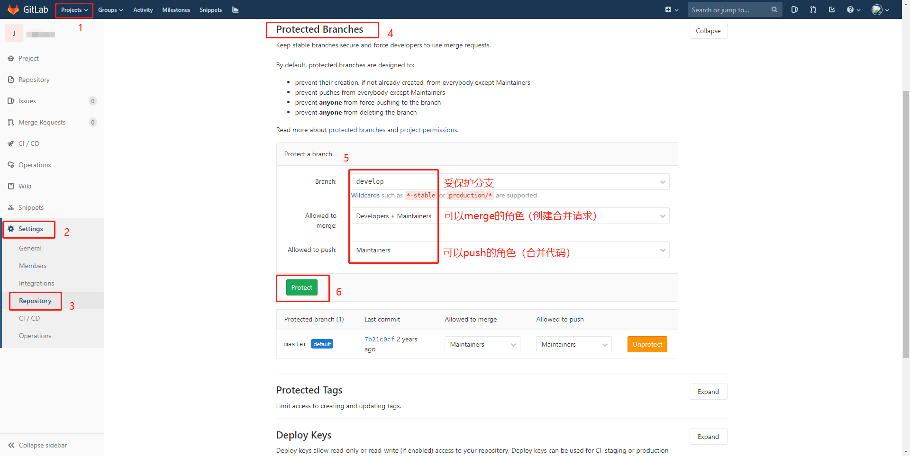
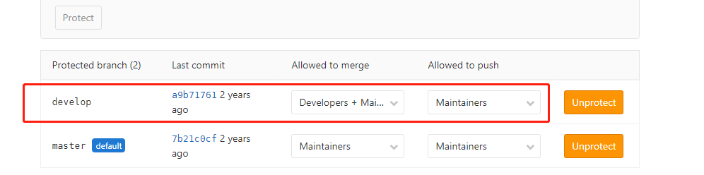
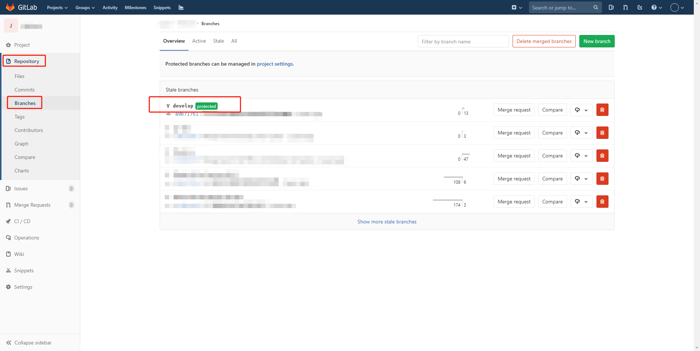
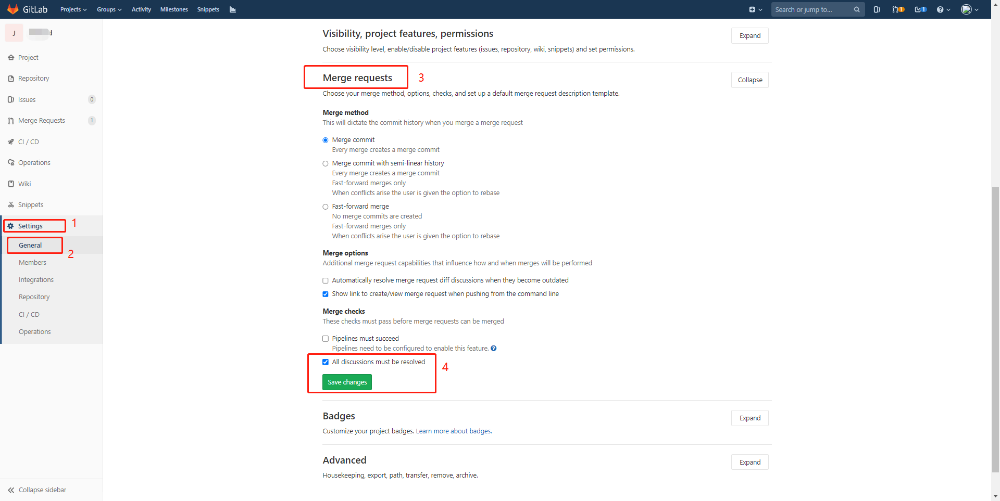

# GitLab权限管理设置

## 角色权限
对于受保护的分支，只有Maintainer、Owner具有Push权限，Developer只能创建Merge Request。利用此角色权限来作[强制代码审查](#强制代码审查)。

## 强制代码审查

### 设置受保护的分支

### 设置多人Review

背景：社区版的GitLab不支持多人review。

可以在提交Merge Request那里选择Assignee跟Reviewer，只能各选一个人，之后在review环节，指定的人review完以后可以再指定一个人继续进行review，从而实现多个人进行review，Assignee再根据review人数来确认是否进行merge。

但是我在GitLab上的Merge Request那里没有review人选项栏，也没找到是否可以在那里设置开启，应该企业版才有Approvers功能。

### 设置Merge前必须解决所有discussions

即review提交的讨论Merge前必选全部关闭。

### 创建及审核Merge Request

[代码提交审核流程](#代码提交审核流程)

# 代码提交审核流程

## 代码开发流程

1. 在公共仓库拉取特性分支：feature-xxx
2. Fork仓库到自己的仓库，拉取特性分支代码到本地。
3. 在自己仓库的特性分支上开发提交，并合并到公共仓库的特性分支。

## 创建Merge Request

1. 创建Merge Request
   
2. 选择特性分支及目标分支
   
3. 提交Merge Request
   
4. 查看Merge Request
   

## 代码review

1. 代码review检查代码，有疑问可以评论提出discussions。
   

## Merge合并代码

1. 具有Maintainer、Owner角色的用户可以看到GitLab右上角标有一个request需要审核。
2. 点击后，审核请求合并的内容。
3. 确认没问题后，点击`Merge`进行合并。
4. 合并成功后，merge请求的`Open`会变成`Merged`。