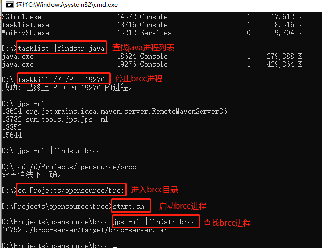

百度开源配置中心


工程：

**demo**
- api密码：123456

# application.yml

```yaml
  rcc:
  # 配置中心服务地址
  cc-server-url: http://127.0.0.1:8086/
  # 工程名称
  project-name: lp-demo
  # 工程的api密码，创建工程时指定
  cc-password: 123456
  # 环境名称
  env-name: dev
  # 版本名称
  cc-version-name: 1.0.0
  # 是否在日志中打印配置
  log-properties: true
  # 是否自动更新
  enable-update-callback: true
  # 非必须参数
  # 心跳探测频率（ms），默认2000
#  callback-inteval: 1500
  # 链接超时时间（ms），默认3000
#  connection-timeout: 3000
  # 读超时时间（ms），默认10000
#  read-timeout: 7000
  # 实例上报，采集应用名称
#  app-name: lp-demo
  # 实例容器ID上报，容器ID对应的环境变量
#  container-id-env-name: ${java.rmi.server.hostname}
  # 实例机房信息上报，机房名称对应的环境变量
#  idc-env-name: null
  # 实例IP上报，是否只允许上报局域网IP
#  use-only-site-local-interfaces: true
  # 上报IP来源网卡(如en0)列表，英文逗号分隔
#  preferred-networks:
  # 实例IP上报，上报IP来源忽略网卡列表，英文逗号分隔
#  ignored-interfaces:
```

```yaml
spring:
  datasource:
    url: jdbc:mysql://localhost:3306/demo?useUnicode=true&characterEncoding=utf-8&serverTimezone=Asia/Shanghai
    driver-class-name: com.mysql.cj.jdbc.Driver
    username: root
    password: 123456
    druid:
      initial-size: 5
      min-idle: 10
      max-active: 20
      web-stat-filter:
        exclusions: "*.js,*.gif,*.jpg,*.png,*.css,*.ico,/druid/*"
      stat-view-servlet:
        login-username: druid
        login-password: druid
```

# 本地启动



- `jps -ml |findstr brcc`
- `tasklist |findstr java`
- `taskkill /F /PID 16752`

1. 启动


2. 查看进程：

   - jps -ml |grep brcc

     

   - tasklist |grep java

     

3. 停止服务：kill -9 [ps -ef]

# Issues

## 自适配过程

1. 分组只是物理上分开，实质上，各分组中的参数都属于某一版本，若是分组中存在相同的参数不同值的配置，则只会保留一份：分组Id靠前的参数（即：多个分组存在相同配置不同值时，分组Id靠前的配置会覆盖掉后边所有配置。）


2. 
3. 

## github提出的

### 版本：1.0.1

1. 不支持公共配置，多个项目的相同配置当前需要在各个项目中都配置一份。
   - 官方回答：public工程配置功能在规划中。。
   - [https://github.com/baidu/brcc/issues/51](https://github.com/baidu/brcc/issues/51)
2. 相同的key会覆盖yml里的配置，当前brcc的顺序是在yml配置文件之前,。
   - [https://github.com/baidu/brcc/issues/50](https://github.com/baidu/brcc/issues/50)
3. 
4. 

