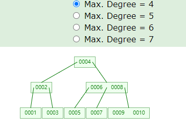
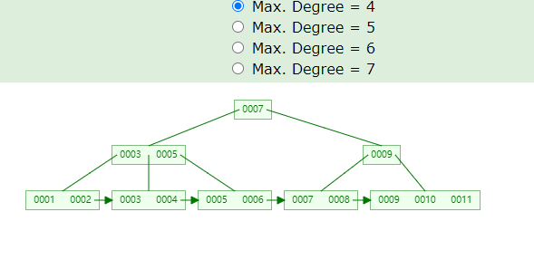

> [MySQL 8 Cookbook]()  
> [mysql8.0官方文档](https://dev.mysql.com/doc/refman/8.0/en/)  
> [MySQL必知必会](../../resources/static/doc/MySQL必知必会.pdf)  
> [ShardingSphere.pdf](../../resources/static/doc/shardingsphere_docs_cn.pdf)  

# 目录
- [mysql常用函数](#mysql常用函数)
    - [删除重复数据只留一条](#删除重复数据只留一条)
    - [表数据差集（表t1-表t2）](#表数据差集（表t1-表t2）)
- [mysql使用](#mysql使用)
    - [连接mysql](#连接mysql)
    - [数据定义语言DDL](#数据定义语言DDL)
        - [库操作](#库操作)
        - [表操作](#表操作)
    - [数据操作语言DML](#数据操作语言DML)
        - [插入](#插入)，[修改](#修改)，[删除](#删除)，[查询](#查询)
    - [存储过程](#存储过程)，[函数](#函数)，[游标](#游标)，[触发器](#触发器)，[视图](#视图)，[事件](#事件)
- [事务](#事务)
    - [事务处理](#事务处理)
    - [隔离级别](#隔离级别)
    - [锁](#锁)
- [二进制日志](#二进制日志)
    - [二进制日志操作](#二进制日志操作)
    - [二进制日志格式](#二进制日志格式)
    - [从二进制日志中提取语句 TODO](#从二进制日志中提取语句)
- [备份与恢复](#备份与恢复)
    - [备份](#备份) ([mysqldump备份](#使用mysqldump备份)，[二进制日志备份](#使用二进制日志备份))
    - [恢复](#恢复) ([从mysqldump恢复](#从mysqldump恢复)，[从普通文件备份中恢复](#从普通文件备份中恢复)，[执行时间点恢复](#执行时间点恢复))
- [复制](#复制)
- [性能优化](#性能优化)
    - [优化顺序](#优化顺序)
    - [存储引擎](#存储引擎) ([InnoDB](#InnoDB)，[MyISAM](#MyISAM))
    - [explain](#explain)
    - [索引](#索引)
        - [什么时候使用索引](#什么时候使用索引)
        - [使用索引注意](#使用索引注意)
        - [添加索引](#添加索引)
        - [删除索引](#删除索引)
    - [慢查询日志](#慢查询日志)
    - [优化数据类型](#优化数据类型)
    - [分库分表](#分库分表)
        - [分表](#分表)
        - [分库](#分库)
        - [分库分表中间件](#分库分表中间件)
    
- [阿里MySQL规约](#阿里MySQL规约)
    - [阿里建表规约](#阿里建表规约)
    - [阿里索引规约](#阿里索引规约)
    - [阿里SQL规约](#阿里SQL规约)
    - [阿里ORM规约](#阿里ORM规约)

[返回目录](#目录)

# mysql常用函数

- **转换为小写[lower]、转换为大写[upper]：**  
`select lower('ABC'), upper('abc') from dual; => abc,ABC`
- **返回字符串长度[length]：**  
`select length('abc') from dual; => 3`
- **左填充[lpad]，右填充[rpad]：**  
`SELECT RPAD(LPAD('abc',5,'*'),8,'*') FROM DUAL; => **abc***`
- **去除字符串两端空格[trim]，去除左边[ltrim]，去除右边[rtim]：**  
`SELECT TRIM(' ABC ') FROM DUAL; => 'ABC' ; `  
`SELECT TRIM('s' FROM 'strings') FROM DUAL; => tring`  
`SELECT LTRIM(' ABC ') FROM DUAL; => 'ABC ' ; `  
`SELECT RTRIM(' ABC ') FROM DUAL; => ' ABC' ; `  
- **获取子字符串[substr]：**  
`SELECT SUBSTR('ABCDEF',2,3) FROM DUAL; => BCD  --从第2个位置开始取3个`
- **字符串替换[replace]：**  
`SELECT REPLACE('aabbcc','bb','dd') FROM DUAL;  => aaddcc`
- **绝对值[abs]：**  
`SELECT ABS(100),ABS(-100) FROM DUAL; => 100 100`
- **平均值[avg]：**  
`SELECT AVG(DISTINCT age) FROM tableName;  --对不同的值求平均值`  
`SELECT AVG(ALL age) FROM tableName;  --对所有值求平均值`  
- **最大值[max]，最小值[min]：**  
`SELECT MAX(DISTINCT age) FROM tableName;`  
`SELECT MAX(ALL age) FROM tableName; `  
`SELECT MIN(DISTINCT age) FROM tableName;`  
`SELECT MIN(ALL age) FROM tableName;`  
- **四舍五入[round],按照指定精度截取[trunc]：**  
`SELECT ROUND(5.5),ROUND(-5.5) FROM DUAL; => 6,-6`  
`SELECT TRUNC(5.5),TRUNC(-5.5) FROM DUAL; => 5,-5`  
`SELECT trunc(123.4567,-2) trunc1,trunc(123.4567,2) from dual; => 100,123.45`  
- **判断正负[sign]：**  
`SELECT SIGN(10),SIGN(-10),SIGN(0) FROM DUAL;  => 1,-1,0`
- **向上取整[ceil]，向下取整[floor]：**  
`SELECT CEIL(12.34) FROM DUAL;  => 13`
`SELECT FLOOR(12.34) FROM DUAL;  => 12`
- **余数[mod]：**  
`SELECT MOD(5,2),MOD(5,5),MOD(2,5) FROM DUAL;  => 1,0,2`
- **返回根[sqrt]：**  
`SELECT SQRT(9) FROM DUAL; => 3`
- **增加/减去月份[PERIOD_ADD]/返回两个月份差值[PERIOD_DIFF]：**  
`SELECT PERIOD_ADD('201801',2) from dual; => 201803`  
`SELECT PERIOD_ADD('201801',-2) from dual; => 201711`  
`SELECT PERIOD_DIFF('201801','201805') from dual; => -4`  
- **返回当前时间[NOW()]：**  
`SELECT NOW() from dual;  => 2018-07-26 20:13:44`
- **返回日期最后一天[last_day]：**  
`SELECT last_day(now()) from dual;  => 当前月最后一天：2018-07-31`
- **时间转换为字符串[date_format]：**  
`select date_format(now(), '%Y%m%d') from dual;  => 20180102`
- **字符串转换为日期格式[str_to_date]：**  
`SELECT str_to_date('20171226','%Y%m%d') from dual; => 2017-12-26`  
`SELECT CAST("2017-08-29" AS DATE); => 2017-08-29`  
- **将字符转换为数字[to_number]：**  
`SELECT '2018'+0 from dual; => 2018`  
`SELECT CONVERT('2018',SIGNED); => 2018`  
- **格式化数字[FORMAT(x,n)],将 x 保留到小数点后 n 位，最后一位四舍五入：**  
`SELECT FORMAT(250500.5634, 2) from dual; => 250,500.56`
- **排序[order by]：**  
`SELECT age,height FROM tableName ORDER BY age,height DESC; => age升序height降序`
- **自定义排序[FIELD(str,str1,str2,str3,...)]：**  
`SELECT age,height FROM tableName ORDER BY FIELD(age, 20, 15, 30),height DESC; => age按20-15-30排序height降序`
- **分组[group by]，分组条件[having]：**  
`SELECT deptno,avg(sal) FROM tableNmae GROUP BY deptno HAVING avg(sal)>1000;  => 查询平均工资大于1000的部门编号和平均工资`
- **返回指定字符的ASCII值[ascii]，返回指定数字对应字符[char]：**  
`SELECT ascii('A'), ascii('a'), char(66) from dual; =>65,97,B`
- **返回指定字符的位置[LOCATE、instr、find_in_set]：**  
`SELECT LOCATE('d','abcdefgd',5); =>8 (第5位后 d 的位置)`  
`SELECT instr('abcdefgd','d') from dual; =>4`  
`SELECT find_in_set('d','a,b,c,d,e,f,g,d'); =>4`  
- **字符串翻转[REVERSE ]：**  
`SELECT REVERSE('abcdefgd'); =>dgfedcba`
- **case when:**  
`SELECT CASE WHEN sex = '1' THEN '男' WHEN sex = '2' THEN '女' ELSE '其他' END from tableName;`
- **ifnull<=>oracle的nvl:**  
`SELECT ifnull('a','b') from dual; => a不为null返回a,a为null返回b`
- **连接:**  
`SELECT concat('a','b','c') from dual; => abc `
- **分组合并:group_concat**
```mysql
# group_concat( [distinct] 要连接的字段 [order by 排序字段 asc/desc ] [separator '分隔符'] )

SELECT parent_id, GROUP_CONCAT(distinct a.region_id order by a.region_id asc separator ';') GROUP BY parent_id
# 按parent_id分组，查出同一parent_id下的region_id，region_id正序排序，用;隔开

# 最大值限制GROUP_CONCAT() 是有最大长度限制的，默认值是 1024。当总长度达到 1024 后，后面的记录就被截断掉。
# 可以通过 group_concat_max_len 参数进行动态设置。参数范围可以是 Global 或 Session
# 如果类型 group_concat_max_len 的值被设置为小等于 512，那么 GROUP_CONCAT 的返回值类型是 VARCHAR 或 VARBINARY；否则是 TEXT 或 BLOB。
# 实际上，group_concat_max_len 的值可以设置非常大，但会受到参数max_allowed_packet 的限制。
```
- **时间:**  
```mysql
select NOW(); # 当前时间 2022-06-20 10:05:41
select CURDATE(); # 当前日期 2022-06-20
select CURRENT_DATE; # 当前日期 2022-06-20
select CURRENT_TIME; # 当前时间 10:05:41
select CURTIME(); # 当前时间 10:05:41

# 加上一个时间：date_add()
select date_add(now(), interval 1 year);        -- 加1年 2023-06-20 10:05:41
select date_add(now(), interval 1 quarter);     -- 加1季 2022-09-20 10:05:41
select date_add(now(), interval 1 month);       -- 加1月 2022-07-20 10:05:41
select date_add(now(), interval 1 week);        -- 加1周 2022-06-27 10:05:41
select date_add(now(), interval 1 day);         -- 加1天 2022-06-21 10:05:41
select date_add(now(), interval 1 hour);        -- 加1小时 2022-06-20 11:05:41
select date_add(now(), interval 1 minute);      -- 加1分钟 2022-06-20 10:06:41
select date_add(now(), interval 1 second);      -- 加1秒 2022-06-20 10:05:42
select date_add(now(), interval 1 microsecond); -- 加1毫秒 2022-06-20 10:05:41.000001

# 减去一个时间：date_sub()
select date_add(now(), interval -1 day);         -- 减1天 2022-06-19 10:05:41
select date_sub(now(), interval 1 day);          -- 减1天 2022-06-19 10:05:41

# 日期相差：datediff()
select datediff('20220620','20220611');    -- 相差几天 9

# 时间相差：timediff()
select timediff('2022-06-20 12:30:00', '2022-06-20 12:00:30');    -- 00:29:30
select timediff('12:30:00', '12:00:30');                          -- 00:29:30

```

## 删除重复数据只留一条
```mysql
DELETE 
FROM
	t_table_name 
WHERE
	id NOT IN (
	SELECT
		t.id 
	FROM
		(
		SELECT
			max( id ) AS id 
		FROM
            t_table_name 
		WHERE
            条件1 = 123456 
			AND 条件2 = 123465 
		GROUP BY
			重复字段
		HAVING
			count( 重复字段 ) >= 1 
		) t 
	)
```

## 表数据差集（表t1-表t2）
```mysql
select t_tmp_3.k1 from
    (
        SELECT DISTINCT concat(t1.a, t1.b) k1
        FROM
            t_table_name_1 t1
        where t1.a = '0'
    ) t_tmp_3
        
    LEFT JOIN
        
    (
        SELECT DISTINCT concat(t2.a, t2.b) k2
        FROM
            t_table_name_2 t2
        where t2.a = '0'
    ) t_tmp_4
    on t_tmp_3.k1 = t_tmp_4.k2
where t_tmp_4.k2 is null
```

## 将A表的a字段更新到B表的b字段上,两个表通过c字段关联
```mysql
UPDATE B
INNER JOIN A ON A.c = B.c
SET B.b = A.a;
```
```mysql
UPDATE B
JOIN (
    SELECT c, GROUP_CONCAT(a) AS grouped_a
    FROM A
    GROUP BY c
) AS A_grouped
ON B.c = A_grouped.c
SET B.b = A_grouped.grouped_a;
```

## 从一个表中查出数据并插入到另一个表
```mysql
-- 只导入来源表部分字段到目标表
insert into t_target(字段1, 字段2, 字段3)
select 字段1, 字段2, 字段3 from t_source;

-- 只导入目标表中不存在的数据
insert into t_target (字段1, 字段2)  
select 字段1, 字段2  from t_source  
where not exists (select * from t_target where t_target.比较字段 = t_source.比较字段);
```

## SQL补全权限表parent_id
```mysql
UPDATE permission p
LEFT JOIN permission parent 
    ON parent.url = LEFT(p.url, LENGTH(p.url) - LOCATE('/', REVERSE(p.url)))
SET p.parent_id = COALESCE(parent.id, 0)
where p.type = 2
;
-- 提取父路径：使用字符串函数LEFT(p.url, LENGTH(p.url) - LOCATE('/', REVERSE(p.url)))从当前URL中截取父路径。REVERSE反转URL后查找第一个'/'的位置，对应原URL中最后一个'/'的位置，截取该位置之前的部分即为父路径。
-- 关联父权限：通过LEFT JOIN将当前权限表与自身（作为父权限）关联，匹配条件为当前记录的父路径等于父权限的URL。
-- 设置parent_id：使用COALESCE函数，若找到对应的父权限，则设置parent_id为父权限的id；若未找到（父路径不存在于表中），则设置为0。

-- id	permission_name	url	        parent_id
-- 1	信息1	        /b/m	    0
-- 2	信息2	        /b/m/c	    1
-- 3	信息3	        /b/m/d	    1
-- 4	信息4	        /b/m/d/a	3
```

[返回目录](#目录)

# mysql使用
## 连接mysql
`mysql -h localhost -P 3306 -u root -p`
- 查看当前用户：`whoami`
- 断开连接：`exit;` 或者`Ctrl+D`
- 撤销命令：`\c` 或者`Ctrl+C`

[返回目录](#目录)

## 数据定义语言DDL
操作数据库和表
### 库操作
- 创建数据库：`create database company`
    - 名称包含特殊字符：```create database `my.contacts` ```
- 切换数据库：`use company`
- 列出所有库：`show databases;`
- 查看链接到了哪个库：`select database();`

[返回目录](#目录)

### 表操作
- 数据类型：
    - 数字：`TINYINT、SMALLINT、MEDIUMINT、INT、BIGINT、BIT`
    - 浮点数：`DECIMAL、FLOAT、DOUBLE`
    - 字符串：`CHAR、VARCHAR、BINARY、VARBINARY、BLOB、TEXT、ENUM、SET`
    - JSON数据类型
- 创建表：
    ```mysql
    CREATE TABLE IF NOT EXISTS `company`.`customers` (
      `id` int unsigned AUTO_INCREMENT,
      `first_name` varchar(20) DEFAULT NULL COMMENT '名',
      `last_name` varchar(20) DEFAULT NULL COMMENT '姓',
      `country` varchar(20) DEFAULT NULL COMMENT '国家',
      PRIMARY KEY (`id`)
    ) ENGINE=InnoDB AUTO_INCREMENT=9 DEFAULT CHARSET=utf8 COMMENT='用户表';
    ```
- 查看所有存储引擎：`show engines\G`
- 列出所有表：`show tables;`
- 查看表结构：`show create table customers\G` 或者：`desc customers;`
- 克隆表结构：`create table new_customers like customers;`

### 阿里建表规约
1. 【强制】表达是与否概念的字段，必须使用is_xxx的方式命名，数据类型是unsigned tinyint（ 1表示是，0表示否），此规则同样适用于odps建表。 
    - 说明：任何字段如果为非负数，必须是unsigned。
2. 【强制】表名、字段名必须使用小写字母或数字；禁止出现数字开头，禁止两个下划线中间只出现数字。
    - 数据库字段名的修改代价很大，因为无法进行预发布，所以字段名称需要慎重考虑。 
    - 正例：getter_admin，task_config，level3_name 
    - 反例：GetterAdmin，taskConfig，level_3_name
3. 【强制】表名不使用复数名词。 
    - 说明：表名应该仅仅表示表里面的实体内容，不应该表示实体数量，对应于DO类名也是单数形式，符合表达习惯。
4. 【强制】禁用保留字，如desc、range、match、delayed等，请参考MySQL官方保留字。
5. 【强制】唯一索引名为uk_字段名；普通索引名则为idx_字段名。 
    - 说明：uk_ 即 unique key；idx_ 即index的简称。
6. 【强制】小数类型为decimal，禁止使用float和double。 
    - 说明：float和double在存储的时候，存在精度损失的问题，很可能在值的比较时，得到不正确的结果。如果存储的数据范围超过decimal的范围，建议将数据拆成整数和小数分开存储。
7. 【强制】如果存储的字符串长度几乎相等，使用char定长字符串类型。
8. 【强制】varchar是可变长字符串，不预先分配存储空间，长度不要超过5000，如果存储长度大于此值，定义字段类型为text，独立出来一张表，用主键来对应，避免影响其它字段索引效率。
9. 【强制】表必备三字段：id, gmt_create, gmt_modified。 
    - 说明：其中id必为主键，类型为unsigned bigint、单表时自增、步长为1。gmt_create, gmt_modified的类型均为date_time类型。
10. 【推荐】表的命名最好是加上“业务名称_表的作用”。 
    - 正例：tiger_task / tiger_reader / mpp_config
11. 【推荐】库名与应用名称尽量一致。
12. 【推荐】如果修改字段含义或对字段表示的状态追加时，需要及时更新字段注释。
13. 【推荐】字段允许适当冗余，以提高性能，但是必须考虑数据同步的情况。冗余字段应遵循：
    - 1）不是频繁修改的字段。 
    - 2）不是varchar超长字段，更不能是text字段。 
    - 正例：商品类目名称使用频率高，字段长度短，名称基本一成不变，可在相关联的表中冗余存储类目名称，避免关联查询。
14. 【推荐】单表行数超过500万行或者单表容量超过2GB，才推荐进行分库分表。 
    - 说明：如果预计三年后的数据量根本达不到这个级别，请不要在创建表时就分库分表。
15. 【参考】合适的字符存储长度，不但节约数据库表空间、节约索引存储，更重要的是提升检索速度。 
    - 正例：人的年龄用unsigned tinyint（表示范围0-255，人的寿命不会超过255岁）；海龟就必须是smallint，但如果是太阳的年龄，就必须是int；如果是所有恒星的年龄都加起来，那么就必须使用bigint。

[返回目录](#目录)

## 数据操作语言DML
- `insert、update、delete、select`表数据操作

### 插入
```mysql
insert ignore into `company`.`customers`(first_name,last_name,country)
values
{'mike','Christensen','USA'},
{'Andy','Hollands','Australia'},
{'Ravi','Vedantam','India'},
{'Rajiv','Perera','Sri Lanka'};
```
- `ignore`：如果该行已经存在，并给出了`ignore`子句，则新数据将被忽略。
- 处理重复项：
    - `replace`：行存在则删除行并插入新行，行不存在则replace<=>insert。
        - `replace into customers values {1,'mike','Christensen','Australia'};`
    - 使用`on duplicate key update`：行已存在，并且主键重复，则更新已有行。
        - `insert into customers values {1,'mike','Christensen','India'} on duplicate key update country=country+values(country);`

- **全部插入**
    ```mysql
    insert into `t_dept_manager`(emp_no,emp_name,emp_status) (select emp_no,emp_name,'on' from t_departments)
    ```

[返回目录](#目录)

### 修改
```mysql
update customers set first_name='Rajiv',last_name='UK' where id=4;
```

[返回目录](#目录)

### 删除
```mysql
delete from customers where id=4 and first_name='Rajiv';
```
- 删除表的所有行最快方法是使用`truncating table`，该操作属于DDL操作，一旦数据清空就不能回滚了。
    - `truncating table customers;`

[返回目录](#目录)

### 查询
- 查询表`departments`所有数据：`select * from departments;`
- 查询表`employees`员工数量：`select count(*) from employees;`
- 查询表`employees`中first_name为a，且last_name为b的员工emp_no：`select emp_no from employees where first_name='a' and last_name='b';`
- **in:** 找出姓氏为a、b、c的所有员工数：`select count(*) from employees where last_name in ('a','b','c');`
- **between...and:** 找出2000年12月入职的所有员工数：`select count(*) from employees where hire_date between '2000-12-01' and '2000-12-31';`
- **not:** 找出不是在2000年12月入职的所有员工数：`select count(*) from employees where hire_date not between '2000-12-01' and '2000-12-31';`
- **%:** 模糊匹配，找出名字以a开头的员工数：`select count(*) from employees where first_name like 'a%';`
    - 找出名字以a开头c结尾的员工数：`select count(*) from employees where first_name like 'a%c';`
    - 找出名字包含b的员工数：`select count(*) from employees where first_name like '%b%';`
- **_:** 精准匹配一个字符，找出名字以任意两个字符开头、后跟随ab、后再跟随任意字符的员工数：`select count(*) from employees where first_name like '__ab%';`
- **正则：**

|符号|说明|
|---|---|
| * | 0次或多次重复 |
| + | 1次或多次重复 |
| ? | 可选字符 |
| . | 任何字符 |
| \. | 区间 |
| ^ | 以...开始 |
| $ | 以...结束 |
| [abc] | 只有a、b、c |
| [^abc] | 不包含a、b、c |
| [a-z] | 字符a-z |
| [0-9] | 数字0-9 |
| \d | 任何数字 |
| \D | 任何非数字字符 |
| \s | 任何空格 |
| \S | 任何非空白字符 |
| \w | 任何字母或数字 |
| \W | 任何非字母和数字 |
| {m} | m次重复 |
| {m,n} | m-n次重复 |
    - 找出名字以a开头的所有员工数：`select count(*) from employees where first_name RLIKE '^a';`
    - 找出名字以bc结尾的所有员工数：`select count(*) from employees where first_name REGEXP 'bc$';`
    - 找出名字不包含abc的所有员工数：`select count(*) from employees where first_name NOT REGEXP '[abc]';`

- **limit:** 找出在2000年之前入职的任意10个员工：`select first_name,last_name from employees where hire_date < '2000-01-01' limit 10;`
- **order by:** 找出薪水最高的前5个员工：`select emp_no,salary from salaries order by salary desc limit 5;` `desc,asc`
- **group by:** 找出男、女员工数：`select gender,count(*) as count from employees group by gender;`
    - 找出最常见5个名字及个数：`select first_name,count(first_name) as count from employees group by first_name order by count desc limit 5;`
- **sum:** 找出每年给员工薪水总额，并按薪水高低倒序：`select YEAR(from_date),SUM(salary) as sum from salaries group by YEAR(from_date) order by sum desc;`
- **average:** 找出平均工资最高的10个员工：`select emp_no,AVG(salary) as avg from salaries group by emp_no order by avg desc limit 10;`
- **having:** 找出平均工资超过10000的员工：`select emp_no,AVG(salary) as avg from salaries group by emp_no having avg>100000 order by avg desc;`
- **distinct:** 找出所有title，去重：`select distinct title from titles;`
- **表关联**
    - 部门表：`departments`，员工表：`employees`，员工-部门映射表：`dept_manager`
    - **join：** 找到员工号为110022的姓名和部门编码：
        ```mysql
        select 
            emp.emp_no,emp.first_name,emp.last_name,dept.dept_name 
        from 
            employees as emp
        join dept_manager as dept_mgr on emp.emp_no=dept_mgr.emp_no and emp.emp_no=110022
        join departments as dept on dept_mgr.dept_no=dept.dept_no;
        ```
    - 找出每个部门的平均工资：
        ```mysql
        select 
          dept_name,AVG(s.salary) as avg_salary
        from 
          salaries as s
        join dept_emp as de on s.emp_no=de.emp_no
        join departments as dept on de.dept_no=dept.dept_no
        group by de.dept_no
        order by avg_salary
        desc;
        ```
- **子查询：**
    - 找出工资最高的员工：
        ```mysql
        select emp_no from salaries where salary=(select MAX(salary) from salaries);
        ```
    - 找出表list1有，表list2没有的员工：
        ```mysql
        select * from employees_list1 where emp_no not in(select emp_no from employees_list2);
        #或者
        select l1.* from employees_list1 as l1 
        left join employees_list2 l2 on l1.emp_no=l2.emp_no
        where l2.emp_no is null;
        ```

### 阿里SQL规约
1. 【强制】不要使用count(列名)或count(常量)来替代count(*)。
    - count(*)就是SQL92定义的标准统计行数的语法，跟数据库无关，跟NULL和非NULL无关。 
    - 说明：count(*)会统计值为NULL的行，而count(列名)不会统计此列为NULL值的行。
2. 【强制】count(distinct col) 计算该列除NULL之外的不重复数量。
    - 注意 count(distinct col1, col2) 如果其中一列全为NULL，那么即使另一列有不同的值，也返回为0。
3. 【强制】当某一列的值全是NULL时，count(col)的返回结果为0，但sum(col)的返回结果为NULL，因此使用sum()时需注意NPE问题。 
    - 正例：可以使用如下方式来避免sum的NPE问题：`SELECT IF(ISNULL(SUM(g)),0,SUM(g)) FROM table;`
4. 【强制】使用ISNULL()来判断是否为NULL值。
    - 注意：NULL与任何值的直接比较都为NULL。 
    - 说明： 
        - 1） NULL<>NULL的返回结果是NULL，而不是false。
        - 2） NULL=NULL的返回结果是NULL，而不是true。 
        - 3） NULL<>1的返回结果是NULL，而不是true。
5. 【强制】 在代码中写分页查询逻辑时，若count为0应直接返回，避免执行后面的分页语句。
6. 【强制】不得使用外键与级联，一切外键概念必须在应用层解决。
    - 说明：（概念解释）学生表中的student_id是主键，那么成绩表中的student_id则为外键。如果更新学生表中的student_id，同时触发成绩表中的student_id更新，则为级联更新。外键与级联更新适用于单机低并发，不适合分布式、高并发集群；级联更新是强阻塞，存在数据库更新风暴的风险；外键影响数据库的插入速度。
7. 【强制】禁止使用存储过程，存储过程难以调试和扩展，更没有移植性。
8. 【强制】数据订正时，删除和修改记录时，要先select，避免出现误删除，确认无误才能执行更新语句。
9. 【推荐】in操作能避免则避免，若实在避免不了，需要仔细评估in后边的集合元素数量，控制在1000个之内。
10. 【参考】如果有全球化需要，所有的字符存储与表示，均以utf-8编码，那么字符计数方法注意： 
    - 说明： 
        - SELECT LENGTH("轻松工作")； 返回为12 
        - SELECT CHARACTER_LENGTH("轻松工作")； 返回为4 
        - 如果要使用表情，那么使用utfmb4来进行存储，注意它与utf-8编码的区别。
11. 【参考】 TRUNCATE TABLE 比 DELETE 速度快，且使用的系统和事务日志资源少，但TRUNCATE无事务且不触发trigger，有可能造成事故，故不建议在开发代码中使用此语句。 
    - 说明：TRUNCATE TABLE 在功能上与不带 WHERE 子句的 DELETE 语句相同。

[返回目录](#目录)

## 存储过程
- 示例：添加新员工：
    ```mysql
    drop procedure if exists create_employee;
    delimiter $$
    create procedure create_employee(OUT new_emp_no INT, IN first_name varchar(20), IN last_name varchar(20), IN gender enum('M','F'), IN birth_date date, IN emp_dept_name varchar(40), IN title varchar(50))
    BEGIN 
        declare emp_dept_no char(4);
        declare salary int default 60000;
    
        select max(emp_no) into new_emp_no from employees;
        set new_emp_no = new_emp_no + 1;
        insert into employees values(new_emp_no, birth_date,first_name,last_name,gender,CURDATE());
        
        select emp_dept_name;
        select dept_no into emp_dept_no from departments where dept_name = emp_dept_name;
        select emp_dept_no;
    
        insert into dept_emp values(new_emp_no,emp_dept_no,CURDATE(),'9999-01-01');
        insert into titles values(new_emp_no,title,CURDATE(),'9999-01-01');
    
        if title = 'Staff' then
            set salary = 100000;
        elseif title = 'Senior Staff' then
            set salary = 120000;
        end if;
    
        insert into salaries values(new_emp_no, salary,CURDATE(),'9999-01-01');
    END $$
    delimiter ;
    
    -- 调用
    call create_employee(@new_emp_no,'John','Smith','M','1984-06-19','Research','Staff');
    -- 查询存储在@new_emp_no变量中的emp_no值
    select @new_emp_no;
    ```

[返回目录](#目录)

## 函数
- 类似存储过程，区别：函数应该有返回值，并且可以在select中调用函数。通常创建函数是为了简化复杂的计算。
- 示例：根据客户收入水平给出信用卡额度：
    ```mysql
    drop function if exists get_sal_level;
    delimiter $$
    create function get_sal_level(emp int) returns varchar(10)
    deterministic 
    BEGIN 
        declare sal_level varchar(10);
        declare avg_sal float;
        
        select avg(salary) into avg_sal from salaries where emp_no=emp;
        
        if avg_sal < 50000 then
            set sal_level = 'BRONZE';
        elseif (avg_sal >= 50000 and avg_sal < 70000) then
            set sal_level = 'SILVER';
        elseif (avg_sal >= 70000 and avg_sal < 90000) then
            set sal_level = 'GOLD';
        elseif (avg_sal >= 90000) then
            set sal_level = 'PLANTINUM';
        else 
            set sal_level = 'NOT FOUND';
        end if;
        
        return (sal_level);
    END $$
    delimiter ;
    
    -- 调用
    select get_sal_level(10002);
    ```

[返回目录](#目录)

## 游标
- 游标对少量数据可以(千百条)，大量数据(万级以上)避免使用游标，速度慢或可能报错，可以使用临时表替代。
- 示例：遍历表数据：
    ```mysql
    drop procedure if exists get_info;
    delimiter $$
    create procedure get_info(IN start_time INT, IN end_time INT)
    BEGIN 
        declare t_id int default '';
        declare t_name varchar(64) default ''; 
        declare status int default 0;
    
        declare cur cursor for select id,name from t_result_info where hire_date between start_time and end_time;
        declare continue handler for sqlstate '02000' set status = 1;
          
        open cur;
        label:LOOP 
          fetch cur into t_id,t_name;
          if status = 1 then
              leave label;
          end if;
          
        end LOOP;
        close cur;
    END $$
    delimiter ;
    
    -- 调用
    call get_info(1984,1988);
    ```
- 使用**临时表**代替游标
    ```mysql
    drop procedure if exists get_info;
    delimiter $$
    create procedure get_info(IN start_time INT, IN end_time INT)
    BEGIN 
        declare t_id varchar(16) default '';
        declare t_name varchar(64) default ''; 
        declare count int default 0;
        declare i int default 1;
          
        drop table if exists t_result_tmp;
        CREATE TEMPORARY TABLE IF NOT EXISTS t_result_tmp (
          `tmp_id` int NOT NULL,
          `tmp_name` varchar(64) NOT NULL,
          PRIMARY KEY (`tmp_id`)
        ) ENGINE=InnoDB DEFAULT CHARSET=utf8;
        
        set @sqlstmt = concat('insert into t_result_tmp(`tmp_id`,`tmp_name`) (select id,name from t_result_info where hire_date between ',start_time ,' and ', end_time, ');');
        prepare stmt from @sqlstmt;
        execute stmt;
        deallocate prepare stmt;
    
        select min(`tmp_id`) into i from t_result_tmp;
        select max(`tmp_id`) into count from t_result_tmp;
    
        while i <= count do
          select tmp_id,tmp_name into t_id,t_name from t_result_tmp where tmp_id = i;
          set i = i + 1;
        end while;
    END $$
    delimiter ;
    
    -- 调用
    call get_info(1984,1988);
    ```

[返回目录](#目录)

## 触发器
- 用于在触发事件之前或者之后处理某些内容。
- 触发时间可以是：`before`、`after`
- 触发事件可以是：`insert（包含：insert、replace、load data）`、`delete（包含：delete、replace）`、`update`
- 从5.7版本开始，一个表可以有多个触发器。但要使用follows或precedes指定先行的触发器。
- 创建一个触发器：将薪水插入salaries表之前对其进行四舍五入。NEW指的是插入的新值。
    ```mysql
    drop trigger if exists salary_round;
    delimiter $$
    create trigger salary_round before insert on salaries
    for each row 
    begin 
        set NEW.salary = round(NEW.salary);
    end $$
    delimiter ;
    ```

[返回目录](#目录)

## 视图
- 视图是一个基于SQL语句的结果集的虚拟表。
- 可以使用视图来限制用户对特定行的访问。
- 示例：只提供表salaries的emp_no列和salary列，且from_date在2002-01-01之后的数据访问权限：
    ```mysql
    create ALGORITHM = UNDEFINED 
    DEFINER = `root`@`localhost`
    sql security definer view salary_view
    as
    select emp_no,salary from salaries where from_date > '2002-01-01';
    
    -- 查询视图
    select emp_no,avg(salary) as avg from salary_view group by emp_no order by avg desc limit 5;
    ```

[返回目录](#目录)

## 事件
- MySQL使用事件调度线程来执行所有预定事件。低于8.0.3版本默认未启用。
- 启用事件调度线程：`SET GLOBAL event_scheduler = ON;`
- 查看事件：`SHOW EVENTS\G`
- 查看事件定义：`SHOW CREATE EVENT purge_salary_audit\G`
- 禁用事件：`ALTER EVENT purge_salary_audit DISABLE;`
- 启用事件：`ALTER EVENT purge_salary_audit ENABLE;`
- 创建一个事件：每日运行，删除一个月前的薪水审计记录。
    ```mysql
    drop event if exists purge_salary_audit;
    delimiter $$
    create event if not exists purge_salary_audit
    on schedule 
        every 1 week 
        starts current_date
        do begin 
            delete from salary_audit where date_modified < date_add(curdate(), interval -7 day );
        end $$
    delimiter ;
    ```

[返回目录](#目录)

# 事务
事务就是一组应该一起成功或一起失败的SQL 语句。

事务应该具备：原子性(Atomicity)、一致性(Consistency)、隔离性(Isolation)、持久性(Durability)，简称ACID。

MySQL中的默认存储引擎是InnoDB，支持事务处理，而MyISAM不支持事务处理。

## 事务处理
1. 启动事务语句：`START TRANSACTION;` 或 `BEGIN;`
2. 执行需要包含在事务中的语句
3. 完成事务 提交数据：`COMMIT;`
4. 撤销事务 回滚：`ROLLBACK;`

默认`autocommit`的状态是`ON`，所有单独的语句－旦被执行就会被提交，除非该语句在`BEGIN ... COMMIT`块中。要禁用`autocommit`，执行：`SET autocommit=0;`

## 隔离级别
当两个或多个事务同时发生时，隔离级别定义了一个事务与其他事务在资源或者数据修改方面的隔离程度。

要更改隔离级别，请执行`SET @@ transaction_isolation='READ-COMMITTED';`。

4种类型隔离级别：

|隔离级别|说明|
|---|---|
|读取未提交(read uncommitted) | 当前事务可以读取由另一个未提交的事务写人的数据，这也称为**脏读(dirty read)**。 |
|读提交(read committed) | 当前事务只能读取另一个事务提交的数据，这也称为**不可重复读取(non-repeatable read)**。 |
|可重复读取(repeatable read) | 一个事务通过第一条语句只能看到相同的数据，即使另一个事务已提交数据。在同一事务中，读取通过第一次读取建立快照是一致的。一个例外是，一个事务可以读取在同一事务中更改的数据。 当事务开始并执行第一次读取数据时，将创建读取视图并保持打开状态，直到事务结束。为了在事务结束之前提供相同的结果集，InnoDB使用行版本控制和UNDO 信息。假设事务1选择了几行，另一个事务删除了这些行并提交了数据。如果事务1处于打开状态，它应该能够看到向己在开始时选择的行。已被删除的行保留在UNDO 日志空间中以履行事务1。一旦事务1操作完成，那些行便被标记为从UNDO 日志中删除。这称为**多版本井发控制(MVCC)**。 |
|序列化(serializable)| 通过把选定的所有行锁起来，序列化可以提供最高级别的隔离。此级别与REPEATABLE READ 类似，但如果禁用autocommit，则InnoDB会将所有普通SELECT语句隐式转换为`SELECT ... LOCK IN SHARE MODE;` 如果启用autocommit ， 则SELECT就是它自己的事务 |

[返回目录](#目录)

## 锁
- 内部锁： MySQL 在自身服务器内部执行内部锁，以管理多个会话对表内容的争用。
    - 行级锁：行级锁是细粒度的。只有被访问的行会被锁定。这允许通过多个会话同时进行写出问，使其适用于多用户、高度并发和OLTP 的应用程序。只有InnoDB支持行级锁。
    - 表级锁： MySQL 对MyISAM 、MEMORY和MERGE 表使用表级锁， 一次只允许一个会话更新这些表。这种锁定级别使得这些存储引擎更适用于只读的或以读取操作为主的或单用户的应用程序。
- 外部锁： MySQL 为客户会话提供选项来显式地获取表锁， 以阻止其他会话访问表。可以使用LOCK TABLE 和UNLOCK TABLES 语句来控制锁定。
    - READ锁：当一个表被锁定为READ 时， 多个会话可以从表中读取数据而不需要获取锁。此外，多个会话可以在同一个表上获得锁，这就是为什么READ 锁也被称为**共享锁**。当READ 锁被保持时，没有会话可以将数据写人表格中（包括持有该锁的会话）。如果有任何写入尝试，该操作将处于等待状态，直到READ 锁被释放。
    - WRITE锁：当一个表被锁定为WRITE 时，除持有该锁的会话之外，其他任何会话都不能读取或向表中写人数据。除非现有锁被释放，否则其他任何会话都不能获得任何锁。这就是为什么WRITE 锁被称为**排他锁**。如果有任何读取/写入尝试，该操作将处于等待状态，直到WRITE 锁被释放。

[返回目录](#目录)

# 二进制日志
- 二进制日志包含数据库的所有更改记录，包括数据和结构两方面。二进制日志不记录SELECT 或SHOW 等不修改数据的操作。
- 二进制日志能保证数据库出故障时数据是安全的。只有完整的事件或事务会被记录或回读。
- 运行带有二进制日志的服务器会带来轻微的性能影响。

作用：
- 复制：使用二进制日志，可以把对服务器所做的更改以流式方式传输到另一台服务器上。从（slave）服务器充当镜像副本，也可用于分配负载。接受写入的服务器称为主（master）服务器。
- 时间点恢复：假设你在星期日的00:00 进行了备份，而数据库在星期日的08: 00 出现故障。使用备份可以恢复到周日00:00 的状态；而使用二进制日志可以恢复到周日08:00 的状态。

## 二进制日志操作
**启用二进制日志：**
1. 启用二进制日志并设置`server_id`。在自己常用的编辑器中打开MySQL 配置文件并添加以下代码。选择`server_id`，使其在基础架构中对每个MySQL 服务器都是唯一的。
    - 也可以简单地把log_bin 变量放在my.cnf 中，不赋予任何值。在这种情况下，二进制日志是在数据目录中创建的。可以使用主机名作为目录名称。

    `shell> sudo vi /etc/my.cnf`
    ```shell script
    [mysqld]
    log_bin = /data/mysql/binlogs/server1
    server_id = 100
    ```
2. 重新启动MySQL 服务器：
    `shell> sudo systemctl restart mysql`

3. 验证是否创建了二进制日志：  
    `mysql> SHOW VARIABLES LIKE 'log_bin%';`
    `mysql> SHOW MASTER LOGS;`
    `shell> sudo ls -lhtr /data/mysql/binlogs`

4. 显示服务器的所有二进制日志：`SHOW BINARY LOGS;` 或`SHOW MASTER LOGS;`。
5. 执行命令`SHOW MASTER STATUS;` 以获取当前的二进制日志位置：
    `mysql> SHOW MASTER STATUS;`  
    一旦server1.000001达到max_binlog_size（默认为1GB），一个新文件server1.000002 就会被创建，并被添加到server1.index中。可以使用`SET @@ global.max_binlog_size = 536870912` 动态设置`max_binlog_size`。

**禁用会话的二进制日志:**  
    - `mysql> SET SQL_LOG_BIN = 0;` 之后的SQL都不会记录到二进制文件中，但仅针对该会话。
    - 启用二进制日志：`mysql> SET SQL_LOG_BIN = 1;`

**关闭当前的二进制日志并打开一个新的二进制日志：**
    - `mysql> FLUSH LOGS;`

**清理二进制日志:**
1. 使用`binlog_expire_logs_seconds` 和`expire_logs_days` 设置日志的到期时间。两个参数效果叠加
    - 删除两天之前的所有二进制日志：`SET @@ global.expire_logs_days=2`。值设置为0，则禁用设置会自动到期。
    - 每1.5 天清除一次：设置`expire_logs_days=1`和`binlog_expire_logs_seconds=43200`
    - 在MySQL8.0 中，`binlog_expire_logs_seconds` 和`expire_logs_days`必须设置为0 ，以禁止自动清除二进制日志。
2. 要手动清除日志，请执行`PURGE BINARY LOGS TO '<file_name>'`。
    - 如果执行`PURGE BINARY LOGS TO 'server1.000004'`，则从server1.000001 到server1.000003 的所有文件都会被删除，但文件server1.000004 不会被删除。
    - 其他命令：`PURGE BINARY LOGS BEFORE '2017-08-03 15:45:00'`
    - 也可以用MASTER，效果一样：`PURGE MASTER LOGS TO 'server1.000004'`
3. 要删除所有二进制日志并再次从头开始，请执行`RESET MASTER`:
    - `mysql> RESET MASTER;`

使用replication清除二进制日志是非安全的方法。安全的方法是使用 **`mysqlbinlogpurge`** 脚本（检查每一个从库读取的二进制日志的情况，然后删除它们）。

**`mysqlbinlogpurge`** 的使用：  
原理：在一台服务器上执行mysqlbinlogpurge脚本，并指定主库和从库。该脚本连接所有的从库，并找出从库中最新的二进制日志被应用到什么位置，然后在主库上清除直到那个位置的二进制日志。  
步骤：
1. 随便连接到一台服务器，并执行mysqlbinlogpurge脚本：
    - `shell> mysqlbinlogpurge --master=dbadmin:<pass>@master:3306 --slaves=dbadmin:<pass>@slave1:3306,dbadmin:<pass>@slave2:3306`
    - `mysql> SHOW BINARY LOGS;`
    - `shell> mysqlbinlogpurge --master=dbadmin:<pass>@master:3306 --slaves=dbadmin:<pass>@slave1:3306,dbadmin:<pass>@slave2:3306`
2. 如果不想在命令行里指定所有从库而是希望自动发现它们，则应该在所有的从库上设置report_host 和report_port，并重新启动MySQL服务器。在每一个从库上：
    - `shell> sudo vi /etc/my.cnf`
        ```shell script
        [mysqld]
        report-host = slave1
        report-port = 3306
        ```
    - `shell> sudo systemctl restart mysql`
    - `mysql> SHOW VARIABLES LIKE 'report%';`
3. 执行带`discover-slaves-login`选项的mysqlbinlogpurge:
    - `shell> mysqlbinlogpurge --master=dbadmin:<pass>@master -discover slaves-login=dbadmin:<pass>`

[返回目录](#目录)

## 二进制日志格式
1. `STATEMENT`：记录实际的SQL语句。
2. `ROW`：记录每行所做的更改。
    - 例如，更新语句更新10行，所有10行的更新信息都会被写入日志。而在基于语句的复制中，只有更新语句会被写入日志，默认格式是ROW。
3. `MIXED`：当需要时，MySQL会从STATEMENT切换到ROW。

**设置二进制日志格式：**
- 可以使用兼具全局和会话范围作用域的动态变量`binlog_format`来设置格式。对所有客户端生效。
    - `mysql> SET GLOBAL binlog_format = 'STATEMENT';`
- [各种格式的优缺点](https://dev.mysql.com/doc/refman/8.0/en/replication-sbr-rbr.html)

## 从二进制日志中提取语句
TODO

## 忽略要写入二进制日志的数据库
TODO

## 迁移二进制日志
TODO

[返回目录](#目录)

# 备份与恢复
## 备份
### 使用mysqldump备份
mysqldump 与mysql二进制文件是一起提供的，因此不需要单独安装mysqldump。

由于数据被存储为SQL语句，因此这称为逻辑备份。

语法：`shell> mysqldump [options]`
- 连接到数据库的用户名、密码：`mysqldump -u <username> -p<password>`
- 完整备份所有数据库：`mysqldump --all-databases > dump.sql`
- 包含存储过程和事件：`mysqldump --all-databases --routines --events > dump.sql`
- 要获得时间点恢复：`mysqldump --all-databases --routines --events --single-transaction --master-data > dump.sql`
- 从主服务器上进行二进制日志备份：`mysqldump --all-databases --routines --events --single-transaction --dump-slave > dump.sql` 否则使用`--master-data`
- 仅备份指定的数据库：`mysqldump --databases employees > employees_backup.sql`
- 仅备份指定的表：`mysqldump --databases employees --tables employees > employees_backup.sql`
- 忽略表：`mysqldump --databases employees --ignore-table=employees.salary > employees_backup.sql` 忽略多个表多次使用--ignore指令
- 指定行：`mysqldump --databases employees --tables employees --databases employees --tables employees --where = "hire_date > '2000-01-01'" > employees_after_2000.sql`
- 从远程服务器备份：`mysqldump --all-databases --routines --events --triggers --hostname <remote hostname > dump.sql`
- 仅备份不包含数据的schema：`mysqldump --all-databases --routines --events --triggers --no-data > schema.sql`
- 仅备份不包含schema的数据：`mysqldump --all-databases no-create-db --no-create-info --complete-insert > data.sql`
- 用新数据替换：`mysqldump --databases employees --skip-add-drop-table --no-create-info --replace > to_development.sql`
- 忽略数据：在写入dump 文件时可以使用INSERT IGNORE 语句代替REPLACE 。这将保留服务器上的现有数据并插入新数据。

### 使用二进制日志备份

1. 在服务器上创建一个复制用户，并设置一个强密码：`mysql> GRANT REPLICATION SLAVE ON *.* TO 'binlog_user'@'%' IDENTIFIED BY 'binlog_pass';`
2. 检查服务器上的二进制日志：`mysql> SHOW BINARY LOGS;` 从第一个可用的二进制日志开始备份，例如：server1.000008。
3. 登录到备份服务器并执行以下命令，会将二进制日志从MySQL 服务器复制到备份服务器。可以使用nohup 或disown:
    - `shell> mysqlbinlog -u <user> -p<pass> -h <server> --read-from-remote-server --stop-never --to-last-log --raw server1.000008 &` 
    - 或者`shell> disown -a`
4. 验证是否正在备份二进制日志：`shell> ls -lhtr server1.0000*`

[返回目录](#目录)

## 恢复
### 从mysqldump恢复
1. 登录备份所在的服务器：
    - `shell> cat /backups/full_backup.sql | mysql -u <user> -p`
    - 或者`shell> mysql -u <user> -p < /backups/full_backup.sql`
2. 如果是在远程服务器上恢复：`shell> cat /backups/full_backup.sql | mysql -u <user> -p -h <remote hostname>`
3. 当恢复一个备份时，该备份的语句将被记录到二进制日志中，这可能会拖慢恢复过程。如果不希望恢复过程被写入二进制日志，则可以使用`SET SQL_LOG_BIN = 0;` 选项在session（会话）级别关闭这个功能：
    - `shell> (echo "SET SQL_LOG_BIN=O;"; cat /backups/full_backup.sql) | mysql -u <user> -p -h <remote hostname>`
    - 或者：`mysql> SET SQL_LOG_BIN=0; SOURCE full_backup.sql`

- 由于备份恢复需要很长时间，因此建议在screen 会话内启动恢复过程， 即使断开与服务器的连接，备份的恢复也会继续。
- 有时候，在恢复期间可能会出现故障。如果将`--force `选项传递给MySQL，恢复过程将继续：
    - `shell> (echo "SET SQL_LOG_BIN=0;"; cat /backups/full_backup.sql) | mysql -u <user> -p -h <remote hostname> -f`

### 从普通文件备份中恢复
从普通文件备份中恢复， 要先关闭MySQL服务器，替换所有文件，更改权限，然后再启动MySQL。

1. 停止MySQL 服务器的运行：`shell> sudo systemctl stop mysql`
2. 将文件移至数据目录：`shell> sudo mv /backup/mysql /var/lib`
3. 将所有权更改为mysql：`shell> sudo chown -R mysql:mysql /var/lib/mysql`
4. 启动MySQL：`shell> sudo systemctl start mysql`

为了最大限度地减少停机时间，如果磁盘上有足够的空间，可以将备份复制到/var/lib/mysql2，然后停止MySQL的运行，重命名目录并启动服务器：
```shell script
shell> sudo mv /backup/mysql /var/lib/mysql2
shell> sudo systemctl stop mysql
shell> sudo mv /var/lib/mysql2 /var/lib/mysql
shell> sudo chown -R mysql:mysql /var/lib/mysql
shell> sudo systemctl start mysql
```

### 执行时间点恢复
一旦恢复完整的备份后，就需要恢复二进制日志以获得时间点（point-in-time）恢复。备份集提供截止到备份可用时的二进制日志坐标。

根据传给mysqldump的选项，二进制日志信息被作为`CHANGE MASTER TO` 命令存储在SQL文件中。

1. 如果使用了`--master-data`，则应使用从服务器的二进制日志：
`shell> head -30 /backups/dump.sql`
```shell script
...
...
-- position to start replication or point-in-time recovery from
--
CHANGE MASTER TO MASTER_LOG_FILE='server1.000008',
MASTER_LOG_POS=154;
```
在这种情况下，应该从位于从服务器，位置为154处的server1.000008 文件开始恢复。
`shell> mysqlbinlog --start-position=154 --disable-log-bin /backups/binlogs/server1.000008 | mysql -u<user> -p -h <host> -f`

2. 如果使用了`--dump-slave`， 则应该使用主服务器上的二进制日志：
```shell script
--
-- position to start replication or point-in-time recovery from
(the master of this slave)
--
CHANGE MASTER TO MASTER_LOG_FILE='centos7-bin.000001',
MASTER_LOG_POS=463;
```
在这种情况下，应该从位于主服务器，位置为463处的centos7-bin.000001文件开始恢复。
`shell> mysqlbinlog --start-position=463 --disable-log-bin /backups/binlogs/centos7-bin.000001 | mysql -u<user> -p -h <host> -f`

[返回目录](#目录)

# 复制

[返回目录](#目录)

# 性能优化
## 优化顺序
1. **优化sql 和 建索引**
2. **添加缓存：redis**
3. **做主从复制或主主复制，读写分离**
    - 可以在应用层做，效率高，也可以用三方工具，第三方工具推荐360的atlas,其它的要么效率不高，要么没人维护。
4. **先试试mysql自带分区表**
    - 对应用是透明的，无需更改代码,但是sql语句是需要针对分区表做优化的，sql条件中要带上分区条件的列，从而使查询定位到少量的分区上，否则就会扫描全部分区
5. **先做垂直拆分**
    - 其实就是根据你模块的耦合度，将一个大的系统分为多个小的系统，也就是分布式系统；
6. **水平切分**
    - 针对数据量大的表
    - 这一步最麻烦，最能考验技术水平，要选择一个合理的sharding key,为了有好的查询效率，表结构也要改动，做一定的冗余，应用也要改，sql中尽量带sharding key，将数据定位到限定的表上去查，而不是扫描全部的表；
7. 不同引擎的优化
    - myisam 读的效果好，写的效率差，这和它数据存储格式、索引的指针、锁的策略有关的，
        - 它的数据是顺序存储的（innodb数据存储方式是聚簇索引）
        - 它的索引btree上的节点是一个指向数据物理位置的指针，所以查找起来很快，（innodb索引节点存的则是数据的主键，所以需要根据主键二次查找）；
        - myisam锁是表锁，只有读读之间是并发的，写写之间和读写之间（读和插入之间是可以并发的，去设置concurrent_insert参数，定期执行表优化操作，更新操作就没有办法了）是串行的，所以写起来慢，并且默认的写优先级比读优先级高，高到写操作来了后，可以马上插入到读操作前面去，如果批量写，会导致读请求饿死，所以要设置读写优先级或设置多少写操作后执行读操作的策略;
        - myisam不要使用查询时间太长的sql，如果策略使用不当，也会导致写饿死，所以尽量去拆分查询效率低的sql。
    - innodb一般都是行锁，这个一般指的是sql用到索引的时候，行锁是加在索引上的，不是加在数据记录上的，如果sql没有用到索引，仍然会锁定表。
        - mysql的读写之间是可以并发的，普通的select是不需要锁的，当查询的记录遇到锁时，用的是一致性的非锁定快照读，也就是根据数据库隔离级别策略，会去读被锁定行的快照，其它更新或加锁读语句用的是当前读，读取原始行；
        - 因为普通读与写不冲突，所以innodb不会出现读写饿死的情况，又因为在使用索引的时候用的是行锁，锁的粒度小，竞争相同锁的情况就少，就增加了并发处理，所以并发读写的效率还是很优秀的，问题在于索引查询后的根据主键的二次查找导致效率低；
        - 所以innodb为了避免二次查找可以使用索引覆盖技术，无法使用索引覆盖的，再延伸一下就是基于索引覆盖实现延迟关联；

> [https://www.zhihu.com/question/19719997](https://www.zhihu.com/question/19719997)  
> [MySQL千万级大表优化解决方案](https://www.cnblogs.com/yliucnblogs/p/10096530.html)

[返回目录](#目录)

## 存储引擎
### InnoDB
- 优点：
    - 支持事务、回滚、崩溃修复能力、多版本并发控制、事务安全的操作。
    - 底层存储结构使用B+树：
        - B+树的每个节点都对应InnoDB的一个Page，Page大小是固定的，一般被设为16KB。
        - 非叶子结点只存储索引，叶子结点存储完整的数据（索引+数据）。
- InnoDB适用场景：
    - 经常有数据更新的表，适合处理多重并发更新请求。
    - 支持事务。
    - 支持灾难恢复（通过bin-log日志等）。
    - 支持外键约束，只有InnoDB支持外键。
    - 支持自动增加列属性auto_increment。
#### 底层为什么使用B+Tree，不使用其他数据结构
- 链表：数据查找时，可能是范围查找，使用链表存储 需要挨个遍历当前节点中的数据，效率低下，时间复杂度O(n)比较高。
- hash表：上层是数组，下层是链表
    - 需要好的hash算法，避免造成哈希碰撞或者哈希冲突，浪费空间。
    - 不支持范围查询。数据经过散列后无规律存储到hash表中，如果范围查找某个数据的话，需要挨个遍历，时间复杂度O(n)。
    - 需要大量的内存空间。使用时需要把哈希表的数据全部加载到内存中进行读取。
- 红黑树：
    - BST(Binary Search Tree)、AVL Tree、红黑树区别：
        - 都是二叉树
        - BST：**顺序插入会造成子节点全都是右节点，查询时需要挨个遍历，效率差。**
        - AVL Tree：平衡二叉树，左右子树高度之差不大于1，大于1时就会进行平衡操作。进行平衡会浪费性能，**浪费了插入性能来提升查询性能**。
        - [红黑树](../java/java.md/#红黑树)：也是平衡二叉树，但是是非严格的，近似平衡。**当数据足够多时，树就会变高，IO就会变多，查询就会变慢**。
- B-Trees：
    - 度：设置度为n后，每个节点最多能放n-1个值。
    - 每个节点存储索引键和数据，其中数据占了大量空间，导致节点(或者磁盘块)能存储的值非常少。
    - 假设每个值1K，键忽略大小，每个节点只能存储四千多条数据。


    
- B+Trees：
    - 每个非叶子结点只存储索键，数据全部放到叶子结点。
    - 每个非叶子结点能存储约四千万条记录。
    - 由于磁盘块的大小是确定的，怎样保证磁盘块能存储更多的数据？
        - 磁盘存储多少跟索引值的大小相关，跟指针大小无关。（是使用int还是varchar做索引？如果指定的varchar小于4字节，使用varchar类型；大于4字节使用int类型。）
        - 索引值越大表示的存储范围越小，范围越小导致子节点范围越小，导致乘积也就是存储数据变小。为了保证树足够低，索引key要尽可能少的占用空间。



#### InnoDB中一棵B+树可以存放多少行数据？
大约2千万行。

**为什么是2千万行呢？**
1. InnoDB中最小的存储单元是页，对应B+树的一个节点，一页的大小是16K。（innodb的所有数据文件（后缀为ibd的文件），大小始终都是16384（16k）的整数倍。）
2. B+树是如何存储、查询数据？
    - 在B+树中叶子节点存放数据，非叶子节点存放键值+指针。
    - 索引组织表通过非叶子节点的二分查找法以及指针确定数据在哪个页中，进而在去数据页中查找到需要的数据；
3. 计算叶子结点存储多少数据：数据表中的数据都存储在页中，所以一个页中能存储多少行数据呢？
    - 假设一行数据大小1K，那么B+树一个叶子结点可以存放`16K/1k=16`行数据。
4. 计算非叶子结点存储多少指针？
    - 假设主键ID长度8字节，指针大小6字节(源码设置)，这样一共14字节。即一个页中存储指针数：`16384/14=1170`。
    - 一个高度为2的B+树可以存放：`1170*16=18720`条数据。
5. 一个高度为3的B+树可以存放：`1170*1170*16=21,902,400`条数据

**在InnoDB中B+树高度一般为1-3层，它就能满足千万级的数据存储。在查找数据时一次页的查找代表一次IO，所以通过主键索引查询通常只需要1-3次IO操作即可查找到数据。**

### MyISAM
- 缺点：
    - 不支持事务、行级锁和外键，因此在写操作（插入、更新）时需要锁定整个表，效率较低。
- 优点：
    - 查询速度快，且占用的内存和存储资源较少。
        - 它是假设数据被组织成固定长度的记录，并且是按顺序存储的。在查找数据时，MyIASM直接查找文件的OFFSET，定位比InnoDB要快（InnoDB寻址时要先映射到块，再映射到行）。

[返回目录](#目录)

## explain

- 使用explain查看执行计划，以json格式显示
    ```mysql
    explain format=json select dept_name from dept_tmp 
    join employees on dept_emp.emp_no=employees.emp_no
    join departments on departments.dept_no=dept_emp.dept_no
    where employees.first_name='Aamer';
    ```
- 使用explain连接正在进行的会话，需要指定connection ID。
    - 获取connection ID：`select CONNECTION_ID();`
    - 连接：`explain format=json for CONNECTION 778;`


1. **id**：select查询的序列号，包含一组数字，表示查询中执行select子句或操作表的顺序。
2. select_type：查询类型
3. table：正在访问哪个表
4. partitions：匹配的分区
5. **type**：访问的类型

    |type|说明（自上到下，效率由低到高）|
    |---|---|
    | ALL | 全表扫描 |
    | index | 索引全扫描 |
    | range | 索引范围扫描，常用语<,<=,>=,between,in等操作 |
    | ref | 指的是使用普通的索引（normal index），使用非唯一索引扫描或唯一索引前缀扫描，返回单条记录，常出现在关联查询中 |
    | eq_ref | 类似ref，区别在于使用的是唯一索引，使用主键的关联查询 |
    | const/system | 单表中最多只有一个匹配行，系统会把匹配行中的其他列作为常数处理，在优化阶段即可读取到数据，如主键或唯一索引查询 |
    | null | MySQL不访问任何表或索引，直接返回结果 |
6. possible_keys：显示可能应用在这张表中的索引，一个或多个，但不一定实际使用到
7. **key**：实际使用到的索引列是什么，如果为NULL，则没有使用索引
8. key_len：表示索引中使用的字节数，可通过该列计算查询中使用的索引的长度
9. ref：显示索引的哪一列被使用了，如果可能的话，是一个常数，哪些列或常量被用于查找索引列上的值
10. rows：根据表统计信息及索引选用情况，大致估算出找到所需的记录所需读取的行数
11. filtered：查询的表行占表的百分比
12. **Extra**：包含不适合在其它列中显示但十分重要的额外信息 

    |extra|说明|
    |---|---|
    | Using filesort | 说明mysql无法利用索引进行排序，只能利用排序算法进行排序，会消耗额外的位置。 |
    | Using temporary | 使用了临时表保存中间结果，性能特别差，需要重点优化 |
    | Using index | 表示当前select操作中使用了覆盖索引(Coveing Index)，直接从索引中读取数据，避免访问表的数据行，效率不错！如果同时出现`using where`，表示无法直接通过索引查找来查询到符合条件的数据。 |
    | Using index condition | MySQL5.6之后新增的ICP，using index condtion就是使用了ICP（索引下推），在存储引擎层进行数据过滤，而不是在服务层过滤，利用索引现有的数据减少回表的数据。 |

[explain](https://segmentfault.com/a/1190000021458117?utm_source=tag-newest)

[返回目录](#目录)

## 索引
### 什么时候使用索引 
- 经常出现在`group by`、`order by`、`distinc`关键字后面的字段 
- 经常与其他表进行连接的表，在连接字段上应该建立索引 
- 经常出现在 Where 子句中的字段 
- 经常出现用作查询选择的字段

### 使用索引注意
- B-Tree的最左前缀匹配特性，包含多个索引字段时，查询条件要携带最左字段，否则无法使用索引
- 在索引上，避免使用NOT、!=、<>、!<、!>、NOT EXISTS、NOT IN、NOT LIKE等
### 阿里索引规约
1. 【强制】业务上具有唯一特性的字段，即使是组合字段，也必须建成唯一索引。（唯一索引影响的insert速度损耗可以忽略，但提升了查询速度、杜绝脏数据产生）
2. 【强制】超过三个表禁止join。需要join的字段，数据类型保持绝对一致；多表关联查询时，保证被关联的字段需要有索引。
3. 【强制】在varchar字段上建立索引时，必须指定索引长度，没必要对全字段建立索引，根据实际文本区分度决定索引长度。（区分度计算：`count(distinct left(列名, 索引长度))/count(*)`）
4. 【强制】页面搜索严禁左模糊或者全模糊，如果需要请走搜索引擎来解决。(索引文件具有B-Tree的最左前缀匹配特性，如果左边的值未确定，那么无法使用此索引。)
5. 【推荐】如果有order by的场景，请注意利用索引的有序性。order by 最后的字段是组合索引的一部分，并且放在索引组合顺序的最后，避免出现file_sort的情况，影响查询性能。 
    - 正例：where a=? and b=? order by c; 索引：a_b_c 
    - 反例：索引中有范围查找，那么索引有序性无法利用，如：WHERE a>10 ORDER BY b; 索引a_b无法排序。
6. 【推荐】利用覆盖索引来进行查询操作，来避免回表操作。
    - 如果一本书需要知道第11章是什么标题，会翻开第11章对应的那一页吗？目录浏览一下就好，这个目录就是起到覆盖索引的作用。
7. 【推荐】利用延迟关联或者子查询优化超多分页场景。
    - 正例：先快速定位需要获取的id段，然后再关联：`SELECT a.* FROM 表1 a, (select id from 表1 where 条件 LIMIT 100000,20 ) b where a.id=b.id`
8. 【推荐】SQL性能优化的目标：至少要达到 range 级别，要求是ref级别，如果可以是const最好。
9. 【推荐】建组合索引的时候，区分度最高的在最左边。
    - 说明：存在非等号和等号混合判断条件时，在建索引时，请把等号条件的列前置。如：`where a>? and b=?` 那么即使a的区分度更高，也必须把b放在索引的最前列。
10. 【参考】创建索引时避免有如下极端误解： 
    - 1）误认为一个查询就需要建一个索引。
    - 2）误认为索引会消耗空间、严重拖慢更新和新增速度。 
    - 3）误认为唯一索引一律需要在应用层通过“先查后插”方式解决。

### 添加索引
- 给last_name添加索引：`alter table employees add index index_last_name (last_name);`
- **唯一索引**：`alter table employees add unique index unique_index_name (last_name,first_name);`
- **前缀索引**：列的前部分非整列的索引：`alter table employees add index index_last_name (last_name(10));`
- 删除索引：`alter table employees drop index last_name;`
- 生成列的索引：
    - 对于封装在函数中的列不能使用索引。
        - 如果给hire_date添加索引：`alter table employees add index index_hire_date (hire_date);`
        - hire_date上的索引可用于在where子句中带有hire_date的查询。
        - 相反，如果将hire_date放入函数中，MySQL就必须扫描整个表：`explain select count(*) from employees where YEAR(hire_date)>=2000;`
        - 所以，避免将索引列放入函数中。
    - 如果无法避免使用函数，那就创建一个虚拟列，并在虚拟列上添加索引。
        - 创建虚拟列：`alter table employees add hire_date_year YEAR as (YEAR(hire_date)) VIRTUAL, add index index_hire_date_year (hire_date_year);`
        - 现在，查询无须使用YEAR()函数，可以直接在where子句中使用hire_date_year：`explain select count(*) from employees where hire_date_year>=2000;`
        - 此时即使使用YEAR(hire_date)，优化器也会考虑该索引hire_date_year。
- 不可见索引：若想删除索引，可以不立即删除，可以先将其标记为不可见。
    - 将last_name上的索引标记不可见：`alter table employees alter index last_name INVISIBLE;`
    - 将last_name上的索引标记可见：`alter table employees alter index last_name VISIBLE;`
- 降序索引：MySQL 8.0 引入

### 删除索引
- 重复索引
    - 查看表结构：`show create table employees`
- 冗余索引

[返回目录](#目录)

## 慢查询日志
- 慢查询日志指包含了执行时间超过`long_query_time`秒，以及至少扫描了`min_examined_row_limit`行的SQL语句。
- 要记录所有查询，可以将`long_query_time`的值设置为0。`long_query_time`的默认值是10 秒，`min_examined_row_limit`的默认值为0 。
- 启用慢查询日志，可以动态设置`slow_query_log=1`，可以使用`slow_query_log_file`来设置文件名。要指定日志目标文件，可以使用`--log-output`。

**慢查询日志操作：**
- 查看、设置慢查询时间`long_query_time`：
    - `SELECT @@GLOBAL.LONG_QUERY_TIME;`
    - `SET @@GLOBAL.LONG_QUERY_TIME=1;`
- 查看、设置慢查询文件：
    - `SELECT @@GLOBAL.slow_query_log_file;`
    - `SET @@GLOBAL.slow_query_log_file='/var/log/mysql/mysql_slow.log';`
    - `FLUSH LOGS`
- 查看、启用慢查询日志：
    - `SELECT @@GLOBAL.slow_query_log;`
    - `SET @@GLOBAL.slow_query_log=1;`
- 验证查询是否被记录：
    - `SELECT SLEEP(2);`
    - `sudo less /var/log/mysql/mysql_slow.log;`

### show profile分析
- 了解SQL执行的线程的状态及消耗的时间。
```mysql
show profiles ;
show profile for query #{id};
```
- show profile默认关闭，开启：`set profiling = 1;`

### 使用pt-query-digest分析慢查询
- pt-query-digest是Percona工具包的一部分，用于对查询进行分析。

- 分析慢查询日志：`sudo pt-query-digest /var/lib/mysql/ubuntu-slow.log > query_digest`
- 分析通用查询日志：`sudo pt-query-digest --type genlog /var/lib/mysql/db1.log > general_query_digest`
- 进程列表
- 二进制日志
- TCP转储

[返回目录](#目录)

## 优化数据类型
- 优化表，使表在磁盘占用空间减小，好处：
    - 向磁盘写入或读取的数据越少，查询就越快。
    - 在处理查询时，磁盘上的内容会被加载到主内存中。所以，表越小，占主存空间越小。
    - 被索引占用的空间越小。
- 优化：
    - 如果存储员工编号，可能最大值为500000，则最好的数据类型为`MEDIUMINT UNSIGNED`(3个字节)。如果存为`INT`(4个字节)，每行就会浪费1个字节。
    - 如果存储员工名字，可能最大值为20字节，则最好声明为`varchar(20)`。如果是`char(20)`，但只有几个员工名字为20字符，其他的不到10字符，就会浪费10字符的空间。
    - 声明`varchar()`时，应考虑长度。
        - 如果`varchar()`长度超过**255**时，则需要2个字节来存储长度。
    - 避免存储空值，应将列声明为NOT NULL。
    - 如果字符串长度是固定的，则应存储为`char`而不是`varchar`，因为varchar需要1-2个字节存储字符串长度。
    - 如果值是固定的，则应该使用`ENUM`而不是`varchar`，只需要1-2个字节即可。
    - 优先选择使用整数类型，而非字符串类型。
    - 尝试使用前缀索引。
    - 尝试利用InnoDB压缩。

[返回目录](#目录)

## 分库分表

### 分表
- 单表数据量过大时，就得分表了。
- 单表几百万数据的时候，性能就会变差。
- 如何分：
    - 比如：按照用户id分表，一个用户的数据放到一个表中，对一个用户的操作只要操作那张表。这样可以控制每张表的数据量在可控范围（比如单表200万以内）。

### 分库

- 用户过多，数据量、请求量过大，就需要分库。
- 一般，单库最多支撑并发量 2000 QPS（最好在1000左右）。


- 水平拆分：把一个表的数据分到多个库多个表中
    - 数据存放均匀，多个库可以抗住更高的并发，多个库的存储容量扩容。
- 垂直拆分：把一个有多个字段的表拆成多个表 或者库
    - 每个库表结构不一样，包含部分字段，可以将高频字段 和低频字段分开存放。

| 策略                                                         | 描述                                                         | 优点                                                         | 缺点                                                         |
| ------------------------------------------------------------ | ------------------------------------------------------------ | ------------------------------------------------------------ | ------------------------------------------------------------ |
| Range                                                        | 指定一个数据范围来进行分表，例如从1~1000W，1000W~2000W，使用1000万一张表的方式。 | 扩容简单，提前建好库、表就好                                 | 大部分读和写都访会问新的数据，有IO瓶颈，这样造成新库压力过大，不建议采用。 |
| Hash取模                                                     | 可以根据对分片取模的方式进行分库分表，这样数据会分散在不同的库、表中，避免IO瓶颈问题。 | 能保证数据较均匀的分散落在不同的库、表中，减轻了数据库压力   | 扩容麻烦、迁移数据时需要rehash重新分配到不同的库和表         |
| [一致性Hash](https://blog.csdn.net/suifeng629/article/details/81567777) | 按照常用的hash算法来将对应的key哈希到一个具有2^32次方个节点的空间中，即0~ (2^32)-1的数字空间中。 | 解决了普通余数 Hash  算法伸缩性差的问题,解决了分布式环境下机器增加或者减少时，简单的取模运算无法获取较高命中率的问题。 | 需要增加多个虚拟节点来平衡负载。  需要多一次查询 hash  后离值最近的节点 |
| 哈希槽                                                       | 哈希槽是在 Redis Cluster 集群方案中使用的，可以将所有数据分为1024个槽，不管以后系统将来如何发展，1024个槽将保持不变，就算考虑将来最极端的情况，1024个槽分别都对应了1024个库后无法再新增槽，我们还可对每个槽的数据进行再次分库迁移拆分。采用分槽的形式后，将数据和数据库实例分离开来，数据与槽绑定，数据在哪个槽是永恒不变的，而数据库实例可以通过配置动态得与槽绑定，将来要扩容只需重新设定每个数据库实例对应了哪些槽，经过人工计算平均划分即可实现分片均匀。 | 相比于一致性哈希需要新增多个虚拟节点来平衡负载，并且需要多一次查询 hash 后离值最近的节点，哈希槽显得更加简单高效。 |                                                              |


### 分库分表中间件

- [mycat](https://github.com/MyCATApache/Mycat-Server?spm=a2c6h.12873639.0.0.5f355986X8wcNE)
- [sharding-jdbc](https://github.com/apache/incubator-shardingsphere?spm=a2c6h.12873639.0.0.5f355986X8wcNE)

> [ShardingSphere.pdf](../../resources/static/doc/shardingsphere_docs_cn.pdf)

> [ShardingSphere.md](ShardingSphere.md)

[返回目录](#目录)

# 阿里MySQL规约

## 阿里ORM规约
1. 【强制】在表查询中，一律不要使用 * 作为查询的字段列表，需要哪些字段必须明确写明。 
    - 说明：
        - 1）增加查询分析器解析成本。
        - 2）增减字段容易与resultMap配置不一致。
2. 【强制】POJO类的boolean属性不能加is，而数据库字段必须加is_，要求在resultMap中进行字段与属性之间的映射。 
    - 说明：参见定义POJO类以及数据库字段定义规定，在sql.xml增加映射，是必须的。
3. 【强制】不要用resultClass当返回参数，即使所有类属性名与数据库字段一一对应，也需要定义；反过来，每一个表也必然有一个与之对应。 
    - 说明：配置映射关系，使字段与DO类解耦，方便维护。
4. 【强制】xml配置中参数注意使用：#{}，#param# 不要使用${} 此种方式容易出现SQL注入。
5. 【强制】iBATIS自带的queryForList(String statementName,int start,int size)不推荐使用。 
    - 说明：其实现方式是在数据库取到statementName对应的SQL语句的所有记录，再通过subList取start,size的子集合，线上因为这个原因曾经出现过OOM。
    - 正例：在sqlmap.xml中引入 #start#, #size#
        ```java
        Map<String, Object> map = new HashMap<String, Object>();
        map.put("start", start);
        map.put("size", size);
        ```
6. 【强制】不允许直接拿 HashMap 与Hashtable 作为查询结果集的输出。
7. 【强制】更新数据表记录时，必须同时更新记录对应的gmt_modified字段值为当前时间。
8. 【推荐】不要写一个大而全的数据更新接口，传入为POJO类，不管是不是自己的目标更新字段，都进行update table set c1=value1,c2=value2,c3=value3; 这是不对的。执行SQL时，尽量不要更新无改动的字段，一是易出错；二是效率低；三是binlog增加存储。
9. 【参考】@Transactional事务不要滥用。事务会影响数据库的QPS，另外使用事务的地方需要考虑各方面的回滚方案，包括缓存回滚、搜索引擎回滚、消息补偿、统计修正等。
10. 【参考】<isEqual>中的compareValue是与属性值对比的常量，一般是数字，表示相等时带上此条件；
    - <isNotEmpty>表示不为空且不为null时执行；
    - <isNotNull>表示不为null值时执行。

[返回目录](#目录)

