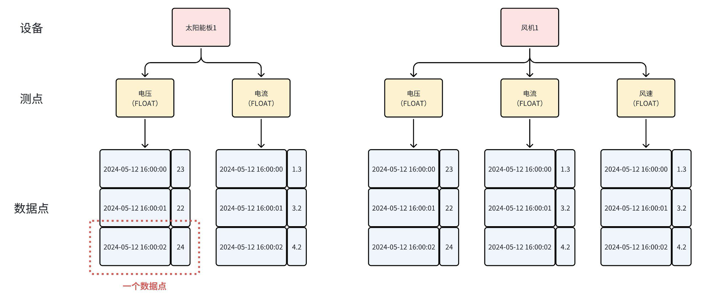

> [https://db-engines.com/en/ranking/time+series+dbms](https://db-engines.com/en/ranking/time+series+dbms)


# 基础概念

## 概念点

- **数据点**：由一个时间戳和一个数值组成，其中时间戳为 long 类型，数值可以为 BOOLEAN、FLOAT、INT32 等各种类型。
- **测点**：是多个数据点按时间戳递增排列形成的一个时间序列。通常一个测点代表一个采集点位，能够定期采集所在环境的物理量。
  - 又名：物理量、时间序列、时间线、信号量、指标、测量值等
  - 示例：
    - 电力场景：电流、电压
    - 能源场景：风速、转速
    - 车联网场景：油量、车速、经度、维度
    - 工厂场景：温度、湿度
- **设备**：对应一个实际场景中的物理设备，通常是一组测点的集合，由一到多个标签定位标识




## 数据模型

### 创建数据模型


# 如何使用


# 相关工具

## 测试工具IoT-benchmark

一个基于 Java 和大数据环境开发的时序数据库基准测试工具。

它支持多种写入和查询方式，能够存储测试信息和结果供进一步查询或分析，并支持与 `Tableau` 集成以可视化测试结果。

[IoT-benchmark](https://iotdb.apache.org/zh/UserGuide/latest/Tools-System/Benchmark.html)

## 数据导入导出脚本

用于实现 IoTDB 内部数据与外部文件的交互，适用于单个文件或目录文件批量操作。

[Data-Import-Export-Tool](https://iotdb.apache.org/zh/UserGuide/latest/Tools-System/Data-Import-Export-Tool.html)

## TsFile导入导出脚本

TsFile 是在 IoTDB 中使用的时间序列的文件格式

[TsFile-Import-Export-Tool](https://iotdb.apache.org/zh/UserGuide/latest/Tools-System/TsFile-Import-Export-Tool.html)


# 安装部署

## 资源规划

### CPU

| 序列数（采集频率<=1HZ） | CPU       | 节点数  |      |           |
| -------------- | --------- | ---- | ---- | --------- |
| 单机             | 双活        | 分布式  |      |           |
| 10W以内          | 2核-4核     | 1    | 2    | 3         |
| 30W以内          | 4核-8核     | 1    | 2    | 3         |
| 50W以内          | 8核-16核    | 1    | 2    | 3         |
| 100W以内         | 16核-32核   | 1    | 2    | 3         |
| 200w以内         | 32核-48核   | 1    | 2    | 3         |
| 1000w以内        | 48核       | 1    | 2    | 商务 |
| 1000w以上        | 天谋商务 |      |      |           |

### 内存

| 序列数（采集频率<=1HZ） | 内存        | 节点数  |      |           |
| -------------- | --------- | ---- | ---- | --------- |
| 单机             | 双活        | 分布式  |      |           |
| 10W以内          | 4G-8G     | 1    | 2    | 3         |
| 30W以内          | 12G-32G   | 1    | 2    | 3         |
| 50W以内          | 24G-48G   | 1    | 2    | 3         |
| 100W以内         | 32G-96G   | 1    | 2    | 3         |
| 200w以内         | 64G-128G  | 1    | 2    | 3         |
| 1000w以内        | 128G      | 1    | 2    | 商务 |
| 1000w以上        | 商务 |      |      |           |

### 存储(磁盘)

**存储空间**
- 计算公式：测点数量 * 采样频率（Hz）* 每个数据点大小（Byte，不同数据类型不一样，见下表）

| 数据点大小计算表                   |         |       |            |
| -------------------------- | ------- | ----- | ---------- |
| 数据类型                       | 时间戳（字节） | 值（字节） | 数据点总大小（字节） |
| 开关量（Boolean）               | 8       | 1     | 9          |
| 整型（INT32）/ 单精度浮点数（FLOAT）   | 8       | 4     | 12         |
| 长整型（INT64）/ 双精度浮点数（DOUBLE） | 8       | 8     | 16         |
| 字符串（TEXT）                  | 8       | 平均为a  | 8+a        |

示例：1000设备，每个设备100 测点，共 100000 序列，INT32 类型。采样频率1Hz（每秒一次），存储1年，3副本。  
- 完整计算公式：1000设备 * 100测点 * 12字节每数据点 * 86400秒每天 * 365天每年 * 3副本/10压缩比=11T    
- 简版计算公式：1000 * 100 * 12 * 86400 * 365 * 3 / 10 = 11T

**存储配置**
- 1000w 点位以上或查询负载较大，推荐配置 SSD。

### 网络（网卡）

在写入吞吐不超过1000万点/秒时，需配置千兆网卡；当写入吞吐超过 1000万点/秒时，需配置万兆网卡。

| **写入吞吐（数据点/秒）** | **网卡速率**   |
| --------------- | ---------- |
| <1000万          | 1Gbps（千兆）  |
| >=1000万         | 10Gbps（万兆） |

### 其他说明

IoTDB 具有集群秒级扩容能力，扩容节点数据可不迁移，因此无需担心按现有数据情况估算的集群能力有限，未来可在需要扩容时为集群加入新的节点。


## 系统配置

### 磁盘阵列

**配置建议**

IoTDB对磁盘阵列配置没有严格运行要求，推荐使用多个磁盘阵列存储IoTDB的数据，以达到多个磁盘阵列并发写入的目标，配置可参考以下建议：

1. 物理环境
    - 系统盘：建议使用2块磁盘做Raid1，仅考虑操作系统自身所占空间即可，可以不为IoTDB预留系统盘空间
    - 数据盘：建议做Raid，在磁盘维度进行数据保护
    - 建议为IoTDB提供多块磁盘（1-6块左右）或磁盘组（不建议将所有磁盘做成一个磁盘阵列，会影响 IoTDB的性能上限）
2. 虚拟环境
    - 建议挂载多块硬盘（1-6块左右）

**配置示例**

- 示例1，4块3.5英寸硬盘

    因服务器安装的硬盘较少，直接做Raid5即可，无需其他配置。

    推荐配置如下：
    
    | **使用分类** | **Raid类型** | **硬盘数量** | **冗余** | **可用容量** |
    | -------- | ---------- | -------- | ------ | -------- |
    | 系统/数据盘   | RAID5      | 4        | 允许坏1块  | 3        |

- 示例2，12块3.5英寸硬盘

    服务器配置12块3.5英寸盘。
    
    前2块盘推荐Raid1作系统盘，2组数据盘可分为2组Raid5，每组5块盘实际可用4块。
    
    推荐配置如下：
    
    | **使用分类** | **Raid类型** | **硬盘数量** | **冗余** | **可用容量** |
    | -------- | ---------- | -------- | ------ | -------- |
    | 系统盘      | RAID1      | 2        | 允许坏1块  | 1        |
    | 数据盘      | RAID5      | 5        | 允许坏1块  | 4        |
    | 数据盘      | RAID5      | 5        | 允许坏1块  | 4        |

- 示例3，24块2.5英寸盘

    服务器配置24块2.5英寸盘。
    
    前2块盘推荐Raid1作系统盘，后面可分为3组Raid5，每组7块盘实际可用6块。剩余一块可闲置或存储写前日志使用。
    
    推荐配置如下：
    
    | **使用分类** | **Raid类型** | **硬盘数量** | **冗余** | **可用容量** |
    | -------- | ---------- | -------- | ------ | -------- |
    | 系统盘      | RAID1      | 2        | 允许坏1块  | 1        |
    | 数据盘      | RAID5      | 7        | 允许坏1块  | 6        |
    | 数据盘      | RAID5      | 7        | 允许坏1块  | 6        |
    | 数据盘      | RAID5      | 7        | 允许坏1块  | 6        |
    | 数据盘      | NoRaid     | 1        | 损坏丢失   | 1        |

### 操作系统

**版本要求**

- IoTDB支持Linux、Windows、MacOS等操作系统，
- 企业版支持龙芯、飞腾、鲲鹏等国产 CPU，支持中标麒麟、银河麒麟、统信、凝思等国产服务器操作系统。

**硬盘分区**

- 建议使用默认的标准分区方式，不推荐LVM扩展和硬盘加密。
- 系统盘只需满足操作系统的使用空间即可，不需要为IoTDB预留空间。
- 每个硬盘组只对应一个分区即可，数据盘（里面有多个磁盘组，对应raid）不用再额外分区，所有空间给IoTDB使用。

建议的磁盘分区方式如下表所示。

| 硬盘分类   | 磁盘组       | 对应盘符     | 大小       | 文件系统类型 |
| ------ | --------- | -------- | -------- | ------ |
| 系统盘    | 磁盘组0      | /boot    | 1GB      | 默认     |
|           |             | /      | 磁盘组剩余全部空间 | 默认       |
| 数据盘    | 磁盘组1      | /data1   | 磁盘组1全部空间 | 默认     |
|          | 磁盘组2      | /data2    | 磁盘组2全部空间 | 默认       |
|          | ......     |          |          |        |

### 网络配置

1. 关闭防火墙
```
# 查看防火墙
systemctl status firewalld
# 关闭防火墙
systemctl stop firewalld
# 永久关闭防火墙
systemctl disable firewalld
```

2. 保证所需端口不被占用

    - 集群占用端口的检查：在集群默认配置中，ConfigNode 会占用端口 10710 和 10720，DataNode 会占用端口 6667、10730、10740、10750 、10760、9090、9190、3000请确保这些端口未被占用。检查方式如下：
    ```
    lsof -i:6667  或  netstat -tunp | grep 6667
    lsof -i:10710  或  netstat -tunp | grep 10710
    lsof -i:10720  或  netstat -tunp | grep 10720
    #如果命令有输出，则表示该端口已被占用。
    ```
    - 集群部署工具占用端口的检查：使用集群管理工具opskit安装部署集群时，需打开SSH远程连接服务配置，并开放22号端口。
    ``` 
    yum install openssh-server            #安装ssh服务
    systemctl start sshd                  #启用22号端口  
    ```

3. 保证服务器之间的网络相互连通


### 其他配置

1. 关闭系统 swap 内存
``` 
echo "vm.swappiness = 0">> /etc/sysctl.conf
# 一起执行 swapoff -a 和 swapon -a 命令是为了将 swap 里的数据转储回内存，并清空 swap 里的数据。
# 不可省略 swappiness 设置而只执行 swapoff -a；否则，重启后 swap 会再次自动打开，使得操作失效。
swapoff -a && swapon -a
# 在不重启的情况下使配置生效。
sysctl -p
# 检查内存分配，预期 swap 为 0
free -m
```

2. 设置系统最大打开文件数为 65535，以避免出现 "太多的打开文件 "的错误。
``` 
#查看当前限制
ulimit -n
# 临时修改
ulimit -n 65535
# 永久修改
echo "* soft nofile 65535" >>  /etc/security/limits.conf
echo "* hard nofile 65535" >>  /etc/security/limits.conf
#退出当前终端会话后查看，预期显示65535
ulimit -n
```

### 软件依赖

安装 Java 运行环境 ，Java 版本 >= 1.8，请确保已设置 jdk 环境变量。（V1.3.2.2 及之上版本推荐直接部署JDK17，老版本JDK部分场景下性能有问题，且datanode会出现stop不掉的问题）
``` 
#下面以在centos7，使用JDK-17安装为例：
tar  -zxvf  jdk-17_linux-x64_bin.tar     #解压JDK文件
Vim  ~/.bashrc                           #配置JDK环境
{  export JAVA_HOME=/usr/lib/jvm/jdk-17.0.9
export PATH=$JAVA_HOME/bin:$PATH     
}  #添加JDK环境变量
source  ~/.bashrc                        #配置环境生效
java -version                            #检查JDK环境
```


## 安装包

[https://iotdb.apache.org/zh/Download/](https://iotdb.apache.org/zh/Download/)

解压后安装包（apache-iotdb-<version>-all-bin.zip），安装包解压后目录结构如下：

| **目录**           | **类型** | **说明**                                   |
| ---------------- | ------ | ---------------------------------------- |
| conf             | 文件夹    | 配置文件目录，包含 ConfigNode、DataNode、JMX 和 logback 等配置文件 |
| data             | 文件夹    | 默认的数据文件目录，包含 ConfigNode 和 DataNode 的数据文件。（启动程序后才会生成该目录） |
| lib              | 文件夹    | IoTDB可执行库文件目录                            |
| licenses         | 文件夹    | 开源社区证书文件目录                               |
| logs             | 文件夹    | 默认的日志文件目录，包含 ConfigNode 和 DataNode 的日志文件（启动程序后才会生成该目录） |
| sbin             | 文件夹    | 主要脚本目录，包含启、停等脚本等                         |
| tools            | 文件夹    | 系统周边工具目录                                 |
| ext              | 文件夹    | pipe，trigger，udf插件的相关文件（需要使用时用户自行创建）     |
| LICENSE          | 文件     | 证书                                       |
| NOTICE           | 文件     | 提示                                       |
| README_ZH.md     | 文件     | markdown格式的中文版说明                         |
| README.md        | 文件     | 使用说明                                     |
| RELEASE_NOTES.md | 文件     | 版本说明                                     |

## 单机版部署


## 集群版部署


