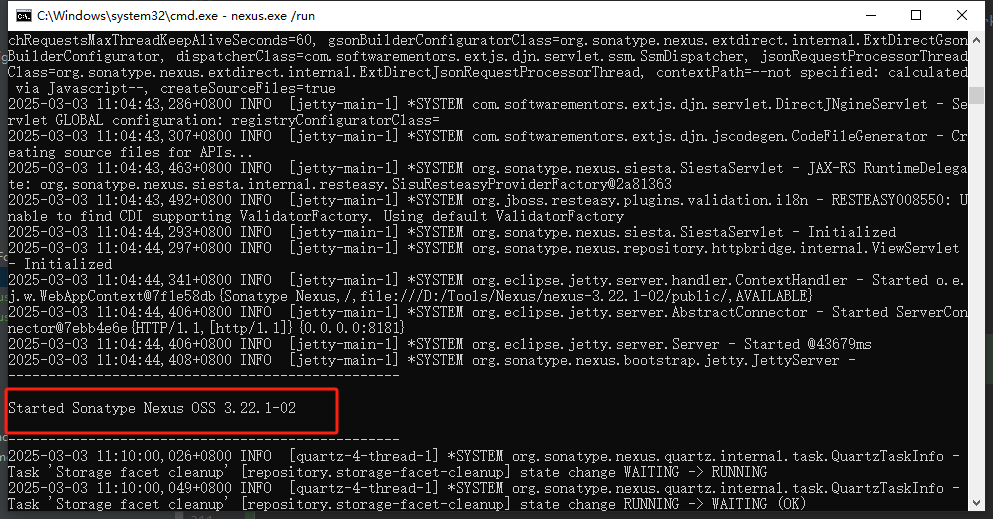
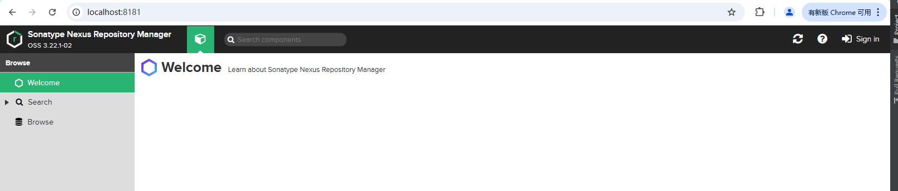
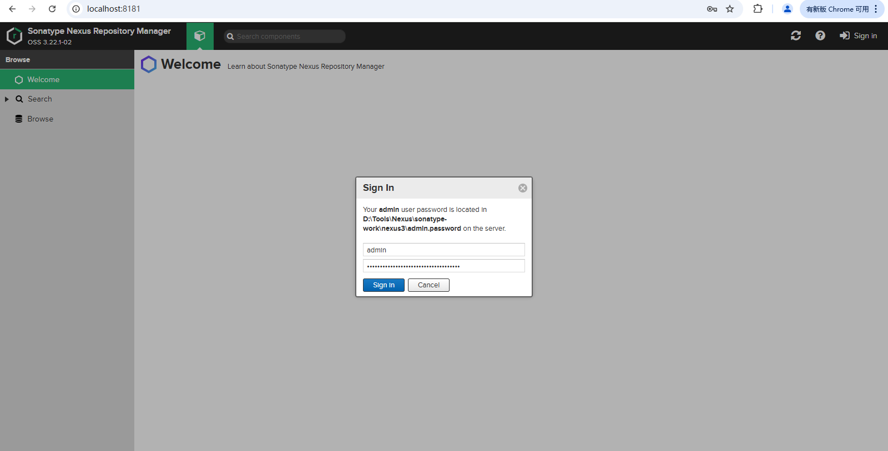
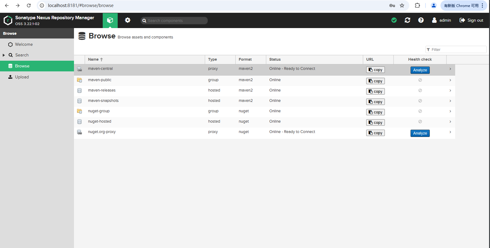
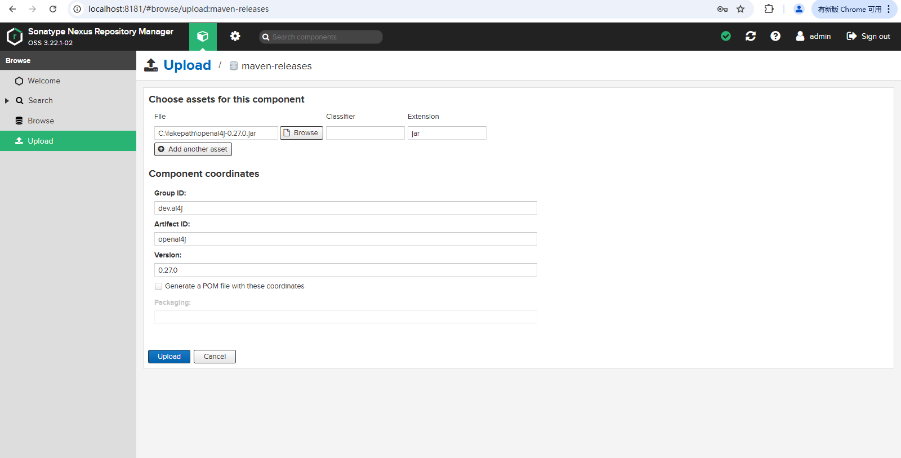
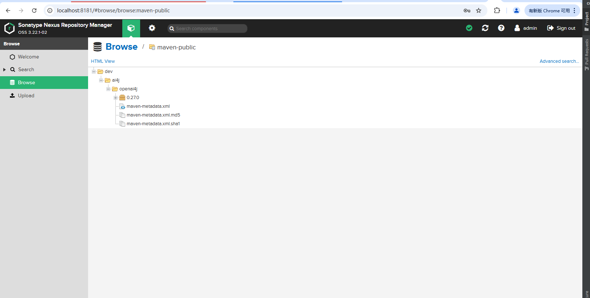
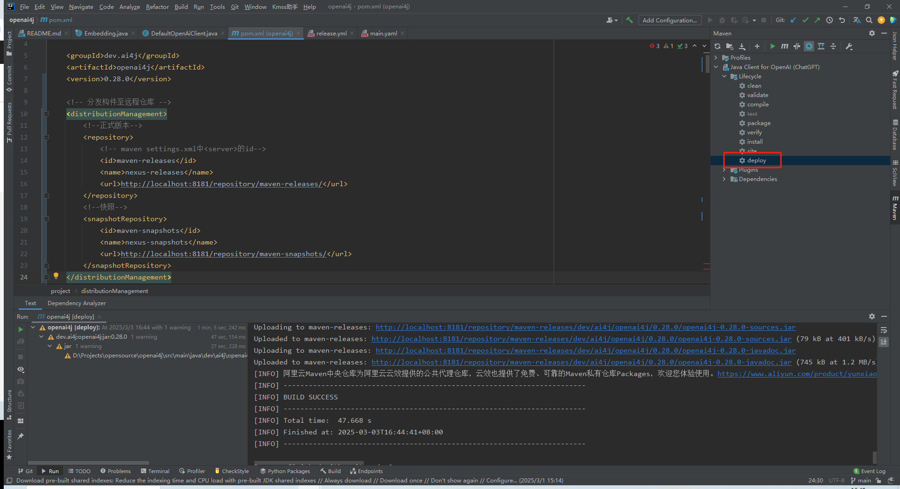
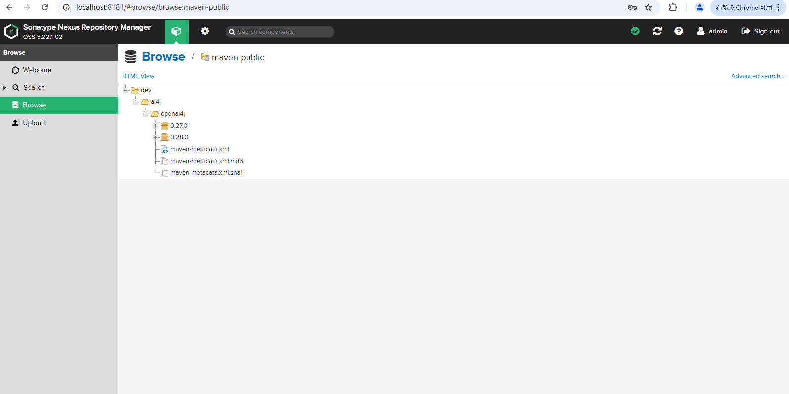
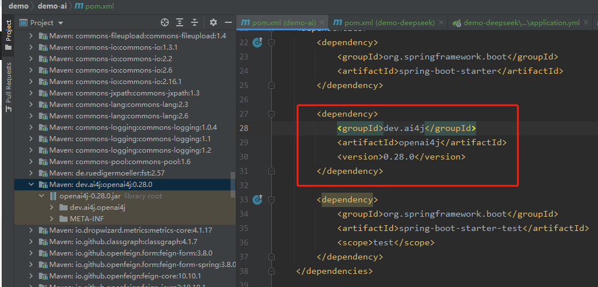

# Maven标签

## type
- `<type>`是指和项目相关的主要构件的类型（对应于构件的POM 文件中的<packaging>值）。
- 默认值是jar。其他：pom、war、ear。

## scope
`<scope>`元素可以具有以下值:
- compile—编译和执行需要的（默认值）。
- runtime—只有执行需要。
- optional——不被引用了这个项目所产生的构件的其他项目，视为传递依赖。
- provided——不会被包含在由这个POM 产生的WAR 文件的WEB_INF/lib 目录中。
- test——只有编译和测试的执行需要。
- import——这将在后面的“依赖管理”一节进行讨论。

## systemPath
- `<systemPath>`元素用来指定文件系统中的绝对位置。

## classifier
- `<classifier>`用于区分属于相同的POM 但是却被以不同的方式构建的构件。例如，javadoc、sources、jdk16、jdk17。

# 依赖管理
- POM 的`<dependencyManagement>`元素包含可以被其他项目使用的`<dependency>`声明。这样的POM 的子项目将会自动继承这些声明。其他项目可以通过使用`<scope>`元素的`import`值来导入它们。
- 引用了`<dependencyManagement>`元素的项目可以使用它所声明的依赖，而不需要指定它们的`<version>`坐标

# 构建的生命周期
Maven 构建的生命周期是一个明确定义的用于构建和分发构件的过程。有3 个内置的构建生命周期：clean、default 和site。

一个构建的生命周期由一系列的阶段所组成。下面是默认的构建生命周期的各个阶段的一个部分清单。
- validate——检查项目是否正确，所有必需的信息是否已经就绪。
- process-sources——处理源代码，如过滤任何值。
- compile——编译项目的源代码。
- process-test-resources——复制并处理资源到测试目标目录中。
- test-compile——将测试源代码编译到测试目标目录中。
- test——使用合适的单元测试框架测试编译的源代码。
- package——将编译的代码打包为它的可分发格式，如JAR。
- integration-test——处理并将软件包部署到一个可以运行集成测试的环境中。
- verify——运行任何的检查以验证软件包是否有效，并且符合质量标准。
- install——将软件包安装到本地存储库中，在那里其他本地构建项目可以将它引用为依赖。
- deploy——将最终的构件上传到远程存储库，以与其他开发人员和项目共享。

**执行这些阶段中的一个阶段将会调用所有前面的阶段。**

`mvn clean install`

# 插件

虽然Maven协调了所有构建生命周期阶段的执行，但是它并没有直接实现它们，相反，它将它们委托给了插件，这些插件是maven-plugin类型的构件（打包为JAR文件）

阶段 | 插件：目标
--- | ---
process-resources | resources:resources
compile | compiler:compiler
process-test-resources | resources:testResources
test-compile | compiler:testCompile
test | surefire:test
package | jar:jar
install | install:install
deploy | deploy:deploy

## 插件管理
`<pluginManagement>`声明了其他POM 可以使用的信息

- 插件管理
```
<build>
    <pluginManagement>
        <plugins>
            <plugin>
                <artifactId>maven-compiler-plugin</artifactId>
                <version>3.2</version>
                <configuration>
                    <source>1.7</source>
                    <target>1.7</target>
                </configuration>
            </plugin>
            <plugin>
                <groupId>org.codehaus.mojo</groupId>
                <artifactId>exec-maven-plugin</artifactId>
                <version>1.2.1</version>
            </plugin>
        </plugins>
    </pluginManagement>
</build >
```
- 插件继承
```
<build>
    <plugins>
        <plugin>
            <artifactId>maven-compiler-plugin</artifactId>
        </plugin>
        <plugin>
            <groupId>org.codehaus.mojo</groupId>
            <artifactId>exec-maven-plugin</artifactId>
        </plugin>
    </plugins>
</build >
```

# POM示例

## 独立的pom.xml
```
<?xml version="1.0" encoding="ISO-8859-15"?>
<project xmlns="http://maven.apache.org/POM/4.0.0" 
        xmlns:xsi="http://www.w3.org/2001/XMLSchema-instance" 
        xsi:schemaLocation="http://maven.apache.org/POM/4.0.0
        http://maven.apache.org/maven-v4_0_0.xsd">

    <modelVersion>4.0.0</modelVersion> 
    <!-- 该项目的GAV坐标 -->
    <groupId>com.example</groupId>
    <artifactId>myproject</artifactId>
    <version>1.0-SNAPSHOT</version>
    
    <!-- 该项目产生的构件将是一个JAR文件（默认值） -->
    <packaging>jar</packaging>
    
    <name>My Jar Project</name>
    
    <!-- 这个POM 只声明了Netty JAR作为依赖；一个典型的Maven项目会有许多依赖 -->
    <dependencies>
        <dependency>
            <groupId>io.netty</groupId>
            <artifactId>netty-all</artifactId>
            <version>4.1.9.Final</version>
        </dependency>
    </dependencies>
    
    
    <!-- <build>部分声明了用于执行构建任务的插件。我们只自定义了编译器插件，对于其他的插件，我们接受默认值 -->
    <build>
        <plugins>
            <plugin>
                <groupId>org.apache.maven.plugins</groupId>
                <artifactId>maven-compiler-plugin</artifactId>
                <version>3.2</version>
                <configuration>
                    <source>1.7</source>
                    <target>1.7</target>
                </configuration>
            </plugin>
        </plugins>
    </build>

</project>
```

## POM的继承和聚合
- 父级和聚合器POM
```
<project>
    <modelVersion>4.0.0</modelVersion>

    <!-- <parent>声明了samples-parent POM 作为这个POM 的父POM -->
    <parent>
        <groupId>nia</groupId>
        <artifactId>nia-samples-parent</artifactId>
        <version>1.0-SNAPSHOT</version>
    </parent>

    <artifactId>chapter2</artifactId>
    <packaging>pom</packaging>
    <name>2. Echo Client and Server</name>

    <!-- <modules>声明了父POM 下的目录，其中包含将由这个POM 来构建的Maven 项目 -->
    <modules>
        <module>Client</module>
        <module>Server</module>
    </modules>

    <!-- <property>值可以通过在命令行上使用Java 系统属性（-D）进行重写。属性由子项目继承 -->
    <properties>
        <echo-server.hostname>localhost</echo-server.hostname>
        <echo-server.port>9999</echo-server.port>
    </properties>

    <!-- 父POM 的<dependencies>元素由子项目继承 -->
    <dependencies>
        <dependency>
            <groupId>io.netty</groupId>
            <artifactId>netty-all</artifactId>
        </dependency>
    </dependencies>

    <!-- 父POM 的<plugins>元素由子项目继承 -->
    <build>
        <plugins>
            <plugin>
                <artifactId>maven-compiler-plugin</artifactId>
            </plugin>
            <plugin>
                <artifactId>maven-failsafe-plugin</artifactId>
            </plugin>
            <plugin>
                <artifactId>maven-surefire-plugin</artifactId>
            </plugin>
            <plugin>
                <groupId>org.codehaus.mojo</groupId>
                <artifactId>exec-maven-plugin</artifactId>
            </plugin>
        </plugins>
    </build>
</project> 
```

- 子项目POM
``` 
<project>
    <!-- <parent>声明了父POM -->
    <parent>
        <groupId>nia</groupId>
        <artifactId>chapter2</artifactId>
        <version>1.0-SNAPSHOT</version>
    </parent>

    <!-- <artifactId>必须声明，因为对于该子项目来说它是唯一的。<groupId>和<version>，如果没有被定义则从父POM 继承 -->
    <artifactId>echo-server</artifactId>

    <build>
        <plugins>
            <!-- exec-maven-plugin 插件可以执行Maven 命令行的任意命令；在这里，我们用它来运行Echo 服务器 -->
            <plugin>
                <groupId>org.codehaus.mojo</groupId>
                <artifactId>exec-maven-plugin</artifactId>
                <executions>
                    <execution>
                        <id>run-server</id>
                        <goals>
                            <goal>java</goal>
                        </goals>
                    </execution>
                </executions>
                <configuration>
                    <mainClass>nia.echo.EchoServer</mainClass>
                    <arguments>
                        <argument>${echo-server.port}</argument>
                    </arguments>
                </configuration>
            </plugin>
        </plugins>
    </build>
</project>
```

# Maven命令行
`mvn [op tions] [<goal(s)>] [<phase(s)>]`

选项 | 描述
--- | ---
-am,--also-make | 如果指定了项目列表，还会构建列表所需的项目
-amd,--also-make-dependents | 如果指定了项目列表，还会构建依赖于列表中的项目的项目
-B,--batch-mode | 在非交互（批处理）模式下运行
-b,--builder <arg> | 要使用的构建策略的id
-C,--strict-checksums | 如果校验和不匹配，则让这次构建失败
-c,--lax-checksums | 如果校验和不匹配，则发出警告
-cpu,--check-plugin-updates | 无效，只是为了保持向后的兼容性
-D,--define <arg> | 定义一个系统属性
-e,--errors | 生成执行错误的信息
-emp,--encrypt-master-password <arg> | 加密主安全密码
-ep,--encrypt-password <arg> | 加密服务器密码
-f,--file <arg> | 强制使用备用的POM 文件（或者包含pom.xml 的目录）
-fae,--fail-at-end | 只在最后让构建失败，允许所有不受影响的构建继续进行
-ff,--fail-fast | 在反应化的构建中，首次失败便停止构建
-fn,--fail-never | 不管项目的结果如何，都决不让构建失败
-gs,--global-settings <arg> | 全局设置文件的备用路径
-h,--help | 显示帮助信息
-l,--log-file <arg> | 所有构建输出的日志文件的位置
-llr,--legacy-local-repository | 使用Maven2 的遗留本地存储库（Legacy Local Repository）行为；也就是说，不使用_remote.repositories。也可以通过使用-Dmaven.legacyLocalRepo=true.激活
-N,--non-recursive | 不递归到子项目中
-npr,--no-plugin-registry | 无效，只是为了保持向后的兼容性
-npu,--no-plugin-updates | 无效，只是为了保持向后的兼容性
-nsu,--no-snapshot-updates | 取消快照更新
-o,--offline | 脱机工作
-P,--activate-profiles <arg> | 等待被激活的由逗号分隔的配置文件列表
-pl,--projects <arg> | 构建由逗号分隔的指定的reactor 项目，而不是所有项目。 项目可以通过[groupId]:artifactId 或者它的相对路径来指定
-q,--quiet | 静默输出，只显示错误
-rf,--resume-from <arg> | 从指定的项目恢复reactor
-s,--settings <arg> | 用户配置文件的备用路径
-T,--threads <arg> | 线程数目，如2.0C，其中C 是乘上的CPU 核心数
-t,--toolchains <arg> | 用户工具链文件的备用路径
-U,--update-snapshots | 强制检查缺少的发布，并更新远程存储库上的快照
-up,--update-plugins | 无效，只是为了保持向后的兼容性
-V,--show-version | 显示版本信息而不停止构建
-v,--version | 显示版本信息
--debug | 生成执行调试输出


- 多线程编译: `mvn clean package -T 1C -Dmaven.test.skip=true  -Dmaven.compile.fork=true`


# Maven私库搭建

## 下载Nexus

[官网](https://help.sonatype.com/en/orientdb-downloads.html)

## 启动Nexus

- 修改端口号：
    ```properties
    # D:\Tools\Nexus\nexus-3.22.1-02\etc\nexus-default.properties
    
    application-port=8181 # 修改为一个不常用的端口号
    ```
- 启动Nexus：cmd执行`D:\Tools\Nexus\nexus-3.22.1-02\bin>nexus.exe/run`
  

  

## 登录Nexus

启动后会在`D:\Tools\Nexus\sonatype-work\nexus3\admin.password`生成密码



登录后按提示修改密码。

## 配置Maven私库

- 因为Nexus里自带的有Maven仓库，所以不需要另外创建，只需要配置下Maven连接私库的地址即可

  

- 设置本地Maven settings文件，配置Nexus私库地址。（`D:\Tools\Maven\apache-maven-3.8.1\conf\settings.xml`）
  ```xml
  <!-- 1、配置本地仓库访问私服的权限：nexus的登录用户名密码 -->
  <servers>
      <server>
        <id>maven-releases</id>
        <username>admin</username>
        <password>Lp123</password>
      </server>
      <server>
        <id>maven-snapshots</id>
        <username>admin</username>
        <password>Lp123</password>
      </server>
  </servers>
  
  <!-- 2、配置Maven私库信息 -->
  <profiles>
      <profile>
          <id>nexus</id>
          <!--远程仓库列表，它是Maven用来填充构建系统本地仓库所使用的一组远程项目。  -->
          <repositories>
              <repository>
                  <!--用于存储已经发布的Maven依赖包-->
                  <id>maven-releases</id>
                  <url>http://localhost:8181/repository/maven-releases/</url>
                  <!--true或者false表示该仓库是否为下载某种类型构件（发布版，快照版）开启。 -->
                  <releases>
                     <enabled>true</enabled>
                  </releases>
                  <snapshots>
                     <enabled>false</enabled>
                  </snapshots>
              </repository>
              <repository>
                  <!--用于存储开发中的Maven依赖包-->
                  <id>maven-snapshots</id>
                  <url>http://localhost:8181/repository/maven-snapshots/</url>
                  <releases>
                     <enabled>false</enabled>
                  </releases>
                  <snapshots>
                     <enabled>true</enabled>
                  </snapshots>
              </repository>
          </repositories>
          <pluginRepositories>
              <pluginRepository>
                  <id>maven-public</id>
                  <url>http://localhost:8181/repository/maven-public</url>
              </pluginRepository>
          </pluginRepositories>
      </profile>
  </profiles>
  
  <!-- 3、激活私库配置 -->
  <activeProfiles>
      <!--对应profile下的id-->
      <activeProfile>nexus</activeProfile>
  </activeProfiles>
  
  ```

## 上传公共组件到Maven私库

- 手动打包上传
  

  

- 自动上传：公共组件项目配置pom文件，实现连接私库自动上传
  ```xml
  <!-- 分发构件至远程仓库 -->
  <distributionManagement>
      <!--正式版本-->
      <repository>
          <!-- maven settings.xml中<server>的id-->
          <id>maven-releases</id>
          <name>nexus-releases</name>
          <url>http://localhost:8181/repository/maven-releases/</url>
      </repository>
      <!--快照-->
      <snapshotRepository>
          <id>maven-snapshots</id>
          <name>nexus-snapshots</name>
          <url>http://localhost:8181/repository/maven-snapshots/</url>
      </snapshotRepository>
  </distributionManagement>
  ```
  执行Maven deploy（快照版版本标签`<version>xxx-SNAPSHOT</version>`）
  

  
  - `maven-releases`查看/依赖正式版
  - `maven-snapshots`查看/依赖快照版
  - `maven-public`查看/依赖正式版和快照版

## 在项目中引用公共组件




## 其它

### 项目发布到maven中央仓库

项目用于发布到maven中央仓库的插件：nexus-staging-maven-plugin
```xml
  <plugin>
      <groupId>org.sonatype.plugins</groupId>
      <artifactId>nexus-staging-maven-plugin</artifactId>
      <version>1.6.13</version>
      <extensions>true</extensions>
      <configuration>
          <serverId>ossrh</serverId>
          <nexusUrl>https://s01.oss.sonatype.org/</nexusUrl>
          <autoReleaseAfterClose>true</autoReleaseAfterClose>
      </configuration>
  </plugin>
```

```xml
<distributionManagement>
    <snapshotRepository>
        <id>ossrh</id>
        <url>https://s01.oss.sonatype.org/content/repositories/snapshots</url>
    </snapshotRepository>
</distributionManagement>
```

[发布Jar包到Maven仓库](https://zhuanlan.zhihu.com/p/102977818)
