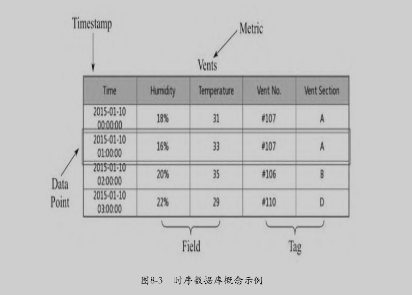

> [mqtt-v3.1.1.pdf](../resources/static/doc/mqtt-v3.1.1.pdf)

# 常见的物联网协议
包含：
- 物理层协议：LoRaWAN、NB-IoT
- 数据链路层协议：LoRaWAN、NB-IoT
- 应用层协议：MQTT、CoAP、LwM2M

## MQTT协议

`Message Queue Telemetry Transport`：消息队列遥测传输协议。

特点：
- 实现简单。
- 提供数据传输的QoS。
- 轻量、低带宽占用。
- 支持任意类型数据传输。
- 可保持的会话（session）。

特性：
- 基于**TCP协议**的应用层协议。
- 采用 C/S 架构。
- 使用 订阅/发布 模式，将消息的发送方 和接收方 解耦。
- 提供三种消息QoS（Quality of Service）：最多一次、最少一次、只有一次。
- 消息的发送 和接收 都是异步的。

MQTT协议的架构由 Broker 和连接到Broker的多个Client组成。


## MQTT-SN协议

`MQTT for Sensor Network`：是MQTT协议的传感器版本。

- MQTT-SN运行在**UDP协议**上，同时保留了MQTT协议的大部分信令和特性，如订阅和发布等。
- MQTT-SN协议引入了MQTT-SN网关这一角色，网关负责把MQTT-SN协议转换为MQTT协议，并和远端的MQTT Broker进行通信。
- MQTT-SN协议支持网关的自动发现。


## CoAP协议

`Constrained Application Protocol`：是一种运行在资源比较紧张的设备上的协议。

- CoAP协议通常也是运行在**UDP协议**上的。
- CoAP协议设计得非常小巧，最小的数据包只有4个字节。
- CoAP协议采用C/S架构，使用类似于HTTP协议的请求-响应的交互模式。
  设备可以通过类似于`coap://192.168.1.150:5683/2ndfloor/temperature`的URL来标识一个实体，
  并使用类似于HTTP的PUT、GET、POST、DELETE请求指令来获取或者修改这个实体的状态。
- CoAP提供一种观察模式，观察者可以通过 OBSERVE指令向CoAP服务器指明观察的实体对象。
  当实体对象的状态发生变化时，观察者就可以收到实体对象的最新状态，类似于MQTT协议中的订阅功能。


## LwM2M协议

`Lightweight Machine-To-Machine`：轻量级设备对设备的协议。

- 使用REST ful接口，提供设备的接入、管理、通信功能，也适用于资源比较紧张的设备。
- LwM2M协议底层使用 CoAP协议传输数据和信令。
  而在LwM2M协议的架构中，CoAP协议可以运行在UDP或者SMS（短信）之上，通过DTLS（数据报传输层安全）来实现数据的安全传输。


在没有移动数据网络覆盖的地区，比如偏远地区的水电站，用短信作为信息传输的载体已经有比较长的历史了。

LwM2M协议架构主要包含3种实体：
`LwM2M Bootstrap Server`负责引导LwM2M Client注册并接入`LwM2M Server`，
之后LwM2M Server和`LwM2M Client`就可以通过协议指定的接口进行交互了。

## HTTP协议

常用在资源比较充足的设备。比如：运行安卓操作系统的设备。

## LoRaWAN协议

一种低功率广域网协议，是物理层/数据链路层协议，主要解决设备如何接入互联网的问题，不运行在IP网络上。

用在有线网络、4G、WiFi不能覆盖的场景。

LoRa（Long Range）是一种无线通信技术，它具有使用距离远、功耗低的特点。

比如在隧道施工中，用户就可以使用LoRaWAN技术进行组网，在工程设备上安装支持LoRA的模块。
通过LoRa的中继设备将数据发往位于隧道外部的、有互联网接入的LoRa网关，LoRa网关再将数据封装成可以在IP网络中通过TCP协议或者UDP协议传输的数据协议包（比如MQTT协议），然后发往云端的数据中心。


## NB-IoT协议

`Narrow Band Internet of Things`：窄带物联网协议。和LoRaWAN协议一样，是将设备接入互联网的物理层/数据链路层的协议。

和LoRA不同的是，NB-IoT协议构建和运行在蜂窝网络上，消耗的带宽较低，可以直接部署到现有的GSM网络或者LTE网络。
设备安装支持NB-IoT的芯片和相应的物联网卡，然后连接到NB-IoT基站就可以接入互联网。
而且NB-IoT协议不像LoRaWAN协议那样需要网关进行协议转换，接入的设备可以直接使用IP网络进行数据传输。

NB-IoT协议相比传统的基站，增益提高了约20dB，可以覆盖到地下车库、管道、地下室等之前信号难以覆盖的地方。


# MQTT协议详解

**MQTT协议与传统消息队列区别：**
- 传统消息队列：发送消息前 必须先创建相应的队列。  MQTT协议：不需要预先创建要发布的主题(Topic)。
- 传统消息队列：未被消费的消息会保存在某个队列中 直至被某个消费者消费。  MQTT协议：如果发布的消息没有被任何客户端订阅，消息将被丢弃。
- 传统消息队列：一个消息只能被一个客户端获取。  MQTT协议：一个消息可以被多个订阅者获取。并且MQTT不支持指定消息被单一客户端获取。

## MQTT协议的通信模型

MQTT是通过 `发布/订阅模式`来通信的。

消息的发布者 和消费者 通过此模式解耦，中间通过`Broker`来存储和转发消息。消息发布方和订阅方都是`Client`。

MQTT通信流程：
1. 发布者(Publisher)和订阅者(Subscriber) 都建立了到Broker的TCP连接。
2. 订阅者告知Broker他要订阅的消息主题（Topic）。
3. 发布者指定消息主题，并将消息发送到Broker。
4. Broker接收到消息后，将消息转发给订阅此Topic的订阅者们。
5. 订阅者们从Broker获取到消息。
6. 如果某个订阅者此时处于离线状态，那么Broker会保留此消息，在该订阅者再次上线时转发给它。


## MQTT Broker

一个MQTT Broker应该具备的能力：
- 可以支持对Client的接入授权，并对Client进行权限控制。
- 可以横向扩展，比如支持集群，以满足海量的Client接入。
- 有较好的扩展性，可以比较方便的接入现有的业务系统。
- 方便监控，满足高可用性。

**常见的MQTT Broker：**
1. `Mosquitto`：C语言编写，开源，支持单机，单机配置运行简单，拓展麻烦。
2. **`EMQ X`**：Erlang语言编写，有开源版本 和付费版本，支持集群，可以通过插件方式进行功能拓展。
3. `HiveMQ`：Java语言编写，只有付费版，支持集群，可以通过插件方式进行功能拓展。
4. `VerneMQ`：Erlang语言编写，开源（瑞士公司提供商业服务），支持集群，可以通过插件方式进行功能拓展。


## MQTT协议数据包格式

MQTT协议使用的是：二进制数据包。

一个MQTT协议数据包包含3部分：
- 固定报头（Fix Header）：存在于所有的MQTT协议数据包中，用于表示数据包类型、对应标识，表明数据包大小。
- 可变报头（Variable Header）：存在于部分类型的MQTT协议数据包中，具体内容有相应类型的数据包决定。
- 消息体（有效载荷:Payload）：存在于部分MQTT协议数据包中，存储消息的具体数据。


1. **数据包类型**：MQTT协议数据包的**固定头的第一个字节的高四位** 表示该数据包的类型。
   


2. **数据包标识位**：MQTT协议数据包的**固定头的第一个字节的低四位**。不用类型数据包 标识位定义不一样。


   - DUP1: 控制报文的重复分发标志
   - QoS2：PUBLISH报文的服务质量等级
   - RETAIN3: PUBLISH报文的保留标志

3. **数据包剩余长度**：从固定位第二个字节开始，用于标识当前数据包剩余长度的字段，= 可变头长度 + 消息体长度。
    - 这个字段最少1个字节，最多4个字节。
    - 其中，每个字节的最高位叫延续位（Continuation Bit），表示在这个字节之后是否还有一个用于标识剩余长度的字节。剩下的低7位用于标识值，范围：0~127。
    - 例如，剩余长度字段的第一个字节的最高位为1，那么意味着剩余长度至少还有1个字节，然后继续读下一个字节，下一个字节的最高位为0，那么剩余长度字段到此为止，一共2个字节。


所以，这4个字节最多可以标识的包长度为：（0xFF,0xFF,0xFF,0x7F）=268 435 455字节，即256MB，这是MQTT协议中数据包的最大长度。

## 建立到Broker的连接

Client在发布和订阅消息之前必须先连接到Broker。Client建立连接的流程：
1. Client向Broker发送一个 `CONNECT` 数据包；
2. Broker收到Client的CONNECT数据包后，会回复一个`CONNACK`包：
   - CONNACK包的返回码为0，表示允许Client接入，MQTT协议连接建立成功；
   - CONNACK包返回码不为0，表示不允许Client接入，返回码表示接入失败的原因，之后断开底层的TCP连接。

### CONNECT数据包

1. 固定头


固定头中的MQTT协议数据包类型字段的值为1，代表CONNECT数据包。

2. 可变头

    4部分组成：
   - 协议名称。6个字节，UTF-8编码字符串：前2个字节标识字符串长度；后4个字节为协议名称固定为"MQTT"（**如果协议名称不正确，Broker会断开与Client的连接**）。
   - 协议版本。1个字节，无符号整数。
   - 连接标识。1个字节，每个标识位表示不同的连接选项。
     1. bit0：保留。
     2. bit1：会话清除标识（Clean Session）：标识Client是否建立一个持久化的会话，值为0/1。0表示Client希望建立持久会话连接，Broker会存储该Client订阅的主题和未接收的消息，否则Broker不保存这些数据，并在建立连接时清除这个Client之前存在的持久会话所保留的数据。
     3. bit2：遗愿标识（Will Flag）：标识是否使用遗愿消息，值为0/1；
     4. bit3、bit4：遗愿消息QoS标识（Will QoS）：标识遗愿消息的QoS，值为0、1、2；
     5. bit5：遗愿消息Retain标识（Will Retain）：标识遗愿消息是否是Retain消息，值为0/1；
     6. bit6：密码标识（Password Flag）：标识消息体中是否有密码字段，值为0/1；
     7. bit7：用户名标识（User Name Flag）：标识消息体中是否由用户名字段，值为0/1。
   - Keepalive。2个字节，连接保活设置，Keepalive代表一个单位为秒的时间间隔，Client和Broker之间在这个时间间隔之内至少要有一次消息交互，否则Client和Broker会认为它们之间的连接已经断开。

3. 消息体

    5个字段组成：
   - 客户端标识符（Client Identifier）：必选，唯一，标识Client身份，Broker通过这个字段来区分不同Client。
     - MQTT协议要求Client连接时必须携带；
     - 但也允许Broker在实现时接受 客户端标识符为空 的CONNECT包，此时Broker会给Client分配一个内部唯一的标识符。
     - 如果需要使用持久性会话，就必须携带。
   - 遗愿主题（Will Topic）：可选，可变头的连接标识来决定是否包含。当Client非正常地中断连接时，Broker将向指定的遗愿主题发布遗愿消息。
   - 遗愿QoS：可选，可变头的连接标识来决定是否包含。
   - 遗愿消息（Will Message）：可选，可变头的连接标识来决定是否包含。当Client非正常地中断连接时，Broker将向指定的遗愿主题发布由该字段指定的内容。
   - 用户名和密码：可选，可变头的连接标识来决定是否包含。
     - 用户名（Username）：可变头中用户名标识为1时 消息体将包含用户名字段。Broker可以使用用户名+密码 对Client进行授权验证。不同Client可以使用相同的用户名和密码进行连接。
     - 密码（Password）：可变头中密码标识为1时 消息体将包含密码字段。

消息体的前2个字节表示字段值长度。

### CONNACK数据包

1. 固定头


固定头中的MQTT数据包的类型字段值为2，代表CONNACK数据包。CONNACK数据包剩余长度固定为2。

2. 可变头

2个字节：连接确认标识 + 连接返回码
- 连接确认标识：前7位保留 值为0，最后一位标识会话存在标识（Session Present Flag） 值为0/1。
    - 当Client在连接时设置Clean Session=1，则CONNACK中的Session Present Flag始终为0；
    - 当Client在连接时设置Clean Session=0，那就有两种情况：
        - 如果Broker保存了这个Client之前留下的持久性会话，那么CONNACK中的Session Present Flag值为1；
        - 如果Broker没有保存该Client 的任何会话数据，那么CONNACK中的Session Present Flag值为0。

- 连接返回码（Connect Return Code）：用于标识Client与Broker 的连接是否建立成功。

    | **值** | **返回码响应**            | **描述**                     |
    | ----- | -------------------- | -------------------------- |
    | 0     | 0x00 连接已接受           | 已接受连接                      |
    | 1     | 0x01 连接被拒绝，不可接受的协议版本 | Server不支持Client请求的MQTT协议级别 |
    | 2     | 0x02 连接被拒绝，标识符被拒绝    | 客户端标识符是正确的 UTF-8 但服务器不允许   |
    | 3     | 0x03 连接被拒绝，服务器不可用    | 已建立网络连接，但 MQTT 服务不可用       |
    | 4     | 0x04 连接被拒绝，用户名或密码错误  | 用户名或密码中的数据格式错误             |
    | 5     | 0x05 拒绝连接，未授权        | 客户端无权连接                    |
    | 6-255 |                      | 备用                         |

    - 返回码2 表示Client Identifier格式不规范，比如长度超过23个字符、包含了不允许的字符等（部分Broker的实现在协议标准上做了扩展，比如允许超过23个字符的Client Identifer等）。
    - 返回码4 表示用户名或密码格式错误；或者用户名或密码错误。
    - 返回码5 一般表示Broker不使用用户名密码认证，而使用IP地址 或客户端标识符（Client Identifier）验证时 标识Client没有经过验证。

3. 消息体

CONNACK 包没有消息体

### 关闭连接

MQTT协议的连接关闭可以由Client或Broker二者任意一方发起。

1. Client主动关闭连接  

Client主动向Broker发送一个`DISCONNECT`包即可。  
在Client发送完DISCONNECT数据包之后，就可以关闭底层的TCP连接了，不需要等待Broker的回复，Broker也不会回复DISCONNECT数据包。

`DISCONNECT`包固定头格式：


- 固定头中的MQTT协议数据包类型字段的值为14，代表该数据包为DISCONNECT数据包。
- DISCONNECT的数据包剩余长度固定为0。
- DISCONNECT数据包没有可变头和消息体。

为什么Client断开TCP连接前 需要发一个`DISCONNECT`包，而不是直接断开TCP连接？  
因为：Broker收到`DISCONNECT`包才会认为Client是正常断连，就会丢弃当前连接指定的遗愿消息（Will Message）。  
    否则会认为是非正常断连，则会向指定的遗愿主题发布遗愿消息。

2. Broker主动关闭连接

Broker在 Keepalive 的时间间隔里，没有收到Client的任何MQTT协议数据包时 就会主动关闭连接。
（一些Broker的实现在MQTT协议上做了一些拓展，支持Client的连接管理，可以主动断开和某个Client的连接。）

Broker主动关闭连接 会直接关闭底层的TCP连接，之前不需要向Client发送任何MQTT协议数据包。


### MQTT客户端连接参数

- 客户端 ID（Client ID）
  - MQTT 服务器使用 Client ID 识别客户端，连接到服务器的每个客户端都必须要有唯一的 Client ID。Client ID 的长度通常为 1 至 23 个字节的 UTF-8 字符串。
  - 如果客户端使用一个重复的 Client ID 连接至服务器，将会把已使用该 Client ID 连接成功的客户端踢下线。
- 用户名与密码（Username & Password）
  - MQTT 协议可以通过用户名和密码来进行相关的认证和授权，但是如果此信息未加密，则用户名和密码将以明文方式传输。如果设置了用户名与密码认证，那么最好要使用 mqtts 或 wss 协议。
  - 大多数 MQTT 服务器默认为匿名认证，匿名认证时用户名与密码设置为空字符串即可。
- 连接超时（Connect Timeout）
  - 连接超时时长，收到服务器连接确认前的等待时间，等待时间内未收到连接确认则为连接失败。
- 保活周期（Keep Alive）
  - 保活周期，是一个以秒为单位的时间间隔。客户端在无报文发送时，将按 Keep Alive 设定的值定时向服务端发送心跳报文，确保连接不被服务端断开。
  - 在连接建立成功后，如果服务器没有在 Keep Alive 的 1.5 倍时间内收到来自客户端的任何包，则会认为和客户端之间的连接出现了问题，此时服务器便会断开和客户端的连接。
- 清除会话（Clean Session）
  - 为 false 时表示创建一个持久会话，在客户端断开连接时，会话仍然保持并保存离线消息，直到会话超时注销。为 true 时表示创建一个新的临时会话，在客户端断开时，会话自动销毁。 
  - 持久会话避免了客户端掉线重连后消息的丢失，并且免去了客户端连接后重复的订阅开销。这一功能在带宽小，网络不稳定的物联网场景中非常实用。
  - 服务器为持久会话保存的消息数量取决于服务器的配置，比如 EMQ 提供的免费的公共 MQTT 服务器设置的离线消息保存时间为 5 分钟，最大消息数为 1000 条，且不保存 QoS 0 消息。
  - 注意： 持久会话恢复的前提是客户端使用固定的 Client ID 再次连接，如果 Client ID 是动态的，那么连接成功后将会创建一个新的持久会话。
- 遗嘱消息（Last Will）
  - 遗嘱消息是 MQTT 为那些可能出现意外断线的设备提供的将遗嘱优雅地发送给其他客户端的能力。设置了遗嘱消息消息的 MQTT 客户端异常下线时，MQTT 服务器会发布该客户端设置的遗嘱消息。
  - 意外断线包括：因网络故障，连接被服务端关闭；设备意外掉电；设备尝试进行不被允许的操作而被服务端关闭连接等。
  - 遗嘱消息可以看作是一个简化版的 MQTT 消息，它也包含 Topic、Payload、QoS、Retain 等信息。
    - 当设备意外断线时，遗嘱消息将被发送至遗嘱 Topic；
    - 遗嘱 Payload 是待发送的消息内容；
    - 遗嘱 QoS 与普通 MQTT 消息的 QoS 一致，详细请见MQTT QoS（服务质量）介绍。
    - 遗嘱 Retain 为 true 时表明遗嘱消息是保留消息。MQTT 服务器会为每个主题存储最新一条保留消息，以方便消息发布后才上线的客户端在订阅主题时仍可以接收到该消息。
- 协议版本
  - 使用较多的 MQTT 协议版本有 MQTT v3.1、MQTT v3.1.1 及 MQTT v5.0。目前，MQTT 5.0 已成为绝大多数物联网企业的首选协议，我们建议初次接触 MQTT 的开发者直接使用该版本。

- MQTT 5.0 新增连接参数
  - Clean Start & Session Expiry Interval
    - MQTT 5.0 中将 Clean Session 拆分成了 Clean Start 与 Session Expiry Interval。
    - Clean Start 用于指定连接时是创建一个全新的会话还是尝试复用一个已存在的会话。为 true 时表示必须丢弃任何已存在的会话，并创建一个全新的会话；为 false 时表示必须使用与 Client ID 关联的会话来恢复与客户端的通信（除非会话不存在）。
    - Session Expiry Interval 用于指定网络连接断开后会话的过期时间。设置为 0 或未设置，表示断开连接时会话即到期；设置为大于 0 的数值，则表示会话在网络连接关闭后会保持多少秒；设置为 0xFFFFFFFF 表示会话永远不会过期。
  - 连接属性（Connect Properties）
    - MQTT 5.0 还新引入了连接属性的概念，进一步增强了协议的可扩展性。

- 如何建立一个安全的 MQTT 连接？
  - 虽然 MQTT 协议提供了用户名、密码、Client ID 等认证机制，但是这对于物联网安全来说还远远不够。基于传统的 TCP 通信使用明文传输，信息的安全性很难得到保证，数据也会存在被窃听、篡改、伪造、冒充的风险。
  - SSL/TLS 的出现很好的解决了通信中的风险问题，其以非对称加密技术为主干，混合了不同模式的加密方式，既保证了通信中消息都以密文传输，避免了被窃听的风险，同时也通过签名防止了消息被篡改。
  - 不同 MQTT 服务器启用 SSL/TLS 的步骤都各有不同，EMQX 内置了对 TLS/SSL 的支持，包括支持单/双向认证、X.509 证书、负载均衡 SSL 等多种安全认证。
  - 单向认证 是一种仅通过验证服务器证书来建立安全通信的方式，它能保证通信是加密的，但是不能验证客户端的真伪，通常需要与用户名、密码、Client ID 等认证机制结合。参考[EMQX MQTT 服务器启用 SSL/TLS 安全连接](https://www.emqx.com/zh/blog/emqx-server-ssl-tls-secure-connection-configuration-guide) 来建立一个安全的单向认证 MQTT 连接。
  - 双向认证 是指在进行通信认证时要求服务端和客户端都提供证书，双方都需要进行身份认证，以确保通信中涉及的双方都是受信任的。 双方彼此共享其公共证书，然后基于该证书执行验证、确认。一些对安全性要求较高的应用场景，就需要开启双向 SSL/TLS 认证。参考[EMQX 启用双向 SSL/TLS 安全连接](https://www.emqx.com/zh/blog/enable-two-way-ssl-for-emqx) 建立一个安全的双向认证 MQTT 连接。


## 订阅/发布

和传统队列的不同点：如果ClientB在ClientA发完消息后才订阅的Topic，那么ClientB不会收到该消息。

发布者发送消息时，订阅者是离线状态，但只要订阅者在发送者发布消息之前订阅过topic，那么上线后 也会收到该消息（离线消息）。
（接收离线消息需要：①Client使用持久会话；②发布消息的QoS不小于1。）

### PUBLISH数据包

1. 固定头


- 数据包 类型字段为3，表示PUBLISH数据包。
- 数据包 固定头中 标识位（Flag）有3个字段：
    - 消息重复标识（DUP Flag）：长度1bit，值为0/1，当`DUP Flag = 1`时，代表是一条重发消息，因为Receiver没有确认收到之前的消息。该标识只在`QoS > 0`的消息中使用。
    - QoS：长度2bit，值为0、1、2，表示消息的服务质量级别。
    - Retain标识（Retain Flag）：长度1bit，值为0/1，为1时，表示为Retained消息，如果是Client发给Broker的PUBLISH消息，那么Broker会保存该消息，并且之后有新的订阅者该消息主题时 会优先收到该消息。

2. 可变头

包含两个字段：
- 主题名（Topic）：UTF-8字符串，前2个字节表示字符串长度（最大65535）。
- 包标识符（Packet Identifier）：只存在于QoS1 和QoS2 的PUBLISH包中。

Topic规范：
- 应包含层级，层级间用 `/` 划分
- 开头不使用 `/`
- 中间不含有空格
- 只包含ASCII字符
- 名称在可读条件下 尽可能简短
- 字母大小写敏感
- 可以添加设备唯一标识进去
- 主题尽量精确，不适用宽泛的主题。比如多种传感器 应使用多个主题名
- 不要使用`$`开头的主题，`$`开头的主题名属于Broker预留的系统主题，常用于发布Broker内部的统计信息，比如`$SYS/broker/clients/connected`

3. 消息体

就是要发送的数据，可以是任意格式的数据：二进制、文本、JSON等。具体格式由程序定义。

消息体中数据的长度 = 固定头中数据包剩余长度 - 可变头的长度。

### 订阅主题

- Client向Broker发送一个`SUBSCRIBE`数据包，其中包含Client想要订阅的主题以及其他参数。
- Broker收到SUBSCRIBE数据包后，向Client发送一个`SUBACK`数据包作为应答。

1. **SUBSCRIBE数据包**

- 固定头  

固定头中的MQTT协议数据包类型字段的值为8，表示SUBSCRIBE数据包。


    
- 可变头：只包含一个2字节的包标识符，标识唯一数据包。只需保证从发布者 到接收者一次消息交互中唯一即可。
- 消息体  
    - 由Client要订阅的主题列表构成。
    - 包中的主题名可以包含通配符：单层通配符 `+`、多层通配符 `#`
    - `+`可以通配某一层，如`home/f2/+/temperature`可以匹配：`home/f2/201/temperature`、`home/f2/202/temperature`、`home/f2/203/temperature`等。
    - `#`可以通配某几层，但必须放到最后`/`后，如`home/f2/#`可以匹配：`home/f2`、`home/f2/201`、`home/f2/201/temperature`、`home/f2/201/livingroom/temperature`、`home/f2/301/temperature`等。
    - 每个订阅的Topic后有一个字节，表示该主题的QoS（值0、1、2）。
    
2. **SUBACK数据包**

- 固定头:固定头中的MQTT协议数据包类型字段的值为9，表示SUBACK数据包。
- 可变头：只包含一个2字节的包标识符
- 消息体：  
    - SUBACK数据包包含一组返回码，返回码的数量和顺序与SUBSCRIBE数据包的订阅列表对应，用于标识订阅类别中每一个订阅项的订阅结果。
    - 返回码值：0 ~ 2，表示订阅成功，及QoS等级。
    - 返回码值：128，表示订阅失败。比如没权限；或者要订阅的Topic格式不正确。
    
### 取消订阅

- Client向Broker发送一个`UNSUBSCRIBE`数据包，其中包含Client想要取消订阅的主题。
- Broker收到UNSUBSCRIBE数据包后，向Client发送一个`UNSUBACK`数据包作为应答。

1. **UNSUBSCRIBE数据包**
    - 固定头：包类型字段的值为10，表示UNSUBSCRIBE数据包。
    - 可变头：只包含一个2字节的包标识符
    - 消息体：包含要取消订阅的Topic列表，Topic规则跟`SUBSCRIBE`一样，但通配符不表示通配符作用，只表示个字符，必须为具体的Topic。
        - 订阅主题名为`home/2ndfloor/201/temperature`，取消订阅名为`home/+/201/temperature`，并不会取消之前的订阅。
        - 订阅主题名为`home/+/201/temperature`，取消订阅名为`home/+/201/temperature`，这样才能取消之前的订阅。
    
2. **UNSUBACK数据包**
    - 固定头：包类型字段的值为11，表示UNSUBACK数据包。
    - 可变头：只包含一个2字节的包标识符。
    - 消息体：UNSUBACK数据包没有消息体。


## QoS（服务质量）

1. **QoS0：至多一次；只发送一次，收没收到不管。**
   - Client和Broker之间网络比较稳定的情况。
   - 可以接受丢失部分消息也不影响的场景。
   - 不需要离线消息。

2. **QoS1：至少一次；发送失败会重试，直到收到为止，消息可能重复。**
   - 需要接收所有消息，并可以接受处理重复消息。
   - 无法接受QoS2带来的额外开销，QoS1发送消息速度比QoS2快很多。

3. **QoS2：只有一次；发送失败会重试，但会保证Receiver只会收到一次。**
   - 必须要收到所有消息，且不能处理重复的消息，且可以接受QoS2带来的额外开销。

### 实际的Subscribe QoS

在MQTT协议中，从Broker到Subscriber这段消息传递的实际QoS等级 等于Publisher发布消息时指定的QoS等级 和Subscriber在订阅时与Broker协商的QoS等级中 最小的那一个。

这也就解释了`publish qos=0,subscribe qos=1`的情况下Subscriber的实际QoS为0，以及`publish qos=1,subscribe qos=0`时出现QoS降级的原因。


## Retained消息和LWT

### Retained消息

Retained消息 是指在PUBLISH数据包中将Retain标识设为1的消息。
Broker收到这样的PUBLISH数据包以后，将为该主题保存这个消息，当一个新的订阅者订阅该主题时，Broker会马上将这个消息发送给订阅者。

主要解决：新的订阅者在设备刚刚上报了它的状态之后订阅了这个主题，那么这个新订阅者要什么时候才能收到这个设备的消息 的问题。而不必等到设备下次上报状态才能感知它的状态。

Retained消息的特点：
- 一个Topic只能有一条Retained消息，新的Retained消息会覆盖掉老的。
- 如果订阅者使用通配符订阅Topic，那么它会收到所有匹配Topic的Retained消息。
- 只有新的订阅者才会收到Retained消息，每次重复订阅都会被当成是新的订阅者，并会收到Retained消息。

Retained消息和持久会话没有任何关系。
- Retained消息是 Broker为每一个主题单独存储的。
- 持久会话是Broker为每一个Client 单独存储的。

删除某个Topic的Retained消息：只要向这个Topic发送一个Payload长度大于0的Retained消息即可。


### LWT

`Last Will and Testament` 遗愿：包含遗愿主题、QoS、遗愿消息等。

遗愿的设置 是在建立连接时 在CONNECT包中指定的。
- `Will Flag`：是否使用LWT。
- `Will Topic`：遗愿主题名，不可使用通配符。
- `Will QoS`：发布遗愿消息时使用的QoS等级。
- `Will Retain`：遗愿消息的Retain标识。
- `Will Message`：遗愿消息内容。

当Broker检测到Client非正常断连时，就会向Client的遗愿主题 发布一条遗愿消息。

Broker认为Client非正常断连的情况：
- Broker检测到底层I/O异常。
- Client没有在Keepalive时间间隔内 跟Broker进行消息交互。
- Client在关闭底层TCP连接前 没有发送DISCONNECT包给Broker。
- Broker因为协议错误 关闭了和Client的连接。比如：Client发送一个格式错误的MQTT协议数据包。


## Keepalive与连接保活

MQTT默认在 `1.5 * Keepalive`的时间内 Broker没有收到Client的任何数据包，会认为它和Client已经断开。Client同样认为。

在Broker和Client之间没有消息传递时，MQTT通过`PINGREQ`/`PINGRESP`数据包 来监听连接状态 以满足Keepalive的约定。

### PINGREQ数据包

当Client在一个Keepalive时间间隔内没有向Broker发送任何数据包时，它应该向Broker发送 PINGREQ数据包 来上报自己的连接状态。

PINGREQ数据包
- 固定头：其中包类型字段为12，表示PINGREQ数据包，PINGREQ数据包剩余长度字段值固定为0。
- 无可变头
- 无消息体

### PINGRESP数据包

当Broker收到来自Client的PINGREQ数据包时，它应该回复Client一个PINGRESP数据包

PINGRESP数据包
- 固定头：其中包类型字段为13，表示PINGRESP数据包，PINGRESP数据包剩余长度字段值固定为0。
- 无可变头
- 无消息体

### Keepalive其它注意点

1. 如果在一个Keepalive时间间隔内，Client和Broker有过数据包传输，那Client就没有必要再使用PINGREQ数据包了，在网络资源比较紧张的情况下这点很重要；
2. Keepalive的值是由Client指定的，不同的Client可以指定不同的值；
3. Keepalive的最大值为18个小时12分15秒；
4. Keepalive的值如果设为0的话，代表不使用Keepalive机制。


### 连接保活

Client的连接保活逻辑很简单，在检测到连接断开时再重新进行连接就可以了。

大多数语言的MQTT Client都支持这个功能，并默认打开。但Android 或 ios系统上使用MQTT Client就不一定，比如应用被切到后台。

在Android系统上，我们可以在一个Service中创建和保持MQTT协议连接，这样即使App被切入后台，这个Service还在运行，MQTT协议的连接还存在，就能接收消息。

iOS系统的App被切入后台时，你没有办法在后台运行App的任何代码，所以无法通过MQTT协议的连接来获取消息。它的正确接收MQTT消息方式为
1. Publisher发布一条或多条消息；
2. Publisher通过某种渠道（比如HTTP API）告知App的应用服务器，然后服务器通过苹果的APNs向对应的iOS订阅者推送一条消息；
3. 用户点击推送，App进入前台；
4. App重新建立和Broker的连接；
5. App收到Publisher刚刚发送的一条或多条消息。


## MQTT 5.0的新特性

### 用户属性（User Properties）

MQTT 5.0中可以在 PUBLISH、CONNECT和带有Return Code的数据包中 夹带一个或多个用户属性（User Properties）数据。以便知道这个消息来自谁。
- 在PUBLISH数据包中携带的用户属性由发送方的应用定义，随消息被Broker转发到消息的订阅方。
- CONNECT数据包和ACKs消息中也可以携带发送者自定义的用户属性数据。

### 共享订阅（Shared Subscriptions）

MQTT 3.1.1和之前的版本里，订阅同一主题的订阅者都会收到来自这个主题的所有消息。

例如：需要处理一个传感器数据，假设这个传感器上传的数据量非常大且频率很高，但没有办法启动多个Client分担处理该工作，则可以启动一个Client来接收传感器的数据，并将这些数据分配给后面的多个Worker处理。
这个用于接收数据的Client就会是系统的瓶颈和单点故障之一。

通常，可以通过主题分片。比如，让传感器依次发布到/topic1……/topicN来变通地解决这个问题，但这仅仅解决了部分问题，同时也提高了系统的复杂度。

MQTT 5.0里面，MQTT可以实现Producer/Consumer模式了。多个Client（Consumer）可以一起订阅一个共享主题（Producer），来自这个主题的消息会依次均衡地发布给这些Client，实现订阅者的负载均衡。

EMQ X Broker在MQTT 3.1.1上也已经支持这个功能。

### 消息过期（Publication Expiry Interval）

假设设计一个基于MQTT协议的共享单车平台，用户通过平台下发一条开锁指令给一辆单车，但此时单车的网络信号（比如GSM）恰好断了，用户走了。过了2小时以后，单车的网络恢复了，它收到了2小时前的开锁指令，此时该怎么做？

在MQTT 3.1.1和之前的版本中，可以在消息数据里带一个消息过期（Publication Expiry Interval）时间，在接收端判断消息是否过期。  
但 这要求设备端的时间和服务端的时间保持一致。但对于一些电量不是很充足的设备，一旦断电，之后再启动，时间就会变得不准确，这样就会导致异常的出现。

MQTT 5.0版本直接包含了消息过期功能，在发布的时候可以指定这个消息在多久后过期，这样Broker不会将已过期的离线消息发送到Client。

### 重复主题

在MQTT 3.1.1和之前的版本里，PUBLISH数据包每次都需要带上发布的主题名，即便每次发布的都是同一个主题。

在MQTT 5.0中，如果将一条PUBLISH的主题名设为长度为0的字符串，那么Broker会使用你上一次发布的主题。  
这样降低了多次发布到同一主题（往往都是这样）的额外开销，对网络资源和处理资源都有限的系统非常有用。

### Broker能力查询

在MQTT 5.0中，CONNACK数据包包含了一些预定义的头部数据，用于标识Broker支持哪些MQTT协议功能


Client在连接之后就可以知道Broker是否支持自己要用到的功能，这对一些通用的MQTT设备生产商或者Client库的开发者很有用。

### 双向DISCONNECT

在MQTT 3.1.1或之前的版本中，Client只有在主动断开时会向 Broker发送DISCONNECT数据包。如果因为某种错误，Broker要断开和 Client的连接，它只能直接断开底层TCP连接，而Client并不会知道自己连接断开的原因，也无法解决错误，只是简单地重新连接、被断开、重新连接……

在MQTT 5.0中，Broker在主动断开和Client的连接时也会发送DISCONNECT数据包。同时，从Client到Broker，以及从Broker到Client的CONNCET数据包中都会包含一个Reason Code，用于标识断开的原因。


## MQTT协议实战

TODO


# 搭建一个IoT平台实战

搭建IoTHub

## 准备环境

### 安装开源组件

1. MongoDB：主要数据存储工具
2. Redis：缓存
3. Java：开发语言
4. RabbitMQ：IoT平台内部 及 IoT平台到业务系统 的异步通信
5. Mosquitto MQTT Client：使用mosquito_sub/mosquito_pub是这对命令行MQTT Client来做一些测试。这两个客户端会跟随Mosquitto broker一起安装，但我们不使用Mosquitto broker。
6. EMQ X：作为MQTT Broker，实现MQTT/CoAP协议的接入，及其它高级功能。


### IoTHub平台的组成

1. IoTHub：要搭建的物联网平台简称。
2. IoTHub Server API：IoTHub服务端API，提供RESTful 接口给外部系统调用。
3. IoTHub Server：IoTHub服务端，包含Server API 和IoTHub服务端主要功能代码。
4. IoTHub DeviceSDK：设备端SDK，设备通过调用该SDK提供的API接入IoTHub，并与业务系统进行交互。

定义实体：
1. 设备应用代码：实现设备具体功能的代码（比如打开灯，在屏幕上显示温度等）。它调用DeviceSDK 使用IoTHub提供的功能。属于DeviceSDK的“用户”。
2. 业务系统：实现特定物联网应用服务端的业务逻辑系统。它通过调用Server API 的方式控制设备、使用设备上报的数据。属于Server API的“用户”。

项目结构：两个模块
1. 服务端 IoTHub Server
2. 设备端 DeviceSDK


## 设备生命周期管理

### 设备接入

首先需要在IotHub上注册一个设备，设备再通过由IotHub生成的username/password连接到IotHub，以实现一机一密。

**设备三元组**：表示逻辑上唯一设备。所属产品id：`ProductId`、设备唯一id：`DeviceId`、设备密钥：`Secret`。

EXQ X认证方式：MongoDB认证插件 和JWT认证插件临时认证。（也有其他的认证方式）
    - EMQ X 可以用这两个插件组成认证链 对接入的Client来进行认证。即设备既可以使用存储在MongoDB中的username和password来接入EMQ X Broker，也可以通过JWT来接入EMQ X Broker。
    - EMQ X 在加载一个插件后，会把这个插件的名字写入`<EMQ X安装目录>/emqx/data/loaded_plugins`，EMQ X在每次启动时都会自动加载这个文件里包含的插件，所以只需要手动加载一次这两个插件就可以了。

设备接入流程：
1. 业务系统调用Server API来注册一个设备。（提供参数：ProductId）
2. Server实现来生成一个三元组，并存储到MongoDB，同时还存储设备接入EMQ X的用户名`ProductId/DeviceId`。
3. Server API将三元组返回给业务系统。
4. 固件将三元组烧写给设备。
5. 设备应用代码调用DeviceSDK，并传参三元组。
6. DeviceSDK通过 用户名：`ProductId/DeviceId`，密码：`Secret`连接到EMQ X。
7. EMQ X Broker 到MongoDB中查询用户名和密钥，匹配成功就进行连接。

#### 动态三元组

- [IoT 设备免烧录三元组，无需预注册，基于MQTT即时注册三元组，快速上云方案](https://developer.aliyun.com/article/770299) （一型一密）
- [IoT存量设备跨账号迁移，动态切换region节点，公共区到企业实例迁移方案](https://developer.aliyun.com/article/721174)


### 设备状态管理

设备离线 在线状态管理
1. **通过订阅系统主题来感知设备上下线：**

- 设备上线时：EMQ X Broker会向系统主题`$SYS/brokers/${node}/clients/${clientid}/connected`发布一条消息；
- 设备离线时：EMQ X Broker会向系统主题`$SYS/brokers/${node}/clients/${clientid}/disconnected`发布一条消息；

EMQ X Broker的节点名(${node})可以在`<EMQ X安装目录>/emqx/etc/emqx.conf`里进行配置。配置项为node.name，默认值为`emqx@127.0.0.1`。

所以只需要订阅`$SYS/brokers/+/clients/+/connected`和`$SYS/brokers/+/clients/+/disconnected`就可以获取到每个EMQ X节点上所有Client的上线和离线事件。

缺点：始终需要保持一个接入Broker的Client来订阅该主题，如果设备的数量高达十万甚至几十万，这个订阅该主题的Client就很容易成为 单点故障点，所以说这种解决方案的可扩展性比较差。

2. **基于Hook系统的解决方案：**

通过EMQ X 提供的Hook系统 来捕获Broker 内部的事件 并进行处理。

EMQ自带一个WebHook插件，它的原理是：当像Client上线或下线之类的事件发生时，EMQ X会把事件的信息发送到一个事先指定好的URL上，这样我们就可以进行处理了。
- 开启WebHook：编辑WebHook插件的配置文件，将回调的url地址指向本地应用。
    ```
    1. #< EMQ X 安装目录>/emqx/etc/plugins/emqx_web_hook.conf
    2. web.hook.api.url = http://127.0.0.1:3000/emqx_web_hook
    ```
- 重新加载WebHook插件：`< EMQ X 安装目录>/emqx/bin/emqx_ctl plugins load emqx_web_hook`
- 在本地应用代码中实现WebHook的回调。需要注意：/emq_web_hook这个URL是在IotHub内部使用的，除了WebHook，外部是不应该能够访问的。


管理设备的连接状态：
1. IotHub不保存某个设备在线与否这个boolean值，而是保存一个connection列表，这个列表包含了所有用这个设备的三元组接入的connection，connection的信息由WebHook捕获的client_connected事件提供。
2. 当收到client_connected的消息时，通过username里面的ProductId和DeviceId查找到Device记录，然后用ClientID查找Device的connection列表，如果不存在该ClientID的connection记录就新增一条connection记录；如果存在，则更新这条connection记录，状态为connected。
3. 当收到client_disconnected的消息时，通过username里面的ProductId和DeviceId查找到Device记录，然后用ClientID查找Device的connection列表，如果存在该ClientID的connection记录，则更新这条connection记录，状态为disconnected。
4. 业务系统可以通过调用Server API的设备详情接口获取设备的连接状态。

通过这样的设计，我们不仅可以知道一个设备是否在线，还能知道其连接的具体信息。

Connection模型:
```
connected: Boolean,
client_id: String,
Keepalive: Long,
ipaddress: String,
proto_ver: Long,
connected_at: Long,
disconnect_at: Long,
conn_ack: Long,
device: 
```

缺点：
- 存在性能问题。每次设备上下线，包括Publish/Subscribe等，EMQ X都会发起一个HTTP POST，会有一定的性能损耗，损耗大小取决于业务和数据量。
- 设备状态不准确。由于Web服务是并发的，有可能会在很短时间内发生的一对connect/disconnect事件，而disconnect会比connect先处理，从而导致设备的连接状态不正确。
- 设备下线时间我们取的是处理这个事件的时间，不准确。


### 设备的禁用与删除

编写接口：禁止设备接入认证、恢复接入认证、删除设备信息。

1. 在三元组表添加字段：`status` 来确定设备可接入状态
2. 配置emqx-auth-mysql插件，添加鉴权字段`status`（mongo插件有(P262)，mysql待确认怎么加）
3. 如果设备已接入，需主动断连设备：
    1. 创建账号，满足emq使用HTTP Basic认证方式对API调用者进行身份验证，命令：`mgmt insert <appId> <name>`：`/emqx/bin/emqx_ctl mgmt insert iothub iothubAdmin`会返回一个AppSecret。（默认账户：admin/public）
    2. 可以修改配置文件管理API访问地址：`/emqx/etc/plugins/emqx_management.conf`
    3. nacos配置上边创建的账号信息
    4. 踢除客户端接口：`DELETE /api/v4/clients/{clientid}`
4. 禁用设备：
    1. 修改三元组状态为禁用；
    2. 断连设备。
5. 恢复设备：修改三元组状态为启用
6. 删除设备：
    1. 删除设备；
    2. 断开设备连接；
    3. 删除设备连接信息。


### 设备权限管理

设备权限管理是指对一个设备的Publish（发布）和 Subscribe（订阅）权限进行控制，
设备只能发布到它有发布权限的主题上，同时它也只能订阅它有订阅权限的主题。

为什么要对发布/订阅进行权限管理？
1. 避免多个客户端订阅同一个主题时，命令下发时多个客户端都可以收到，并且多个客户端都可以再向该主题推送该指令，导致无法判断指令来自谁。
2. 同样，多个客户端向同一主题发送消息，主题订阅者们无法判断消息来自谁。

[EMQ X的ACL功能](https://www.emqx.io/docs/zh/v4.3/advanced/acl.html#acl-%E6%8F%92%E4%BB%B6) ：
1. 用户认证表
```mysql
CREATE TABLE `mqtt_user` (
    `id` int(11) unsigned NOT NULL AUTO_INCREMENT,
    `username` varchar(100) DEFAULT NULL,
    `password` varchar(100) DEFAULT NULL,
    `salt` varchar(35) DEFAULT NULL,
    `is_superuser` tinyint(1) DEFAULT 0,
    `created` datetime DEFAULT NULL,
    PRIMARY KEY (`id`),
    UNIQUE KEY `uk_username` (`username`)
) ENGINE=InnoDB DEFAULT CHARSET=utf8mb4;
```
2. ACL规则表
```mysql
CREATE TABLE `mqtt_acl` (
  `id` int(11) unsigned NOT NULL AUTO_INCREMENT,
  `allow` int(1) DEFAULT 1 COMMENT '0: deny（拒绝）, 1: allow（允许）',
  `ipaddr` varchar(60) DEFAULT NULL COMMENT '设置 IP 地址',
  `username` varchar(100) DEFAULT NULL COMMENT '连接客户端的用户名，此处的值如果设置为 $all 表示该规则适用于所有的用户',
  `clientid` varchar(100) DEFAULT NULL COMMENT '连接客户端的 Client ID',
  `access` int(2) NOT NULL COMMENT '1: subscribe, 2: publish, 3: pubsub',
  `topic` varchar(100) NOT NULL DEFAULT '' COMMENT '控制的主题，可以使用通配符，并且可以在主题中加入占位符来匹配客户端信息，例如 t/%c 则在匹配时主题将会替换为当前客户端的 Client ID。%u：用户名；%c：Client ID',
  PRIMARY KEY (`id`),
  INDEX (ipaddr),
  INDEX (username),
  INDEX (clientid)
) ENGINE=InnoDB DEFAULT CHARSET=utf8mb4;
```
```mysql
-- 所有用户不可以订阅系统主题
INSERT INTO mqtt_acl (allow, ipaddr, username, clientid, access, topic) VALUES (0, NULL, '$all', NULL, 1, '$SYS/#');
-- 允许 10.59.1.100 上的客户端订阅系统主题
INSERT INTO mqtt_acl (allow, ipaddr, username, clientid, access, topic) VALUES (1, '10.59.1.100', NULL, NULL, 1, '$SYS/#');
-- 禁止客户端订阅 /smarthome/+/temperature 主题
INSERT INTO mqtt_acl (allow, ipaddr, username, clientid, access, topic) VALUES (0, NULL, '$all', NULL, 1, '/smarthome/+/temperature');
-- 允许客户端订阅包含自身 Client ID 的 /smarthome/${clientid}/temperature 主题
INSERT INTO mqtt_acl (allow, ipaddr, username, clientid, access, topic) VALUES (1, NULL, '$all', NULL, 1, '/smarthome/%c/temperature');
```
3. 使用插件`emqx_auth_mysql`配置数据源
```
# etc/plugins/emqx_auth_mysql.conf

# 默认：
# auth.mysql.acl_query = select allow, ipaddr, username, clientid, access, topic from mqtt_acl where ipaddr = '%a' or username = '%u' or username = '$all' or clientid = '%c'
auth.mysql.acl_query = select allow, ipaddr, username, clientid, access, topic from mqtt_acl where username = '%u'
```
4. 未查找到 ACL 权限信息时，是否授权
```
# etc/emqx.conf

## ACL 未匹配时默认授权
## Value: allow（允许） | deny（拒绝）
acl_nomatch = deny
```
5. 配置ACL授权结果为拒绝时的响应动作，ignore表示忽略未授权的操作；disconnect表示Broker将断开和发起未授权的Publish或Subscribe的Client的连接。
``` 
# etc/emqx.conf

## Value: ignore | disconnect
acl_deny_action = ignore
```
6. 配置ACL缓存

ACL 缓存允许客户端在命中某条 ACL 规则后，便将其缓存至内存中，以便下次直接使用，客户端发布、订阅频率较高的情况下开启 ACL 缓存可以提高 ACL 检查性能。

查询缓存也可能会导致结果不准确，应该根据实际情况选择是否打开，但大多数时候设备的可订阅主题与查询的主题不会频繁变动。

在 `etc/emqx.conf` 可以配置 ACL 缓存大小与缓存时间：
``` 
# etc/emqx.conf

## 是否启用
enable_acl_cache = on

## 单个客户端最大缓存规则数量
acl_cache_max_size = 32

## 缓存失效时间，超时后缓存将被清除
acl_cache_ttl = 1m

```

**集成EMQ的ACL到IotHub**

- 事先定义好设备可以订阅和发布的主题范围；
- 在注册设备时，生成设备的ACL记录；
- 在删除设备时，删除相应的ACL记录。

```java
// 定义设备可以访问的主题
public class DeviceACL {
    private String username; // broker username
    private String subscribe;
    private String publish;
    private String pubsub;
}
```
```mysql
DROP TABLE IF EXISTS `device_acl`;
CREATE TABLE `device_acl` (
  `id` bigint unsigned NOT NULL AUTO_INCREMENT,
  `username` varchar(255) CHARACTER SET utf8mb4 COLLATE utf8mb4_general_ci DEFAULT NULL COMMENT 'broker Username',
  `subscribe` varchar(4096) CHARACTER SET utf8mb4 COLLATE utf8mb4_general_ci NOT NULL COMMENT '订阅列表',
  `publish` varchar(4096) CHARACTER SET utf8mb4 COLLATE utf8mb4_general_ci NOT NULL COMMENT '发布列表',
  `pubsub` varchar(4096) CHARACTER SET utf8mb4 COLLATE utf8mb4_general_ci NOT NULL COMMENT '发布/订阅列表',
  `create_time` datetime NOT NULL DEFAULT CURRENT_TIMESTAMP COMMENT '创建时间',
  `update_time` datetime NOT NULL DEFAULT CURRENT_TIMESTAMP ON UPDATE CURRENT_TIMESTAMP COMMENT '更新时间',
  PRIMARY KEY (`id`),
  UNIQUE KEY `uk_username` (`username`) USING BTREE
) ENGINE=InnoDB DEFAULT CHARSET=utf8mb4 COLLATE=utf8mb4_general_ci COMMENT='设备访问控制表';
```

定义接口：获取设备可以订阅/发布的主题`DeviceACL getACLRule()`，在注册设备的时候保存DeviceACL，在删除设备的时候删除DeviceACL。

### 拓展

IoTHub如何设计可扩展性 来满足业务增长需求？
- web服务、数据库都已具备良好的扩展性
- 如何扩展EMQ Broker？

**EMQ X的纵向扩展：单机如何接入更多的设备**

需要修改的配置项，主要包括：
- 修改操作系统参数，提高可打开的文件句柄数；
- 优化TCP协议栈参数；
- 优化Erlang虚拟机参数，提高Erlang Process限制；
- 修改EMQ X配置，提高最大并发连接数。

测试在8核32GB的Linux服务器，加载全部应用和扩展插件，并且使用MQTTS，在系统负载保持平稳的前提下，大概可以支持15~20W的Client接入。

**EMQ X的横向扩展：多节点组成集群**


## 上行数据处理

南向设备上报

需要的功能点：
- 存储上行数据：IotHub接收设备端上传的数据，并将数据来源（设备的ProductId，DeviceId）、消息ID、消息类型、payload进行存储。
- 通知业务系统：当有新的上行数据到达时，IotHub将通知并将上行数据发送给业务系统，业务系统可以自行处理这些数据，例如通知用户，将数据和其他业务数据融合后存储在业务系统的数据库等。
- 设备数据查询：业务系统可以通过IotHub Server API查询某个设备上传的历史数据。


### 上行数据处理方案

#### 接收数据的方案

1. **基于[共享订阅方式](https://www.emqx.io/docs/zh/v4.3/advanced/shared-subscriptions.html)**  
   - EMQ X Broker支持一个共享订阅功能，多个订阅者可以订阅同一个主题，EMQ X Broker会按照某种顺序依次把消息分发给这些订阅者，在某种意义上实现订阅者负载均衡。
   - 共享订阅的实现：订阅者只需要订阅具有特殊前缀的主题即可，目前共享订阅支持2种前缀`$queue/`和`$share/<group>/`，且支持通配符 `#`和 `+`。

- 优点：可以根据数据量动态的增添共享订阅者，这样就不存在单点故障了，也具有良好的扩展性。
- 缺点：引入了多个MQTT Client，提高了系统的复杂性，增加了开发、部署和运维监控的成本。


2. **基于[Hook的方案](https://www.emqx.io/docs/zh/v4.3/advanced/webhook.html)**  
   使用EMQ X的Hook机制实现设备上行数据的接收功能。

- EMQ X会在收到Publish数据包时将Publish的信息通过Hook传递出来。这时，就可以对数据进行存储和处理，实现接收设备的上行数据。
- 基于Hook的方案不用在Server端建立和管理连接到Broker的MQTT Client，系统复杂度要低一些。


基于共享订阅和基于Hook的方式都是在生产环境可以用的解决方案。

#### 数据格式

1. 负载（Payload）：消息所携带的数据本身。（如传感器某时刻的读数），可以用JSON格式表示。
2. 元数据（Metadata）：描述消息的数据。包含消息发布者信息、数据类型、消息唯一id等等。
   元数据的内容是包含在Publish数据包的Topic Name里面。

#### Topic设计

设备消息上行Topic格式：`upload_data/{ProductId}/{DeviceId}/{DataType}/{MessageId}`
- 其中DataType由业务和设备约定（比如传感器温度可以为temperature），可以使主题名更加精确。
- 通过解析Topic就可以获取到消息的元数据。

#### 数据存储

- 使用MongoDB来存储上报数据。
- 字段包括 `message_id`,`product_id`,`device_id`,`data_type`,`payload`,`sent_at`,`sent_time`
- 消息根据MessageId 或者 ProductId + DeviceId来查询

#### 通知业务系统

方式：
- 调用业务系统预先注册的回调URL
- 使用消息队列，[RabbitMQ](../messagequeue/RabbitMQ.md)、[Kafka](../messagequeue/kafka.md)、[Pulsar](../messagequeue/Pulsar.md)

#### 上行数据处理流程


IotHub Server在接收到上行数据时候需要做以下几步处理：
- 从主题名中提取出上行数据的元数据；
- 消息去重；（可以使用Redis缓存来判断是否重复）
- 将消息进行存储；
- 通过RabbitMQ通知业务系统。（当有新的上行数据达到时，IotHub会向RabbitMQ名为`iothub.events.upload_data`的Direct Exchage的发送一条消息，RoutingKey为设备的ProductId。）

如果Payload是二进制数据，可以对Payload进行Base64编码，EMQ X的WebHook配置修改：
```
## <EMQ X 安装目录>/emqx/etc/plugins/emqx_web_hook.conf
web.hook.encode_payload = base64

## 之后重新加载插件
```

### 设备状态上报

上边的实现主要为 设备上报的监测数据 需要保留历史记录。
但设备自身的相关状态（版本、电量、是否故障等）这些数据上报不会关心它的历史记录，只关心当前状态，所以上边的处理就不太适合。

设备状态的管理方式：
1. 设备用JSON的格式将当前的状态发布到主题 `update_status/{ProductId}/{DeviceId}/{MessageId}`。
2. IotHub将设备的状态用JSON的格式存储在Devices Collection 中。
3. IotHub将设备的状态通知到业务系统，业务系统再做后续的处理，比如通知相关运维人员等。
4. IotHub提供接口供业务系统查询设备的当前状态。

设备状态的约定：设备上报的状态一定是单向的，状态只在设备端更改，然后设备上报到IotHub，最后由IotHub通知业务系统。

如果设备的状态是业务系统、IotHub和设备端都有可能更改的，那么使用设备影子可能会更好。

如果业务系统需要记录设备状态的历史记录，那么使用前面实现的上行数据就可以了：把设备状态看作一般的上行数据。

**为何不用Retained Message？**

如TopicA发送一条Retained Message表明自己的状态时，会发生什么：
1. 设备A向TopicA发送一条消息M，标记为Retained，QoS=1；
2. EMQ X Broker收到M，回复设备A PUBACK；
3. EMQ X为TopicA保存下Retained消息M_retained；
4. EMQ X通过WebHook将消息传递给IotHub Server；
5. EMQ X发现没有任何Client订阅TopicA，丢弃M。

由于在IotHub中使用的是基于Hook的方式来获取设备发布的消息，没有实际的Client订阅设备发布状态的主题，
所以即使发送Retained Message，也只是白白浪费Broker的存储空间罢了。

**设备应该在什么时候上报状态？**
- 建议在每次开机、状态发生变化时。


### 时序数据库

在物联网中 也可以用时序数据库来存储数据。

**时序数据**是一类按照时间维度进行索引的数据，它记录了某个被测量实体在一定时间范围内，每个时间点上的一组测试值。  
如：传感器上传的蔬菜大棚每小时的湿度和温度数据、A股中某支股票每个时间点的股价、计算机系统的监控数据等，都属于时序数据。

时序数据的特点：
- **数据量较大**，写入操作是持续且平稳的，而且写多读少；
- **只有写入操作**，几乎没有更新操作，比如去修改大棚温度和湿度的历史数据，那是没有什么意义的；
- **没有随机删除**，即使删除也是按照时间范围进行删除。删除蔬菜大棚08:35的温度记录没有任何实际意义，但是删除6个月以前的记录是有意义的；
- **数据实时性和时效性很强**，数据随着时间的推移不断追加，旧数据很快失去意义；
- **大部分以时间和实体为维度进行查询**，很少以测试值为维度查询，比如用户会查询某个蔬菜大棚某个时间段的温度数据，但是很少会去查询温度高于多少度的数据记录。

如果业务数据符合上面的条件，比如业务数据属于监控、运维类，或者需要用折线图之类的进行可视化，那么就可以考虑使用时序数据库。


**时序数据库** 有[InfluxDB](../db/tsdb/influxdb.md)、[IoTDB](../db/tsdb/iotdb.md)、OpenTSDB、TimeScaleDB等。

时序数据库的一些概念：
- `Metric`：度量，可以当作关系型数据库中的表（table）。
- `Data Point`：数据点，可以当作关系型数据库的中的行（row）。
- `Timestamp`：时间戳，数据点生成时的时间戳。
- `Field`：测量值，比如温度和湿度。
- `Tag`：标签，用于标识数据点，通常用来标识数据点的来源，比如温度和湿度数据来自哪个大棚，可以当作关系型数据库表的主键。
- `Vents`：度量Metric，存储所有大棚的温度和湿度数据；
- `Humidity`和`Temperature`：测量值Field；
- `Vent No.`和`Vent Section`：Tag标签，标识测量值来自于哪个大棚；
- `Time`：时间戳Timestamp。



## 下行数据处理

北向命令下发

一般有两种，可以统称为指令：
- 需要同步的数据。比如：平台将训练好的模型数据下发给设备，设备按照训练模型来执行。
- 指令。平台下发给设备的命令要求设备完成某种操作。

IoTHub需要具备的功能：
1. 业务系统可以通过IotHub Server API提供的接口向指定的设备发送指令，指令可以包含任意格式的数据，比如字符串和二进制数据。
2. 指令可设置过期时间，过期的指令将不会被执行。
3. 业务系统可在设备离线时下发指令，设备在上线以后可以接收到离线时由业务系统下发的指令。
4. 设备可以向业务系统回复指令的执行结果，IotHub会把设备的回复通知给业务系统，通知包括：哪个设备回复了哪条指令、回复的内容是什么等。

### 下行数据处理方案

在IoTHub中，下行数据分两种：
- 业务系统下发给设备的消息。比如：需要同步的数据、需要执行的指令等，这些数据会经过IoTHub发送给设备。
- IoTHub内部发给设备的消息。通常是为了实现IoTHub相关功能的内部消息。

1. **基于MQTT协议的方案**

这种方式比较直接，IotHub Server以MQTT Client的身份接入EMQ X Broker，将数据发布到设备订阅的主题上。

这种方式存在的单点故障问题，  
IotHub Server可以同时启用多个用于发布的MQTT Client，这些Client可以从一个工作队列（比如RabbitMQ、Redis等）里获取要发布的消息，然后将其发布到对应的设备，在每次IotHub Server需要发送数据到设备时，只需要往这个队列里投递一条消息就可以了。


- 优点：具有良好的扩展性，不存在单点故障。
- 缺点：引入多个MQTT Client这样额外的实体，提高了系统的复杂度，增加了开发、部署、运维监控的成本。

2. **基于EMQ X RESTful API的方案**

EMQ X的RESTful API提供了一个接口，可以向某个主题发布消息。

- API定义：`POST` `api/v3/mqtt/publish`。
- 参数：
```
{
    "topic": "test_topic",
    "payload": "hello",
    "qos": 1,
    "retain": false,
    "client_id": "mqttjs_ab9069449e"
} 
```

这种方案不需要维护多个用于发布的MQTT Client，在开发和部署上的复杂度要低一些。


#### 下行数据格式

和上行数据一样，由元数据、负载组成。

1. 元数据（Metadata）放在Topic中，包含：
    - `ProductId`、`DeviceId`：指定指令发送的产品、设备。
    - `MessageId`：指令唯一标识，消息去重、设备回复指令 也会用到。
    - `指令名称`：比如单车开锁的指令可以叫unlock。
    - `指令类别`：实现一些特殊的指令时会用到。
    - `过期时间`：给指令设置时效性，设备不应该执行超过时效的指令。
2. 负载（Payload），包含指令需要的额外数据。（比如需要同步给设备的数据）

#### Topic设计

格式：`cmd/{ProductId}/{DeviceId}/{CommandName}/{Encoding}/{RequestId}/{ExpiresAt}`。设备订阅此Topic来接收下发命令。
- `cmd`：固定，表示普通的下发指令。
- `CommandName`：指令名称。比如重启设备叫做reboot。
- `Encoding`：指令数据编码格式。
    - 由于是HTTP接口传输数据，避免指令携带的是二进制数据，对其进行编码成字符串。（如果统一对Payload进行Base64编码，就不需要这层了，增加这层主要是为了避免设备端不必要的计算（如果指令数据是ASCII字符串就不需要再decode了），可以根据实际情况来决定是否要这层。）
    - `plain`：表示未编码，指令数据为字符串时使用。
    - `Base64`：表示编码，指令数据为二进制数据时使用。
- `RequestId`：指令编号。作用：①类似于上行消息中的MessageId，用来消息去重。②唯一标识一条指令，设备如有回复时需携带。
- `ExpiresAt`：可选，指令过期时间，格式为UNIX时间戳。如果指定了，设备就需要检查这个时间是否超时，超时则丢弃消息。


订阅主题方式：
1. 订阅`cmd/${ProductId}/${DeviceId}/+/+/+/#`，就可以匹配指令用的主题。`ExpiresAt`可选，放在最后用`#`来匹配。
2. 还可以利用EMQ X的服务端订阅功能进行更高效、更灵活的订阅。  
   服务端订阅指的是，当MQTT Client连接到EMQ X Broker时，EMQ X会按照预先定义好的规则自动为Client订阅主题。
   用这种方式设备不需要再发送subscribe，增加和减少设备订阅的主题也不需要改动设备的代码。

#### 设备端消息去重

使用一个缓存组件存储RequestId 来进行消息去重，这个组件最好有以下特性：
- K-V存储；
- 可以设置key有效期；
- 可以持久化，保证设备断电也不会丢失RequestId。

#### 指令回复

设备回复指令时，需要向一个特定的Topic发布一个消息。
Topic格式：`cmd_resp/{ProductId}/{DeviceId}/{CommandName}/{RequestId}/{MessageId}`
（MessageId：因为回复也是一条上行数据，需要用来唯一标识 来去重）


#### 服务端的实现

实现指令下发的IotHub Server端。

1. 首先使用EMQ X的API发布消息，并提供指令下发接口供业务系统调用；
2. 然后使用EMQ X的服务器订阅功能，实现设备的自动订阅；
    - EMQ X的服务器订阅是在`<EMQ X安装目录>/emqx/etc/emqx.conf`里进行配置的。
    ```
    # 打开EMQ X的服务器订阅功能。
    module.subscription = on
    
    # 配置需要自动订阅的主题名，以及QoS。
    module.subscription.1.topic = topics
    module.subscription.1.qos = 1
    
    # module.subscription.1.topic这个配置项支持两个占位符：
    %u 代表Client接入时使用的username，
    %c 代表Client接入时使用的Client Identifier。
    在IotHub中，设备接入EMQ X Broker时使用的用户名为ProductId/DeviceId，那么这里我们就可以这样配置自动订阅的主题名。
    
    module.subscription.1.topic = cmd/%u/+/+/+/#
    
    目前，EMQ X只支持这种方式定义服务器订阅列表，如果需要更灵活的配置方式，可用插件的方式扩展或者让设备进行自行订阅。
    这就是为什么使用ProductId/DeviceId作为设备接入Broker的username的原因了，这是一个小小的技巧。
    
    ```
    - 如果需要配置更多的订阅主题，可以这样做：
    ``` 
    module.subscription.1.topic = xxx
    module.subscription.1.qos = xx
    module.subscription.2.topic = xxx
    module.subscription.2.qos = xx
    module.subscription.3.topic = xxx
    module.subscription.3.qos = xx
    ...
    ```
    - 配置完成以后需要重新启动EMQ X：`<EMQ X安装目录>/emqx/bin/emqx restart`。
    - 验证服务器自动订阅是否生效：去EMQ Console，查看subscriptions下相关订阅是否生效。
    - 这是服务器自动订阅的，不是Client发起的订阅，不会触发ACL校验，不需要将这个主题放在ACL列表中。

3. 当设备对指令进行回复以后，通过RabbitMQ将设备的回复通知到业务系统；
    1. IotHub Server通过WebHook获取设备对指令的回复消息；
    2. IotHub Server通过解析消息的主题名获取指令回复的元数据；
    3. IotHub Server向对应的RabbitMQ 名为`iothub.events.cmd_resp`的Exchange发布指令的回复。（该消息包含DeviceId、指令名、指令的RequestId及回复数据等内容。Exchange的类型为Direct，RoutingKey为设备的ProductId。）
    4. 业务系统从RabbitMQ获取指令回复。


#### 指令下发处理流程


1. 业务系统调用Server API发送指令。
2. IotHub Server调用EMQ X的Publish API（RESTful）。
3. EMQ X Broker发布消息到设备订阅的主题。
4. DeviceSDK提取出指令的信息并通过Event的方式传递到设备应用代码。
5. 设备应用代码执行完指令要求的操作后，通过Callback（闭包）的方式要求DeviceSDK对指令进行回复。
6. DeviceSDK发布包含指令回复的消息到EMQ X Broker。
7. EMQ X Broker通过WebHook将指令回复传递到IotHub Server。
8. IotHub Server将指令回复放入到RabbitMQ对应的队列中。
9. 业务系统从RabbitMQ的对应队列获得指令的回复。

## IotHub的高级功能

### RPC式调用

当前[指令下发流程](#指令下发处理流程)是通过异步方式返回给业务系统的：业务系统调用下发指令接口，获得一个RequestId，设备对指令进行回复后，业务系统再从RabbitMQ队列中，使用RequestId获取对应的指令执行结果。

RPC式调用是指 业务系统调用IoTHub下发指令后，IoTHub会把设备的回复直接返回给业务系统，这样业务系统只用1次HTTP请求就可以获取指令执行结果。
1. 业务系统对Iot Hub Server API的下发指令接口发起HTTP Post请求。
2. IotHub Server调用EMQ X的指令接口。
3. EMQ X将指令发送到设备。
4. 设备执行完指令，将指令执行结果发送到EMQ X Broker。
5. EMQ X Broker将指令执行结果发送到IotHub Server。
6. IotHub Server API将指令结果放入HTTP Response Body中，完成对HTTP Post请求的响应。

如果IoTHub Server在指定时间内没有收到设备对指令的回复，会返回错误信息给业务系统。（如设备无响应）

这种方式可以用来执行一些简单、时效性要求高的一些指令。

1. **Topic设计**

- RPC指令下发格式：`rpc/{ProductId}/{DeviceId}/{CommandName}/{Encoding}/{RequestId}/{ExpiresAt}`
- RPC指令回复格式：`rpc_resp/{ProductId}/{DeviceId}/{CommandName}/{RequestId}/{MessageId}`

2. **等待指令回复**

使用Redis来缓存设备对RPC指令的回复：
- 业务系统调用了Server API下发RPC式指令，Server API的代码调用EMQ X的Publish功能后，然后从Redis中获取**key：`rpc_resp/{RequestId}`的value**。
  如果value不为空，则返回value；如果value为空，则等待一小段时间后重试（比如10毫秒后）。
- IotHub Server在收到设备对RPC指令的回复以后，将回复的payload保存到Redis中，key：`rpc_resp/{RequestId}`。
- 如果Server API在指定时间内仍然无法获取到key：`rpc_resp/{RequestId}`的value，则返回“错误” 给业务系统。

3. **服务端实现**

- 封装等待设备回复的过程。
- Device类的sendCommand方法添加参数commandType，来决定是发送普通指令 还是RPC指令。
- 在WebHook中处理RPC式指令的回复。根据Topic头是rpc_resp来判断是RPC式调用，并将Payload放在Redis中。

4. **Server API：发送RPC指令**

- 接口添加参数表示是否RPC式命令，RPC式调用最多等待设备回复时间为5秒，设置命令有效期为5秒。

5. **更新设备ACL列表**

- 将设备的回复主题`rpc_resp/{ProductId}/{DeviceId}/{CommandName}/{RequestId}/{MessageId}`加入到设备ACL列表。
- 需要重新注册一个设备 或者手动更新已注册设备 存储在MongoDB的ACL列表。
```js
//IotHub_Server/models/devices
deviceSchema.methods.getACLRule = function () {
const publish = [
    'upload_data/${this.productId}/${this.deviceId}/+/+',
    'update_status/${this.productId}/${this.deviceId}/+',
    'cmd_resp/${this.productId}/${this.deviceId}/+/+/+',
    'rpc_resp/${this.productId}/${this.deviceId}/+/+/+',
]
...
}
```

6. **更新服务器订阅列表**

- IoTHub会将RPC式指令发送到主题`rpc/{ProductId}/{DeviceId}/{CommandName}/{Encoding}/{RequestId}/{ExpiresAt}`，所以需要在EMQ X的服务器订阅列表中添加这个主题。
``` 
## <EMQ X 安装目录>/emqx/etc/emqx.conf
module.subscription.1.topic = cmd/%u/+/+/+/#
module.subscription.1.qos = 1
module.subscription.2.topic = rpc/%u/+/+/+/#
module.subscription.2.qos = 1

## 重启EMQ X Broker：<EMQ X安装目录>/emqx/bin/emqx restart。
```
- **注意：** 不能用`+/%u/+/+/+/#`代替`rpc/%u/+/+/+/#`和`cmd/%u/+/+/+/#`，因为这样设备会订阅到其它不该订阅的主题。

7. **DeviceSDK的实现**

- 只需要保证可以匹配到相应的RPC指令的主题名，并将回复发布到正确的主题上。
- 对于设备应用代码来说，它并不知道指令是否是RPC式调用。不管是RPC式调用，还是普通的指令下发，设备应用代码的处理都是一样的：执行指令，然后回复结果。这是我们想要的效果。


使用RPC式调用，业务系统的代码会更少，逻辑更简单。  
RPC式调用的缺点 是它不能用于执行时间比较长的指令。

### 设备数据请求

当前设备获取数据只能通过命令下发的方式从服务器到设备端，由服务器主动触发，相当于Push模式。

本节实现Pull模式，设备主动从服务端拉取数据。（服务端包含：IoTHub、业务系统）
1. 设备发送数据请求到特定的主题：`get/{ProductId}/{DeviceId}/{Resource}/{MessageId}`，其中Resource代表要请求的资源名称。
2. IotHub将请求的内容，包括DeviceId和Resource已经请求的Payload通过RabbitMQ发送给业务系统。
3. 业务系统调用指令下发接口，请求IotHub将相应的数据下发给设备。
4. IotHub将数据用指令的方式下发给设备，指令名称以及设备是否需要回复这个指令，由设备和业务系统约定，IotHub不做强制要求。


1. **更新设备ACL列表**

- 将设备的数据请求主题`get/{ProductId}/{DeviceId}/{Resource}/{MessageId}`加入到设备ACL列表。
- 需要重新注册一个设备 或者手动更新已注册设备 存储在MongoDB的ACL列表。
```js
//IotHub_Server/models/devices
deviceSchema.methods.getACLRule = function () {
const publish = [
    'upload_data/${this.productId}/${this.deviceId}/+/+',
    'update_status/${this.productId}/${this.deviceId}/+',
    'cmd_resp/${this.productId}/${this.deviceId}/+/+/+',
    'rpc_resp/${this.productId}/${this.deviceId}/+/+/+',
    'get/${this.productId}/${this.deviceId}/+/+',
]
...
}
```

2. **服务端实现**

- 服务端需要解析新的主题名，然后将相应的数据转发到业务系统。
- Data Request相关的数据将会被发送到名为`iothub.events.data_request`的RabbitMQ Exchange中，Exchange的类型为Direct，Routing key为ProductId。

3. **DeviceSDK的实现**

- 设备端只需要实现向对应的主题发送消息就可以。当业务系统下发数据后，设备只需要把业务系统下发的数据当作一条正常的指令处理。

### NTP服务

NTP：同步网络中各个计算机时间的一种协议。

IoTHub中 需要保证设备 和服务端的时间同步，在设备上都要运行一个NTP服务，定时跟NTP服务器来进行时间同步，IoTHub服务器也一样。  
这样大部分情况下就能保证设备和服务器的时间一致，除非设备掉电或者断网。

1. **IoTHub的NTP服务**

设备无法运行NTP服务时（设备不自带、设备资源有限），需要IoTHub基于现有数据通道来实现一个类似NTP服务器的时间同步功能：
- 设备发起数据请求，请求NTP对时，请求中包含当前的设备时间deviceSendTime。
- IotHub收到NTP对时的请求下，通过下发指令的方式将收到NTP对时请求的时间IotHubRecvTime，IotHub发送指令的时间IotHubSendTime，以及deviceTime发送到设备。
- 设备收到NTP对时指令后，记录当前时间deviceRecvTime，然后通过公式`（IotHubRecvTime + IotHubSendTime + deviceRecvTimedeviceSendTime）/ 2`获取当前的精确时间。时间的单位都为毫秒。

整个流程没有涉及业务系统，这里的数据请求和指令下发都只存在于IotHub和设备间，把这样的数据请求和指令都定义为IotHub的内部请求和指令，它们有如下特点：
- 数据请求的resource以 $ 开头；
- 指令下发的指令名以 $ 开头；
- payload格式统一为JSON。

这也就意味着：
- 业务系统不能发送以$开头的指令；
- 设备应用代码也不能通过sendDataRequest接口发送$开头的请求；
- 在调用时需要对输入参数进行校验。

2. **DeviceSDK的实现**

- DeviceSDK要实现NTP对时请求，可以用[设备数据请求](#设备数据请求)的接口实现，约定NTP对时请求的Resource叫做`$ntp`。
- DeviceSDK在收到IotHub下发的NTP对时指令时进行正确计算，这里约定NTP对时的下发指令叫作`$set_ntp`。
```js
//IotHub_Device/sdk/iot_device.js
handleCommand({commandName, requestId, encoding, payload, expiresAt, commandType = "cmd"}) {
    if (expiresAt == null || expiresAt > Math.floor(Date.now() / 1000)) {
        ...
        if (commandName.startsWith("$")) {
            if(commandName == "$set_ntp") {
                this.handleNTP(payload)
            }
        } else {
            this.emit("command", commandName, data, respondCommand)
        }
    }
}
```
- 在处理内部指令时，DeviceSDK不会通过 “command” 事件将内部指令的信息传递给设备应用代码。
`if(commandName.startsWith("$"))`这个判断不是多余的，虽然后面还要按照指令名去对比，但是如果IotHub的功能升级了，增加了新的内部命令，不做这个判断的话，当新的内部命令发给还未升级的DeviceSDK设备时，就会把内部命令暴露给设备应用代码。

- 最后计算当前的准确时间，再传递给设备应用代码。
```js
//IotHub_Device/sdk/iot_device.js
handleNTP(payload) {
    var time = Math.floor((payload.iothub_recv + payload.iothub_send + Date.now() - payload.device_time) / 2)
    this.emit("ntp_set", time)
}
```

3. **服务端的实现**

- 服务端的实现很简单，收到NTP数据请求以后，将公式中需要的几个时间用指令的方式下发给设备。
```js
//IotHub_Server/services/message_service.js
static handleDataRequest({productId, deviceId, resource, payload, ts}) {
    // 这里的校验类似于DeviceSDK中，当IotHub弃用了某个内部数据请求时，如果不检查的话，使用还未升级的DeviceSDK设备可能会导致这个弃用的数据请求被转发至业务系统。
    if(resource.startsWith("$")){ 
        if(resource == "$ntp"){
            this.handleNTP(payload, ts) // 因为NTP要使用收到消息的时间，所以这里添加了ts参数。
        }
    } else {
        NotifyService.notifyDataRequest(...)
    }
}

static handleNTP({payload, ts, productId, deviceId}) {
    var data = {
        device_time: payload.device_time,
        iothub_recv: ts * 1000,
        iothub_send: Date.now()
    }
    Device.sendCommand({
        productId: productId,
        deviceId: deviceId,
        data: JSON.stringify(data),
        commandName: "$set_ntp"
    })
}
// （注意 EMQ X WebHook传递过来的ts单位是秒，后续解决）
```

### 设备分组

IoTHub Server API提供两个接口
- 给设备设置一个或多个标签，拥有相同标签的设备属于同一分组；
- 根据标签批量下发指令。

设备分组功能需要解决的两个问题
- 设备如何订阅相应的标签主题？
  - 当前IotHub的设备端是通过EMQ X的服务器订阅功能完成订阅的，在设备分组的场景下，设备的标签是可以动态增加和删除的，所以无法使用EMQ X的服务器订阅功能。
    那么就需要使用MQTT协议的`subscribe`和`unsubscribe`功能来完成标签的订阅。
- 设备如何知道自己应该订阅哪些标签的主题？
  - 当业务系统修改了设备的标签，IotHub需要将设备的标签信息告知设备，这样设备才能去`subscribe`和`unsubscribe`相应的标签主题。
    IotHub同时会使用Push和Pull模式来告知设备它的标签信息。

1. **功能设计**

给设备添加标签，设备根据标签去订阅对应主题。
- **标签字段**：Device模型添加一个tags字段，类型为数组，表示设备的多个标签。
- **标签信息同步**：
  - **Push模式**：当设备的标签信息发生变化，即业务系统调用Server API修改设备标签后，IotHub将设备标签数组通过指令下发给设备，指令名为`$set_tags`。
  - **Pull模式**：当设备连接到IotHub后，会发起一个Resource名为`$tags`的数据请求，IotHub在收到请求后会将设备标签数组通过指令下发给设备，指令名为`$set_tags`。
    - 为什么不使用MQTT协议的Retained消息来解决标签信息同步的问题？（每次设备标签信息发生变化后，向一个设备相关的主题上发布一个Retained消息，里面包含标签信息，这样无论设备在什么时候连接到IotHub都能获取到标签，不再需要Pull了。）  
      实际跟理论有些出入：MQTT协议规定了如果Client不主动设置`clean_session=true`，那么Broker应该永久为Client保存session，包括设备订阅的主题、未应答的QoS>1的消息等。  
      但在实际情况中，Broker的存储空间是有限的，Broker不会永久保存session，大部分的Broker都会设置一个session过期时间，可以在`<EMQ X安装目录>/emqx/etc/emqx.conf`里设置EMQ X client session过期时间。
      `zone.external.session_expiry_interval = 2h`默认过期时间2小时（阿里云QoS1消息保存7天）。  
      假如修改设备标签后 恰好设备离线超出session过期时间，那么设备就收不到标签相应的指令了，所以使用Pull模式来保证设备可以获取标签数据。
  - **设备持久化存储标签**：在MQTT协议架构里，Client是无法从Broker处获取自己订阅的主题的，所以设备需要在本地保存自己的标签，以便和`$set_tags`指令数据里面的标签进行对比，因此设备需要提供持久化的存储。
    - 假设设备的存储坏了（这是不可避免的），存储的标签数据没有了，更换了存储标签重新接入以后，设备对比IotHub发来的标签数组，是无法知道它应该`unsubscribe`哪些标签的，所以设备可能会订阅到它不应该订阅的主题。这种情况下建议设备使用新的ClientId接入。
  - **标签信息携带版本号**：在实际的项目中，一般会使用EMQ X Broker集群，如果设备的网络状态不是很稳定，有可能会出现标签指令乱序的情况：  
    比如 业务系统连续对一个设备的标签修改两次，结果第二次修改的指令比第一次修改的指令先到达，这样在设备端第一次修改的内容就会覆盖第二次修改的内容。  
    为了避免这种情况的发生，`$set_tags`指令会带一个标签信息的版本号**`tags_version`**：
    - 业务系统每次修改设备信息时，`tags_version`加1；
    - 设备端收到`$set_tags`指令时，用指令里的`tags_version`和本地保存的`tags_version`对比，如果指令里的`tags_version`大于本地保存的`tags_version`，才会执行后续的处理。
    - 这里的`tags_version`只是用来应对MQTT Pubulish数据包未按照预定顺序到达设备时的情况，对于业务系统调用Server API对设备标签的并发修改，需要其他机制来应对（比如乐观锁）。
- **Topic设计**：设备通过标签接收下发指令的主题格式：`tags/{ProductId}/{tag}/cmd/{CommandName}/{Encoding}/{RequestId}/{ExpiresAt}`

2. **服务端实现**

- 添加tags字段：在Device模型中，添加字段保存tags和tags_version。
```js
//IotHub_Server/models/device.js
const deviceSchema = new Schema({
    ...
    tags: {
        type: Array,
        default: []
    },
    tags_version: {
        type: Number,
        default: 1
    }
})
```
在查询设备信息时需要返回设备的tags。
```js
//IotHub_Server/models/device.js
deviceSchema.methods.toJSONObject = function () {
    return {
        productId: this.productId,
        deviceId: this.deviceId,
        secret: this.secret,
        device_status: JSON.parse(this.device_status),
        tags: this.tags
    }
}
```

- 更新设备ACL列表

把设备订阅的标签主题加入设备的ACL列表中

`tags/{ProductId}/{tag}/cmd/{CommandName}/{Encoding}/{RequestId}/{ExpiresAt}`
```js
//IotHub_Server/models/devices
deviceSchema.methods.getACLRule = function () {
    const subscribe = [
        'tags/${this.productId}/+/cmd/+/+/+/#'
    ]
    ...
}
```
注意：这个主题名在tag这一层级用了通配符，这样会允许Client订阅到不属于它的标签主题，但是在输出时设备对ACL是做了严格控制的，所以安全性还是可以得到保证的。  
这样的话每次修改设备标签时就不用修改设备的ACL列表，这是一种权衡。

需要重新注册一个设备 或者手动更新已注册设备 存储在MongoDB的ACL列表。

- 发送`$set_tags`指令

设备在连接到IotHub时会主动请求标签信息，离线的标签指令对设备来说没有意义，所以使用QoS0发送`$set_tags`指令。

首先需要在发送指令的方法上加上QoS参数。
```js
deviceSchema.statics.sendCommand = function ({productId, deviceId, commandName, data, encoding = "plain", ttl = undefined, commandType = "cmd", qos = 1}) {
    var requestId = new ObjectId().toHexString()
    var topic = '${commandType}/${productId}/${deviceId}/${commandName}/${encoding}/${requestId}'
    if (ttl != null) {
        topic = '${topic}/${Math.floor(Date.now() / 1000) + ttl}'
    }
    emqxService.publishTo({topic: topic, payload: data, qos: qos})
    return requestId
}
```
然后封装发送`$set_tags`指令的方法。
```js
deviceSchema.methods.sendTags = function () {
    this.sendCommand({
        commandName: "$set_tags",
        data: JSON.stringify({tags: this.tags || [], tags_version: tags_version || 1}),
        qos: 0
    })
}
```

- 处理设备标签数据请求

当设备发送resource名为`$tags`的数据请求时，IotHub响应并将当前设备的标签下发到设备。
```js
//IotHub_Server/services/message_service.js
static handleDataRequest({productId, deviceId, resource, payload, ts}) {
    if (resource.startsWith("$")) {
        if (resource == "$ntp") {
            ...
        } else if (resource == "$tags") {
            Device.findOne({product_id: productId, device_id: deviceId}, function (err, device) {
                if (device != null) {
                    var data = JSON.parse(payload.toString())
                    // 在设备的标签数据请求中带上设备本地的tags_version，只有服务端的tags_version大于设备端的时才下发标签指令。
                    if (data.tags_version < device.tags_version) { 
                        device.sendTags()
                    }
                }
            })
        }
    } else {
        ...
    }
}
```

- Server API：修改设备标签

Server API提供一个接口供业务系统修改设备的标签，多个标签名用逗号分隔。
```js
//IotHub_Server/route/devices.js
router.put("/:productId/:deviceId/tags", function (req, res) {
    var productId = req.params.productId
    var deviceId = req.params.deviceId
    var tags = req.body.tags.split(",")
    Device.findOne({"product_id": productId, "device_id": deviceId}, function (err, device) {
        if (err != null) {
            res.send(err)
        } else if (device != null) {
            device.tags = tags
            device.tags_version += 1 // 每次修改标签后，将tags_version加1。
            device.save()
            device.sendTags()
            res.status(200).send("ok")
        } else {
            res.status(404).send("device not found")
        }
    })
}
```

- Server API：批量指令下发

Server API需要提供接口，使业务系统可以按照标签批量下发指令。
```js
//IotHub_Server/routes/tags.js
var express = require('express');
var router = express.Router();
const emqxService = require("../services/emqx_service")
const ObjectId = require('bson').ObjectID;

router.post("/:productId/:tag/command", function (req, res) {
    var productId = req.params.productId
    var ttl = req.body.ttl != null ? parseInt(req.body.ttl) : null
    var commandName = req.body.command
    var encoding = req.body.encoding || "plain"
    var data = req.body.data
    var requestId = new ObjectId().toHexString()
    var topic = 'tags/${productId}/${req.params.tag}/cmd/${commandName}/${encoding}/${requestId}'
    if (ttl != null) {
        topic = '${topic}/${Math.floor(Date.now() / 1000) + ttl}'
    }
    emqxService.publishTo({topic: topic, payload: data})
    res.status(200).json({request_id: requestId})
})
module.exports = router
```
设备在回复批量下发的指令时，其流程和普通指令下发的流程一样，IotHub也会用同样的方式将设备对指令的回复传递给业务系统。  
不同的是，在批量下发指令时，针对同一个RequestId，业务系统会收到多个回复。  
由于涉及多个设备的指令回复处理，批量指令下发无法提供RPC式的调用。


3. **DeviceSDK端实现**

设备在连接到IotHub时，需要主动请求标签数据，在收到来自服务端的标签数据时，需要对比本地存储的标签数据，然后`subscribe`或者`unsubscribe`对应的主题。

- 设备端的持久性存储
  - 由于需要和服务端的标签进行对比，设备需要在本地使用持久化的存储来保存已订阅的标签。
  - 一般来说，DeviceSDK需要根据自身平台的特点来提供存储的接口。
- 处理`$set_tags`指令  
  当收到IotHub下发的`$set_tags`指令时，DeviceSDK需要进行以下操作：  
  1. 将指令数据里的`tags_version`和本地存储的`tags_version`进行比较，不大于本地时忽略该指令，否则进入下一步；
  2. 比较本地保存的tags和指令数据里的tags：①对本地有 而指令里没有的tag，`unsubscribe`相应的主题；②对本地没有 而指令里有的tag，`subscribe`相应的主题；
  3. 将指令里的tags和tags_version存入本地存储。
```js
//IotHub_Device/sdk/iot_device.js
setTags(serverTags) {
    var self = this
    var subscribe = []
    var unsubscribe = []
    this.persistent_store.getTags(function (localTags) {
        if (localTags.tags_version < serverTags.tags_version) {
            serverTags.tags.forEach(function (tag) {
                if (localTags.tags.indexOf(tag) == -1) {
                    subscribe.push('tags/${self.productId}/${tag}/cmd/+/+/+/#')
                }
            })
            localTags.tags.forEach(function (tag) {
                if (serverTags.tags.indexOf(tag) == -1) {
                    unsubscribe.push('tags/${self.productId}/${tag}/cmd/+/+/+/#')
                }
            })
            if(subscribe.length > 0) {
                self.client.subscribe(subscribe, {qos: 1}, function (err, granted) {
                    console.log(granted)
                })
            }
            if(unsubscribe.length > 0) {
                self.client.unsubscribe(unsubscribe)
            }
            
            self.persistent_store.saveTags(serverTags)
        }
    })
}
```
然后在接收到`$set_tags`指令时，调用setTags。
```js
//IotHub_Device/sdk/iot_device.js
handleCommand({commandName, requestId, encoding, payload, expiresAt, commandType = "cmd"}) {
    ...
    if (commandName.startsWith("$")) {
        payload = JSON.parse(data.toString())
        if (commandName == "$set_ntp") {
            this.handleNTP(payload)
        } else if (commandName == "$set_tags") {
            this.setTags(payload)
        }
    } else {
        ...
    }
}
```

- `$tags`数据请求

在设备连接到IotHub时，发起标签的数据请求。
```js
//IotHub_Device/sdk/iot_device.js
sendTagsRequest(){
    this.sendDataRequest("$tags")
}

connect() {
    ...
    this.client.on("connect", function () {
        self.sendTagsRequest()
        self.emit("online")
    })
    ...
}
```

- 处理批量下发指令

DeviceSDK在处理批量下发指令时，其流程和普通的指令下发没有区别，只需要匹配批量指令下发的主题名即可。
```js
//IotHub_Device/sdk/iot_device.js
dispatchMessage(topic, payload) {
    var cmdTopicRule = "(cmd|rpc)/:productId/:deviceId/:commandName/:encoding/:requestId/:expiresAt?"
    var tagTopicRule = "tags/:productId/:tag/cmd/:commandName/:encoding/:requestId/:expiresAt?"
    var result
    if ((result = pathToRegexp(cmdTopicRule).exec(topic)) != null) {
        ...
    } else if ((result = pathToRegexp(tagTopicRule).exec(topic)) != null) {
        if (this.checkRequestDuplication(result[5])) {
            this.handleCommand({
                commandName: result[3],
                encoding: result[4],
                requestID: result[5],
                expiresAt: result[6] != null ? parseInt(result[6]) : null,
                payload: payload,
            })
        }
    }
}
```

### M2M设备间通信

在某些场景下，接入IotHub的设备可能需要和其他接入的设备进行通信，例如管理终端通过P2P的方式查看监控终端的实时视频，在建立P2P连接之前，需要管理终端和监控终端进行通信，交换一些建立会话的数据。

两个不同的设备DeviceA、DeviceB作为MQTT Client接入EMQ X Broker，它们之间进行通信的流程很简单：  
DeviceA订阅主题TopicA，DeviceB订阅主题TopicB，如果DeviceA想向DeviceB发送信息，只需要向TopicB发布消息就可以了，反之亦然。  

不过，IotHub和DeviceSDK需要对这个过程进行抽象和封装，DeviceSDK想对设备应用代码屏蔽掉MQTT协议层的细节，就需要做到如下功能：  
- 设备间以DeviceId作为标识发送消息；
- 当DeviceA收到DeviceB的消息时，它知道这个消息是来自DeviceB的，可以通过DeviceB的DeviceId对DeviceB进行回复。

在IotHub Server端，需要控制设备间通信的范围，这里约定只有同一个ProductId下的设备可以相互通信。

1. **Topic设计**

接收其他设备发来消息的主题格式：`m2m/{ProductId}/{DeviceId}/{SenderDeviceId}/{MessageId}`。在设备间通信场景下，设备需要同时发布和订阅这个主题。
- ProductId、DeviceId：和之前的使用方式一样，唯一标识一个接收消息的设备；
- SenderDeviceId：消息发送方的的设备名，表明消息的来源方，接收方在需要回复消息时使用；
- MessageId：消息的唯一ID，以便对消息进行去重。

在两个设备开始通信前，发送方设备如何获取接收方设备的DeviceId？  
这取决于设备和业务系统的业务逻辑，业务系统可以通过指令下发、设备主动数据请求等方式将这些信息告知发送方设备。

2. **服务端实现**

- 更新设备ACL列表
```js
//IotHub_Server/models/device.js
deviceSchema.methods.getACLRule = function () {
    const publish = [
        'upload_data/${this.productId}/${this.deviceId}/+/+',
        'update_status/${this.productId}/${this.deviceId}/+',
        'cmd_resp/${this.productId}/${this.deviceId}/+/+/+',
        'rpc_resp/${this.productId}/${this.deviceId}/+/+/+',
        'get/${this.productId}/${this.deviceId}/+/+',
        'm2m/${this.productId}/+/${this.deviceId}/+',
    ]
    ...
}
```
需要重新注册一个设备 或者手动更新已注册设备 存储在MongoDB的ACL列表。

- 新增服务端订阅列表
``` 
## <EMQ X 安装目录>/emqx/etc/emqx.config
module.subscription.3.topic = m2m/%u/+/+
module.subscription.3.qos = 1

## 重启EMQ X Broker：<EMQ X安装目录>/emqx/bin/emqx restart。
```

3. **DeviceSDK端实现**

- 发送消息：DeviceSDK实现一个方法，可以向指定的DeviceId发送消息。
```js
//IotHub_Device/sdk/iot_device.js
sendToDevice(deviceId, payload){
    if (this.client != null) {
        // productId是发送方的，保证消息只能发送给同一productId的设备
        var topic = 'm2m/${this.productId}/${deviceId}/${this.deviceId}/${new ObjectId().toHexString()}'
        this.client.publish(topic, payload, {
            qos: 1
        })
    }
}
```
- 接收消息：DeviceSDK需要处理来自设备间通信主题的消息，并用event的方式将消息和发送方传递给设备应用代码。
```js
//IotHub_Device/sdk/iot_device.js
dispatchMessage(topic, payload) {
    ...
    var m2mTopicRule = "m2m/:productId/:deviceId/:senderDeviceId/:MessageId"
    var result
    var self = this
    ...
    else if ((result = pathToRegexp(m2mTopicRule).exec(topic)) != null) {
        this.checkRequestDuplication(result[4], function (isDup) {
            if (!isDup) {
                // 将发送方的DeviceId和消息内容通过“device_message”事件传递给设备应用代码。
                self.emit("device_message", result[3], payload)
            }
        })
    }
    ...
}
```


### OTA升级

OTA（Over-the-Air Technology）空中下载技术，在物联网应用中，设备一般都是通过OTA技术进行软件升级的。

设备应用升级的类型可能会包括设备应用程序、固件、OS等。IotHub只对设备OTA升级的流程做一些约定，并做一定程度的抽象和封装，实现如下部分功能：
- 业务系统可以将升级的内容发送给设备，包括升级包和升级包的类型（应用、固件等）；
- IotHub可以监控设备升级的进度，包括升级包下载的进度、安装是否成功等；
- 业务系统可以从IotHub提供的接口查询设备的升级情况。

#### 功能设计

1. 如何获取设备的软件版本号

设备的软件版本号可能包括设备应用程序、固件、操作系统等版本号。  
在上行数据处理功能中，IotHub提供了一个设备状态上报功能，在每次设备系统启动时，设备应该通过状态上报功能上报当前的软件版本号，类似如下代码：
```js
var device = new IotDevice(...)
device.connect()
device.updateStatus({app_ver: "1.1", os_ver: "9.0" })
```
具体版本的种类和格式，由业务系统和设备约定，IotHub不做强制约定。

2. 下发升级指令

业务系统可以通过IotHub的Server API 获取当前的设备软件版本信息，按照业务需求决定哪些设备需要升级。  
业务系统还可以通过IotHub提供的接口 向设备下发升级指令。

OTA升级指令是一个IotHub内部使用的指令，指令数据包括：
- 将要升级的软件版本号；
- 此次升级的类型（应用、固件、OS等，由业务系统和设备约定）；
- 升级包的下载地址；
- 升级包的md5签名；
- 升级包的大小，单位为字节。

如果要传输较大的二进制文件，比如照片、软件升级包等，最好不要放到MQTT协议消息的Payload里面，而是将文件的URL放入Payload中，Client在收到消息以后，再通过URL去下载文件。

在进行OTA升级前，业务系统需要将升级包上传到一个设备可以访问的网络文件存储服务器中，并提供升级包的下载URL；
同时需要提供升级包的md5签名，以免因为网络原因导致设备下载到不完整的升级包，进而导致升级错误。

3. 上报升级进度

设备接收到升级指令后的操作流程：
- 下载升级包；
- 校验安装包的md5签名；
- 执行安装/烧写；
- 向IotHub上报新的软件版本号。

如果升级以后需要 重启设备应用，设备会在应用启动时，自动通过状态上报功能上报自己的软件版本号；  
如果升级以后 不需要重启设备应用，那么设备应用代码应该使用状态上报功能上再报自己的软件版本号。

在上述流程中，设备需要上报升级进度，包括升级包下载的进度、升级中发生的错误等，设备上报的进度数据是JSON格式的，内容如下：
```json
{
    "type": "firmware",
    "version": "1.1",
    "progress": 70,
    "desc": "downloading"
}
```
- type：代表此次升级的类型，比如固件、应用等；
- version：代表此次升级的版本；
- progress：当前的升级进度；（由于只有在下载升级包时才能够保证设备应用是在运行的，所以**progress只记录下载升级包的进度**，取值为1～100。）  
  在安装升级包时，很多时候设备应用都是处于被关闭的状态，无法上报进度。同时progress也被当作错误码使用：
  - `-1`代表下载失败，
  - `-2`代表签名校验识别失败，
  - `-3`代表安装/烧写失败，
  - `-4`代表其他错误导致的安装失败。
- desc：当前安装步骤的描述，也可以记录错误信息。

由于在软件包安装过程中，设备应用可能处于不可控状态，所以确定安装升级包是否成功的依据只有一个：检查设备状态中的软件版本号是否更新为期望的版本号，而不能只依赖设备上报的进度数据。

4. OTA升级流程

  
虚线代表该步骤可能会被重复执行多次

- （1）业务系统将升级文件上传到文件存储服务器，获得升级文件可下载的URL。
- （2）业务系统调用IotHub的接口请求对设备下发OTA升级指令。OTA升级指令包含升级包URL等信息。
- （3）IotHub下发OTA指令到设备。
- （4）设备通过指令数据中的升级文件URL从文件存储服务器下载升级文件。
- （5）在下载和升级过程中，设备上报进度或错误信息。
- （6）设备完成升级后，通过状态上报功能上报新的软件版本号。

#### 服务端实现

1. **Topic设计**

下发OTA升级指令 可以使用已有的指令下发通道，只需要增加一个Topic供设备上报升级进度。

设备上报升级进度主题格式：`update_ota_status/{ProductId}/{DeviceId}/{messageId}`。（相似：设备状态上报主题）
   
2. **更新设备ACL列表**
```js
//IotHub_Server/models/device.js
deviceSchema.methods.getACLRule = function () {
    const publish = [
        'upload_data/${this.productId}/${this.deviceId}/+/+',
        'update_status/${this.productId}/${this.deviceId}/+',
        'cmd_resp/${this.productId}/${this.deviceId}/+/+/+',
        'rpc_resp/${this.productId}/${this.deviceId}/+/+/+',
        'get/${this.productId}/${this.deviceId}/+/+',
        'm2m/${this.productId}/+/${this.deviceId}/+',
        'update_ota_status/${this.productId}/${this.deviceId}/+',
    ]
    ...
}
```
需要重新注册一个设备 或者手动更新已注册设备 存储在MongoDB的ACL列表。

3. **下发OTA指令**

这里使用`$ota_upgrade`作为OTA升级的指令名，同时支持 单一设备下发 和批量下发。
```js
//IotHub_Server/services/ota_service.js
const Device = require("../models/device")
static sendOTA({productId, deviceId = null, tag = null, fileUrl, version, size, md5, type}) {
    var data = JSON.stringify({
        url: fileUrl,
        version: version,
        size: size,
        md5: md5,
        type: type
    })
    if (deviceId != null) {
        Device.sendCommand({ // 单设备下发
            productId: productId,
            deviceId: deviceId,
            commandName: "ota_upgrade",
            data: data
        })
    } else if (tag != null) {
        Device.sendCommandByTag({ // 批量下发
            productId: productId,
            tag: tag,
            commandName: "ota_upgrade",
            data: data
        })
    }
}
```
```js
//IotHub_Server/models/device.js
deviceSchema.statics.sendCommandByTag = function({productId, tag, commandName, data, encoding = "plain", ttl = undefined, qos = 1}) {
    var requestId = new ObjectId().toHexString()
    var topic = 'tags/${productId}/${tag}/cmd/${commandName}/${encoding}/${requestId}'
    if (ttl != null) {
        topic = '${topic}/${Math.floor(Date.now() / 1000) + ttl}'
    }
    emqxService.publishTo({topic: topic, payload: data, qos: qos})
}
```

4. **处理设备上报的升级进度**

在IotHub中，把设备升级的进度放到Redis中进行存储，同时把这块业务逻辑放到一个Service类中。
```js
//IotHub_Server/services/ota_service.js
const redisClient = require("../models/redis")
class OTAService{
    static updateProgress(productId, deviceId, progress){
        redisClient.set('ota_progress/${productId}/${deviceId}', JSON.stringify(progress))
    }
}
module.exports = OTAService
```
在收到升级进度时调用下边方法：
```js
//IotHub_Server/services/message_service.js
static dispatchMessage({topic, payload, ts} = {}) {
    ...
    var statusTopicRule = "(update_status|update_ota_status)/:productId/:deviceId/:messageId"
    ...
    const statusRegx = pathToRegexp(statusTopicRule)
    ...
    var result = null;
    ...
    else if ((result = statusRegx.exec(topic)) != null) {
        this.checkMessageDuplication(result[4], function (isDup) {
            if (!isDup) {
                if (result[1] = "update_status") {
                    MessageService.handleUpdateStatus({
                        productId: result[2],
                        deviceId: result[3],
                        deviceStatus: payload.toString(),
                        ts: ts
                    })
                } else if (result[1] = "update_ota_status") {
                    var progress = JSON.parse(payload.toString())
                    progress.ts = ts
                    OTAService.updateProgress(result[2], result[3], progress)
                }
            }
        })
    }
}
```

5. **Server API：执行OTA升级**

业务系统调用IotHub接口下发设备OTA升级指令。
```js
//IotHub_Server/routes/ota.js
var express = require('express');
var router = express.Router();
var Device = require("../models/device")
var OTAService = require("../services/ota_service")
router.post("/:productId/:deviceId", function(req, res) {
    var productId = req.params.productId
    var deviceId = req.params.deviceId
    Device.findOne({product_id: productId, device_id: deviceId}, function (err, device) {
        if(err){
            res.send(err)
        } else if (device != null) {
            OTAService.sendOTA({
                productId: device.product_id,
                deviceId: device.device_id,
                fileUrl: req.body.url,
                size: parseInt(req.body.size),
                md5: req.body.md5,
                version: req.body.version,
                type: req.body.type
            })
            res.status(200).send("ok")
        } else {
            res.status(400).send("device not found")
        }
    })
})
module.exports = router
```

6. **Server API：查询设备升级进度**

业务系统可以查询某个设备的升级进度，首先把从Redis中读取升级进度的操作封装起来。
```js
//IotHub_Server/services/ota_service.js
static getProgress(productId, deviceId, callback){
    redisClient.get('ota_progress/${productId}/${deviceId}', function(err, value) {
        if (value != null) {
            callback(JSON.parse(value))
        } else {
            callback({})
        }
    })
}
```
然后在ServerAPI处调用这个方法。
```js
//IotHub_Server/routes/ota.js
router.get("/:productId/:deviceId", function (req, res) {
    var productId = req.params.productId
    var deviceId = req.params.deviceId
    OTAService.getProgress(productId, deviceId, function (progress) {
        res.status(200).json(progress)
    })
})
```

#### DeviceSDK端实现

1. **上报升级进度**

首先新增一个类来封装上报升级进度的操作。
```js
//IotHub_Device/sdk/ota_progress.js
const ObjectId = require('bson').ObjectID;

class OTAProgress {
    constructor({productId, deviceId, mqttClient, version, type}) {
        this.productId = productId
        this.deviceId = deviceId
        this.mqttClient = mqttClient
        this.version = version
        this.type = type
    }

    sendProgress(progress) {
        var meta = {
            version: this.version,
            type: this.type
        }
        var topic = 'update_ota_status/${this.productId}/${this.deviceId}/${new ObjectId().toHexString()}'
        this.mqttClient.publish(topic,
            JSON.stringify({...meta, ...progress}),
            {qos: 1})
    }

    download(percent, desc = "download") {
        this.sendProgress({
            progress: percent, desc:
            desc
        })
    }

    downloadError(desc = "download error") {
        this.download(-1, desc)
    }

    checkMD5Error(desc = "check md5 error") {
        this.sendProgress({progress: -2, desc: desc})
    }

    installError(desc = "install error") {
        this.sendProgress({progress: -3, desc: desc})
    }

    error(desc = "error") {
        this.sendProgress({progress: -4, desc: desc})
    }
}
```
这个类提供了几个方法来封装OTA升级的各个节点上报进度的操作，设备应用代码只需要在相应的节点调用对应的方法即可。  
比如：下载升级包时调用progress.download(17)，安装失败时调用progress.installError()。

2. **响应OTA指令**

在收到`$ota_upgrade`指令以后，DeviceSDK代码需要把指令数据传递给设备应用代码。
```js
//IotHub_Device/sdk/iot_device.js
handleCommand({commandName, requestID, encoding, payload, expiresAt, commandType = "cmd"}) {
    ...
    if (commandName.startsWith("$")) {
        payload = JSON.parse(data.toString())
        if (commandName == "$set_ntp") {
            this.handleNTP(payload)
        } else if (commandName == "$set_tags") {
            this.setTags(payload)
        } else if (commandName == "$ota_upgrade") {
            var progress = new OTAProgress({
                productId: this.productId,
                deviceId: this.deviceId,
                mqttClient: this.client,
                version: payload.version,
                type: payload.type
            })
            this.emit("ota_upgrade", payload, progress)
        }
    }
    ...
}
```
DeviceSDK除了把OTA升级相关的数据通过`ota_upgrade`事件传递给设备应用代码，还传递了一个OTAProgress对象，设备应用代码可以调用这个对象方法正确上报升级进度。


### 设备影子

#### 什么是设备影子

1. 阿里云

- 物联网平台提供设备影子功能，用于缓存设备状态。设备在线时，可以直接获取云端指令；设备离线时，上线后可以主动拉取云端指令。  
- 设备影子是一个JSON文档，用于存储设备上报状态和应用程序期望状态信息。  
- 每个设备有且只有一个设备影子，设备可以通过MQTT协议获取和设置设备影子，并同步状态。该同步可以是影子同步给设备，也可以是设备同步给影子。  

2. 腾讯云

- 设备影子文档是服务器端为设备缓存的一份状态和配置数据。它以JSON文本形式存储。
- 设备影子包含了两种主要功能：
  - 服务端和设备端数据同步  
    设备影子提供了一种在网络情况不稳定、设备上下线频繁的情况下，服务端和设备端稳定实现数据同步的功能。  
    （这里要说明一下，IotHub之前实现的数据/状态上传、指令下发功能都是可以在网络情况不稳定的情况下，稳定实现单向数据同步的。）  
    设备影子主要解决的是：当一个状态或者数据可以被设备和服务器端同时修改时，在网络状态不稳定的情况下，如何保持其在服务端和设备端状态的一致性。  
    当你需要双向同步时，就可以考虑使用设备影子了。例如，智能灯泡的开关状态既可以远程改变（比如通过手机App进行开关），也可以在本地通过物理开关改变，那么就可以使用设备影子，使得这个状态在服务端和设备端保持一致。  
  - 设备端数据/状态缓存  
    设备影子还可以作为设备状态/数据在服务端的缓存，由于它保证了设备端和服务端的一致性，因此在业务系统需要获取设备上的某个状态时，只需要读取服务端的数据就可以了，不需要和设备进行交互，实现了设备和业务系统的解耦。  

#### 设备影子的数据结构

```json
{
  "state": {
    "reported": {
      "lights": "on"
    },
    "desired": {
      "lights": "off"
    }
  },
  "metadata": {
    "reported": {
      "lights": {
        "timestamp": 123456789
      }
    },
    "desired": {
      "lights": {
        "timestamp": 123456789
      }
    }
  },
  "version": 1,
  "timestamp": 123456789
}
```
- reported：指当前设备上报的状态，业务系统如果需要读取当前设备的状态，以这个值为准；
- desired：指服务端希望改变的设备状态，但还未同步到设备上。
- metadata：状态的元数据，内容是state中包含的状态字段的最后更新时间。
- version：设备影子的版本。
- timestamp：设备影子的最后一次修改时间。


#### 设备影子的数据流向

1. **服务端向设备端同步**

当业务系统通过服务端的接口修改设备影子后，IotHub会向设备端进行同步，流程如下4步：
- （1）IotHub向设备下发指令`UPDATE_SHADOW`，指令中包含了更新后的设备影子文档。以前面的设备影子文档为例，其中最重要的部分是desired和version。
```json
{
    "state": {
      ...
      "desired": {
        "lights": "off"
      }
    },
    ...
    "version": 1,
    ...
}
```
- （2）设备根据desired里面的值更新设备的状态，这里应该是关闭智能灯。
- （3）设备向IotHub回复状态更新成功的信息。
```json
{
  "state": {
    "desired": null
  },
  "version": 1
}
```
这里设备必须使用第（2）步得到version值，当IotHub收到这个回复时，要检查回复里的version是否和设备影子中的version一致。  
如果一致，那么将设备影子中reported里面字段的值修改为与desired对应的值，同时删除desired，并修改metadata里面相应的值，修改过后的设备影子文档如下。
```json
{
  "state": {
    "reported": {
      "lights": "off"
    }
  },
  "metadata": {
    "reported": {
      "lights": {
        "timestamp": 123456789
      }
    }
  },
  "version": 1,
  "timestamp": 123456789
}
```
文档中desired字段被删除了，同时state中的reported字段从`{"lights":"on"}`变成了`{"lights":off}`。  
如果不一致，则说明在此期间设备影子又被修改了，那么回到第一步，重新执行。  
- （4）设备影子更新成功后，IotHub向设备回复一条消息`SHADOW_REPLY`。
```json
{
  "status": "success",
  "timestamp": 123456789,
  "version": 1
}
```

2. **设备端向服务端同步**

设备端的流程有如下3步。
- （1）当设备连接到IotHub时，向IotHub发起数据请求，IotHub收到请求后会下发`UPDATE_SHADOW`指令，执行一次服务端向设备端同步，设备需要记录下当前设备影子的version。
- （2）当设备的状态发生变化，比如通过物理开关关闭智能电灯时，设备发送`REPORT_SHADOW`数据，包含第一步获得的version，代码如下。
```json
{
  "state": {
    "reported": {
      "lights": "off"
    }
  },
  "version": 1
}
```
- （3）当IotHub收到这个数据后，检查`REPORT_SHADOW`里的version是否和设备影子里的数据一致。
  - 如果一致，那么用`REPORT_SHADOW`里的reported值修改设备影子中reported的字段。
  - 如果不一致，那么IotHub会下发指令`UPDATE_SHADOW`，再执行一次服务端向设备端的同步。


#### 服务端实现

服务端需要对设备影子进行存储。在业务系统修改设备影子时，需要将设备影子同步到设备端，同时还需要处理来自设备的设备影子同步消息，将设备端的数据同步到数据库中。  
最后服务端还要提供接口供业务系统查询和修改设备影子。

1. **存储设备影子**

我们在Device模型里新增一个字段 “shadow” 来保存设备影子，一个空的设备影子如下所示。
```json
{
  "state": {},
  "metadata": {},
  "version": 0
}
```
按照上述代码设置这个字段的默认值。
```js
const deviceSchema = new Schema({
    ...
    shadow : {
        type: String,
        default: JSON.stringify({
            "state": {},
            "metadata": {},
            "version": 0
        })
    }
})
```

2. **下发设备影子的相关指令**

IotHub需要向设备发送2种与设备影子相关的指令：（使用IotHub指令下发通道即可）
- 一种是更新设备影子，这里使用指令名`$update_shadow`，
- 另一种是成功更新设备影子后，对设备的回复信息，这里使用指令名`$shadow_reply`。

3. **Server API：更新设备影子**

IotHub提供一个接口供业务系统修改设备影子，它需要接收一个JSON对象`{desired:{key1=value1,...},version=xx}`作为参数，  
业务系统在调用时需要提供设备影子的版本，以避免业务系统用老版本数据覆盖当前的新版本数据。
```js
//IotHub_Server/routes/devices.js
router.put("/:productName/:deviceName/shadow", function (req, res) {
    var productName = req.params.productName
    var deviceName = req.params.deviceName
    Device.findOne({
            "product_name": productName,
            "device_name": deviceName
        },
        function (err, device) {
            if (err != null) {
                res.send(err)
            } else if (device != null) {
                if (device.updateShadowDesired(req.body.desired, req.body.version)) {
                    res.status(200).send("ok")
                } else {
                    res.status(409).send("version out of date")
                }
            } else {
                res.status(404).send("device not found")
            }
        })
})
```
如果业务系统提交的version大于当前的设备影子version，则更新设备影子的desired字段，以及相关的metadata字段，更新成功后向设备下发指令`$update_shadow`。
```js
//IotHub_Server/models/device.js
deviceSchema.methods.updateShadowDesired = function(desired, version) {
    var ts = Math.floor(Date.now() / 1000)
    var shadow = JSON.parse(this.shadow)
    if (version > shadow.version) {
        shadow.state.desired = shadow.state.desired || {}
        shadow.metadata.desired = shadow.metadata.desired || {}
        for (var key in desired) {
            shadow.state.desired[key] = desired[key]
            shadow.metadata.desired[key] = {timestamp: ts}
        }
        shadow.version = version
        shadow.timestamp = ts
        this.shadow = JSON.stringify(shadow)
        this.save()
        this.sendUpdateShadow()
        return true
    } else {
        return false
    }
}
deviceSchema.methods.sendUpdateShadow = function () {
    this.sendCommand({
        commandName: "$update_shadow",
        data: this.shadow,
        qos: 0
    })
}
```
因为设备在连接时还会主动请求一次影子数据，所以这里使用qos=0就可以了。

4. **响应设备端影子消息**

设备端会向IotHub发送3种与设备影子相关的消息，IotHub Server需要对这些消息进行回应：
- 设备主动请求设备影子数据，使用设备数据请求的通道，收到resource为`$shadow`的数据请求；
- 设备更新完状态后向IotHub回复的消息，使用上传数据的通道，将DataType设为`$shadow_updated`；
- 设备主动更新影子数据，使用上传数据的通道，将DataType设为`$shadow_reported`。

（1）影子数据请求  
在收到resource名为`$shadow`的数据请求后，IotHub应该下发`$update_shadow`指令。
```js
//IotHub_Server/services/message_service.js
static handleDataRequest({productId, deviceId, resource, payload, ts}) {
    if (resource.startsWith("$")) {
        ...
    } else if (resource == "$shadow_updated") {
        Device.findOne({product_id: productId, device_id: deviceId}, function (err, device) {
            if (device != null) {
                device.sendUpdateShadow()
            }
        })
    }
    ...
}
```
（2）设备状态更新完成以后的回复  
在收到`DataType="$shadow_updated"`的上传数据后，IotHub应该按照数据的内容对设备影子进行更新。
```js
//IotHub_Server/service/message_service.js
static handleUploadData({productId, deviceId, ts, payload, messageId, dataType} = {}) {
    if (dataType.startsWith("$")) {
        if (dataType == "$shadow_updated") {
            Device.findOne({product_id: productId, device_id: deviceId}, function (err, device) {
                if (device != null) {
                    device.updateShadow(JSON.parse(payload.toString()))
                }
            })
        }
    } else {
        ...
    }
}
```
更新时需要先检查回复的version，如果此时desired中的字段值为null，则需要在reported里面删除相应的字段，更新成功后需要回复设备。
```js
//IotHub_Server/models/device.js
deviceSchema.methods.updateShadow = function(shadowUpdated) {
    var ts = Math.floor(Date.now() / 1000)
    var shadow = JSON.parse(this.shadow)
    if (shadow.version == shadowUpdated.version) {
        if (shadowUpdated.state.desired == null) {
            shadow.state.desired = shadow.state.desired || {}
            shadow.state.reported = shadow.state.reported || {}
            shadow.metadata.reported = shadow.metadata.reported || {}
            for (var key in shadow.state.desired) {
                if (shadow.state.desired[key] != null) {
                    shadow.state.reported[key] = shadowUpdated.state.desired[key]
                    shadow.metadata.reported[key] = {timestamp: ts}
                } else {
                    delete (shadow.state.reported[key])
                    delete (shadow.metadata.reported[key])
                }
            }
            shadow.timestamp = ts
            shadow.version = shadow.version + 1
            delete (shadow.state.desired)
            delete (shadow.metadata.desired)
            this.shadow = JSON.stringify(shadow)
            this.save()
            this.sendCommand({
                commandName: "$shadow_reply",
                data: JSON.stringify({
                    status: "success",
                    timestamp: ts, version:
                    shadow.version
                }),
                qos: 0
            })
        }
    } else {
        // 设备影子的version和上报的version不一致，IotHub Server需要再发起一次服务端向设备端的同步
        this.sendUpdateShadow()
    }
}
```
（3）设备主动更新影子  
在收到`DataType="$shadow_reported"`的上传数据后，IotHub应该按照数据的内容对设备影子进行更新。
```js
//IotHub_Server/services/message_service.js
static handleUploadData({productId, deviceId, ts, payload, messageId, dataType} = {}) {
    if (dataType.startsWith("$")) {
    ...
    else if (datatype == "$shadow_reported") {
        Device.findOne({product_id: productId, device_id: deviceId}, function (err, device) {
                if (device != null) {
                    device.reportShadow(JSON.parse(payload.toString()))
                }
            })
        }
    }
    ...
}
```
在更新设备影子时也需要检查version和null字段。
```js
//IotHub_Server/models/device.js
deviceSchema.methods.reportShadow = function(shadowReported) {
    var ts = Math.floor(Date.now() / 1000)
    var shadow = JSON.parse(this.shadow)
    if (shadow.version == shadowReported.version) {
        shadow.state.reported = shadow.state.reported || {}
        shadow.metadata.reported = shadow.metadata.reported || {}
        for (var key in shadowReported.state.reported) {
            if (shadowReported.state.reported[key] != null) {
                shadow.state.reported[key] = shadowReported.state.reported[key]
                shadow.metadata.reported[key] = {timestamp: ts}
            } else {
                delete (shadow.state.reported[key])
                delete (shadow.metadata.reported[key])
            }
        }
        shadow.timestamp = ts
        shadow.version = shadow.version + 1
        this.shadow = JSON.stringify(shadow)
        this.save()
        this.sendCommand({
            commandName: "$shadow_reply",
            data: JSON.stringify({
                status: "success",
                timestamp: ts, version:
                shadow.version
            }),
            qos: 0
        })
    } else {
        this.sendUpdateShadow()
    }
}
```

5. **Server API：查询设备影子**

只需要在设备详情接口返回设备影子的数据就可以了。
```js
//IotHub_Server/models/device.js
deviceSchema.methods.toJSONObject = function () {
    return {
        ...
        shadow: JSON.parse(this.shadow),
    }
}
```


#### DeviceSDK端实现

设备端需要处理来自IotHub Server的设备影子同步指令，同时在本地状态发生变化时，向IotHubServer发送相应的数据。

1. **设备影子数据请求**

在设备连接到IotHub时，需要主动发起一个数据请求，请求设备影子的数据。
```js
//IotHub_Device/sdk/iot_device.js
this.client.on("connect", function () {
    self.sendTagsRequest()
    self.sendDataRequest("$shadow")
    self.emit("online")
})
```

2. **处理`$update_shadow`指令**
   
DeviceSDK在处理`$update_shadow`指令时有两件事情要做：
- 如果desired不为空，要将desired数据传递给设备应用代码；
- 需要提供接口供设备应用代码在更新完设备状态后向IotHub Server回复。
```js
//IotHub_Device/sdk/iot_device.js
handleCommand({commandName, requestID, encoding, payload, expiresAt, commandType = "cmd"}) {
    ...
    else if (commandName == "$update_shadow") {
        this.handleUpdateShadow(payload);
    }
    ...
}

handleUpdateShadow(shadow) {
    if (this.shadowVersion <= shadow.version) {
        this.shadowVersion = shadow.version
        if (shadow.state.desired != null) {
            var self = this
            // 这里同样使用一个闭包封装对IotHub Server进行回复，并传递给设备应用代码
            var respondToShadowUpdate = function () {
                self.uploadData(JSON.stringify({
                    state: {
                        desired: null
                    },
                    version: self.shadowVersion
                }), "$shadow_updated")
            }
            this.emit("shadow", shadow.state.desired, respondToShadowUpdate)
        }
    }
}
```
this.shadowVersion初始化为0。
```js
//IotHub_Device/sdk/iot_device.js
constructor(...) {
    ...
    this.shadowVersion = 0
}
```
   
3. **主动更新影子设备状态**

设备可以上传`DataType="$shadow_reported"`的数据主动修改设备影子状态，下面通过一个reportShadow方法来完成这个操作。
```js
//IotHub_Device/sdk/iot_device.js
reportShadow(reported) {
    this.uploadData(JSON.stringify({
        state: {
            reported: reported
        },
        version: this.shadowVersion
    }), "$shadow_reported")
}
```
   
4. **处理`$shadow_reply`指令**

当IotHub Server根据设备上传的数据成功修改设备影子后，IotHub Server会下发`$shadow_reply`指令。
这个指令的处理逻辑很简单，如果指令携带的version大于本地的version，那么就将本地的version更新为指令携带的version。
```js
handleCommand({commandName, requestId, encoding, payload, expiresAt, commandType = "cmd"}) {
    ...
    else if (commandName == "$update_shadow") {
        this.handleUpdateShadow(payload);
    } else if (commandName == "$shadow_reply") {
        if (payload.version > this.shadowVersion && payload.status == "success") {
            this.shadowVersion = payload.version
        }
    }
}
...
}
```


### IoTHub状态监控

监控EMQ X Broker的运行状态，比如在线设备的数量有多少，IotHub一共发送了多少消息、接收了多少消息等。

EMQ X Broker提供了两种对运行状态进行监控的方式👇

#### 使用RESTful API

Pull模式

EMQ X的RESTful API中提供了获取Broker当前运行状态的接口。

`GET api/v4/stats/` [【官方文档】返回集群下所有状态数据](https://www.emqx.io/docs/zh/v4.3/advanced/http-api.html#%E7%8A%B6%E6%80%81)

可以定期（比如10分钟）调用监控API，获取相应的数据统计，并存储结果，比如放入之前使用的时序数据库。这样便于查询历史状态数据和状态数据可视化。

#### 使用系统主题

Push模式

EMQ X定义了一系列以`$SYS`开头的系统主题，会周期性地向这些主题发布包含运行数据的MQTT协议消息。

[【官方文档】系统主题](https://www.emqx.io/docs/zh/v4.3/advanced/system-topic.html)

可以运行一个MQTT Client去订阅相应的系统主题，当收到MQTT协议消息后，将数据存入时序数据库就可以了。

以当前客户端连接数为例，EMQ X会把消息发向主题`$SYS/brokers/${node}/stats/connections/count`，只需要订阅`$SYS/brokers/+/stats/connections/count`即可。

系统主题也是支持共享订阅的，以当前连接数为例，可以启动多个MQTT Client，订阅`$queue/$SYS/brokers/+/stats/connections/count`，那么这些MQTT Client就会依次获得当前订阅数的消息，这样就实现了订阅端负载均衡，并避免了单点故障。

默认设置下，EMQ X会每隔1分钟向这些系统主题发布运行数据，这个时间周期是可以配置的。  
例如，在开发环境中，可以把这个时间间隔设置得短一点（比如2秒）。
``` 
### <EMQ X 安装目录>/emqx/conf/emqx.conf
broker.sys_interval = 2s
```
但在生产环境中建议设置一个较大的值。默认情况下，EMQ X只会向和节点运行在同一服务器上的MQTT Client订阅系统主题，可以通过修改`<EMQ X安装目录>/emqx/conf/acl.conf`来修改这个默认配置。
`{allow, {ipaddr, "127.0.0.1"}, pubsub, ["$SYS/#", "#"]}`

#### EMQ X的Listener Zone

IotHub的EMQ X Broker启用了Client认证，Client需要提供用户名和密码才能接入，那么这些订阅系统主题，接收Broker运行数据的MQTT Client也需要分配用户名和密码。

在现有的架构里，我们可以用JWT为这些MQTT Client生成一个临时的token作为接入的认证，那有没有办法在保持现有认证体系的前提下，让内部使用的Client安全地绕过认证呢？

EMQ X提供了[监听器（Listener）Zone功能](https://www.emqx.io/docs/zh/v4.3/getting-started/config.html#zone-listener) ，
监听器是指用于接收MQTT协议连接的server socket，比如可以配置EMQ X分别在端口1000和2000接受MQTT协议的连接，那么端口1000和2000就是两个监听器。
Zone的意思是可以将监听器进行分组，不同的组应用不同的策略，比如通过端口1000接入的Client需要认证，而通过端口2000接入的Client则不需要认证。

EMQ X默认情况下提供两个Zone：External和Internal，分别对应接受外部MQTT协议连接和内部MQTT协议连接。
External Zone的MQTTS(MQTT over SSL)监听器监听的是8883端口，IotHub对外开放，供设备连接的就是这个监听器。
可以在配置文件找到这个监听器的配置。
```
### <EMQ X 安装目录>/emqx/conf/emqx.conf
listener.ssl.external = 8883
```
Internal Zone的MQTT（非SSL）监听器监听的是127.0.0.1的11883端口。
```
### < EMQ X 安装目录>/emqx/conf/emqx.conf
listener.tcp.internal = 127.0.0.1:11883
```
如上文所说，每个Zone都可以单独设置一些策略，比如Internal Zone在默认情况下是允许匿名接入的。
```
### < EMQ X 安装目录>/conf/emqx.conf
zone.internal.allow_anonymous = true
```
所以用于接收系统主题的MQTT Client可以连接到127.0.0.1:11883，这样就不需要用户名和密码了。  
在实际生产中，应该用例如防火墙的规则对外屏蔽掉Internal监听器的端口，只向外暴露External监听器的端口。


## 扩展EMQ X Broker

IotHub Server通过使用EMQ X WebHook插件来获取设备的上下线事件和发布的数据。但存在以下问题：
- **WebHook缺乏对身份的校验**，EMQ X在Post到指定的WebHook URL时，没有带上任何的身份认证信息，所以IotHub没有办法知道消息是否真的来自EMQ X。
- **性能的损耗**，在每次设备上下线和发布数据时，EMQ X都会发起一个HTTP请求：建立连接、发送数据、关闭连接，这部分的开销对EMQ X的性能有可见的影响。
  特别还有对于那些我们不关注的事件，比如设备订阅、设备取消订阅、送达等发生的时候EMQ X依然向WebHook URL发起一个请求，这完全是性能的浪费。
- **顽健性**，假设IotHub的Web服务因为某种原因宕机了，在修复好之前，EMQ X获取的上行数据都会丢失。

所以IotHub需要一个定制化更强的Hook机制：
- 能够对消息和事件的提供者进行验证；
- 只有在IotHub感兴趣的事件发生时，才触发Hook机制；
- 用可持久化的队列来解耦消息和事件的提供者（EMQ X）、消费者（IotHub Server），同时保证在IotHub Server不可用期间，消息和事件不会丢失。

编写一个基于RabbitMQ的Hook插件来实现上述条件：
- 可配置触发Hook的事件。
- 当事件发生时，插件将事件和数据放入RabbitMQ的可持久化的Queue中，保证事件数据不会丢失。

RabbitMQ有一套完整的接入认证和ACL功能，所以我们可以通过使用RabbitMQ的认证体系进行身份验证，保证事件来源的可靠性（只会来自EMQ X）。

编写插件逻辑：  
基于EMQ X提供的Hook，可以通过编写插件的方式在这些Hook上注册处理函数，在插件内部可以调用EMQ中的数据和方法，在这些处理函数里执行自定义的业务逻辑完成对EMQ功能的扩展。  
MongoDB认证插件、JWT认证插件、WebHook插件和将要开发的RabbitMQ Hook都是使用的这样的机制。

### Erlang语言

- 一条Erlang语句结束符：`.`（英文句号）
- "变量"命名需要大写字符开始：`X=10.`（Erlang里没有变量、赋值这两个概念，`=`表示等号，非赋值）
- 变量赋值后不可变：一次性赋值变量。（`=`实际上表示计算等号两边是否相等，第一次会给X绑定值10，之后再对`X=1.`会发现X为10，不等于1，所以会报错）

- 原子：小写字母开头的元素。（可以理解为Java中的枚举）
- 元组：`{20,50}`可以表达一个点的坐标。一个三维坐标`P={{x,100},{y,80},{z,170}}`，用原子标识元素的含义，增加程序的可读性。
- 记录：元组的另一种形式，它可以用一个名字标注元组的各个元素，不过在使用记录前，需要先声明记录。  
  声明一个记录：
  ```
  -record(record_name, {
    field1="default",
    field2=1,
    field3
    }
  )
  ```
  创建对应记录：
  ```
  #record_name{field1="new",field3=100}
  ```
- 列表：`L=[x,20,{a,3.0}].`，可以用`|`来拼接列表`L1=[100, 200|L].`

**模式匹配**
```
1> {X, {y, Y}, {z, Z}}={{x, 100}, {y, 80}, {z, 170}}.
{{x,100},{y,80},{z,170}}

2>X.
{x,100}
3>Y.
80
4>Z.
170
5>
```
编写Erlang语言程序，大部分工作是在写模式匹配，能看懂模式匹配，就基本能看懂Erlang代码

**模块、函数**

Erlang的源文件是以.erl结尾的，一个.erl文件就是一个模块，在一个模块里可以定义多个函数，还可以用显式的export方式使方法可以被其他模块使用。
```
-module(module1). // 声明一个模块module1
-export([func/0]). // 将方法导出去，便于在其他地方调用。0表示函数参数数量
func()-> // 在模块中定义一个方法
    ...
```
```
module1:func(). // 在其他地方调用func()方法
```
在Erlang里面可以有同名函数，而且同名函数可以拥有一样的参数数量。
```
func()->
    ...
func(X,80)->
    ...
func(X,Y)->
    ...
```
Erlang在决定调用哪个同名函数的时候，是通过对参数列表进行模式匹配来确定的。以上面的例子为例：
- func(100,200)将调用第三个func()函数，  
- 而func(100,80)会调用第二个func()函数。  
这样就不用像其他语言一样，在func(X,Y)的函数体里面写“if Y==80”这样的分支了。
  
**宏定义**
```
-define(MACRO_NAME, XXX)
```
使用宏：
```
?MACRO_NAME
```

**OTP**

OTP（Open Telecom Platform，开发电信平台）是Erlang一个框架和库的集合，类似于Java的J2EE容器，
Erlang程序利用OTP比较快速地开发大规模的分布式系统，EMQ X就是运行在OTP上的Erlang程序。


### 搭建环境

EMQ X的插件需要调用EMQ X内部的一些函数，所以没有办法单独编译EMQ X插件，而是需要将插件代码放到EMQ X源码中一起编译。所以首先要搭建EMQ X的编译环境。

[github emqx](https://github.com/emqx/emqx/blob/master/README-CN.md)

编写插件参考模板：  
[插件开发](https://www.emqx.io/docs/zh/v4.3/advanced/plugins.html#%E6%8F%92%E4%BB%B6%E5%BC%80%E5%8F%91)  
[emqx-plugin-template](https://github.com/emqx/emqx-plugin-template)  

### 实现一个基于RabbitMQ的Hook插件emqx-rabbitmq-hook

[emqx_rabbitmq_hook](https://github.com/sufish/emqx_rabbitmq_hook.git)

1. 建立RabbitMQ连接和连接池
2. 处理client.connected事件
3. 处理client.disconnected事件
4. 处理message.publish事件
5. 编译插件
6. 插件的配置文件
7. 应用配置项

用emqx-rabbitmq-hook插件替换IotHub之前使用的WebHook插件:
1. 发布emqx-rabbitmq-hook插件
2. 集成emqx-rabbitmq-hook
3. 更新IoTHub功能


## 集成CoAP协议

### CoAP协议简介

MQTT协议的设计主要用于计算资源、网络资源有限的环境下，大部分情况下都比较稳定。  
但是MQTT协议需要建立一个TCP长连接，并需要在固定的时间间隔发送心跳包，对于一些使用电池供电的小型设备而言，能耗还是比较明显的。  
对于一些采集设备的终端而言，其大部分时间是往上发布数据，建立一个可以用于反控的TCP连接，可能也有些多余。  

CoAP（Constrained Application Protocol）协议：建立在UDP上的弱化版HTTP协议。  
CoAP协议是C/S架构，设备是Client，接收设备、发送数据的是Server。  
CoAP协议的消息模型：  
- 二进制头（Header）
- 消息选项（Options）
- 负载（Payload）

CoAP的消息最小长度为4字节。每个消息都有唯一id，便于追踪消息去向 和去重。  
CoAP消息分两种：
1. `CON`：需要被确认的消息。
    - CON是一种可靠消息，如果发送方没有收到接收方的回复ACK，会不停的重发消息。
    - 如果Server不能处理Client的CON消息，可以回复`RST`消息，Client收到后就不会等待ACK了。
2. `NON`：不需要被确认的消息。
    - NON是一种不可靠消息，通常用于传输 类似传感器读数之类的数据。

**CoAP协议的请求/应答机制**：
- 请求/应答 是建立在CON和NON基础上。
- CoAP协议的请求类似于HTTP请求，包含GET、POST、PUT、DELETE 4种方法 和请求的URL。
- CoAP请求可以用CON发：`Client -CON-> Server`，`Server -ACK-> Client`；也可以用NON发：`Client -NON-> Server`，`Server -NON-> Client`。
- "异步"的CoAP请求/应答：如果Server没法立刻应答Client，可以先回复一个空ACK，准备好后再回复包含同样Token的CON消息。


**CoAP OBSERVE**
- OBSERVE是CoAP协议的一个扩展，Client可以向Server请求 “观察” 一个资源，当这个资源状态发生变化时，Server将通知Client该资源的当前状态。
  利用这个机制，可以实现类似于MQTT协议的Subscribe机制，对设备进行反控。
- Client可以指定 “观察” 时长，当超过这个时长后，Server将不再向Client发送通知。
- 在NAT转换后，尤其是在3G/4G的网络下，从Server到Client的UDP传输是很不可靠的，所以不建议单纯用CoAP协议做数据收集之外的事情，比如设备控制等。

**CoAP HTTP Gateway**
- 由于CoAP协议和HTTP协议有很大的相似性，因此通常可以用一个Gateway将CoAP协议转换成HTTP协议，便于接入已有的基于Web的系统。
- Client通过CON命令发送的请求被Gateway转换成了HTTP GET请求并发给Web Server，Web Server的HTTP Response被Gateway转换成CoAP协议的ACK并发送给Client。


### 集成CoAP协议实战

本IoTHub的CoAP包含以下功能：
- 允许设备用CoAP协议接入，并上传数据和状态；
- DeviceSDK仍然需要向设备应用屏蔽底层的协议细节；
- CoAP设备使用与MQTT设备相同的认证和权限系统。


1. **配置EMQ 的CoAP插件**
- EMQ X提供了`emqx_coap`插件用于CoAP协议的接入，该插件是一个CoAP Gateway，会按一定的规则转换成MQTT的Publish/Subscribe。
- 加载emqx_coap插件：运行`<EMQ X安装目录>/emqx/bin/emqx_ctl plugins load emqx_coap`，在默认配置下，插件使用端口5683接收CoAP协议数据。

CoAP请求被转换成MQTT Publish：
- 方法：PUT
- URL：`coap://<host>:<port>/mqtt/<topic>?c=<client_id>&u=<username>&p=<password>`
- CoAP请求PUT `coap://127.0.0.1:5683/mqtt/topic/test?c=c1&u=u1&p=p1`会被转换成主题为`topic/test`的MQTT Publish消息，使用的username/password为u1/p1，ClientId为c1。

CoAP请求被转换成MQTT Subscribe：
- 方法：GET
- URL：`coap://<host>:<port>/mqtt/<topic>?c=<client_id>&u=<username>&p=<password>`
- CoAP请求GET `coap://127.0.0.1:5683/mqtt/topic/test?c=c1&u=u1&p=p1`会被转换成主题为`topic/test`的MQTT Subscribe消息，使用的username/password为u1/p1，ClientId为c1。


2. **CoAP设备端代码要点：**
- 在DeviceSDK中新建一个IotCoAPDevice类作为CoAP设备接入的入口。
    - 仍使用设备的ProductId和DeviceId进行接入认证。
    - 创建上传数据 和更新状态的方法。内容就按照转换规则去构造CoAP请求。（这里主要是上报的Publish）

3. **CoAP的连接状态：**

CoAP协议是基于UDP的，按道理是没有连接的，但是查看对应设备的连接状态会发现有一个已连接的connection，为什么？
``` 
curl http://localhost:3000/devices/IotApp/H9rTa3uSm
...
{"connected":true,"client_id":"IotApp/H9rTa3uSm/upload_coap",
"ipaddress":"127.0.0.1","connected_at":1560432017}
...
```
因为经过`emqx_coap`转换后，EMQ Broker会认为这是一个MQTT Client的接入 并发布的数据，所以会保留一个MQTT connection。
当上传CoAP数据的代码执行完之后 没有发送DISCONNECT包，所以connection状态是已连接的。

这个连接什么时候会变成未连接？ 按MQTT协议规范，超过`1.5 * keep_alive`时间没有收到该连接的消息时，就会认为该连接已关闭。

配置CoAP协议连接超时时间：`<EMQ X安装目录>/emqx/etc/plugins/emqx_coap.conf`中可以配置`keep_alive`的值，默认为120秒。  
所以当180秒之后在查询该设备连接状态会变为未连接：
``` 
curl http://localhost:3000/devices/IotApp/H9rTa3uSm
...
{"connected":false,"client_id":"IotApp/H9rTa3uSm/upload_coap",
"ipaddress":"127.0.0.1","connected_at":1560432017,"disconnect_at":1560432197}
...
```


# 总结

1. 对于设备，通过调用DeviceSDK，不用再关心底层数据传输细节，只需要向服务器发送数据、处理服务器下发数据即可。
2. 对于业务，通过调用IoTHub提供的API，不需要再建立到Broker的连接，只处理设备上报的数据、下发数据到设备即可。
3. 通过抽象，将MQTT协议的Client-Broker-Client模式转换成了Client-Server模式。
  - 通过Topic设计，将元数据 和Payload分开，实现业务逻辑 和设备应用逻辑的解耦。
  - IoTHub作为业务系统和设备之间的中间件，可通过复用业务逻辑来简化和加快物联网应用的开发；
    屏蔽业务系统和设备应用代码底层的协议细节，并提供一些常用的基础功能，如OTA升级、指令下发、数据上报、设备认证与管理、设备分组、影子设备、NTP服务等。
  - 如此基于IotHub开发一套物联网应用，就只需要关注于业务逻辑的实现。
    如果要开发新的物联网应用，都可以基于IotHub，业务系统可以复用IotHub的Server API，
    设备端也可以直接复用DeviceSDK代码，如果设备换了硬件平台，只需将DeviceSDK移植到相应的语言上。

## EMQ X的高级功能

TODO


# MQTT.fx模拟器的使用

1. 新建Profile，填写相关信息。


2. 填写用户名和密码。


3. 连接


4. 消息推送


5. 消息订阅


6. 扫描当前所有topic


7. 查看日志


# 测试

## 性能测试

- [MQTT性能测试工具：mqtt-jmeter](https://github.com/emqx/mqtt-jmeter)
- [EMQX 千万连接和百万消息吞吐性能测试报告](https://www.emqx.com/zh/resources/emqx-ten-million-connections-performance-test-report)

### MQTT最大设备连接数

背景：IoT平台在使用MQTT协议支持海量设备接入时，可以支持多少设备同时在线呢？

**方式1：自己封装工具**

问题：如何快速简便地测试最大在线量指标呢？如何选取工具和制作脚本呢？
- 性能测试常用的Jmeter等工具的优势在测试服务的并发和吞吐量，不适用于当前的测试场景。
- 然后能想到的是利用第三方Jar包或者三方库实现的协议库，采用多线程启动设备。但是压力机线程启动有限，对动则支持几十万上百万设备接入量的服务简直就是杯水车薪，需要多少压力机难以估量。
- 再次能想到的是Select方法批量管理设备的Socket连接。问题又出现了，Select管理的异步IO也是有极限的，此方法最终还是放弃。

结论：经过前面的分析、实践最终确定：采用异步IO的方式批量模拟设备连接服务器，按照一定的频率上报注册报文，不断遍历设备Socket接收的缓存数据，解析服务消息来判断设备是否连接成功，并通过周期性上报心跳来保持设备持续在线。
实现步骤如下：
1. 实现基础设备类：封装部分MQTT协议报文方法，其中包括设备注册、订阅、发布、心跳等。
   
2. 实现设备类：主要记录设备注册状态、订阅状态、保活间隔，最重要的服务消息的解析和响应方法，以及设备连接服务器的非阻塞Socket（Java中的SocketChanel）
   
3. 实现程序主体类：管理批量设备，控制设备注册频率，设备何时上报数据、监听服务下发数据，统计设备连接数，持续上报心跳，保持设备在线等。具体实现逻辑如下：
    - 批量初始化设备列表；
    - 同时启动一下三个线程；
    - 启动设备注册线程，初始化设备与服务连接并上行注册报文，可根据设置，指定当前可同时注册的设备数，所有设备注册完成后自动退出；
    - 启动连接统计线程，周期性统计设备连接成功个数、订阅成功个数、连接失败设备等数据；
    - 启动设备Socket遍历线程，持续轮询每个Socket的接收数据，对接收到的数据处理和响应，每轮遍历完毕对需要对未长时间未上报心跳的设备上行心跳报文，以达到设备保活的目的。
  

- 此工具可实际用于项目性能测试，可将压力机全部可用端口用于最大设备在线量的测试中，实际在Linux虚拟机中几分钟内完成50000+设备注册，并保持设备长时间持续在线。
- 此工具能最大限度利用压力机端口资源，提升测试执行效率，对于在线量较大的服务，只需要在更多的压力机上运行此工具即可。

**方式2：使用mqtt-jmeter**

[MQTT服务端(vert.x mqtt broker)连接总数和并发测试](https://blog.csdn.net/sunfragrence/article/details/87359586)

把插件[mqtt-xmeter-2.0.2-jar-with-dependencies.jar](../resources/static/iot/mqtt-xmeter-2.0.2-jar-with-dependencies.jar) 添加到JMeter安装目录/lib/ext/ 下,重启JMeter即可.

每个线程代表一个mqtt客户端, 如果在windows测试,需要开放更多本机tcp动态端口出来,本机使用管理员权限打开PowerShell执行:
- `netsh int ipv4 show dynamicport tcp`: 查看当前开启的动态端口范围.
- `netsh int ipv4 set dynamicport tcp start=5535 num=60000`: 设置开启本机的动态端口范围,从5535开始,开启总数6W个.

**方式3：使用阿里云的性能测试 PTS**

目前最常见的 MQTT 性能测试方式，是基于 JMeter 的 MQTT-Xmeter 插件实现的。该插件的底层原理就是每个线程都模拟一个 MQTT Client，向 MQTT Broker 发送连接请求。
然而 JMeter 的线程模型（一个并发就是线程）决定了，想要发起海量的连接请求，施压机就必须创建同等数量的线程，不仅造成资源的严重浪费，还限制了单个施压机能够发起的总连接请求数。
阿里云的性能测试 PTS 允许单个线程发起并保持最多 100 个，单台施压机最大 5 万个，单次压测最大 1 亿个 MQTT 连接数。

[如何发起 MQTT 亿级连接和千万消息吞吐性能测试](https://juejin.cn/post/7088590151357562917)


**方式4：使用emq提供的emqtt-bench**

- 测试机配置: 
  在阿里云申请的一台8C32GB（规格为ecs.g7ne.2xlarge）做测试机. 该规格可以开启多张网卡, 单网卡绑定的公网ip可以支持最大65535个端口,即能创建约6W个左右mqtt客户端连接.
- 服务器/客户端系统: 
  centos7.9
- Emq版本: 
  emqx v4.3.5，测试工具emqtt-bench v0.4.17
- 测试方式: 
  使用测试机绑定配置5张网卡,每张网卡配置可支持6W的tcp连接数.(测试工具限制每个线程需要使用一个端口看作一台客户端,由于机器限制,每张网卡最多有65535个端口,除去自己本身使用的端口,大概一台机器/网卡最多6w个左右的动态端口可用)
- 测试前提:
  需要对emq所在的服务器及测试机服务器进行优化配置,具体配置内容可以参考[emq官方推荐的配置](https://www.emqx.io/docs/zh/v4.3/tutorial/tune.html#tcp-%E5%8D%8F%E8%AE%AE%E6%A0%88%E7%BD%91%E7%BB%9C%E5%8F%82%E6%95%B0)
- 测试流程:
  - (1)在测试机上安装压测工具:
    ①`wget https://github.com/emqx/emqtt-bench/releases/download/0.4.17/emqtt-bench-0.4.17-el7-amd64.tar.gz`
    ②`tar -zxf emqtt-bench-0.4.17-el7-amd64.tar.gz`
  - (2)连接测试指令:
    ①`./emqtt_bench conn -h emqx地址 -p 端口 -c 总连接数量 --ifaddr 网卡地址 -V mqtt版本 --username 用户名 --password 密码`
    ②其他参数可以查看[官方文档说明](https://www.emqx.io/docs/zh/v4.3/tutorial/benchmark.html#%E4%BD%BF%E7%94%A8)
- 连接测试:
  在每张网卡上启动6w连接，共计30W连接
  ```shell
    ./emqtt_bench conn -h 1.14.xxx.72  -p 1883 -c 1 --ifaddr 172.18.16.36 -V 3 --username 用户名 --password 密码
    ./emqtt_bench conn -h 1.14.xxx.72  -p 1883 -c 1 --ifaddr 172.18.16.37 -V 3 --username 用户名 --password 密码
    ./emqtt_bench conn -h 1.14.xxx.72  -p 1883 -c 1 --ifaddr 172.18.16.38 -V 3 --username 用户名 --password 密码
    ./emqtt_bench conn -h 1.14.xxx.72  -p 1883 -c 1 --ifaddr 172.18.16.39 -V 3 --username 用户名 --password 密码
    ./emqtt_bench conn -h 1.14.xxx.72  -p 1883 -c 1 --ifaddr 172.18.16.40 -V 3 --username 用户名 --password 密码
  ```
- 吞吐量测试:
  在客户端终端1启动 500 个消息订阅者：
  ```shell
    ./emqtt_bench sub -t t -h emqx地址  -p 1883 -S -V 3 --username 用户名 --password 密码 -c 500
  ```
  在客户端终端2启动 10 个消息发布者，并且每秒发布 10 条消息：
  ```shell
    ./emqtt_bench pub -t t -h emqx地址  -p 1883 -S -V 3 --username 用户名 --password  密码  -c 10 -I 100
  ```
  测试结果可以看到CPU已满载，达到测试最大值，经过多次调试，得出当前4C8G三节点集群稳定处理的吞吐量约为4.5w/sec.