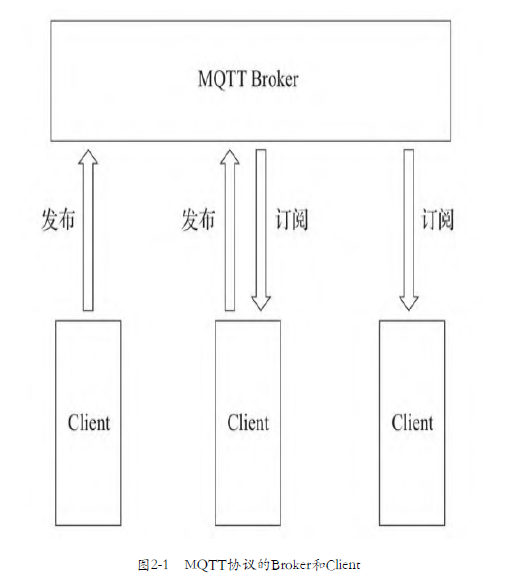
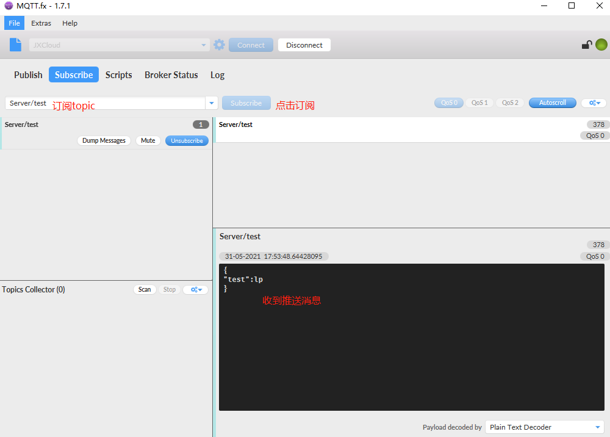

> [mqtt-v3.1.1.pdf](../resources/static/doc/mqtt-v3.1.1.pdf)

# 常见的物联网协议
包含：
- 物理层协议：LoRaWAN、NB-IoT
- 数据链路层协议：LoRaWAN、NB-IoT
- 应用层协议：MQTT、CoAP、LwM2M

## MQTT协议

`Message Queue Telemetry Transport`：消息队列遥测传输协议。

特点：
- 实现简单。
- 提供数据传输的QoS。
- 轻量、低带宽占用。
- 支持任意类型数据传输。
- 可保持的会话（session）。

特性：
- 基于**TCP协议**的应用层协议。
- 采用 C/S 架构。
- 使用 订阅/发布 模式，将消息的发送方 和接收方 解耦。
- 提供三种消息QoS（Quality of Service）：最多一次、最少一次、只有一次。
- 消息的发送 和接收 都是异步的。

MQTT协议的架构由 Broker 和连接到Broker的多个Client组成。


## MQTT-SN协议

`MQTT for Sensor Network`：是MQTT协议的传感器版本。

- MQTT-SN运行在**UDP协议**上，同时保留了MQTT协议的大部分信令和特性，如订阅和发布等。
- MQTT-SN协议引入了MQTT-SN网关这一角色，网关负责把MQTT-SN协议转换为MQTT协议，并和远端的MQTT Broker进行通信。
- MQTT-SN协议支持网关的自动发现。


## CoAP协议

`Constrained Application Protocol`：是一种运行在资源比较紧张的设备上的协议。

- CoAP协议通常也是运行在**UDP协议**上的。
- CoAP协议设计得非常小巧，最小的数据包只有4个字节。
- CoAP协议采用C/S架构，使用类似于HTTP协议的请求-响应的交互模式。
  设备可以通过类似于`coap://192.168.1.150:5683/2ndfloor/temperature`的URL来标识一个实体，
  并使用类似于HTTP的PUT、GET、POST、DELETE请求指令来获取或者修改这个实体的状态。
- CoAP提供一种观察模式，观察者可以通过 OBSERVE指令向CoAP服务器指明观察的实体对象。
  当实体对象的状态发生变化时，观察者就可以收到实体对象的最新状态，类似于MQTT协议中的订阅功能。


## LwM2M协议

`Lightweight Machine-To-Machine`：轻量级设备对设备的协议。

- 使用REST ful接口，提供设备的接入、管理、通信功能，也适用于资源比较紧张的设备。
- LwM2M协议底层使用 CoAP协议传输数据和信令。
  而在LwM2M协议的架构中，CoAP协议可以运行在UDP或者SMS（短信）之上，通过DTLS（数据报传输层安全）来实现数据的安全传输。


在没有移动数据网络覆盖的地区，比如偏远地区的水电站，用短信作为信息传输的载体已经有比较长的历史了。

LwM2M协议架构主要包含3种实体：
`LwM2M Bootstrap Server`负责引导LwM2M Client注册并接入`LwM2M Server`，
之后LwM2M Server和`LwM2M Client`就可以通过协议指定的接口进行交互了。

## HTTP协议

常用在资源比较充足的设备。比如：运行安卓操作系统的设备。

## LoRaWAN协议

一种低功率广域网协议，是物理层/数据链路层协议，主要解决设备如何接入互联网的问题，不运行在IP网络上。

用在有线网络、4G、WiFi不能覆盖的场景。

LoRa（Long Range）是一种无线通信技术，它具有使用距离远、功耗低的特点。

比如在隧道施工中，用户就可以使用LoRaWAN技术进行组网，在工程设备上安装支持LoRA的模块。
通过LoRa的中继设备将数据发往位于隧道外部的、有互联网接入的LoRa网关，LoRa网关再将数据封装成可以在IP网络中通过TCP协议或者UDP协议传输的数据协议包（比如MQTT协议），然后发往云端的数据中心。


## NB-IoT协议

`Narrow Band Internet of Things`：窄带物联网协议。和LoRaWAN协议一样，是将设备接入互联网的物理层/数据链路层的协议。

和LoRA不同的是，NB-IoT协议构建和运行在蜂窝网络上，消耗的带宽较低，可以直接部署到现有的GSM网络或者LTE网络。
设备安装支持NB-IoT的芯片和相应的物联网卡，然后连接到NB-IoT基站就可以接入互联网。
而且NB-IoT协议不像LoRaWAN协议那样需要网关进行协议转换，接入的设备可以直接使用IP网络进行数据传输。

NB-IoT协议相比传统的基站，增益提高了约20dB，可以覆盖到地下车库、管道、地下室等之前信号难以覆盖的地方。


# MQTT协议详解

**MQTT协议与传统消息队列区别：**
- 传统消息队列：发送消息前 必须先创建相应的队列。  MQTT协议：不需要预先创建要发布的主题(Topic)。
- 传统消息队列：未被消费的消息会保存在某个队列中 直至被某个消费者消费。  MQTT协议：如果发布的消息没有被任何客户端订阅，消息将被丢弃。
- 传统消息队列：一个消息只能被一个客户端获取。  MQTT协议：一个消息可以被多个订阅者获取。并且MQTT不支持指定消息被单一客户端获取。

## MQTT协议的通信模型

MQTT是通过 `发布/订阅模式`来通信的。

消息的发布者 和消费者 通过此模式解耦，中间通过`Broker`来存储和转发消息。消息发布方和订阅方都是`Client`。

MQTT通信流程：
1. 发布者(Publisher)和订阅者(Subscriber) 都建立了到Broker的TCP连接。
2. 订阅者告知Broker他要订阅的消息主题（Topic）。
3. 发布者指定消息主题，并将消息发送到Broker。
4. Broker接收到消息后，将消息转发给订阅此Topic的订阅者们。
5. 订阅者们从Broker获取到消息。
6. 如果某个订阅者此时处于离线状态，那么Broker会保留此消息，在该订阅者再次上线时转发给它。


## MQTT Broker

一个MQTT Broker应该具备的能力：
- 可以支持对Client的接入授权，并对Client进行权限控制。
- 可以横向扩展，比如支持集群，以满足海量的Client接入。
- 有较好的扩展性，可以比较方便的接入现有的业务系统。
- 方便监控，满足高可用性。

**常见的MQTT Broker：**
1. `Mosquitto`：C语言编写，开源，支持单机，单机配置运行简单，拓展麻烦。
2. **`EMQ X`**：Erlang语言编写，有开源版本 和付费版本，支持集群，可以通过插件方式进行功能拓展。
3. `HiveMQ`：Java语言编写，只有付费版，支持集群，可以通过插件方式进行功能拓展。
4. `VerneMQ`：Erlang语言编写，开源（瑞士公司提供商业服务），支持集群，可以通过插件方式进行功能拓展。


## MQTT协议数据包格式

MQTT协议使用的是：二进制数据包。

一个MQTT协议数据包包含3部分：
- 固定报头（Fix Header）：存在于所有的MQTT协议数据包中，用于表示数据包类型、对应标识，表明数据包大小。
- 可变报头（Variable Header）：存在于部分类型的MQTT协议数据包中，具体内容有相应类型的数据包决定。
- 消息体（有效载荷:Payload）：存在于部分MQTT协议数据包中，存储消息的具体数据。


1. **数据包类型**：MQTT协议数据包的**固定头的第一个字节的高四位** 表示该数据包的类型。
     
2. **数据包标识位**：MQTT协议数据包的**固定头的第一个字节的低四位**。不用类型数据包 标识位定义不一样。
     
   - DUP1: 控制报文的重复分发标志
   - QoS2：PUBLISH报文的服务质量等级
   - RETAIN3: PUBLISH报文的保留标志
3. **数据包剩余长度**：从固定位第二个字节开始，用于标识当前数据包剩余长度的字段，= 可变头长度 + 消息体长度。
    - 这个字段最少1个字节，最多4个字节。
    - 其中，每个字节的最高位叫延续位（Continuation Bit），表示在这个字节之后是否还有一个用于标识剩余长度的字节。剩下的低7位用于标识值，范围：0~127。
    - 例如，剩余长度字段的第一个字节的最高位为1，那么意味着剩余长度至少还有1个字节，然后继续读下一个字节，下一个字节的最高位为0，那么剩余长度字段到此为止，一共2个字节。
      

所以，这4个字节最多可以标识的包长度为：（0xFF,0xFF,0xFF,0x7F）=268 435 455字节，即256MB，这是MQTT协议中数据包的最大长度。

## 建立到Broker的连接

Client在发布和订阅消息之前必须先连接到Broker。Client建立连接的流程：
1. Client向Broker发送一个 `CONNECT` 数据包；
2. Broker收到Client的CONNECT数据包后，会回复一个`CONNACK`包：
   - CONNACK包的返回码为0，表示允许Client接入，MQTT协议连接建立成功；
   - CONNACK包返回码不为0，表示不允许Client接入，返回码表示接入失败的原因，之后断开底层的TCP连接。

### CONNECT数据包

1. 固定头
   
   固定头中的MQTT协议数据包类型字段的值为1，代表CONNECT数据包。

2. 可变头

    4部分组成：
   - 协议名称。6个字节，UTF-8编码字符串：前2个字节标识字符串长度；后4个字节为协议名称固定为"MQTT"（**如果协议名称不正确，Broker会断开与Client的连接**）。
   - 协议版本。1个字节，无符号整数。
   - 连接标识。1个字节，每个标识位表示不同的连接选项。
     1. bit0：保留。
     2. bit1：会话清除标识（Clean Session）：标识Client是否建立一个持久化的会话，值为0/1。0表示Client希望建立持久会话连接，Broker会存储该Client订阅的主题和未接收的消息，否则Broker不保存这些数据，并在建立连接时清除这个Client之前存在的持久会话所保留的数据。
     3. bit2：遗愿标识（Will Flag）：标识是否使用遗愿消息，值为0/1；
     4. bit3、bit4：遗愿消息QoS标识（Will QoS）：标识遗愿消息的QoS，值为0、1、2；
     5. bit5：遗愿消息Retain标识（Will Retain）：标识遗愿消息是否是Retain消息，值为0/1；
     6. bit6：密码标识（Password Flag）：标识消息体中是否有密码字段，值为0/1；
     7. bit7：用户名标识（User Name Flag）：标识消息体中是否由用户名字段，值为0/1。
   - Keepalive。2个字节，连接保活设置，Keepalive代表一个单位为秒的时间间隔，Client和Broker之间在这个时间间隔之内至少要有一次消息交互，否则Client和Broker会认为它们之间的连接已经断开。

3. 消息体

    5个字段组成：
   - 客户端标识符（Client Identifier）：必选，唯一，标识Client身份，Broker通过这个字段来区分不同Client。
     - MQTT协议要求Client连接时必须携带；
     - 但也允许Broker在实现时接受 客户端标识符为空 的CONNECT包，此时Broker会给Client分配一个内部唯一的标识符。
     - 如果需要使用持久性会话，就必须携带。
   - 遗愿主题（Will Topic）：可选，可变头的连接标识来决定是否包含。当Client非正常地中断连接时，Broker将向指定的遗愿主题发布遗愿消息。
   - 遗愿QoS：可选，可变头的连接标识来决定是否包含。
   - 遗愿消息（Will Message）：可选，可变头的连接标识来决定是否包含。当Client非正常地中断连接时，Broker将向指定的遗愿主题发布由该字段指定的内容。
   - 用户名和密码：可选，可变头的连接标识来决定是否包含。
     - 用户名（Username）：可变头中用户名标识为1时 消息体将包含用户名字段。Broker可以使用用户名+密码 对Client进行授权验证。不同Client可以使用相同的用户名和密码进行连接。
     - 密码（Password）：可变头中密码标识为1时 消息体将包含密码字段。

消息体的前2个字节表示字段值长度。

### CONNACK数据包

1. 固定头
   
   固定头中的MQTT数据包的类型字段值为2，代表CONNACK数据包。CONNACK数据包剩余长度固定为2。

2. 可变头

2个字节：连接确认标识 + 连接返回码
- 连接确认标识：前7位保留 值为0，最后一位标识会话存在标识（Session Present Flag） 值为0/1。
    - 当Client在连接时设置Clean Session=1，则CONNACK中的Session Present Flag始终为0；
    - 当Client在连接时设置Clean Session=0，那就有两种情况：
        - 如果Broker保存了这个Client之前留下的持久性会话，那么CONNACK中的Session Present Flag值为1；
        - 如果Broker没有保存该Client 的任何会话数据，那么CONNACK中的Session Present Flag值为0。

- 连接返回码（Connect Return Code）：用于标识Client与Broker 的连接是否建立成功。

    | **值** | **返回码响应**            | **描述**                     |
    | ----- | -------------------- | -------------------------- |
    | 0     | 0x00 连接已接受           | 已接受连接                      |
    | 1     | 0x01 连接被拒绝，不可接受的协议版本 | Server不支持Client请求的MQTT协议级别 |
    | 2     | 0x02 连接被拒绝，标识符被拒绝    | 客户端标识符是正确的 UTF-8 但服务器不允许   |
    | 3     | 0x03 连接被拒绝，服务器不可用    | 已建立网络连接，但 MQTT 服务不可用       |
    | 4     | 0x04 连接被拒绝，用户名或密码错误  | 用户名或密码中的数据格式错误             |
    | 5     | 0x05 拒绝连接，未授权        | 客户端无权连接                    |
    | 6-255 |                      | 备用                         |

    - 返回码2 表示Client Identifier格式不规范，比如长度超过23个字符、包含了不允许的字符等（部分Broker的实现在协议标准上做了扩展，比如允许超过23个字符的Client Identifer等）。
    - 返回码4 表示用户名或密码格式错误；或者用户名或密码错误。
    - 返回码5 一般表示Broker不使用用户名密码认证，而使用IP地址 或客户端标识符（Client Identifier）验证时 标识Client没有经过验证。

3. 消息体

CONNACK 包没有消息体

### 关闭连接

MQTT协议的连接关闭可以由Client或Broker二者任意一方发起。

1. Client主动关闭连接  

Client主动向Broker发送一个`DISCONNECT`包即可。  
在Client发送完DISCONNECT数据包之后，就可以关闭底层的TCP连接了，不需要等待Broker的回复，Broker也不会回复DISCONNECT数据包。

`DISCONNECT`包固定头格式：


- 固定头中的MQTT协议数据包类型字段的值为14，代表该数据包为DISCONNECT数据包。
- DISCONNECT的数据包剩余长度固定为0。
- DISCONNECT数据包没有可变头和消息体。

为什么Client断开TCP连接前 需要发一个`DISCONNECT`包，而不是直接断开TCP连接？  
因为：Broker收到`DISCONNECT`包才会认为Client是正常断连，就会丢弃当前连接指定的遗愿消息（Will Message）。  
    否则会认为是非正常断连，则会向指定的遗愿主题发布遗愿消息。

2. Broker主动关闭连接

Broker在 Keepalive 的时间间隔里，没有收到Client的任何MQTT协议数据包时 就会主动关闭连接。
（一些Broker的实现在MQTT协议上做了一些拓展，支持Client的连接管理，可以主动断开和某个Client的连接。）

Broker主动关闭连接 会直接关闭底层的TCP连接，之前不需要向Client发送任何MQTT协议数据包。


## 订阅/发布

和传统队列的不同点：如果ClientB在ClientA发完消息后才订阅的Topic，那么ClientB不会收到该消息。

发布者发送消息时，订阅者是离线状态，但只要订阅者在发送者发布消息之前订阅过topic，那么上线后 也会收到该消息（离线消息）。
（接收离线消息需要：①Client使用持久会话；②发布消息的QoS不小于1。）

### PUBLISH数据包

1. 固定头


- 数据包 类型字段为3，表示PUBLISH数据包。
- 数据包 固定头中 标识位（Flag）有3个字段：
    - 消息重复标识（DUP Flag）：长度1bit，值为0/1，当`DUP Flag = 1`时，代表是一条重发消息，因为Receiver没有确认收到之前的消息。该标识只在`QoS > 0`的消息中使用。
    - QoS：长度2bit，值为0、1、2，表示消息的服务质量级别。
    - Retain标识（Retain Flag）：长度1bit，值为0/1，为1时，表示为Retained消息，如果是Client发给Broker的PUBLISH消息，那么Broker会保存该消息，并且之后有新的订阅者该消息主题时 会优先收到该消息。

2. 可变头

包含两个字段：
- 主题名（Topic）：UTF-8字符串，前2个字节表示字符串长度（最大65535）。
- 包标识符（Packet Identifier）：只存在于QoS1 和QoS2 的PUBLISH包中。

Topic规范：
- 应包含层级，层级间用 `/` 划分
- 开头不使用 `/`
- 中间不含有空格
- 只包含ASCII字符
- 名称在可读条件下 尽可能简短
- 字母大小写敏感
- 可以添加设备唯一标识进去
- 主题尽量精确，不适用宽泛的主题。比如多种传感器 应使用多个主题名
- 不要使用`$`开头的主题，`$`开头的主题名属于Broker预留的系统主题，常用于发布Broker内部的统计信息，比如`$SYS/broker/clients/connected`

3. 消息体

就是要发送的数据，可以是任意格式的数据：二进制、文本、JSON等。具体格式由程序定义。

消息体中数据的长度 = 固定头中数据包剩余长度 - 可变头的长度。

### 订阅主题

- Client向Broker发送一个`SUBSCRIBE`数据包，其中包含Client想要订阅的主题以及其他参数。
- Broker收到SUBSCRIBE数据包后，向Client发送一个`SUBACK`数据包作为应答。

1. **SUBSCRIBE数据包**

- 固定头  
    
    固定头中的MQTT协议数据包类型字段的值为8，表示SUBSCRIBE数据包。
- 可变头：只包含一个2字节的包标识符，标识唯一数据包。只需保证从发布者 到接收者一次消息交互中唯一即可。
- 消息体  
    - 由Client要订阅的主题列表构成。
    - 包中的主题名可以包含通配符：单层通配符 `+`、多层通配符 `#`
    - `+`可以通配某一层，如`home/f2/+/temperature`可以匹配：`home/f2/201/temperature`、`home/f2/202/temperature`、`home/f2/203/temperature`等。
    - `#`可以通配某几层，但必须放到最后`/`后，如`home/f2/#`可以匹配：`home/f2`、`home/f2/201`、`home/f2/201/temperature`、`home/f2/201/livingroom/temperature`、`home/f2/301/temperature`等。
    - 每个订阅的Topic后有一个字节，表示该主题的QoS（值0、1、2）。
    
2. **SUBACK数据包**

- 固定头:固定头中的MQTT协议数据包类型字段的值为9，表示SUBACK数据包。
- 可变头：只包含一个2字节的包标识符
- 消息体：  
    - SUBACK数据包包含一组返回码，返回码的数量和顺序与SUBSCRIBE数据包的订阅列表对应，用于标识订阅类别中每一个订阅项的订阅结果。
    - 返回码值：0 ~ 2，表示订阅成功，及QoS等级。
    - 返回码值：128，表示订阅失败。比如没权限；或者要订阅的Topic格式不正确。
    
### 取消订阅

- Client向Broker发送一个`UNSUBSCRIBE`数据包，其中包含Client想要取消订阅的主题。
- Broker收到UNSUBSCRIBE数据包后，向Client发送一个`UNSUBACK`数据包作为应答。

1. **UNSUBSCRIBE数据包**
    - 固定头：包类型字段的值为10，表示UNSUBSCRIBE数据包。
    - 可变头：只包含一个2字节的包标识符
    - 消息体：包含要取消订阅的Topic列表，Topic规则跟`SUBSCRIBE`一样，但通配符不表示通配符作用，只表示个字符，必须为具体的Topic。
        - 订阅主题名为`home/2ndfloor/201/temperature`，取消订阅名为`home/+/201/temperature`，并不会取消之前的订阅。
        - 订阅主题名为`home/+/201/temperature`，取消订阅名为`home/+/201/temperature`，这样才能取消之前的订阅。
    
2. **UNSUBACK数据包**
    - 固定头：包类型字段的值为11，表示UNSUBACK数据包。
    - 可变头：只包含一个2字节的包标识符。
    - 消息体：UNSUBACK数据包没有消息体。


## QoS（服务质量）

1. **QoS0：至多一次；只发送一次，收没收到不管。**
   - Client和Broker之间网络比较稳定的情况。
   - 可以接受丢失部分消息也不影响的场景。
   - 不需要离线消息。

2. **QoS1：至少一次；发送失败会重试，直到收到为止，消息可能重复。**
   - 需要接收所有消息，并可以接受处理重复消息。
   - 无法接受QoS2带来的额外开销，QoS1发送消息速度比QoS2快很多。

3. **QoS2：只有一次；发送失败会重试，但会保证Receiver只会收到一次。**
   - 必须要收到所有消息，且不能处理重复的消息，且可以接受QoS2带来的额外开销。

### 实际的Subscribe QoS

在MQTT协议中，从Broker到Subscriber这段消息传递的实际QoS等级 等于Publisher发布消息时指定的QoS等级 和Subscriber在订阅时与Broker协商的QoS等级中 最小的那一个。

这也就解释了`publish qos=0,subscribe qos=1`的情况下Subscriber的实际QoS为0，以及`publish qos=1,subscribe qos=0`时出现QoS降级的原因。


## Retained消息和LWT

TODO


## Keepalive与连接保活

TODO


## MQTT 5.0的新特性

TODO

## MQTT协议实战

TODO


# 搭建一个IoT平台实战

搭建IoTHub

## 准备环境

### 安装开源组件

1. MongoDB：主要数据存储工具
2. Redis：缓存
3. Java：开发语言
4. RabbitMQ：IoT平台内部 及 IoT平台到业务系统 的异步通信
5. Mosquitto MQTT Client：使用mosquito_sub/mosquito_pub是这对命令行MQTT Client来做一些测试。这两个客户端会跟随Mosquitto broker一起安装，但我们不使用Mosquitto broker。
6. EMQ X：作为MQTT Broker，实现MQTT/CoAP协议的接入，及其它高级功能。


### IoTHub平台的组成

1. IoTHub：要搭建的物联网平台简称。
2. IoTHub Server API：IoTHub服务端API，提供RESTful 接口给外部系统调用。
3. IoTHub Server：IoTHub服务端，包含Server API 和IoTHub服务端主要功能代码。
4. IoTHub DeviceSDK：设备端SDK，设备通过调用该SDK提供的API接入IoTHub，并与业务系统进行交互。

定义实体：
1. 设备应用代码：实现设备具体功能的代码（比如打开灯，在屏幕上显示温度等）。它调用DeviceSDK 使用IoTHub提供的功能。属于DeviceSDK的“用户”。
2. 业务系统：实现特定物联网应用服务端的业务逻辑系统。它通过调用Server API 的方式控制设备、使用设备上报的数据。属于Server API的“用户”。

项目结构：两个模块
1. 服务端 IoTHub Server
2. 设备端 DeviceSDK


## 设备生命周期管理

### 设备接入

首先需要在IotHub上注册一个设备，设备再通过由IotHub生成的username/password连接到IotHub，以实现一机一密。

**设备三元组**：表示逻辑上唯一设备。所属产品id：`ProductId`、设备唯一id：`DeviceId`、设备密钥：`Secret`。

EXQ X认证方式：MongoDB认证插件 和JWT认证插件临时认证。（也有其他的认证方式）
    - EMQ X 可以用这两个插件组成认证链 对接入的Client来进行认证。即设备既可以使用存储在MongoDB中的username和password来接入EMQ X Broker，也可以通过JWT来接入EMQ X Broker。
    - EMQ X 在加载一个插件后，会把这个插件的名字写入`<EMQ X安装目录>/emqx/data/loaded_plugins`，EMQ X在每次启动时都会自动加载这个文件里包含的插件，所以只需要手动加载一次这两个插件就可以了。

设备接入流程：
1. 业务系统调用Server API来注册一个设备。（提供参数：ProductId）
2. Server实现来生成一个三元组，并存储到MongoDB，同时还存储设备接入EMQ X的用户名`ProductId/DeviceId`。
3. Server API将三元组返回给业务系统。
4. 固件将三元组烧写给设备。
5. 设备应用代码调用DeviceSDK，并传参三元组。
6. DeviceSDK通过 用户名：`ProductId/DeviceId`，密码：`Secret`连接到EMQ X。
7. EMQ X Broker 到MongoDB中查询用户名和密钥，匹配成功就进行连接。


### 设备状态管理

设备离线 在线状态管理
1. **通过订阅系统主题来感知设备上下线：**

- 设备上线时：EMQ X Broker会向系统主题`$SYS/brokers/${node}/clients/${clientid}/connected`发布一条消息；
- 设备离线时：EMQ X Broker会向系统主题`$SYS/brokers/${node}/clients/${clientid}/disconnected`发布一条消息；

EMQ X Broker的节点名(${node})可以在`<EMQ X安装目录>/emqx/etc/emqx.conf`里进行配置。配置项为node.name，默认值为`emqx@127.0.0.1`。

所以只需要订阅`$SYS/brokers/+/clients/+/connected`和`$SYS/brokers/+/clients/+/disconnected`就可以获取到每个EMQ X节点上所有Client的上线和离线事件。

缺点：始终需要保持一个接入Broker的Client来订阅该主题，如果设备的数量高达十万甚至几十万，这个订阅该主题的Client就很容易成为 单点故障点，所以说这种解决方案的可扩展性比较差。

2. **基于Hook系统的解决方案：**

通过EMQ X 提供的Hook系统 来捕获Broker 内部的事件 并进行处理。

EMQ自带一个WebHook插件，它的原理是：当像Client上线或下线之类的事件发生时，EMQ X会把事件的信息发送到一个事先指定好的URL上，这样我们就可以进行处理了。
    - 开启WebHook：编辑WebHook插件的配置文件，将回调的url地址指向本地应用。
        ```
        1. #< EMQ X 安装目录>/emqx/etc/plugins/emqx_web_hook.conf
        2. web.hook.api.url = http://127.0.0.1:3000/emqx_web_hook
        ```
    - 重新加载WebHook插件：`< EMQ X 安装目录>/emqx/bin/emqx_ctl plugins load emqx_web_hook`
    - 在本地应用代码中实现WebHook的回调。需要注意：/emq_web_hook这个URL是在IotHub内部使用的，除了WebHook，外部是不应该能够访问的。


管理设备的连接状态：
1. IotHub不保存某个设备在线与否这个boolean值，而是保存一个connection列表，这个列表包含了所有用这个设备的三元组接入的connection，connection的信息由WebHook捕获的client_connected事件提供。
2. 当收到client_connected的消息时，通过username里面的ProductId和DeviceId查找到Device记录，然后用ClientID查找Device的connection列表，如果不存在该ClientID的connection记录就新增一条connection记录；如果存在，则更新这条connection记录，状态为connected。
3. 当收到client_disconnected的消息时，通过username里面的ProductId和DeviceId查找到Device记录，然后用ClientID查找Device的connection列表，如果存在该ClientID的connection记录，则更新这条connection记录，状态为disconnected。
4. 业务系统可以通过调用Server API的设备详情接口获取设备的连接状态。

通过这样的设计，我们不仅可以知道一个设备是否在线，还能知道其连接的具体信息。

Connection模型:
```
connected: Boolean,
client_id: String,
Keepalive: Long,
ipaddress: String,
proto_ver: Long,
connected_at: Long,
disconnect_at: Long,
conn_ack: Long,
device: 
```

缺点：
- 存在性能问题。每次设备上下线，包括Publish/Subscribe等，EMQ X都会发起一个HTTP POST，会有一定的性能损耗，损耗大小取决于业务和数据量。
- 设备状态不准确。由于Web服务是并发的，有可能会在很短时间内发生的一对connect/disconnect事件，而disconnect会比connect先处理，从而导致设备的连接状态不正确。
- 设备下线时间我们取的是处理这个事件的时间，不准确。


### 设备的禁用与删除

编写接口：禁止设备接入认证、恢复接入认证、删除设备信息。


### 设备权限管理

TODO

### 拓展

TODO


## 上行数据处理

南向设备上报

TODO

## 下行数据处理

北向命令下发

TODO

## IotHub的高级功能

TODO

## 扩展EMQ X Broker

TODO

## 集成CoAP协议

TODO


# MQTT.fx模拟器的使用

1. 新建Profile，填写相关信息。


2. 填写用户名和密码。


3. 连接


4. 消息推送


5. 消息订阅




6. 扫描当前所有topic


7. 查看日志


