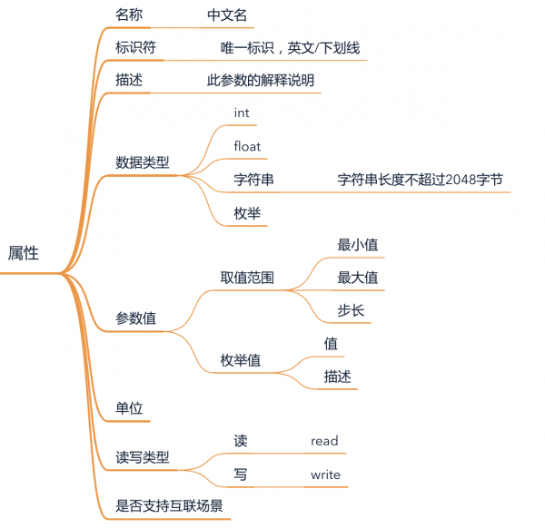

# 概念

物模型TSL（Thing Specification Language）是一个JSON格式的文件，是对产品在云上的数字化描述，从属性、服务、事件三个维度来完成对产品功能的定义。

| 功能类型         | 说明                                                         |
| :--------------- | :----------------------------------------------------------- |
| 属性（Property） | 设备可读取和设置的能力。一般用于描述设备运行时的状态，如环境监测设备所读取的当前环境温度、湿度等，如智能灯的开关、亮度、颜色、色温。 |
| 服务（Service）  | 设备可被外部调用的能力或方法，可设置输入参数和输出参数。相比于属性，服务可通过一条指令实现更复杂的业务逻辑，如执行某项特定的任务。 |
| 事件（Event）    | 设备运行时，主动上报给云端的事件。事件一般包含需要被外部感知和处理的通知信息，可包含多个输出参数。例如，某项任务完成的信息，或者设备发生故障或告警时的温度等，事件可以被订阅和推送。 |

# 属性

**物模型的每个属性包含以下字段**

| 字段名称 | 字段说明         | 约束条件                                                     |
| -------- | ---------------- | ------------------------------------------------------------ |
| 名称     | 参数中文名       | “仅支持中文、英文大小写、数字、部分常用符号（下划线，减号，括弧，空格），必须以中文、英文或数字开头，长度不超过40个字符。” |
| 标识符   | 参数唯一英文标识 | 支持大小写字母、数字和下划线、不超过50个字符。               |
| 数据类型 | 常用六种         | 必选， 整数型(int)：比如灯的亮度是一个整数范围 浮点型(float)：比如电压值范围是0.0 - 24.0 布尔型(boolean)：比如开关只有开、关两种状态 枚举型(enum)：自定义有限集合值，比如灯的颜色有白色、红色、黄色等 字符串(string)：比如灯的位置 时间型(timestamp)：string类型的UTC时间戳。 |
| 枚举项   | 枚举值和解释     | 仅枚举值参数。分为参数值和参数描述，参数值支持整形，不超过2个字符，参数描述支持中文、英文、数字、下划线，不超过20个字符，枚举项数量可自定义。 |
| 取值范围 | 数据范围         | 仅整形、浮点数。可自定义，输入的数值范围不超过各类型数据所能表示的范围。 |
| 步长     | 取值间隔         | 仅整形、浮点数。步长是指设备上报或下发数值时，递增或递减的间隔。步长只能是一个正数；整数型最小步长为1；浮点数最小步长为10^(-7)；最大步长不能超出取值范围的差值。 |
| 数据长度 | 字符串长度       | 仅字符串参数。整数，表示字符串最大长度，取值1-2048           |
| 单位     | 数据单位         |                                                              |
| 读写权限 | 读写权限         | 可选“读”“写”“读写” 表示参数的读写权限                        |
| 描述     | 参数描述         | 100字以内                                                    |

**物模型的每个方法包含以下字段**

| 字段名称 | 字段说明                                                     | 约束条件                                                     |
| -------- | ------------------------------------------------------------ | ------------------------------------------------------------ |
| 名称     | 参数中文名                                                   | 仅支持中文、英文大小写、数字、部分常用符号（下划线，减号，括弧，空格），必须以中文、英文或数字开头，长度不超过40个字符。 |
| 标识符   | 参数唯一英文标识                                             | 支持大小写字母、数字和下划线、不超过50个字符。               |
| 调用方式 | 异步调用是指云端执行调用后直接返回,不会关心设备的回复消息,如果服务为同步调用,云端会等待设备回复,否则会调用超时。 | 异步调用或同步调用任选其一。                                 |
| 输入参数 |                                                              | 输入参数只可选择当前设备的属性，可多选，可为空。             |
| 输出参数 |                                                              | 输出参数只可选择当前设备的属性，可多选，可为空。             |
| 描述     | 参数描述                                                     | 100字以内                                                    |

**物模型的每个事件包含以下字段**

| 字段名称 | 字段说明         | 约束条件                                                     |
| -------- | ---------------- | ------------------------------------------------------------ |
| 名称     | 参数中文名       | 仅支持中文、英文大小写、数字、部分常用符号（下划线，减号，括弧，空格），必须以中文、英文或数字开头，长度不超过40个字符。 |
| 标识符   | 参数唯一英文标识 | 支持大小写字母、数字和下划线、不超过50个字符。               |
| 输出参数 |                  | 输出参数只可选择当前设备的属性，可多选，可为空。             |
| 描述     | 参数描述         | 100字以内                                                    |

# 示例

- [智能灯-物模型定义.json](/resources/static/iot/智能灯-TSL.json)
