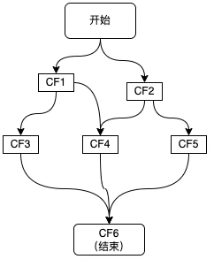

# 目录

- [CompletableFuture](#CompletableFuture)
- [Java异步编程难题拆解👇👇👇](https://blog.csdn.net/sinat_28461591/category_12981736.html)
    - [深入理解 Java CompletableFuture：核心原理剖析与企业级使用场景实战](#深入理解Java CompletableFuture：核心原理剖析与企业级使用场景实战)
        - [CompletableFuture 设计目标与定位](#CompletableFuture设计目标与定位)
        - [内部组成：Completion、UniCompletion、ForkJoinPool 机制](#内部组成：Completion、UniCompletion、ForkJoinPool机制)
        - [多线程环境下的状态流转与内存模型保障](#多线程环境下的状态流转与内存模型保障)
        - [supplyAsync/runAsync、thenApply/thenCompose、handle 等方法解读](#对supplyAsync/runAsync、thenApply/thenCompose、handle等方法解读)
        - [使用 thenCompose 构建任务依赖链的标准做法](#使用thenCompose构建任务依赖链的标准做法)
        - [服务聚合调用（RPC并发执行）](#服务聚合调用（RPC并发执行）)
        - [数据预加载与缓存异步刷新](#数据预加载与缓存异步刷新)
        - [与数据库/外部服务的 IO 并行交互](#与数据库/外部服务的IO并行交互)
        - [实时日志/监控上传异步处理解耦主链路](#实时日志/监控上传异步处理解耦主链路)
        - [handle、exceptionally、whenComplete 的差异性行为复现](#handle、exceptionally、whenComplete的差异性行为复现)
        - [多任务组合中局部失败如何优雅处理](#多任务组合中局部失败如何优雅处理)
        - [异步链中异常传播导致业务不一致的案例拆解](#异步链中异常传播导致业务不一致的案例拆解)
        - [Executor 配置建议（核心线程数、队列大小、拒绝策略）](#Executor配置建议（核心线程数、队列大小、拒绝策略）)
        - [从零构建一个可复用的 CompletableFuture 工具组件](#从零构建一个可复用的CompletableFuture工具组件)
    - [CompletableFuture VS Future：性能、编程模型与线程控制全维度对比实战](#CompletableFuture VS Future：性能、编程模型与线程控制全维度对比实战)
    - [thenApply、thenCompose 与 thenCombine 全解析：构建高可用异步任务链的实战方法论](#对thenApply、thenCompose、thenCombine全解析：构建高可用异步任务链的实战方法论)
        - [thenApply](#thenApply)
        - [thenCompose](#thenCompose)
        - [thenCombine](#thenCombine)
        - [三者组合使用的链式流程设计模型](#三者组合使用的链式流程设计模型)
        - [常见误区](#常见误区)
        - [链式模型中的线程调度优化策略](#链式模型中的线程调度优化策略)
            - [同步vs异步回调行为的执行线程区别](#同步vs异步回调行为的执行线程区别)
            - [针对CPU/IO混合任务的执行路径优化方案](#针对CPU/IO混合任务的执行路径优化方案)
            - [如何为不同阶段任务配置隔离线程池](#如何为不同阶段任务配置隔离线程池)
        - [可复用的链式调用模板与组件设计](#可复用的链式调用模板与组件设计)
    - [使用 supplyAsync 和 runAsync 的最佳实践与常见坑点解析](#使用supplyAsync、runAsync的最佳实践与常见坑点解析)
    - [常见异步组合模型拆解：并行、顺序、依赖树、聚合处理的工程实现与最佳实践](#常见异步组合模型拆解：并行、顺序、依赖树、聚合处理的工程实现与最佳实践)
    - [深入拆解 CompletableFuture 异常处理机制：handle、exceptionally、whenComplete 全面解析与实战策略](#深入拆解CompletableFuture异常处理机制：handle、exceptionally、whenComplete全面解析与实战策略)
    - [深入理解 CompletableFuture 的线程模型：默认 ForkJoinPool 与自定义线程池实战解析](#深入理解CompletableFuture的线程模型：默认ForkJoinPool与自定义线程池实战解析)
    - [构建响应式流水线：使用 thenCompose 实现异步依赖编排全流程解析](#构建响应式流水线：使用thenCompose实现异步依赖编排全流程解析)
    - [基于 CompletableFuture 的典型IO异步封装实战：远程接口调用全流程优化解析](#基于CompletableFuture的典型IO异步封装实战：远程接口调用全流程优化解析)
        - [远程调用中常见的同步瓶颈与资源阻塞问题](#远程调用中常见的同步瓶颈与资源阻塞问题)
        - [基于 CompletableFuture 的异步 IO 封装核心思路](#基于CompletableFuture的异步IO封装核心思路)
        - [HTTP 接口异步封装实战（以 WebClient / OkHttp 为例）](#HTTP接口异步封装实战)
        - [RPC 微服务异步封装实战（以 Dubbo / gRPC 为例）](#RPC微服务异步封装实战)
        - [超时控制、限流熔断与异常恢复策略集成](#超时控制、限流熔断、异常恢复策略集成)
        - [上下文透传与 TraceId 链路一致性维护](#上下文透传与TraceId链路一致性维护)
        - [多接口并发请求聚合处理模型（allOf + thenCombine）](#多接口并发请求聚合处理模型（allOf+thenCombine）)
        - [构建通用异步 IO 客户端组件的工程实战路径](#构建通用异步IO客户端组件的工程实战路径)
    - [CompletableFuture 中的阻塞陷阱：join/get 使用限制与替代方案](#CompletableFuture中的阻塞陷阱：join/get使用限制与替代方案)
    - [异步任务堆积与线程耗尽问题定位与治理策略：基于 CompletableFuture 的系统化诊断与优化实践](#异步任务堆积与线程耗尽问题定位与治理策略：基于CompletableFuture的系统化诊断与优化实践)
    - [任务链中异步错误传播失败的根因排查与解决：CompletableFuture 异常链路的稳定性实战解析](#任务链中异步错误传播失败的根因排查与解决：CompletableFuture异常链路的稳定性实战解析)
    - [业务中大量小任务异步组合导致性能抖动问题优化实战](#业务中大量小任务异步组合导致性能抖动问题优化实战)
    - [CompletableFuture 与数据库连接池资源耗尽问题协同分析：异步编排下的资源瓶颈复现与优化实践](#CompletableFuture与数据库连接池资源耗尽问题协同分析：异步编排下的资源瓶颈复现与优化实践)
    - [异步调用返回顺序不可控导致业务逻辑异常的修复思路与工程实践](#异步调用返回顺序不可控导致业务逻辑异常的修复思路与工程实践)
    - [多 CompletableFuture 聚合中某个任务失败导致整体 hang 住的处理策略](#多CompletableFuture聚合中某个任务失败导致整体hang住的处理策略)
- [美团：CompletableFuture示例](#美团CompletableFuture示例)

----------------------------------------------------------------------------------------------------------------------------------------------------------

# CompletableFuture

- [异步非阻塞：CompletableFuture](https://github.com/Panl99/demo/tree/master/demo-action/src/main/java/com/lp/demo/action/java_in_action/CompletableFutureDemo.java)

子线程会跟随主线程任务结束而结束，CompletableFuture.allOf(List<CompletableFuture>).join()阻塞所有线程直到所有线程执行完毕。

[目录](#目录)

----------------------------------------------------------------------------------------------------------------------------------------------------------
[🔗Java异步编程难题拆解👇👇👇](https://blog.csdn.net/sinat_28461591/category_12981736.html)

## 深入理解Java CompletableFuture：核心原理剖析与企业级使用场景实战
> [🔗链接](https://blog.csdn.net/sinat_28461591/article/details/148463038)

本文结合一线开发实践，系统性地剖析 CompletableFuture 的底层运行机制、线程模型、核心方法行为，并通过多个真实使用场景（如服务聚合、资源隔离、异常恢复等）展示其在高并发系统中的应用效果，为工程团队在设计异步架构时提供指导。

目录：
1. CompletableFuture 背景与诞生初衷
    - 异步编程的痛点回顾（Future、线程池、回调地狱）
    - [CompletableFuture 设计目标与定位](#CompletableFuture设计目标与定位)
2. 核心类结构与工作机制详解
    - [内部组成：Completion、UniCompletion、ForkJoinPool 机制](#内部组成：Completion、UniCompletion、ForkJoinPool机制)
    - [多线程环境下的状态流转与内存模型保障](#多线程环境下的状态流转与内存模型保障)
    - 自定义线程池与默认 ForkJoinPool 的差异
3. 基础 API 全解与调用语义
    - [supplyAsync/runAsync、thenApply/thenCompose、handle 等方法解读](#对supplyAsync/runAsync、thenApply/thenCompose、handle等方法解读)
    - 方法链中的同步/异步语义区别（是否传 executor）
    - [使用 thenCompose 构建任务依赖链的标准做法](#使用thenCompose构建任务依赖链的标准做法)
4. 性能行为分析：与 Future/ExecutorService 对比测试
    - 多任务并发执行下的吞吐率对比（含真实 benchmark 数据）：结论：CompletableFuture 在高频场景下表现更优，特别是在任务链可异步解耦的场景中（CompletableFuture + Async + 自定义线程池）。
    - 非阻塞性能与上下文切换开销分析
      - CompletableFuture 利用回调机制避免阻塞，降低线程上下文切换成本。
      - 相较于传统线程池调度，ForkJoinPool 更适合短生命周期任务（如 CPU 密集型计算）。
      - 不过如果链路过长且处理逻辑复杂，仍可能出现线程抖动或内存压力，应合理设计链路深度。
    - 线程数与任务大小对系统资源的影响评估  
      最佳实践建议：
      - 使用小任务拆分大任务，分散负载；
      - 将耗时任务移出公共线程池，配置独立 ExecutorService；
      - 控制链式深度，避免构建上百层嵌套链式调用，影响栈帧稳定性。 
5. 企业项目中的典型使用场景
    - [服务聚合调用（RPC并发执行）](#服务聚合调用（RPC并发执行）)
    - [数据预加载与缓存异步刷新](#数据预加载与缓存异步刷新)
    - [与数据库/外部服务的 IO 并行交互](#与数据库/外部服务的IO并行交互)
    - [实时日志/监控上传异步处理解耦主链路](#实时日志/监控上传异步处理解耦主链路)
6. 异步异常处理机制实战
    - [handle、exceptionally、whenComplete 的差异性行为复现](#handle、exceptionally、whenComplete的差异性行为复现)
    - [多任务组合中局部失败如何优雅处理](#多任务组合中局部失败如何优雅处理)
    - [异步链中异常传播导致业务不一致的案例拆解](#异步链中异常传播导致业务不一致的案例拆解)
7. 线程池配置与资源隔离建议
    - 不同业务使用不同线程池的隔离实践
    - 如何防止 ForkJoinPool 被业务任务长时间阻塞
    - [Executor 配置建议（核心线程数、队列大小、拒绝策略）](#Executor配置建议（核心线程数、队列大小、拒绝策略）)
8. [从零构建一个可复用的 CompletableFuture 工具组件](#从零构建一个可复用的CompletableFuture工具组件)
    - 封装统一的异步任务执行框架
    - 上下文透传（如 TraceId、用户信息）
    - 埋点与监控接入点预留策略


#### CompletableFuture设计目标与定位

- **链式编程模型**：通过 `thenApply`、`thenCompose`、`handle` 等方法，实现多个异步任务的串联与组合，代码逻辑更加线性、清晰。
- **非阻塞执行**：异步任务默认在 `ForkJoinPool.commonPool()` 中执行，支持自定义线程池；通过回调机制完成结果处理，避免线程阻塞。
- **灵活的异常恢复机制**：支持链路中途任一节点出错的局部处理，不影响其他独立分支的执行。
- **多任务组合能力**：如 `allOf`、`anyOf`，可以聚合多个异步任务的结果或监听多个任务中任意一个完成。


#### 内部组成：Completion、UniCompletion、ForkJoinPool机制

CompletableFuture 底层由多个关键组件组成，它的异步能力和任务链管理正是依赖这些结构：
- `Completion`：核心抽象类，用于定义异步计算完成后需要执行的操作。
- `UniCompletion`：表示单一源（一个前置任务）的回调阶段，是最常见的回调类型，典型如 `thenApply`。
- `BiCompletion`：表示两个源任务依赖的回调，例如 `thenCombine`。
- `ForkJoinPool.commonPool()`：Java 8 引入的共享线程池，默认用于执行异步任务。其设计遵循工作窃取算法（Work Stealing），在任务量不均时可提高 CPU 利用率。

一个 CompletableFuture 实例在底层维护一个状态位和多个 Completion 对象链表。当任务完成或失败后，会触发相关回调链表的逐一执行。


#### 多线程环境下的状态流转与内存模型保障

CompletableFuture 的状态由 result 字段表示，其值可能为：
- `null`：表示未完成
- `result != null && !(result instanceof Throwable)`：表示正常完成
- `result instanceof Throwable`：表示任务异常

所有状态变更均通过 CAS（Compare-And-Swap）机制完成，确保线程安全。在并发环境下，无论多少线程等待一个任务完成，状态变更始终是原子且唯一的。任务完成后，所有等待线程会被唤醒并执行各自注册的回调。


#### 对supplyAsync/runAsync、thenApply/thenCompose、handle等方法解读

CompletableFuture 提供了丰富的 API 用于启动异步任务、处理结果、捕捉异常。其中核心方法按功能划分如下：

1. 启动异步任务：
    - `supplyAsync(Supplier<T>)`：用于有返回值的异步任务，典型应用如异步获取数据。
    - `runAsync(Runnable)`：用于无返回值的异步任务，如异步日志、清理等操作。
    - 这两个方法都可接收一个自定义 `Executor` 作为第二参数。
2. 结果处理方法（链式处理）：
    - `thenApply(Function)`：接收上一个任务结果并返回新结果，同步调用。
    - `thenApplyAsync(Function)`：异步处理上一个结果，默认使用 ForkJoinPool 或指定的 Executor。
    - `thenCompose(Function)`：适用于需要基于上一个结果返回新的 CompletableFuture 场景，实现扁平化链式调用。
3. 多任务组合处理：
    - `thenCombine(future2, BiFunction)`：等待两个任务都完成后聚合结果。
    - `allOf(futures…)`：等待所有任务完成，无返回结果。
    - `anyOf(futures…)`：任一任务完成即返回。
4. 异常处理：
    - `handle(BiFunction)`：无论是否异常都会执行，并可访问异常对象。
    - `exceptionally(Function)`：仅在异常时执行，用于错误恢复。
    - `whenComplete(BiConsumer)`：仅用于观察，不改变最终结果。

#### 使用thenCompose构建任务依赖链的标准做法

很多场景中，第二个异步任务依赖第一个结果，比如：
```java
CompletableFuture<User> userFuture = getUserAsync(userId);
CompletableFuture<List<Order>> orderFuture = userFuture.thenCompose(user -> getOrdersByUserAsync(user));
```
这是典型的 “扁平化” 编排模式，避免了：`.thenApply(user -> getOrdersByUserAsync(user)) // 返回的是 CompletableFuture<CompletableFuture<List<Order>>>`这种嵌套结果的困扰。

在需要执行多个层级异步请求时，应尽可能使用 `thenCompose` 而非 `thenApply`，保持链路清晰、易于追踪。


#### 服务聚合调用（RPC并发执行）

在微服务架构下，一个网关层或 [BFF](#BFF) 层常需要聚合多个下游服务的响应，如：
- 用户信息服务
- 订单服务
- 推荐服务
```java
CompletableFuture<User> userFuture = CompletableFuture.supplyAsync(() -> userClient.getUser(uid), executor);
CompletableFuture<Order> orderFuture = CompletableFuture.supplyAsync(() -> orderClient.getOrder(uid), executor);
CompletableFuture<Recommendation> recFuture = CompletableFuture.supplyAsync(() -> recClient.getRecommendations(uid), executor);

CompletableFuture.allOf(userFuture, orderFuture, recFuture).join();
```
此种写法广泛用于聚合层服务开发中，经过合理线程池配置与异常兜底机制，可实现毫秒级聚合响应。

#### 数据预加载与缓存异步刷新

业务场景中常存在如下模式：
- 页面渲染提前预加载数据
- 热点缓存过期时自动刷新后台数据

使用 CompletableFuture 可在业务主链路不中断的情况下并发刷新数据：
```java
cache.get("productInfo").orElseGet(() -> {
    CompletableFuture.runAsync(() -> {
        Product p = productService.fetchLatest(pid);
        cache.put("productInfo", p);
    }, cacheRefreshExecutor);
    return fallbackProduct();
});
```
既能提高可用性，又能减少阻塞链路的资源占用。


#### 与数据库/外部服务的IO并行交互

以电商详情页为例，需同时加载以下数据：
- 商品基础信息（数据库）
- 库存状态（Redis）
- 价格（下游定价服务）

若同步串行完成，瓶颈在于 IO 交互。而通过 CompletableFuture 将多个 IO 异步并发处理，可大幅压缩端到端响应时间。
```java
CompletableFuture<Product> productFuture = supplyAsync(() -> dao.getProduct(pid), ioExecutor);
CompletableFuture<Stock> stockFuture = supplyAsync(() -> redis.getStock(pid), ioExecutor);
CompletableFuture<Price> priceFuture = supplyAsync(() -> priceClient.getPrice(pid), ioExecutor);
```
结合 thenCombine 聚合结果，再统一构建返回对象。

#### 实时日志/监控上传异步处理解耦主链路

主链路上日志、埋点、监控、事件通知等“边缘逻辑”常见问题是阻塞主业务线程，使用 `CompletableFuture.runAsync()` 可实现异步处理，提升主链路流畅性：
```java
CompletableFuture.runAsync(() -> logClient.send(logInfo), asyncLogExecutor);
```
在异步链上接入监控服务（如自定义的 APM Agent）还能在不中断链路的前提下实现完整链路跟踪。


#### handle、exceptionally、whenComplete的差异性行为复现

方法名    |是否可访问异常    |是否影响结果返回    |是否可恢复执行
---|---|---|---
handle          |✅              |✅              |✅
exceptionally    |✅（仅异常）    |✅              |✅
whenComplete    |✅              |❌（不可变更）    |❌

示例差异：
```java
CompletableFuture<String> cf = CompletableFuture.supplyAsync(() -> {
    throw new RuntimeException("fail");
}).handle((res, ex) -> {
    if (ex != null) return "default";
    return res;
}); // 恢复执行，结果为"default"

CompletableFuture<String> cf2 = CompletableFuture.supplyAsync(() -> {
    throw new RuntimeException("fail");
}).whenComplete((res, ex) -> {
    log.error("error", ex);
}); // 不影响主链路，异常仍抛出
```

#### 多任务组合中局部失败如何优雅处理

在使用 `CompletableFuture.allOf()` 组合多个任务时，一旦某个任务抛出异常，整个任务链将提前终止，需通过单个任务异常隔离方式避免影响整体结果：
```java
CompletableFuture<Order> orderFuture = CompletableFuture.supplyAsync(() -> orderService.get(), executor)
    .exceptionally(ex -> {
        log.warn("fallback to empty order", ex);
        return new Order(); // 降级
    });
```
最终聚合结果时，需判断子任务状态，避免因某一任务异常影响其他任务结果获取。

#### 异步链中异常传播导致业务不一致的案例拆解

真实项目案例（金融系统）中，出现如下问题：
- 异步链中某个任务失败未正确传播异常，主线程调用 `.get()` 时抛出 `ExecutionException`
- 异常被吞噬导致业务状态未一致提交，事务日志未补全
- 根因是某个 `thenApply` 执行同步方法，在某些情况下抛出空指针，而没有使用 `handle` 包装处理

修复方案：
1. 所有非幂等链路，使用 `handle` 包裹最终节点，确保异常被感知。
2. 补充 `CompletableFuture.exceptionallyCompose`（Java 12）或手动封装兜底逻辑。
3. 建议引入统一异步链路异常追踪框架（如埋点标识+TraceId 传递+APM 关联）。

最佳实践建议：
- 对关键路径中所有异步节点设置可观察异常处理逻辑；
- 对非主链路、异步副本逻辑设置降级 fallback；
- 在任务聚合中提前注册任务状态位或 wrap 为统一处理结构。

#### Executor配置建议（核心线程数、队列大小、拒绝策略）

一个合理的线程池配置，需根据以下维度评估：
- **CPU 密集型任务**：核心线程数 ≈ CPU 核心数 + 1，使用 `SynchronousQueue` 或短队列
- **IO 密集型任务**：核心线程数 ≈ CPU 核心数 × 2 ~ 4，队列长度可稍长

拒绝策略推荐：
- `CallerRunsPolicy`：任务由提交者线程执行，降低提交速率
- `DiscardPolicy`：静默丢弃，不推荐用于关键链路
- 自定义策略：可结合日志告警或限流处理

示例配置：
```java
ThreadPoolExecutor rpcExecutor = new ThreadPoolExecutor(
    16, // core
    32, // max
    60, TimeUnit.SECONDS,
    new LinkedBlockingQueue<>(1000),
    new NamedThreadFactory("rpc-async"),
    new ThreadPoolExecutor.CallerRunsPolicy()
);
```
务必设置线程池监控与报警机制，防止任务堆积后系统雪崩。

### 从零构建一个可复用的CompletableFuture工具组件

**封装统一的异步任务执行框架**
- 绑定线程上下文
- 捕捉异常并记录日志
- 扩展链路追踪或限流监控
```java
public class AsyncTaskExecutor {

    private static final Executor rpcExecutor = buildRpcExecutor();

    public static <T> CompletableFuture<T> supply(Supplier<T> supplier, String traceId) {
        return CompletableFuture.supplyAsync(() -> {
            MDC.put("traceId", traceId);
            try {
                return supplier.get();
            } finally {
                MDC.clear();
            }
        }, rpcExecutor).exceptionally(ex -> {
            log.error("Async failed", ex);
            return null;
        });
    }
}
```

**上下文透传（如 TraceId、用户信息）**

默认线程池与 CompletableFuture 不具备上下文感知能力，ThreadLocal 内容无法跨线程自动传递。可通过如下方式封装：
```java
String traceId = MDC.get("traceId");
CompletableFuture.supplyAsync(() -> {
    MDC.put("traceId", traceId);
    // do work
    MDC.clear();
    return result;
});
```
也可结合阿里开源组件 TransmittableThreadLocal 自动完成上下文复制。

在涉及分布式调用链路时，这种上下文透传至关重要，尤其在链路追踪（如 SkyWalking、Zipkin）中常用。

**埋点与监控接入点预留策略**

在工具类或组件框架中，可统一引入：
- 调用耗时统计
- 异常类型采样
- 异步任务数监控
- 线程池使用率统计
```java
public static <T> CompletableFuture<T> timedTask(Supplier<T> supplier, Executor executor, String metricName) {
    long start = System.currentTimeMillis();
    return CompletableFuture.supplyAsync(() -> {
        try {
            return supplier.get();
        } finally {
            Metrics.record(metricName, System.currentTimeMillis() - start);
        }
    }, executor);
}
```
配合监控平台如 Prometheus + Grafana 可实现完整异步性能视图输出。

[目录](#目录)


## CompletableFuture VS Future：性能、编程模型与线程控制全维度对比实战

[目录](#目录)

## 对thenApply、thenCompose、thenCombine全解析：构建高可用异步任务链的实战方法论
> [🔗链接](https://blog.csdn.net/sinat_28461591/article/details/148486346)

### thenApply

同步转换已完成的异步任务的结果。

含义是：当前任务成功完成后，使用函数 `fn` 对其结果进行同步处理，返回一个包装新值的 `CompletableFuture`。

关键点：
- `thenApply` 是同步方法，它不会创建新的异步任务；
- `fn` 的执行发生在**原任务执行线程** 或默认线程池线程中；
- 如果 `fn` 执行较慢，可能会阻塞异步链条中后续任务。

使用场景：
- 结果格式转换  
  将上游服务返回的原始数据结构（如 JSON）解析为业务对象：
  ```java
  .thenApply(json -> objectMapper.readValue(json, User.class))
  ```
- 非异步函数包装
  对返回结果进行简单判断、标记或分类处理：
  ```java
  .thenApply(user -> {
      user.setLevel("VIP");
      return user;
  })
  ```
- 指标统计或事件打点处理
  在返回结果中加入业务埋点行为：
  ```java
  .thenApply(res -> {
      Metrics.counter("user_response_count").increment();
      return res;
  })
  ```

需要特别注意的是：如果包装的方法本质是异步操作（如 HTTP 请求或数据库访问），不应放入 `thenApply` 中执行，而应使用 `thenCompose`。


### thenCompose

实现任务依赖关系的扁平化

和 `thenApply` 的根本区别：`thenCompose` 用于解决链式调用中异步任务嵌套的问题。

核心差异在于：
- `thenApply` 的函数 `fn` 返回普通对象；
- `thenCompose` 的函数 `fn` 返回一个新的 `CompletableFuture` 实例；
- `thenApply` 组合异步任务时会导致结果嵌套为 `CompletableFuture<CompletableFuture<U>>`；
- `thenCompose` 自动对嵌套结构进行扁平化，返回单层 `CompletableFuture<U>`，链路更易于管理。

在真实场景中，多级异步任务非常常见：
- 查询用户信息 → 获取其订单列表 → 查询订单明细；
- 用户登录后 → 拉取角色权限 → 生成动态菜单；
- 获取视频基础信息 → 异步请求播放源服务 → 合并响应结构。

使用 `thenCompose` 可以将这些依赖链转化为清晰的逻辑流：
```java
getUserIdAsync()
    .thenCompose(uid -> getOrdersAsync(uid))
    .thenCompose(order -> getOrderDetailAsync(order));
```

在实际开发中，应对所有**返回值为 `CompletableFuture` 的方法使用 `thenCompose` 组合**，否则容易形成结构嵌套，影响代码可读性和错误传播路径。

该方法在 Spring WebFlux、[BFF](#BFF) 接口层、异步服务网关等典型模块中已成为常规实践。

#### BFF
> [🔗链接](https://blog.csdn.net/liangshanbo1215/article/details/145285773)

Backend for Frontend

BFF位于前端和后端之间，作为中间层提供服务：`Frontend  <---> BFF <---> Backend`
- 前端：与BFF直接交互，获取定制化的数据。
- BFF：为前端提供定制化的API，聚合、过滤、转换后端的数据。
- 后端：提供通用的API服务，供BFF调用。

### thenCombine

用于两个任务并发聚合

含义是：当前任务与另一个异步任务 other 并行执行，当两个任务都完成后，执行函数 fn 合并它们的结果。
```java
CompletableFuture<String> nameFuture = getUserNameAsync();
CompletableFuture<Integer> scoreFuture = getUserScoreAsync();

CompletableFuture<String> combined = nameFuture.thenCombine(scoreFuture, (name, score) -> {
    return name + " - " + score;
});
```

特点：
- 两个任务并发执行，不会产生依赖顺序；
- 合并函数 fn 在两个结果都可用时才被调用；
- 适用于双任务聚合（A ∥ B → F）模型。

与 allOf 对比：  
`CompletableFuture.allOf()` 是另一个用于聚合多个任务的方法，但它与 `thenCombine` 在结构和使用上有显著差异：

对比维度	|thenCombine	|allOf
---|---|---
聚合数量	|精准两个任务	|任意多个任务
返回值	|合并两个任务结果后的新类型（非 void）	|返回 `CompletableFuture<Void>`，需**手动 `join()`** 获取每个子结果
场景适配	|明确依赖两个已知任务	|动态组合多个并发任务
结果访问	|直接使用 lambda 拿到两个结果	|需通过 join/get 拿回每个 future 的结果

示例对比：
```java
// thenCombine
CompletableFuture<User> userFuture = getUserAsync();
CompletableFuture<Order> orderFuture = getOrderAsync();
CompletableFuture<UserOrder> userOrderFuture = userFuture.thenCombine(orderFuture,
    (user, order) -> new UserOrder(user, order)
);

// allOf
CompletableFuture<Void> all = CompletableFuture.allOf(userFuture, orderFuture);
CompletableFuture<UserOrder> userOrderFuture = all.thenApply(v ->
    new UserOrder(userFuture.join(), orderFuture.join())
);
```

工程实践:  

组合多个后端接口数据并合并为一个响应实体。例如用户详情接口需聚合：  
- 用户基本信息服务
- 用户订单服务
- 用户积分服务
```java
// 使用 thenCombine 可并行发起多个请求并在完成后合并结果：
CompletableFuture<User> userFuture = userService.getUserAsync(uid);
CompletableFuture<Order> orderFuture = orderService.getOrderAsync(uid);
CompletableFuture<UserOrderView> combined = userFuture.thenCombine(orderFuture, (user, order) ->
    new UserOrderView(user, order)
);

// 再进一步，可与 thenCompose 结合进行链式延展：
combined.thenCompose(view -> scoreService.getScoreAsync(uid)
    .thenApply(score -> {
        view.setScore(score);
        return view;
    })
);
```
该写法已被多个大型电商、内容平台项目采用，提升聚合响应速度，并简化代码结构。同时方便在链路层加入超时控制、错误降级等机制，提高系统鲁棒性。


### 三者组合使用的链式流程设计模型

**多阶段依赖 × 多维数据源聚合的建模方法**  
企业系统中复杂的服务编排往往既包含依赖链（A → B → C），又包含并发聚合（X ∥ Y ∥ Z），需要 `thenApply`、`thenCompose` 和 `thenCombine` 的组合使用。

典型场景建模方式：
- 使用 `thenCompose` 串联依赖任务；
- 使用 `thenCombine` 并发执行且聚合结果；
- 使用 `thenApply` 进行数据清洗与结构转换。

示例：构建一个用户首页信息聚合任务链：
```java
CompletableFuture<User> userFuture = getUserAsync(uid);
CompletableFuture<Order> orderFuture = getOrderAsync(uid);
CompletableFuture<Score> scoreFuture = getScoreAsync(uid);

CompletableFuture<UserView> viewFuture = userFuture
    .thenCombine(orderFuture, (user, order) -> new UserView(user, order))
    .thenCompose(view -> scoreFuture.thenApply(score -> {
        view.setScore(score);
        return view;
    }));
```
该结构同时表达了并发 + 串联 + 转换的业务逻辑，满足大部分后端接口聚合建模需求。


### 常见误区

**对于异常捕获点的最佳插入位置推荐做法：**
- 对关键任务节点单独使用 `exceptionally` 或 `handle` 捕获；
- 对最终任务结果使用 `whenComplete` 或 `.handle((res, ex) -> {...})` 记录异常；
- 尽量避免在中间多个节点重复处理同类异常，导致逻辑冗余。
```java
CompletableFuture<User> userFuture = getUserAsync()
    .exceptionally(ex -> {
        log.warn("getUser failed", ex);
        return defaultUser();
    });
```
统一错误感知点：
```java
future.handle((res, ex) -> {
    if (ex != null) {
        log.error("chain failed", ex);
    }
    return res;
});
```

**thenApply 和 handle 混用的风险控制**  
`handle` 是一个“无论成功与否都执行”的方法，很多开发者在 `thenApply` 后立即使用 `handle` 来“兜底”，但未区分清楚两者职责：
```java
.thenApply(res -> riskyTransform(res))
.handle((val, ex) -> {
    // 误以为这里可以纠正异常，实际未识别异常可能传播失败
})
```
潜在风险：
- 如果 `riskyTransform` 抛出的异常未在 `handle` 中返回有效值，整个链路会返回 `null` 或失败状态；
- 误将 `handle` 当成 `exceptionally`，但它不会阻止链路后续错误传播；

推荐实践：
- 明确：`handle` 用于日志记录与回调；`exceptionally` 用于值替换与降级；
- 在 `handle` 中始终显式判断 `Throwable` 是否为空；
- 更复杂的链式兜底逻辑建议封装为独立方法提升可读性。

**链路超时、兜底值与默认逻辑的集成**  
为避免异步链长时间挂起，Java 9 起提供了 orTimeout 和 completeOnTimeout 方法：
```java
CompletableFuture.supplyAsync(() -> slowCall())
    .orTimeout(500, TimeUnit.MILLISECONDS)
    .exceptionally(ex -> {
        log.warn("timeout fallback", ex);
        return "default-value";
    });
```
或使用：
```java
.completeOnTimeout("fallback", 500, TimeUnit.MILLISECONDS)
```

工程实践中建议：
- 对每个关键链路设置合理超时阈值（如接口 SLA × 1.2）；
- 统一配置默认返回值与降级策略；
- 超时任务写入监控系统，用于链路健康分析与容量规划。


### 链式模型中的线程调度优化策略

#### 同步vs异步回调行为的执行线程区别

方法	|回调是否异步	|执行线程来源
---|---|---
thenApply	|否	|前一个任务完成的线程
thenApplyAsync	|是	|ForkJoinPool（默认）或自定义线程池
thenCompose	|否	|前一个任务完成的线程
thenComposeAsync	|是	|ForkJoinPool 或自定义线程池
thenCombine	|否	|任一前置任务完成的线程之一
thenCombineAsync	|是	|ForkJoinPool 或自定义线程池

#### 如何为不同阶段任务配置隔离线程池

- 轻量计算任务：默认使用 ForkJoinPool 或 small core pool；
- IO 操作（数据库、HTTP 请求）：使用专用 IO 线程池（大队列、非核心线程）；
- 边缘任务（如日志、监控上传）：使用低优先级线程池；
- 主链路任务：使用稳定、高 SLA 配置线程池，防止抖动。

```java
Executor ioExecutor = Executors.newFixedThreadPool(20);
Executor cpuExecutor = Executors.newWorkStealingPool();

CompletableFuture
    .supplyAsync(() -> callRemoteService(), ioExecutor)
    .thenApplyAsync(res -> cpuIntensiveTransform(res), cpuExecutor)
    .thenAcceptAsync(finalRes -> pushToKafka(finalRes), monitorExecutor);
```

#### 针对CPU/IO混合任务的执行路径优化方案

异步链路中常见任务组合类型：
- CPU 前处理（解析、加密） → IO 调用（RPC、DB） → CPU 后处理（聚合、评分）
- IO 聚合（并发查询） → CPU 合并（模型推理、业务拼装）

优化原则：
1. 分段执行，不同段绑定不同 Executor；
2. 避免在 ForkJoinPool 中执行 IO 操作；
3. 不要将慢任务、重任务放入共享线程池（如默认 async 方法中）；
4. 监控链式任务链中每段耗时，结合日志记录上下文与 traceId。

### 可复用的链式调用模板与组件设计

#### 构建通用异步任务链 DSL
为了简化重复的链式调用逻辑、减少异常处理与线程配置样板代码，建议封装一套内部通用 DSL（Domain Specific Language）：
```java
AsyncChain.start(() -> fetchData(), ioExecutor)
    .next(data -> process(data), cpuExecutor)
    .next(data -> push(data), kafkaExecutor)
    .onError(ex -> log.error("async chain failed", ex))
    .timeout(Duration.ofMillis(500))
    .run();
```
优势：
- 上下文透明流转；
- 每步可绑定独立线程池；
- 可统一异常处理、埋点、超时策略；
- 容易测试与 Mock 任意阶段逻辑。

#### 集成上下文传递、链路追踪与指标打点
链式任务跨线程执行时常面临 ThreadLocal（如 MDC、用户上下文）无法自动传递的问题。

推荐解决方案：
1. 使用 TransmittableThreadLocal（TTL）：支持上下文在线程池间的自动传递；
2. 封装统一上下文接入层：
```java
public class ContextAwareSupplier<T> implements Supplier<T> {
    private final Supplier<T> delegate;
    private final Map<String, String> context = MDC.getCopyOfContextMap();

    public T get() {
        MDC.setContextMap(context);
        try {
            return delegate.get();
        } finally {
            MDC.clear();
        }
    }
}
```
3. 链路追踪与指标打点：
   - 在每个阶段添加 `Tracing.startSpan("stage-name")`
   - 使用 `Micrometer` 或 `Dropwizard Metrics` 打点阶段耗时、成功率等数据
   - 结合 Prometheus / Grafana 输出任务链分段指标

#### 在企业框架中的标准化封装方法
实际落地时，可将异步链式组件嵌入基础框架，提供如下功能：
- `AsyncExecutor.submitChain()`：注册任务链；
- `AsyncContext.attach()`：自动注入上下文；
- `AsyncPipelineBuilder`：支持组合 `thenCompose`、`thenCombine`、`handle` 等逻辑；
- 集成服务熔断（Resilience4j）、限流（RateLimiter）；
- 对接 OpenTelemetry 实现 TraceId 贯穿式监控。


[目录](#目录)

## 使用supplyAsync、runAsync的最佳实践与常见坑点解析

[目录](#目录)

## 常见异步组合模型拆解：并行、顺序、依赖树、聚合处理的工程实现与最佳实践
> [🔗链接](https://blog.csdn.net/sinat_28461591/article/details/148522193)

### 并行任务模型：allOf

场景：
- 并行组合模型常被用于首页内容聚合、商品详情聚合、推荐流批量处理等场景

在线程资源有限的前提下，大量异步任务一旦超出线程池负载，会导致以下问题：
- 任务排队等待时间上升；
- CPU 频繁上下文切换；
- OOM 风险增加，线程资源被耗尽。

方式1：使用分批并发、限速提交：
```java
List<CompletableFuture<Result>> futures = ids.stream()
    .map(id -> supplyAsync(() -> remoteCall(id), limitedPool))
    .collect(Collectors.toList());

CompletableFuture<Void> all = CompletableFuture.allOf(futures.toArray(new CompletableFuture[0]));
all.join();
```
方式2：结合信号量控制最大并发数：
```java
Semaphore semaphore = new Semaphore(10);
List<CompletableFuture<Result>> futures = tasks.stream()
    .map(task -> supplyAsync(() -> {
        semaphore.acquire();
        try {
            return task.call();
        } finally {
            semaphore.release();
        }
    }, limitedPool))
    .collect(toList());
```

封装方法获取聚合任务的结果，提升类型安全性与可组合性
```java
public static <T> CompletableFuture<List<T>> sequence(List<CompletableFuture<T>> futures) {
    CompletableFuture<Void> all = CompletableFuture.allOf(futures.toArray(new CompletableFuture[0]));
    return all.thenApply(v -> futures.stream()
        .map(CompletableFuture::join)
        .collect(Collectors.toList()));
}
```
聚合处理模型：多个任务结果统一处理
```java
public class DashboardContext {
    private UserInfo user;
    private OrderInfo order;
    private PointInfo point;
    // getters/setters
}

// 或 使用通用 Tuple3<T1, T2, T3> 类结构：
public class Tuple3<T1, T2, T3> {
    public final T1 v1;
    public final T2 v2;
    public final T3 v3;

    public Tuple3(T1 v1, T2 v2, T3 v3) {
        this.v1 = v1;
        this.v2 = v2;
        this.v3 = v3;
    }
}
// 封装聚合逻辑：
CompletableFuture<Tuple3<UserInfo, OrderInfo, PointInfo>> aggregated =
    CompletableFuture.allOf(userFuture, orderFuture, pointFuture)
        .thenApply(v -> new Tuple3<>(
            userFuture.join(),
            orderFuture.join(),
            pointFuture.join()
        ));
```

聚合模型面临的最大挑战是：**只要有一个子任务失败，整体就可能中断。**  

常见的容错策略包括：
- 局部 fallback 值：为每个任务配置默认值或降级逻辑。
- 超时保护：单个任务设定最大耗时，防止聚合任务无限卡死。
- 任务结果包装类：通过包装类 AsyncResult<T> 明确是否成功。

统一包装结构：
```java
public class AsyncResult<T> {
    private T data;
    private Throwable error;
    // getters/setters/constructors
}
```
封装后即便部分失败，也能保留部分结果，从而在主流程中进行更灵活的处理。


### 顺序链式模型：thenApply 与 thenCompose

场景：
- 设置“兜底值”保证主链路不因单点失败中断；
- 在链条每一阶段插入 traceId/metric 埋点，便于故障溯源；
- 对慢任务设置超时时间，并记录 timeout 指标。

工程实践中链式模型的封装与模板复用：
```java
public class AsyncChain<T> {
    private CompletableFuture<T> future;

    public AsyncChain(Supplier<T> supplier, Executor executor) {
        this.future = CompletableFuture.supplyAsync(supplier, executor);
    }

    public <R> AsyncChain<R> then(Function<T, R> fn, Executor executor) {
        CompletableFuture<R> next = this.future.thenApplyAsync(fn, executor);
        return new AsyncChain<>(next);
    }

    public CompletableFuture<T> build() {
        return this.future;
    }
}
```
使用
```java
AsyncChain.start(() -> loadUser(uid), userPool)
    .then(user -> loadProfile(user.getId()), profilePool)
    .then(profile -> enrichProfile(profile), enrichPool)
    .build()
    .join();
```
这种链式封装可以提升异步编排的可读性、模块化能力，并利于后期统一扩展异常处理、埋点、上下文透传等能力。


### 依赖树模型：多层依赖任务的结构化编排

典型依赖树场景（如搜索推荐、权限检查）

首页搜索展示的推荐信息由多个策略模型输出组成：
- 策略 A：根据用户行为偏好模型输出推荐列表；
- 策略 B：根据当前时间段/促销策略计算推荐；
- 策略 C：根据最近浏览记录补全内容冷启动部分。

最终推荐页需聚合多个策略的异步执行结果，并进行打分与排序。

在权限系统中：
- 用户登录后需要判断其角色；
- 角色决定数据访问范围；
- 数据访问范围再进一步确定页面控件可视逻辑。

```
     A  
   /   \  
  B     C  
   \   /  
     D  

CompletableFuture<B> taskB = taskA.thenCompose(a -> doB(a));
CompletableFuture<C> taskC = taskA.thenCompose(a -> doC(a));
CompletableFuture<D> taskD = taskB.thenCombine(taskC, (b, c) -> doD(b, c));
```


### 多线程池隔离设计方案（CPU/IO/外部服务）

针对异步任务类型的差异，建议根据任务性质分离线程池：
- CPU 密集型：使用固定线程数 Executors.newFixedThreadPool(N)；
- IO 密集型：使用大容量队列的缓存线程池 newCachedThreadPool；
- 外部服务调用：单独配置 RPC 线程池，防止远程阻塞拖垮主线程池。
```java
ExecutorService cpuPool = Executors.newFixedThreadPool(8);
ExecutorService ioPool = Executors.newCachedThreadPool();
ExecutorService rpcPool = new ThreadPoolExecutor(16, 64, 60, SECONDS, new LinkedBlockingQueue<>());
```

组合模型中的常见资源争抢场景：
- `thenCompose` 任务链中所有任务共用一个池，前置任务慢会拖累后续任务排队；
- `thenCombine` 组合的两个任务放入同一个 RPC 池，造成阻塞死锁；
- `allOf` 聚合中某个任务独占所有线程导致其他任务“饥饿”；

缓解策略包括：
- **任务分离 + 池分离**：不同类型任务物理隔离，避免互相干扰；
- **池限资源 + 预警监控**：每个线程池设定最大容量与报警阈值；
- **链路拆分 + 本地聚合**：将任务链条分段异步处理，在边界处缓冲。


### 构建可配置的组合模型模板组件

企业级项目中，异步组合的模式往往是固定的（如并行聚合、顺序依赖、树形结构），但任务逻辑多变。为了提升通用性与可复用性，有必要封装一套具备模型选型能力的组合组件体系。

抽象定义组合类型：
```java
public enum AsyncModelType {
    PARALLEL_ALL,        // 并发聚合
    SEQUENTIAL_CHAIN,    // 顺序链
    DEPENDENCY_TREE      // 多层依赖
}
```
统一异步组合器接口：
```java
public interface AsyncComposer {
    CompletableFuture<Object> compose(List<AsyncTaskDescriptor> tasks, AsyncModelType type);
}
```
任务描述结构体：
```java
public class AsyncTaskDescriptor {
    String name;
    Supplier<Object> logic;
    AsyncModelType modelType;
    List<String> dependsOn;
}
```

此结构可以作为业务配置（如 YAML/JSON）传入，在框架层构建任务图并执行组合逻辑，支持任务裁剪、熔断、超时策略注入等能力。

利用 Spring 的依赖注入机制，实现异步组合自动装配：
- 每个业务逻辑实现异步任务 Bean，注册为组合任务；
- 启动时扫描 Bean 注解加载任务关系；
- 框架统一加载任务图并以声明式方式发起异步组合。

```java
@Component
@AsyncTask("loadUserInfo")
public class LoadUserInfoTask implements Supplier<UserInfo> {
    public UserInfo get() { return userService.load(); }
}
```
```java
@Autowired
AsyncComposer asyncComposer;

List<AsyncTaskDescriptor> taskList = taskRegistry.load("homepage");
asyncComposer.compose(taskList, PARALLEL_ALL);
```

在实际 BFF 层或 API Gateway 架构中，可封装统一组合模型适配器：
```java
public class GatewayAggregator {
    public <T> T aggregate(CombinationPlan plan) {
        return asyncComposer.compose(plan.getTasks(), plan.getModelType()).join();
    }
}
```
结合网关层：
```java
@GetMapping("/home")
public Dashboard loadDashboard() {
    CombinationPlan plan = planRepository.get("dashboard_home");
    return aggregator.aggregate(plan);
}
```
这种模式实现了：
- 异步组合与业务解耦；
- 可配置组合方案；
- 动态化任务图更新与热部署；
- 所有链路的 traceId、超时、失败均由框架统一处理。


[目录](#目录)

## 深入拆解CompletableFuture异常处理机制：handle、exceptionally、whenComplete全面解析与实战策略
> [🔗链接](https://blog.csdn.net/sinat_28461591/article/details/148547461)

### exceptionally的单向补救

`exceptionally(Function<Throwable, T>)`

特点：
- 当链中某个阶段出现异常时，提供一个“兜底值”；
- 不会捕捉正常成功的任务，仅对异常路径起作用；
- 不影响前一阶段已产生的异常状态，而是以一个“替代值”继续向下传播。

注意：
- `exceptionally` 只能处理“异常态” `CompletableFuture`；
- 一旦它执行，会使整个任务链恢复到“正常态”，并继续向后传播；
- 如果再接上 `.thenApply(...)`，该逻辑将继续被调用；
- 但它不能捕捉 `handle`、`whenComplete` 中抛出的异常，需明确处理边界。

工程实践中建议：
- 对于具有默认值兜底需求的非核心任务，可使用 exceptionally；
- 但如需处理更多上下文信息或基于结果/异常双通道处理，则不建议使用；
- 在聚合链路中，为防止节点失败拖垮整体，结合 exceptionally 设置合理 default 值是一种常用策略。

### handle的双向结果控制与分支恢复策略

`handle(BiFunction<T, Throwable, R>)`不论前序阶段是正常完成还是异常结束，都会执行回调函数，并返回新的结果。
- `T`：上一个任务的正常返回结果（若正常完成）；
- `Throwable`：上一个任务的异常（若抛出异常）；

特点：
- 统一入口处理成功与失败路径，逻辑清晰；
- 可根据异常类型动态决定 fallback 行为；
- 返回值可继续作为链中下一阶段的输入，支持链式恢复。

注意：
- 如果 handle 内部本身抛出异常，将再次中断任务链，需谨慎包裹异常处理；
- 若需保留原始异常，可封装为带状态对象（如 `Either<T, Throwable>`）传递；
- 不建议在 handle 中写复杂分支逻辑，易导致维护困难。

在实际项目中，handle 非常适合用于“灰度处理路径”——即某些子任务失败但不影响整体返回结构
```java
// 异步加载缓存数据，失败不影响主流程，但记录日志返回兜底值
CompletableFuture<CacheData> cacheFuture = CompletableFuture
    .supplyAsync(() -> cacheClient.get(key))
    .handle((data, ex) -> ex == null ? data : new CacheData("default"));
```

### whenComplete的副作用设计与使用边界

`whenComplete(BiConsumer<T, Throwable>)` 是一种纯观察型回调机制，其设计初衷并非用于异常处理或结果变更，而是用于“在任务完成后执行附加副作用逻辑”。

特点：
- 不改变上游任务的返回值；
- 可观察任务是否成功或失败；
- 常用于记录日志、统计埋点、指标上报等用途；
- 若 whenComplete 内部抛出异常，将覆盖原有异常并中断后续链。

实践中常见误用场景包括：
- 在 whenComplete 中进行返回值替换或异常处理（其实并不会生效）；
- 未捕获其内部抛出的异常，导致链路中断；
- 将其误用为 try-finally 的替代品但未处理上下文恢复问题。

为了避免误用，建议将 whenComplete 限定在不可变副作用操作中：
- 埋点记录；
- traceId 回收（例如清空 MDC）；
- 资源释放（连接、文件、IO 流）；
- 执行时间日志输出等。


### 总结对比

方法	|是否处理异常	|是否处理正常值	|返回值影响链路	|典型用途
---|---|---|---|---
exceptionally	|是	|否	|是	|简单兜底恢复
handle	|是	|是	|是	|分支恢复、统一处理
whenComplete	|是（只观察）	|是（只观察）	|否（除非抛异常）	|日志、埋点、资源释放等


### 容错链构建规范：超时、降级与兜底整合

超时机制的显式引入
```java
public static <T> CompletableFuture<T> timeoutAfter(Duration timeout) {
    CompletableFuture<T> timeoutFuture = new CompletableFuture<>();
    scheduler.schedule(() -> timeoutFuture.completeExceptionally(
        new TimeoutException("Task timed out after " + timeout.toMillis() + "ms")
    ), timeout.toMillis(), TimeUnit.MILLISECONDS);
    return timeoutFuture;
}

CompletableFuture<T> result = CompletableFuture
    .supplyAsync(() -> service.call())
    .applyToEither(timeoutAfter(Duration.ofSeconds(2)), Function.identity());
```
这种方式保证主任务若未及时完成，将自动被替换为超时异常，防止链路阻塞。

服务级降级逻辑设计
```java
.supplyAsync(() -> remoteService.query())
.exceptionally(ex -> {
    log.warn("远程服务失败，启用本地缓存降级", ex);
    return localCache.getFallback();
});
```

兜底整合规范与职责边界
- 兜底逻辑（如返回默认值、空对象）应仅在最末端或者非核心任务中出现，否则会掩盖问题源头。
- 推荐在 API 层统一整合容错响应：
```java
future.handle((res, ex) -> {
    if (ex != null) {
        return Result.fail("服务不可用，请稍后再试");
    }
    return Result.success(res);
});
```

### 构建标准异常封装工具类的工程实践与建议

构建统一的异常处理模板
```java
public class AsyncSafe {

    public static <T> CompletableFuture<T> withFallback(
        Supplier<T> task, Function<Throwable, T> fallback, Executor executor) {
        
        return CompletableFuture.supplyAsync(task, executor)
                .exceptionally(ex -> {
                    log.warn("Async error: {}", ex.getMessage(), ex);
                    return fallback.apply(ex);
                });
    }

    public static <T> CompletableFuture<Result<T>> safeWrap(
        Supplier<T> task, Executor executor) {
        
        return CompletableFuture.supplyAsync(() -> {
            try {
                return Result.success(task.get());
            } catch (Exception e) {
                return Result.fail("异步失败", e);
            }
        }, executor);
    }
}
```
```java
AsyncSafe.withFallback(() -> userService.query(uid), e -> new User(), bizExecutor);
```


[目录](#目录)


## 深入理解CompletableFuture的线程模型：默认ForkJoinPool与自定义线程池实战解析

[目录](#目录)

## 构建响应式流水线：使用thenCompose实现异步依赖编排全流程解析

[目录](#目录)

## 基于CompletableFuture的典型IO异步封装实战：远程接口调用全流程优化解析
> [🔗链接](https://blog.csdn.net/sinat_28461591/article/details/148599328)


关键词：CompletableFuture、异步封装、IO密集、远程接口、服务调用、线程池隔离、降级容错、响应优化、Java并发编程、异步编排

摘要：  
在企业级 Java 项目中，调用外部 HTTP 接口或微服务 RPC 是最常见的 IO 密集操作场景。传统阻塞式写法不仅影响吞吐率，还容易造成主线程阻塞和系统资源浪费。  
本文将以实际生产服务为背景，系统讲解如何基于 CompletableFuture 对远程接口调用进行异步封装，包括线程池隔离、上下文透传、异常容错、响应聚合等关键实践，结合最新线程模型调优与异步链构建策略，提升整体系统性能与稳定性。

目录：
1. [远程调用中常见的同步瓶颈与资源阻塞问题](#远程调用中常见的同步瓶颈与资源阻塞问题)
2. [基于 CompletableFuture 的异步 IO 封装核心思路](#基于CompletableFuture的异步IO封装核心思路)
3. [HTTP 接口异步封装实战（以 WebClient / OkHttp 为例）](#HTTP接口异步封装实战)
4. [RPC 微服务异步封装实战（以 Dubbo / gRPC 为例）](#RPC微服务异步封装实战)
5. [超时控制、限流熔断与异常恢复策略集成](#超时控制、限流熔断、异常恢复策略集成)
6. [上下文透传与 TraceId 链路一致性维护](#上下文透传与TraceId链路一致性维护)
7. [多接口并发请求聚合处理模型（allOf + thenCombine）](#多接口并发请求聚合处理模型（allOf+thenCombine）)
8. [构建通用异步 IO 客户端组件的工程实战路径](#构建通用异步IO客户端组件的工程实战路径)

### 远程调用中常见的同步瓶颈与资源阻塞问题

在典型的 Java 企业服务中，远程接口调用（包括 HTTP、RPC、数据库访问等）普遍存在响应时间长、阻塞线程多、资源占用不均的问题，尤其在用户请求高并发场景下容易成为性能瓶颈。

一、同步调用导致线程堆积

传统同步调用方式使用阻塞 IO，线程必须等待远端响应返回才能继续后续处理。例如：
```java
UserInfo userInfo = userService.getUser(uid); // 阻塞等待
```
当 QPS 上升时，大量线程处于 WAITING 状态，占用线程池资源，系统响应能力下降。

二、线程资源浪费与超时不可控

多个接口串行调用，如：
```java
UserInfo user = userService.getUser(uid);
List<Item> items = itemService.getItems(user.getTags());
```
上述逻辑一旦某个服务响应慢（如 300ms），整体接口处理时间将线性增长，造成性能劣化。

三、典型业务瓶颈案例

- 在某电商后台系统中，首页展示依赖多个服务接口（用户画像、商品推荐、活动推荐、物流状态等）。
  原始串行调用下，TP99 达 1.2s，用户首屏体验严重下滑。
  通过引入 CompletableFuture 异步并行后，TP99 降至 300ms 以内。

### 基于CompletableFuture的异步IO封装核心思路

基于 CompletableFuture 将 IO 密集型接口调用封装为异步任务，在服务内部并行调度与合并处理，提高系统响应效率。

一、目标流程：
1. 异步发起远程调用，释放主线程；
2. 支持链式任务编排，实现多接口依赖关系管理；
3. 引入线程池隔离机制，避免公共线程资源耗尽；
4. 具备标准异常处理、上下文透传能力；
5. 可被复用、易于扩展。

二、基础封装模式：将 IO 操作转换为 CompletableFuture
```java
public CompletableFuture<UserInfo> getUserAsync(String uid) {
    return CompletableFuture.supplyAsync(() -> userService.getUser(uid), ioThreadPool);
}
```
其中 `ioThreadPool` 是专门用于 IO 密集任务的线程池实例，避免与核心业务逻辑线程池混用。

三、任务链构建示例

- 将多个接口调用以链式组合：
```java
getUserAsync(uid)
    .thenCompose(user -> getItemsAsync(user.getTags()))
    .thenApply(items -> buildResponse(items));
```

- 如果多个任务独立：
```java
CompletableFuture<UserInfo> userFuture = getUserAsync(uid);
CompletableFuture<Activity> activityFuture = getActivityAsync();

userFuture.thenCombine(activityFuture, (user, activity) -> buildResponse(user, activity));
```

四、线程隔离建议
- IO 密集任务线程池建议配置：coreSize = 20-100，queueSize = 1000+；
- 防止与 ForkJoinPool 共用线程资源；
- 配合 RejectedExecutionHandler 做熔断策略。

五、与 Reactor、WebFlux 等响应式框架配合
- 在响应式项目中（如 Spring WebFlux），可使用 Mono.fromFuture(getUserAsync(...)) 将异步封装与响应流打通，实现真正的端到端非阻塞调用链。
- 异步封装的本质在于把原本“阻塞卡点”变成“可组合任务单元”，通过标准化构建逻辑流程，打通任务编排、错误恢复与线程治理的全流程，为系统注入可扩展的异步能力基础。


### HTTP接口异步封装实战

在典型的微服务架构或 [BFF](#BFF) 层中，调用下游 HTTP 接口（如 REST API、OpenAPI）是高频操作。通过 CompletableFuture 对其进行异步封装，可以有效提升吞吐率，降低主线程阻塞风险。

一、Spring WebClient 异步封装方式

Spring WebFlux 提供的 WebClient 支持响应式非阻塞模型，结合 CompletableFuture 可实现更广泛场景下的整合。 封装形式如下：
```java
public CompletableFuture<UserInfo> fetchUserInfo(String uid) {
    return webClient.get()
        .uri("/user/{uid}", uid)
        .retrieve()
        .bodyToMono(UserInfo.class)
        .toFuture(); // 转为 CompletableFuture
}
```

优势：
- 全链路非阻塞；
- 易于集成 Spring Reactor；
- 与异步编排链天然兼容。

二、OkHttp 异步回调包装为 CompletableFuture

OkHttp 提供的是回调式异步接口，需要手动封装为 CompletableFuture：
```java
public CompletableFuture<String> getAsync(String url) {
    CompletableFuture<String> future = new CompletableFuture<>();

    Request request = new Request.Builder().url(url).build();
    httpClient.newCall(request).enqueue(new Callback() {
        public void onResponse(Call call, Response response) throws IOException {
            future.complete(response.body().string());
        }
        public void onFailure(Call call, IOException e) {
            future.completeExceptionally(e);
        }
    });

    return future;
}
```

封装后可直接参与链式调用：
```java
getAsync("https://api.example.com/info")
    .thenApply(json -> parseUser(json))
    .exceptionally(ex -> fallbackUser());
```

三、接入建议与注意事项
- 建议为每个 HTTP 组件配置独立线程池，避免资源抢占；
- 设置合理超时时间，防止接口拖垮主链；
- 结合 exceptionally 做超时/降级逻辑；
- 对关键接口添加埋点指标（如 RT、成功率、异常类型分布）；

HTTP 接口的异步封装，是提升系统响应速度与异步编排能力的基础，推荐统一封装为组件形式供业务使用。

### RPC微服务异步封装实战

相比 HTTP 接口，RPC 框架如 Dubbo、gRPC 在异步调用方面也逐步具备完善支持，适合在服务间高性能通信中构建异步流水线。

一、Dubbo 的 CompletableFuture 支持（3.x+）

Dubbo 3.x 开始支持原生 CompletableFuture 接口返回值：
```java
@DubboReference
private UserService userService;

CompletableFuture<UserInfo> future = userService.getUserAsync(uid);
```

Dubbo 会自动将异步响应转为 CompletableFuture，并进行线程模型隔离，适合直接参与链式组合：
```java
userService.getUserAsync(uid)
    .thenCompose(user -> recommendService.getByTags(user.getTags()))
    .thenApply(recommendList -> buildView(user, recommendList));
```

注意事项：
- 建议使用 async = true 标注服务；
- 服务提供端需支持异步响应结构；
- 避免在异步回调中执行阻塞逻辑。

二、gRPC 的异步调用模型集成

gRPC 使用回调方式处理异步响应，可通过 SettableFuture 或 CompletableFuture 进行适配：
```java
public CompletableFuture<UserInfo> getUserInfoAsync(String uid) {
    CompletableFuture<UserInfo> future = new CompletableFuture<>();

    stub.getUser(UserRequest.newBuilder().setUid(uid).build(), new StreamObserver<UserInfo>() {
        public void onNext(UserInfo userInfo) {
            future.complete(userInfo);
        }

        public void onError(Throwable t) {
            future.completeExceptionally(t);
        }

        public void onCompleted() {}
    });

    return future;
}
```
集成后可构建统一的异步调用链，支持 thenCompose、exceptionally、timeout 等流程。

三、工程化建议

- 为每个 RPC 客户端配置独立线程池隔离；
- 建议将封装方法置于 service-invoker 层统一管理；
- 集成超时控制、异常打点与熔断策略；
- 与 Tracing 系统集成上下文传递（如 TraceId、用户标识）；

通过 CompletableFuture 异步封装 RPC 接口，既能保持高性能通信优势，又可实现统一编排与可观测性的增强，是现代微服务架构中异步治理的关键路径。

### 超时控制、限流熔断、异常恢复策略集成

在异步远程调用中，除了基本的任务执行逻辑外，健壮的容错体系是保障服务稳定性的关键。基于 CompletableFuture，可以灵活实现超时控制、限流熔断和异常恢复等机制，增强链路弹性。

一、异步超时控制策略

CompletableFuture 本身不内置超时机制，但可结合 orTimeout（Java 9+）或手动创建 “定时失败任务” 实现超时保护：
```java
// Java 9+
remoteCall().orTimeout(500, TimeUnit.MILLISECONDS);

// Java 8
public static <T> CompletableFuture<T> withTimeout(CompletableFuture<T> future, long timeoutMillis) {
    CompletableFuture<T> timeoutFuture = new CompletableFuture<>();
    scheduler.schedule(() -> timeoutFuture.completeExceptionally(new TimeoutException()), timeoutMillis, TimeUnit.MILLISECONDS);
    return future.applyToEither(timeoutFuture, Function.identity());
}
```
这样能避免接口长时间阻塞资源，提升系统抗压能力。

二、限流与熔断器适配

将异步调用包装在限流器/熔断器逻辑中，实现入口级保护：
```java
public <T> CompletableFuture<T> withCircuitBreaker(Supplier<CompletableFuture<T>> supplier) {
    if (breaker.allowRequest()) {
        try {
            return supplier.get().whenComplete((res, ex) -> breaker.recordResult(ex));
        } catch (Exception ex) {
            breaker.recordFailure();
            throw ex;
        }
    } else {
        return CompletableFuture.failedFuture(new RuntimeException("Circuit breaker open"));
    }
}
```
推荐集成 Sentinel、Resilience4j 等支持异步的限流熔断组件，并统一封装策略参数。

三、异常恢复策略集成

结合 exceptionally、handle 等 API，可实现异步链的异常兜底与降级逻辑：
```java
getUserAsync(uid)
    .exceptionally(ex -> defaultUser())
    .thenCompose(user -> getItemsAsync(user.getTags()));
```

或统一定义恢复函数：
```java
Function<Throwable, UserInfo> recover = ex -> new UserInfo("default");
...
getUserAsync(uid).exceptionally(recover);
```

工程上建议在业务中定义统一的 FallbackRegistry，并由组件层注入对应的 fallback 逻辑。


### 上下文透传与TraceId链路一致性维护

在异步调用链路中，ThreadLocal 类型的上下文变量（如 TraceId、用户ID、MDC 日志变量）往往无法自动透传，导致日志缺失、链路追踪断裂。合理的上下文传播机制是高可观测性系统的基本要求。

一、线程上下文丢失的问题根源

CompletableFuture 默认在异步线程池（如 ForkJoinPool）中执行任务，这些线程与主线程上下文不同，ThreadLocal 不会自动共享。例如：
```java
MDC.put("traceId", "abc123");
CompletableFuture.runAsync(() -> {
    log.info("traceId: {}", MDC.get("traceId")); // null
});
```

二、使用 TransmittableThreadLocal（TTL）实现透传

阿里开源的 [TTL](https://github.com/alibaba/transmittable-thread-local) 项目支持在线程池与异步框架中传递上下文，配合 CompletableFuture 使用：
```java
Runnable task = () -> log.info(MDC.get("traceId"));
TtlRunnable ttlTask = TtlRunnable.get(task);
CompletableFuture.runAsync(ttlTask, executor);
```

也支持自动增强线程池：
```java
Executor ttlExecutor = TtlExecutors.getTtlExecutor(realExecutor);
```

可确保 MDC、RequestContextHolder 等上下文变量在异步任务中保持一致。

三、上下文透传封装策略

建议统一封装带有上下文能力的异步执行器：
```java
public class ContextAwareExecutor {
    public static <T> CompletableFuture<T> supplyAsync(Supplier<T> supplier) {
        return CompletableFuture.supplyAsync(TtlWrappers.wrap(supplier), ttlExecutor);
    }
}
```
将所有异步调用统一通过该组件执行，避免忘记透传问题。

四、可观测性增强建议

- 为每个异步任务注入 TraceId，并打点耗时；
- 集成 Zipkin、Skywalking、Jaeger 等链路追踪系统；
- 在异步链末端记录任务链完整路径与结果状态。

通过上下文透传机制，CompletableFuture 的链式异步编排得以保持链路一致性，不仅提升日志与监控能力，也为后续问题定位提供了充足的上下文信息支持。


### 多接口并发请求聚合处理模型（allOf+thenCombine）

在实际业务开发中，经常会遇到 “多个下游接口并发调用并聚合结果” 的场景，例如首页加载需要同时请求用户画像、商品推荐、活动信息等。这类并发聚合处理非常适合用 `CompletableFuture` 的 `allOf` 和 `thenCombine` 模型实现。

一、使用 `allOf` 聚合多个异步任务

当多个接口彼此独立，只需等待所有任务完成后聚合结果，推荐使用 `CompletableFuture.allOf`：
```java
CompletableFuture<User> userFuture = getUserAsync(uid);
CompletableFuture<List<Item>> itemsFuture = getItemsAsync(uid);
CompletableFuture<Activity> activityFuture = getActivityAsync();

CompletableFuture<Void> allDone = CompletableFuture.allOf(userFuture, itemsFuture, activityFuture);

return allDone.thenApply(v -> {
    User user = userFuture.join();
    List<Item> items = itemsFuture.join();
    Activity activity = activityFuture.join();
    return buildHomePage(user, items, activity);
});
```

- 优点 是任务完全并发执行，整体延迟接近最慢接口耗时；
- 缺点 是使用 `join()` 获取结果时需要显式处理异常。

二、使用 `thenCombine` 聚合少量互不依赖任务

对于两个接口并发且需组合结果的情况，可使用 `thenCombine`：
```java
getUserAsync(uid).thenCombine(getCouponAsync(uid),
    (user, coupon) -> buildCouponBanner(user, coupon));
```

适合两两组合场景，链式逻辑更清晰，但不适合任务过多时使用（代码冗余）。

三、结合异常处理的聚合逻辑

在实际项目中，一定存在部分接口失败的可能。可通过封装 `handle()` 保证每个任务都不抛异常，并带上 fallback：
```java
CompletableFuture<User> safeUserFuture = getUserAsync(uid)
    .exceptionally(ex -> getDefaultUser());

CompletableFuture<List<Item>> safeItemsFuture = getItemsAsync(uid)
    .exceptionally(ex -> Collections.emptyList());
```

再通过 `allOf` 聚合。建议配合埋点记录失败服务名称、耗时、降级标记等指标，提升系统可观测性。


### 构建通用异步IO客户端组件的工程实战路径

随着异步编排场景不断增长，建议将异步调用能力标准化封装为通用组件，以便在企业工程中快速复用、易于维护、统一治理。

一、通用组件的功能设计目标

- 支持 CompletableFuture 异步封装标准；
- 支持线程池/上下文透传；
- 内置超时控制、熔断限流机制；
- 提供统一埋点与日志接入；
- 可扩展支持 HTTP、RPC、DB 等多种协议。

二、组件核心封装接口

```java
public interface AsyncInvoker {
    <T> CompletableFuture<T> invoke(Supplier<T> supplier, AsyncMeta meta);
}
```
其中 `AsyncMeta` 包含：
- 超时时间 timeout
- 调用链 TraceId
- 熔断策略名
- 调用类型标识（HTTP/Dubbo/DB）

实现类统一封装如：
```java
public class DefaultAsyncInvoker implements AsyncInvoker {
    public <T> CompletableFuture<T> invoke(Supplier<T> supplier, AsyncMeta meta) {
        Supplier<T> wrapped = wrapContext(supplier, meta);
        return CompletableFuture.supplyAsync(wrapped, threadPool)
            .orTimeout(meta.timeout, TimeUnit.MILLISECONDS)
            .exceptionally(ex -> handleFallback(meta, ex));
    }
}
```

三、业务系统中接入方式示例

```java
CompletableFuture<User> userFuture = asyncInvoker.invoke(
    () -> userService.getUser(uid),
    AsyncMeta.http("user-service").timeout(300)
);

CompletableFuture<List<Item>> itemsFuture = asyncInvoker.invoke(
    () -> itemService.getItems(uid),
    AsyncMeta.rpc("item-service").timeout(200)
);
```

封装后可实现：
- 所有异步调用带有统一限流、日志、链路 ID；
- 支持监控平台自动采集异步耗时、QPS、异常类型；
- 易于热更新熔断/线程池配置参数；
- 与 Spring Boot 配置中心、Actuator 兼容接入。

通用组件化的目标，是将 CompletableFuture 从 “语法工具” 提升为 “平台能力”，并将治理、监控、扩展性融入到每一次异步调用中，实现真正企业级异步基础设施建设。


[目录](#目录)


## CompletableFuture中的阻塞陷阱：join/get使用限制与替代方案
[🔗链接](https://blog.csdn.net/sinat_28461591/article/details/148622961)

[目录](#目录)

## 异步任务堆积与线程耗尽问题定位与治理策略：基于CompletableFuture的系统化诊断与优化实践

一、线程池隔离的设计原则

任务类型隔离：
- IO 密集型任务：独立线程池 + 大队列 + 低核心线程数；
- CPU 密集型任务：核心线程 = CPU 核数，拒绝策略以丢弃为主；
- 异步链路日志 / 上报：独立低优线程池，防止抢占主资源。

服务模块隔离：
- 接口聚合层（如 BFF）中，每类服务或业务线使用独立线程池；
- 防止某一类任务失控拖垮整个系统。

监控粒度隔离：
- 每个线程池需绑定 Prometheus 指标输出，支持单线程池水位监控、报警。

二、任务分级调度的策略

动态优先级调度：
- 如根据请求类型（核心接口/非核心）分配不同权重；
- 自定义 TaskWrapper 添加 priority，调度器排序执行。

限流与节流机制：
- 使用信号量 / 滑动窗口限流器（如 Bucket4j）控制异步任务并发；
- 与线程池结合控制最大并发任务数。

熔断降级策略：
- 异步任务执行失败或超时后，触发默认返回值或降级方案；
- 降低链路失败级联概率。

三、实战落地策略组合示例

策略方向	|实施方式
---|---
线程池隔离	|每种业务 + 每种任务类型 定义 ExecutorService，配置线程数与队列
分级调度	|任务封装优先级，调度器对队列排序
执行限流	|使用 guava的 RateLimiter 包裹异步任务
异常预警与监控	|Micrometer 暴露执行耗时、线程数、失败数等指标


一、异步任务限流策略

1. 基于并发数的信号量限流

通过 Semaphore 控制并发异步任务的上限，适合 Controller 层批量任务发起场景：
```java
Semaphore limiter = new Semaphore(100);

CompletableFuture<Void> task = CompletableFuture.runAsync(() -> {
    if (limiter.tryAcquire()) {
        try {
            // 执行业务逻辑
        } finally {
            limiter.release();
        }
    } else {
        log.warn("Too many concurrent tasks, reject");
    }
}, executor);
```

2. 基于速率的令牌桶限流（如 Bucket4j）

使用 Bucket4j 配合异步方法封装，精准控制每秒异步任务请求频次，保障后端稳定：
```java
Bucket bucket = Bucket4j.builder()
    .addLimit(Bandwidth.simple(100, Duration.ofSeconds(1)))
    .build();

if (bucket.tryConsume(1)) {
    // 发起异步任务
} else {
    // 拒绝或降级处理
}
```

3. 使用 Guava 的 `RateLimiter` 限流：

```java
RateLimiter limiter = RateLimiter.create(200); // 每秒允许200个任务
CompletableFuture.runAsync(() -> {
    limiter.acquire();
    processTask();
});
```

二、异步任务熔断策略

1. 集成 Resilience4j 的异步熔断器

通过 CompletableFuture 配合 Resilience4j 的 CircuitBreaker 实现非阻塞熔断：
```java
CircuitBreaker cb = CircuitBreaker.ofDefaults("async-call");

Supplier<CompletionStage<String>> decorated = CircuitBreaker
    .decorateCompletionStage(cb, () -> callRemoteAsync());

CompletableFuture<String> result = CompletableFuture
    .supplyAsync(() -> decorated.get())
    .thenCompose(stage -> stage.toCompletableFuture());
```

2. 自定义失败计数与跳闸机制

对调用异常和超时进行监控累积，达到阈值后直接短路异步任务的执行，返回兜底值。

三、异步降级链路设计模式

1. 异步 fallback 模式

使用 exceptionally 或 handle 实现异常后的默认值回退：
```java
CompletableFuture<User> userFuture = getUser(userId)
    .exceptionally(e -> new User("anonymous"));
```

2. 异步兜底执行链

如果主任务失败，则通过 thenCompose 执行备用逻辑：
```java
primaryFuture
    .exceptionallyCompose(e -> fallbackFuture());
```

[目录](#目录)

## 任务链中异步错误传播失败的根因排查与解决：CompletableFuture异常链路的稳定性实战解析


[目录](#目录)


## 业务中大量小任务异步组合导致性能抖动问题优化实战
> [🔗链接](https://blog.csdn.net/sinat_28461591/article/details/148680626)

### 技术根因分析：任务粒度、上下游速度差与调度拥塞

1. 任务粒度过小，调度开销大于执行收益

当单个异步任务的实际执行耗时（例如 5ms 内）远低于线程调度与上下文切换成本时，异步化反而会产生“反作用”：
- 线程从队列中被唤醒、调度、执行任务、再切回主线程，整个生命周期可能需耗费 1~2ms 以上；
- 若系统中有上百个任务并发发起，每个调度过程将占用大量 CPU 时间；
- 结果是主线程并未空闲，反而需承担调度维护压力。

这种“异步开销 > 任务本身”的场景，常发生在日志上传、打点、缓存预热等轻量操作。

2. 上下游处理速率不匹配

常见的异步链路结构是：`API请求 → 拆分多个异步任务 → 聚合 → 渲染结果`

其中每个任务可能发起数据库调用、缓存访问或网络请求。如果各子任务耗时差异明显，组合后的 allOf() 将受最慢任务拖累。

此外，如果下游服务处理能力较差，例如调用了第三方接口、数据层依赖慢 SQL，即使异步发起也难以规避阻塞，最终表现为：
- 高并发下异步任务积压；
- ForkJoinPool 等线程池不断堆积挂起任务；
- 主线程等待聚合结果，业务链路“看似异步实则同步”。

3. 线程池调度策略不当

开发者常默认使用 CompletableFuture 的默认线程池（ForkJoinPool.commonPool），但该线程池在 JVM 全局共享，一旦被大批异步任务占满，会产生以下风险：
- 其他依赖 ForkJoinPool 的中间件（如日志系统、监控系统）也会阻塞；
- 所有 CPU 密集型任务同时进入时，导致任务抢占加剧；
- 任务分发机制存在非公平性，部分任务长期得不到调度机会。

### 线程模型优化：异步线程池分组与任务融合策略

1. 按业务域或任务类型隔离线程池  

通过按业务拆分线程池：
- 避免高优先级任务被低优先级任务“饿死”；
- 控制每类任务的最大并发量；
- 降低任务之间的资源争用概率。

2. 小任务合并与批处理建模  

如若业务允许，应尝试将多个小任务合并为一个批量请求执行：
- 多个异步查询 → 构造成一个 batch 请求；
- 多次缓存获取 → 封装成 Map<K, V> 批量操作；
- 多个异步打点 → 本地聚合后统一上传。

实战中，推荐构建“任务融合器”组件，例如：
```java
class BatchQueryService {
   public CompletableFuture<Map<String, Result>> batchQuery(Set<String> keys);
}
```
避免无意义的线程调度，提升执行效率。

3. 异步线程池容量动态调整  

在长时间运行的服务中，线程池容量应根据运行时指标动态调整：
- 利用 Prometheus + 自定义 Exporter 暴露队列长度与活跃线程数；
- 一旦任务堆积或处理时间飙升，即触发扩容或预警；
- 对于 IO 密集型任务，可通过 CallerRunsPolicy 降低调度风险。

通过线程模型层的系统性隔离与优化，可以有效减缓因异步任务粒度小而引起的性能抖动，为后续的批处理与限流机制提供稳定运行基础。


### 构建异步任务编排与调度治理平台

最后，为解决异步小任务组合所带来的长期治理问题，企业级系统应建设统一的异步任务治理平台，支撑任务生命周期管理、调度优化与指标监控。

1. 构建异步执行框架层（Executor DSL）

抽象出可配置的异步执行器：
- 支持参数超时、任务优先级、限流设置；
- 支持上下文透传、异常兜底、traceId 嵌入；
- 封装统一入口 AsyncExecutor.submit(TaskDefinition)。

示例定义：
```java
AsyncTaskDef def = AsyncTaskDef.builder()
    .timeout(200)
    .priority(HIGH)
    .executorTag("bff-cpu-task")
    .traceId("trace-abc")
    .build();

asyncExecutor.submit(def, () -> {
    // 业务逻辑
});
```

2. 集成可观测性与治理能力

结合 Micrometer、Prometheus、SkyWalking 等平台，实现：
- 各线程池使用率、队列长度、丢弃次数指标上报；
- 每个异步任务的执行耗时、成功率、异常堆栈聚合；
- 异步链路追踪、问题定位与链条回放能力建设。

3. 运维层接入动态调度与限流开关

通过配置中心（如 Apollo、Nacos）动态调整线程池参数、任务并发限流阈值，具备：
- 高峰期自动降低异步并发度；
- 非核心任务动态禁用/降级；
- 快速应对抖动、雪崩等运行时问题。


[目录](#目录)

## CompletableFuture与数据库连接池资源耗尽问题协同分析：异步编排下的资源瓶颈复现与优化实践

### 常见场景复现：连接泄漏、线程阻塞与任务堆积

在日常开发中，以下三类场景最容易诱发 CompletableFuture 驱动下的数据库连接异常，且大多隐藏较深，不易第一时间排查。

1. 异步任务中未捕获异常导致连接泄漏
```java
CompletableFuture.runAsync(() -> {
    Connection conn = dataSource.getConnection(); // 未封装释放逻辑
    executeQuery(conn);
    // 如果中间代码抛异常，连接未释放
});
```
`executeQuery()` 抛出异常，连接将被悬挂在连接池中，除非超时回收。在并发场景下，几十个任务中只要几个连接没被释放，就足以导致池中可用连接耗尽。

2. 同步阻塞操作嵌套在异步逻辑中，线程池线程占用过久
```java
CompletableFuture.supplyAsync(() -> {
    return jdbcTemplate.queryForObject(...); // 阻塞 IO
});
```
若连接池连接获取等待时间未设置超时（如 Druid 默认无限等待），线程可能卡死在获取连接阶段。线程池持续积压，主线程阻塞等待 `.join()`，服务延迟严重。

3. join() 或 get() 导致主线程同步等待所有异步任务
```java
CompletableFuture<Void> combined = CompletableFuture.allOf(tasks.toArray(new CompletableFuture[0]));
combined.join(); // 主线程阻塞等待，线程池被拖死
```
这类代码在接口层常见，尤其是多个子服务聚合的 BFF 场景。若子任务中数据库调用响应不及时，会导致整个链路卡死，线程无法释放。

### 连接池配置参数与异步访问行为匹配策略

1. 合理设置连接池最大连接数（maximumPoolSize）
    - 推荐设置为：(CPU核数 * 2) + N，N 视 IO 密集度调整；
    - 避免设置过高，连接数过多反而增加 DB 端负载；
    - 异步任务中如存在非 DB 操作任务，建议将其调度到其他线程池分流。
2. 设置连接超时时间（connectionTimeout）
    - 必须设置，推荐不超过 3 秒。防止异步任务线程在 getConnection() 阶段无限挂起。
    `spring.datasource.hikari.connection-timeout=3000`
3. 设置空闲连接存活时间（idleTimeout）和最小空闲数（minimumIdle）
    - 保持一部分常驻连接以应对并发高峰；
    - 避免频繁创建销毁连接导致 GC 抖动；
    - 若异步任务量波动大，建议将 minimumIdle 设置为与 maximumPoolSize 相同。
4. 限制连接池并发突发请求：配合信号量或异步限流器
    - 可以借助基于 Semaphore 的并发限制器对异步 DB 请求进行控流，确保连接池不被突发异步请求打满。
    ```java
    Semaphore dbAccessLimit = new Semaphore(30);
    CompletableFuture.supplyAsync(() -> {
        if (dbAccessLimit.tryAcquire()) {
            try {
                return jdbcTemplate.queryForObject(...);
            } finally {
                dbAccessLimit.release();
            }
        } else {
            throw new RuntimeException("DB access too frequent");
        }
    });
    ```
5. 匹配线程池配置  
    连接池参数还应匹配 CompletableFuture 所使用的线程池配置，避免出现线程池内线程大于连接池可用连接数，导致任务争抢资源。例如：
    - CPU 密集型任务：小线程池 + 控制连接数量；
    - IO 密集型任务：中线程池 + 提前释放连接 + 限流。

### 分布式系统中数据库连接资源隔离设计

1. 按服务维度配置独立数据源连接池  
    对于高访问频率或业务核心的服务，建议每个微服务模块维护独立的数据库连接池实例，避免使用全局共享池。
    - 保障高优先级业务的连接可用性；
    - 防止低优先级异步任务“占坑”；
    - 便于按模块追踪连接消耗与慢查询问题。
```yaml
spring:
  datasource:
    app-db:
      hikari:
        maximum-pool-size: 20
    log-db:
      hikari:
        maximum-pool-size: 5
```
2. 按线程池维度配置 DB 调度隔离  
    可为不同类型的异步任务（如查询、更新、批量任务）配置不同的 ExecutorService，并与不同连接池绑定，降低线程间耦合。
    - 查询任务高并发但响应快，连接持有时间短；
    - 更新任务耗时长但数量少，需更强隔离。
3. 接入资源标签与动态限流机制  
    在网关或中间件中接入 ResourceTag 或 TenantTag，可按租户或场景动态调整连接池参数或调用频率，例如：
    - 某个租户 QPS 提升，自动扩容连接池；
    - 某业务超出阈值，强制限流或降级处理。
    
### 构建异步安全的数据库访问层组件与治理模型

1. 封装统一的异步访问模板  
    设计 AsyncDbExecutor 类，提供标准的异步数据库访问接口，支持：
    - 限制数据库访问线程数；
    - 标准异常处理与超时策略；
    - 自动打标签与埋点（TraceId、模块名等）。
```java
public class AsyncDbExecutor {
    private final ExecutorService dbExecutor;

    public <T> CompletableFuture<T> execute(Supplier<T> task) {
        return CompletableFuture.supplyAsync(task, dbExecutor)
            .exceptionally(e -> {
                log.error("DB async failed", e);
                return null;
            });
    }
}
```
2. 引入连接使用监控插件与超时保护
    - 结合 HikariCP 的 leakDetectionThreshold 参数监控连接泄漏；
    - 为每个异步访问设置默认 timeout，避免连接长期占用未释放；
    - 通过异步链封装统一拦截器，记录每次获取与释放的上下文。
3. 多数据源环境下的路由与隔离  
    通过 Spring 的 AbstractRoutingDataSource 结合线程上下文变量路由不同数据源，可实现：
    - 租户隔离下的数据库连接池隔离；
    - 异步任务中基于上下文变量动态选择目标库。
```java
public class TenantRoutingDataSource extends AbstractRoutingDataSource {
    @Override
    protected Object determineCurrentLookupKey() {
        return TenantContextHolder.getCurrentTenant();
    }
}
```
4. 与事务机制协同的异步调用规范  
建议避免在异步任务中直接使用 Spring 的声明式事务注解 @Transactional，可使用编程式事务 + 明确线程边界策略。
```java
transactionTemplate.execute(status -> {
    // 非异步环境处理 DB 写入
    return true;
});
```
若必须使用异步写入，可在主线程完成事务提交后再执行异步逻辑，避免事务悬挂或回滚失效。

5. 可治理与扩展的治理方案设计  
    最终构建出一套具备如下特性的异步 DB 访问治理模型：
    - 统一入口类（如 AsyncDbExecutor）+ 注解式埋点；
    - 可监控、可报警（连接耗尽、执行异常）；
    - 与链路监控、APM 完整融合；
    - 与异步框架（如 CompletableFuture、Reactor）天然集成。

[目录](#目录)

## 异步调用返回顺序不可控导致业务逻辑异常的修复思路与工程实践

在高并发业务系统中，异步并发执行往往伴随着**返回顺序不可控**的特性。

### 异步依赖建模与顺序约束策略

对于存在显式顺序依赖的异步任务，需采用合理的依赖建模方法明确先后逻辑关系，并通过异步框架提供的 API 实现“顺序执行保障”。

1. 使用 `thenCompose` 串联有依赖的异步操作  
最基本的建模方法是通过 thenCompose 构建串行链路，例如：
```java
CompletableFuture<UserInfo> userFuture = queryUser(id);
CompletableFuture<OrderInfo> orderFuture = userFuture.thenCompose(user ->
    queryOrder(user.getId())
);
```
这样可以确保只有 queryUser 成功后，queryOrder 才会被触发，避免因数据尚未准备而提前执行后续任务。

2. 将任务间依赖关系抽象为 DAG（有向无环图）  
在复杂业务流程中，多个任务之间可能存在多对多的依赖关系。此时，可以将任务建模为节点，依赖建模为边，形成有向无环图。按照拓扑排序执行任务，确保每一个任务只在其前置依赖完成后执行：
```java
  A
 / \
B   C
 \ /
  D
```
任务 D 依赖 B 和 C，B 和 C 又依赖 A，建模方式如下：
```java
CompletableFuture<Void> taskA = ...
CompletableFuture<Void> taskB = taskA.thenCompose(...);
CompletableFuture<Void> taskC = taskA.thenCompose(...);
CompletableFuture<Void> taskD = taskB.thenCombine(taskC, ...);
```

3. 在 allOf 场景中避免顺序依赖混入  
如果使用 `CompletableFuture.allOf()` 启动多个任务并等待全部完成，需确保它们彼此没有顺序依赖，否则必须转用链式模型。如果硬将有依赖的任务混入并发模型中，系统将变得不可控。

4. 引入中间状态管理与阻塞缓冲  
在部分接口数据未能立即返回时，可以引入中间状态管理组件，将前置结果写入状态缓存，后续任务主动读取或阻塞等待。例如使用 `CompletableFuture.supplyAsync()` + `CompletableFuture.complete()` 构造一个“桥接型任务”。

### 基于状态驱动的顺序控制模型

1. 状态机在异步流程中的作用  

将异步任务视作状态迁移操作，每个任务的触发、完成与下一步的执行均受控于当前状态。可通过如下方式定义：
- 状态枚举：如 `INIT`、`FETCHING`、`READY`、`FAILED`；
- 状态触发器：当且仅当前状态为某值时，才允许某异步操作执行；
- 状态跃迁机制：异步任务完成后根据返回值与异常状态更新当前状态。
```java
enum TaskStatus { INIT, FETCHING, SUCCESS, FAILED }

AtomicReference<TaskStatus> status = new AtomicReference<>(TaskStatus.INIT);

CompletableFuture<String> future = CompletableFuture
    .supplyAsync(fetchData)
    .thenApply(result -> {
        if (status.compareAndSet(TaskStatus.INIT, TaskStatus.SUCCESS)) {
            return transform(result);
        } else {
            throw new IllegalStateException("Invalid state transition");
        }
    });
```

2. 多任务顺序依赖场景下的状态守卫  
当多个异步任务之间存在先后执行需求时，状态驱动模型可在业务侧引入“守卫条件”，确保前置状态未满足时禁止执行后续任务。例如：
```java
if (status.get() == TaskStatus.SUCCESS) {
    runPostProcessAsync();
}
```
或通过一个状态中心统一协调多个异步任务的可执行性。

3. 状态机在微服务聚合层的作用  
在分布式异步场景中，各服务间的数据/任务状态并不共享，使用一个逻辑中台组件作为“状态聚合器”，可实现异步状态的一致管理，解决多任务交错执行导致状态混乱的问题。

4. 优势与工程落地建议  
状态驱动模型具备以下优势：
- 规避不可控的线程切换带来的“竞态触发”；
- 清晰表达每个阶段的“可执行边界”；
- 便于接入埋点、链路追踪与容错兜底逻辑。

在工程落地时，应将状态管理职责从业务代码中剥离，抽象为状态机组件，提高系统的可维护性与复用性。

### 使用同步收敛点规避异步返回干扰

异步系统最大的问题之一是返回时间不可预测，可能引发“逻辑先后错乱”。为避免这种干扰，在某些对顺序强依赖的关键路径中引入“同步收敛点”是一种稳妥策略。

1. 同步收敛点的定义与作用

同步收敛点是指在多个异步任务执行完毕之后，使用阻塞方式进行一次性合并、确认或转化，确保下游逻辑在数据完整前不会提前触发。

常见实现方式：
- `CompletableFuture.allOf(...).join()`
- 收集异步结果后统一提交（例如表单异步校验后统一提交）
- 使用 `CountDownLatch`、`Phaser` 等并发工具手动控制收敛节点

2. 实战示例：接口聚合返回顺序不一致修复

假设某业务页面依赖以下三个异步接口：
- 用户基础信息
- 用户积分等级
- 用户活跃行为记录

如果三个接口异步发起后按响应顺序渲染前端，可能导致信息闪动或覆盖。收敛方式：
```java
CompletableFuture<UserInfo> f1 = fetchUserInfo();
CompletableFuture<PointInfo> f2 = fetchPoints();
CompletableFuture<BehaviorInfo> f3 = fetchBehavior();

CompletableFuture<Void> all = CompletableFuture.allOf(f1, f2, f3);

all.thenRun(() -> {
    render(f1.join(), f2.join(), f3.join());
});
```

3. 收敛点策略的风险与边界

虽然同步收敛点能有效规避异步干扰，但也存在以下风险：
- 使用 join() 阻塞线程池，若数量过多可能引发线程耗尽；
- 若某任务异常超时，将拖累整条链路；
- 不适合使用在所有异步链中，建议仅在聚合呈现、事务边界前使用。

4. 异步合流与同步收敛的协同模式

可以采用异步合流（如 thenCombine）组合少量关键任务，在末尾使用同步收敛控制主链路流转，既保障性能，又可控顺序。

### 异步任务幂等性设计的本质

幂等操作意味着：无论一个操作被执行多少次，最终结果应保持一致。对于异步任务链中的写操作，建议遵循如下原则：
- 明确目标状态：每次操作写入的是逻辑状态，而非原始数据；
- 提交层幂等校验：每次写入前通过标识或版本字段判断是否为重复执行；
- 利用 `CAS（Compare And Swap）`机制保障并发场景下一致性；
```java
if (!statusUpdater.compareAndSet(TaskStatus.PENDING, TaskStatus.SUCCESS)) {
    log.warn("task already updated by earlier response, skip");
}
```

2. 版本控制与状态标识位策略

为了防止异步结果覆盖已完成状态，可为每个操作引入“状态标识位”或“版本号”字段，如：
- 数据对象增加 `version` 或 `lastUpdatedTime`
- 每个异步结果带上 `taskId` 或时间戳，通过比对决定是否覆盖
- 该策略在用户配置中心、实时风控规则系统等需保障“写入顺序一致性”的场景中广泛使用。

3. 脏数据隔离与兜底机制

一旦发生异步覆盖，应通过脏数据检查机制将异常数据隔离处理：
- 标记异常：为字段增加“异步结果来源”与“写入时间戳”元信息
- 分流处理：写入失败或时序冲突的异步结果推入补偿队列
- 异步落库任务中加入一致性审计与纠错模块

这样，即使前端或业务系统未能及时发现顺序问题，数据链路也具备自愈能力。

### 可复用的异步顺序控制工具封装与工程实践输出

1. 顺序控制工具类基础设计

建议封装如下能力模块：
- `OrderedTaskExecutor`: 根据任务优先级/顺序提交执行的异步调度器
- `VersionedResultWrapper<T>`：带版本的结果封装对象
- `SequentialWriteGuard`：支持状态检查与幂等性校验的写入辅助类
```java
public class VersionedResultWrapper<T> {
    private final T result;
    private final long timestamp;
    private final String sourceTag;
    // equals/hashCode 用于顺序判断
}
```
2. 结合 Spring 框架的组合封装策略

为了提升易用性，可结合 Spring Boot 机制进行扩展：
- 使用 AOP 对异步方法注入顺序检查与日志打点；
- 通过 `@Async` + 自定义注解实现对顺序敏感任务的封装；
- 集成事件总线，对顺序相关事件统一分发、处理与追踪。

3. 工程实践输出建议

在企业级项目中建议将顺序控制能力沉淀为如下工程模块：
- `async-core`: 提供通用异步模型抽象
- `async-order`: 实现顺序任务调度、幂等校验
- `async-monitor`: 实现任务状态监控、链路追踪与顺序错乱告警


[目录](#目录)

## 多CompletableFuture聚合中某个任务失败导致整体hang住的处理策略
> [🔗链接](https://blog.csdn.net/sinat_28461591/article/details/148758829)


[目录](#目录)


----------------------------------------------------------------------------------------------------------------------------------------------------------

## 美团CompletableFuture示例
> [🔗链接](https://mp.weixin.qq.com/s/GQGidprakfticYnbVYVYGQ)

使用CompletableFuture也是构建依赖树的过程。一个CompletableFuture的完成会触发另外一系列依赖它的CompletableFuture的执行：



如上图所示，这里描绘的是一个业务接口的流程，其中包括CF1\CF2\CF3\CF4\CF5共5个步骤，并描绘了这些步骤之间的依赖关系，每个步骤可以是一次RPC调用、一次数据库操作或者是一次本地方法调用等，在使用CompletableFuture进行异步化编程时，图中的每个步骤都会产生一个CompletableFuture对象，最终结果也会用一个CompletableFuture来进行表示。

根据CompletableFuture依赖数量，可以分为以下几类：**`零依赖`、`一元依赖`、`二元依赖`、`多元依赖`**。

- `零依赖`：**CF1，CF2**不依赖其他CompletableFuture来创建新的CompletableFuture。
  ```java
  // 接口接收到请求后，首先发起两个异步调用CF1、CF2，三种方式：  
  ExecutorService executor = Executors.newFixedThreadPool(5);
  
  //1、使用runAsync或supplyAsync发起异步调用
  CompletableFuture<String> cf1 = CompletableFuture.supplyAsync(() -> {
      return "result1";
  }, executor);
  
  //2、CompletableFuture.completedFuture()直接创建一个已完成状态的CompletableFuture
  CompletableFuture<String> cf2 = CompletableFuture.completedFuture("result2");
  
  //3、先初始化一个未完成的CompletableFuture，然后通过complete()、completeExceptionally()，完成该CompletableFuture
  CompletableFuture<String> cf = new CompletableFuture<>();
  cf.complete("success");
  ```
  第三种方式的一个典型使用场景，就是将回调方法转为CompletableFuture，然后再依赖CompletableFuture的能力进行调用编排，示例如下：
  ```java
  @FunctionalInterface
  public interface ThriftAsyncCall {
      void invoke() throws TException;
  }
  
  /**
   * 该方法为美团内部rpc注册监听的封装，可以作为其他实现的参照
   * OctoThriftCallback 为thrift回调方法
   * ThriftAsyncCall 为自定义函数，用来表示一次thrift调用（定义如上）
   */
  public static <T> CompletableFuture<T> toCompletableFuture(final OctoThriftCallback<?,T> callback, ThriftAsyncCall thriftCall) {
      //新建一个未完成的CompletableFuture
      CompletableFuture<T> resultFuture = new CompletableFuture<>();
      //监听回调的完成，并且与CompletableFuture同步状态
      callback.addObserver(new OctoObserver<T>() {
          @Override
          public void onSuccess(T t) {
              resultFuture.complete(t);
          }
          @Override
          public void onFailure(Throwable throwable) {
              resultFuture.completeExceptionally(throwable);
          }
      });
      if (thriftCall != null) {
          try {
              thriftCall.invoke();
          } catch (TException e) {
              resultFuture.completeExceptionally(e);
          }
      }
      return resultFuture;
  }
  ```
- `一元依赖`：**CF3，CF5**分别依赖于CF1和CF2，这种对于单个CompletableFuture的依赖可以通过`thenApply`、`thenAccept`、`thenCompose`等方法来实现
  ```java
  CompletableFuture<String> cf3 = cf1.thenApply(result1 -> {
      //result1为CF1的结果
      //......
      return "result3";
  });
  CompletableFuture<String> cf5 = cf2.thenApply(result2 -> {
      //result2为CF2的结果
      //......
      return "result5";
  });
  ```
- `二元依赖`：**CF4**同时依赖于两个CF1和CF2，这种二元依赖可以通过`thenCombine`等回调来实现
  ```java
  CompletableFuture<String> cf4 = cf1.thenCombine(cf2, (result1, result2) -> {
      //result1和result2分别为cf1和cf2的结果
      return "result4";
  });
  ```
- `多元依赖`：整个流程的结束**CF6**依赖于三个步骤CF3、CF4、CF5，这种多元依赖可以通过`allOf`或`anyOf`方法来实现，区别是当需要多个依赖全部完成时使用`allOf`，当多个依赖中的任意一个完成即可时使用`anyOf`
  ```java
  CompletableFuture<Void> cf6 = CompletableFuture.allOf(cf3, cf4, cf5);
  CompletableFuture<String> result = cf6.thenApply(v -> {
      //这里的join并不会阻塞，因为传给thenApply的函数是在CF3、CF4、CF5全部完成时，才会执行。
      result3 = cf3.join();
      result4 = cf4.join();
      result5 = cf5.join();
      //根据result3、result4、result5组装最终result;
      return "result";
  });
  ```

**实践总结：**

1. **代码执行在哪个线程上？**  
   要合理治理线程资源，最基本的前提条件就是要在写代码时，清楚地知道每一行代码都将执行在哪个线程上。下面我们看一下CompletableFuture的执行线程情况。  
   CompletableFuture实现了CompletionStage接口，通过丰富的回调方法，支持各种组合操作，每种组合场景都有同步和异步两种方法。
    - 同步方法（即不带Async后缀的方法）有两种情况。
        - 如果注册时被依赖的操作已经执行完成，则直接由当前线程执行。
        - 如果注册时被依赖的操作还未执行完，则由回调线程执行。
    - 异步方法（即带Async后缀的方法）：可以选择是否传递线程池参数Executor运行在指定线程池中；当不传递Executor时，会使用ForkJoinPool中的共用线程池CommonPool（CommonPool的大小是CPU核数-1，如果是IO密集的应用，线程数可能成为瓶颈）。
2. **异步回调要强制传线程池，且根据实际情况做线程池隔离（避免核心与非核心业务都竞争同一个池中的线程，减少不同业务之间的相互干扰）。**
3. **线程池循环引用会导致死锁**
   ```java
   public Object doGet() {
       ExecutorService threadPool1 = new ThreadPoolExecutor(10, 10, 0L, TimeUnit.MILLISECONDS, new ArrayBlockingQueue<>(100));
       CompletableFuture cf1 = CompletableFuture.supplyAsync(() -> {
           //do sth
           return CompletableFuture.supplyAsync(() -> {
               System.out.println("child");
               return "child";
           }, threadPool1).join();//子任务
       }, threadPool1);
       return cf1.join();
   }
   ```
   如上代码块所示，doGet方法第三行通过supplyAsync向threadPool1请求线程，并且内部子任务又向threadPool1请求线程。threadPool1大小为10，当同一时刻有10个请求到达，则threadPool1被打满，子任务请求线程时进入阻塞队列排队，但是父任务的完成又依赖于子任务，这时由于子任务得不到线程，父任务无法完成。主线程执行cf1.join()进入阻塞状态，并且永远无法恢复。

   为了修复该问题，需要将父任务与子任务做线程池隔离，两个任务请求不同的线程池，避免循环依赖导致的阻塞。
4. **异步RPC调用注意不要阻塞IO线程池**  
   服务异步化后很多步骤都会依赖于异步RPC调用的结果，这时需要特别注意一点，如果是使用基于NIO（比如Netty）的异步RPC，则返回结果是由IO线程负责设置的，即回调方法由IO线程触发，CompletableFuture同步回调（如thenApply、thenAccept等无Async后缀的方法）如果依赖的异步RPC调用的返回结果，那么这些同步回调将运行在IO线程上，而整个服务只有一个IO线程池，这时需要保证同步回调中不能有阻塞等耗时过长的逻辑，否则在这些逻辑执行完成前，IO线程将一直被占用，影响整个服务的响应。
5. **异常处理**  
   CompletableFuture提供了异常捕获回调exceptionally，相当于同步调用中的try\catch。  
   有一点需要注意，CompletableFuture在回调方法中对异常进行了包装。大部分异常会封装成CompletionException后抛出，真正的异常存储在cause属性中，因此如果调用链中经过了回调方法处理那么就需要用Throwable.getCause()方法提取真正的异常。但是，有些情况下会直接返回真正的异常（[Stack Overflow的讨论](https://stackoverflow.com/questions/49230980/does-completionstage-always-wrap-exceptions-in-completionexception) ），最好使用工具类提取异常
   ```java
   .exceptionally(err -> {//通过exceptionally 捕获异常，这里的err已经被thenApply包装过，因此需要通过Throwable.getCause()提取异常
        log.error("WmOrderRemarkService.getCancelTypeAsync Exception orderId={}", orderId, ExceptionUtils.extractRealException(err));
        return 0;
   });
   ```
   自定义的工具类ExceptionUtils，用于CompletableFuture的异常提取，在使用CompletableFuture做异步编程时，可以直接使用该工具类处理异常。
   ```java
   public class ExceptionUtils {
       public static Throwable extractRealException(Throwable throwable) {
           //这里判断异常类型是否为CompletionException、ExecutionException，如果是则进行提取，否则直接返回。
           if (throwable instanceof CompletionException || throwable instanceof ExecutionException) {
               if (throwable.getCause() != null) {
                    return throwable.getCause();
               }
           }
           return throwable;
       }
   }
   ```


**通用的工具方法：**

1. **自定义函数**
```java
@FunctionalInterface
public interface ThriftAsyncCall {
    void invoke() throws TException ;
}
```
2. **CompletableFuture处理工具类**
```java
/**
 * CompletableFuture封装工具类
 */
@Slf4j
public class FutureUtils {
    /**
     * 该方法为美团内部rpc注册监听的封装，可以作为其他实现的参照
     * OctoThriftCallback 为thrift回调方法
     * ThriftAsyncCall 为自定义函数，用来表示一次thrift调用（定义如上）
     */
    public static <T> CompletableFuture<T> toCompletableFuture(final OctoThriftCallback<?, T> callback, 
                                                               ThriftAsyncCall thriftCall) {
        CompletableFuture<T> thriftResultFuture = new CompletableFuture<>();
        callback.addObserver(new OctoObserver<T>() {
            @Override
            public void onSuccess(T t) {
                thriftResultFuture.complete(t);
            }

            @Override
            public void onFailure(Throwable throwable) {
                thriftResultFuture.completeExceptionally(throwable);
            }
        });
        if (thriftCall != null) {
            try {
                thriftCall.invoke();
            } catch (TException e) {
                thriftResultFuture.completeExceptionally(e);
            }
        }
        return thriftResultFuture;
    }

    /**
     * 设置CF状态为失败
     */
    public static <T> CompletableFuture<T> failed(Throwable ex) {
        CompletableFuture<T> completableFuture = new CompletableFuture<>();
        completableFuture.completeExceptionally(ex);
        return completableFuture;
    }

    /**
     * 设置CF状态为成功
     */
    public static <T> CompletableFuture<T> success(T result) {
        CompletableFuture<T> completableFuture = new CompletableFuture<>();
        completableFuture.complete(result);
        return completableFuture;
    }

    /**
     * 将List<CompletableFuture<T>> 转为 CompletableFuture<List<T>>
     */
    public static <T> CompletableFuture<List<T>> sequence(Collection<CompletableFuture<T>> completableFutures) {
        return CompletableFuture.allOf(completableFutures.toArray(new CompletableFuture<?>[0]))
                .thenApply(v -> completableFutures.stream()
                        .map(CompletableFuture::join)
                        .collect(Collectors.toList())
                );
    }

    /**
     * 将List<CompletableFuture<List<T>>> 转为 CompletableFuture<List<T>>
     * 多用于分页查询的场景
     */
    public static <T> CompletableFuture<List<T>> sequenceList(Collection<CompletableFuture<List<T>>> completableFutures) {
        return CompletableFuture.allOf(completableFutures.toArray(new CompletableFuture<?>[0]))
                .thenApply(v -> completableFutures.stream()
                        .flatMap(listFuture -> listFuture.join().stream())
                        .collect(Collectors.toList()));
    }

    /**
     * 将List<CompletableFuture<Map<K, V>>> 转为 CompletableFuture<Map<K, V>>
     * @param mergeFunction 自定义key冲突时的merge策略
     */
    public static <K, V> CompletableFuture<Map<K, V>> sequenceMap(Collection<CompletableFuture<Map<K, V>>> completableFutures, 
                                                                  BinaryOperator<V> mergeFunction) {
        return CompletableFuture
                .allOf(completableFutures.toArray(new CompletableFuture<?>[0]))
                .thenApply(v -> completableFutures.stream().map(CompletableFuture::join)
                        .flatMap(map -> map.entrySet().stream())
                        .collect(Collectors.toMap(Entry::getKey, Entry::getValue, mergeFunction)));
    }

    /**
     * 将List<CompletableFuture<T>> 转为 CompletableFuture<List<T>>，并过滤调null值
     */
    public static <T> CompletableFuture<List<T>> sequenceNonNull(Collection<CompletableFuture<T>> completableFutures) {
        return CompletableFuture.allOf(completableFutures.toArray(new CompletableFuture<?>[0]))
                .thenApply(v -> completableFutures.stream()
                        .map(CompletableFuture::join)
                        .filter(e -> e != null)
                        .collect(Collectors.toList()));
    }

    /**
     * 将List<CompletableFuture<List<T>>> 转为 CompletableFuture<List<T>>，并过滤掉null值
     * 多用于分页查询的场景
     */
    public static <T> CompletableFuture<List<T>> sequenceListNonNull(Collection<CompletableFuture<List<T>>> completableFutures) {
        return CompletableFuture.allOf(completableFutures.toArray(new CompletableFuture<?>[0]))
                .thenApply(v -> completableFutures.stream()
                        .flatMap(listFuture -> listFuture.join().stream().filter(e -> e != null))
                        .collect(Collectors.toList()));
    }

    /**
     * 将List<CompletableFuture<Map<K, V>>> 转为 CompletableFuture<Map<K, V>>
     * @param filterFunction 自定义过滤策略
     */
    public static <T> CompletableFuture<List<T>> sequence(Collection<CompletableFuture<T>> completableFutures,
                                                          Predicate<? super T> filterFunction) {
        return CompletableFuture.allOf(completableFutures.toArray(new CompletableFuture<?>[0]))
                .thenApply(v -> completableFutures.stream()
                        .map(CompletableFuture::join)
                        .filter(filterFunction)
                        .collect(Collectors.toList()));
    }

    /**
     * 将List<CompletableFuture<List<T>>> 转为 CompletableFuture<List<T>>
     * @param filterFunction 自定义过滤策略
     */
    public static <T> CompletableFuture<List<T>> sequenceList(Collection<CompletableFuture<List<T>>> completableFutures,
                                                              Predicate<? super T> filterFunction) {
        return CompletableFuture.allOf(completableFutures.toArray(new CompletableFuture<?>[0]))
                .thenApply(v -> completableFutures.stream()
                        .flatMap(listFuture -> listFuture.join().stream().filter(filterFunction))
                        .collect(Collectors.toList()));
    }

    /**
     * 将CompletableFuture<Map<K,V>>的list转为 CompletableFuture<Map<K,V>>。 多个map合并为一个map。 如果key冲突，采用新的value覆盖。
     */
    public static <K, V> CompletableFuture<Map<K, V>> sequenceMap(Collection<CompletableFuture<Map<K, V>>> completableFutures) {
        return CompletableFuture
                .allOf(completableFutures.toArray(new CompletableFuture<?>[0]))
                .thenApply(v -> completableFutures.stream().map(CompletableFuture::join)
                        .flatMap(map -> map.entrySet().stream())
                        .collect(Collectors.toMap(Entry::getKey, Entry::getValue, (a, b) -> b)));
    }
}
```
3. **异常提取工具类**
```java
public class ExceptionUtils {
    /**
     * 提取真正的异常
     */
    public static Throwable extractRealException(Throwable throwable) {
        if (throwable instanceof CompletionException || throwable instanceof ExecutionException) {
            if (throwable.getCause() != null) {
                return throwable.getCause();
            }
        }
        return throwable;
    }
}
```   
4. **打印日志**
```java
@Slf4j
public abstract class AbstractLogAction<R> {
    protected final String methodName;
    protected final Object[] args;

    public AbstractLogAction(String methodName, Object... args) {
        this.methodName = methodName;
        this.args = args;
    }

    protected void logResult(R result, Throwable throwable) {
        if (throwable != null) {
            boolean isBusinessError = throwable instanceof TBase || (throwable.getCause() != null && throwable.getCause() instanceof TBase);
            if (isBusinessError) {
                logBusinessError(throwable);
            } else if (throwable instanceof DegradeException || throwable instanceof DegradeRuntimeException) {//这里为内部rpc框架抛出的异常，使用时可以酌情修改
                if (RhinoSwitch.getBoolean("isPrintDegradeLog", false)) {
                    log.error("{} degrade exception, param:{} , error:{}", methodName, args, throwable);
                }
            } else {
                log.error("{} unknown error, param:{} , error:{}", methodName, args, ExceptionUtils.extractRealException(throwable));
            }
        } else {
            if (isLogResult()) {
                log.info("{} param:{} , result:{}", methodName, args, result);
            } else {
                log.info("{} param:{}", methodName, args);
            }
        }
    }

    private void logBusinessError(Throwable throwable) {
        log.error("{} business error, param:{} , error:{}", methodName, args, throwable.toString(), ExceptionUtils.extractRealException(throwable));
    }

    private boolean isLogResult() {
        //这里是动态配置开关，用于动态控制日志打印，开源动态配置中心可以使用nacos、apollo等，如果项目没有使用配置中心则可以删除
        return RhinoSwitch.getBoolean(methodName + "_isLogResult", false);
    }
}
```   
4.1. **日志处理实现类**
```java
/**
 * 发生异常时，根据是否为业务异常打印日志。
 * 跟CompletableFuture.whenComplete配合使用，不改变completableFuture的结果（正常OR异常）
 */
@Slf4j
public class LogErrorAction<R> extends AbstractLogAction<R> implements BiConsumer<R, Throwable> {
    public LogErrorAction(String methodName, Object... args) {
        super(methodName, args);
    }

    @Override
    public void accept(R result, Throwable throwable) {
        logResult(result, throwable);
    }
}
```
4.2. **打印日志方式**
```java
completableFuture
    .whenComplete(new LogErrorAction<>("orderService.getOrder", params));
```   
5. **异常情况返回默认值**
```java
/**
 * 当发生异常时返回自定义的值
 */
public class DefaultValueHandle<R> extends AbstractLogAction<R> implements BiFunction<R, Throwable, R> {
    private final R defaultValue;
    /**
     * 当返回值为空的时候是否替换为默认值
     */
    private final boolean isNullToDefault;

    /**
     * @param methodName      方法名称
     * @param defaultValue 当异常发生时自定义返回的默认值
     * @param args            方法入参
     */
    public DefaultValueHandle(String methodName, R defaultValue, Object... args) {
        super(methodName, args);
        this.defaultValue = defaultValue;
        this.isNullToDefault = false;
    }

    /**
     * @param isNullToDefault
     * @param defaultValue 当异常发生时自定义返回的默认值
     * @param methodName      方法名称
     * @param args            方法入参
     */
    public DefaultValueHandle(boolean isNullToDefault, R defaultValue, String methodName, Object... args) {
        super(methodName, args);
        this.defaultValue = defaultValue;
        this.isNullToDefault = isNullToDefault;
    }

    @Override
    public R apply(R result, Throwable throwable) {
        logResult(result, throwable);
        if (throwable != null) {
            return defaultValue;
        }
        if (result == null && isNullToDefault) {
            return defaultValue;
        }
        return result;
    }

    public static <R> DefaultValueHandle.DefaultValueHandleBuilder<R> builder() {
        return new DefaultValueHandle.DefaultValueHandleBuilder<>();
    }

    public static class DefaultValueHandleBuilder<R> {
        private boolean isNullToDefault;
        private R defaultValue;
        private String methodName;
        private Object[] args;

        DefaultValueHandleBuilder() {
        }

        public DefaultValueHandle.DefaultValueHandleBuilder<R> isNullToDefault(final boolean isNullToDefault) {
            this.isNullToDefault = isNullToDefault;
            return this;
        }

        public DefaultValueHandle.DefaultValueHandleBuilder<R> defaultValue(final R defaultValue) {
            this.defaultValue = defaultValue;
            return this;
        }

        public DefaultValueHandle.DefaultValueHandleBuilder<R> methodName(final String methodName) {
            this.methodName = methodName;
            return this;
        }

        public DefaultValueHandle.DefaultValueHandleBuilder<R> args(final Object... args) {
            this.args = args;
            return this;
        }

        public DefaultValueHandle<R> build() {
            return new DefaultValueHandle<R>(this.isNullToDefault, this.defaultValue, this.methodName, this.args);
        }

        public String toString() {
            return "DefaultValueHandle.DefaultValueHandleBuilder(isNullToDefault=" + this.isNullToDefault + ", defaultValue=" + this.defaultValue + ", methodName=" + this.methodName + ", args=" + Arrays.deepToString(this.args) + ")";
        }
    }
}
```   
5.1. **默认返回值应用示例**
```java
completableFuture
        .handle(new DefaultValueHandle<>("orderService.getOrder", Collections.emptyMap(), params));
```


其它组件：

- [Vert.x](Vert.x.md)：轻量级事件驱动框架，采用Multi-reactor线程模型，通过事件循环（Event Loop）处理并发请求，实现了异步非阻塞IO。

[目录](#目录)


