- [Java 8实战](https://github.com/Panl99/codebook/blob/master/resources/static/doc/Java%208%E5%AE%9E%E6%88%98.pdf)  
- [Java 8函数式编程](https://github.com/Panl99/codebook/blob/master/resources/static/doc/Java%208%E5%87%BD%E6%95%B0%E5%BC%8F%E7%BC%96%E7%A8%8B.pdf)  
- [Java 8官方文档](https://docs.oracle.com/javase/8/docs/api/index.html)

# 目录
- [Java常见问题](#Java常见问题)
    - [Object类中的方法](#Object类中的方法)
    - [String常用方法](#string常用方法)
    - （[Java程序初始化顺序](#Java程序初始化顺序)，[Java修饰符作用域](#Java修饰符作用域)，[equals和==的区别](#equals和==的区别)，[&与&&的区别](#&与&&的区别)，[Java基本数据类型大小](#Java基本数据类型大小)，[wait和sleep区别](#wait和sleep区别)，[实现一个数字线程安全自增的方式](#实现一个数字线程安全自增的方式)）
 
- [集合](#集合)
    - [List](#List)（[ArrayList](#ArrayList)，[LinkedList](#LinkedList)，[Vector](#Vector)）
    - [Set](#Set)（[HashSet](#HashSet)，[LinkedHashSet](#LinkedHashSet)，[TreeSet](#TreeSet)）
    - [Map](#Map)（[HashMap](#HashMap)，[ConcurrentHashMap](#ConcurrentHashMap)，[LinkedHashMap](#LinkedHashMap)，[HashTable](#HashTable)，[TreeMap](#TreeMap)）
    - [Queue](#Queue)
- [异常](#异常)
    - [异常分类](#异常分类)
    - [异常处理](#异常处理)
- [反射](#反射)
    - [反射的应用](#反射的应用)（[获取类的Class对象的3种方式](#获取类的Class对象的3种方式)，[获取查看类中的方法和属性](#获取查看类中的方法和属性)，[创建对象的2种方式](#创建对象的2种方式)）
    - [Method的invoke方法](#Method的invoke方法)
- [注解](#注解)
    - [标准元注解](#标准元注解)
    - [注解处理器](#注解处理器)
- [~~内部类 TODO~~](#内部类)
- [泛型](#泛型)
    - [泛型标记和泛型限定](#泛型标记和泛型限定)
    - [泛型方法](#泛型方法)，[泛型类](#泛型类)，[泛型接口](#泛型接口)，[类型擦除](#类型擦除)
- [序列化](#序列化)
    - [序列化注意事项](#序列化注意事项)
    - [反序列化](#反序列化)
- [日期和时间](#日期和时间)
    - [标准库API](#标准库API)
        - [java.util.Date](#date)
- [IO TODO](#IO)
- [NIO TODO](#NIO)
    - [Netty](netty.md)

- [Java并发编程](#Java并发编程)
    - [Java线程](#Java线程)
        - [线程的创建方式](#线程的创建方式)（[继承Thread类](#继承Thread类)、 [实现Runnable接口](#实现Runnable接口)、[基于线程池](#基于线程池)）
        - [线程的生命周期](#线程的生命周期)（[线程状态](#线程状态)、[线程调度](#线程调度)、[线程安全](#线程安全)）
        - [线程的基本方法](#线程的基本方法)
        - [Java内存模型(JMM)](#Java内存模型JMM)
    - [线程池](#线程池)
        - [线程池工作原理](#线程池工作原理)
            - [ThreadPoolExecutor](#ThreadPoolExecutor)
            - [定时任务：ScheduledThreadPoolExecutor](https://github.com/Panl99/leetcode/tree/master/java/src/util/ScheduledThreadPoolExecutorDemo.java)
        - [5种常用的线程池](#5种常用的线程池)        
    - [异步编程--TODO](#异步编程)
        - [CompletableFuture](#CompletableFuture)
    - [锁](#锁)
        - [乐观锁与悲观锁](#乐观锁与悲观锁)，[自旋锁](#自旋锁)，[公平锁与非公平锁](#公平锁与非公平锁)
        - [synchronized](#synchronized)
        - [ReentrantLock](#ReentrantLock)
        - [ReentrantReadWriteLock](#ReentrantReadWriteLock)
    - [CAS](#CAS)
        - [CAS特性--乐观锁](#CAS特性--乐观锁)
        - [ABA问题](#ABA问题)
        - [CAS应用--AtomicInteger源码分析](#CAS应用--AtomicInteger源码分析)
   
- [网络](#网络)
    - [OSI七层网络模型](#OSI七层网络模型)
    - [TCP/IP四层网络模型](#TCPIP四层网络模型)
    - [TCP三次握手](#TCP三次握手)
    - [TCP四次挥手](#TCP四次挥手)
    - [HTTP原理](#HTTP原理)
    - [Socket](#Socket)

- [JVM、GC](#JVMGC)
    - [~~自己编译jdk~~](#自己编译jdk)
    - [java内存管理机制](#java内存管理机制)
        - [java内存区域划分](#java内存区域划分)
        - [对象的创建](#对象的创建)
        - [内存分布](#内存分布)
        - [内存溢出](#内存溢出)
        - [JVM性能监控、故障处理工具](#JVM性能监控故障处理工具)
        - [一次内存溢出的排查](#一次内存溢出的排查)
    - [垃圾回收](#垃圾回收)（[哪些内存需要回收](#哪些内存需要回收)，[垃圾回收算法](#垃圾回收算法)，[垃圾收集器](#垃圾收集器)，[内存分配](#内存分配)）
    - [类加载机制](#类加载机制)（[类加载时机](#类加载时机)，[类加载过程](#类加载过程)，[类加载器](#类加载器)）
    - [性能调优实例](#性能调优)
        - [双11亿级流量访问JVM内存分配优化](#双11亿级流量访问JVM内存分配优化)
        - [JVM参数](#JVM参数)
    
- [函数式编程](#函数式编程)
    - [Lambda](#Lambda)
        - [Lambda语法](#Lambda语法)
        - [Lambda使用](#Lambda使用)
    - [方法引用](#方法引用)
        - [构建方法引用](#构建方法引用)
        - [复合Lambda表达式 ](#复合Lambda表达式)
    - [流(java.util.stream.Stream)](#Stream)
        - [流的基本操作](#流的基本操作)
        - [并行流](#并行流)
        - [流的性能](#流的性能)
        - [Optional类(java.util.Optional<T>)](#Optional类)

- [Java源码](#Java源码)
    - [java.util.concurrent](#javautilconcurrent)
        - [ConcurrentHashMap源码及使用](#ConcurrentHashMap源码及使用)
        - [CountDownLatch源码及使用](#CountDownLatch源码及使用)
        - [Semaphore源码及使用](#Semaphore源码及使用)
    - [java.net](#javanet)
        - [InetAddress源码及使用](#InetAddress源码及使用)

[返回目录](#目录)

# Java常见问题

## Object类中的方法
- Object类是所有类的父类，所有对象（包括数组）都实现了这个类的方法。
- 所属包：`java.lang`

|方法|描述|修饰符和类型|相关知识点|
|---|---|---|---|
|toString()|返回对象的字符串形式。|String||
|clone()|创建并返回此对象的副本。|protected Object|相关设计模式|
|equals(Object obj)|两个对象是否相等|boolean|[equals和==的区别](#equals和==的区别) <br/> [hashmap的实现原理](#HashMap)|
|hashCode()|返回对象的哈希码值|int|hashmap的实现原理|
|getClass()|返回这个Object的运行时的类对象|Class<?>|[类加载机制](#类加载机制) <br/> [反射](#反射)|
|finalize()|当垃圾回收器确定不再有对该对象的引用时，对象的垃圾回收器会调用该方法。|protected void|[垃圾回收](#垃圾回收)|
|notify()|唤醒在此对象监视器上等待的单个线程。|void||
|notifyAll()|唤醒在此对象监视器上等待的所有线程。|void||
|wait()|休眠当前线程。直到其他线程调用该对象的notify()或notifyAll()方法。|void|[线程间通信](#线程的基本方法) <br/> [wait()和sleep()的区别](#wait和sleep区别)|
|wait(long timeout)|休眠当前线程。直到其他线程调用该对象的notify()或notifyAll()方法，或者等待超时。|void|[线程间通信](#线程的基本方法)|
|wait(long timeout, int nanos)|休眠当前线程。直到其他线程调用该对象的notify()或notifyAll()方法，或者等待超时，或者被其他线程中断。|void|[线程间通信](#线程的基本方法)|

## String常用方法
方法|返回值类型|描述|实例
|---|---|---|---|
|.charAt(int index)|char|||
|.chars()|IntStream|||
|.codePointAt(int index)|int|||
|.codePointBefore(int index)|int|||
|.codePointCount(int beginIndex, int endIndex)|int|||
|.codePoints()|IntStream|||
|.compareTo(String anotherString)|int|||
|.compareToIgnoreCase(String str)|int|||
|.concat(String str)|String|||
|.contains(CharSequence s)|boolean|||
|.contentEquals(CharSequence cs)|boolean|||
|.contentEquals(StringBuffer sb)|boolean|||
|.endsWith(String suffix)|boolean|||
|.equals(Object anObject)|boolean|判断两个字符串是否相等|"abc".equals("abc"),//true|
|.equalsIgnoreCase(String anotherString)|boolean|忽略大小写判断两个字符串是否相等|"abc".equalsIgnoreCase("ABc"),//true|
|.getBytes()|byte[]|||
|.getBytes(Charset charset)|byte[]|||
|.getBytes(String charsetName)|byte[]|||
|.getChars(int srcBegin, int srcEnd, char dst[], int dstBegin)|void|||
|.getClass()|Class<?>|||
|.hashCode()|int|||
|.indexOf(int ch)|int|||
|.indexOf(int ch, int fromIndex)|int|||
|.indexOf(String str)|int|||
|.indexOf(String str, int fromIndex)|int|||
|.intern()|native|||
|.isEmpty()|boolean|判空，字符串长度是否为0|"".isEmpty(),//true|
|.lastIndexOf(int ch)|int|||
|.lastIndexOf(int ch, int fromIndex)|int|||
|.lastIndexOf(String str)|int|||
|.lastIndexOf(String str, int fromIndex)|int|||
|.length()|int|||
|.matches(String regex)|boolean|||
|.notify()|void|||
|.notifyAll()|void|||
|.offsetByCodePoints(int index, int codePointOffset)|int|||
|.regionMatches(int toffset, String other, int ooffset, int len)|boolean|||
|.regionMatches(boolean ignoreCase, int toffset, String other, int ooffset, int len)|boolean|||
|.replace(char oldChar, char newChar)|String|||
|.replace(CharSequence target, CharSequence replacement)|String|||
|.replaceAll(String regex, String replacement)|String|||
|.replaceFirst(String regex, String replacement)|String|||
|.split(String regex, int limit)|String[]|||
|.split(String regex)|String[]|||
|.startsWith(String prefix, int toffset)|boolean|||
|.startsWith(String prefix)|boolean|||
|.substring(int beginIndex)|String|||
|.substring(int beginIndex, int endIndex)|String|||
|.subSequence(int beginIndex, int endIndex)|CharSequence|||
|.toCharArray()|char[]|||
|.toString()|String|||
|.toLowerCase()|String|||
|.toLowerCase(Locale locale)|String|||
|.toUpperCase()|String|||
|.toUpperCase(Locale locale)|String|||
|.trim()|String|||
|.valueOf(Object obj)|String||
|.wait()|void|||
|.wait(long timeout, int nanos)|void|||
|//todo|||

## Java程序初始化顺序
父类静态变量 -> 父类静态代码块 -> 子类静态变量 -> 子类静态代码块 -> 父类非静态变量 -> 父类非静态代码块 -> 父类构造函数 -> 子类非静态变量 -> 子类非静态代码块 -> 子类构造函数。

## Java修饰符作用域

作用域|当前类|同包下|子类|其他包
---|---|---|---|---
public|√|√|√|√
protected|√|√|√|×
default|√|√|×|×
private|√|×|×|×
    
## equals和==的区别
- ==：判断两个变量或实例是否指向同一个内存空间，是对内存地址进行比较 
- equals：判断两个变量或实例所指向的内存空间的值是否相同，是对地址中存储的内容进行比较

## &与&&的区别
- &：逻辑与，左边无论真假，右边都参与计算
- &&：短路与，左边为真，右边参与计算；左边为假，右边不参与计算

|与||的区别同理

## Java基本数据类型大小
- byte（Byte）1个字节
- short（Short）2个字节
- int（Integer）4个字节
- long（Long）8个字节
- float（Float）4个字节
- double（Double）8个字节
- char（Character）2个字节
- boolean（Boolean）1个字节

## wait和sleep区别
- `wait()`方法属于Object类，`sleep()`方法属于Thread类。
- `Thread.sleep()` 会暂停线程，但不会释放锁，睡眠时间到后会自动恢复运行状态。
- `obj.wait()` 会释放对象锁，同时休眠本线程，直到其他线程调用`obj.notify()`唤醒线程，才会继续获取对象锁继续执行。
    - `obj.notify()` 唤醒时并不是马上释放锁，在`synchronized(obj)`块执行完后，JVM会在执行`obj.wait()`的线程中随机选一个线程，赋给其对象锁。
- `obj.wait()` 、`obj.notify()` 要和`synchronized(obj){}` 一起使用。
```java
synchronized(obj) {
  ...
  while (!locked) {
      obj.wait(); //要放到循环中调用，否则可能在没有notify()的时候醒过来
  }
  ...
}
```

## 实现一个数字线程安全自增的方式
- 原子类：[AtomicInteger](#CAS应用--AtomicInteger源码分析)
- 
    
[返回目录](#目录)

# 集合


## List
- 接口，继承Collection接口
- 有序，可重复
### ArrayList
- 底层：数组，查询快，增删慢
- 线程不安全，效率高
- ArrayList的缺点：
    - 元素必须连续存储，在ArrayList的中间插入/删除元素时，需要将待插入或者删除的节点后的所有元素进行移动，其修改代价较高，因此，ArrayList不适合随机插入和删除的操作，更适合随机查找和遍历的操作。
- ArrayList**不需要在定义时初始化数组的长度** ，在数组长度不能满足存储要求时，ArrayList会创建一个新的更大的数组并将数组中已有的数据复制到新的数组中。
- **怎样保证安全** 
    - `List list = Collections.synchronizedList(new ArrayList<>());`
    - `CopyOnWriteArrayList`
    - 使用Vector

### LinkedList
- 底层：链表，查询慢，增删块
- 线程不安全，效率高
- LinkedList采用双向链表结构存储元素，在对LinkedList进行插入和删除操作时，**只需在对应的节点上插入或删除元素，并将上一个节点元素的下一个节点的指针指向该节点即可**，数据改动较小，因此随机插入和删除效率很高。

### Vector
- 底层：数组，查询快，增删慢
- 线程安全，效率低
    - 同一时刻只允许一个线程对Vector进行写操作（新增、删除、修改），保证了多线程环境下数据的一致性，需要频繁地对Vector实例进行加锁和释放锁操作

## Set
- 接口，继承Collection接口
- 无序，唯一
- 适用于存储无序且值不相等的元素。
### HashSet
- 无序，唯一
- 底层：哈希表
- 唯一性保证：hashCode()和equals()
- **线程安全HashSet**
    - 使用ConcurrentHashMap实现的[ConcurrentHashSet](https://github.com/Panl99/demo/tree/master/demo-common/src/main/java/com/outman/democommon/util/ConcurrentHashSet.java)
    - `CopyOnWriteArraySet`

#### LinkedHashSet
- FIFO时有序，唯一
- 底层：链表 + 哈希表
- 有序性：由链表保证
- 唯一性：由哈希表保证

### TreeSet
- 有序，唯一
- 底层：红黑树
- 有序性：自然排序、比较器排序
- 唯一性：根据比较的返回值是否为0来决定

## Map
- 接口
### HashMap
- 无序、非线程安全、效率高
- key、value可为null
    - key只能1个为null，value可多个
- HashMap在查找数据时，根据Hash值快速定位到数组的具体下标，但是在找到数组下标后需要对链表进行顺序遍历直到找到需要的数据，时间复杂度为`O(n)`。
- 1.8底层是：**数组 + 链表或红黑树**
    - 原因：为了减少链表遍历的开销。
    - 在链表中的元素超过**8**个以后，HashMap会将链表结构转换为**红黑树**结构以提高查询效率，因此其时间复杂度为`O(log N)`
- `capacity`：当前数组的容量，默认为 **16**，可以扩容，扩容后数组的大小为当前的两倍，因此该值始终为 2<sup>n</sup>。
- `loadFactor`：负载因子，默认为**0.75**。
- `threshold`：扩容的阈值，其值等于`capacity * loadFactor`。

### ConcurrentHashMap
- 底层结构：在1.8版本是：数组 + 链表 + 红黑树，（1.7采用分段锁实现并发操作）
    - ConcurrentHashMap由多个Segment组成（Segment的数量也是锁的并发度），每个Segment 均继承自ReentrantLock并单独加锁，所以每次进行加锁操作时锁住的都是一个Segment，这样只要保证每个Segment都是线程安全的，也就实现了全局的线程安全。
- 在ConcurrentHashMap中有个concurrencyLevel参数表示并行级别，默认是 16，也就是说ConcurrentHashMap默认由 16个Segments组成，在这种情况下最多同时支持 16个线程并发执行写操作，只要它们的操作分布在不同的Segment上即可。
    - 并行级别concurrencyLevel可以在初始化时设置，一旦初始化就不可更改。
    - ConcurrentHashMap的每个Segment内部的数据结构都和HashMap相同。
- 是线程安全的，通过synchronized和CAS算法保证线程安全。
- key、value都不能为null。

- ConcurrentHashMap1.8数据结构
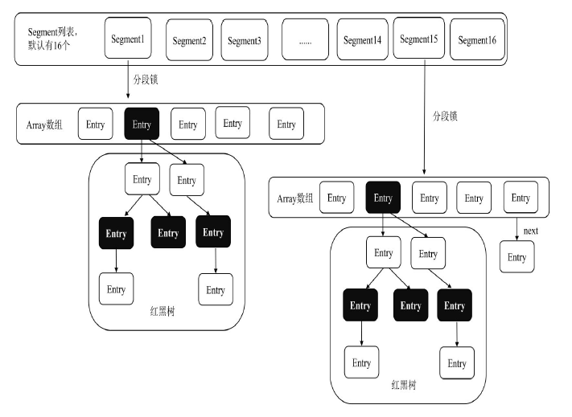

- [ConcurrentHashMap源码及使用](#ConcurrentHashMap源码及使用)

### LinkedHashMap
- FIFO时有序
- 底层：双向链表 + 哈希表

### HashTable
- 无序
- 线程安全
- 效率低

### TreeMap
- 有序
- 非线程安全

## Queue
- 接口，继承Collection接口
- Java中常用队列：
    - ArrayBlockingQueue：基于数组数据结构实现的有界阻塞队列。
    - LinkedBlockingQueue：基于链表数据结构实现的有界阻塞队列。
    - PriorityBlockingQueue：支持优先级排序的无界阻塞队列。
    - DelayQueue：支持延迟操作的无界阻塞队列。
    - SynchronousQueue：用于线程同步的阻塞队列。
    - LinkedTransferQueue：基于链表数据结构实现的无界阻塞队列。
    - LinkedBlockingDeque：基于链表数据结构实现的双向阻塞队列。

[返回目录](#目录)

# 异常
## 异常分类
Throwable：所有错误Error 和 异常Exception 的父类。
- Error：Java程序运行错误挂掉，一般为内部错误或者资源耗尽，不能在运行中动态处理。
    - 常见：AWTError、ThreadDeath。
- Exception：Java程序运行异常，可以动态处理。分为：运行时异常RuntimeException、受检异常：CheckedException
    - RuntimeException：JVM在运行时抛出，可以被捕获处理。常见：NullPointerException 、ClassCastException 、ArrayIndexOutOfBundsException等。
    - CheckedException：在编译阶段Java 编译器会检查CheckedException异常并强制程序捕获和处理此类异常，即要求程序在可能出现异常的地方通过try catch语句块捕获并处理异常。常见：IOException 、SQLException、ClassNotFoundException等。

## 异常处理
1. 抛出异常
    - 自己不处理，将异常抛出给调用者去处理。
    - 三种形式：throws(作用在方法上)、throw(作用在方法内)、系统自动抛出
    ```java
    // throws
    public int test(int a, int b) throws Exception {
        return a/b;
    }
    
    // throw
    public void test(String s) {
        if (s.length() <= 10) {
            throw new StringIndexOutOfBoundsException();
        }
    }
    ```
2. 捕获处理
    ```java
    try {
        //业务实现
    } catch (Exception e) {
        //异常处理
    }
    
    public class ReadFile {
        public static void main(String[] args) {
           BufferedReader reader = null;
            String buffer = null;
            try {
                reader = new BufferedReader(new FileReader("test.txt"));
                do {
                    buffer = reader.readLine();
                    System.out.println(buffer);
                } while (reader.read() != -1);
            } catch (IOException e) {
                e.printStackTrace();
            } finally {
                try {
                    reader.close();
                } catch (IOException e) {
                    e.printStackTrace();
                }
            }
        }
    }
    
    // try-with-resources
    public class ReadFile {
        public static void main(String[] args) {
            String bufferSugar = null;
            try (BufferedReader readerSugar = new BufferedReader(new FileReader("test.txt"))) {
                bufferSugar = readerSugar.readLine();
                System.out.println(bufferSugar);
            } catch (IOException e) {
                e.printStackTrace();
            }
        }
    }
    ```

[返回目录](#目录)

# 反射
反射机制：指在程序运行过程中，能够动态获取类和对象的属性和方法，以及能够动态调用对象的方法。

**反射的作用：**
- 获取一个对象所属的类。
- 获取一个类的所有成员变量和方法。
- 在运行时创建对象。
- 在运行时调用对象的方法。

**Java中对象的两种类型：（反射）**
- 编译时类型：指在声明对象时所采用的的类型。如示例的Person
- 运行时类型：指为对象赋值时所采用的的类型。如示例的Student
```java
Person person = new Student();
```
**程序在编译时无法获知person对象和Person类的真实信息，只能通过运行时发现，而其真实信息（对象的属性和方法）通常通过反射机制来获取，这便是Java语言中反射机制的核心功能。**

## 反射的应用
**反射使用步骤：**
1. 获取想要操作的类的Class对象。
2. 调用Class对象所对应的类中定义的方法。
3. 使用反射API来获取并调用类的属性和方法等。

**常用反射API：**
- Class类：用于获取类的属性、方法等信息。
- Field类：表示类的成员变量，用于获取和设置类中的属性值。
- Method类：表示类的方法，用于获取方法的描述信息或者执行某个方法。
- Constructor类：表示类的构造方法。

### 获取类的Class对象的3种方式
1. 调用某个对象的getClass方法以获取该类对应的Class对象。
    ```java
    Person p = new Person();
    Class clazz = p.getClass();
    ```
2. 调用某个类的class属性以获取该类对应的Class对象。
    ```java
    Class clazz = Person.class;
    ```
3. 调用Class类中的forName静态方法以获取该类对应的Class对象，这是最安全、性能也最好的方法。
    ```java
    Class clazz = Class.forName("fullClassPath"); //fullClassPath为类的包路径及名称
    ```

### 获取查看类中的方法和属性
```java
//1. 获取Person类的Class对象
Class clazz = Class.forName("test.java.reflect.Person");

//2. 获取Person类所有方法信息
Method[] method = clazz.getDeclaredMethods();
for (Method m : method) {
    System.out.println(m.toString);
}

//3. 获取Person类所有成员的属性信息
Field[] field = clazz.getDeclaredFields();
for (Field f : field) {
    System.out.println(f.toString);
}

//4. 获取Person类所有构造方法信息
Constructor[] constructor = clazz.getDeclaredConstructors();
for (Constructor c : constructor) {
    System.out.println(c.toString);
}
```

## 创建对象的2种方式
1. 使用Class对象的newInstance方法创建该Class对象对应类的实例，这种方法要求该Class对象对应的类有默认的空构造器。
    ```java
    //1.1 获取Person类的Class对象
    Class clazz = Class.forName("test.java.reflect.Person");
   
    //1.2 使用newInstance方法创建对象
    Person p = (Person) clazz.newInstance();
    ```
2. 先使用Class 对象获取指定的Constructor 对象， 再调用Constructor对象的newInstance方法创建Class对象对应类的实例，通过这种方法可以选定构造方法创建实例。
    ```java
    //2.1 获取构造方法并创建对象
    Constructor c = clazz.getDeclaredConstructor(String.class, String.class, int.class);
   
    //2.2 根据构造方法创建对象并设置属性
    Person p1 = (Person) c.newInstance("zhangsan", "男"， 20);
    ```

## Method的invoke方法
通过调用Method的invoke方法 在运行的代码中动态去访问 Method提供的关于类或接口上某个方法。
- 比如 可以动态传入参数及将方法参数化。具体过程为： 获取对象的Method，并调用Method的invoke方法，如下：
    - 获取Method对象：通过调用Class对象的getMethod(String name, Class<?>... parameterTypes)返回一个Method对象，它描述了此Class对象所表示的类或接口指定的公共成员方法。name参数是String类型，用于指定所需方法的名称。parameterTypes参数是按声明顺序标识该方法的形参类型的Class 对象的一个数组， 如果parameterTypes为null，则按空数组处理。
    - 调用invoke方法：指通过调用Method对象的invoke方法来动态执行函数。invoke方法的具体使用代码如下：
```java
//1. 获取Person类的Class对象
Class clazz = Class.forName("test.java.reflect.Person");

//2. 获取Class对象中的setName方法
Method m = clazz.getMethod("setName", String.class);

//3. 获取Constructor对象
Constructor c = clazz.getConstructor();

//4. 根据构造方法Constructor创建对象
Object o = c.newInstance();

//5. 调用Method的invoke方法，这里的m表示setName方法
// 因此，相当于动态调用Object对象的setName方法并传入alex参数
m.invoke(o, "alex");
```

[返回目录](#目录)

# 注解
注解（Annotation）是Java提供的设置程序中元素的关联信息和元数据（MetaData）的方法，它是一个接口，程序可以通过反射获取指定程序中元素的注解对象，然后通过该注解对象获取注解中的元数据信息。

## 标准元注解
元注解（Meta-Annotation）负责注解其他注解。在Java中定义了4 个标准的元注解类型@Target 、@Retention 、@Documented 、@Inherited，用于定义不同类型的注解。

### @Target
- @Target 说明了注解所修饰的对象范围。
- 注解可被用于packages、types（类、接口、枚举、注解类型）、类型成员（方法、构造方法、成员变量、枚举值）、方法参数和本地变量（循环变量、catch参数等）。
- 在注解类型的声明中使用了target，可更加明确其修饰的目标。

target具体取值：

名称|修饰目标
---|---
TYPE|描述类、接口(包括注解类型)、enum声明
FIELD|描述域
METHOD|描述方法
PARAMETER|描述参数
CONSTRUCTOR|描述构造器
LOCAL_VARIABLE|描述局部变量
ANNOTATION_TYPE|声明一个注解
PACKAGE|描述包
TYPE_PARAMETER|声明普通变量
TYPE_USE|能标注任何类型的名称

### @Retention
- @Retention 定义了该注解被保留的级别，即被描述的注解在什么级别有效，有以下3种类型。
    - SOURCE：在源文件中有效，即在源文件中被保留。
    - CLASS：在Class文件中有效，即在Class文件中被保留。
    - RUNTIME：在运行时有效，即在运行时被保留。

### @Documented
- @Documented 表明这个注解应该被javadoc工具记录，因此可以被javadoc类的工具文档化。

### @Inherited
- @Inherited 是一个标记注解，表明某个被标注的类型是被继承的。
- 如果有一个使用了@Inherited修饰的Annotation被用于一个Class，则这个注解将被用于该Class的子类。

[目录](#目录)

## 注解处理器
- 注解用于描述元数据的信息，使用的重点在于对注解处理器的定义。
- Java SE5扩展了反射机制的API，以帮助程序快速构造自定义注解处理器。
- 对注解的使用一般包含定义及使用注解接口，我们一般通过封装统一的注解工具来使用注解。
```java
// 1. 定义注解接口，有name和address两个属性
@Target(ElementType.FIELD)
@Retention(RetentionPolicy.RUNTIME)
@Documented
public @interface FruitProvider {
    public int id() default -1; //编号
    public String name() default ""; //名字
    public String address() default ""; //地址
}

// 2. 使用注解接口
public class Apple {
    @FruitProvider(id = 1, name = "嘎啦国际", address = "陕西西安")
    private String appleProvider;
    public void setAppleProvider(String appleProvider) {
        this.appleProvider = appleProvider;
    }
    public String getAppleProvider() {
        return appleProvider;
    }
}

// 3. 定义注解处理器
//定义一个FruitInfoUtil注解处理器，并通过反射信息获取注解数据，最后通过main方法调用该注解处理器使用注解
public class FruitInfoUtil {
    public static void getFruitInfo(Class<?> clazz) {
        String strFruitProvider = "供应商信息";
        Field[] fields = clazz.getDeclaredFields(); //通过反射获取处理注解
        for (Field field : fields) {
            if (field.isAnnotationPresent(FruitProvider.class)) {
                FruitProvider fruitProvider = (FruitProvider) field.getAnnotation(FruitProvider.class);
                // 处理注解信息
                strFruitProvider = "供应商编号：" + fruitProvider.id() + "供应商名称：" + fruitProvider.name() + "供应商地址：" + fruitProvider.address();
                System.out.println(strFruitProvider);
            }
        }
    }
}
public class FruitRun {
    public static void main(String[] args) {
        FruitInfoUtil.getFruitInfo(Apple.class);
        //输出结果：供应商编号：1 供应商名称：嘎啦国际 供应商地址：陕西西安
    }    
}
```

[返回目录](#目录)

# 内部类
## 静态内部类
## 成员内部类
## 局部内部类
## 匿名内部类

[返回目录](#目录)

# 泛型
- 泛型的本质是参数化类型，泛型提供了编译时类型的安全检测机制，该机制允许程序在编译时检测非法的类型。
- 在不使用泛型的情况下，我们可以通过引用Object类型来实现参数的任意化，在具体使用时需要进行强制类型转换。
    - 强制类型转换要求首先必须明确知道实际参数的引用类型，不然可能引起前置类型转换错误，在编译期无法识别这种错误，只能在运行期检测这种错误。

## 泛型标记和泛型限定

泛型标记|说明
---|---
E-Element|在集合中使用，表示集合中存放的元素
T-Type|表示Java类，包括基本类 和自定义类
K-Key|表示键，如Map中的Key
V-Value|表示值
N-Number|表示数值类型
?|表示不确定的Java类型

在使用泛型的时候，若希望将类的继承关系加入泛型应用中，就需要对泛型做限定，包含：对泛型上线的限定、对泛型下线的限定。
- 对泛型上限的限定：`<? extends T>` 表示该通配符所代表的类型是 T类的子类或者接口T的子接口。
- 对泛型下限的限定：`<? super T>` 表示该通配符所代表的类型是 T类型的父类或者父接口。

## 泛型方法
泛型方法：指将方法的参数类型定义为泛型，以便在调用时接收不同类型的参数。
```java
public static void main(String[] args) {
    generalMethod("1", 2, new Worker());
}

public static <T> void generalMethod(T ... inputArray) {
    for (T element : inputArray) {
        if (element instanceof Integer) {
            System.out.println("Type is Integer");
        } else if (element instanceof String) {
            System.out.println("Type is String");
        } else if (element instanceof Boolean) {
            System.out.println("Type is Boolean");
        } else if (element instanceof Worker) {
            System.out.println("Type is Worker");
        }
        ...
    }
}
```

## 泛型类
泛型类：指在定义类时在类上定义了泛型，以便类在使用时可以根据传入的不同参数类型实例化不同的对象。
- 泛型类的具体使用方法：在类的名称后面添加一个或多个类型参数的声明部分，在多个泛型参数之间用逗号隔开。
```java
public class GeneralClass<T> {
    public static void main(String[] args) {
        //根据需求初始化不同的类型
        GeneralClass<Integer> genInt = new GeneralClass<Integer>();
        genInt.add(1);
        GeneralClass<String> genStr = new GeneralClass<String>();
        genStr.add("2");
    }
    private T t;
    public void add(T t) {
        this.t = t;
    }
    public T get() {
        return t;
    }
}
```

## 泛型接口
泛型接口：通过在接口名后面添加类型参数的声明部分来实现。
- 泛型接口的具体类型一般在实现类中进行声明，不同类型的实现类处理不同的业务逻辑。
```java
public interface IGeneral<T> {
    public T getId();    
}

public class GeneralIntegerImpl implements IGeneral<Integer> {
    @Override
    public Integer getId() {
        Random random = new Random(100);
        return random.nextInt();
    }

    public static void main(String[] args) {
        GeneralIntegerImpl gen = new GeneralIntegerImpl();
        System.out.println(gen.getId());
    }
}
```

## 类型擦除
在编码阶段采用泛型时加上的类型参数，会被编译器在编译时去掉，这个过程就被称为类型擦除。因此，泛型主要用于编译阶段。在编译后生成的Java字节代码文件中不包含泛型中的类型信息。
- 例如，编码时定义的List<Integer> 和List<String> 在经过编译后统一为List。JVM所读取的只是List，由泛型附加的类型信息对JVM来说是不可见的。

Java类型的擦除过程为：
1. 查找用来替换类型参数的具体类（该具体类一般为Object），如果指定了类型参数的上界，则以该上界作为替换时的具体类；
2. 把代码中的类型参数都替换为具体的类。
  
[返回目录](#目录)

# 序列化
背景：Java对象在JVM运行时被创建、更新和销毁，当JVM退出时，对象也会随之销毁，即这些对象的生命周期不会比JVM的生命周期更长。但在现实应用中，我们常常需要将对象及其状态在多个应用之间传递、共享，或者将对象及其状态持久化，在其他地方重新读取被保存的对象及其状态继续进行处理。这就需要通过将Java对象序列化来实现。

使用： 在使用Java序列化技术保存对象及其状态信息时，对象及其状态信息会被保存在一组字节数组中，在需要时再将这些字节数组反序列化为对象。
- 注意，对象序列化保存的是对象的状态，即它的成员变量，因此类中的静态变量不会被序列化。

缺点：影响系统性能，尽可能不使用

使用场景：
- 在RPC（远程过程调用）或者网络传输中发送对象。
- 持久化对象的状态到数据库或者文件。
- 序列化实现深复制，即复制引用的对象。

## 序列化注意事项  

1. 类要实现序列化功能，只需实现`java.io.Serializable`接口即可。
2. 序列化和反序列化必须保持序列化的ID 一致，一般使用`private static final long serialVersionUID`定义序列化ID。
3. 序列化并不保存静态变量。
4. 在需要序列化父类变量时，父类也需要实现Serializable接口。
5. 使用`transient`关键字可以阻止该变量被序列化，在被反序列化后，`transient`变量的值被设为对应类型的初始值，例如，int类型变量的值是 0，对象类型变量的值是null。
6. 对象通过序列化后在网络上传输时，基于网络安全，可以在序列化前将一些敏感字段（用户名、密码、身份证号码）使用秘钥进行加密，在反序列化后再基于秘钥对数据进行解密。这样即使数据在网络中被劫持，由于缺少秘钥也无法对数据进行解析，这样可以在一定程度上保证序列化对象的数据安全。
  
```java
import java.io.Serializable

public class Worker implements Serializable {
    //定义序列化ID
    private static final long serialVersionUID = -7359408741695605860L;
    //name属性会被序列化
    private String name;
    //transient修饰的变量不会被序列化
    private transient int salary;
    //静态变量属于类信息，不属于对象状态，因此不会被序列化
    static int age = 100;
    public String getName() {
        return name;
    }
    public void setName(String name) {
        this.name = name;
    }
}
```
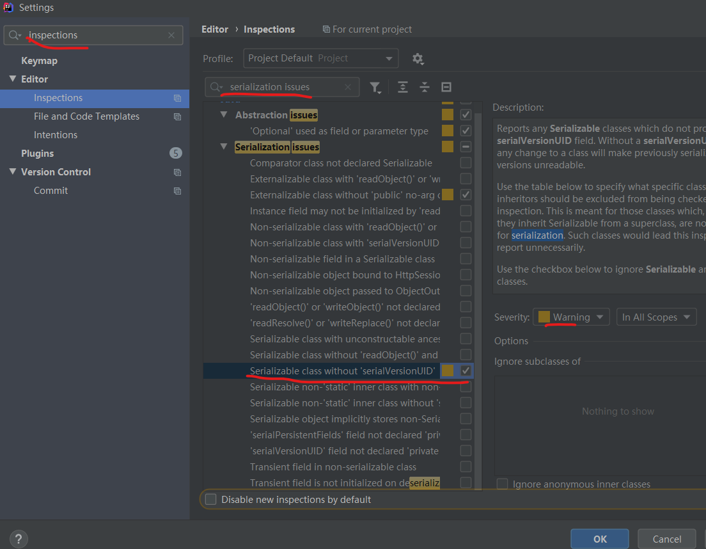

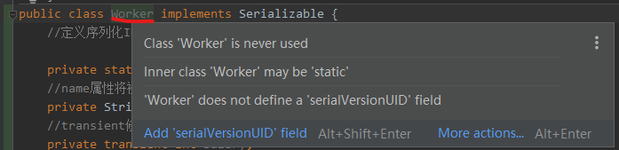

## 反序列化
- Java反序列框架：arvo、protobuf、thrift、fastjson
- 也可以基于JDK原生的`ObjectOutputStream`和`ObjectInputStream`类实现对象进行序列化及反序列化，并调用其`writeObject`和`readObject`方法实现自定义序列化策略。

```java
public static void main(String[] args) throws Exception {
    //序列化数据到磁盘
    FileOutputStream fos = new FileOutputStream("worker.out");
    ObjectOutputStream oos = new ObjectOutputStream(fos);
    Worker worker = new Worker();
    worker.setName("alex");
    oos.writeObject(worker);
    oos.flush();
    oos.close();

    //反序列化磁盘数据并解析数据状态
    FileInputStream fis = new FileInputStream("woker.out");
    ObjectInputStream ois = new ObjectInputStream(fis);
    Worker deWorker = (Worker) ois.readObject();
    System.out.println(deWorker.getName());
}
```

[返回目录](#目录)

# 日期和时间
## 标准库API
- java.util包：Date、Calendar、TimeZone
- java.time包(Java 8引入)：LocalDateTime、ZonedDateTime、ZoneId等

### Date
实际上存储了一个long类型的以毫秒表示的时间戳。
```java
    public static void main(String[] args) {
        // 获取当前时间:
        Date date = new Date();
        System.out.println(date.getYear() + 1900); // 必须加上1900
        System.out.println(date.getMonth() + 1); // 0~11，必须加上1
        System.out.println(date.getDate()); // 1~31，不能加1
        // 转换为GMT时区:
        System.out.println(date.toGMTString());
        // 转换为本地时区:
        System.out.println(date.toLocaleString());

        // 格式化输出：
        System.out.println(new SimpleDateFormat("yyyy-MM-dd HH:mm:ss").format(date));
    }
```

[返回目录](#目录)

# IO

[返回目录](#目录)

# NIO
- 非阻塞IO，使用Selector、Channel、Buffer来实现非阻塞IO操作。
- 非阻塞的实现是采用反应器(Reactor)设计模式，可处理多个事件源。（此设计模式类似观察者模式，只是观察者模式只能处理一个事件源）
- 常用于网络编程，效率比Socket高。

[返回目录](#目录)

# Java并发编程

- 系统运行耗费时间项：磁盘IO、网络通信、数据库访问  
- **TPS**：每秒事务处理数，代表1秒内服务端平均能响应的请求总数
- **QPS**：每秒请求数，1 * TPS = n * QPS

## 线程的创建方式
Java线程常见的4种创建方式分别为：继承Thread类、实现Runnable接口、通过ExecutorService和Callable<Class>实现有返回值的线程、基于线程池。

### 继承Thread类
```java
public class Thread001 extends Thread {
    @Override
    public void run() {
        System.out.println("create a thread001 by extends Thread");
    }
}
public class Main {
    public static void main(String[] args) {
        Thread001 thread001 = new Thread001();
        thread001.start();
    }
}
```

### 实现Runnable接口
```java
public class Thread002 implements Runnable {
    @Override
    public void run() {
        System.out.println("create a thread001 by implements Runnable");
    }
}
public class Main {
    public static void main(String[] args) {
        Thread002 thread002 = new Thread002();
        new Thread(thread002).start();
    }
}
```

### 基于线程池
线程池不允许使用Executors去创建( ~~Executors.newFixedThreadPool(11);~~ )，而是通过ThreadPoolExecutor的方式，这样的处理方式让写的同学更加明确线程池的运行规则，规避资源耗尽的风险。 说明：Executors返回的线程池对象的弊端如下：  

- 1）FixedThreadPool和SingleThreadPool:
    - 允许的请求队列长度为Integer.MAX_VALUE，可能会堆积大量的请求，从而导致OOM。
- 2）CachedThreadPool:
    - 允许的创建线程数量为Integer.MAX_VALUE，可能会创建大量的线程，从而导致OOM。

```java
//org.apache.commons.lang3.concurrent.BasicThreadFactory
public class Main {
    public static void main(String[] args) {
        //1
        ThreadFactory namedThreadFactory = new BasicThreadFactory.Builder().namingPattern("example-schedule-pool-%d").daemon(false).build();
        ScheduledExecutorService executorService = new ScheduledThreadPoolExecutor(2, namedThreadFactory);
        executorService.execute(() -> System.out.println(Thread.currentThread().getName() + "running..."));

        //2
        ScheduledExecutorService poolExecutor = new ScheduledThreadPoolExecutor(2);
        poolExecutor.scheduleWithFixedDelay(new Runnable() {
            @Override
            public void run() {
                System.out.println(Thread.currentThread().getName() + "running...");
            }
        },0,1, TimeUnit.SECONDS);


    }
}
```
- [ScheduledThreadPoolExecutor](https://github.com/Panl99/leetcode/tree/master/java/src/util/ScheduledThreadPoolExecutorDemo.java)

## 线程的生命周期
- 新建（New）、就绪（Runnable）、运行（Running）、阻塞（Blocked）、死亡（Dead）

**线程状态转换流程：**
1. 调用 new 方法新建一个线程，这时线程处于新建状态，尚未启动。
2. 调用 start()方法启动一个线程，这时线程处于就绪状态。
3. 处于就绪状态的线程等待线程获取CPU资源，在等待其获取CPU资源后线程会执行run方法进入运行状态。
4. 正在运行的线程在调用了yield()线程让步方法 或失去处理器资源时，会再次进入就绪状态。
5. 正在执行的线程在执行了sleep()方法、I/O阻塞、等待同步锁、等待通知、调用suspend方法等操作后，会挂起并进入阻塞状态，进入Blocked池。
6. 阻塞状态的线程由于出现sleep时间已到、I/O方法返回、获得同步锁、收到通知、调用resume方法等情况，会再次进入就绪状态，等待CPU时间片的轮询。该线程在获取CPU资源后，会再次进入运行状态。
7. 处于运行状态的线程，在调用run方法或call方法正常执行完成、调用stop方法停止线程或者程序执行错误导致异常退出时，会进入死亡状态。

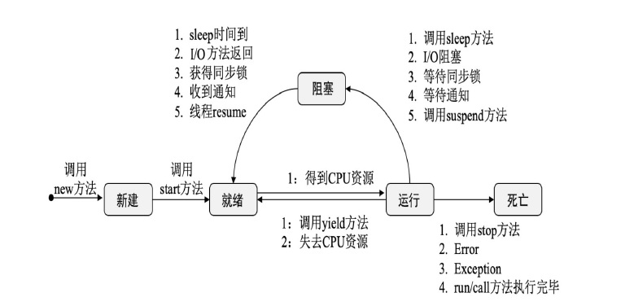

### 线程状态

Java中线程有6种状态，在任意一个时间点中，一个线程只能有且只有其中的一种状态，并且可以通过特定的方法在不同状态之间转换

1. 新建（New）：使用 new 新建一个线程，这时线程处于新建状态，还没运行。
2. 运行（Runnable）：调用 start()方法启动一个线程，这时线程处于Runnable状态。处于此状态的线程有可能正在运行，也有可能没有运行：正在等待着操作系统为它分配执行时间。
3. 等待（Waiting）：处于这种状态的线程不会被分配处理器执行时间，它们要等待被其他线程显式唤醒。以下方法会让线程陷入无限期的等待状态：
    - 没有设置Timeout参数的Object::wait()方法；
    - 没有设置Timeout参数的Thread::join()方法；
    - LockSupport::park()方法。
4. 限时等待（Timed Waiting）：处于这种状态的线程也不会被分配处理器执行时间，不过无须等待被其他线程显式唤醒，在一定时间之后它们会由系统自动唤醒。以下方法会让线程进入限期等待状态：
    - Thread::sleep()方法；
    - 设置了Timeout参数的Object::wait()方法；
    - 设置了Timeout参数的Thread::join()方法；
    - LockSupport::parkNanos()方法；
    - LockSupport::parkUntil()方法。
5. 阻塞（Blocked）：线程被阻塞了，“阻塞状态”与“等待状态”的区别是“阻塞状态”在等待着获取到一个排它锁，这个事件将在另外一个线程放弃这个锁的时候发生；而“等待状态”则是在等待一段时间，或者唤醒动作的发生。在程序等待进入同步区域的时候，线程将进入这种状态。
6. 结束（Terminated）：已终止线程的线程状态，线程已经结束执行。

查询线程状态：调用getState方法


### 线程调度
指系统为线程分配处理器使用权的过程，调度主要方式分为：协同式线程调度、抢占式线程调度。
- 协同式线程调度：线程的执行时间由线程本身来控制，线程把自己的工作执行完了之后，要主动通知系统切换到另外一个线程上去。
    - 好处：实现简单，切换操作对线程可见，一般没有线程同步问题。
    - 坏处：线程执行时间不可控，如果一个线程处理完后不告知系统切换线程，就会导致阻塞在那里。
- 抢占式线程调度(java使用)：那么每个线程将由系统来分配执行时间，线程的切换不由线程本身来决定。
    - 好处：执行时间可控，不易阻塞
    - Java中Thread::yield()方法可以主动让出执行时间；线程执行时间可通过设置线程优先级来完成


### 线程安全
当多个线程同时访问一个对象时，同时对一个对象进行操作可能会导致线程安全问题

实现线程安全方式：
1. 互斥同步(阻塞同步)：同步是指在多个线程并发访问共享数据时，保证共享数据在同一个时刻只被一条线程使用。
    - 使用[synchronized](#synchronized)对需要访问的对象加锁，来阻塞其他线程的访问。
        - 被synchronized修饰的同步块对同一条线程是可重入的。
        - synchronized是非公平锁。加锁的线程不会被中断。
    - 使用Lock接口的实现：可重入锁（[ReentrantLock](#ReentrantLock)）来进行同步。
        - ReentrantLock比synchronized的好处：
            - 等待可中断：是指当持有锁的线程长期不释放锁的时候，正在等待的线程可以选择放弃等待，改为处理其他事情。
            - 可实现公平锁：默认非公平，可在构造函数中指定为公平的。（指多个线程在等待同一个锁时，会按照申请锁的时间顺序来依次获得锁，而非公平锁会随机给一个线程）。
            - 锁绑定多个条件：指一个ReentrantLock对象可以多次调用`new Condition()`方法同时绑定多个Condition对象。而在synchronized中，锁对象的wait()跟它的notify()方法配合可以实现一个条件关联，但要和多个条件关联的时候，就需要另外再添加一个锁。
2. 非阻塞同步：先进行操作，如果没有其他线程争用共享数据，操作就直接成功；如果有其他线程争用共享的数据，可以采用重试机制来进行补偿，直到出现没有竞争的共享数据为止。

[synchronized,ReentrantReadWriteLock](#锁)

[目录](#目录)

## 线程的基本方法
|方法|作用|
|---|---|
|wait|线程等待：调用wait方法的线程会进入WAITING状态，只有等到其他线程的通知或被中断后才会返回。需要注意的是，在调用wait方法后会释放对象的锁，因此wait方法一般被用于同步方法或同步代码块中。|
|sleep|线程睡眠：调用sleep方法会导致当前线程休眠。与wait方法不同的是，sleep方法不会释放当前占有的锁，会导致线程进入TIMED-WATING状态。|
|yield|线程让步：调用yield方法会使当前线程让出（释放）CPU执行时间片，与其他线程一起重新竞争CPU时间片。在一般情况下，优先级高的线程更有可能竞争到CPU时间片。|
|[interrupt](#interrupt)|线程中断：interrupt方法用于向线程发行一个终止通知信号，会影响该线程内部的一个中断标识位，这个线程本身并不会因为调用了interrupt方法而改变状态（阻塞、终止等）。状态的具体变化需要等待接收到中断标识的程序的最终处理结果来判定。|
|join|线程加入：join方法用于等待其他线程终止，如果在当前线程中调用一个线程的join方法，则当前线程转为阻塞状态，等到另一个线程结束，当前线程再由阻塞状态转为就绪状态，等待获取CPU的使用权。在很多情况下，主线程生成并启动了子线程，需要等到子线程返回结果并收集和处理再退出，这时就要用到join方法。|
|notify|线程唤醒：Object类有个notify方法，用于唤醒在此对象监视器上等待的一个线程，如果所有线程都在此对象上等待，则会任意选择唤醒其中一个线程。|
|notifyAll|线程唤醒：唤醒在监视器上等待的所有线程。|
|[setDaemon](#守护线程)|后台守护线程：setDaemon方法用于定义一个守护线程，也叫作“服务线程”，该线程是后台线程，有一个特性，即为用户线程提供公共服务，在没有用户线程可服务时会自动离开。|
|[sleep方法与wait方法的区别](#sleep方法与wait方法的区别)||
|[start方法与run方法的区别](#start方法与run方法的区别)||
|[终止线程的4种方式](#终止线程的4种方式)||

### interrupt
- 调用interrupt方法并不会中断一个正在运行的线程，也就是说处于Running状态的线程并不会因为被中断而终止，仅仅改变了内部维护的中断标识位而已。
- 若因为调用sleep方法而使线程处于TIMED-WATING状态，则这时调用interrupt方法会抛出InterruptedException，使线程提前结束TIMED-WATING状态。
- 许多声明抛出InterruptedException 的方法如：Thread.sleep(long mills)，在抛出异常前都会清除中断标识位，所以在抛出异常后调用isInterrupted方法将会返回false。
- 中断状态是线程固有的一个标识位，可以通过此标识位安全终止线程。比如，在想终止一个线程时，可以先调用该线程的interrupt方法，然后在线程的run方法中根据该线程isInterrupted方法的返回状态值安全终止线程。

### 守护线程
- 守护线程的优先级较低，用于为系统中的其他对象和线程提供服务。将一个用户线程设置为守护线程的方法是在线程对象创建之前用线程对象的setDaemon(true)来设置。
- 在后台守护线程中定义的线程也是后台守护线程。后台守护线程是JVM级别的，比如垃圾回收线程就是一个经典的守护线程，在我们的程序中不再有任何线程运行时，程序就不会再产生垃圾，垃圾回收器也就无事可做，所以在回收JVM上仅剩的线程时，垃圾回收线程会自动离开。它始终在低级别的状态下运行，用于实时监控和管理系统中的可回收资源。
- 守护线程是运行在后台的一种特殊线程，独立于控制终端并且周期性地执行某种任务或等待处理某些已发生的事件。也就是说，守护线程不依赖于终端，但是依赖于JVM，与JVM“同生共死”。在JVM中的所有线程都是守护线程时，JVM就可以退出了，如果还有一个或一个以上的非守护线程，则JVM不会退出。

### sleep方法与wait方法的区别
- sleep方法属于Thread类，wait方法则属于Object类。
- sleep方法暂停执行指定的时间，让出CPU 给其他线程，但其监控状态依然保持，在指定的时间过后又会自动恢复运行状态。
- 在调用sleep方法的过程中，线程不会释放对象锁。
- 在调用wait方法时，线程会放弃对象锁，进入等待此对象的等待锁池，只有针对此对象调用notify方法后，该线程才能进入对象锁池准备获取对象锁，并进入运行状态。

### start方法与run方法的区别
- start方法用于启动线程，真正实现了多线程运行。在调用了线程的start方法后，线程会在后台执行，无须等待run方法体的代码执行完毕，就可以继续执行下面的代码。
- 在通过调用Thread类的start方法启动一个线程时，此线程处于就绪状态，并没有运行。
- run方法也叫作线程体，包含了要执行的线程的逻辑代码，在调用run方法后，线程就进入运行状态，开始运行run方法中的代码。在run方法运行结束后，该线程终止，CPU再调度其他线程。

### 终止线程的4种方式
1. 正常运行结束。
2. 使用退出标志退出线程。
    - 可以使用一个变量来控制循环，比如设置一个boolean类型的标志，并通过设置这个标志为true或false来控制while循环是否退出。
    ```java
    public class ThreadSafe extends Thread {
        public volatile boolean exit = false;
        public void run() {
            while (!exit) {
                //业务逻辑
            }
        }
    }
    ```
3. 使用Interrupt方法终止线程
    - （1）线程处于阻塞状态。例如，在使用了sleep、调用锁的wait或者调用socket的receiver、accept等方法时，会使线程处于阻塞状态。在调用线程的interrupt方法时，会抛出InterruptException异常。通过代码捕获该异常，然后通过break跳出状态检测循环，可以有机会结束这个线程的执行。
    ```java
    public class ThreadSafe extends Thread {
        @Override
        public void run() {
            while (!isInterrupted()) { //在非阻塞过程中通过判断中断标志来退出
                try {
                    Thread.sleep(5000); //在阻塞过程中捕获中断异常来退出
                } catch (InterruptedException e) {
                    e.printStackTrace();
                    break; //捕获异常后执行break跳出循环
                }
            }
        }
    }
    ```
    - （2）线程未处于阻塞状态。此时，使用isInterrupted方法判断线程的中断标志来退出循环。在调用interrupt方法时，中断标志会被设置为true，并不能立刻退出线程，而是执行线程终止前的资源释放操作，等待资源释放完毕后退出该线程。
4. 使用stop方法终止线程：不安全
    - 在程序中可以直接调用Thread.stop方法强行终止线程，该线程的子线程会抛出ThreadDeatherror错误，并且释放子线程持有的所有锁。加锁的代码块一般被用于保护数据的一致性，如果在调用Thread.stop方法后导致该线程所持有的所有锁突然释放而使锁资源不可控制，被保护的数据就可能出现不一致的情况，其他线程在使用这些被破坏的数据时，有可能使程序运行错误。因此，并不推荐采用这种方法终止线程。

[返回目录](#目录)

## Java内存模型(JMM)  
**内存模型：** 可以理解为在特定的操作协议下，对特定的内存或高速缓存进行读写访问的过程抽象。    
- 线程对所有变量的操作都在工作内存中进行，线程间无法直接访问对方工作内存，线程间通过主内存来传值。  

**内存间交互：** 把一个变量从主内存拷贝到工作内存（顺序执行read+load），把变量从工作内存同步回主内存（顺序执行store+write）。  
- **8种内存访问操作：**
    - lock（锁定）：作用于主内存的变量，它把一个变量标识为一条线程独占的状态。
    - unlock（解锁）：作用于主内存的变量，它把一个处于锁定状态的变量释放出来，释放后的变量才可以被其他线程锁定。
    - read（读取）：作用于主内存的变量，它把一个变量的值从主内存传输到线程的工作内存中，以便随后的load动作使用。
    - load（载入）：作用于工作内存的变量，它把read操作从主内存中得到的变量值放入工作内存的变量副本中。
    - use（使用）：作用于工作内存的变量，它把工作内存中一个变量的值传递给执行引擎，每当虚拟机遇到一个需要使用变量的值的字节码指令时将会执行这个操作。
    - assign（赋值）：作用于工作内存的变量，它把一个从执行引擎接收的值赋给工作内存的变量，每当虚拟机遇到一个给变量赋值的字节码指令时执行这个操作。
    - store（存储）：作用于工作内存的变量，它把工作内存中一个变量的值传送到主内存中，以便随后的write操作使用。
    - write（写入）：作用于主内存的变量，它把store操作从工作内存中得到的变量的值放入主内存的变量中。  
- **8种内存访问要满足的操作规则：**
    - 不允许read和load、store和write操作之一单独出现，即不允许一个变量从主内存读取了但工作内存不接受，或者工作内存发起回写了但主内存不接受的情况出现。
    - 不允许一个线程丢弃它最近的assign操作，即变量在工作内存中改变了之后必须把该变化同步回主内存。
    - 不允许一个线程无原因地（没有发生过任何assign操作）把数据从线程的工作内存同步回主内存中。
    - 一个新的变量只能在主内存中“诞生”，不允许在工作内存中直接使用一个未被初始化（load或assign）的变量，换句话说就是对一个变量实施use、store操作之前，必须先执行assign和load操作。
    - 一个变量在同一个时刻只允许一条线程对其进行lock操作，但lock操作可以被同一条线程重复执行多次，多次执行lock后，只有执行相同次数的unlock操作，变量才会被解锁。
    - 如果对一个变量执行lock操作，那将会清空工作内存中此变量的值，在执行引擎使用这个变量前，需要重新执行load或assign操作以初始化变量的值。
    - 如果一个变量事先没有被lock操作锁定，那就不允许对它执行unlock操作，也不允许去unlock一个被其他线程锁定的变量。
    - 对一个变量执行unlock操作之前，必须先把此变量同步回主内存中（执行store、write操作）。

- ~~备注：基于理解难度和严谨性考虑，最新的JSR-133文档中，已经放弃了采用这8种操作去定义Java内存模型的访问协议，缩减为read、write、lock和unlock 4种（仅是描述方式改变了，Java内存模型并没有改变）。~~

**对于volatile型变量的特殊规则：**  

当一个变量被定义成volatile之后，它将具备两项特性：    
1. 保证此变量对所有线程的可见性（同步机制），这里的“可见性”是指当一条线程修改了这个变量的值，新值对于其他线程来说是可以立即得知的。而普通变量并不能做到这一点，普通变量的值在线程间传递时均需要通过主内存来完成。比如，线程A修改一个普通变量的值，然后向主内存进行回写，另外一条线程B在线程A回写完成了之后再对主内存进行读取操作，新变量值才会对线程B可见。  
    - 但：并非基于volatile变量的运算在并发下都是线程安全的，如java里面的“运算操作符”并非原子操作，这导致volatile变量的运算在并发下一样是不安全的。  
    - 由于volatile变量只能保证可见性，在不符合以下两条规则的运算场景中，仍然要通过加锁（使用synchronized、java.util.concurrent中的锁或原子类）来保证原子性：    
        - 运算结果并不依赖变量的当前值，或者能够确保只有单一的线程修改变量的值。    
        - 变量不需要与其他的状态变量共同参与不变约束。    
2. 禁止指令重排序优化，普通的变量仅会保证在该方法的执行过程中所有依赖赋值结果的地方都能获取到正确的结果，而不能保证变量赋值操作的顺序与程序代码中的执行顺序一致。因为在同一个线程的方法执行过程中无法感知到这点

- 使用场景：
    ```
    // 1、使用volatile变量来控制并发，当shutdown()方法被调用时，能保证所有线程中执行的doWork()方法都立即停下来。（线程可见性）
    volatile boolean shutdownRequested;
    public void shutdown() {
        shutdownRequested = true;
    }
    public void doWork() {
        while (!shutdownRequested) {
            // 代码的业务逻辑
        }
    }
    
    // 2、双锁检测单例模式（禁止指令重排）
    public class Singleton {
        private volatile static Singleton instance;
        public static Singleton getInstance() {
            if (instance == null) {
                synchronized (Singleton.class) {
                    if (instance == null) {
                        instance = new Singleton();
                    }
                }
            }
            return instance;
        }
        public static void main(String[] args) {
            Singleton.getInstance();
        }
    }
    ```

Java内存模型中对volatile变量定义的特殊规则的定义：
- //假定T表示一个线程，V和W分别表示两个volatile型变量，那么在进行read、load、use、assign、store和write操作时需要满足如下规则：
1. 只有当线程T对变量V执行的前一个动作是load的时候，线程T才能对变量V执行use动作；并且，只有当线程T对变量V执行的后一个动作是use的时候，线程T才能对变量V执行load动作。线程T对变量V的use动作可以认为是和线程T对变量V的load、read动作相关联的，必须连续且一起出现。
    - 这条规则要求在工作内存中，每次使用V前都必须先从主内存刷新最新的值，用于保证能看见其他线程对变量V所做的修改。
2. 只有当线程T对变量V执行的前一个动作是assign的时候，线程T才能对变量V执行store动作；并且，只有当线程T对变量V执行的后一个动作是store的时候，线程T才能对变量V执行assign动作。线程T对变量V的assign动作可以认为是和线程T对变量V的store、write动作相关联的，必须连续且一起出现。
    - 这条规则要求在工作内存中，每次修改V后都必须立刻同步回主内存中，用于保证其他线程可以看到自己对变量V所做的修改。
3. 假定动作A是线程T对变量V实施的use或assign动作，假定动作F是和动作A相关联的load或store动作，假定动作P是和动作F相应的对变量V的read或write动作；与此类似，假定动作B是线程T对变量W实施的use或assign动作，假定动作G是和动作B相关联的load或store动作，假定动作Q是和动作G相应的对变量W的read或write动作。如果A先于B，那么P先于Q。
    - 这条规则要求volatile修饰的变量不会被指令重排序优化，从而保证代码的执行顺序与程序的顺序相同。

**针对long和double型变量的特殊规则**
- Java内存模型要求lock、unlock、read、load、assign、use、store、write这八种操作都具有原子性，但是对于64位的数据类型（long和double），在模型中特别定义了一条宽松的规定：
    - long和double的非原子性协定：允许虚拟机将没有被volatile修饰的64位数据的读写操作划分为两次32位的操作来进行，即允许虚拟机实现自行选择是否要保证64位数据类型的load、store、read和write这四个操作的原子性。

[返回目录](#目录)

## 线程池
### 线程池工作原理
- java线程池主要用于管理线程组及其运行状态，以便java虚拟机更好的利用CPU资源。
- java线程池工作原理：JVM先根据用户的参数创建一定数量可运行的线程任务，并将其放在队列中，在线程创建后启动这些任务，如果线程数量超过了最大线程数量，则超出的线程排队等待，在有任务执行完毕后，线程池调度器会将释放的可用线程执行队列中等待的任务。

#### 线程复用
//TODO

#### 线程池核心类
- Java中的线程池是通过Executor框架实现的，在该框架中用到了Executor 、Executors 、ExecutorService 、ThreadPoolExecutor 、Callable、Future、FutureTask这几个核心类，具体的继承关系如图：
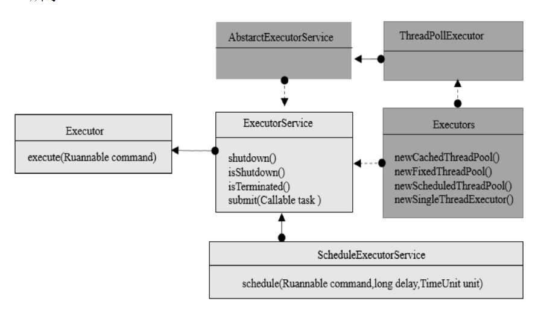

#### ThreadPoolExecutor
- ThreadPoolExecutor是构建线程的核心方法，构造方法：
```java
public ThreadPoolExecutor(int corePoolSize, int maximumPoolSize, long keepAliveTime, TimeUnit unit, BlockingQueue<Runnable> workQueue) {
    this(corePoolSize, maximumPoolSize, keepAliveTime, unit, workQueue, Executors.defaultThreadFactory(), defaultHandler);
}
// corePoolSize 线程池中核心线程数
// maximumPoolSize 线程池中最大线程数
// keepAliveTime 当前线程数超过 corePoolSize 大小时，空闲线程的存活时间
// unit keepAliveTime的时间单位
// workQueue 任务队列，被提交但尚未被执行的任务存放的地方
// threadFactory 线程工厂，用于创建线程，可使用默认的线程工厂或者自定义线程工厂
// handler 由于任务过多或者其他原因导致线程池无法处理时的任务拒绝策略
```

#### ThreadPoolExecutor工作原理
Java线程池的工作流程为：线程池刚被创建时，只是向系统申请一个用于执行线程队列和管理线程池的线程资源。在调用execute()添加一个任务时，线程池会按照以下流程执行任务。 
- 如果当前池大小 poolSize 小于 corePoolSize ，则线程池就立刻创建新线程 并执行任务。 
- 如果当前池大小 poolSize 大于等于 corePoolSize ，且等待队列未满，则将任务放入等待队列。 
- 如果当前池大小 poolSize 大于 corePoolSize 且小于 maximumPoolSize ，且等待队列已满，则线程池创建非核心线程 并执行任务。 
- 如果当前池大小 poolSize 大于 corePoolSize 且大于等于 maximumPoolSize ，且等待队列已满，则调用拒绝策略来处理该任务（拒绝执行该线程任务并抛出RejectExecutionException异常）。 
- 线程池里的每个线程执行完任务后不会立刻退出，而是会去检查下等待队列里是否还有线程任务需要执行，如果在 keepAliveTime 里等不到新的任务了，那么线程就会退出。

#### 线程池拒绝策略
若线程池中的核心线程数被用完且阻塞队列已排满，则此时线程池的线程资源已耗尽，线程池将没有足够的线程资源执行新的任务。为了保证操作系统的安全，线程池将通过拒绝策略处理新添加的线程任务。  
JDK内置的拒绝策略有四种：AbortPolicy 、CallerRunsPolicy 、DiscardOldestPolicy、DiscardPolicy 
- AbortPolicy源码
    - 直接抛出异常，阻止线程正常运行，不做任何处理。
    ```java
    public static class AbortPolicy implements RejectedExecutionHandler {
        public AbortPolicy() { }
        public void rejectedExecution(Runnable r, ThreadPoolExecutor e) {
            throw new RejectedExecutionException("Task " + r.toString() +
                                                 " rejected from " +
                                                 e.toString());
        }
    }
    ``` 
- CallerRunsPolicy源码
    - 如果被丢弃的线程任务未关闭，则执行该线程任务。注意：CallerRunsPolicy拒绝策略不会真的丢弃任务。
    ```java
    public static class CallerRunsPolicy implements RejectedExecutionHandler {
        public CallerRunsPolicy() { }
        public void rejectedExecution(Runnable r, ThreadPoolExecutor e) {
            if (!e.isShutdown()) {
                r.run();  //执行被丢弃的任务
            }
        }
    }
    ```
- DiscardOldestPolicy源码
    - 移除线程队列中最早的一个线程任务，并尝试提交当前任务。
    ```java
    public static class DiscardOldestPolicy implements RejectedExecutionHandler {
        public DiscardOldestPolicy() { }
        public void rejectedExecution(Runnable r, ThreadPoolExecutor e) {
            if (!e.isShutdown()) {
                e.getQueue().poll();  //丢弃线程中最老的一个线程任务
                e.execute(r);  //提交当前任务
            }
        }
    }
    ```
- DiscardPolicy源码
    - 丢弃当前的线程任务而不做任何处理。
    - 如果系统允许在资源不足的情况下丢弃部分任务，则这将是保障系统安全、稳定的一种很好的方案。
    ```java
        public static class DiscardPolicy implements RejectedExecutionHandler {
            public DiscardPolicy() { }
            public void rejectedExecution(Runnable r, ThreadPoolExecutor e) {
            }
        }
    ```
- 自定义拒绝策略DiscardOldestNPolicy
    - 根据传入的参数丢弃最老的 N个线程，以便在出现异常时释放更多的资源，保障后续线程任务整体、稳定地运行。
    ```java
    public static class DiscardOldestNPolicy implements RejectedExecutionHandler {
        private int discardNumber = 5;
        private List<Runnable> discardList = new ArrayList<Runnable>();
        public DiscardOldestNPolicy(int discardNumber) {
            this.discardNumber = discardNumber;
        }
        @Override
        public void rejectedExecution(Runnable r, ThreadPoolExecutor e) {
            if (e.getQueue().size() > discardNumber) {
                e.getQueue().drainTo(discardList, discardNumber);  //批量移除线程队列中discardNumber个线程任务
                discardList.clear();  //清空discardList列表
                if (!e.isShutdown()) {
                    e.execute(r);  //提交当前任务
                }
            }
        }
    }
    ```

[返回目录](#目录)

### 5种常用的线程池
Java定义了Executor接口并在该接口中定义了execute()用于执行一个线程任务，然后通过ExecutorService实现Executor接口并执行具体的线程操作。ExecutorService接口有多个实现类可用于创建不同的线程池

#### newCachedThreadPool
- 创建一个可缓存线程池。
- 它在创建新线程时如果有可重用的线程，则重用它们，否则重新创建一个新的线程并将其添加到线程池中。
- 对于执行时间很短的任务，newCachedThreadPool能很大程度通过重用线程进而提高系统的性能。
- 在线程池的keepAliveTime时间超过默认的 60秒后，该线程会被终止并从缓存中移除， 因此在没有线程任务运行时，newCachedThreadPool将不会占用系统的线程资源。
- ~~ExecutorService cachedThreadPool = Executors.newCachedThreadPool();~~

#### newFixedThreadPool
- 创建一个固定线程数量的线程池，并将线程资源存放在队列中循环使用。
- 在newFixedThreadPool线程池中，若处于活动状态的线程数量大于等于核心线程池的数量，则新提交的任务将在阻塞队列中排队，直到有可用的线程资源。
- ~~ExecutorService fixedThreadPool = Executors.newFixedThreadPool(5);~~

#### newScheduledThreadPool
- 创建一个可定时调度的线程池，可设置在给定的延迟时间后执行或者定期执行某个线程任务。
```java
ScheduledExecutorService scheduledThreadPool = new ScheduledThreadPoolExecutor(3);
//创建一个延迟3秒执行的线程
scheduledThreadPool.schedule(new Runnable() {
    @Override
    public void run() {
        System.out.println("delay 3 seconds execute.");
    }
}, 3, TimeUnit.SECONDS);

//创建一个初始化延迟1秒执行，后每3秒执行一次的线程
scheduledThreadPool.scheduleAtFixedRate(new Runnable() {
    @Override
    public void run() {
        System.out.println("delay 1 seconds, repeat execute every 3 seconds.");
    }
}, 1, 3, TimeUnit.SECONDS);
```
- [定时任务：ScheduledThreadPoolExecutor](https://github.com/Panl99/leetcode/tree/master/java/src/util/ScheduledThreadPoolExecutorDemo.java)

#### newSingleThreadExecutor
- 创建一个有且只有一个可用的线程的线程池。
- 在该线程停止或发生异常时，newSingleThreadExecutor线程池会启动一个新的线程来代替该线程继续执行任务。
- ~~ExecutorService singleThreadPool = Executors.newSingleThreadExecutor();~~

#### newWorkStealingPool
- 足够大小线程池，jdk1.8新增
- 创建持有足够线程的线程池来达到快速运算的目的，在内部通过使用多个队列来减少各个线程调度产生的竞争。这里所说的有足够的线程指JDK根据当前线程的运行需求向操作系统申请足够的线程，以保障线程的快速执行，并很大程度地使用系统资源，提高并发计算的效率，省去用户根据CPU资源估算并行度的过程。当然，如果开发者想自己定义线程的并发数，则也可以将其作为参数传入。

[返回目录](#目录)


## 异步编程
### CompletableFuture
- [异步非阻塞：CompletableFuture](https://github.com/Panl99/leetcode/tree/master/java/src/util/CompletableFutureDemo.java)

[返回目录](#目录)

## 锁

### 乐观锁与悲观锁
**乐观锁**
- 每次读取数据时都认为别人不会修改该数据，所以不会上锁，但在更新时会判断在此期间别人有没有更新该数据，通常采用在写时先读出当前版本号然后加锁的方法。
    - 具体过程为：比较当前版本号与上一次的版本号，如果版本号一致，则更新，如果版本号不一致，则重复进行读、比较、写操作。
- Java中的乐观锁大部分是通过 **[CAS](#CAS)** 操作实现的。

**悲观锁**
- 每次读取数据时都认为别人会修改数据，所以每次在读写数据时都会上锁，这样别人想读写这个数据时就会阻塞、等待直到拿到锁。
- Java 中的悲观锁大部分基于 **AQS** （Abstract Queued Synchronized，抽象的队列同步器）架构实现。
    - AQS定义了一套多线程访问共享资源的同步框架，许多同步类的实现都依赖于它，例如常用的Synchronized、ReentrantLock、Semaphore、CountDownLatch等。
    - 该框架下的锁会先尝试以CAS乐观锁去获取锁，如果获取不到，则会转为悲观锁（如：RetreenLock）。

### 自旋锁
- 自旋锁认为：如果持有锁的线程能在很短的时间内释放锁资源，那么那些等待竞争锁的线程就不需要做内核态和用户态之间的切换进入阻塞、挂起状态，只需等一等（也叫作自旋），在等待持有锁的线程释放锁后即可立即获取锁，这样就避免了用户线程在内核状态的切换上导致的锁时间消耗。
- 线程在自旋时会占用CPU，在线程长时间自旋获取不到锁时，将会造成CPU的浪费，甚至有时线程永远无法获取锁而导致CPU资源被永久占用，所以需要**设定一个自旋等待的最大时间**。在线程执行的时间超过自旋等待的最大时间后，线程会退出自旋模式并释放其持有的锁。

**自旋锁优缺点:**
- 优点：自旋锁可以减少CPU 上下文的切换，对于占用锁的时间非常短或锁竞争不激烈的代码块来说性能大幅度提升，因为自旋的CPU耗时明显少于线程阻塞、挂起、再唤醒时两次CPU上下文切换所用的时间。
- 缺点：在持有锁的线程占用锁时间过长或锁的竞争过于激烈时，线程在自旋过程中会长时间获取不到锁资源，将引起CPU 的浪费。所以在系统中有复杂锁依赖的情况下不适合采用自旋锁。

**自旋锁的时间阈值:**
- 如果自旋的执行时间太长，则会有大量的线程处于自旋状态且占用CPU资源，造成系统资源浪费。  
- JDK的不同版本所采用的自旋周期不同
    - JDK 1.5为固定DE时间
    - JDK 1.6引入了适应性自旋锁。适应性自旋锁的自旋时间不再是固定值，而是由上一次在同一个锁上的自旋时间及锁的拥有者的状态来决定的，可基本认为一个线程上下文切换的时间是就一个最佳时间。

### 公平锁与非公平锁


[返回目录](#目录)  

### synchronized
- 是Java中的关键字。
- 是不公平锁：随机线程获得锁。
- 阻塞式同步，写操作必须要同步，同一时刻只有一个线程获得资源，线程不可中断。
- 线程执行完释放锁，或者出现异常JVM会释放锁。
- 锁代码块或整个方法。
- **简单使用，资源竞争不激烈**
- `private static final Object lock1 = new Object();`
    - 该类的所有实例化对象只有1个lock1共享变量，多个独立的实例在同一时刻，只能有1个实例得到lock1变量。
- `private final Object lock2 = new Object();`
    - 每个实例对象都有自己的lock2变量，**不同实例同步lock2** 时只需要获取自己内部的lock2变量即可。
    - 如果**多线程调用同一对象的方法** 时，需要竞争同一个lock2，同一时刻只能有1个线程得到lock1变量。
- 在synchronized中，锁对象的`wait()`跟`notify()`等待和唤醒线程。
```java
private static final Object OBJ = new Object();
private final Object obj = new Object();

public synchronized void setInfo() {
    //TODO
}

public void setInfo() {
    //TODO
    synchronized (obj) {
        //TODO
    }
}
```

**synchronized的作用范围：**
- synchronized作用于成员变量和非静态方法时，锁住的是对象的实例，即this对象。
- synchronized作用于静态方法时，锁住的是Class实例，因为静态方法属于Class而不属于对象。
- synchronized作用于一个代码块时，锁住的是所有代码块中配置的对象。

**synchronized的底层实现原理：**
//TODO
    
[返回目录](#目录)    

### ReentrantLock
- 可重入独占锁，实现Lock接口，通过自定义队列同步器（Abstract Queued Sychronized，AQS）来实现锁的获取与释放。
    - 独占锁：指该锁在同一时刻只能被一个线程获取，而获取锁的其他线程只能在同步队列中等待。
    - 可重入锁：指该锁能够支持一个线程对同一个资源执行多次加锁操作。
- ReentrantLock支持公平锁和非公平锁的实现。
    - 公平：指线程竞争锁的机制是公平的。
    - 非公平：指不同的线程获取锁的机制是不公平的。
- ReentrantLock不但提供了synchronized对锁的操作功能，还提供了诸如可响应中断锁、可轮询锁请求、定时锁等避免多线程死锁的方法。

注意：获取锁和释放锁的次数要相同，如果释放锁的次数多于获取锁的次数，Java就会抛出java.lang.IllegalMonitorStateException异常；如果释放锁的次数少于获取锁的次数，该线程就会一直持有该锁，其他线程将无法获取锁资源。

**ReentrantLock如何避免死锁：响应中断、可轮询锁、定时锁**
1. 响应中断：在synchronized中如果有一个线程尝试获取一把锁，则其结果是要么获取锁继续执行，要么保持等待。ReentrantLock还提供了可响应中断的可能，即在等待锁的过程中，线程可以根据需要取消对锁的请求。
2. 可轮询锁：通过`boolean tryLock()`获取锁。如果有可用锁，则获取该锁并返回true，如果无可用锁，则立即返回false。
3. 定时锁：通过`boolean tryLock(long time,TimeUnit unit) throws InterruptedException`获取定时锁。如果在给定的时间内获取到了可用锁，且当前线程未被中断，则获取该锁并返回true。如果在给定的时间内获取不到可用锁，将禁用当前线程，并且在发生以下三种情况之前，该线程一直处于休眠状态。
    - 当前线程获取到了可用锁并返回true。
    - 当前线程在进入此方法时设置了该线程的中断状态，或者当前线程在获取锁时被中断，则将抛出InterruptedException，并清除当前线程的已中断状态。
    - 当前线程获取锁的时间超过了指定的等待时间，则将返回false。如果设定的时间小于等于0，则该方法将完全不等待。

**Lock接口主要方法**

|方法|作用|
|---|---|
|void lock()|给对象加锁，如果锁未被其他线程使用，则当前线程将获取该锁；如果锁正在被其他线程持有，则将禁用当前线程，直到当前线程获取锁。|
|boolean tryLock()|试图给对象加锁，如果锁未被其他线程使用， 则将获取该锁并返回true，否则返回false。tryLock() 和lock()的区别在于tryLock()只是“试图”获取锁，如果没有可用锁，就会立即返回。lock()在锁不可用时会一直等待，直到获取到可用锁。|
|tryLock(long timeout TimeUnit unit)|创建定时锁，如果在给定的等待时间内有可用锁，则获取该锁。|
|void unlock()|释放当前线程所持有的锁。锁只能由持有者释放，如果当前线程并不持有该锁却执行该方法，则抛出异常。|
|Condition newCondition()|创建条件对象，获取等待通知组件。该组件和当前锁绑定，当前线程只有获取了锁才能调用该组件的await()，在调用后当前线程将释放锁。|
|getHoldCount()|查询当前线程保持此锁的次数，也就是此线程执行lock方法的次数。|
|getQueueLength()|返回等待获取此锁的线程估计数，比如启动 5 个线程，1 个线程获得锁，此时返回4。|
|getWaitQueueLength(Condition condition) | 返回在Condition条件下等待该锁的线程数量。比如有 5 个线程用同一个condition对象，并且这 5 个线程都执行了condition对象的await方法，那么执行此方法将返回5。|
|hasWaiters(Condition condition)|查询是否有线程正在等待与给定条件有关的锁，即对于指定的contidion对象，有多少线程执行了condition.await方法。|
|hasQueuedThread(Thread thread)|查询给定的线程是否等待获取该锁。|
|hasQueuedThreads()|查询是否有线程等待该锁。|
|isFair()|查询该锁是否为公平锁。|
|isHeldByCurrentThread()|查询当前线程是否持有该锁，线程执行lock方法的前后状态分别是false和true。|
|isLock()|判断此锁是否被线程占用。|
|lockInterruptibly()|如果当前线程未被中断，则获取该锁。|

**tryLock、lock和lockInterruptibly的区别**
- tryLock 若有可用锁， 则获取该锁并返回true，否则返回false，不会有延迟或等待；`tryLock(long timeout,TimeUnit unit)`可以增加时间限制，如果超过了指定的时间还没获得锁，则返回false。
- lock若有可用锁，则获取该锁并返回true，否则会一直等待直到获取可用锁。
- 在锁中断时lockInterruptibly会抛出异常，lock不会。

[返回目录](#目录)  
    
### ReentrantReadWriteLock
- 读读共享、读写互斥、写写同步。
    - 写的时候不能读，写完后才能读。
    - 写的时候只能1个线程写。
    - 读的时候可以多个线程读。
- 默认不公平锁，可设置为公平锁`ReadWriteLock rwLock = new ReentrantReadWriteLock(true);`。
- 需要手动释放锁。
- 可中断。
- 可以获取当前锁的信息。
- 不支持锁升级，即：先`rwLock.readLock().lock();`再`rwLock.writeLock().lock();`
    - 可以锁降级，先`writeLock()` 再 `readLock()`。
- `lock`与`unlock`数量不一致时，会导致死锁。
- 支持Condition：`new Condition()`
    - 同 `wait()、notify()`
- **复杂多线程场景，读多写少场景**
- 锁的灵活度更高，粒度更细。
```java
ReadWriteLock rwLock = new ReentrantReadWriteLock();
Lock readLock = rwLock.readLock();
Lock writeLock = rwLock.writeLock();

//读锁
public List<String> getInfo() {
    readLock.lock();
    try {
        //TODO
    } finally {
        readLock.unlock();
    }
}

//写锁
public List<String> setInfo() {
    writeLock.lock();
    try {
        //TODO
    } finally {
        writeLock.unlock();
    }
}
```

[返回目录](#目录)

## CAS
- **CAS**：(Compare And Swap) 比较并交换。
- CAS(V,E,N)算法包含三个参数：
    - V：要更新的变量
    - E：预期值
    - N：新值
- 当且仅当 **`V == E`** 时，才会将**V设为N: `V = N`**
- 如果 **`V != E`** ，说明已有其他线程更新了V值，则当前线程什么也不做，返回当前**V的真实值**。

### CAS特性--乐观锁
- CAS采用乐观锁的思想--总是认为自己可以成功完成操作。
- 在有多个线程同时使用CAS操作一个变量时，只有一个会胜出并成功更新，其余均会失败。
- 失败的线程不会被挂起，仅被告知失败，并且允许再次尝试，当然，也允许失败的线程放弃操作。
- 基于这样的原理，CAS操作即使没有锁，也可以发现其他线程对当前线程的干扰，并进行恰当的处理。

### ABA问题
- CAS算法的实现有一个重要的前提：需要取出内存中某时刻的数据，然后在下一时刻进行比较、替换，在这个时间差内可能数据已经发生了变化，导致产生ABA问题。
- **ABA问题产生：**
    - 第①个线程从内存的V位置取出A；
    - 这时第②个线程也从内存中取出A，并将V位置的数据先改为B，之后又改回A；
    - 此时当第①个线程在进行CAS操作时，发现内存中仍然是A，然后就操作成功。
- 从第①线程的角度看CAS操作是成功的，但过程中其实V位置数据已经发生过变化，只是第①线程不感知，这在某些场景下可能出现过程数据不一致的问题。
- **ABA问题解决：** 可以通过版本号方式解决ABA问题（版本号只会增加）
    - 乐观锁每次在执行数据修改操作时 带上一个版本号；
    - 在预期版本号 和数据版本号 一致时 执行修改操作，并对版本号 +1；
    - 否则执行失败。 

[返回目录](#目录)

### CAS应用--AtomicInteger源码分析
- **原子类：如AtomicInteger** 底层就是基于CAS来更新数据的。
- `java.util.concurrent`包都中的实现类都是基于`volatile`和`CAS`来实现的。尤其`java.util.concurrent.atomic`包下的原子类。
- `AtomicInteger`源码：
    ```java
    public class AtomicInteger extends Number implements java.io.Serializable {
    
        // compareAndSwapInt即CAS
        // setup to use Unsafe.compareAndSwapInt for updates
        private static final Unsafe unsafe = Unsafe.getUnsafe();
        //对象地址的偏移量
        private static final long valueOffset;
    
        static {
            try {
                //获取字段value相对于当前对象的"起始地址"的偏移量
                valueOffset = unsafe.objectFieldOffset(AtomicInteger.class.getDeclaredField("value"));
            } catch (Exception ex) { throw new Error(ex); }
        }
    
        //volatile声明变量value对所有线程可见
        private volatile int value;
        
        //返回当前值
        public final int get() {
            return value;
        }
    
        //设置新值
        public final void set(int newValue) {
            value = newValue;
        }
    
        //设置新值，但不会立即生效(最终生效)，不保证可见性，可能发生指令重排，但是性能比set高
        public final void lazySet(int newValue) {
            unsafe.putOrderedInt(this, valueOffset, newValue);
        }
    
        //设置新值，返回旧值（原子操作）
        public final int getAndSet(int newValue) {
            return unsafe.getAndSetInt(this, valueOffset, newValue);
        }
        
        //CAS原子操作，当value和expect相等时，才将value修改为update
        //true:value和expect相等，且完成修改；false:value和expect不相等
        public final boolean compareAndSet(int expect, int update) {
            return unsafe.compareAndSwapInt(this, valueOffset, expect, update);
        }
        //同上compareAndSet，但不保证多个线程CAS有序性
        public final boolean weakCompareAndSet(int expect, int update) {
            return unsafe.compareAndSwapInt(this, valueOffset, expect, update);
        }
    
        //原子操作，将value + 1，返回旧值
        public final int getAndIncrement() {
            return unsafe.getAndAddInt(this, valueOffset, 1);
        }
    
        //原子操作，将value - 1，返回旧值
        public final int getAndDecrement() {
            return unsafe.getAndAddInt(this, valueOffset, -1);
        }
    
        //原子操作，将value + delta，返回旧值
        public final int getAndAdd(int delta) {
            return unsafe.getAndAddInt(this, valueOffset, delta);
        }
    
        //原子操作，将value + 1，返回新值
        public final int incrementAndGet() {
            return unsafe.getAndAddInt(this, valueOffset, 1) + 1;
        }
    
        //原子操作，将value - 1，返回新值
        public final int decrementAndGet() {
            return unsafe.getAndAddInt(this, valueOffset, -1) - 1;
        }
    
        //原子操作，将value + delta，返回新值
        public final int addAndGet(int delta) {
            return unsafe.getAndAddInt(this, valueOffset, delta) + delta;
        }
    
        //传入Function，对value进行操作（同样使用CAS保证原子性），会一直重试直到成功才中断，然后返回旧值
        public final int getAndUpdate(IntUnaryOperator updateFunction) {
            int prev, next;
            do {
                prev = get();
                next = updateFunction.applyAsInt(prev);
            } while (!compareAndSet(prev, next)); // 一直重试，直到CAS操作成功
            return prev;
        }
    
        //传入Function，对value进行操作（同样使用CAS保证原子性），会一直重试直到成功才中断，然后返回新值
        public final int updateAndGet(IntUnaryOperator updateFunction) {
            int prev, next;
            do {
                prev = get();
                next = updateFunction.applyAsInt(prev);
            } while (!compareAndSet(prev, next)); // 一直重试，直到CAS操作成功
            return next;
        }
    
        public final int getAndAccumulate(int x, IntBinaryOperator accumulatorFunction) {
            int prev, next;
            do {
                prev = get();
                next = accumulatorFunction.applyAsInt(prev, x);
            } while (!compareAndSet(prev, next));
            return prev;
        }
    
        public final int accumulateAndGet(int x, IntBinaryOperator accumulatorFunction) {
            int prev, next;
            do {
                prev = get();
                next = accumulatorFunction.applyAsInt(prev, x);
            } while (!compareAndSet(prev, next));
            return next;
        }
    
    }
    ```

[返回目录](#目录)

# 网络
## OSI七层网络模型
- 应用层：基于网络构建具体应用，例如FTP 文件上传下载服务、Telnet服务、HTTP服务、DNS服务、SNMP邮件服务等。
- 表示层：主要对接收的数据进行解释、加密、解密、压缩、解压缩等，即把计算机能够识别的内容转换成人能够识别的内容（图片、声音、文字等）。
- 会话层：在传输层的基础上建立连接和管理会话，具体包括登录验证、断点续传、数据粘包与分包等。在设备之间需要互相识别的可 以是IP，也可以是MAC 或者主机名。
- 传输层：定义了传输数据的协议和端口号，主要用于数据的分段、传输和重组。在这一层工作的协议有TCP和UDP 等。TCP 是传输控制协议，传输效率低，可靠性强，用于传输对可靠性要求高、数据量大的数据，比如支付宝转账使用的就是TCP；UDP 是用户数据报协议，与TCP 的特性恰恰相反，用于传输可靠性要求不高、数据量小的数据，例如抖音等视频服务就使用了UDP。
- 网络层：主要用于对数据包中的IP 地址进行封装和解析，这一层的数据叫作数据包。在这一层工作的设备有路由器、交换机、防火墙等。
- 数据链路层：主要用于对数据包中的MAC 地址进行解析和封装。这一层的数据叫作帧。在这一层工作的设备是网卡、网桥、交换机。
- 物理层：主要定义物理设备标准，它的主要作用是传输比特流，具体做法是在发送端将1、0转化为电流强弱来进行传输，在到达目的地后再将电流强弱转化为 1、0，也就是我们常说的模数转换与数模转换，这一层的数据叫作比特。

 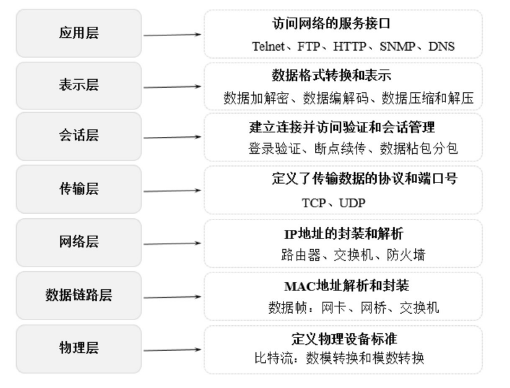

## TCP/IP四层网络模型
- TCP/IP不是指TCP和IP这两个协议的合称，而是指因特网的整个TCP/IP协议簇。
- 从协议分层模型方面来讲，TCP/IP由 4个层次组成：
    - 应用层：负责具体应用层协议的定义，包括Telnet（TELecommunications NETwork，虚拟终端协议）、 FTP （ File Transfer Protocol ， 文件传输协议） 、SMTP （ Simple Mail Transfer Protocol，电子邮件传输协议）、DNS（Domain Name Service，域名服务）、NNTP（Net News Transfer Protocol，网上新闻传输协议）和HTTP（HyperText Transfer Protocol，超文本传输协议）等。
    - 传输层：使源端和目的端机器上的对等实体可以基于会话相互通信。在这一层定义了两个端到端的协议TCP和UDP。TCP 是面向连接的协议，提供可靠的报文传输和对上层应用的连接服务，除了基本的数据传输，它还有可靠性保证、流量控制、多路复用、优先权和安全性控制等功能。UDP 是面向无连接的不可靠传输的协议，主要用于不需要TCP 的排序和流量控制等功能的应用程序。
    - 网络层：主要用于数据的传输、路由及地址的解析，以保障主机可以把数据发送给任何网络上的目标。数据经过网络传输，发送的顺序和到达的顺序可能发生变化。在网络层使用IP（Internet Protocol）和地址解析协议（ARP）。
    - 网络接口层：定义了主机间网络连通的协议，具体包括Echernet、FDDI、ATM等通信协议。
    
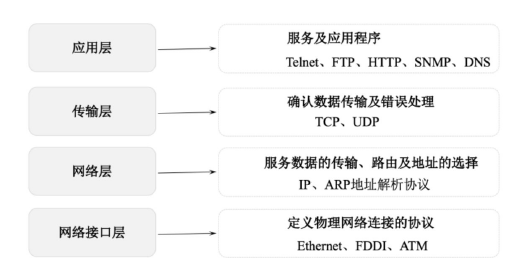

[返回目录](#目录)

## TCP三次握手
TCP数据在传输之前会建立连接需要进行三次握手。
1. 客户端发送`SYN（seq=x）` 报文给服务器端，进入SYN_SEND状态。
2. 服务器端收到SYN 报文，回应一个`SYN（seq=y） 和 ACK（ack=x+1）` 报文，进入SYN_RECV状态。
3. 客户端收到服务器端的SYN报文，回应一个`ACK（ack=y+1）` 报文，进入Established状态。

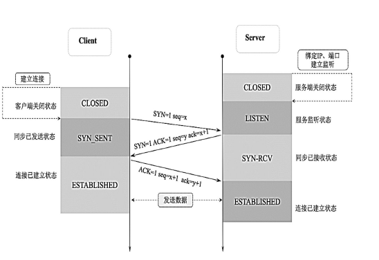

## TCP四次挥手
TCP在数据传输完成断开连接时要进行四次挥手。（可以客户端主动断连，也可以服务端主动断连）
1. 客户端应用进程调用断开连接的请求，向服务器端发送一个终止标志位`FIN=1,seq=u` 的消息，表示在客户端关闭链路前要发送的数据已经安全发送完毕，可以开始关闭链路操作，并请求服务器端确认关闭客户端到服务器的链路操作。此时客户端处于FIN-WAIT-1状态。
2. 服务器在收到这个FIN消息后返回一个`ACK=1,ack=u+1,seq=v` 的消息给客户端，表示接收到客户端断开链路的操作请求，这时TCP服务器端进程通知高层应用进程释放客户端到服务器端的链路，服务器处于CLOSE-WAIT状态，即半关闭状态。客户端在收到消息后处于FINWAIT-2状态。
3. 服务器端将关闭链路前需要发送给客户端的消息发送给客户端，在等待该数据发送完成后， 发送一个终止标志位`FIN=1,ACK=1,seq=w,ack=u+1` 的消息给客户端，表示关闭链路前服务器需要向客户端发送的消息已经发送完毕，请求客户端确认关闭从服务器到客户端的链路操作，此时服务器端处于LAST-ACK状态，等待客户端最终断开链路。
4. 客户端在接收到这个最终FIN 消息后，发送一个`ACK=1,seq=u+1,ack=w+1`的消息给服务器端，表示接收到服务器端的断开连接请求并准备断开服务器端到客户端的链路。此时客户端处于TIM-WAIT状态，TCP连接还没有释放，然后经过等待计时器（2MSL）设置的时间后，客户端将进入CLOSE状态。

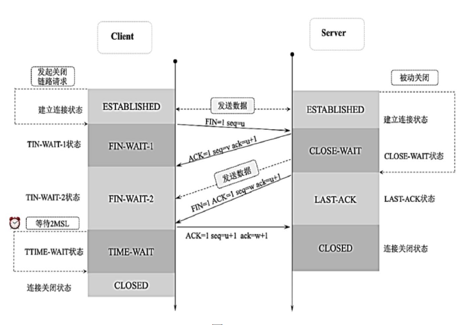

**为什么要四次挥手**
- 这是由于TCP的半关闭造成的。
- 因为TCP连接是全双工的（即数据可在两个方向上同时传递），所以在进行关闭时对每个方向都要单独进行关闭，这种单方向的关闭叫作半关闭。
- 在一方完成它的数据发送任务时，就发送一个FIN来向另一方通告将要终止这个方向的连接。

[返回目录](#目录)

## HTTP原理
HTTP是一个无状态的协议，无状态指在客户端（Web浏览器）和服务器之间不需要建立持久的连接，在一个客户端向服务器端发出请求且服务器收到该请求并返回响应（response）后，本次通信结束，HTTP连接将被关闭，服务器不保留连接的相关信息。

### HTTP传输流程
- （1）地址解析：地址解析通过域名系统DNS解析服务器域名从而获得主机的IP 地址。例如， 用客户端的浏览器请求http://localhost.com:8080/index.htm，则可从中分解出协议名、主机名、端口、对象路径等部分结果如下。
    - 协议名：HTTP。
    - 主机名：localhost.com。
    - 端口：8080。
    - 对象路径：/index.htm。
- （2）封装HTTP数据包：解析协议名、主机名、端口、对象路径等并结合本机自己的信息封装成一个HTTP请求数据包。
- （3）封装TCP包：将HTTP请求数据包进一步封装成TCP数据包。
- （4）建立TCP连接：基于TCP的三次握手机制建立TCP连接。
- （5）客户端发送请求：在建立连接后，客户端发送一个请求给服务器。
- （6）服务器响应：服务器在接收到请求后，结合业务逻辑进行数据处理，然后向客户端返回相应的响应信息。在响应信息中包含状态行、协议版本号、成功或错误的代码、消息体等内容。
- （7）服务器关闭TCP连接：服务器在向浏览器发送请求响应数据后关闭TCP 连接。但如果浏览器或者服务器在消息头中加入了Connection：keep-alive，则TCP连接在请求响应数据发送后仍然保持连接状态，在下一次请求中浏览器可以继续使用相同的连接发送请求。采用keep-alive方式不但减少了请求响应的时间，还节约了网络带宽和系统资源。

### HTTPS
- HTTPS在HTTP中加入SSL层以提高数据传输的安全性，SSL依靠证书来验证服务器的身份，并对浏览器和服务器之间的通信进行数据加密，以保障数据传输的安全性，其端口一般是443。
- **HTTP的加密流程**
    - （1）发起请求：客户端在通过TCP和服务器建立连接之后（443端口），发出一个请求证书的消息给服务器，在该请求消息里包含自己可实现的算法列表和其他需要的消息。
    - （2）证书返回：服务器端在收到消息后回应客户端并返回证书，在证书中包含服务器信息、域名、申请证书的公司、公钥、数据加密算法等。
    - （3）证书验证：客户端在收到证书后，判断证书签发机构是否正确，并使用该签发机构的公钥确认签名是否有效，客户端还会确保在证书中列出的域名就是它正在连接的域名。如果客户端确认证书有效，则生成对称密钥，并使用公钥将对称密钥加密。
    - （4）密钥交换：客户端将加密后的对称密钥发送给服务器，服务器在接收到对称密钥后使用私钥解密。
    - （5）数据传输：经过上述步骤，客户端和服务器就完成了密钥对的交换，在之后的数据传输过程中，客户端和服务端就可以基于对称加密（加密和解密使用相同密钥的加密算法）对数据加密后在网络上传输，保证了网络数据传输的安全性。

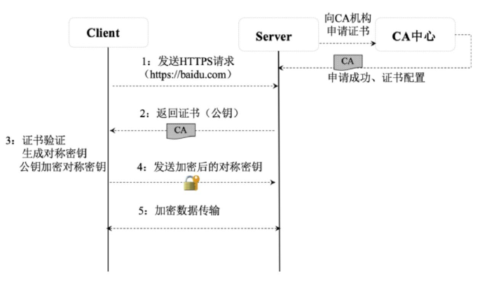

[返回目录](#目录)


## Socket
- 套接字，用来实现不同虚拟机或不同计算机之间的通信。
- Java中，Socket分为两种：面向连接的Socket通信协议(TCP)、面向无连接的Socket通信协议(UDP)。
- 基于TCP通信过程：
    - Server端监听的指定端口是否有连接请求；
    - Client端向Server发起连接请求；
    - Server端向Client回复接受信息。


# JVM、GC

## 自己编译jdk

<details>
<summary>点击查看详细内容</summary>
 
- **获取OpenJDK 12源码：** [https://hg.openjdk.java.net/jdk/jdk12/](https://hg.openjdk.java.net/jdk/jdk12/)
```
1、访问网址，点击左边菜单中的“Browse”显示源码根目录
2、再点击左边的“zip”链接即可下载当前版本打包好的源码，到本地直接解压即可。
```
- **编译前提：** 
```
1、建议在Linux系统上编译，本次采用Ubuntu，可参考源码中的doc/building.html文档
2、建议采用64位操作系统，会编译出64位OpenJDK，编译32位添加参数--with-target-bits=32
3、需要2~4G内存，6~8G空闲磁盘空间
4、所有文件不要放在中文目录下
```
- **构建编译环境：**
```
1、安装GCC 7.8：sudo apt-get install build-essential
2、安装依赖第三方工具：
    FreeType：sudo apt-get install libfreetype6-dev
    CUPS：sudo apt-get install libcups2-dev
    X11：sudo apt-get install libx11-dev libxext-dev libxrender-dev libxrandr-dev libxtst-dev libxt-dev
    ALSA：sudo apt-get install libasound2-dev
    libffi：sudo apt-get install libffi-dev
    Autoconf：sudo apt-get install autoconf
3、假设要编译大版本号为N的JDK，还要另外准备一个大版本号至少为N-1的、已经编译好的JDK，用来编译java代码：安装OpenJDK 11：sudo apt-get install openjdk-11-jdk
```
- **进行编译**
```
1、编译参数说明：
    参数使用：bash configure [options]
    查看编译参数：bash configure --help
    --with-debug-level=<level>：设置编译的级别，可选值为release、fastdebug、slowde-bug，默认release，越往后进行的优化措施就越少，带的调试信息就越多
    --enable-debug：等效于--with-debug-level=fastdebug
    --with-native-debug-symbols=<method>：确定调试符号信息的编译方式，可选值为none、internal、external、zipped
    --with-version-string=<string>：设置编译JDK的版本号，这个参数还有--with-version-<part>=<value>的形式，其中part可以是pre、opt、build、major、minor、security、patch之一，用于设置版本号的某一个部分。
    --with-jvm-variants=<variant>[，<variant>...]：编译特定模式（Variants）的HotSpot虚拟机，可以多个模式并存，可选值为server、client、minimal、core、zero、custom
    --with-jvm-features=<feature>[，<feature>...]：针对--with-jvm-variants=custom时的自定义虚拟机特性列表（Features），可以多个特性并存，由于可选值较多，请参见help命令输出
    --with-target-bits=<bits>：指明要编译32位还是64位的Java虚拟机
    --with-<lib>=<path>：用于指明依赖包的具体路径，通常使用在安装了多个不同版本的Bootstrap JDK和依赖包的情况。其中lib的可选值包括boot-jd、freetype、cups、x、alsa、libffi、jtreg、libjpeg、giflib、libpng、lcms、zlib
    --with-extra-<flagtype>=<flags>：用于设定C、C++和Java代码编译时的额外编译器参数，其中flagtype可选值为cflags、cxxflags、ldflags，分别代表C、C++和Java代码的参数
    --with-conf-name=<name>：指定编译配置名称
2、编译FastDebug版、仅含Server模式的HotSpot虚拟机：bash configure --enable-debug --with-jvm-variants=server
3、在configure命令以及后面的make命令的执行过程中，会在“build/配置名称”目录下产生如下目录结构。如果多次编译，或者目录结构成功产生后又再次修改了配置，必须先使用“make clean”和“make dist-clean”命令清理目录，才能确保新的配置生效。编译产生的目录结构以及用途如下所示：
    buildtools/：用于生成、存放编译过程中用到的工具
    hotspot/：HotSpot虚拟机编译的中间文件
    images/：使用make *-image产生的镜像存放在这里
    jdk/：编译后产生的JDK就放在这里
    support/：存放编译时产生的中间文件
    test-results/：存放编译后的自动化测试结果
    configure-support/：这三个目录是存放执行configure、make和test的临时文件
    make-support/
    test-support/
4、依赖检查通过后便可以输入“make images”执行整个OpenJDK编译了，这里“images”是“productimages”编译目标（Target）的简写别名，这个目标的作用是编译出整个JDK镜像，除了“productimages”以外，其他编译目标还有：
    hotspot：只编译HotSpot虚拟机
    hotspot-<variant>：只编译特定模式的HotSpot虚拟机
    docs-image：产生JDK的文档镜像
    test-image：产生JDK的测试镜像
    all-images：相当于连续调用product、docs、test三个编译目标
    bootcycle-images：编译两次JDK，其中第二次使用第一次的编译结果作为Bootstrap JDK
    clean：清理make命令产生的临时文件
    dist-clean：清理make和configure命令产生的临时文件
5、编译完成之后，进入OpenJDK源码的“build/配置名称/jdk”目录下就可以看到OpenJDK的完整编译结果了，把它复制到JAVA_HOME目录，就可以作为一个完整的JDK来使用
```

</details>

[返回目录](#目录)

## java内存管理机制
### java内存区域划分

|运行时数据区|用途|生命周期|异常|
|---|---|---|---|
|程序计数器|字节码解释器工作时就是通过改变这个计数器的值来选取下一条需要执行的字节码指令，线程私有|随线程|无|
|虚拟机栈|Java方法执行的线程内存模型：每个方法被执行的时候，Java虚拟机都会同步创建一个栈帧用于存储***局部变量表、操作数栈、动态连接、方法出口等信息***。每一个方法被调用直至执行完毕的过程，就对应着一个栈帧在虚拟机栈中从入栈到出栈的过程。线程私有|与线程相同|如果线程请求的栈深度大于虚拟机所允许的深度，将抛出StackOverflowError异常；如果Java虚拟机栈容量可以动态扩展，当栈扩展时无法申请到足够的内存会抛出OutOfMemoryError异常。|
|本地方法栈|与虚拟机栈作用类似，区别为虚拟机栈为虚拟机执行Java方法（也就是字节码）服务，而本地方法栈则是为虚拟机使用到的本地方法服务。|随线程|同虚拟机栈，会在栈深度溢出或者栈扩展失败时分别抛出StackOverflowError和OutOfMemoryError异常|
|Java堆|虚拟机所管理的最大的内存区域，用于存放***对象的实例***，被所有线程共享。|虚拟机启动时创建|如果在Java堆中没有内存完成实例分配，并且堆也无法再扩展时，Java虚拟机将会抛出OutOfMemoryError异常|
|方法区|用于存储***已被虚拟机加载的类型信息、常量、静态变量、即时编译器编译后的代码缓存等数据***，被所有线程共享| |无法分配新内存需求时抛出OutOfMemoryError异常|
|运行时常量池|属于方法区，用于存放编译期生成的各种字面量与符号引用，在类加载后存放到方法区的运行时常量池中| |无法申请到内存时会抛出OutOfMemoryError异常|

- **直接内存**：非虚拟机运行时数据区的一部分，内存大小分配不受Java堆大小限制，但会受本机总内存大小及处理器寻址空间限制。
    - 容易在设置-Xmx等参数信息时忽略直接内存，使得各内存区域和大于物理内存限制，导致动态扩展时出现OutOfMemoryError异常。
    - 来源：NIO类会使用Native函数库直接分配堆外内存，然后通过一个存储在Java堆里面的DirectByteBuffer对象作为这块内存的引用进行操作，来避免在Java堆和Native堆中来回复制数据以提升性能。

### 对象的创建
- 当JVM遇到一条字节码new指令时，首先将去检查这个指令的参数是否能在常量池中定位到一个类的符号引用，并且检查这个符号引用代表的类是否已被加载、解析和初始化过。如果没有，那必须先执行相应的类加载过程；
- 在类加载检查通过后，JVM将为新生对象分配内存，内存大小在类加载完后就已确定
    - **空闲列表**：由于Java堆的内存是占用、空闲混在一起，所以JVM维护一个列表来记录内存块是否可用，在分配时找一块足够大的划分给对象实例，这种分配方式叫做“空闲列表”；
    - **指针碰撞**：如果java堆的内存比较规整，可以使用“指针碰撞”方式来分配；
        - java堆是否规整由垃圾收集器是否有空间压缩整理能力决定；
- 在并发情况下，分配内存保证线程安全2种方式：
    - 1、对分配内存空间的动作进行同步处理：JVM采用CAS配上失败重试来保证更新操作的原子性。
    - 2、把内存分配的动作按照线程划分在不同的空间中进行：
        - “本地线程分配缓冲”：每个线程在java堆中预先分配一小块内存，哪个线程需要分配内存，就在那个线程的本地缓冲区进行分配，本地缓冲区用完后再分配新的缓存区时才进行同步锁定；
        - JVM通过`-XX: +/-UseTLAB`参数来设置是否使用本地线程分配缓冲策略；
- 内存分配完后，JVM需将分配到的内存空间（不包括对象头）初始化为零；之后对对象头进行设置，是否启用偏向锁等；
- new指令之后会接着执行<init>()方法，按照程序员的意愿对对象进行初始化。

### 内存分布
- 在HotSpot虚拟机中，对象在堆内存中的分布可以划分为3部分：对象头（Header）、实例数据（Instance Data）、对齐填充（Padding）；
- 对象头包括两类信息:
    - (1) 用于存储对象自身的运行时数据，如：hash码、GC分代年龄、锁状态标志、线程持有的所、偏向线程ID、偏向时间戳等
    - (2) 类型指针，即对象指向它的类型元数据的指针，JVM通过这个指针来确定该对象是哪个类的实例
- 实例数据：真正存储的有效信息，即代码中定义的各种类型字段内容，
    - 存储顺序受JVM分配策略参数`-XX: FieldsAllocationStyle`和字段在java源码中定义顺序影响
- 对齐填充：非必然存在，无特别含义，仅起到占位符作用

### 内存溢出
**Java堆溢出**
- VM Args：`-Xms20M -Xmx20M -XX:+HeapDumpOnOutOfMemoryError`
    - **避免堆自动扩展**：将堆的最小值`-Xms`参数与最大值`-Xmx`参数设置为一样即可，
    - `-XX：+HeapDumpOnOutOfMemoryError` 可以让虚拟机在出现内存溢出异常的时候 **Dump出当前的内存堆转储快照** 以便进行事后分析
- 要解决这个内存区域的异常，首先通过内存映像分析工具（如Eclipse MemoryAnalyzer）对Dump出来的堆转储快照进行分析。
    - 第一步首先应确认内存中导致OOM的对象是否是必要的，也就是要先分清楚到底是出现了内存泄漏（Memory Leak）还是内存溢出（MemoryOverflow）
    - 如果是**内存泄漏**，可进一步通过工具查看泄漏对象到GC Roots的引用链，找到泄漏对象是通过怎样的引用路径、与哪些GC Roots相关联，才导致垃圾收集器无法回收它们，根据泄漏对象的类型信息以及它到GC Roots引用链的信息，一般可以比较准确地定位到这些对象创建的位置，进而找出产生内存泄漏的代码的具体位置。
    - 如果**不是内存泄漏**，也就是内存中的对象确实都是必须存活的，那就应当检查Java虚拟机的堆参数（-Xmx与-Xms）设置，与机器的内存对比，看看是否还有向上调整的空间。再从代码上检查是否存在某些对象生命周期过长、持有状态时间过长、存储结构设计不合理等情况，尽量减少程序运行期的内存消耗。

**虚拟机栈和本地方法栈溢出**
- 栈容量只能由`-Xss`参数来设定，是由于HotSpot虚拟机中并不区分虚拟机栈和本地方法栈，因此对于HotSpot来说，`-Xoss`（设置本地方法栈大小）虽然存在，但实际上是没有任何效果的。
- 无论是由于栈帧太大还是虚拟机栈容量太小，当新的栈帧内存无法分配的时候，HotSpot虚拟机抛出的都是StackOverflowError异常。
- 操作系统分配给每个进程的内存是有限制的，HotSpot虚拟机提供了参数可以控制Java堆和方法区这两部分的内存的最大值，那剩余的内存即为操作系统限制容量减去最大堆容量，再减去最大方法区容量，由于程序计数器消耗内存很小，可以忽略掉，如果把直接内存和虚拟机进程本身耗费的内存也去掉的话，剩下的内存就由虚拟机栈和本地方法栈来分配了。因此为每个线程分配到的栈内存越大，可以建立的线程数量自然就越少，建立线程时就越容易把剩下的内存耗尽，

**方法区和运行时常量池溢出**
- 在JDK 8以后，**永久代** 已被 **元空间** 替代
- `-XX：MaxMetaspaceSize`：设置**元空间最大值**，默认是-1，即不限制，或者说只受限于本地内存大小。
- `-XX：MetaspaceSize`：指定**元空间的初始空间大小**，以字节为单位，达到该值就会触发垃圾收集进行类型卸载，同时收集器会对该值进行调整：如果释放了大量的空间，就适当降低该值；如果释放了很少的空间，那么在不超过`-XX：MaxMetaspaceSize`（如果设置了的话）的情况下，适当提高该值。
- `-XX：MinMetaspaceFreeRatio`：作用是在垃圾收集之后**控制最小的元空间剩余容量的百分比**，可减少因为元空间不足导致的垃圾收集的频率。
    - `-XX：MaxMetaspaceFreeRatio`：控制最大的元空间剩余容量的百分比。

**本机直接内存溢出**
- 可通过`-XX：MaxDirectMemorySize`参数来指定，如果不去指定，则默认与Java堆最大值（由-Xmx指定）一致

### JVM性能监控、故障处理工具

|工具|功能|命令|参数|
|---|---|---|---|
|jps|JVM Process Status Tool：可以列出正在运行的虚拟机进程，并显示虚拟机执行主类（Main Class，main()函数所在的类）名称以及这些进程的本地虚拟机唯一ID|jps [options] [hostid]|-q，-m，-l，-v|
|jstat|JVM Statistics Monitoring Tool：用于监视虚拟机各种运行状态信息的命令行工具，可以显示本地或者远程虚拟机进程中的类加载、内存、垃圾收集、即时编译等运行时数据|jstat [ option vmid [interval[s/ms] [count]] ]|-class，-gc，-gcnew，-gcold，-gcpermcapacity，-compiler，...|
|jinfo|Configuration Info for Java：实时查看和调整虚拟机各项参数|jinfo [ option ] pid|-flag|
|jmap|Memory Map for Java：用于生成堆转储快照（一般称为heapdump或dump文件），还可以查询finalize执行队列、Java堆和方法区的详细信息，如空间使用率、当前用的是哪种收集器等。|jmap [ option ] vmid|-dump，-finalizerinfo，-heap，-histo，-permstat，-F|
|jhat|JVM Heap Analysis Tool：与jmap搭配使用，来分析jmap生成的堆转储快照。|||
|jstack|Stack Trace for Java：用于生成虚拟机当前时刻的线程快照（一般称为threaddump或者javacore文件）|jstack [ option ] vmid|-F，-l，-m|

[返回目录](#目录)

### 一次内存溢出的排查
现象:当程序出现缓慢  
主要排查堆内存溢出情况  

1. 使用命令：`jstat -gcutil <pid> <period>` 打印进程的状态信息。
    - **O列** 表示老年代内存使用率；**FGC列** 表示FullGC次数。
    - 如：`jstat -gcutil 1100 3s` 打印进程号为1100的GC情况，每3s输出一条信息。
    - 看到 O列 一直是100%；FGC列 一直在增长，表示FullGC后 堆内存一直无法释放。这种情况大概率是内存泄漏导致。
2. 进一步排查是否因为堆内存过小，导致业务请求无法被满足。
    - 查看最大堆内存是多少：`jinfo -flag MaxHeapSize <pid>`。
    - 假设查出来是4G，我们可以将堆最大内存扩容到8G：`java -Xmx8G -version`。
    - 增大堆内存后，可以使用`jstat -gcutil ..`查看 O列是都还是满负荷，如果是，基本可以确定存在内存泄漏。
3. 使用命令：`jmap -histo` 定位内存泄漏的具体对象
    - ①`jmap -histo <pid>` 输出当前进程所有存活对象的堆内存占用情况。
    - 该命令显示所有类的实例个数及内存用量，按内存使用量降序输出，一般自己写的代码有内存泄漏的话，引起内存泄漏的类名会比较靠前。
    - ②再加上live参数打印一次：`jmap -histo:live <pid>` live参数会先触发一次FullGC，回收掉无用对象后再输出存活对象的堆内存占用情况。
    - 例如：`jmap -histo:live 1200 | head -n 20` 对比观察① ② 执行后 实例数量不减的类。
4. 使用命令：`jmap -dump:file` 导出堆内存数据
    - 通过第3步 可以定位到内存泄漏的类，但是如果代码中很多地方引用了这个类，可能还无法具体定位到内存泄漏位置。
    - 这时 需要导出dump文件，进一步分析内存泄漏对象的GC Root。
    - 使用：`jmap -dump:file=<app.dump> <pid>`导出dump文件。dump文件过大时不好分析，可以先将Xmx设置小一些（比如2G）。
    - 其实dump文件就是java进程的内存快照，包含所有对象的引用关系 及成员变量具体的取值。
5. 分析dump文件，寻找GC Root
    - 可以使用JDK自带工具：`jhat、jvisualvm` 或其他工具分析。
    - 如jhat：`jhat -J-Xmx2G -Port <port> <dump文件>`。
    - 一般查看堆异常情况主要看这个两个部分： Show instance counts for all classes (excluding platform)，平台外的所有对象信息。Show heap histogram 以树状图形式展示堆情况。
    - 观察是否大量应该被回收的对象在一直被引用或者是否有占用内存特别大的对象无法被回收。

[返回目录](#目录)

## 垃圾回收
### 哪些内存需要回收
**Java堆、方法区动态分配的内存**

**判断堆中的对象是否已死：**
1. **可达性分析算法（java使用）**：查找以`GC Roots`的根对象为起始节点到对应的对象之间是否还存在引用链，如果没有，即从GC Roots到这个对象不可达，表示该对象不再被使用。
    - java中固定可作为GC Roots的对象包括：
        - 虚拟机栈中引用的对象。比如：各个线程被调用的方法堆栈中使用到的参数、局部变量、临时变量等。
        - 方法区中类静态属性引用的对象。比如：静态变量。
        - 方法区中常量引用的对象。比如：字符串常量池里的引用。
        - Java虚拟机内部的引用。比如：基本数据类型对应的Class对象，一些常驻的异常对象（比如NullPointExcepiton、OutOfMemoryError）等，还有系统类加载器。
        - 所有被synchronized锁住的对象。
        - 本地方法栈中JNI（即Native方法）引用的对象。
        - 反映Java虚拟机内部情况的JMXBean、JVMTI中注册的回调、本地代码缓存等。
<details>
<summary>2. 引用计数算法（主流JVM未使用）</summary>
2. 引用计数算法（主流JVM未使用）：在对象中添加一个引用计数器，每当有一个地方引用它时，计数器值就加一；当引用失效时，计数器值就减一；任何时刻计数器为零的对象就是不可能再被使用的。
</details>

**对象死亡的两次标记：**
1. 对象在进行可达性分析后发现没有与GC Roots相连接的引用链，将会被进行 **第一次标记** 。
2. 第一次标记后虚拟机会进行一次筛选，判断是否需要调用此对象的finalize()方法。
    - 如果对象没有覆盖finalize()方法，或者finalize()方法已经被虚拟机调用过，虚拟机将不会执行该方法。（对象的finalize()方法只会被系统调用一次）
    - 如果对象被判定为有必要执行finalize()方法，该对象将会被放置在一个的队列(F-Queue)中，并由虚拟机自动创建的Finalizer线程去执行这些对象的finalize()方法。之后收集器将对队列中的对象进行 **第二次标记**，如果对象在finalize()方法中没有再跟引用链上的对象建链来拯救自己，对象就真正死亡被回收。

**方法区的垃圾回收**
- 主要包括：废弃的常量、无用类
    - 判断常量是否废弃与堆中的对象相同：没有任何字符串对象引用它，虚拟机中也没有其他地方引用它。
    - 判定一个类型是否属于无用类需要包含三方面：
        - 该类所有的实例都已经被回收，也就是Java堆中不存在该类及其任何派生子类的实例。
        - 加载该类的类加载器已经被回收，这个条件除非是经过精心设计的可替换类加载器的场景，如OSGi、JSP的重加载等，否则通常是很难达成的。
        - 该类对应的java.lang.Class对象没有在任何地方被引用，无法在任何地方通过反射访问该类的方法。
    - 关于是否要对类型进行回收，HotSpot虚拟机提供了`-Xnoclassgc`参数进行控制，还可以使用`-verbose：class`以及`-XX：+TraceClassLoading`、`-XX：+TraceClassUnLoading`查看类加载和卸载信息


### 垃圾回收算法
- 垃圾收集算法：追踪式垃圾收集(Tracing GC)
- 分代收集理论：收集器应该将Java堆划分出不同的区域，然后将回收对象依据其年龄（年龄即对象熬过垃圾收集过程的次数）分配到不同的区域之中存储。
    - 一般把java堆分为新生代、老年代，在新生代中，每次垃圾收集时都发现有大批对象死去，而每次回收后存活的少量对象，将会逐步晋升到老年代中存放
    - 但，对象不是孤立的，对象之间存在跨代调用，，
    - 如果某个新生代对象存在跨代引用，由于老年代对象难以消亡，该引用会使得新生代对象在收集时同样得以存活，进而在年龄增长之后晋升到老年代中，这时跨代引用也随即被消除了。

**标记-清除算法：**
- 首先标记出所有需要回收的对象，在标记完成后，统一回收掉所有被标记的对象，也可以反过来，标记存活的对象，统一回收所有未被标记的对象。
- 两个缺点：
    - 1、执行效率不稳定，标记和清除过程的执行效率随对象数量增长而降低；
    - 2、内存空间碎片化，标记、清除后会产生大量不连续内存碎片

**标记-复制算法：**
- 它将可用内存按容量划分为大小相等的两块，每次只使用其中的一块。当这一块的内存用完了，就将还存活着的对象复制到另外一块上面，然后再把已使用过的内存空间一次清理掉。
- 缺点：
    - 1、内存中存活大量的对象时会产生大量的内存间复制开销；
    - 2、可用内存缩小为原来一半
- 可用于回收新生代

**标记-整理算法：**
- 让所有存活的对象都向内存空间一端移动，然后直接清理掉边界以外的内存
- 缺点：对象大量存活时，移动存活对象并更新对象引用极为费力


### 垃圾收集器
**新生代收集器：**
- Serial收集器：单线程、客户端模式
- ParNew收集器：多线程、服务端模式、目前只能与CMS配合
- Parallel Scavenge收集器：多线程、标记-复制算法

**年代收集器：**
- Serial Old收集器：单线程、客户端模式、标记-整理算法
- Parallel Old收集器：多线程、标记-整理算法
- CMS（Concurrent Mark Sweep）：并发收集、低停顿；标记-清除算法、对处理器资源非常敏感、无法处理“浮动垃圾”
    
**G1（Garbage First收集器）**：服务端、衡量标准不再是它属于哪个分代，而是哪块内存中存放的垃圾数量最多，回收收益最大
    - 初始标记-并发标记-最终标记-筛选回收      


### 内存分配
1. 一般对象会优先在新生代Eden区分配，当Eden区空间不足时，虚拟机将进行一次Minor GC
    - `-XX：+PrintGCDetails`，该HotSpot虚拟机参数在JVM进行垃圾回收时打印内存回收日志，在进程退出时输出当前内存各区域分配情况。
    - `-XX：Survivor-Ratio=8`，决定了新生代中Eden区与一个Survivor区的空间比例是8∶1
2. 大对象直接进入老年代
    - 大对象：指需要大量连续内存空间的Java对象，如很长的字符串、元素数量巨多的数组。
    - 避免大对象：分配空间时容易导致还有不少内存，但却需要足够的连续空间安置 而提前触发垃圾收集；并且复制大对象需要高额内存开销。
    - `-XX：PretenureSizeThreshold`：指定大于该设置值的对象直接在老年代分配，目的是避免在Eden区及两个Survivor区之间来回复制，产生大量的内存复制操作。（注意：参数只限于Serial和ParNew两款新生代收集器）
3. 长期存活的对象将进入老年代
    - `-XX：MaxTenuringThreshold[=15]`，对象晋升老年代的年龄阈值，对象在Survivor区中每熬过一次Minor GC，年龄就增加1岁，超过阈值会晋升到老年代中
4. 动态对象年龄判断
    - 如果在Survivor空间中 相同年龄所有对象大小的总和 大于 Survivor空间的一半，年龄大于或等于该年龄的对象 就可以直接进入老年代
5. 空间分配担保
    - 在Minor GC之前，JVM必须先检查 老年代中最大可用的连续空间 是否大于 新生代中所有对象总空间，
        - 大于，进行Minor GC，
        - 小于，JVM会先检查`-XX：HandlePromotionFailure[=true/false]`设置的值是否允许担保失败，
            - 允许，继续检查 老年代最大可用的连续空间 是否大于 历次晋升到老年代对象的平均大小，
                - 大于，进行一次Minor GC。
                - 小于，进行一次Full GC。
            - 不允许，进行一次Full GC。

[返回目录](#目录)

## 类加载机制
### 类加载时机
- 一个类型从被加载到虚拟机内存中开始，到卸载出内存为止，它的整个生命周期将会经历加载（Loading）、验证（Verification）、准备（Preparation）、解析（Resolution）、初始化（Initialization）、使用（Using）和卸载（Unloading）七个阶段，其中验证、准备、解析三个部分统称为连接（Linking）。
- 加载：类加载时机由虚拟机自由把握
- 初始化：6种情况下必须立即对类进行初始化
    - (1) 遇到new、getstatic、putstatic或invokestatic这四条字节码指令时，如果类型没有进行过初始化，则需要先触发其初始化阶段。
        - 常见java场景：使用new实例化对象；读取、设置一个类型的静态字段（已在编译时放到常量池的静态字段除外）；调用一个类的静态方法。
    - (2) 使用java.lang.reflect包的方法对类型进行反射调用的时候，如果类型没有进行过初始化，则需要先触发其初始化。
    - (3) 当初始化类的时候，如果发现其父类还没有进行过初始化，则需要先触发其父类的初始化。
    - (4) 当虚拟机启动时，用户需要指定一个要执行的主类（包含main()方法的那个类），虚拟机会先初始化这个主类。
    - (5) 当使用JDK 7新加入的动态语言支持时，如果一个java.lang.invoke.MethodHandle实例最后的解析结果为REF_getStatic、REF_putStatic、REF_invokeStatic、REF_newInvokeSpecial四种类型的方法句柄，并且这个方法句柄对应的类没有进行过初始化，则需要先触发其初始化。
    - (6) 当一个接口中定义了JDK 8新加入的默认方法（被default关键字修饰的接口方法）时，如果有这个接口的实现类发生了初始化，那该接口要在其之前被初始化。

- 例：对于只static修饰的静态字段，只有直接定义这个字段的类才会被初始化，通过其子类来引用父类中定义的静态字段，只会触发父类的初始化而不会触发子类的初始化。
    - static final修饰的常量，直接被引用时定义它的类没有初始化，是因为在编译阶段该常量值已被放入常量池中，已转化为调用类对常量池的引用。

### 类加载过程
1. **加载：JVM 读取Class 文件，并根据Class 文件描述创建java.lang.Class对象的过程。**
    - JVM的三个动作
        - (1) 通过一个类的全限定名来获取定义此类的二进制字节流。（类加载器）
        - (2) 将这个字节流所代表的静态存储结构转化为方法区的运行时数据结构。
        - (3) 在内存中生成一个代表这个类的java.lang.Class对象，作为方法区这个类的各种数据的访问入口。
    - 非数组类的加载阶段既可以使用Java虚拟机里内置的引导类加载器来完成，也可以由用户自定义的类加载器去完成，开发人员通过定义自己的类加载器去控制字节流的获取方式（重写一个类加载器的findClass()或loadClass()方法），实现根据自己的想法来赋予应用程序获取运行代码的动态性。
    - 数组类的加载阶段是由JVM直接在内存中动态构造出来的，但数组类的元素类型仍需类加载器来完成加载。
2. **验证：确保Class文件的字节流中所包含的信息符合《java虚拟机规范》要求，不会危害虚拟机自身安全**
    - (1) 文件格式验证：验证字节流是否符合Class文件格式的规范，并且能被当前版本的虚拟机处理
    - (2) 元数据验证：对字节码描述的信息进行语义分析，以保证其描述的信息符合《Java语言规范》的要求
    - (3) 字节码验证：通过数据流分析和控制流分析，确定程序语义是合法的、符合逻辑的
    - (4) 符号引用验证：发生在虚拟机将符号引用转化(解析阶段)为直接引用时，可以看作是对类自身以外（常量池中的各种符号引用）的各类信息进行匹配性校验，通俗来说就是，该类是否缺少或者被禁止访问它依赖的某些外部类、方法、字段等资源
3. **准备：正式为类中的静态变量分配内存并设置类变量初始值的阶段**
    - 进行内存分配的仅包括类变量，而不包括实例变量，实例变量将会在对象实例化时随着对象一起分配在Java堆中
4. **解析：是Java虚拟机将常量池内的符号引用替换为直接引用的过程**
    - 两种方式：
        - 符号引用（Symbolic References）：符号引用以一组符号来描述所引用的目标，符号可以是任何形式的字面量，只要使用时能无歧义地定位到目标即可
        - 直接引用（Direct References）：直接引用是可以直接指向目标的指针、相对偏移量或者是一个能间接定位到目标的句柄
    - 解析动作主要针对类或接口、字段、类方法、接口方法、方法类型、方法句柄、调用点限定符 这7类符号引用进行
5. **初始化：JVM真正开始执行类中编写的Java程序代码，初始化阶段就是执行类构造器<clinit>()方法的过程**
    - <clinit>()方法是由编译器自动收集类中的所有类变量的赋值动作和静态语句块（static{}块）中的语句合并产生的，编译器收集的顺序是由语句在源文件中出现的顺序决定的，静态语句块中只能访问到定义在静态语句块之前的变量，定义在它之后的变量，在前面的静态语句块可以赋值，但是不能访问。
    - <clinit>()方法不需要显式地调用父类构造器，Java虚拟机会保证在子类的<clinit>()方法执行前，父类的<clinit>()方法已经执行完毕。因此在Java虚拟机中第一个被执行的<clinit>()方法的类型肯定是java.lang.Object。
    - 由于父类的<clinit>()方法先执行，也就意味着父类中定义的静态语句块要优先于子类的变量赋值操作
    - <clinit>()方法对于类或接口来说并不是必需的，如果一个类中没有静态语句块，也没有对变量的赋值操作，那么编译器可以不为这个类生成<clinit>()方法。
    - 接口中不能使用静态语句块，但仍然有变量初始化的赋值操作，因此接口与类一样都会生成<clinit>()方法。但接口与类不同的是，执行接口的<clinit>()方法不需要先执行父接口的<clinit>()方法，因为只有当父接口中定义的变量被使用时，父接口才会被初始化。此外，接口的实现类在初始化时也一样不会执行接口的<clinit>()方法。
    - Java虚拟机必须保证一个类的<clinit>()方法在多线程环境中被正确地加锁同步，如果多个线程同时去初始化一个类，那么只会有其中一个线程去执行这个类的<clinit>()方法，其他线程都需要阻塞等待，直到活动线程执行完毕<clinit>()方法。

### 类加载器
- 实现“通过一个类的全限定名来获取定义此类的二进制字节流”这个动作的代码叫做--“类加载器”
- 两个类是否相等：是否被同一个类加载器加载

- 从JVM角度看，类加载器分两种：
    - 1、启动类加载器（属JVM一部分），由C++实现；
    - 2、其他类加载器，独立于JVM外部，由java实现，全部继承抽象类java.lang.ClassLoader
- 从java开发角度看，Java一直保持着三层类加载器、双亲委派的类加载架构，jdk8以前
    - **启动类加载器**：负责加载存放在<JAVA_HOME>\lib目录，或者被-Xbootclasspath参数所指定的路径中存放的，而且是Java虚拟机能够识别的（按照文件名识别，如rt.jar、tools.jar，名字不符合的类库即使放在lib目录中也不会被加载）类库加载到虚拟机的内存中。
        - 启动类加载器无法被Java程序直接引用，用户在编写自定义类加载器时，如果需要把加载请求委派给引导类加载器去处理，那直接使用null代替即可，
    - **扩展类加载器**：这个类加载器是在类sun.misc.Launcher$ExtClassLoader中以Java代码的形式实现的。它负责加载<JAVA_HOME>\lib\ext目录中，或者被java.ext.dirs系统变量所指定的路径中所有的类库。
    - **应用程序类加载器**：这个类加载器由sun.misc.Launcher$AppClassLoader来实现。它负责加载用户类路径（ClassPath）上所有的类库。由于应用程序类加载器是ClassLoader类中的getSystem-ClassLoader()方法的返回值，所以有些场合中也称它为“系统类加载器”。

- **双亲委派模型**：各种类加载器之间的层次关系叫做类加载器的“双亲委派模型”：启动类加载器<-扩展类加载器<-应用程序类加载器<-自定义类加载器1,2
    - 双亲委派模型要求除了顶层的启动类加载器外，其余的类加载器都应有自己的父类加载器，通过组合关系来复用父加载器的代码。
    - **工作流程：如果一个类加载器收到类加载的请求，它首先不会自己去尝试加载这个类，而是把这个请求委派给父类加载器去完成，每个层次的类加载器都是如此，因此所有的加载请求最终都是传送到最顶层的启动类加载器中，只有当父加载器反馈自己无法完成这个加载请求（它的搜索范围中没有找到所需的类）时，子加载器才会尝试自己去完成加载。**
    - 好处：类随类加载器一起具备了一种优先级关系，可以保证如Object类在各种类加载器环境中是同一个类，因为它都会由最顶端启动类加载器进行加载。
    - 实现：
        ```
        protected synchronized Class<?> loadClass(String name, boolean resolve) throws ClassNotFoundException {
            // 先检查请求的类是否已经被加载过了
            Class c = findLoadedClass(name);
            if (c == null) {
                try {
                    if (parent != null) {
                        // 调用父加载器加载类
                        c = parent.loadClass(name, false);
                    } else {
                        // 使用启动类加载器作为父加载器
                        c = findBootstrapClassOrNull(name);
                    }
                } catch (ClassNotFoundException e) {
                    // 如果父类加载器抛出ClassNotFoundException，说明父类加载器无法完成加载请求
                }
                if (c == null) {
                    // 在父类加载器无法加载时，再调用本身的findClass方法来进行类加载
                    c = findClass(name);
                }
            }
            if (resolve) {
                resolveClass(c);
            }
            return c;
        }
        ```

- **OSGi** 实现模块化热部署的关键是它自定义的类加载器机制的实现，每一个程序模块（OSGi中称为Bundle）都有一个自己的类加载器，当需要更换一个Bundle时，就把Bundle连同类加载器一起换掉以实现代码的热替换。
    - 在OSGi环境下，类加载器不再双亲委派模型推荐的树状结构，而是进一步发展为更加复杂的网状结构，
    - 当收到类加载请求时，OSGi将按照下面的顺序进行类搜索：
        - 1）将以java.*开头的类，委派给父类加载器加载。
        - 2）否则，将委派列表名单内的类，委派给父类加载器加载。
        - 3）否则，将Import列表中的类，委派给Export这个类的Bundle的类加载器加载。
        - 4）否则，查找当前Bundle的ClassPath，使用自己的类加载器加载。
        - 5）否则，查找类是否在自己的Fragment Bundle中，如果在，则委派给Fragment Bundle的类加载器加载。
        - 6）否则，查找Dynamic Import列表的Bundle，委派给对应Bundle的类加载器加载。
        - 7）否则，类查找失败。

[返回目录](#目录)


## 性能调优

### 双11亿级流量访问JVM内存分配优化
jvm调优后，几乎不发生full GC

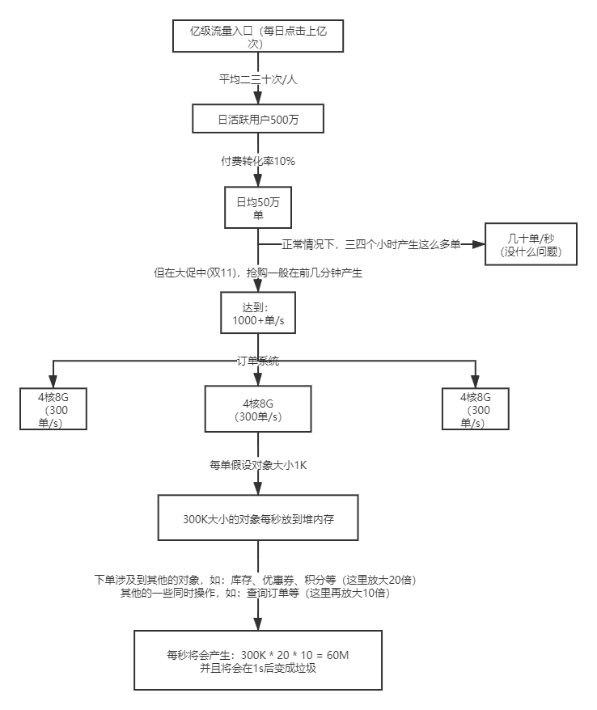

一般老年代占堆总容量的2/3，年轻代占1/3（其中Eden区占8/10，两个Survivor区分别占1/10）

**jvm内存分配：** 堆总共：3G
- 老年代：2G
- 年轻代：1G，分别为：Eden区：800M，Survivor0:100M，Survivor1:100M
- 方法区：512M，栈（线程1）：1M，栈（线程2）：1M

**分析：**
1. 每秒会产生60M数据放到Eden区，这样（800/60 ≈ 13s）就会占满Eden区。
2. 前12s产生的订单会变成垃圾，但是第13s产生的对象会存在，然后转到Survivor区（60M），占了Survivor空间的60%。（机制：Survivor区在超过内存空间50%时，会将对象放到老年代，导致60M的垃圾会放到老年代。）

**进行调优，重新设置jvm内存分配：**
- 老年代：1G
- 年轻代：2G，分别为：Eden：1.6G，Survivor0:200M，Survivor1:200M

**再来分析：**
1. 此时1s产生60M数据放到Eden区，占满Eden需要约25秒。
2. 每20s产生60M垃圾放到Survivor0，下次25s后产生的60M垃圾会放到Survivor1，并且一次Minor GC会清掉Eden区和Survivor0区，下次再类推清掉Eden和Survivor1，这样60M垃圾在年轻代就被GC了不会再放到老年代等full GC。


### JVM参数

| [JVM参数](https://segmentfault.com/a/1190000010603813) | 说明                                                         | 使用                                                         |
| ------------------------------------------------------ | ------------------------------------------------------------ | ------------------------------------------------------------ |
| **-Xms**                                               | 堆最小值                                                     | -Xms 5G<br />或 -XX:InitialHeapSize=2048m                    |
| **-Xmx**                                               | 堆最大值                                                     | -Xmx 5G<br />或 -XX:MaxHeapSize=2048m                        |
| **-Xmn**                                               | 新生代大小                                                   | -Xmn512m<br />或 -XX:MaxNewSize=512m                         |
| **MetaspaceSize**                                      | 元空间初始大小                                               | -XX:MetaspaceSize=128m                                       |
| **MaxMetaspaceSize**                                   | 元空间最大值                                                 | -XX:MaxMetaspaceSize=512m                                    |
| **-Xss**                                               | 线程栈大小                                                   | -Xss1M<br /> 或 -XX:ThreadStackSize=1M                       |
| **MaxDirectMemorySize**                                | 最大直接内存（堆外）大小，（不指定默认跟堆最大值一致）       | -XX:MaxDirectMemorySize=1G                                   |
| **UseG1GC**                                            | 使用G1垃圾收集器                                             | -XX:+UseG1GC                                                 |
| **MaxGCPauseMillis**                                   | 自适应大小策略的最大GC暂停时间目标（以毫秒为单位），或（仅G1）每个MMU时间片的最大GC时间 | -XX:MaxGCPauseMillis=200                                     |
| **G1ReservePercent**                                   | G1为分配担保预留的空间比例                                   | -XX:G1ReservePercent=15                                      |
| **SurvivorRatio**                                      | eden区和survivor的比值                                       | -XX:SurvivorRatio=6<br />（表示每个survivor区跟eden区的比值为1:6,每个survivor区占新生代的八分之一） |
| PretenureSizeThreshold                                 | 可以在新生代直接分配的对象最大值，0表示没有最大值            | -XX:PretenureSizeThreshold=1000000<br />设置该参数，可以使大于这个值的对象直接在老年代分配，避免在Eden区和Survivor区发生大量的内存复制，该参数只对Serial和ParNew收集器有效，Parallel Scavenge并不认识该参数 |
| **MaxTenuringThreshold**                               | 年轻代最大年龄                                               | -XX:MaxTenuringThreshold=10<br />每个对象在坚持过一次Minor GC之后，年龄就增加1，当超过这个参数值时就进入老年代，最大支持15 |
| **InitiatingHeapOccupancyPercent**                     | 内存占用达到整个堆百分之多少的时候开启一个GC周期，G1 GC会根据整个栈的占用，而不是某个代的占用情况去触发一个并发GC周期，0表示一直在GC，默认值是45 | -XX:InitiatingHeapOccupancyPercent=45                        |
| ExplicitGCInvokesConcurrent                            | 在full gc时，并不全程停顿，依然只在ygc和两个remark阶段停顿   | -XX:+ExplicitGCInvokesConcurrent                             |
| AlwaysPreTouch                                         | 启动时访问并置零内存页面：启动时就把参数里说好了的内存全部舔一遍，可能令得启动时慢上一点，但后面访问时会更流畅，比如页面会连续分配，比如不会在晋升新生代到老生代时才去访问页面使得GC停顿时间加长。不过这选项对大堆才会更有感觉一点。 | -XX:+AlwaysPreTouch                                          |
| AutoBoxCacheMax                                        | `Integer i = 3;`这语句有着 int自动装箱成Integer的过程，JDK默认只缓存 -128 ~ +127的int 和 long，超出范围的数字就要即时构建新的Integer对象。设为20000后，应用的QPS从48,000提升到50,000，足足4%的影响 | -XX:AutoBoxCacheMax=20000                                    |
| PrintFlagsFinal                                        | 打印最终值，如果某个默认值被新值覆盖，显示新值               | -XX:+PrintFlagsFinal -version                                |
| **Xloggc**                                             | GC日志文件路径                                               | -Xloggc:/data/gclog/gc.log                                   |
| **UseGCLogFileRotation**                               | 滚动GC日志文件，须配置Xloggc                                 | -XX:+UseGCLogFileRotation                                    |
| **NumberOfGCLogFiles**                                 | 滚动GC日志文件数，默认0，不滚动                              | -XX:NumberOfGCLogFiles=10                                    |
| **GCLogFileSize**                                      | GC文件滚动大小，需配置UseGCLogFileRotation，设置为0表示仅通过jcmd命令触发 | -XX:GCLogFileSize=100M                                       |
| **PrintGCDetails**                                     | GC时打印更多详细信息，默认关闭                               | -XX:+PrintGCDetails                                          |
| **PrintGCDateStamps**                                  | GC时打印时间戳信息，默认关闭                                 | -XX:+PrintGCDateStamps                                       |
| **PrintGCApplicationStoppedTime**                      | 打印应用暂停时间，默认关闭                                   | -XX:+PrintGCApplicationStoppedTime                           |
| **PrintTenuringDistribution**                          | 打印存活实例年龄信息，默认关闭                               | -XX:+PrintTenuringDistribution                               |
| **PrintHeapAtGC**                                      | GC前后打印堆区使用信息，默认关闭                             | -XX:+PrintHeapAtGC                                           |
| **ErrorFile**                                          | 错误日志路径                                                 | -XX:ErrorFile=targetDir/hs_err_pid_%p.log                    |
| **HeapDumpOnOutOfMemoryError**                         | 抛出内存溢出错误时导出堆信息到指定文件，默认关闭             | -XX:+HeapDumpOnOutOfMemoryError                              |
| **HeapDumpPath**                                       | 当HeapDumpOnOutOfMemoryError开启的时候，dump文件的保存路径，默认为工作目录下的java_pid<pid>.hprof文件 | -XX:HeapDumpPath=/data/dump/jvm.dump                         |

> [关键业务系统的JVM启动参数推荐 ](https://blog.csdn.net/albertfly/article/details/51533315)


<details>
<summary>点击查看其他详细内容</summary>

### 大内存硬件上的程序部署策略
- 背景：一个15万PV/日左右的在线文档类型网站，服务器的硬件为四路志强处理器、16GB物理内存，操作系统为64位CentOS 5.4，Resin作为Web服务器。
    - 1个虚拟机实例，使用-Xmx和-Xms参数将Java堆大小固定在12GB，垃圾收集停顿导致网站经常不定期出现长时间失去响应
    - 在该系统软硬件条件下，HotSpot虚拟机是以服务端模式运行，默认使用的是吞吐量优先收集器，回收12GB的Java堆，一次FullGC的停顿时间就高达14秒
    - 由于程序设计的原因，访问文档时会把文档从磁盘提取到内存中，导致内存中出现很多由文档序列化产生的大对象，这些大对象大多在分配时就直接进入了老年代，没有在Minor GC中被清理掉。这种情况下即使有12GB的堆，内存也很快会被消耗殆尽，由此导致每隔几分钟出现十几秒的停顿
- 解决：
    - 程序部署问题：过大的堆内存进行回收带来长时间停顿
        - 可以使用控制延迟为目标的Parallel Scavenge/Old收集器，但要把应用的Full GC频率控制到足够低，以便可以在深夜触发Full GC或重启服务器来清除内存
            - 控制Full GC频率关键是控制老年代的稳定，即大多数对象要符合“朝生夕灭”原则，生存时间不应太长，尤其不能有大批量、长生存的对象产生
        - 单JVM实例管理大内存还需要：
            - 如使用G1收集器增量回收、大内存需要64位JVM支持、应用程序稳定
        - 可以使用多个虚拟机建立逻辑集群来利用硬件资源：
            - 即在一台物理机上开启多个应用服务器进程，分别分配不同端口，在前端搭建一个负载均衡器以反向代理方式分配访问请求
            - 问题：节点竞争全局资源，如磁盘竞争-并发写操作容易导致I/O异常；不能高效利用某些资源池，如各节点都自建连接池；大量使用本地缓存的应用，会造成集群内存浪费

### 集群间同步导致内存溢出
- 背景：一个基于B/S的MIS系统，硬件为两台双路处理器、8GB内存的HP小型机，应用中间件是WebLogic9.2，每台机器启动了3个WebLogic实例，构成一个6个节点的亲合式集群
    - 由于是亲和式集群，节点间没有session同步，但有需求要部分数据在节点间共享，便建立全局缓存JBossCache，之后不定期出现多次内存溢出问题
- 解决：
    - 先确保没有什么异常操作后，给服务配置`-XX：+HeapDumpOnOutOfMemoryError`参数来运行，结果发现堆转储快照中存在大量org.jgroups.protocols.pbcast.NAKACK对象。
        - JBossCache是基于自家的JGroups进行集群间的数据通信，JGroups使用协议栈的方式来实现收发数据包的各种所需特性自由组合，数据包接收和发送时要经过每层协议栈的up()和down()方法，其中的NAKACK栈用于保障各个包的有效顺序以及重发。
        - 由于信息有传输失败需要重发的可能性，在确认所有注册在GMS（Group Membership Service）的节点都收到正确的信息前，发送的信息必须在内存中保留。
            - 而此MIS的服务端中有一个负责安全校验的全局过滤器，每当接收到请求时，均会更新一次最后操作时间，并且将这个时间同步到所有的节点中去，使得一个用户在一段时间内不能在多台机器上重复登录。
            - 在服务使用过程中，往往一个页面会产生数次乃至数十次的请求，因此这个过滤器导致集群各个节点之间网络交互非常频繁。当网络情况不能满足传输要求时，重发数据在内存中不断堆积，很快就产生了内存溢出。
    - 该问题既有JBossCache的缺陷，也有MIS系统实现方式上的缺陷。应避免使用JBossCache这种非集中式集群缓存来实现数据同步，可以频繁读操作，但不应频繁写操作带来较大的网络同步开销

### 堆外内存导致内存溢出
- 背景：大量的NIO操作需要使用到直接内存
- 直接内存：可通过`-XX：MaxDirectMemorySize`调整大小，
    - 内存不足时抛出OutOfMemoryError或者OutOfMemoryError：Direct buffer memory。

### 外部命令导致系统缓慢
- 背景：通过操作系统的mpstat工具发现处理器使用率很高，但是系统中占用绝大多数处理器资源的程序并不是该应用本身
    - 每个用户请求的处理都需要执行一个外部Shell脚本来获得系统的一些信息。执行这个Shell脚本是通过Java的`Runtime.getRuntime().exec()`方法来调用的。
    - 频繁调用时创建进程的开销较大，资源消耗严重。
- 应该去掉shell脚本执行语句，使用java的API去获取相关信息

### 服务器虚拟机进程崩溃
- 背景：集群节点的虚拟机进程频繁自动关闭，留下一个hs_err_pid###.log文件，异常信息：
    ```
    java.net.SocketException: Connection reset
    at java.net.SocketInputStream.read(SocketInputStream.java:168)
    at java.io.BufferedInputStream.fill(BufferedInputStream.java:218)
    at java.io.BufferedInputStream.read(BufferedInputStream.java:235)
    at org.apache.axis.transport.http.HTTPSender.readHeadersFromSocket(HTTPSender.java:583)
    at org.apache.axis.transport.http.HTTPSender.invoke(HTTPSender.java:143)
    ... 99 more
    ```   
    - 由于MIS系统的用户多，待办事项变化很快，为了不被OA系统速度拖累，使用了异步的方式调用Web服务，但由于两边服务速度的完全不对等，时间越长就累积了越多Web服务没有调用完成，导致在等待的线程和Socket连接越来越多，最终超过虚拟机的承受能力后导致虚拟机进程崩溃
- 解决：
    - 通知OA门户方修复无法使用的集成接口，并将异步调用改为生产者/消费者模式的消息队列实现

### 不恰当的数据结构导致内存占用过大
- 背景：一个后台RPC服务器，使用64位Java虚拟机，内存配置为-Xms4g-Xmx8g-Xmn1g，使用ParNew加CMS的收集器组合。
    - 平时对外服务的Minor GC时间约在30毫秒以内，完全可以接受。但业务上需要每10分钟加载一个约80MB的数据文件到内存进行数据分析，这些数据会在内存中形成超过100万个HashMap<Long，Long>Entry，在这段时间里面Minor GC就会造成超过500毫秒的停顿
    - 在分析数据文件期间，800MB的Eden空间很快被填满引发垃圾收集，但Minor GC之后，新生代中绝大部分对象依然是存活的。我们知道ParNew收集器使用的是复制算法，这个算法的高效是建立在大部分对象都“朝生夕灭”的特性上的，如果存活对象过多，把这些对象复制到Survivor并维持这些对象引用的正确性就成为一个沉重的负担，因此导致垃圾收集的暂停时间明显变长。
- 解决：
    - 不修改程序，从GC调优角度解决：（治标）
        - 可以考虑直接将Survivor空间去掉（加入参数`-XX：SurvivorRatio=65536`、`-XX：MaxTenuringThreshold=0`或者`-XX：+Always-Tenure`），让新生代中存活的对象在第一次Minor GC后立即进入老年代，等到Major GC的时候再去清理它们。
    - 修改程序：（治本）
        - 分析HashMap<Long，Long>空间效率，两个长整型实际存放数据占2*8=16byte，但实际耗费内存：(Long(24byte)×2)+Entry(32byte)+HashMapRef(8byte)=88byte，空间效率为16字节/88字节=18%，这确实太低


### 由安全点导致长时间停顿
- 背景：一个比较大的承担公共计算任务的离线HBase集群，运行在JDK 8上，使用G1收集器。
    - 每天都有大量的MapReduce或Spark离线分析任务对其进行访问，同时有很多其他在线集群Replication过来的数据写入，因为集群读写压力较大，而离线分析任务对延迟又不会特别敏感，所以将-XX：MaxGCPauseMillis参数设置到了500毫秒。不过运行一段时间后发现垃圾收集的停顿经常达到3秒以上，而且实际垃圾收集器进行回收的动作就只占其中的几百毫秒
- 解决：    
    - 加入参数`-XX：+PrintSafepointStatistics`和`-XX：PrintSafepointStatisticsCount=1`去查看安全点日志
        - 日志显示当前虚拟机的操作（VM Operation，VMOP）是等待所有用户线程进入到安全点，但是有两个线程特别慢，导致发生了很长时间的自旋等待，所以垃圾收集线程无法开始工作，只能空转（自旋）等待。
            - 第一步把这两个慢的线程找出来：添加`-XX：+SafepointTimeout`和`-XX：SafepointTimeoutDelay=2000`两个参数，让虚拟机在等到线程进入安全点的时间超过2000毫秒时就认定为超时，这样就会输出导致问题的线程名称
        - 最终查明导致这个问题是HBase中一个连接超时清理的函数，由于集群会有多个MapReduce或Spark任务进行访问，而每个任务又会同时起多个Mapper/Reducer/Executer，其每一个都会作为一个HBase的客户端，这就导致了同时连接的数量会非常多。
            - 更为关键的是，清理连接的索引值就是int类型，所以这是一个可数循环，HotSpot不会在循环中插入安全点。当垃圾收集发生时，如果RpcServer的Listener线程刚好执行到该函数里的可数循环时，则必须等待循环全部跑完才能进入安全点，此时其他线程也必须一起等着，所以从现象上看就是长时间的停顿
    - 解决：把循环索引的数据类型从int改为long即可，（需要掌握安全点和垃圾收集的知识）

</details>

[返回目录](#目录)

# 函数式编程
## Lambda
### Lambda语法  

```
(String s) -> s.length()  //具有一个String类型的参数并返回一个int。Lambda没有return语句，因为已经隐含了return，使用return要加花括号
(Apple a) -> a.getWeight() > 150  //有一个Apple 类型的参数并返回一个boolean（苹果的重量是否超过150克）
(int x, int y) -> {  //具有两个int类型的参数而没有返回值（void返回）。注意Lambda表达式可以包含多行语句，这里是两行
    System.out.println("Result:");
    System.out.println(x+y);
}
() -> 42  //没有参数， 返回一个int
() -> void  //代表了参数列表为空，且返回void的函数。
(Apple a1, Apple a2) -> a1.getWeight().compareTo(a2.getWeight())  //具有两个Apple类型的参数，返回一个int：比较两个Apple的重量

布尔表达式： (List<String> list) -> list.isEmpty()  函数式接口：Predicate<List<String>>
创建对象： () -> new Apple(10)  函数式接口：Supplier<Apple>
消费一个对象：   函数式接口：Consumer<Apple>
(Apple a) -> {
    System.out.println(a.getWeight());
}
从一个对象中选择/抽取： (String s) -> s.length()  函数式接口：Function<String, Integer>或ToIntFunction<String>
组合两个值： (int a, int b) -> a * b  函数式接口：IntBinaryOperator
比较两个对象： (Apple a1, Apple a2) -> a1.getWeight().compareTo(a2.getWeight())  函数式接口：Comparator<Apple>或BiFunction<Apple, Apple, Integer>或ToIntBiFunction<Apple, Apple>
```

### Lambda使用
1. Lambda表达式可以被赋给一个变量
2. 传递给一个 接受函数式接口作为参数 的方法  

**函数式接口上使用Lambda**  
- 函数式接口：只定义一个抽象方法的接口。  
- Lambda表达式允许直接以内联的形式为函数式接口的抽象方法提供实现，并把整个表达式作为函数式接口的实例。（要比使用匿名内部类简洁许多）  
- 可以使用@FunctionalInterface标注函数式接口，若被标记接口不是函数式接口，编译器会返回错误：“Multiple non-overriding abstract methods found in interface Foo”表示存在多个抽象方法。
```java
//使用Lambda
Runnable r1 = () -> System.out.println("Hello World 1");

//使用匿名类
Runnable r2 = new Runnable(){
    public void run(){
        System.out.println("Hello World 2");
    }
};

//运行
public static void process(Runnable r){
    r.run();
}
process(r1);
process(r2);
//利用直接传递的Lambda方式
process(() -> System.out.println("Hello World 3"));
```
```java
//资源处理实例：打开一个资源，做一些处理，然后关闭资源。
// 1、使用try-resource方式，只能读取文件第一行
public static String processFile() throws IOException {
    try (BufferedReader br = new BufferedReader(new FileReader("data.txt"))) {
        return br.readLine();
    }
}

// 2、灵活读取
//1：创建一个能匹配BufferedReader -> String，且可以抛出IOException异常的接口
@FunctionalInterface
public interface BufferedReaderProcessor {
    String process(BufferedReader b) throws IOException;
}
//2：将函数式接口作为参数，并处理BufferedReader对象
public static String processFile(BufferedReaderProcessor p) throws IOException {
    try (BufferedReader br = new BufferedReader(new FileReader("data.txt"))) {
        return p.process(br);
    }
}
//3：接收BufferedReader参数并返回String的Lambda
String oneLine = processFile((BufferedReader br) -> br.readLine());
String twoLines = processFile((BufferedReader br) -> br.readLine() + br.readLine());
```
```java
Java中函数式接口：
Comparable、Runnable、Callable   Predicate、Consumer、Function

//1、java.util.function.Predicate<T>接口定义了一个名叫test的抽象方法，它接受泛型T对象，并返回一个boolean。
// 在需要表示一个涉及类型T的布尔表达式时，就可以使用这个接口。比如，可以定义一个接受String对象的Lambda表达式
//    @FunctionalInterface
//    public interface Predicate<T>{
//        boolean test(T t);
//    }
public static <T> List<T> filter(List<T> list, Predicate<T> p) {
    List<T> results = new ArrayList<>();
    for(T s: list){
        if(p.test(s)){
            results.add(s);
        }
    }
    return results;
}
Predicate<String> nonEmptyStringPredicate = (String s) -> !s.isEmpty();
List<String> nonEmpty = filter(listOfStrings, nonEmptyStringPredicate);

//2、java.util.function.Consumer<T>定义了一个名叫accept的抽象方法，它接受泛型T的对象，没有返回（void）。
// 如果需要访问类型T的对象，并对其执行某些操作，就可以使用这个接口。比如，可以用它来创建一个forEach方法，接受一个Integers的列表，并对其中每个元素执行操作。
// 如下可以使用这个forEach方法，并配合Lambda来打印列表中的所有元素。
//@FunctionalInterface
//public interface Consumer<T>{
//    void accept(T t);
//}
public static <T> void forEach(List<T> list, Consumer<T> c){
    for(T i: list){
        c.accept(i);
    }
}
forEach(
        Arrays.asList(1,2,3,4,5), 
        (Integer i) -> System.out.println(i)
        );

//3、java.util.function.Function<T, R>接口定义了一个叫作apply的方法，它接受一个泛型T的对象，并返回一个泛型R的对象。
// 如果需要定义一个Lambda，将输入对象的信息映射到输出，就可以使用这个接口（比如提取苹果的重量，或把字符串映射为它的长度）。
// 如下利用它来创建一个map方法，以将一个String列表映射到包含每个String长度的Integer列表。
//@FunctionalInterface
//public interface Function<T, R>{
//    R apply(T t);
//}
public static <T, R> List<R> map(List<T> list, Function<T, R> f) {
    List<R> result = new ArrayList<>();
    for(T s: list){
        result.add(f.apply(s));
    }
    return result;
}
// [7, 2, 6]
List<Integer> l = map(
        Arrays.asList("lambdas","in","action"),
        (String s) -> s.length()
);
```

[返回目录](#目录)

## 方法引用
使用方式：目标引用放在分隔符::前，方法的名称放在后面，方法不需要括号，因为没有实际调用这个方法。  

针对单一方法的Lambda
```java
//例如排序
先前：inventory.sort((Apple a1, Apple a2) -> a1.getWeight().compareTo(a2.getWeight()));
之后：inventory.sort(comparing(Apple::getWeight)); //使用方法引用和java.util.Comparator.comparing；Apple::getWeight就是引用了Apple类中定义的方法getWeight。
```

|Lambda|等效方法引用|
|---|---|
|(Apple a) -> a.getWeight()|Apple::getWeight|
|() -> Thread.currentThread().dumpStack()|Thread.currentThread()::dumpStack|
|(str, i) -> str.substring(i)|String::substring|
|(String s) -> System.out.println(s)|System.out::println|

### 构建方法引用  
1. 指向静态方法的方法引用（例如Integer的parseInt方法，写作Integer::parseInt）。  
2. 指向任意类型实例方法的方法引用（例如String 的length 方法，写作String::length）。  
3. 指向现有对象的实例方法的方法引用（假设你有一个局部变量expensiveTransaction用于存放Transaction类型的对象，它支持实例方法getValue，那么你就可以写expensiveTransaction::getValue）  

### 复合Lambda表达式  
```java
1、比较器复合：
    //对库存进行排序，比较苹果的重量
    Comparator<Apple> c = Comparator.comparing(Apple::getWeight);
    //对苹果按重量递减排序
    inventory.sort(comparing(Apple::getWeight).reversed());
    //两个苹果一样重时，进一步按国家排序
    inventory.sort(comparing(Apple::getWeight)
             .reversed()
             .thenComparing(Apple::getCountry));

2、谓词复合：negate(非)、and、or
and和or方法是按照在表达式链中的位置，从左向右确定优先级的。a.or(b).and(c)可以看作(a || b) && c。
    //不是红的苹果
    Predicate<Apple> notRedApple = redApple.negate();
    //红的并且大于150克的苹果
    Predicate<Apple> redAndHeavyApple = redApple.and(a -> a.getWeight() > 150);
    //或者是大于150克的红苹果，或者是绿苹果
    Predicate<Apple> redAndHeavyAppleOrGreen = redApple.and(a -> a.getWeight() > 150)
                                                       .or(a -> "green".equals(a.getColor()));

3、函数复合：
andThen方法会返回一个函数，它先对输入应用一个给定函数，再对输出应用另一个函数。
compose方法先把给定的函数用作compose的参数里面给的那个函数，然后再把函数本身用于结果。
    //合成一个函数h，先给数字加1，再给结果乘2，数学上写作g(f(x))
    Function<Integer, Integer> f = x -> x + 1;
    Function<Integer, Integer> g = x -> x * 2;
    Function<Integer, Integer> h = f.andThen(g);
    int result = h.apply(1);//返回4
    //使用compose方法的话等于f(g(x))，上边函数将返回3
函数复合方式实战：
    //如对用String表示的一封信做文本转换
    public class Letter{
        public static String addHeader(String text){
            return "From Raoul, Mario and Alan: " + text;
        }
        public static String addFooter(String text){
            return text + " Kind regards";
        }
        public static String checkSpelling(String text){
            return text.replaceAll("labda", "lambda");
        }
    }
    //通过复合这些方法来创建各种转型流水线，比如：先加上抬头，然后进行拼写检查，最后加上一个落款。
    Function<String, String> addHeader = Letter::addHeader;
    Function<String, String> transformationPipeline = addHeader.andThen(Letter::checkSpelling)
                                                               .andThen(Letter::addFooter);
```    

[返回目录](#目录)

## Stream
流是一种内部迭代方式，流只能消费一次。

### 流的基本操作
流的使用包含三部分：
1. 一个数据源（如集合）来执行一个查询；
2. 一个中间操作链，形成一条流的流水线；
3. 一个终端操作，执行流水线，并能生成结果。

```java
List<String> names = menu.stream() //获取流
                         .filter(d -> d.getCalories() > 300) //中间操作(返回Stream)，过滤大于300卡路里的菜
                         .map(Dish::getName) //中间操作(返回Stream)，获取菜名
                         .limit(3) //中间操作(返回Stream)，取前3个
                         .collect(toList()); //终端操作(返回非Stream)，关闭流，生成列表。

List<Dish> menu = Arrays.asList(
        new Dish("pork", false, 800, Dish.Type.MEAT),
        new Dish("beef", false, 700, Dish.Type.MEAT),
        new Dish("chicken", false, 400, Dish.Type.MEAT),
        new Dish("french fries", true, 530, Dish.Type.OTHER),
        new Dish("rice", true, 350, Dish.Type.OTHER),
        new Dish("season fruit", true, 120, Dish.Type.OTHER),
        new Dish("pizza", true, 550, Dish.Type.OTHER),
        new Dish("prawns", false, 300, Dish.Type.FISH),
        new Dish("salmon", false, 450, Dish.Type.FISH) );

public class Dish {
    private final String name;
    private final boolean vegetarian;
    private final int calories;
    private final Type type;
    public Dish(String name, boolean vegetarian, int calories, Type type) {
        this.name = name;
        this.vegetarian = vegetarian;
        this.calories = calories;
        this.type = type;
    }
    public String getName() {
        return name;
    }
    public boolean isVegetarian() {
        return vegetarian;
    }
    public int getCalories() {
        return calories;
    }
    public Type getType() {
        return type;
    }
    @Override
    public String toString() {
        return name;
    }
    public enum Type { MEAT, FISH, OTHER }
}
```

**中间操作**

操作|参数|描述  
---|---|---  
filter|返回boolean的函数|过滤
map|Function<T, R>|T -> R
flatmap|Function<T, R>|方法让你把一个流中的每个值都换成另一个流，然后把所有的流连接起来成为一个流。
limit(n)|int|返回截至前n个元素的流，如果源是一个Set，limit的结果不会以任何顺序排列。
sorted|Comparator<T>|(T, T) -> int
distinct|无|去重
skip(n)|int|返回一个丢掉前n个元素的流。如果流中元素不足n个，则返回一个空流。 
数值流：mapToInt、mapToDouble和mapToLong|IntStream、DoubleStream和LongStream|将流转化为数值流，转回一般流可以使用 数值流.boxed()方法
构建流：| |①由值创建流：Stream<String> stream = ***Stream.of***("Java 8 ", "Lambdas ", "In ", "Action"); 创建空流：***Stream.empty();***
| | |②由数组创建流：int[] numbers = {2, 3, 5, 7, 11, 13}; int sum = ***Arrays.stream***(numbers).sum();
| | |③由文件生成流：java.nio.file.Files中的很多静态方法都会返回一个流，如：Files.lines
| | |④由函数生成流：创建无限流：Stream.iterate和Stream.generate。如：Stream.iterate(0, n -> n + 2).limit(10).forEach(System.out::println);生成了一个正偶数流，iterate应该在依次生成一系列值的时候使用。Stream.generate(Math::random).limit(5).forEach(System.out::println);生成一个有五个0到1之间的随机双精度数的流

**终端操作**  

操作|返回类型|目的
---|---|---
forEach|void|消费流中的每个元素并对其应用Lambda。
count|long|返回流中元素的个数。
collect|集合(如List、Map、Integer)|把流归约成一个集合。
anyMatch|boolean|是否至少匹配一个元素。
allMatch|boolean|是否匹配所有元素
noneMatch|boolean|没有匹配任何元素
findAny|Optional<T>|返回当前流中的任意元素。java.util.Optional是一个容器类，代表一个值存在或不存在。
findFirst|Optional<T>|返回第一个元素。
reduce| |归约，接收两个参数：①初始值，②一个BinaryOperator<T>来将两个元素结合起来产生一个新值。如求和操作，①int sum = numbers.stream().reduce(0, (a, b) -> a + b);②int sum = numbers.stream().reduce(0, Integer::sum);
| | |reduce求最大/最小值，如：Optional<Integer> max = numbers.stream().reduce(Integer::max);  reduce(Integer::min);

**Collectors类的静态工厂方法**  

工厂方法|返回类型|作用|示例
---|---|---|---
toList|List<T>|把流中所有项目收集到一个List|List<Dish> dishes = menuStream.collect(toList());
toSet|Set<T>|把流中所有项目收集到一个Set，删除重复项|Set<Dish> dishes = menuStream.collect(toSet());
toCollection|Collection<T>|把流中所有项目收集到给定的供应源创建的集合|Collection<Dish> dishes = menuStream.collect(toCollection(),ArrayList::new);
counting|Long|计算流中元素的个数|long howManyDishes = menuStream.collect(counting());
summingInt|Integer|对流中项目的一个整数属性求和|int totalCalories = menuStream.collect(summingInt(Dish::getCalories));
averagingInt|Double|计算流中项目Integer 属性的平均值|double avgCalories = menuStream.collect(averagingInt(Dish::getCalories));
summarizingInt|IntSummaryStatistics|收集关于流中项目Integer 属性的统计值，例如最大、最小、总和与平均值|IntSummaryStatistics menuStatistics = menuStream.collect(summarizingInt(Dish::getCalories));
joining|String|连接对流中每个项目调用toString 方法所生成的字符串|String shortMenu = menuStream.map(Dish::getName).collect(joining(", "));
maxBy|Optional<T>|一个包裹了流中按照给定比较器选出的最大元素的Optional，或如果流为空则为Optional.empty()|Optional<Dish> fattest = menuStream.collect(maxBy(comparingInt(Dish::getCalories)));
minBy|Optional<T>|一个包裹了流中按照给定比较器选出的最小元素的Optional，或如果流为空则为Optional.empty()|Optional<Dish> lightest = menuStream.collect(minBy(comparingInt(Dish::getCalories)));
reducing|归约操作产生的类型|从一个作为累加器的初始值开始，利用BinaryOperator 与流中的元素逐个结合，从而将流归约为单个值|int totalCalories = menuStream.collect(reducing(0, Dish::getCalories, Integer::sum));
collectingAndThen|转换函数返回的类型|包裹另一个收集器，对其结果应用转换函数|int howManyDishes = menuStream.collect(collectingAndThen(toList(), List::size));
groupingBy|Map<K, List<T>>|根据项目的一个属性的值对流中的项目作问组，并将属性值作为结果Map 的键|Map<Dish.Type,List<Dish>> dishesByType = menuStream.collect(groupingBy(Dish::getType));
partitioningBy|Map<Boolean,List<T>>|根据对流中每个项目应用谓词的结果来对项目进行分区|Map<Boolean,List<Dish>> vegetarianDishes = menuStream.collect(partitioningBy(Dish::isVegetarian));

### 并行流
在底层，并行流还是沿用了fork/join 框架。fork 递归式地分解问题，然后每段并行执行，最终由join 合并结果，返回最后的值。

```java
// 计算一组专辑的曲目总长度。它拿到每张专辑的曲目信息，然后得到曲目长度，最后相加得出曲目总长度。
public int parallelArraySum() {
    return albums.parallelStream()
                .flatMap(Album::getTracks)
                .mapToInt(Track::getLength)
                .sum();
}
```

### 流的性能
影响并行流性能的因素：
1. 数据大小。将问题分解后并行化处理，之后再将结果合并会带来额外的开销，因此只有数据量足够大、每个管道处理数据花费时间足够长时，并行化处理才有意义。
2. 源数据结构。每个管道的操作都是基于一些初始数据源，通常是集合。将不同数据源分割的开销是否远远小于管道中并行处理数据的时间。
3. 系统核数。单核情况下就没有必要并行化。核越多性能提升幅度越大。
4. 装箱。处理基本类型比处理装箱类型要快。

对于多核服务器：(并行流性能最好)
- 简单数据类型(int等基本数据类型、string等)：并行流 > for循环 > 串行流
- 复杂数据类型(对象，对象列表等)：并行流 > for循环 ≈ 串行流

对于单核服务器：(并行流性能最差)
- 简单数据类型：for循环 > 串行流 > 并行流
- 复杂数据类型：for循环 ≈ 串行流 > 并行流

对于并行流来说，性能好坏取决于数据结构能否被分解，所以对于核心类库提供的通用数据结构性能：
- 性能好：ArrayList、数组、IntStream、range。这些数据结构支持随机读取，即能被任意分解。
- 性能一般：HashSet、TreeSet，这些数据结构不易公平地被分解，但是大多数时候分解是可能的。
- 性能差：LinkedList，对半分解太难了。还有Streams.iterate 和BufferedReader.lines，长度未知，因此很难预测该在哪里分解。

建议：
- 优先使用基本类型流：`IntStream`，`LongStream`，`DoubleStream`。
- 依赖元素顺序操作，并行流的性能很差。
- 数据量不大时，并行流不能提升性能。

[返回目录](#目录)

### Optional类
java.util.Optional<T>

```
对存在或缺失(null)的变量值进行建模：
变量存在时，Optional类只是对类简单封装。
变量不存在时，缺失的值会被建模成一个“空”的Optional对象，由方法Optional.empty()返回。
```
- **声明一个空的Optional**  
```java
Optional<Car> optCar = Optional.empty();
```
- **依据一个非空值创建Optional**  
```java
//如果car是一个null，这段代码会立即抛出一个NullPointerException，而不是等到访问car的属性值时才返回一个错误。
Optional<Car> optCar = Optional.of(car); 
```
- **可接受null的Optional**  
```java
//如果car是null，那么得到的Optional对象就是个空对象。
Optional<Car> optCar = Optional.ofNullable(car);
```
- **使用map 从Optional 对象中提取和转换值**  
```java
//要从insurance公司对象中提取公司的名称。提取名称之前，你需要检查insurance对象是否为null
String name = null;
if(insurance != null){
    name = insurance.getName();
}

//使用Optional提供的map方法
Optional<Insurance> optInsurance = Optional.ofNullable(insurance);
Optional<String> name = optInsurance.map(Insurance::getName);
```
- **使用flatMap 链接Optional 对象**  
```java
//使用Optional获取car的Insurance名称
public String getCarInsuranceName(Optional<Person> person) {
    return person.flatMap(Person::getCar)
                 .flatMap(Car::getInsurance)
                 .map(Insurance::getName)
                 .orElse("Unknown");
}
//使用Optional解引用串接的Person/Car/Insurance对象

```
- **默认行为及解引用Optional 对象**  

- **使用filter 剔除特定的值**  
```java
//需要检查保险公司的名称是否为“Cambridge-Insurance”
Insurance insurance = ...;
if(insurance != null && "CambridgeInsurance".equals(insurance.getName())){
    System.out.println("ok");
}
//使用Optional对象的filter方法
//filter方法接受一个谓词作为参数。如果Optional对象的值存在，并且它符合谓词的条件，filter方法就返回其值；否则它就返回一个空的Optional对象。
Optional<Insurance> optInsurance = ...;
optInsurance.filter(insurance -> "CambridgeInsurance".equals(insurance.getName()))
            .ifPresent(x -> System.out.println("ok"));
```
- **Optional类的方法** 

方法|描述
---|---
empty|返回一个空的Optional 实例
filter|如果值存在并且满足提供的谓词，就返回包含该值的Optional 对象；否则返回一个空的Optional 对象
flatMap|如果值存在，就对该值执行提供的mapping 函数调用，返回一个Optional 类型的值，否则就返回一个空的Optional 对象
get|如果该值存在，将该值用Optional 封装返回，否则抛出一个NoSuchElementException 异常
ifPresent|如果值存在，就执行使用该值的方法调用，否则什么也不做
isPresent|如果值存在就返回true，否则返回false
map|如果值存在，就对该值执行提供的mapping 函数调用
of|将指定值用Optional 封装之后返回，如果该值为null，则抛出一个NullPointerException异常
ofNullable|将指定值用Optional 封装之后返回，如果该值为null，则返回一个空的Optional 对象
orElse|如果有值则将其返回，否则返回一个默认值
orElseGet|如果有值则将其返回，否则返回一个由指定的Supplier 接口生成的值
orElseThrow|如果有值则将其返回，否则抛出一个由指定的Supplier 接口生成的异常

- **Optional实战示例**
```java
//1、用Optional 封装可能为null 的值
//假设你有一个Map<String, Object>方法，访问由key索引的值时，如果map中没有与key关联的值，该次调用就会返回一个null。
Object value = map.get("key");
//采用Optional.ofNullable方法：
Optional<Object> value = Optional.ofNullable(map.get("key"));

//2、异常与Optional 的对比
public static Optional<Integer> stringToInt(String s) {
    try {
        return Optional.of(Integer.parseInt(s));
    } catch (NumberFormatException e) {
        return Optional.empty();
    }
}
//***可以将多个类似的方法封装到一个工具类OptionalUtility中。通过直接调用OptionalUtility.stringToInt方法，将String转换为一个Optional<Integer>对象，而不再需要用try/catch了。

```

[返回目录](#目录)

# Java源码
## java.util.concurrent
### ConcurrentHashMap源码及使用

### CountDownLatch源码及使用
同步工具类，协调多个线程间的同步，让一个线程等待其他线程工作完后再继续执行。

### Semaphore源码及使用


### CopyOnWriteArrayList

## java.net
### InetAddress源码及使用

[返回目录](#目录)


