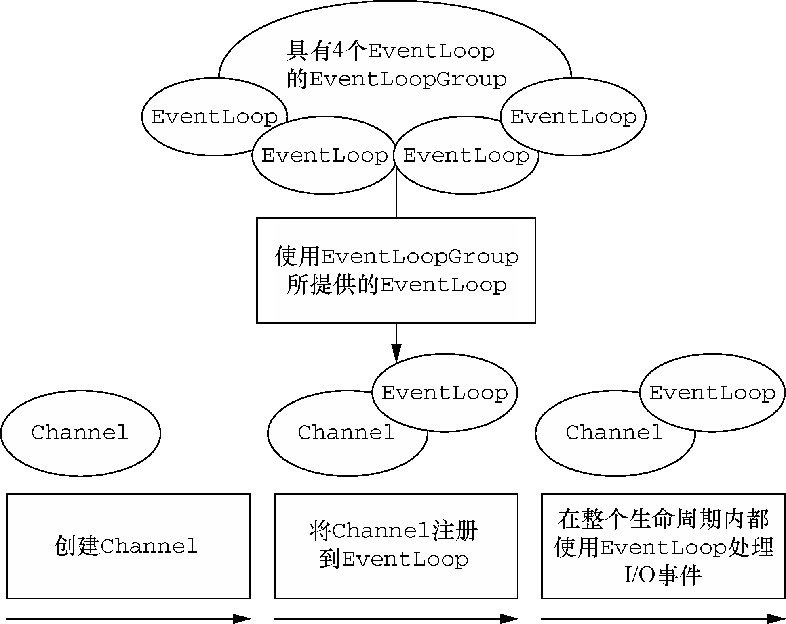

> [Netty实战.pdf](../resources/static/doc/Netty实战.pdf)  
> [github:netty](https://github.com/netty/netty)  

# Netty

Netty是一个异步事件驱动的Java网络应用框架。主要用于开发高性能、高可靠性的网络服务器和客户端。

- 异步通信
- 事件驱动

## Netty特点
- 设计
    - 统一的API，支持多种传输类型，阻塞的和非阻塞的
    - 简单而强大的线程模型
    - 真正的无连接数据报套接字支持
    - 链接逻辑组件以支持复用
- 易于使用
    - 详实的Javadoc和大量的示例集
    - 不需要超过JDK 1.6+③的依赖。（一些可选的特性可能需要Java 1.7+和/或额外的依赖）
- 性能
    - 拥有比Java的核心API更高的吞吐量以及更低的延迟
    - 得益于池化和复用，拥有更低的资源消耗
    - 最少的内存复制
- 健壮性
    - 不会因为慢速、快速或者超载的连接而导致OutOfMemoryError
    - 消除在高速网络中NIO应用程序常见的不公平读/写比率
- 安全性
    - 完整的SSL/TLS以及StartTLS支持
    - 可用于受限环境下，如Applet和OSGI
- 社区驱动
    - 发布快速而且频繁
  

## Netty核心组件

### Channel
Channel 是 Java NIO 的一个基本构造。

它代表一个到实体（如一个硬件设备、一个文件、一个网络套接字或者一个能够执行一个或者多个不同的I/O操作的程序组件）的开放连接，如读操作和写操作。

可以把 Channel 看作是传入（入站）或者传出（出站）数据的载体。因此，它可以被打开或者被关闭，连接或者断开连接。

### 回调
一个回调其实就是一个方法，一个指向已经被提供给另外一个方法的方法的引用。这使得后者可以在适当的时候调用前者。

Netty 在内部使用了回调来处理事件；
当一个回调被触发时，相关的事件可以被一个interface：`ChannelHandler` 的实现处理。

### Future
Future 提供了另一种在操作完成时通知应用程序的方式。这个对象可以看作是一个异步操作的结果的占位符；它将在未来的某个时刻完成，并提供对其结果的访问。

JDK 内置的Future所提供的实现，只允许手动检查对应的操作是否已经完成，或者一直阻塞直到它完成。这是非常繁琐的，所以 Netty 提供了它自己的实现：`ChannelFuture`，用于在执行异步操作的时候使用。

ChannelFuture提供了几种额外的方法能够注册一个或者多个ChannelFutureListener实例。
监听器的回调方法operationComplete()，将会在对应的操作完成时被调用。
然后监听器可以判断该操作是成功地完成了还是出错了。如果是后者，可以检索产生的Throwable。
简而言之，由ChannelFutureListener提供的通知机制消除了手动检查对应的操作是否完成的必要。

每个 Netty 的出站 I/O 操作都将返回一个 ChannelFuture；它们都不会阻塞。

### 事件和ChannelHandler
Netty 使用不同的事件来通知我们状态的改变或者是操作的状态。
这使得我们能够基于已经发生的事件来触发适当的动作。这些动作可能是：
- 记录日志；
- 数据转换；
- 流控制；
- 应用程序逻辑。

Netty按照入站 或 出站 数据流的相关性进行分类。
- 由入站数据或者相关的状态更改而触发的事件包括：
  - 连接已被激活或者连接失活；
  - 数据读取；
  - 用户事件；
  - 错误事件。
- 出站事件是未来将会触发的某个动作的操作结果，这些动作包括：
  - 打开或者关闭到远程节点的连接；
  - 将数据写到或者冲刷到套接字。

每个事件都可以被分发给 `ChannelHandler` 类中的某个用户实现的方法。

Netty 提供了大量预定义的可以开箱即用的 ChannelHandler 实现，包括用于各种协议（如 HTTP 和 SSL/TLS）的 ChannelHandler。
在内部，ChannelHandler 自己也使用了事件 和 Future，使得它们也成为了应用程序将使用的相同抽象的消费者。

## NettyDemo

### Netty服务器

所有的 Netty 服务器都需要以下两部分：
- 至少一个 ChannelHandler， 该组件实现了服务器对从客户端接收的数据的处理，即它的业务逻辑。
  [NettyServerHandlerDemo.java](https://github.com/Panl99/demo/tree/master/demo-netty/src/main/java/com/lp/demo/netty/netty/base/NettyServerHandlerDemo.java)
- 引导， 这是配置服务器的启动代码。至少，它会将服务器绑定到它要监听连接请求的端口上。
  [NettyServerDemo.java](https://github.com/Panl99/demo/tree/master/demo-netty/src/main/java/com/lp/demo/netty/netty/base/NettyServerDemo.java)

- ChannelHandler，父接口，它的实现负责接收并响应事件通知。
- ChannelInboundHandler 接口，用来定义响应入站事件的方法。
- ChannelInboundHandlerAdapter 默认实现 ChannelInboundHandler。
  - channelRead() — 对于每个传入的消息都要调用；
  - channelReadComplete() — 通知ChannelInboundHandler最后一次对channelRead()的调用是当前批量读取中的最后一条消息；
  - exceptionCaught() — 在读取操作期间，有异常抛出时会调用。
    如果不捕获异常，会发生什么呢？
    每个 Channel 都拥有一个与之相关联的 ChannelPipeline，其持有一个 ChannelHandler 的
    实例链。在默认的情况下，ChannelHandler 会把对它的方法的调用转发给链中的下一个 Channel-
    Handler。因此，如果 exceptionCaught()方法没有被该链中的某处实现，那么所接收的异常将会被
    传递到 ChannelPipeline 的尾端并被记录。为此，你的应用程序应该提供至少有一个实现了
    exceptionCaught()方法的 ChannelHandler。（6.4 节详细地讨论了异常处理）。

引导过程中所需要的步骤如下：
- 创建一个 ServerBootstrap 的实例以引导和绑定服务器；
- 创建并分配一个 NioEventLoopGroup 实例以进行事件的处理，如接受新连接以及读/写数据；
- 指定服务器绑定的本地的 InetSocketAddress；
- 使用一个 EchoServerHandler 的实例初始化每一个新的 Channel；
- 调用 ServerBootstrap.bind()方法以绑定服务器。

### Netty客户端

Netty客户端数据处理器：[NettyClientHandlerDemo.java](https://github.com/Panl99/demo/tree/master/demo-netty/src/main/java/com/lp/demo/netty/netty/base/NettyClientHandlerDemo.java)

Netty客户端引导：[NettyClientDemo.java](https://github.com/Panl99/demo/tree/master/demo-netty/src/main/java/com/lp/demo/netty/netty/base/NettyClientDemo.java)

SimpleChannelInboundHandler 与 ChannelInboundHandler  
为什么我们在客户端使用的是 `SimpleChannelInboundHandler`，服务端使用的 `ChannelInboundHandlerAdapter` 呢？  
这和两个因素的相互作用有关：①业务逻辑如何处理消息；②Netty 如何管理资源。
- 在客户端，当 channelRead0()方法完成时，你已经有了传入消息，并且已经处理完它了。当该方法返回时，SimpleChannelInboundHandler 负责释放指向保存该消息的 ByteBuf 的内存引用。
- 在服务端，你仍然需要将传入消息回送给发送者，而 write()操作是异步的，直到 channelRead()方法返回后可能仍然没有完成。
  
为此，NettyServerHandlerDemo扩展了 ChannelInboundHandlerAdapter，其在这个时间点上不会释放消息。
消息在 NettyServerHandlerDemo 的 channelReadComplete()方法中，当 writeAndFlush()方法被调用时被释放。

## Netty的组件和设计

### Netty网络抽象的代表组件
- `Channel`：Socket；
- `EventLoop`：控制流、多线程处理、并发；
- `ChannelFuture`：异步通知。

**Channel 接口：**
- 基本的 I/O 操作（bind()、connect()、read()和 write()）依赖于底层网络传输所提供的原语。
- 在基于 Java 的网络编程中，其基本的构造是 class Socket。
- Netty 的 Channel 接口所提供的 API，大大地降低了直接使用 Socket 类的复杂性。
- 此外，Channel 也是拥有许多预定义的、专门化实现的广泛类层次结构的根。 （EmbeddedChannel、LocalServerChannel、NioDatagramChannel、NioSctpChannel、NioSocketChannel）

**EventLoop 接口：** 

EventLoop 定义了 Netty 的核心抽象，用于处理连接的生命周期中所发生的事件。

- 一个 EventLoopGroup 包含一个或者多个 EventLoop；
- 一个 EventLoop 在它的生命周期内只和一个 Thread 绑定；
- 所有由 EventLoop 处理的 I/O 事件都将在它专有的 Thread 上被处理；
- 一个 Channel 在它的生命周期内只注册于一个 EventLoop；
- 一个 EventLoop 可能会被分配给一个或多个 Channel。

**ChannelFuture 接口：**

异步的，用于在某个操作完成之后的某个时间点确定其结果的方法。

其 addListener()方法注册了一个 ChannelFutureListener，以便在某个操作完成时（无论是否成功）得到通知。

可以将 ChannelFuture 看作是将来要执行的操作的结果的占位符。
它究竟 什么时候 被执行则可能取决于若干的因素，因此不可能准确地预测，但是可以肯定的是它 将会 被执行。
此外，所有**属于同一个 Channel 的操作都被保证其将以它们被调用的顺序被执行**。

### 管理数据流以及执行应用程序处理逻辑的组件
- `ChannelHandler`：所有处理入站和出站数据的应用程序逻辑的容器。
- `ChannelPipeline`：提供了 ChannelHandler 链的容器，并定义了用于在该链上传播入站和出站事件流的 API。
  当 Channel 被创建时，它会被自动地分配到它专属的 ChannelPipeline。

如果事件的运动方向是从客户端到服务器端，那么我们称这些事件为出站的，反之则称为入站的。

如果一个消息或者任何其他的入站事件被读取，那么它会从 ChannelPipeline 的头部开始流动，并被传递给第一个 ChannelInboundHandler。
这个 ChannelHandler 不一定会实际地修改数据，具体取决于它的具体功能，在这之后，数据将会被传递给链中的下一个 ChannelInboundHandler。
最终，数据将会到达 ChannelPipeline 的尾端，届时，所有处理就都结束了。

数据的出站运动（即正在被写的数据）在概念上也是一样的。在这种情况下，数据将从 ChannelOutboundHandler 链的尾端开始流动，直到它到达链的头部为止。
在这之后，出站数据将会到达网络传输层，这里显示为 Socket。通常情况下，这将触发一个写操作。

在Netty中，有两种发送消息的方式。
- 直接写到Channel中，这种方式将会导致消息从ChannelPipeline 的尾端开始流动，
- 写到和ChannelHandler相关联的ChannelHandlerContext对象中，这种方式将导致消息从 ChannelPipeline 中的下一个 ChannelHandler 开始流动。

Netty 以适配器类的形式提供了大量默认的 ChannelHandler 实现，其旨在简化应用程序处理逻辑的开发过程。

为什么需要适配器类？  
有一些适配器类可以将编写自定义的 ChannelHandler 所需要的努力降到最低限度，因为它们提供了定义在对应接口中的所有方法的默认实现。  
下面这些是编写自定义 ChannelHandler 时经常会用到的适配器类：  
- ChannelHandlerAdapter
- ChannelInboundHandlerAdapter
- ChannelOutboundHandlerAdapter
- ChannelDuplexHandler

### 编解码器
当通过 Netty 发送或者接收一个消息的时候，就将会发生一次数据转换。
- 入站消息，会被从字节解码转换为另一种格式，通常是一个 Java 对象。
- 出站消息，将从它的当前格式被编码为字节。

对应于特定的需要，Netty 为编码器和解码器提供了不同类型的抽象类。
可以将消息转为一种中间格式，而不是字节。

所有由 Netty 提供的编码器/解码器适配器类都实现了 ChannelOutboundHandler 或者 ChannelInboundHandler 接口。
- 对于入站数据来说，channelRead 方法/事件已经被重写了。
  对于每个从入站Channel 读取的消息，这个方法都将会被调用。随后，它将调用由预置解码器所提供的 decode()方法，并将已解码的字节转发给 ChannelPipeline 中的下一个 ChannelInboundHandler。
- 出站消息的模式是相反方向的：编码器将消息转换为字节，并将它们转发给下一个ChannelOutboundHandler。

### 引导
Netty 的引导类为应用程序的网络层配置提供了容器，这涉及将一个进程绑定到某个指定的端口（引导一个服务器，ServerBootstrap），
或者将一个进程连接到另一个运行在某个指定主机的指定端口上的进程（引导一个客户端，Bootstrap）。

