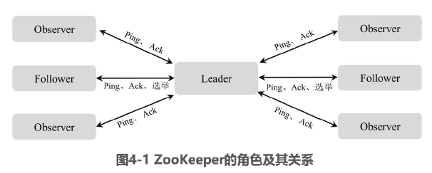

# 目录
- [ZooKeeper](#ZooKeeper)
- [ZooKeeper选举机制](#ZooKeeper选举机制)
- [ZooKeeper监听原理](#ZooKeeper监听原理)
- [ZooKeeper分布式锁](#ZooKeeper分布式锁)
- [ZooKeeper部署方式](#ZooKeeper部署方式)
- [ZooKeeper常用命令](#ZooKeeper常用命令)

# ZooKeeper
- ZooKeeper是一个分布式协调服务，设计初衷是为分布式软件提供一致性服务。
- ZooKeeper提供一个类似Linux文件系统的树形结构，ZooKeeper的每个节点既可以是目录，也可以是数据，同时，ZooKeeper提供对每个节点的监控和通知机制。
- 基于ZooKeeper的一致性服务，可以实现：分布式锁、分布式选举、服务发现与监控、配置中心等功能。

## ZooKeeper的角色
- **Leader**：集群主节点，负责管理集群状态和接收用户的写请求。
    - 一个

- **Follower**：集群从节点，负责集群选举投票和接收用户的读请求。

- **Observer**：与Follower类似，只是没有投票权，主要用于分担Follower的读请求，降低集群负载

[目录](#目录)

# ZooKeeper选举机制
1. 每个Server启动后都询问其他Server给谁投票，其他Server根据自己的状态回复自己推荐的Leader并返回对应的Leader id和Zxid。
    - 集群初次启动时，每个Server都会推荐自己成为Leader。
2. 当Server收到所有其他Server的回复后，计算出Zxid最大的Server，并将该Server设置成下一次要投票推荐的Server。
3. 计算过程中，票数最多的Server将成为获胜者，如果获胜者的票数超过集群总数的一半，则该Server将被推选为Leader。否则继续投票，直到选出Leader。
4. Leader等待其他Server的连接。
5. Follower连接Leader，将最大的Zxid发送给Leader。
6. Leader根据Follower的Zxid确定同步点，至此，选举完成。
    - 选举完成后，Leader通知其他Follower集群已经成为Uptodate状态，Follower收到Uptodate消息后，接收Client的请求并对外提供服务。

# ZooKeeper监听原理
1. 首先要有一个`main()`线程；
2. 在main线程中创建ZooKeeper客户端，这时就会创建两个线程，一个负责网络连接通信(connect)，一个负责监听(listener)；
3. 通过connect线程将注册的监听事件发送给ZooKeeper。
4. 在ZooKeeper的注册监听器列表中将注册的监听事件添加到列表中；
5. ZooKeeper监听到有数据 或者路径变化，就会将这个消息发送给listener线程；
6. listener线程内部调用了process()方法。

# ZooKeeper分布式锁

[目录](#目录)

# ZooKeeper部署方式

# ZooKeeper常用命令

[目录](#目录)