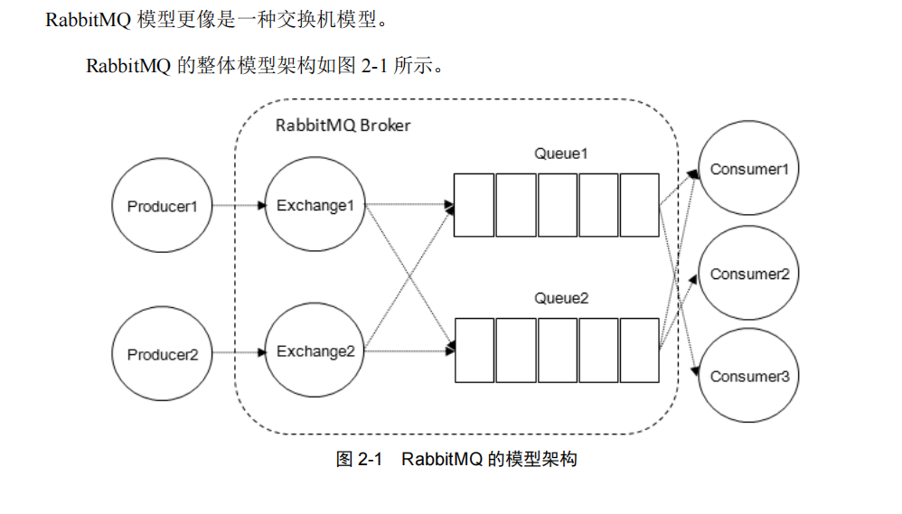

# RabbitMQ概述

## 消息队列

消息队列传递消息一般有两种方式：

1. 点对点模式（P2P）：基于队列，生产者发送消息到队列，消费者从队列接收消息。一对一关系。
2. 发布/订阅模式（Pub/Sub）：发布者发布消息到主题（topic），消息订阅者从主题订阅消息。一对多关系。

消息中间件的作用：

1. **解耦**，应用程序之间不直接通信，而是基于存储和转发的应用程序之间的异步数据发送。可以使开发人员无需了解RPC 和网络通信协议的细节。
2. **存储**，面对数据处理失败，可以将数据持久化到最终处理成功。规避数据丢失风险。
3. **扩展性**，消息中间件解耦了应用的处理过程，只要另外增加处理过程 就可以提高消息入队和处理效率，无需修改代码、调节参数等。
4. **削峰**，可以处理因访问量突增导致的访问压力。
5. **可恢复性**，消息中间件降低进程间的耦合度，即使有处理消息的进程挂掉，加入的消息也可在系统回复后进行处理。
6. **顺序保证**，支持消息处理的顺序。
7. **缓冲**，可通过缓冲层控制消息处理的速度。
8. **异步通信**，消息中间件的异步处理机制，可以控制消息的处理时间。

## RabbitMQ简介

RabbitMQ是采用Erlang语言实现[AMQP](#AMQP)的消息中间件。

起源于金融系统，用于在分布式系统中存储转发消息。

## RabbitMQ特点

1. **高可靠**：使用持久化、传输确认、发布确认...等机制来保证可靠性。

2. **易扩展**：多个RabbitMQ可组成一个集群，可动态扩展集群中的节点。

3. **高可用**：队列可以在集群中的机器上设置镜像，使得在部分节点出现问题的情况下队列仍然可用。
4. **路由灵活**：在消息进入队列之前，通过交换器来路由消息。
   - 对于典型的路由功能，RabbitMQ 己经提供了一些内置的交换器来实现。
   - 针对更复杂的路由功能，可以将多个交换器绑定在一起， 也可以通过插件机制来实现自己的交换器。
5. **多协议支持**：原生支持AMQP 协议，还支持STOMP , MQTT 等多种消息中间件协议。
6. **功能特性丰富**：
   - 支持多种语言：Java、Python、PHP...等
   - 提供管理界面：可以监控、管理消息和集群中的节点等
   - 丰富的插件：提供许多插件来扩展RabbitMQ功能，支持自定义插件。

## RabbitMQ基本概念

1. server：又称broker，接收客户端连接，实现AMQP实体服务。
2. connection：和具体broker网络连接：
   - 无论是生产者还是消费者，都需要和 RabbitMQ Broker 建立连接，这个连接就是一条 TCP 连接，也就是Connection。  
   - 一旦 TCP 连接建立起来，客户端紧接着可以创建一个 AMQP 信道（Channel），每个信道都会被指派一个唯一的 ID。信道是建立在 Connection 之上的虚拟连接，RabbitMQ 处理的每条 AMQP 指令都是通过信道完成的。
3. channel：网络通道，基本上所有操作都在channel中进行，channel是消息读写的通道，每个channel表示一个会话任务，客户端可以建立多个channel。  
   - [可以直接使用Connection就能完成信道的工作，为什么还要引入信道呢？](#可以直接使用Connection就能完成信道的工作，为什么还要引入信道呢？)
4. message：消息，服务器和应用之间传递的数据。
   - 由properties和body组成。
   - properties可以对消息进行修饰，比如：消息的优先级，延迟等特性。
   - body是消息的实体内容。
5. Virtual host：虚拟主机，用于逻辑隔离，最上层消息的路由。一个Virtual host可以包含多个Exchange和Queue，同一个Virtual host下Exchange和Queue名字唯一。
6. **Exchange**：交换机，生产者发送消息到交换机，交换机根据路由键转发消息到一个或多个绑定的队列。  
   - 交换机有4种类型：
      - fanout：该类型的交换器不关心BindingKey，会将所有发送到该交换器的消息路由到所有与该交换器绑定的队列中。
      - direct：把消息路由到绑定键(BindingKey) 跟 路由键(RoutingKey)相同的队列中。（完全匹配）
      - topic：把消息路由到绑定键(BindingKey) 跟 路由键(RoutingKey)匹配的队列中。（模糊匹配）
        - 绑定键(BindingKey) 和 路由键(RoutingKey)使用点号`.`分隔字符串。
        - 绑定键(BindingKey)中，`*`匹配一个单词；`#`匹配多个单词(也可以是0个)。
      - headers：根据发送消息内容中的headers属性匹配路由。（性能差，不实用）
   
   - [为什么不直接将消息路由到队列，要一个交换机来转发呢？](#为什么不直接将消息路由到队列，要一个交换机来转发呢？)
7. **Banding**：绑定，将交换机和队列关联起来，绑定时指定一个绑定键BindingKey，绑定键跟路由键匹配时消息会被路由到队列。（通常情况下，绑定键就是路由键）
8. **RoutingKey**：路由键，生产者将消息发送给交换机时指定，指定消息的路由规则，RoutingKey 需要与交换器类型和绑定键（BindingKey）联合使用才能最终生效，虚拟机根据它来确定如何路由一条消息。
9. **Queue**：消息队列，用于存储消息。
   - RabbitMQ 中消息都只能存储在队列中。
   - 这一点和 Kafka 这种消息中间件相反。Kafka 将消息存储在 topic（主题）这个逻辑层面，而相对应的队列逻辑只是 topic 实际存储文件中的位移标识。

大多数时候，包括官方文档和 RabbitMQ Java API 中都把 BindingKey 和 RoutingKey 看作 RoutingKey，为了避免混淆，可以这么理解：
- 在使用绑定的时候，其中需要的路由键是 BindingKey。涉及的客户端方法如：
   - channel.exchangeBind，对应的 AMQP 命令为 Exchange.Bind
   - channel.queueBind，对应的 AMQP 命令为 Queue.Bind
- 在发送消息的时候，其中需要的路由键是 RoutingKey。涉及的客户端方法如：
   - channel.basicPublish，对应的 AMQP 命令为 Basic.Publish

由于某些历史的原因，包括现存能搜集到的资料显示：大多数情况下习惯性地将 BindingKey 写成 RoutingKey，尤其是在使用 direct 类型的交换器的时候。

Rabbitmq模型架构：

## RabbitMQ运转流程

### 生产者发送消息过程

1. 生产者连接到 RabbitMQ Broker，建立一个连接（Connection），开启一个信道（Channel）。
2. 生产者声明一个交换器，并设置相关属性，比如交换机类型、是否持久化等。
3. 生产者声明一个队列并设置相关属性，比如是否排他、是否持久化、是否自动删除等 。
4. 生产者通过路由键将交换器和队列绑定起来。
5. 生产者发送消息至 RabbitMQ Broker，其中包含路由键、交换器等信息。
6. 相应的交换器根据接收到的路由键查找相匹配的队列。
7. 如果找到，则将从生产者发送过来的消息存入相应的队列中。
8. 如果没有找到，则根据生产者配置的属性选择丢弃还是回退给生产者。
9. 关闭信道。
10. 关闭连接。

### 消费者接收消息过程

1. 消费者连接到 RabbitMQ Broker，建立一个连接（Connection），开启一个信道（Channel）。
2. 消费者向 RabbitMQ Broker 请求消费相应队列中的消息，可能会设置相应的回调函数，以及做一些准备工作。
3. 等待 RabbitMQ Broker 回应并投递相应队列中的消息，消费者接收消息。
4. 消费者确认（ack）接收到的消息。
5. RabbitMQ 从队列中删除相应已经被确认的消息。
6. 关闭信道。
7. 关闭连接。

## 死信队列

[https://www.jianshu.com/p/986ee5eb78bc](https://www.jianshu.com/p/986ee5eb78bc)

- 死信队列：DLX（`dead-letter-exchange`）

- 利用DLX，当消息在一个队列中变成死信 `(dead message)` 之后，它能被重新publish到另一个Exchange，这个Exchange就是DLX

**消息变成死信的情况**：

- 消息被拒绝(basic.reject / basic.nack)，并且requeue = false
- 消息TTL过期
- 队列达到最大长度

## AMQP

Advanced Message Queuing Protocol ，高级消息队列协议

# RabbitMQ使用

## RabbitMQ安装

## RabbitMQ实战

### [RabbitMQ消费模式：推模式(Push)、拉模式(Pull)](https://blog.csdn.net/u011709538/article/details/131404741)

### [RabbitMQ的6种消息模式 + 消息补偿消息幂等](https://www.jianshu.com/p/5aba0843345d)

# RabbitMQ原理

## RabbitMQ源码分析

## RabbitMQ模块原理

## 疑问

### 为什么不直接将消息路由到队列，要一个交换机来转发呢？

AMQP 协议中的核心思想就是生产者和消费者的解耦，生产者从不直接将消息发送给队列。生产者通常不知道是否一个消息会被发送到队列中，只是将消息发送到一个交换机。先由 Exchange 来接收，然后 Exchange 按照特定的策略转发到 Queue 进行存储。Exchange 就类似于一个交换机，将各个消息分发到相应的队列中。

在实际应用中我们只需要定义好 Exchange 的路由策略，而生产者则不需要关心消息会发送到哪个 Queue 或被哪些 Consumer 消费。在这种模式下**生产者只面向 Exchange 发布消息，消费者只面向 Queue 消费消息**，Exchange 定义了消息路由到 Queue 的规则，将各个层面的消息传递隔离开，使每一层只需要关心自己面向的下一层，降低了整体的耦合度。

### 可以直接使用Connection就能完成信道的工作，为什么还要引入信道呢？

一个场景中，一个应用程序中有很多个线程需要从 RabbitMQ 中消费消息，或者生产消息，那么必然需要建立很多个 Connection，也就是许多个 TCP 连接。

然而对于操作系统而言，建立和销毁 TCP 连接是非常昂贵的开销，如果遇到使用高峰，性能瓶颈也随之显现。

RabbitMQ 采用类似 NIO（Non-blocking I/O）的做法，选择 TCP 连接复用，不仅可以减少性能开销，同时也便于管理。

每个线程把持一个信道，所以信道复用了 Connection 的 TCP 连接。
同时 RabbitMQ 可以确保每个线程的私密性，就像拥有独立的连接一样。当每个信道的流量不是很大时，复用单一的 Connection 可以在产生性能瓶颈的情况下有效地节省 TCP 连接资源。但是当信道本身的流量很大时，这时候多个信道复用一个 Connection 就会产生性能瓶颈，进而使整体的流量被限制了。
此时就需要开辟多个 Connection，将这些信道均摊到这些 Connection 中，至于这些相关的调优策略需要根据业务自身的实际情况进行调节。

# RabbitMQ优化

## RabbitMQ参数优化

并发数 = CPU核数 * （x+y）/x，其中x是线程执行时间，y是阻塞等待时间

## RabbitMQ二次开发

