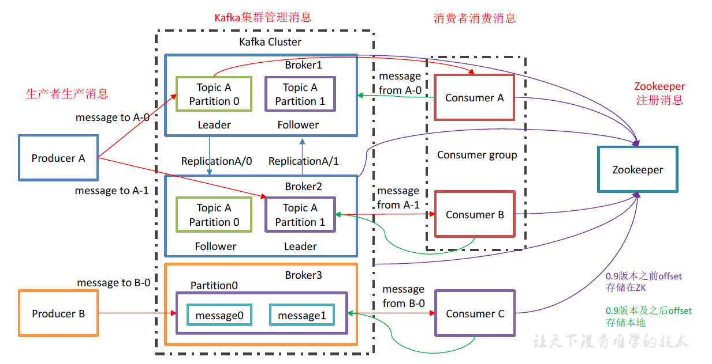

> [官方文档](https://kafka.apache.org/documentation/)

# 目录
- [Kafka概述](#Kafka概述)
    - [Kafka特点](#Kafka特点)
- [Kafka安装](#Kafka安装)
    - [Broker配置](#Broker配置)
    - [kafka集群](#kafka集群)
- [kafka生产者](#Kafka生产者)
    - [消息发送流程](#消息发送流程)
    - [创建kafka生产者](#创建kafka生产者)
    - [发送消息到kafka](#发送消息到kafka)
    - [生产者配置](#生产者配置)
    - [序列化器](#序列化器)
        - [自定义序列化器](#自定义序列化器)
        - [其它序列化框架](#其它序列化框架)
    - [分区](#分区)
        - [自定义分区](#自定义分区)
- [kafka消费者](#Kafka消费者)
    - [创建Kafka消费者](#创建Kafka消费者)
        - [消息轮询请求数据](#消息轮询请求数据)
    - [消费者的配置](#消费者的配置)
    - [提交和偏移量](#提交和偏移量)
    - [再均衡监听器](#再均衡监听器)
    - [退出](#退出)
    - [反序列化器](#反序列化器)
    - [独立消费者(没有群组的消费者)](#独立消费者(没有群组的消费者))

- [事务](#事务)
    - [消息传输保障](#消息传输保障)
    - [幂等](#幂等)
    - [事务实现-TODO](#事务实现)

- [Kafka常见问题](#Kafka常见问题)
    - [Kafka应用场景有哪些？](#Kafka应用场景有哪些？)
    - [Kafka与其他消息队列比较有哪些优势？](#Kafka与其他消息队列比较有哪些优势？)
    - [Kafka消息模型？](#Kafka消息模型？)
    - [Kafka多副本机制？](#Kafka多副本机制？)
    - [Zookeeper在Kafka中的作用？](#Zookeeper在Kafka中的作用？)
    - [Kafka如何保证消息的消费顺序？](#Kafka如何保证消息的消费顺序？)
    - [Kafka如何保证消息不丢失？](#Kafka如何保证消息不丢失？)
    - [Kafka如何保证消息不重复消费？](#Kafka如何保证消息不重复消费？)


[返回目录](#目录)

# Kafka概述
- 一个高性能的发布-订阅消息系统。  
- 一个典型的Kafka体系架构包含：若干Producer、若干Broker、若干Consumer、一个Zookeeper集群。
    - `Zookeeper`：负责kafka集群元数据管理、控制器选举等操作。
    - `Producer`将消息发送到`Broker`，`Broker`将收到的消息存储到磁盘，`Consumer`从`Broker`订阅并消费消息。

- `Producer`：生产者，负责生产消息，然后发送到Kafka中。
- `Consumer`：消费者，从Kafka中接收消息，进行处理。
    - `Consumer Group`（CG）：消费者组，由多个consumer 组成。
    - 消费者组内每个消费者负责消费不同分区的数据，一个分区只能由一个组内消费者消费；消费者组之间互不影响。
    - 所有的消费者都属于某个消费者组，即消费者组是逻辑上的一个订阅者。
- `Broker`：服务代理节点，即一个kafka服务器就是一个`broker`。
    - `Broker` 接收来自生产者的消息，为消息设置偏移量，并提交消息到磁盘保存。
    - `Broker` 为消费者提供服务，对读取分区的请求作出响应，返回已经提交到磁盘上的消息。
- `Topic`：主题，表示一类消息。Kafka中消息以主题为单位归类，生产者将消息发送到特定主题，消费者订阅主题并消费。
- `Partition`：分区，`Topic`可以分为多个`Partition`，一个`Partition`只属于一个`Topic`。同一主题下的不同分区消息不同。
- `Replica`：副本，为保证集群中的某个节点发生故障时，该节点上的`Partition`数据不丢失，且kafka仍然能够继续工作， kafka提供了副本机制，一个 topic的每个分区都有若干个副本，一个 leader和若干个 follower。
- `Offset`：偏移量，是消息在分区中唯一标识，Kafka通过偏移量保证消息在分区中的顺序性。
- `leader` 每个分区多个副本的“主”，生产者发送数据的对象，以及消费者消费数据的对象都是 leader。
- `follower` 每个分区多个副本中的“从”，实时从 leader中同步数据，保持和 leader数据的同步。 leader发生故障时，某个 follower会成为新的 follower。



[返回目录](#目录)

## Kafka特点
- **支持多个生产者**：适合从多个前端系统收集数据，并以统一的格式对外提供数据。
- **支持多个消费者**：支持多个消费者从一个单独的消息流上读取数据，且消费者之间互不影响。（其他队列系统的消息一旦被一个客户端读取，其他客户端就无法在读取它）
- **可持久化数据，实现非实时地读取消息**：kafka根据主题设置保留规则，将数据保存到磁盘。消费者可从上次处理中断的地方继续处理消息。
- **可伸缩性**：kafka具有灵活的伸缩性，对在线集群进行扩展不会影响整体系统的可用性。
- **高性能**：通过横向扩展生产者、消费者、broker，kafka可以轻松的处理巨大的消息流。且能保证亚秒级的消息延迟。

[返回目录](#目录)

# Kafka安装
- **选择系统**：Linux
- **安装Java**：/usr/java/jdk1.8.0_51
- **安装Zookeeper**：kafka使用zookeeper保存集群的元数据信息和消费者信息。（kafka发行版自带zookeeper，可直接从脚本启动）  
- **单机版**：  
  
- **zookeeper集群**：  

- **安装Kafka Broker**  


- [kafka集群部署](#kafka集群部署)

[返回目录](#目录)

## Broker配置
- **常规配置**：
    - **`broker.id`**：可设为任意整数，默认0，在kafka集群中唯一，建议设置成与机器名相关的整数便于维护。  
    - **`port`**：默认9092端口，可设置为其他可用的端口（注意：若设为1024以下端口，需使用root权限启动kafka，不建议）  
    - **`zookeeper.connect`**：指定保存broker元数据的zookeeper地址。（如localhost:2181 表示zookeeper运行在本地2181端口上），参数格式：hostname:port/path，hostname表示zookeeper服务器的机器名或IP地址；port表示zookeeper客户端连接端口；/path表示可选的zookeeper路径，作为集群的chroot环境，若不指定默认为根路径。  
    - **`log.dirs`**：消息日志目录。用逗号分隔的本地文件系统路径。如果指定多个路径，broker会根据“最少使用”原则把同一分区的日志片段保存在同一路径下。  
    - **`num.recovery.threads.per.data.dir`**：配置线程池处理日志，用于如下情况：  
        - 服务器正常启动，用于打开每个分区的日志片段；  
        - 服务器崩溃后重启，用于检查和截断每个分区的日志片段；  
        - 服务器正常关闭，用于关闭日志片段。  
        - 注意：举例：若此参数设为8，log.dir指定了3个路径，则总共需要24个线程。  
    - **`auto.create.topics.enable`**：自动创建主题（设为true），用于如下情况：  
        - 当一个生产者开始往主题写入消息时；  
        - 当一个消费者开始从主题读取消息时；  
        - 当任一个客户端向主题发送元数据请求时。  
        - 若显式创建主题（手动或其他配置），可将此参数设为false。

- **主题的默认配置**  
新版本kafka需要使用管理工具对默认参数进行重置。  
    - **`num.partitions`**：主题包含的分区数。默认是1，可以增加主题分区数量，但不能减少。可以估算出主题吞吐量和消费者吞吐量，用主题吞吐量除以消费者吞吐量来计算分区个数。  
    - **`log.retention.ms`**：消息保留时间。
        - 默认**`log.retention.hours`配置时间**，默认168小时（即一周）
        - 还有`log.retention.minutes`。  
    - **`log.retention.bytes`**：消息保留大小。作用于每个分区（如设置为1GB，有8个分区，则可以保留8GB数据）  
    - **`log.segment.bytes`**：日志片段关闭大小，关闭后重新创建新的日志片段。  
    - **`log.segment.ms`**：日志片段关闭时间。  
    - **`message.max.bytes`**：单个消息大小（压缩后）。默认1000000（即1MB），超过后消息丢失且返回错误。  

[返回目录](#目录)

## Kafka集群
- 跨服务器进行负载均衡 
- 可以使用复制功能避免单节点故障造成数据丢失

**Kafka集群部署：**
1. 解压安装包：`software]$ tar -zxvf kafka_2.11-0.11.0.0.tgz -C /opt/module/`
2. 修改解压后文件名称：`module]$ mv kafka_2.11-0.11.0.0/ kafka`
3. 在`/opt/module/kafka`目录下 创建`logs`文件夹：`kafka]$ mkdir logs`
4. 修改配置文件：`config]$ vim server.properties`
    ```properties
    #broker 的 全局唯一编号，不能重复
    broker.id=0
    #删除 topic 功能使能
    delete.topic.enable=true
    #处理网络请求 的 线程数量
    num.network.threads=3
    #用来 处理磁盘 IO 的现成数量
    num.io.threads=8
    #发送套接字的缓冲区大小
    socket.send.buffer.bytes=102400
    #接收套接字的缓冲区大小
    socket.receive.buffer.bytes=102400
    #请求套接字的缓冲区大小
    socket.request.max.bytes=104857600
    #kafka 运行日志存放的路径
    log.dirs=/opt/module/kafka/logs
    #topic 在当前 broker 上的分区个数
    num.partitions=1
    #用来恢复和清理 data 下数据的线程数量
    num.recovery.threads.per.data.dir=1
    #segment 文件保留的最长时间，超时将被删除
    log.retention.hours=168
    #配置连接 Zookeeper 集群 地址
    zookeeper.connect=hadoop102:2181,hadoop103:2181,hadoop104:21 81
    ```
5. 配置环境变量：`module]$ sudo vim /etc/profile`
    ```properties
    #KAFKA_HOME
    export KAFKA_HOME=/opt/module/kafka
    export PATH=$PATH:$KAFKA_HOME/bin
    ```
   `module]$ source /etc/profile`
6. 分发安装包：`module]$ xsync kafka/` 注意：分发后要修改其他机器的环境变量。
7. 分别在 hadoop103和 hadoop104上修改 配置文件 `/opt/module/kafka/config/server.properties`中 的 `broker.id=1`、 `broker.id=2`
    - 注: broker.id不得 重复
8. 启动集群：依次在hadoop102、 hadoop103、 hadoop104节点上启动 kafka  
    `[atguigu@hadoop102 kafka]$ bin/kafka-server-start.sh -daemon config/server.properties`  
    `[atguigu@hadoop103 kafka]$ bin/kafka-server-start.sh -daemon config/server.properties`  
    `[atguigu@hadoop104 kafka]$ bin/kafka-server-start.sh -daemon config/server.properties`  
9. 关闭集群：  
    `[atguigu@hadoop102 kafka]$ bin/kafka-server-stop.sh`  
    `[atguigu@hadoop103 kafka]$ bin/kafka-server-stop.sh`  
    `[atguigu@hadoop104 kafka]$ bin/kafka-server-stop.sh`  
10. kafka群起脚本：
```shell script
#!/bin/bash
for i in hadoop102 hadoop103 hadoop104
do
  echo "========== $i =========="
  ssh $i '/opt/module/kafka/bin/kafka-server-start.sh -daemon /opt/module/kafka/config/server.properties'
done
```

**配置Kafka集群注意：**
- **需要`broker`数量**：影响因素：  
    - 需要多少磁盘空间保留数据，以及单个broker有多少空间可用；  
    - 集群处理请求的能力。
- **`broker`配置**：broker加集群需要配置两个参数：  
    - 所有`broker`配置相同的`zookeeper.connect`，该参数指定保存元数据的zookeeper群组和路径；  
    - 每个`broker`设置唯一`broker.id`。
- **操作系统调优**：  
    - **虚拟内存**：  
    - **磁盘**：  
    - **网络**：

[返回目录](#目录)

# Kafka生产者
## 消息发送流程
- 创建一个ProducerRecord对象，包含topic和消息内容（还可指定键和分区）；
- 序列化器对键和值对象进行序列化，然后发送ProducerRecord对象到分区器；
- 如果在第1步指定了分区，则直接返回分区；如果未指定分区，分区器会根据ProducerRecord对象的键指定一个分区；
- 消息被加到一个记录批次中，这个批次的所有消息会被发送到相同的主题和分区；
- 有一个独立的线程负责将这些记录批次发送到broker上；
- broker收到消息返回一个响应，写入成功返回一个RecordMetaData对象（包含topic、分区信息、消息在分区中的偏移量），写入失败返回一个错误，生产者收到错误后会重新发送，如果接连失败将会返回错误信息。


[返回目录](#目录)

## 创建kafka生产者
- kafka生产者3个必选属性:
    - **`bootstrap.servers`**：指定broker的地址清单（地址格式：host:port）。  
    不必包含所有broker地址，生产者会从给定的broker中查找其他broker信息，建议至少设置两个（其中一个宕机不会影响生产者继续连接到集群）。
    - **`key.serializer`**：指定一个实现`org.apache.kafka.common.serialization.Serializer`接口的类，该类会将键对象序列化成字节数组。kafka客户端默认提供：`ByteArraySerializer`、`StringSerializer`、`IntegerSerializer`。
    - **`value.serializer`**：指定的类会将值序列化。
```
//创建一个属性对象
private Properties kafkaProps = new Properties();
//设置broker地址
kafkaProps.put("bootstrap.servers", "broker1:9092,broker2:9092");
//设置键、值的序列化类
kafkaProps.put("key.serializer", "org.apache.kafka.common.serialization.StringSerializer");
kafkaProps.put("value.serializer", "org.apache.kafka.common.serialization.StringSerializer");
//创建一个生产者对象，为键、值设置类型为String，将属性对象传给进去。
producer = new KafkaProducer<String, String>(kafkaProps);
```

[返回目录](#目录)

## 发送消息到kafka
发送消息的三种方式:  
- **发送并忘记（fire-and-forget）**：将消息发送给服务器，但不关心它是否正常到达。（一般消息会正常到达，因为kafka高可用，且生产者有重试机制。偶尔会丢失消息）
    ```java
    //创建一个ProducerRecord对象，指定topic、键、值。（键、值类型要和序列化器以及生产者对象一直）
    ProducerRecord<String, String> record = new ProducerRecord<> ("CustomerCountry", "Precision Products", "France");
    try {
        //调用生产者的send()方法发送。消息会先被放进缓存，然后使用单独线程发送到服务端。
         producer.send(record);
    } catch (Exception e) {
        //打印堆栈信息可以知道发送消息前是否有异常，如SerializationException（序列化消息失败）、BufferExhaustedException或TimeoutException（缓冲区已满）、InterruptException（发送线程被中断）
        e.printStackTrace();
    }
    ```

- **同步发送**：使用send()方法发送会返回一个Future对象，调用其get()方法等待就可知道消息是否发送成功。
    ```java
    ProducerRecord<String, String> record = new ProducerRecord<> ("CustomerCountry", "Precision Products", "France");
    try {
        //调用get()方法等待kafka响应，如果服务器返回错误，get()方法会抛异常；没错会返回RecordMetadata对象（可以用它获取消息的偏移量）。
         producer.send(record).get();
    } catch (Exception e) {
        e.printStackTrace();
    }
    ```

- **异步发送**：调用send()方法发送消息，并指定一个回调函数，服务器在返回响应时调用该函数。
    ```java
    //创建一个回调类和方法
    private class DemoProducerCallback implements Callback {
        @Override
        public void onCompletion(RecordMetadata recordMetadata, Exception e) {
            if (e != null) {
                e.printStackTrace();
            }
        }
    }
    ProducerRecord<String, String> record = new ProducerRecord<> ("CustomerCountry", "Precision Products", "France");
    //发送消息，并传入回调对象
    producer.send(record, new DemoProducerCallback());
    ```

[返回目录](#目录)

## 生产者配置
生产者的其他配置参数：  
- **`acks`**：指定必须有多少个分区副本收到消息，生产者才会认为消息写入成功。  
    - **`asks=0`**，生产者不知道服务器有没有收到消息，不会等待服务器响应，因此吞吐量较大。
    - **`asks=1`**，集群leader节点收到消息会返回成功，若leader节点挂掉会返回错误。
    - **`asks=all`**，所有参与复制的节点收到消息才会返回成功。这种模式最安全，但延迟高。
- **`buffer.memory`**：指定生产者内存缓冲区大小，生产者用来缓冲要发到服务器的消息。
- **`compression.type`**：指定消息发送给broker之前使用的压缩方法。默认不压缩。
    - 可以设置为**snappy（占cpu少，较好的性能和压缩比）、gzip（占cpu大，更高的压缩比）、lz4**。
- **`retries`**：指定生产者重发消息次数。
    - **`retry.backoff.ms`**可设置重试间隔（默认100ms）。
- **`batch.size`**：指定一个批次占内存大小（大小指字节数非消息数。多个消息被发往同一分区，生产者会将他们放在同一批次中）。批次被填满，所有消息就会被发送，但生产者不一定都会等批次填满才发送消息。
- **`linger.ms`**：指定发送批次之前等待更多消息加入批次的时间（KafkaProducer会在批次填满或linger.ms达到上限时将消息发送出去）。
- **`client.id`**：任意字符串，服务器通过它识别消息来源。
- **`max.in.flight.requests.per.connection`**：指定生产者在收到服务器响应前能发送多少消息。值越高，占内存越高，但吞吐量会提升，设为1可以保证往服务器写消息的顺序跟发送的顺序一致。
- **`timeout.ms`**：指定broker等待同步副本返回消息确认的时间，与**asks**的配置对应。
- **`request.timeout.ms`**：指定生产者在发送数据时等待服务器返回响应的时间。
- **`metadata.fetch.timeout.ms`**：指定生产者在获取元数据时等待服务器返回响应的时间。
- **`max.block.ms`**：指定在调用send()方法或使用partitionsFor()方法获取元数据时 生产者的阻塞时间。（当生产者缓冲区已满、或者没有可用的元数据时，这些方法会阻塞，达到阻塞时间会抛超时异常）。
- **`max.request.size`**：指定生产者发送的请求大小。
- **`receive.buffer.bytes`**：指定TCP socket接收数据包的缓冲区大小。
- **`send.buffer.bytes`**：指定TCP socket发送数据包的缓冲区大小。

[返回目录](#目录)

## 序列化器
### 自定义序列化器
```java
//创建一个客户类
public class Customer {
    private int customerId;
    private String customerName;
    
    public Customer(int id, String name) {
        this.customerId = id;
        this.customerName = name;
    }
    public int getId() {
        return customerId;
    }
    public String getName() {
        return customerName;
    }
}
```
```java
//为客户类创建一个序列化器
import org.apache.kafka.common.errors.SerializationException;
import java.nio.ByteBuffer;
import java.util.Map;

public class CustomerSerializer implements Serializer<Customer> {
    @Override
    public void configure(Map configs, boolean isKey){
        //不做任何配置
    }
    
    /**
    Customer对象被序列化成：
    表示customerId的4字节整数
    表示customerName长度的4字节整数（如果customerName为空，则长度为0）
    表示customerName的N个字节
    */
    @Override
    public byte[] serialize(String topic, Customer data) {
        try {
            byte[] serializedName;
            int stringSize;
            if (data == null){
                return null;
            } else {
                if (data.getName() != null){
                    serializedName = data.getName().getBytes("UTF-8");
                    stringSize = serializedName.length;
                } else {
                    serializedName = new Bytes[0];
                    stringSize = 0;
                }
            }
            ByteBuffer buffer = Bytebuffer.allocate(4 + 4 + stringSize);
            buffer.putInt(data.getId);
            buffer.putInt(stringSize);
            buffer.put(serializedName);
            return buffer.array();
        } catch (Exception e) {
            throw new SerializationException("Error when serializing Customer to byte[] " + e);
        }
    }
    
    @Override
    public void close() {
        //不需要关闭
    }
}
```

[返回目录](#目录)

### 其它序列化框架
- **Avro**：编程语言无关的序列化格式。数据会被序列化成二进制文件或json文件。  
    - Avro通过schema定义，schema通过json描述。  
  
  
  

- **Thrift**

[返回目录](#目录)

## 分区
- **键的两个作用：**
    - 作为消息的附加信息；
    - 可以用来决定消息应该被写到topic的哪个分区（键相同的消息将被写到同一分区）。
- **键可以为null**，加上使用默认分区器，消息会被分区器使用轮询的方法随机均衡的发送到topic的任意可用分区。
- **键不为空**，并且使用默认分区器，kafka会使用散列算法对键进行散列，将散列值映射到特定分区（一般同一个键会被映射到同一分区（即使分区不可用，这种情况较少），但要保证topic分区数不变）。

[返回目录](#目录)

### 自定义分区
```java
import org.apache.kafka.clients.producer.Partitioner;
import org.apache.kafka.common.Cluster;
import org.apache.kafka.common.PartitionInfo;
import org.apache.kafka.common.record.InvalidRecordException;
import org.apache.kafka.common.utils.Utils;

//为"Banana"分配一个单独的分区
public class BananaPartitioner implements Partitioner {
    public void configure(Map<String, ?> configs) { }
    public int partition(String topic, Object key, byte[] keyBytes, Object value, byte[] valueBytes, Cluster cluster) {
        List<PartitionInfo> partitions = cluster.partitionsForTopic(topic);
        int numPartitions = partitions.size();
        //只接受字符串作为键
        if ((keyBytes == null) || (!(key instanceof String))) {
            throws new InvalidRecordException("we expect all messages to have customer name as key");
        }
        //Banana总是被分配到最后一个分区
        if (((String) key).equals("Banana")) {
            return numPartitions;
        }
        //其他记录散列到其他分区
        return (Math.abs(Utils.murmur2(keyBytes)) % (numPartitions - 1))
    }
    public void close() { }
}
```

[返回目录](#目录)

# Kafka消费者
- **消费者群组**：kafka消费者从属于消费者群组，一个群组里的消费者订阅的是同一个主题，每个消费者接收主题一部分分区的消息。
- **再均衡**：分区的所有权从一个消费者转移到另一个消费者。

## 创建Kafka消费者
```java
//创建一个属性对象
Properties kafkaProps = new Properties();
//设置broker地址
kafkaProps.put("bootstrap.servers", "broker1:9092,broker2:9092");
//设置消费者所属群组
kafkaProps.put("group.id", "CountryCounter");
//设置键、值的反序列化类
kafkaProps.put("key.deserializer", "org.apache.kafka.common.serialization.StringDeserializer");
kafkaProps.put("value.deserializer", "org.apache.kafka.common.serialization.StringDeserializer");

//创建一个消费者对象，为键、值设置类型为String，将属性对象传给进去。
KafkaConsumer<String, String> consumer = new KafkaConsumer<String, String>(kafkaProps);
//订阅Topic，简单创建一个只包含单个元素的列表，topic为"customerCountries"。（也可以传入正则）
consumer.subscribe(Collections.singletonList("customerCountries"));
//如订阅test相关主题：consumer.subscribe("test.*");
```

[返回目录](#目录)

### 消息轮询请求数据
- 群组协调、分区再均衡、发送心跳、获取数据
```java
//通过简单的消息轮询向服务器请求数据
try {
    while (true) {
        //消费者必须持续对kafka轮询，否则会被认为死亡，它的分区会被移交给其它消费者，超时时间100毫秒
        ConsumerRecords<String, String> records = consumer.poll(100);
        //遍历poll()返回的消息列表
        for (ConsumerRecord<String, String> record : records) {
            log.debug("topic = %s, partition = %s, offset = %s, customer = %s, country = %s \n, record.topic(), record.partition(), record.offset(), record.key(), record.value()");
            int updatedCount = 1;
            if (custCountryMap.countainsValue(record.value())) {
                updatedCount = custCountryMap.get(record.value()) + 1;
            }
            custCountryMap.put(record.value(), updateCount);
            JSONObject json = new JSONObject(custCountryMap);
            //真实场景保存到数据存储系统
            System.out.println(json.toString(4));
        }
    }
} finally {
    //关闭消费者
   consumer.close();
}
```

[返回目录](#目录)

## 消费者的配置
- 消费者其它配置参数
    - **`fetch.min.bytes`**：指定消费者从服务器获取记录的最小字节数（数据量达到时才返回给消费者）。
    - **`fetch.max.wait.ms`**：指定broker的等待时间（默认500ms）。
    - **`max.partition.fetch.bytes`**：指定服务器从每个分区返回给消费者的最大字节数（默认1MB）。
    - **`session.timeout.ms`**：指定消费者被认为死亡之前可以与服务器断开连接的时间，（默认3s）。
    - **`auto.offset.reset`**：指定消费者在读取一个没有偏移量的分区或者偏移量无效的情况下该如何处理（默认latest，消费者从最新的记录开始读取数据。earliest表示消费者从起始位置开始读取分区记录）。
    - **`enable.auto.commit`**：指定消费者是否自动提交偏移量（默认true）。
    - **`partition.assignment.strategy`**：设置分区策略，哪些分区会被分配给哪些消费者。
    - **`Range`**：把主题若干连续分区分给消费者。
    - **`RoundRobin`**：把主题所有分区逐个分配给消费者。
    - **`client.id`**：任意字符串，broker用来识别从客户端发来的消息。
    - **`max.poll.records`**：用于控制单次调用call()方法能返回的记录数量，可以控制轮询需要处理的数据量。
    - **`receive.buffer.bytes` | `send.buffer.bytes`**：设置TCP缓冲区大小。

[返回目录](#目录)

## 提交和偏移量
- **提交**：更新分区当前位置的操作。
- **自动提交**：`enable.auto.commit=true`
- **提交当前偏移量**：`consumer.commitSync();`
- **异步提交**：`consumer.commitAsync();`
- **提交特定偏移量**

[返回目录](#目录)

## 再均衡监听器
- 消费者在退出和进行分区再均衡前会做一些清理工作。在调用subscribe()方法时传入ConsumerRebalanceListener对象。
## 退出
- 调用**`consumer.wakeup()`**
## 反序列化器
## 独立消费者(没有群组的消费者)

[返回目录](#目录)

# 事务
## 消息传输保障
- 最多一次：消息可能会丢失，但不会重复传输。
- 最少一次：消息不会丢失，但可能重复传输。
- 只有一次：每条消息仅且一次传输。

## 幂等
- 幂等：对接口的多次调用所产生的结果总是一致的。
- Kafka幂等性可以避免生产者重试时重复写入消息。
- 开启幂等性功能：
    - 设置生产者客户端参数：`properties.put("enable.idempotence", true)`
    - 或者：`properties.put(ProducerConfig.ENABLE_IDEMPOTENCE_CONFIG, true)`

## 事务实现


[返回目录](#目录)

------

# Kafka常见问题
## Kafka应用场景有哪些？
- 数据导入导出：Kafka可以作为数据的中转站，用于实时地将数据从一个系统导入另一个系统。比如，可以使用Kafka将网站的日志数据实时导入数据仓库，供数据分析和挖掘使用。
- 数据流处理：Kafka支持流式数据处理，可以对消息流进行实时处理、过滤、转换和聚合。比如，可以使用Kafka将网站的实时访问数据流，转换成实时的UV数据流，供数据展示和监控使用。
- 应用聚合：Kafka可以将多个应用的消息流进行聚合，形成一个统一的消息总线。比如，可以使用Kafka将电商系统、支付系统、物流系统等多个应用的消息流，聚合成一个订单流

- 实时数据处理：Kafka提供了高吞吐量和低延迟的消息传输能力，可以用于处理实时数据流。例如，可以用Kafka来收集用户行为数据，并实时计算用户画像。
- 数据聚合和离线分析：Kafka提供了消息顺序保证和消息去重机制，可以用于数据聚合和离线分析。例如，可以用Kafka来收集各个组件的日志，并将日志数据推送到Hadoop集群进行分析。
- 数据同步和备份：Kafka提供了多副本机制，可以用于数据同步和备份。例如，可以用Kafka来实现多数据中心之间的数据同步，或者将数据备份到对象存储中。

-- from `chatGPT`

[目录](#目录)

## Kafka与其他消息队列比较有哪些优势？
Kafka与其他消息队列相比，有以下几个优势：
- 分布式和高性能：Kafka是一个分布式消息队列，可以通过多台服务器并行处理消息，提高消息的处理能力。Kafka的日志复制机制，可以有效利用多个机器的硬盘和网络带宽，提高消息的传输速率。
- 可靠性和容错性：Kafka提供了严格的消息顺序保证，可以保证消息在写入和读取时的顺序一致。Kafka还提供了多副本机制，可以保证消息不会丢失，并在服务器挂掉时继续处理消息。
- 高吞吐量和低延迟：Kafka可以通过消息压缩和批量发送来提高消息的传输效率。Kafka还提供了多种消费模式，可以在保证消费进度的前提下，最大限度地减少消息的延迟。
- 灵活的消费模式：Kafka支持多种消费模式，包括顺序消费、并行消费、自动提交偏移量和手动提交偏移量等。这些消费模式可以满足不同场景下的消费需求，提高消费的灵活性和可控性。

-- from `chatGPT`

- Kafka
- Pulsar
- RabbitMQ
- RocketMQ

[目录](#目录)

## Kafka消息模型？
Kafka的消息模型由三个部分组成：主题、分区、副本。
- 主题：主题是消息的逻辑分类。每个主题都有一个名称，用于标识该主题的消息内容。生产者可以向主题中写入消息，消费者可以从主题中读取消息。
- 分区：主题可以分成多个分区，用于并行处理消息。每个分区都有一个唯一的id，用于标识该分区的消息序列。在一个分区中，消息的顺序是固定的，生产者可以向分区中指定位置写入消息，消费者可以从分区中指定位置读取消息。
- 副本：每个分区都有一个主副本和多个备份副本。主副本负责接收来自生产者的消息，并将消息写入本地存储，备份副本负责与主副本同步消息，并在主副本挂掉时，选举一个新的主副本接管消息的处理。这种多副本机制的作用是保证消息的可靠性和容错性。

总之，Kafka的消息模型由主题、分区和副本三部分组成，用于组织和管理消息。

-- from `chatGPT`

[目录](#目录)

## Kafka多副本机制？
Kafka支持多副本机制，每个主题可以配置多个分区，每个分区可以配置多个副本。这种机制的作用是保证消息的可靠性和容错性。

在Kafka中，主题是指消息的逻辑分类。每个主题都可以分成多个分区，用于并行处理消息，提高消息处理能力。
每个分区都有一个主副本和多个备份副本。主副本负责接收来自生产者的消息，并将消息写入本地存储，备份副本负责与主副本同步消息，并在主副本挂掉时，选举一个新的主副本接管消息的处理。

这种多副本机制有以下主要优点：
- 并行处理：分区可以用于并行处理消息，提高消息处理能力。
- 容错：副本可以在分区内进行复制，如果某个副本发生故障，其他副本可以提供服务，保证了系统的可用性。
- 数据完整性：Kafka通过副本进行数据复制，保证了数据的完整性和一致性。

Kafka的多副本机制有如下两种实现方式：
- 主备副本：主备副本中，每个分区会选出一个副本作为主副本，其他副本作为备用副本。主副本负责接收和处理消息，备用副本负责同步主副本的消息，并在主副本故障时选举出新的主副本。
- 虚拟同步副本：虚拟同步副本中，每个分区的所有副本都负责接收和处理消息，但是只有一个副本会发送ACK确认消息，其他副本会收到ACK确认消息后才提交消息，从而保证了消息的一致性。

-- from `chatGPT`

[目录](#目录)

## Zookeeper在Kafka中的作用？
Zookeeper是一个分布式协调服务，用于在分布式系统中维护共享配置信息、同步数据和通知事件。

在Kafka中，Zookeeper负责维护主题列表、每个分区的副本列表、每个消费者组的消费进度等信息，以协调Kafka集群中的生产者和消费者。

- 主题列表：Kafka中的主题是指消息的逻辑分类。每个主题都可以分成多个分区，用于并行处理消息。Zookeeper负责维护Kafka集群中所有主题的列表，便于生产者和消费者找到目标主题，并与它进行通信。
- 分区副本列表：每个主题都可以分成多个分区，每个分区可以有多个副本。Zookeeper负责维护每个分区的副本列表，便于在多个副本之间进行复制和选举。
- 消费者消费进度：Kafka支持多个消费者消费同一主题的消息，但是消费者之间的消费进度是独立的。Zookeeper负责维护每个消费者组的消费进度，便于Kafka服务器向消费者返回正确的消息。

-- from `chatGPT`

[目录](#目录)

## Kafka如何保证消息的消费顺序？
Kafka不能保证消息的消费顺序。它的设计目标是提供高吞吐量和低延迟，因此它通常采用异步处理模型，不保证消息的消费顺序。

在Kafka中，消息通常按照它们被生产者发送的顺序存储在服务器上。当消费者从Kafka服务器消费消息时，它们会按照它们被存储的顺序被消费。但是，由于Kafka使用了分区和复制来提高性能，因此消息可能会被分到不同的分区中，并由不同的消费者消费。这可能导致消息的消费顺序与它们被生产者发送的顺序不同。

如果您希望消息的消费顺序与它们被生产者发送的顺序相同，那么您可以在创建主题时指定分区数为1，这样所有的消息都会被存储在同一个分区中，并由同一个消费者消费。但是，这样做会导致系统的吞吐量降低，因为分区是Kafka用来提高性能的关键技术。

-- from `chatGPT`

要保证Kafka消息的顺序消费，您需要做到以下几点：
1. 确保生产者将消息发送到同一个partition。这是因为每个partition内的消息都是有序的，而不同partition之间的消息可能不是有序的。
2. 使用单个消费者消费消息。如果您使用多个消费者进行消息消费，那么它们之间可能存在竞争，从而导致消息顺序错乱。
3. 在消费者端使用手动提交offset的方式来确保消息的有序消费。通常，Kafka消费者会定期自动提交offset，但这种方式不能保证消息的顺序。因此，建议您使用手动提交offset的方式，以确保消息的顺序消费。
4. 在消费者端使用严格的顺序处理消息的方式。这意味着，您需要在消费者端使用一种算法，例如队列或堆来维护消息的顺序。这样，在消费者处理消息时，就可以保证消息的顺序。

-- from `chatGPT`

[目录](#目录)

## Kafka如何保证消息不丢失？
Kafka可以通过采用分区和复制来保证消息不丢失。

在Kafka中，每个主题可以被划分为多个分区，每个分区都包含了该主题中的一部分消息。这样做的好处是可以并行地处理消息，提高系统的吞吐量。

Kafka还支持复制分区，也就是将每个分区的消息复制到多个服务器上。这样，即使某台服务器发生故障，消息也可以从备份服务器上恢复。这样，Kafka就可以保证消息不会丢失。

此外，Kafka还提供了一些可配置的参数来控制消息的持久性。例如，可以设置消息的保留时间，以便在一定时间内删除过期消息，节省存储空间。也可以设置消息的副本数量，以便在多个服务器上保存消息的备份，提高消息的容错能力。

总之，Kafka可以通过采用分区和复制来保证消息不丢失。通过合理地配置参数，可以进一步提高消息的持久性和容错能力。

-- from `chatGPT`

[目录](#目录)

## Kafka如何保证消息不重复消费？
Kafka可以通过记录每个消费者已经消费过的消息偏移量来保证消息不重复消费。

在Kafka中，消息是按照它们被生产者发送的顺序存储在服务器上的。每条消息都有一个唯一的偏移量，用来标识该消息在主题的消息队列中的位置。当消费者向Kafka服务器请求消费消息时，它会指定从哪个偏移量开始消费消息。

Kafka服务器会记录每个消费者的偏移量，并在每次请求消费消息时返回给消费者。消费者每次消费消息后，都会把新的偏移量发送给服务器，服务器会更新记录。这样，当消费者下次请求消费消息时，它会从上次消费的偏移量开始消费消息，避免重复消费。

此外，Kafka还提供了可配置的参数来控制消费者的消费行为。例如，可以设置消费者的组id，以便将消费者划分为不同的组，每个组内的消费者消费的消息互不影响。也可以设置消费者的消费模式，以便控制消费者是否以组内的任意一个消费者的偏移量为准，还是以组内所有消费者的最小偏移量为准，决定消费者消费消息的起始位置。

-- from `chatGPT`

[目录](#目录)


[返回目录](#目录)
