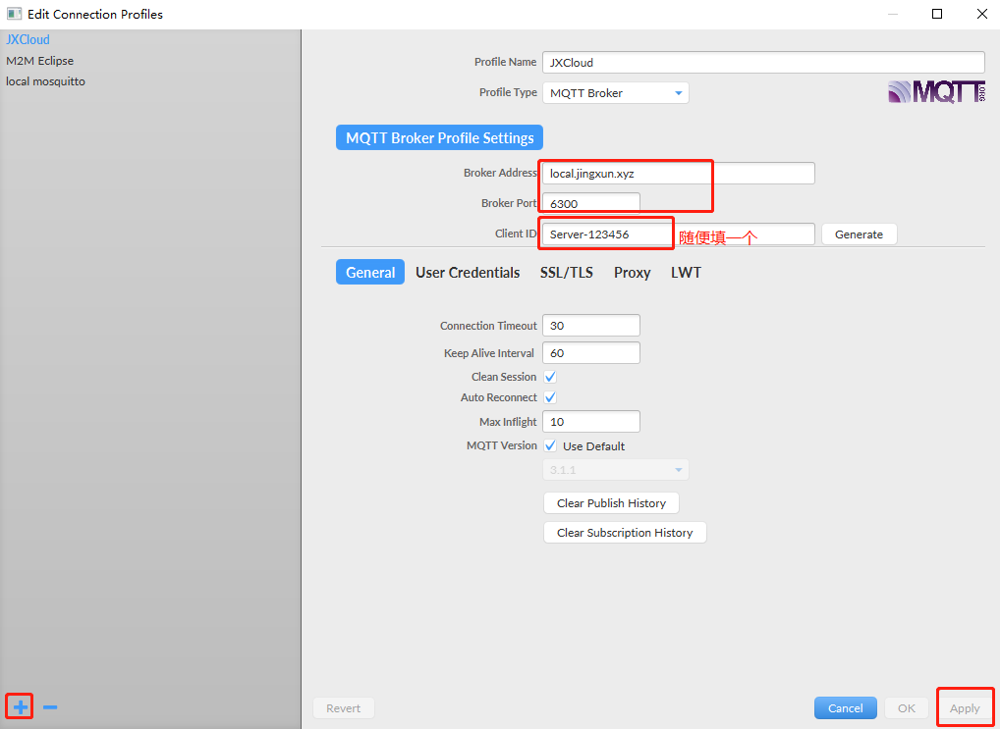
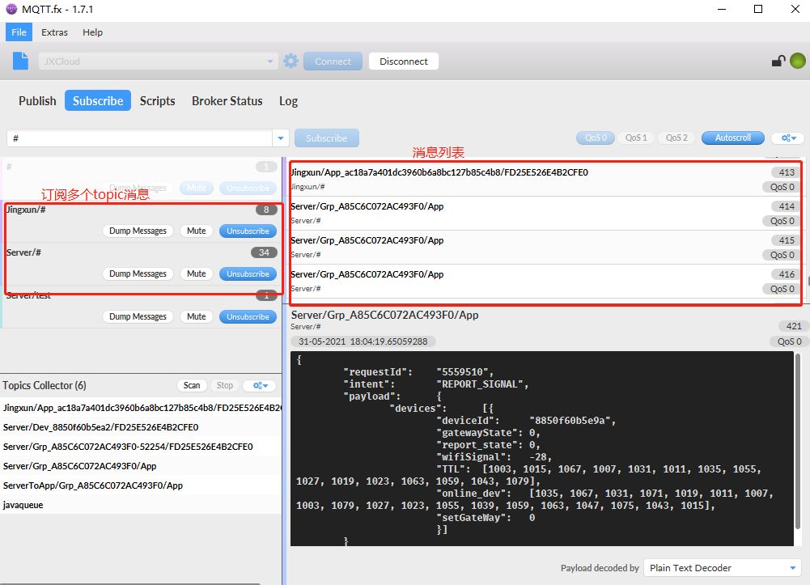

# Mqtt

## QoS（服务质量）

1. **QoS0：至多一次；只发送一次，收没收到不管。**
   - Client和Broker之间网络比较稳定的情况。
   - 可以接受丢失部分消息也不影响的场景。
   - 不需要离线消息。

2. **QoS1：至少一次；发送失败会重试，直到收到为止，消息可能重复。**
   - 需要接收所有消息，并可以接受处理重复消息。
   - 无法接受QoS2带来的额外开销，QoS1发送消息速度比QoS2快很多。

3. **QoS2：只有一次；发送失败会重试，但会保证Receiver只会收到一次。**
   - 必须要收到所有消息，且不能处理重复的消息，且可以接受QoS2带来的额外开销。

# MQTT.fx模拟器

1. 新建Profile，填写相关信息。

2. 填写用户名和密码。

3. 连接

4. 消息推送

5. 消息订阅

6. 扫描当前所有topic

7. 查看日志

