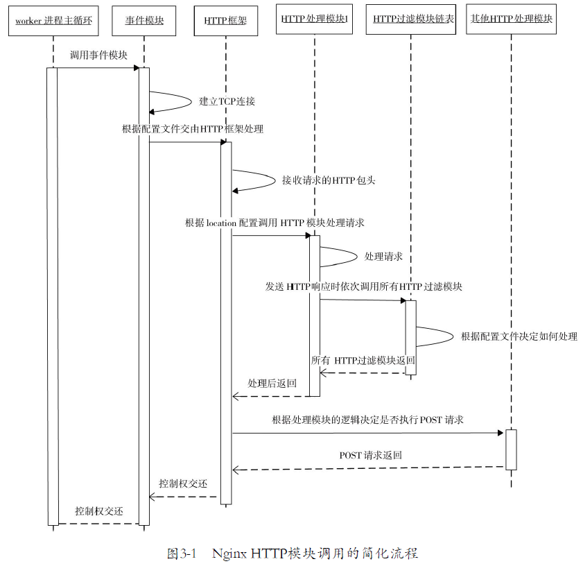
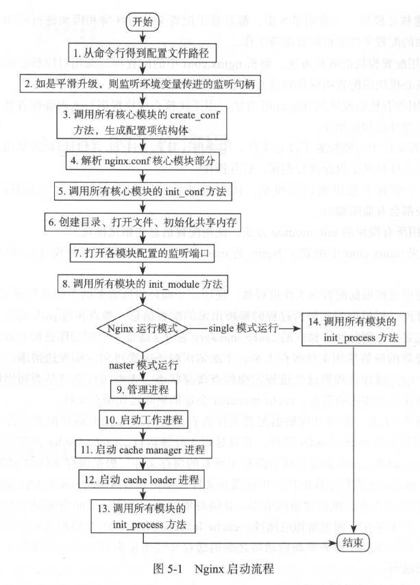
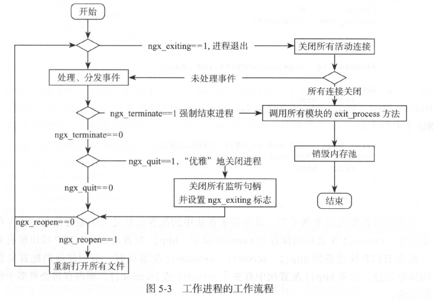
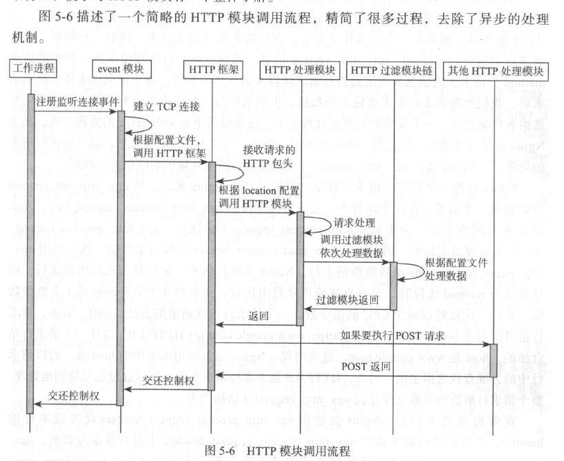
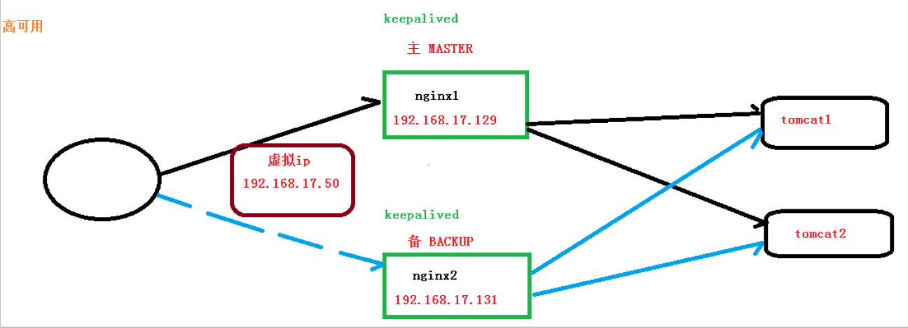

- [深入理解Nginx：模块开发与架构解析（第2版）](../resources/static/doc/深入理解Nginx模块开发与架构解析第2版LinuxUnix技术丛书-4.pdf)


# 目录
- [Nginx](#Nginx)
    - [Nginx特点](#Nginx特点)
    - [Nginx作用](#Nginx作用)
    - [安装使用Nginx](#安装使用Nginx)
- [Nginx配置](#Nginx配置)
    - [Nginx进程间关系](#Nginx进程间关系)
    - [配置语法](#配置语法)
    - [Nginx基本配置](#Nginx基本配置)
    - [Nginx配置文件详解](https://www.cnblogs.com/dongye95/p/11096785.html)
    - [Nginx配置文件详解](https://www.cnblogs.com/hunttown/p/5759959.html)
- [HTTP模块](#HTTP模块)
    - [用HTTP核心模块配置一个静态web服务器](#用HTTP核心模块配置一个静态web服务器)
    - [反向代理配置](#反向代理配置)
    - [将HTTP模块编译到Nginx中](#将HTTP模块编译到Nginx中)
    - [定义一个HTTP模块](#定义一个HTTP模块)
- [数据库基本操作](#数据库基本操作)
    - [MySQL](#MySQL)
    - [Redis](#redis)
    - [PostgreSQL](#PostgreSQL)
    - [Memcached](#Memcached)
    - [MongoDB](#MongoDB)
- [Nginx核心技术](#Nginx核心技术)
    -[Nginx架构](#Nginx架构)
- [Nginx工作流程](#Nginx工作流程)
    - [Nginx启动流程](#Nginx启动流程)
    - [Nginx管理进程的工作流程 //TODO](#Nginx管理进程的工作流程)
    - [工作进程的工作流程](#工作进程的工作流程)
    - [配置加载流程](#配置加载流程)
    - [HTTP框架初始化流程](#HTTP框架初始化流程)
    - [HTTP模块调用流程](#HTTP模块调用流程)
    - [HTTP请求处理流程](#HTTP请求处理流程)

- [nginx.conf](#nginx.conf)

- [Nginx高可用-keepalived](#Nginx高可用)
- [共享内存](#共享内存)

[目录](#目录)

# Nginx
## Nginx特点
- **速度更快：** 不论单次请求还是高峰大量的并发请求，Nginx都可以快速的响应。
- **高扩展性：** Nginx的设计极具扩展性，它完全是由多个不同功能、不同层次、不同类型且耦合度极低的模块组成。Nginx的模块都是嵌入到二进制文件中执行的，所以无论官方发布的模块还是第三方模块都一样具备很好的性能。
- **高可靠性：** Nginx常用模块非常稳定，每个worker进程相对独立，master进程在1个worker进程出错时可以快速“拉起”新的worker子进程提供服务。
- **低内存消耗：** 一般10000个非活跃的HTTP Keep-Alive连接在Nginx中仅消耗2.5MB的内存。
- **高并发：** Nginx能支持<font color=red>10万</font>以上的并发请求。
- **热部署：** master管理进程与worker工作进程分离设计可支持热部署，支持更新配置、更换日志等功能。
- **开源协议友好：** BSD开源协议不仅允许用户免费使用，还允许直接使用、修改源码并发布。

## Nginx作用
- 反向代理
- 正向代理
- 负载均衡
- 动静分离

[返回目录](#目录)

## 安装使用Nginx
- Linux2.6以上版本才支持epoll，查询Linux内核版本：uname -a
- 使用Nginx必备软件：
    1. GCC编译器：用来编译C语言，安装方式：yum install -y gcc
    2. G++编译器：用来编译C++编写的Nginx HTTP模块，安装方式：yum install -y gcc-c++
    3. PCRE库：用来解析正则表达式（nginx.conf），安装方式：yum install -y pcre pcre-devel
    4. zlib库：用来对HTTP包的内容做gzip格式压缩，安装方式：yum install -y zlib zlib-devel
    5. OpenSSL库：支持在更安全的SSL协议上传输HTTP，支持MD5、SHA1等散列函数，安装方式：yum install -y openssl openssl-devel
    6. 其他模块所需要的的第三方库
    
    [centos8离线安装Nginx](../wiki.md#centos8离线安装Nginx)
    
- 磁盘目录：
    1. Nginx源码存放目录
    2. Nginx编译产生的中间文件存放目录
    3. 部署目录：存放Nginx运行所需的二进制文件、配置文件等，默认目录：/usr/local/nginx 或者/opt/nginx
    4. 日志存放目录
- Linux内核参数优化：  
    ```properties
    #多并发Nginx内核参数修改：
    #修改/etc/sysctl.conf，修改完执行sysctl -p 命令，使修改生效。
    
    fs.file-max = 999999    #表示进程（在Nginx里指一个工作进程）可以同时打开的最大句柄数。本参数影响最大并发连接数。
    net.core.netdev_max_backlog = 8096  #当网卡接收报文速度大于内核处理速度时，本参数设置这个缓冲队列最大值。
    net.core.rmem_default = 262144  #表示内核套接宇 接收缓冲区默认值。
    net.core.wmem_default = 262144  #表示内核套接字 发送缓冲区默认值。
    net.core.rmem_max = 2097152     #表示内核套接字 接收缓冲区最大值。
    net.core.wmem_max = 2097152     #表示内核套接字 发送缓冲区最大值。
    net.ipv4.tcp_tw_reuse = 1   #参数为1时表示允许将TIME_WAIT状态的套接字重新用于新的TCP连接。服务器上的TCP协议拢在工作时会有大量的TIME WAIT状态连接，重新使用这些连接对于服务器处理大并发连接非常有用。
    net.ipv4.tcp_keepalive_time = 600   #表示当keepalive启用时，TCP发送keepalive消息的频率。默认为2小时，如果本值变小，可以更快地清理无效的连接。
    net.ipv4.tcp_fine_timeout = 30      #表示服务器主动关闭连接时，套接字的FIN_WAIT-2 状态最大时间。
    net.ipv4.tcp_max_tw_buckets = 5000      #表示操作系统允许的TIME _WAIT套接字数量的最大值。当超过这个值，TIME WAIT状态的套接字被立即清除并输出警告消息，默认值为180000，过多的TIME WAIT套接字会使服务器速度变慢。
    net.ipv4.ip_local_port_range = 1024 61000   #定义UDP 和TCP 连接中本地端口范围（不包括连接到远端的端口） 。
    net.ipv4.tcp_rmem = 4096 32768 262142   #定义TCP 接收缓存（TCP接收窗口）的最小值、默认值、最大值。
    net.ipv4.tcp_wmen = 4096 32768 262142   #：定义TCP 发送缓存（TCP 发送窗口）的最小值、默认值、最大值。
    net.ipv4.tcp_syncookies = 1     # 解决TCP的SYN攻击。
    net.ipv4.tcp_max_syn_backlog = 1024     #表示TCP 三次握手阶段SYl叫请求队列最大值，默认为1024 。调置为更大的值可以使Nginx 在非常繁忙的情况下，若来不及接收新的连接时， Linux 不至于丢失客户端新创建的连接请求。
    ```
- 获取安装Nginx：
    1. [Nginx官网下载](http://nginx.org/en/download.html)
    2. 将下载的nginx-x.x.x.tar.gz源码压缩包放到Nginx源码目录，解压：tar -zxvf nginx-x.x.x.tar.gz
    3. 编译安装Nginx：进入nginx-x.x.x目录执行以下3个命令：
        1. **./configure**：检测操作系统内核和已安装软件、解析参数、生成中间目录及根据参数生成各种C源码文件、Makefile文件等  
            （或者指定安装目录：./configure --prefix=/opt/nginx --sbin-path=/opt/nginx/sbin/nginx）
        2. **make**：根据configure命令生成的Makefile文件编译Nginx工程，生成目标文件、最终的二进制文件
        3. **make install**：根据configure执行时的参数将Nginx部署到指定安装目录，包括相关目录的创建和二进制文件、配置文件的复制
    4. 默认情况下Nginx被安装在：usr/local/nginx
        二进制文件路径：usr/local/nginx/sbin/nginx
        配置文件路径：usr/local/nginx/conf/nginx.conf
- configure分析：//TODO  
    使用configure 命令参数可以在新编译的Nginx 程序里打包指定的模块，或去除指定的模块，这样可以自定义Nginx 功能，同时可以减少内存占用。
- Nginx命令：
    1. 启动：
        1. 默认启动：usr/local/nginx/sbin/nginx，会读取usr/local/nginx/conf/nginx.conf  
            （或者指定Nginx目录：/opt/nginx/sbin/nginx **-p** /opt/nginx/）
        2. 指定配置文件启动：usr/local/nginx/sbin/nginx -c tmpnginx.conf
        3. 指定全局配置项启动：usr/local/nginx/sbin/nginx -g "pid var/nginx/test.pid;"，会把pid文件写到var/nginx/test.pid
            停止Nginx服务：usr/local/nginx/sbin/nginx -g "pid var/nginx/test.pid;" -s stop
    2. 检查配置文件是否有错：
        1. usr/local/nginx/sbin/nginx -t
        2. 检查时不输出error级别以下信息：usr/local/nginx/sbin/nginx -t -q
    3. 显示版本信息：
        1. usr/local/nginx/sbin/nginx -v
        2. 显示编译阶段信息（版本、参数）：usr/local/nginx/sbin/nginx -V
    4. 停止：
        1. usr/local/nginx/sbin/nginx -s stop （指定目录：/opt/nginx/sbin/nginx -p /opt/nginx -s stop）
        2. kill -s SIGTERM/SIGINT <nginx master进程ID>，效果同上
        3. 优雅停止：usr/local/nginx/sbin/nginx -s quit，先关闭监听端口，再停止接收新请求，最后处理完正在处理的请求后退出进程
        4. 优雅停止kill：kill -s SIGQUIT/SIGWINCH <nginx master pid>，效果同上
    5. 重新加载配置：
        1. usr/local/nginx/sbin/nginx -s reload （指定目录：/opt/nginx/sbin/nginx -p /opt/nginx -s reload）
        2. kill -s SIGHUP <nginx master pid>
    6. 日志文件回滚;
        1. usr/local/nginx/sbin/nginx -s reopen
        2. kill -s SIGUSR1 <nginx master pid>
    7. 平滑升级Nginx：
        1. 通知旧版本Nginx准备升级：kill -s SIGUSR2 <nginx master pid>
        2. 启动新版本Nginx，执行"1"
        3. 停止旧版本Nginx：kill -s SIGQUIT <nginx master pid>
    8. 帮助：usr/local/nginx/sbin/nginx -h

[返回目录](#目录)

# Nginx配置
## Nginx进程间关系
- 1个master进程管理多个worker进程
- worker进程数量=服务器cpu核心数（默认情况，可配置）
- 真正提供互联网服务的是worker进程，master进程只负责监控管理worker进程
    1. master只专注于管理工作，如启动、停止、重新加载配置文件、平滑升级等服务，需要较大权限
    2. 多个worker进程处理请求可以提高服务健壮性
    3. 1个worker进程同时处理的请求数只受限于内存大小，多个worker进程处理并发请求时几乎没有同步锁的限制，worker进程一般不会睡眠，因此worker进程数等于cpu核心数时，进程间切换代价最小

- 连接数：worker_connection
    - 发送请求，占用worker的2 或者 4个连接数。
    - nginx有1个master，有四个worker，每个worker支持最大连接数1024，支持的最大并发数是多少？
        - 普通静态访问最大并发数：`worker_connections * worker_processes / 2`
        - 若是HTTP做反向代理，最大并发数：`worker_connections * worker_processes / 4`

[返回目录](#目录)
  
## 配置语法
- 块配置项用大括号包括，配置项名后用空格分隔
- 块配置项可以嵌套，内层块会继承外层块，当内外层块配置冲突时-取决于解析这个配置项的模块
- 每行配置结尾需要加分号;
- 配置项中的语法符号，使用单引号''或者双引号""括住
- \# 注释符
- 参数值单位：
    1. 空间：K/k(KB)，M/m(MB)
    2. 时间：ms（毫秒），s（秒），m（分钟），h（小时），d（天），w（周，包含7天），M（月，包含30天），y（年，包含365天）
- $ 引用变量符
- 大部分模块都必须在nginx.conf中读取某个配置项后才会在Nginx启用

[返回目录](#目录)

## Nginx基本配置
**按使用功能分为四类：**  
- **用于调试、定位问题的配置**

|配置项|语法|默认值|描述|
|---|---|---|---|
|是否以守护进程方式运行Nginx|daemon on/off;|on|守护进程（daemon）是脱离终端并且在后台运行的进程。它脱离终端是为了避免进程执行过程中的信息在任何终端上显示，这样一来，进程也不会被任何终端所产生的信息所打断|
|是否以master/worker方式工作|master_process on/off;|on|Nginx以一个master进程管理多个worker进程的方式运行，如果关闭，则不会fork出worker进程处理请求，会使用master进程自身处理请求|
|error日志设置|***error_log "path file" "level";***|error_log logs/error.log error;|"path file"可以是一个具体的文件，也可以是/dev/null(不输出日志)，也可以是stderr会输出到标准错误文件中；日志级别依次增大：debug、info、notice、warn、error、crit、alert、emerg（debug，必须在configure时加入--with-debug配置项）|
|仅对指定的客户端输出debug级别的日志|debug_connection "IP/CIDR";|无|这个配置项实际上属于事件类配置，因此，它必须放在events{...}中才有效。它的值可以是IP地址或CIDR地址，可用于定位高并发请求。（使用debug_connection前，需在执行configure时已经加入了--with-debug参数，否则不会生效）|
|限制coredump核心转储文件的大小|worker_rlimit_core "size";|无|当Nginx进程出现一些非法操作（如内存越界）导致进程直接被操作系统强制结束时，会生成核心转储core文件，可以从core文件获取当时的堆栈、寄存器等信息。|
|指定coredump文件生成目录|working_directory "path";|无|worker进程的工作目录。唯一用途就是设置coredump文件所放置的目录|
- **正常运行必备配置**

|配置项|语法|默认值|描述|
|---|---|---|---|
|定义环境变量|env "VAR/VAR=VALUE"|如：env TESTPATH=/tmp/;|这个配置项可以让用户直接设置操作系统上的环境变量|
|嵌入其他配置文件|***include "path file"***|如：include mime.types; include vhost/*.conf;|将其他配置文件嵌入到当前的nginx.conf文件中|
|pid文件的路径|pid "path/file";|pid logs/nginx.pid;|保存master进程ID的pid文件存放路径。默认与configure执行时的参数“--pid-path”所指定的路径是相同的|
|Nginx worker进程运行的用户及用户组|user "username" "groupname";|user nobody nobody;|user用于设置master进程启动后，fork出的worker进程运行在哪个用户和用户组下。若用户在configure命令执行时使用了参数--user=username和--group=groupname，此时nginx.conf将使用参数中指定的用户和用户组。|
|指定Nginx worker进程可以打开的最大文件个数|***worker_rlimit_nofile limit;***|无|设置一个worker进程可以打开的最大文件个数。|
|限制信号队列|worker_rlimit_sigpending limit;|无|设置每个用户发往Nginx的信号队列的大小。也就是说，当某个用户的信号队列满了，这个用户再发送的信号量会被丢掉。|
- **优化性能配置**

|配置项|语法|默认值|描述|
|---|---|---|---|
|Nginx worker进程个数|***worker_processes number;***|worker_processes 1;|在master/worker运行方式下，定义worker进程的个数。每个worker单线程调用各模块功能，如果模块间不阻塞调用，则配置CPU内核个数个worker进程，否则多配点worker进程|
|绑定Nginx worker进程到指定的CPU内核|worker_cpu_affinity cpumask"cpumask..."|如：worker_processes 4; worker_cpu_affinity 1000 0100 0010 0001;|worker进程绑定指定的cpu内核，可以独享一个cpu，防止多个worker抢同一个cpu，以实现内核调度上完全的并发。（仅对Linux系统有效）|
|Nginx worker进程优先级设置|worker_priority nice;|worker_priority 0;|该配置项用于设置Nginx worker进程的nice优先级。|
|SSL硬件加速|ssl_engine "device";|无|如果服务器上有SSL硬件加速设备，那么就可以进行配置以加快SSL协议的处理速度。查看是否有SSL硬件加速设备：openssl engine -t|
|系统调用gettimeofday的执行频率|timer_resolution "t";|如：“timer_resolution 100ms；”表示至少每100ms才调用一次gettimeofday。|默认情况下，每次内核的事件调用（如epoll、select、poll、kqueue等）返回时，都会执行一次gettimeofday，实现用内核的时钟来更新Nginx中的缓存时钟。但在目前的大多数内核中，如x86-64体系架构，gettimeofday只是一次vsyscall，仅仅对共享内存页中的数据做访问，并不是通常的系统调用，代价并不大，一般不必使用这个配置。|

- **事件类配置**  

|配置项|语法|默认值|描述|
|---|---|---|---|
|是否打开accept锁|accept_mutex "on/off"|on|accept_mutex是Nginx的负载均衡锁，这把锁可以让多个worker进程轮流地、序列化地与新的客户端建立TCP连接。当某一个worker进程建立的连接数量达到worker_connections配置的最大连接数的7/8时，会大大地减小该worker进程试图建立新TCP连接的机会，以此实现所有worker进程之上处理的客户端请求数尽量接近。如果关闭它，那么建立TCP连接的耗时会更短，但worker进程之间的负载会非常不均衡。|
|lock文件的路径|lock_file "path/file";|lock_file logs/nginx.lock;|accept锁可能需要这个lock文件，如果accept锁关闭，lock_file配置完全不生效。如果打开了accept锁，并且由于编译程序、操作系统架构等因素导致Nginx不支持原子锁，这时才会用文件锁实现accept锁，这样lock_file指定的lock文件才会生效。|
|使用accept锁后到真正建立连接之间的延迟时间|accept_mutex_delay "Nms";|accept_mutex_delay 500ms;|在使用accept锁后，同一时间只有一个worker进程能够取到accept锁。这个accept锁不是阻塞锁，如果取不到会立刻返回。如果有一个worker进程试图取accept锁而没有取到，它至少要等accept_mutex_delay定义的时间间隔后才能再次试图取锁。|
|批量建立新连接|***multi_accept "on/off";***|multi_accept off;|当事件模型通知有新连接时，尽可能地对本次调度中客户端发起的所有TCP请求都建立连接。|
|选择事件模型|***use*** "kqueue/rtsig/***epoll***/'/dev/poll'/select/poll/eventport";|Nginx会自动使用最适合的事件模型。|对于Linux操作系统来说，可供选择的事件驱动模型有poll、select、epoll三种。epoll是性能最高的一种|
|每个worker的最大连接数|***worker_connections "number";***|无|定义每个worker进程可以同时处理的最大连接数。1个请求占用worker的2或者4个连接数|

[返回目录](#目录)

# HTTP模块
## 用HTTP核心模块配置一个静态web服务器 

**主要介绍：ngx_http_core_module模块**  
- 所有的HTTP配置项都必须直属于http块、server块、location块、upstream块或if块等  

**按功能划分：**  
- **虚拟主机与请求的分发**

|配置项|语法|默认值|配置块|描述|
|---|---|---|---|---|
|监听端口|listen address:port "default(deprecated in 0.8.21)/default_server/'backlog=num/rcvbuf=size/sndbuf=size/accept_filter=filter/deferred/bind/ipv6only=<on/off>/ssl'";|listen 80;|server|在listen后可以只加IP地址、端口或主机名|
|主机名称|server_name name[...];|server_name "";|server|server_name后可以跟多个主机名称，在开始处理一个HTTP请求时，Nginx会取出header头中的Host，与每个server中的server_name进行匹配，以此决定到底由哪一个server块来处理这个请求。\n 如果host与多个server_name都匹配，选择server块处理优先级按照：全匹配>通配符\*在首位>通配符\*在末位>正则匹配；\n 如果都不匹配，按照：优先选择在listen配置项后加入"default/default_server"的server块 > 找到匹配listen端口的第一个server块。|
|存储server name的散列表的每个桶占用内存大小|server_names_hash_bucket_size "size";|32/64/128;|http、server、location|为了提高快速寻找到相应server name的能力，Nginx使用散列表来存储server name。server_names_hash_bucket_size设置了每个散列桶占用的内存大小。|
|server_names_hash_max_size|server_names_hash_max_size "size";|512|http、server、location|server_names_hash_max_size越大，消耗的内存就越多，但散列key的冲突率则会降低，检索速度也更快。|
|重定向主机名称的处理|server_name_in_redirect on/off;|on|http、server、location|该配置需要配合server_name使用，在使用on打开时，表示在重定向请求时会使用server_name里配置的第一个主机名代替原先请求中的Host头部，而使用off关闭时，表示在重定向请求时使用请求本身的Host头部。|
|location|location"=/~/~*/^~/@"/uri/{...}|无|server|location会尝试根据用户请求中的URI来匹配上面的/uri表达式，如果可以匹配，就选择location{}块中的配置来处理用户请求，多个location匹配时选第一个处理。匹配规则：=表示把URI作为字符串与参数中的uri做完全匹配，\~表示匹配URI时是字母大小写敏感的，\~*表示匹配URI时忽略字母大小写问题，^~表示匹配URI时只需要其前半部分与uri参数匹配即可，@表示仅用于Nginx服务内部请求之间的重定向，带有@的location不直接处理用户请求|
- **文件路径的定义**

|配置项|语法|默认值|配置块|描述|
|---|---|---|---|---|
||||||
||||||
||||||
||||||
||||||
||||||
- **内存及磁盘资源的分配**

|配置项|语法|默认值|配置块|描述|
|---|---|---|---|---|
||||||
||||||
||||||
||||||
||||||
||||||
- **网络连接的设置**

|配置项|语法|默认值|配置块|描述|
|---|---|---|---|---|
||||||
||||||
||||||
||||||
||||||
||||||
- **MIME类型的设置**

|配置项|语法|默认值|配置块|描述|
|---|---|---|---|---|
||||||
||||||
||||||
||||||
||||||
||||||
- **对客户端请求的限制**

|配置项|语法|默认值|配置块|描述|
|---|---|---|---|---|
||||||
||||||
||||||
||||||
||||||
||||||
- **文件操作的优化**

|配置项|语法|默认值|配置块|描述|
|---|---|---|---|---|
||||||
||||||
||||||
||||||
||||||
||||||
- **对客户端请求的特殊处理**

|配置项|语法|默认值|配置块|描述|
|---|---|---|---|---|
||||||
||||||
||||||
||||||
||||||
||||||

[返回目录](#目录)

## 反向代理配置
**反向代理（reverse proxy）** 方式是指用代理服务器来接受Internet上的连接请求，然后将请求转发给内部网络中的上游服务器，并将从上游服务器上得到的结果返回给Internet上请求连接的客户端，此时代理服务器对外的表现就是一个Web服务器。
- Nginx反向代理特点：当客户端发来HTTP请求时，Nginx并不会立刻转发到上游服务器，而是先把用户的请求（包括HTTP包体）**完整**地接收到Nginx所在服务器的硬盘或者内存中，然后再向上游服务器发起连接，把缓存的客户端请求转发到上游服务器。  
- 缺点：延长了一个请求的处理时间，并增加了用于缓存请求内容的内存和磁盘空间。
- 优点：降低了上游服务器的负载，尽量把压力放在Nginx服务器上。减轻了上游服务器的并发压力。

#### 负载均衡基本配置
**（1）upstream块**  
语法： upstream name{...}  
配置块： http  
upstream块定义了一个上游服务器的集群，便于反向代理中的proxy_pass使用。例如：  
```javascript
upstream backend {
    server backend1.example.com;
    server backend2.example.com;
    server backend3.example.com;
} 
server {
    location / {
        proxy_pass http://backend;
    }
}
```
**（2）server**  
语法： server name[parameters];  
配置块： upstream  
server配置项指定了一台上游服务器的名字，这个名字可以是域名、IP地址端口、UNIX句柄等，在其后还可以跟下列参数。
- weight=number：设置向这台上游服务器转发的权重，默认为1。
- max_fails=number：该选项与fail_timeout配合使用，指在fail_timeout时间段内，如果向当前的上游服务器转发失败次数超过number，则认为在当前的fail_timeout时间段内这台上游服务器不可用。max_fails默认为1，如果设置为0，则表示不检查失败次数。
- fail_timeout=time：fail_timeout表示该时间段内转发失败多少次后就认为上游服务器暂时不可用，用于优化反向代理功能。它与向上游服务器建立连接的超时时间、读取上游服务器的响应超时时间等完全无关。fail_timeout默认为10秒。
- down：表示所在的上游服务器永久下线，只在使用ip_hash配置项时才有用。
- backup：在使用ip_hash配置项时它是无效的。它表示所在的上游服务器只是备份服务器，只有在所有的非备份上游服务器都失效后，才会向所在的上游服务器转发请求。
例如：
```javascript
upstream backend {
    server backend1.example.com weight=5;
    server 127.0.0.1:8080 max_fails=3 fail_timeout=30s;
    server unix:/tmp/backend3;
}
```
**（3）ip_hash**  
语法： ip_hash;  
配置块： upstream  
在有些场景下，我们可能会希望来自某一个用户的请求始终落到固定的一台上游服务器中。例如，假设上游服务器会缓存一些信息，如果同一个用户的请求任意地转发到集群中的任一台上游服务器中，那么每一台上游服务器都有可能会缓存同一份信息，这既会造成资源的浪费，也会难以有效地管理缓存信息。ip_hash就是用以解决上述问题的，它首先根据客户端的IP地址计算出一个key，将key按照upstream集群里的上游服务器数量进行取模，然后以取模后的结果把请求转发到相应的上游服务器中。这样就确保了同一个客户端的请求只会转发到指定的上游服务器中。  
ip_hash与weight（权重）配置不可同时使用。如果upstream集群中有一台上游服务器暂时不可用，不能直接删除该配置，而是要down参数标识，确保转发策略的一贯性。例如：  
```javascript
upstream backend {
    ip_hash;
    server backend1.example.com;
    server backend2.example.com;
    server backend3.example.com down;
    server backend4.example.com;
}
```
**（4）记录日志时支持的变量**  
如果需要将负载均衡时的一些信息记录到access_log日志中，那么在定义日志格式时可以使用负载均衡功能提供的变量，见表2-2。  
表2-2　访问上游服务器时可以使用的变量  

|变量名|意义|
|---|---|
|$upstream_addr|处理请求的上游服务器地址|
|$upstream_cache_status|表示是否命中缓存，取值范围：MISS、EXPIRED、UPDATING、STALE、HIT|
|$upstream_status|上游服务器返回的响应中的HTTP响应码|
|$upstream_response_time|上游服务器的响应时间，精度到毫秒|
|$upstream_http_$HEADER|HTTP的头部，如$upstream_http_host|

例如，可以在定义access_log访问日志格式时使用表2-2中的变量：  
```javascript
log_format timing '$remote_addr - $remote_user [$time_local] $request' 'upstream_response_time $upstream_response_time' 'msec $msec request_time $request_time';
log_format up_head '$remote_addr - $remote_user [$time_local] $request' 'upstream_http_content_type $upstream_http_content_type';
```
#### 反向代理基本配置
**（1）proxy_pass**  
语法： proxy_pass URL;  
配置块： location、if  
此配置项将当前请求反向代理到URL参数指定的服务器上，URL可以是主机名或IP地址加端口的形式，例如：  
```javascript
proxy_pass http://localhost:8000/uri/;
```
也可以是UNIX句柄：  
```javascript
proxy_pass http://unix:/path/to/backend.socket:/uri/;
```
还可以如上节负载均衡中所示，直接使用upstream块，例如：  
```javascript
upstream backend {
    …
} 
server {
    location / {
        proxy_pass http://backend;
    }
}
```
用户可以把HTTP转换成更安全的HTTPS，例如：  
```javascript
proxy_pass https://192.168.0.1;
```
默认情况下反向代理是不会转发请求中的Host头部的。如果需要转发，那么必须加上配置：  
```javascript
proxy_set_header Host $host;
```
**（2）proxy_method**  
语法： proxy_method method;  
配置块： http、server、location  
此配置项表示转发时的协议方法名。例如设置为：  
```javascript
proxy_method POST;
```
那么客户端发来的GET请求在转发时方法名也会改为POST。  
**（3）proxy_hide_header**  
语法： proxy_hide_header the_header;  
配置块： http、server、location  
Nginx会将上游服务器的响应转发给客户端，但默认不会转发以下HTTP头部字段：Date、Server、X-Pad和X-Accel-*。使用proxy_hide_header后可以任意地指定哪些HTTP头部字段不能被转发。例如：  
```javascript
proxy_hide_header Cache-Control;
proxy_hide_header MicrosoftOfficeWebServer;
```
**（4）proxy_pass_header**  
语法： proxy_pass_header the_header;  
配置块： http、server、location  
与proxy_hide_header功能相反，proxy_pass_header会将原来禁止转发的header设置为允许转发。例如：  
```javascript
proxy_pass_header X-Accel-Redirect;
```
**（5）proxy_pass_request_body**  
语法： proxy_pass_request_body on|off;  
默认： proxy_pass_request_body on;  
配置块： http、server、location  
作用为确定是否向上游服务器发送HTTP包体部分。  
**（6）proxy_pass_request_headers**  
语法： proxy_pass_request_headers on|off;  
默认： proxy_pass_request_headers on;  
配置块： http、server、location  
作用为确定是否转发HTTP头部。  
**（7）proxy_redirect**  
语法： proxy_redirect[default|off|redirect replacement];  
默认： proxy_redirect default;  
配置块： http、server、location  
当上游服务器返回的响应是重定向或刷新请求（如HTTP响应码是301或者302）时，proxy_redirect可以重设HTTP头部的location或refresh字段。
例如，如果上游服务器发出的响应是302重定向请求，location字段的URI是http://localhost:8000/two/some/uri/ ，那么在下面的配置情况下，实际转发给客户端的location是http://frontendonesome/uri/ 。
```javascript
proxy_redirect http://localhost:8000/two/  http://frontendone;
```
这里还可以使用ngx-http-core-module提供的变量来设置新的location字段。例如：  
```javascript
proxy_redirect http://localhost:8000/  http://$host:$server_port/;
```
也可以省略replacement参数中的主机名部分，这时会用虚拟主机名称来填充。例如：  
```javascript
proxy_redirect http://localhost:8000/two/one;
```
使用off参数时，将使location或者refresh字段维持不变。例如：
```javascript
proxy_redirect off;
```
使用默认的default参数时，会按照proxy_pass配置项和所属的location配置项重组发往客户端的location头部。例如，下面两种配置效果是一样的：  
```javascript
location one {
    proxy_pass http://upstream:port/two/;
    proxy_redirect default;
} 
location one {
    proxy_pass http://upstream:port/two/;
    proxy_redirect http://upstream:port/two/one;
}
```
**（8）proxy_next_upstream**  
语法：proxy_next_upstream[error|timeout|invalid_header|http_500|http_502|http_503|http_504|http_404|off];  
默认： proxy_next_upstream error timeout;  
配置块： http、server、location  
此配置项表示当向一台上游服务器转发请求出现错误时，继续换一台上游服务器处理这个请求。前面已经说过，上游服务器一旦开始发送应答，Nginx反向代理服务器会立刻把应答包转发给客户端。因此，一旦Nginx开始向客户端发送响应包，之后的过程中若出现错误也是不允许换下一台上游服务器继续处理的。这很好理解，这样才可以更好地保证客户端只收到来自一个上游服务器的应答。  
proxy_next_upstream的参数用来说明在哪些情况下会继续选择下一台上游服务器转发请求。  
- error：当向上游服务器发起连接、发送请求、读取响应时出错。
- timeout：发送请求或读取响应时发生超时。
- invalid_header：上游服务器发送的响应是不合法的。
- http_500：上游服务器返回的HTTP响应码是500。
- http_502：上游服务器返回的HTTP响应码是502。
- http_503：上游服务器返回的HTTP响应码是503。
- http_504：上游服务器返回的HTTP响应码是504。
- http_404：上游服务器返回的HTTP响应码是404。
- off：关闭proxy_next_upstream功能—出错就选择另一台上游服务器再次转发。  

Nginx的反向代理模块还提供了很多种配置，如设置连接的超时时间、临时文件如何存储，以及最重要的如何缓存上游服务器响应等功能。这些配置可以通过阅读ngx_http_proxy_module模块的说明了解，只有深入地理解，才能实现一个高性能的反向代理服务器。  

[返回目录](#目录)

## 将HTTP模块编译到Nginx中
1. 将源码文件放在一个目录下（如：/nginx/），并在此目录下创建一个文件命名为config，用于通知Nginx如何编译本模块；
2. 在configure脚本执行时添加参数：--add-module=/nginx/；（在执行完configure脚本后Nginx会生成objs/Makefile和objs/ngx_modules.c文件，可以去修改这两个文件实现其他需求）
3. config文件编写：（仅开发HTTP模块，包含下3个变量即可）
    - ngx_addon_name：仅在configure执行时使用，一般设置为模块名称。
    - HTTP_MODULES：保存所有的HTTP模块名称，每个HTTP模块间使用空格符连接。重设此变量时不要进行覆盖，可以引用。
    - NGX_ADDON_SRCS：用于指定新增模块的源代码，多个待编译的源代码间使用空格符连接。可以使用$ngx_addon_dir变量，等价于configure执行时--add-module=/nginx/参数。  
    例：
    ```
    ngx_addon_name=ngx_http_mytest_module
    HTTP_MODULES="$HTTP_MODULES ngx_http_mytest_module"
    NGX_ADDON_SRCS="$NGX_ADDON_SRCS $ngx_addon_dir/ngx_http_mytest_module.c"
    ```
4. 使用configure脚本将第三方模块加入到Nginx中：
    ```
    执行： 
    . auto/modules
    . auto/make
    ```
[返回目录](#目录)
   
## 定义一个HTTP模块
#### Nginx-HTTP模块调用的简要流程  


worker进程会在一个for循环语句里反复调用事件模块检测网络事件。当事件模块检测到某个客户端发起的TCP请求时（接收到SYN包），将会为它建立TCP连接，成功建立连接后根据nginx.conf文件中的配置会交由HTTP框架处理。HTTP框架会试图接收完整的HTTP头部，并在接收到完整的HTTP头部后将请求分发到具体的HTTP模块中处理。  
HTTP模块在处理请求的结束时，大多会向客户端发送响应，此时会自动地依次调用所有的HTTP过滤模块，每个过滤模块可以根据配置文件决定自己的行为。例如，gzip过滤模块根据配置文件中的gzip on|off来决定是否压缩响应。HTTP处理模块在返回时会将控制权交还给HTTP框架，如果在返回前设置了subrequest，那么HTTP框架还会继续异步地调用适合的HTTP模块处理子请求。  
**常见分发策略**：根据请求的URI和nginx.conf里location配置项的匹配度来决定如何分发。  
**开发HTTP模块时，需要注意两点：**  
- HTTP框架到具体的HTTP模块间数据流的传递
- 开发的HTTP模块如何与诸多的过滤模块协同工作

#### 自定义HTTP模块：ngx_http_outman_module
**HTTP模块命名：ngx_http_outman_module**  
**源码文件命名：ngx_http_outman_module.c**  
1. 先将HTTP模块编译进Nginx(见3.3)
2. 设置模块在运行中生效(典型如根据URI匹配location /uri {outman;})

**定义HTTP模块方式**  
```javascript
ngx_module_t ngx_http_outman_module;
```
//TODO

#### 处理用户请求
//TODO
#### 发送响应
//TODO

#### Nginx的基本数据结构和方法
- 整形封装  
ngx_int_t封装有符号整型，ngx_uint_t封装无符号整型。  
```javascript
typedef intptr_t ngx_int_t; 
typedef uintptr_t ngx_uint_t;
```
- 字符串结构  
ngx_str_t结构就是字符串。  
ngx_str_t只有两个成员，其中data指针指向字符串起始地址，len表示字符串的有效长度。
```javascript
typedef struct {
    size_t  len;
    u_char  *data;
} ngx_str_t;
```
- 列表结构  
ngx_list_t是Nginx封装的链表容器，  
```javascript
typedef struct ngx_list_part_s ngx_list_part_t; struct ngx_list_part_s {
    void *elts;
    ngx_uint_t nelts;
    ngx_list_part_t *next;
};
typedef struct {
    ngx_list_part_t *last;
    ngx_list_part_t part;
    size_t size;
    ngx_uint_t nalloc;
    ngx_pool_t *pool;
} ngx_list_t;
```
- key/value结构  
ngx_table_elt_t  
```javascript
typedef struct {
    ngx_uint_t hash;
    ngx_str_t key;
    ngx_str_t value;
    u_char *lowcase_key;
} ngx_table_elt_t;
```
- 缓冲结构  
ngx_buf_t，既应用于内存数据也应用于磁盘数据。  
```javascript
//TODO
```
- 链表结构  
ngx_chain_t，是与ngx_buf_t配合使用的链表数据结构  
在向用户发送HTTP包体时，就要传入ngx_chain_t链表对象，注意，如果是最后一个ngx_chain_t，那么必须将next置为NULL，否则永远不会发送成功，而且这个请求将一直不会结束（Nginx框架的要求）。  
```javascript
typedef struct ngx_chain_s ngx_chain_t; struct ngx_chain_s {
    ngx_buf_t *buf;
    ngx_chain_t *next;
};
```

[返回目录](#目录)

## event模块

## 负载均衡机制

# 数据库基本操作
Nginx使用Redis作数据缓存，使用Memcached作文件缓存，使用MongoDB持久化NoSQL数据，使用MySQL集群作关系型数据库。  
## MySQL
#### MySQL特点
- MySQL 支持读写分区，可以通过代理分离读和写操作，实现高性能。在读写分离的机制下， 一个MySQL 簇由代理服务器、主服务器和从服务器构成。主服务器负责写人，多实例的从服务器负责读响应，主、从服务器之间通过数据同步／异步地写入数据。各服务器可以动态扩展以增容，自然地实现了备份。
- MySQL 5.7 现在已经可以轻松达到50 万QPS (Queries Per Second，每秒查询率）的性能，并支持NoSQL 接口，通过NoSQL 接口可以达到100 万QPS 。
#### MySQL安装
- 查看自带MySQL 是否已安装：`yum list installed | grep mysql`
- 卸载自带MySQL：`yum -y remove mysql-libs.x86_64`
- 查看yum 库上的MySQL 版本信息：`yum list | grep mysql` 或`yum -y list mysql*`
- 使用yum 安装MySQL 数据库：`yum -y install mysql-server mysql mysql-devel`  
    当结果显示为时，即安装完毕。注意：安装mysql只是安装了数据库，只有安装mysql-server才相当于安装了客户端。  
- 查看MySQL 数据库版本信息：`rpm -qi mysql-server`
- 查看mysql组：`id mysql`
- 启动mysqld服务：`service mysqld start`
- 检查端口查看MySQL是否启动：`netstat -anp | grep 3306`
- 测试连接：运行客户端mysql，在mysql/bin目录下，测试是否能连到mysqld：`mysql`
- Windows上使用Navicat连接mysql

[返回目录](#目录)

## Redis
#### Redis特点
- Redis 支持数据的持久化，可以将内存中的数据保存在磁盘中，重启的时候可以再次加载进行使用。
- Redis 不仅仅支持简单的key-value 类型数据，同时提供list、set、zset、hash 等数据结构的存储。
- Redis 支持数据备份，即master-slave 模式的数据备份。  
Redis 优势比较多：  
- 性能极高：读速度是110000 次/s ，写速度是81000 次/s 。
- 丰富的数据类型：支持strings 、lists 、hashes 、sets及ordered sets 数据类型。
- 原子： Redis 操作都是原子操作，还支持全并发原子操作。
- 丰富的特性：支持publish/subscribe、通知、key过期等特性。
- 持久化： 支持以RDB 和AOF 方式将数据持久化到文件中。
- 数据复制： Redis 的主从复制功能非常强大，一个master 可以拥有多个slave ，而一个slave 又可以拥有多个slave ，如此下去，形成了强大的多级服务器集群架构。

- **注意**：
    - Redis 本身是单线程的，因此可以**设置每个实例在6~8GB之间，通过启动更多的实例提高吞吐量**。例如，128GB的服务器上可以开启8GBx10个实例，充分利用多核CPU的性能。
    - 在实际项目中，为了提高吞吐量，往往需要使用**主从策略，即数据写到主Redis，读取时从从Redis上读**，这样可以通过挂载更多的从服务器提高吞吐量， 而且可以通过主从机制，在叶子节点开启持久化方式防止数据丢失。更大型的系统则需要使用twemproxy 实现Redis 集群。
#### Redis安装
- Redis 的下载地址：http://redis.io/download
- 下载、安装
```shell script
wget http://download.redis.io/releases/redis-3.2.6.tar.gz
tar xzf redis-3.2.6.tar.gz
cd redis-3.2.6
make
```
- 启动
```shell script
cd src
./redis-server #默认启动
./redis-server redis.conf #指定配置文件启动
./redis-cli #启动客户端
#测试客户端 服务端交互
redis>set foo bar
OK
redis>get foo
"bar"
```
- 连接远程Redis
```shell script
#语法
redis-cli -h host -p port -a password
redis-cli -h 127.0.0.1 -p 6379 -a "mypass"
```
#### Redis配置
- 位置：Redis的配置文件位于Redis安装目录下，文件名为redis.conf。可以通过CONFIG 命令查看配置项或设置配置项。
- 查看/设置配置：`redis 127.0.0.1:6379> CONFIG GET CONFIG_SETTING_NAME`
```shell script
redis 127.0.0.1:6379> CONFIG GET loglevel
1)"loglevel"
2)"notice"

#可以使用*号获取所有配置项：
redis 127.0.0.1:6379> CONFIG GET *
1)"dbfilename"
2)"dump.rdb"
3)"requirepass"
4)""
...
```
#### 参数说明
1. **daemonize no**  
Redis 默认不以守护进程的方式运行，可以通过该配置项修改，使用yes 启用守护进程(daemonize yes)。
2. **pidfile /var/run/redis.pid**  
当Redis 以守护进程方式运行时，Redis 默认会把pid写入/var/run/redis.pid 文件，可以通过pidfile 指定。
3. **port 6379**  
该配置项用于指定Redis 监昕端口，默认端口为6379。
4. **bind 127.0.0.1**  
该配置项用于绑定主机地址。
5. **timeout 300**  
该配置项用于指定当客户端闲置多长时间后关闭连接，如果指定为0，表示关闭该功能。
6. **loglevel verbose**  
该配置项用于指定日志记录级别，Redis 支持4个级别：debug、verbose、notice、warning，默认为verbose。
7. **logfile stdout**  
该配置项用于指定日志记录方式，默认为标准输出，如果配置Redis 为守护进程方式运行，而这里又配置为日志记录方式为标准输出，则日志将会发送给/dev/null。
8. **databases 16**  
该配置项用于设置数据库的数量，默认数据库为0，可以使用SELECT <dbid>命令在连接上指定数据库ID。
9. **save \<seconds\> \<changes\>**  
该配置项用于指定在多长时间内，有多少次更新操作，就将数据同步到数据文件，可以多个条件配合。
    ```shell script
    #Redis 默认配置文件中提供了3 个条件：
    save 900 1
    save 300 10
    save 60 10000
    #这3个条件分别表示900秒（15分钟）内有l个更改，300秒（5分钟）内有10个更改，以及60秒内有10000个更改。
    ```
10. **rdbcompression yes**  
该配置项用于指定存储至本地数据库时是否压缩数据，默认为yes。 Redis采用LZF压缩，如果为了节省CPU 时间，可以关闭该选项，但会导致数据库文件变得巨大。
11. **dbfilename dump.rdb**  
该配置项用于指定本地数据库文件名，默认值为dump.rdb。
12. **dir ./**  
该配置项用于指定本地数据库存放目录。
13. **slaveof \<masterip\> \<masterport\>**  
该配置项用于当本机为slave 服务时，设置master 服务的IP 地址及端口，在Redis 启动时，它会自动从master 进行数据同步。
14. **masterauth \<master-password>**  
当master 服务设置了密码保护时，slave 服务连接master 的密码。
15. **requirepass foobared**  
该配置项用于设置Redis 连接密码，如果配置了连接密码，客户端在连接Redis 时需要通过AUTH \<password> 命令提供密码，默认关闭。
16. **maxclients 128**  
该配置项用于设置同一时间最大客户端连接数，默认无限制。Redis 可以同时打开的客户端连接数为Redis 进程可以打开的最大文件描述符数量，如果设置maxclients 0，表示不限制。当客户端连接数到达限制时，Redis 会关闭新的连接并向客户端返回max number ofclients reached 错误信息。
17. **maxmemory \<bytes>**  
该配置项用于指定Redis 最大内存限制， Redis 在启动时会把数据加载到内存中，达到最大内存后， Redis 会先尝试清除已到期或即将到期的key ，若当此方法处理后仍然到达最大内存设置，则将无法再进行写入操作，但仍然可以进行读取操作。Redis 新的VM 机制会把key存放在内存，value存放在swap 区。
18. **appendonly no**  
该配置项用于指定是否在每次更新操作后进行日志记录，在默认情况下， Redis 异步地把数据写入磁盘，如果不开启，可能会在断电时导致一段时间内的数据丢失。因为Redis 本身同步数据文件是按save 条件来同步的，所以有的数据会在一段时间内只存在于内存中。默认为no。
19. **appendfilename appendonly.aof**  
该配置项用于指定更新日志文件名，默认为appendonly.aof。
20. **appendfsync everysec**  
    ```shell script
    #该配置项用于指定更新日志条件，共有3 个可选值。
    1) no： 表示等操作系统进行数据缓存同步到磁盘（快） 。
    2) always： 表示每次更新操作后手动调用fsync()将数据写到磁盘（慢，安全） 。
    3) everysec： 表示每秒同步一次（折中，默认值） 。
    ```
21. **vm-enabled no**  
该配置项用于指定是否启用虚拟内存机制，默认值为no。简单地介绍一下，VM 机制将数据分页存放，由Redis 将访问量较少的页即冷数据存放到磁盘上，访问多的页面由磁盘自动换出到内存中。
22. **vm-swap-file /tmp/redis.swap**  
该配置项用于指定虚拟内存文件路径，默认值为/tmp/redis.swap ，不可多个Redis 实例共享。
23. **vm-max-memory 0**  
将所有大于vm-max-memory 的数据存入虚拟内存，元论vm-max-memory 设置多小，所有索引数据都是内存存储的（Redis 的索引数据就是keys），也就是说，当vm-maxmemory设置为0 时，其实是所有value 都存在于磁盘中。默认值为0。
24. **vm-page-size 32**  
Redis swap 文件分成了很多的page，一个对象可以保存在多个page 中，但一个page不能被多个对象共享， vm-page-size 是要根据存储的数据大小来设定的：如果存储很多小对象， page 大小最好设置为32B 或者64B；如果存储很大对象，则可以使用更大的page，如果不确定，就使用默认值。
25. **vm-pages 134217728**  
该配置项用于设置swap 文件中的page 数量，由于page 表（一种表示页面空闲或使用的bitmap）是放在内存中的，在磁盘上每8 个pages 将消耗lB 的内存。
26. **vm-max-threads 4**  
该配置项用于设置访问swap 文件的线程数，最好不要超过机器的核数，如果设置为0，那么所有对swap 文件的操作都是串行的，可能会造成比较长时间的延迟。默认值为4 。
27. **glueoutputbuf yes**  
该配置项用于设置在向客户端应答时，是否把较小的包合并为一个包发送，默认为开启。
28. **hash-max-zipmap-entries 64 、hash-max-zipmap-value 512**  
该配置项用于指定在超过一定的数量或者最大的元素超过某一临界值时，采用一种特殊的晗希算法。
29. **activerehashing yes**  
该配置项用于指定是否激活重量哈希，默认为开启。
30. **include /path/to/local.conf**
该配置项用于指定包含其他的配置文件，可以在同一主机上多个Redis 实例之间使用同一份配置文件，而各个实例又同时拥有自己特定的配置文件。

#### 数据类型
Redis 支持5 种数据类型：string（字符串）、hash（哈希）、list（列表）、set（集合）及zset(sorted set，有序集合）。  
1. **string（字符串）**  
一个key 对应一个value，一个key 的最大存储容量为512MB。string 类型是二进制安全的，即Redis的string 可以包含任何数据。如JPG 图片或者序列化的对象。
    ```shell script
    redis 127.0.0.1:6379> SET name "test"
    OK
    redis 127.0.0.1:6379> GET name "test"
    ```
2. **hash（哈希）**  
Redis hash 是一个key-value 对集合。Redis hash 是一个string 类型的field 和value 的映射表，特别适合用于存储对象。
    ```shell script
    127.0.0.1:6379> HMSET user:1 username test password test points 200
    OK
    127.0.0.1:6379> HGETALL user:1
    l) "username"
    2) "test"
    3) "password"
    4) "test"
    5) "points""
    6) "200"
    127.0.0.1: 6379>
    #hash 数据类型存储了包含用户脚本信息的用户对象。实例使用了Redis HMSET、HGETALL 命令，user:1 为key 值。
    #每个hash 可以存储2的32次方-l 个key-value对（40 多亿） 。
    ```
3. **list（列表）**  
简单的字符串列表，***按照插入顺序排序***。你可以添加一个元素到列表的头部（左边）或者尾部（右边）。
    ```shell script
    redis 127.0.0.1:6379> lpush test redis(integer)1
    redis 127.0.0.1:6379> lpush test mongodb(integer)2
    redis 127.0.0.1:6379> lpush test rabitmq(integer)3
    redis 127.0.0.1:6379> lrange test 0 10
    1) "rabitmq"
    2) "mongodb"
    3) "redis"
    redis 127.0.0.1:6379> lrange test 5 10
    (empty list or set)
    #列表最多可存储2的32次方-l个元素（ 40 多亿） 。
    ```
4. **set（集合）**  
Redis 的set 是string 类型的***无序集合***。集合是通过哈希表实现的，所以添加、删除、查找的复杂度都是***O(1)***。sadd 命令用于添加一个string 元素到key 对应的set 集合中，成功则返回1 ，如果元素已经在集合中则返回0, key 对应的set 不存在则返回错误。
    ```shell script
    redis 127.0.0.1:6379> sadd test redis(integer)1
    redis 127.0.0.1:6379> sadd test mongodb(integer)1
    redis 127.0.0.1:6379> sadd test rabitmq(integer)1
    redis 127.0.0.1:6379> sadd test rabitmq(integer)0
    redis 127.0.0.1:6379> smembers test
    l)"rabitmq(integer)l"
    2)"mongodb(integer)l"
    3)"redis(integer)l"
    #注意：在以上实例中， rabitmq 添加了两次，但根据集合内元素的唯一性，第二次插入的元素将被忽略。
    #集合中最大的成员数为2的32次方-l（40 多亿） 。
    ```
5. **zset（有序集合）**  
Redis zset 也是string 类型元素的集合，且***不允许重复***的成员。不同的是，zset 的每个元素都会关联一个double 类型的分数。Redis 正是通过分数为集合中的成员进行从小到大排序的。zset 的成员是唯一的，但分数（score）可以重复。
```shell script
redis 127.0.0.1:6379> zadd test 0 redis(integer)1
redis 127.0.0.1:6379> zadd test 0 mongodb(integer)1
redis 127.0.0.1:6379> zadd test 0 rabitmq(integer)1
redis 127.0.0.1:6379> zadd test 0 rabitmq(integer)0
redis 127.0.0.1:6379> ZRANGEBYSCORE test 0 1000
1) "mongodb(integer)1 "
2) "rabitmq(integer)0"
3) "rabitmq(integer)1"
4) "redis(integer)1 "
```
[返回目录](#目录)

## PostgreSQL
#### PostgreSQL安装
- 安装PostgreSQL yum repository：`yum -i http://download.postgresql.org/pub/repos/yum/9.6/redhat/rhel-6.4-x86_64/pgdg-redhat96-9.6-3.noarch.rpm`  
    RPM包地址：[http://yum.postgresql.org](http://yum.postgresql.org)
- 安装PostgreSQL：  
    安装新版PG：`yum install postgresql92-server postgresql92-contrib`  
    如果没有安装PostgreSQL yum repository，使用命令安装8.X 版本：`yum install postgresql*-server postgresql*-contrib`  
- 查看安装：`rpm -qa | grep postgresql`
- 初始化并启动数据库：  
    初始化：`service postgresql-9.6 initdb`  
    启动：`service postgresql-9.6 start`  
- 测试：  
    切换postgres用户：`su - postgres`  
    执行psql 命令查看数据库列表：`psql -l`  

[返回目录](#目录)

## Memcached
Memcached 是一个高性能分布式内存对象缓存系统，用于动态Web 应用以减轻数据库负载。它通过在内存中缓存数据和对象来减少读取数据库的次数，从而提高数据库驱动网站的速度。Memcached 基于一个存储键/值对的HashMap。  
#### Memcached安装
- 安装：`yum -y install memcached`
- 启动/停止： `service memcached start/stop`
- Memcached的配置是通过命令行进行的，简单使用service命令就可以了。
- 如果安装缺少其他支持，可以使用以下命令： `yum groupinstall "Development Tools"`
- 连接： `telnet HOST PORT`，如： `telnet 127.0.0.l 11211`
- 启动Memcached： `memcached -d -m 64 -I 20m -u root -1 192.168.4.86 -p 11211 -c 1024 -P /tmp/memcached.pid`  
    参数描述//TODO  
- 停止Memcached：  
    ```shell script
    1) ps -ef I grep memcached
       kill -9 <PID>
    2) kill -9 `cat /tmp/memcached.pid`
    3) memcache d -u root -d stop
    ```
#### Memcached命令
//TODO

[返回目录](#目录)

## MongoDB
#### MongoDB特点
- **面向集合存储，容易存储对象类型的数据**。在MongoDB 中，数据被分组存储在集合中，集合类似RDBMS 中的表，一个集合可以存储无限多的文档。
- **模式自由，采用无模式结构存储**。在MongoDB 的集合中存储的数据是无模式的文档。采用无模式存储数据是集合区别于RDBMS 表的一个重要特征。
- **支持完全索引，可以在任意属性上建立索引，包含内部对象**。MongoDB 的索引和RDBMS 的索引基本一样，可以在指定属性、内部对象上创建索引以提高查询的速度。除此之外， MongoDB 还提供创建基于地理空间的索引能力。
- **支持查询**。MongoDB 支持丰富的查询操作，支持SQL 中的大部分查询。
- **强大的聚合工具**。MongoDB 除了提供丰富的查询功能外，还提供强大的聚合工具，如count 、group 等，支持使用Map Reduce 完成复杂的聚合任务。
- **支持复制和数据恢复**。MongoDB 支持主从复制机制，可以实现数据备份、故障恢复、读扩展等功能。而基于副本集的复制机制提供了自动故障恢复的功能，确保集群数据不会丢失。
- **使用高效的二进制数据存储，包括大型对象（如视频）**。MongoDB 支持以二进制格式存储数据，可以保存任何类型的数据对象。
- **自动处理分片，以支持云计算层次的扩展**。MongoDB 支持集群自动切分数据，对数据进行分片可以使集群存储更多的数据， 实现更大的负载，也能保证存储的负载均衡。
- **支持各种语言**。Perl、PHP、Java、C#、JavaScript、Ruby、C和C++语言的驱动程序。MongoDB提供了当前所有主流开发语言的数据库驱动包，开发人员使用任何一种主流开发语言都可以轻松编程，实现访问MongoDB 数据库。
- **文件存储格式为BSON**(JSON的一种扩展）。BSON 是二进制格式的JSON 的简称，BSON 支持文档和数组的嵌套。
- **可以通过网络访问**。可以通过网络远程访问MongoDB 数据库。

#### MongoDB适用场景
- **网站实时数据处理**。MongoDB 非常适合实时的插入、更新与查询，并具备网站实时数据存储所需的复制及高度伸缩性。
- **缓存**。由于性能很高， MongoDB 适合作为信息基础设施的缓存层。在系统重启之后，由它搭建的持久化缓存层可以避免下层的数据源过载。
- **高伸缩性的场景**。MongoDB 非常适合由数十或数百台服务器组成的数据库，它的路线图中已经包含对MapReduce 引擎的内置支持。  

**MongoDB 不适用的场景如下：**  
- 要求**高度事务性**的系统。
- 传统的商业智能应用。
- 复杂的跨文档（表）**级联查询**。

#### MongoDB安装
- 配置yum源：  
    - 查看MongoDB 的包信息： `yum info mongo*`  
    - 如果提示没有相关匹配的信息，说明CentOS 系统中的yum 源不包含MongoDB 的相关资源，所以要在使用yum 命令安装MongoDB 前增加yum 源，即在/etc/yum.repos.d/目录中增加*.repo yum 源配置文件。
        ```shell script
        #增加、进入配置文件
        vi /etc/yum.repos.d/mongodb-org-3.4.repo
        #添加内容
        [mongodb-org-3.4]
        name=MongoDB Repository
        baseurl=https://repo.mongodb.org/yum/amazon/2013.03/mongodb-org/3.4/x86_64/
        gpgcheck=l
        enabled=l
        gpgkey=https://www.mongodb.org/static/pgp/server-3.4.asc
        #添加完后再查一把
        `yum info mongo*`
        ```
- 安装MongoDB 的服务器端：
    - 安装： `sudo yum install -y mongodb-org`
    - 安装完检查MongoDB程序文件： `# ls /usr/bin/mongo (tab键）`
        - MongoDB 数据文件默认保存在`/var/lib/mongo` 目录，日志文件保存在`/var/log/mongodb`。
        - 使用MongoDB 作为运行用户。可以在`/etc/mongod.conf`里修改数据文件和日志文件的路径，参数为`systemLog.path`和`storage.dbPath`。
        - 如果修改了运行MongoDB 的用户， 必须确保该用户对`/var/lib/mongo`和`/var/log/mongodb` 两个目录有修改权限。
- 运行MongoDB： `sudo service mongod start`
- 确认MongoDB 是否启动成功： 
    - 通过检查`/var/log/mongodb/mongod.log`文件内容检查MongoDB是否启动成功，检查这行信息：`[initandlisten) waiti ng for connections on port <port>`，<port>是在`/etc/mongod.conf`中配置的端口号，默认值是`27017`。
    - 也可以使用下面命令让MongoDB 在系统启动时自动运行：`sudo chkconf ig mongod on`
- 停止MangoDB： `sudo service mongod stop`
- 重启MongoDB： `sudo service mongod restart`， 可以在`/var/log/mongodb/mongod.log`实时查看进程的状态。
- 测试MongoDB 是否正常运行：
    - 进入mongodb 的shell 模式： `mongo`
    - 查看数据库列表： `show dbs`
    - 查看当前db版本： `db.version();`
- 卸载MongoDB：
    - 停止MongoDB： `sudo service mongod stop`
    - 卸载安装包： `sudo yum erase $(rpm -qa |grep mongodb-org)`
    - 删除数据和日志目录： `sudo rm -r /var/log/mongodb`， `sudo rm -r /var/lib/mongo`
    
#### mongod.conf配置说明
MongoDB 的配置文件为`/etc/mongod.conf`
```shell script
# mongo.conf

# 日志保存位置
logpath=/var/log/mongo/mongod.log

# 以追加方式写入日志
logappend=true

# 在后台运行
fork = true

# 服务运行端口
#port= 27017

# 数据库文件保存位置
dbpath=/var/lib/mongo

# 启用定期记录CPU 利用率和I/O 等待
#cpu = true

# 是否以安全认证方式运行，默认是不认证的非安全方式
#noauth = true
#auth = true

# 详细记录输出
#verbose = true

# 用于开发驱动程序时的检查客户端接收数据的有效性
#objcheck = true

# 启用数据库配额管理，默认每个db可以有8个文件，可以用quotaFiles参数设置
#quota = true

# 设置oplog记录等级
# 0=off (默认)
# l=W
# 2=R
# 3=both
# 7=W+some reads
#oplog = 0

# 动态调试项
#nocursors = true

# 忽略查询提示
#nohints = true

# 禁用HTTP 界面，默认为localhost:28017
#nohttpinterf ace = true

# 关闭服务器端脚本， 这将极大地限制功能
#noscripting = true

# 关闭扫描表， 任何查询将会是扫描失败
#notablescan = true

# 关闭数据文件预分配
#noprealloc = true

# 为新数据库指定.ns 文件的大小，单位为MB
# nssize = <size>

# 监视服务器的账号token
#mms-token = <token>

# mongo 监控服务器的名称
#mms-name = <server-name>

# mongo 监控服务器的ping 间隔
#mms-interval = <seconds>

# 复制选项
# 在复制中，指定当前是从关系
#slave = true
#source = master.example.com
# Slave only: specify a single database to replicate
#only = master.example.com
# or
#master = true
#source = slave.example.com

# 更多参数查看：
# mongod -h
```

[返回目录](#目录)

# Nginx核心技术

## Nginx架构
#### 事件驱动
- Nginx 是事件驱动型服务，注册各种事件处理器以处理事件。对于Nginx，事件主要来源于网络和磁盘。事件（`event`）模块负责事件收集、管理和分发事件，其他的模块都是事件的处理者和消费者，会根据注册的事件得到事件的分发。
- Linux内核2.6以上版本使用`epoll`机制（`ngx_epoll_module`事件模块），epoll 是Linux 操作系统上最强大的事件管理机制。
- 在`nginx.conf`的`event{}`块中配置相应的事件模块，就可以启用对应事件模型。而且可以根据应用场景随时切换事件模块，这也实现了Nginx 的跨平台机制。这个具体的event 模块被核心的`ngx_events_module` 管理，`ngx_events_module`是核心模块。
#### 异步多阶段处理
- Nginx 的异步多阶段处理是基于事件驱动架构的。
- Nginx 把一个请求划分成多个阶段，每个阶段都可以由事件、分发器来分发，注册的阶段管理器（消费者、handler）进行对应阶段的处理。
    - 例如，获取一个静态文件的HTTP请求可以划分为下面的几个阶段：
        - 1）**建立TCP 连接阶段**：收到TCP 的SYN 包。
        - 2）**开始接收请求**：接收到TCP 中的ACK 包表示连接建立成功。
        - 3）**接收到用户请求并分析请求是否完整**：接收到用户的数据包。
        - 4）**接收到完整用户请求后开始处理**：接收到用户的数据包。
        - 5）**由静态文件读取部分内容**：接收到用户数据包或接收到TCP 中的ACK 包，TCP窗口向前划动。这个阶段可多次触发，直到把文件完全读完。不一次性读完是为了避免长时间阻塞事件分发器。
        - 6）**发送完成后**：收到最后一个包的ACK。对于非keepalive请求，发送完成后主动关闭连接。
        - 7）**用户主动关闭连接**：收到TCP 中的FIN 报文。
    - Nginx阶段划分方法：
        - 将系统本身的事件和网络异步事件划分为阶段。如上面的7个阶段网络模型的划分。
        - 将阻塞进程的方法按照相关的触发事件分解为两个阶段。第一阶段：将阻塞的方法改为非阻塞方法；第二阶段：处理非阻塞方法回调。
        - 将阻塞方法按调用时间分解为多个阶段调用。在阻塞方法不能按上面方法划分多阶段情况下（如触发事件不可以被捕获），使用按照执行时间拆分方法。
        - 在必须等待的情况下，使用定时器切分阶段。
        - 阻塞方法无法继续划分，则必须使用独立的进程执行这个阻塞方法。
#### 模块化设计
- Nginx 模块化设计的特点和技术：
    - **使用模块接口**。所有的模块遵循统一的接口设计规范，接口设计规范定义在`ngx_module_t` 中，这样使接口简化、统一、可扩展。
    - **配置功能接口化**。Nginx 将配置信息也定义和开发成模块，配置模块专注于配置的解析和数据保存，是唯一一个只有一个模块的模块类型。`ngx_module_t` 接口中定义了一个type 成员，用于描述和定义模块类型。配置模块是`ngx_conf_module`，是其他模块的基础模块，因为Nginx 模块全部使用配置模块来定义和配置，依赖于配置模块。
    - **模块分层设计**。Nginx 设计了6个基础类型模块（称为核心模块），实现了Nginx 的6 个主要部分，以及HTTP 协议主流程。
        - event模块、HTTP模块、mail模块的非核心模块中有一个对应的core模块，代理核心模块的行为。
    - **核心模块接口简单化**。将`ngx_module_t` 中的ctx 上下文实例化为`ngx_core_module_t` 结构，该结构是以配置项的解析为基础的。nginx.conf 中解析出来的配置项会放到这个数据结构，通过提供的`init_conf` 回调使用解析出的配置项初始化核心模块。
- 核心模块`ngx_core_module`：这6个核心模块只是定义了6 类业务的业务流程，具体的工具并不由这些模块执行，
    - `ngx_events_module` ： 管理所有事件类模块。
    - `ngx_http_module`： 管理所有HTTP 类型模块。
    - `ngx_mail_module`： 管理所有邮件类型模块。
    - `ngx_errlog_module` ： 管理所有日志类模块。
    - `ngx_openssl_module` ： 管理所有TLS/SSL 模块
    - `ngx_core_module`： 管理配置等全局模块。
    
#### 负载均衡
- **系统级的负载均衡**，实现方法是使用一个Nginx 服务通过upstream 机制将请求分配到上游后端服务器，而这里可以使用模块内置的一些负载均衡机制将请求均衡地分配到服务器组中。
- **单Nginx 服务内部工作进程间的负载均衡**，Nginx 内部有一个`ngx_accept_disabled` 变量，设置的是负载均衡的阈值，是一个整数数值。
    - `ngx_accept_disabled`是一个进程内的全局变量，在Nginx启动时是负数，每次接收一个新连接时都会赋值，值为连接总数的7/8 。
    - 当本变量值为负数时，不会进行负载均衡操作，会参与到新连接的接收尝试中，尝试获取同步锁；
    - 当值为正数时，表示连接已经过多，则会放弃一次争夺，并将值减l。值为正数表示本进程处理的进程已经过多了，已经达到了上限的7/8 ，所以，只有值为正数时才启动均衡算法

#### 内存池
- Nginx 在内部设计并使用了一个简单的内存池，特点是，每一个TCP 连接建立时分配一个内存池，而在请求结束时销毁整个内存池，把曾经分配的内存一次性归还给操作系统。
- Nginx 不负责回收内存池中已经分配出去的内存，这些内存由请求方负责回收。内存池减少了分配内存带来的资师、消耗，同时减少了内存碎片。
- Nginx 内部内存池模式：
    - ①申请了永远保存；
    - ②申请了，请求结束全部释放。

#### 连接池
- Nginx 为了减少反复创建TCP连接以及创建套接字的次数，从而提高网络响应速度。
- 连接池在Nginx 启动阶段，由管理进程在配置文件中解析出来对应的配置项，配置项放到配置结构体中。
- 在event 核心模块`ngx_events_module` 初始化事件模型时，`ngx_event_core_module` 模块第一个被初始化，这个模块将根据配置结构体中的连接池大小配置创建连接池，如果没有配置项，则使用系统默认值创建连接池。
- `注意`，配置指令`worker_connections` 配置的连接池大小是工作进程级别的，所以实际的连接池大小是`worker_connections` * `worker _processes`。
- Nginx 内部链接池方法：`ngx_get_connection` 和`ngx_free_connection`

#### 时间缓存
- `nginx.conf` 中的`timer_resolution` 配置可以指定多长时间更新一次时间缓存。
- 时间缓存在系统初始化时被赋值，另一个修改的机会是在`ngx_epoll_process_events` 调用`epoll_wait` 返回时有可能会更新。
#### 延迟关闭
- 延迟关闭，即当Nginx 要关闭连接时，并不马上关闭连接，而是先关闭TCP 连接的写操作，等待一段时间后再关掉连接的读操作。
#### keepalive
- keepalive 是HTTP长连接，可以提高传输效率。
- 一般来说，当客户端的一次访问，需要多次访问同一个服务器时，打开keepalive 的优势非常大，如对于图片服务器，通常一个网页会包含很多图片，打开keepalive 会大量减少time-wait 状态。
#### pipeline

[返回目录](#目录)

# Nginx工作流程

## Nginx启动流程
1. 从命令行得到配置文件路径
2. 如是平滑升级，则监听环境变量传进的监听句柄
3. 调用所有核心模块的create_conf方法，生成配置项结构体
4. 解析nginx.conf 核心模块部分
5. 调用所有核心模块的init_conf 方法
6. 创建目录、打开文件、初始化共享内存
7. 打开各模块配置的监听端口
8. 调用所有模块的init_module 方法
9. Nginx运行模式  
    - 9.1 master模式运行 -> 11
    - 9.2 single模式运行 -> 10
10. 调用所有模块的`init_process` 方法 -> 结束
11. 管理进程
12. 启动工作进程
13. 启动`cache_manager` 进程
14. 启动`cache_loader` 进程
15. 调用所有模块的`init_process` 方法 -> 结束



[返回目录](#目录)

## Nginx管理进程的工作流程
//TODO


## 工作进程的工作流程
- worker进程是通过工作进程协调各模块组件完成任务的。工作进程由管理进程管理，它们之间的工作机制是通过信号实现的，worker进程关注的4个信号对应4个全局变量：
    - `ngx_exiting`：标志位（退出时作为标志位使用）。
    - `ngx_terminate` : TERM 信号，对应强制退出操作。
    - `ngx_reopen` : USR1 信号，重新打开文件。
    - `ngx_quit`: QUIT 信号，"优雅"地退出。



[返回目录](#目录)

## 配置加载流程
- 一个典型的nginx.conf
    ```shell script
    #user nobody;
    worker_processes 1;
    
    events {
      worker_connections 1024;
    }
  
    http {
      include mime.types;
      default_type application/octet-stream;
  
      sendfile on;
      keepalive_timeout 65;
      
      server {
        listen 80;
        server_name localhost;
  
        #access_log logs/host.access.log main;
        
        location / {
          root html;
          index index.html index.htm;
        }
        
        error_page 500 502 503 504 /50x.html;
        location = /50x.html {
          root html;
        }
      }
    }
    ```
- 框架程序在解析配置文件时，通过3个HTTP模块的回调函数将配置信息传给HTTP模块：
    - `create_main_conf`：对应配置块`http{}`，只被调用一次
    - `create_svr_conf`：对应配置块`server{}`，可调用多次
    - `create_loc_conf`：对应配置块`location{}`，可调用多次

- **配置文件加载、解析**
    - 从Nginx命令行获取配置文件路径
    - 调用所有核心模块的create_conf方法，生成配置项结构体
    - 框架代码解析nginx.conf核心模块部分
    - 调用所有核心模块的init_conf方法，解析对应的配置块
- **HTTP配置块解析** 


[返回目录](#目录)

## HTTP框架初始化流程
- HTTP部分由核心模块`ngx_http_moudle`、`ngx_http_core_moudle`、`ngx_http_upstream_moudle`模块组成。
1. 初始化`ngx_module` 数据中所有HTTP 模块的`ctx_index` 字段，从0 开始递增。这个索引就是请求响应时调用的顺序，而这个顺序最终是由编译Nginx 时的模块顺序决定的，同时初始化存放配置信息的`ngx_http_conf_ctx_t` 数据结构。
2. 依次调用所有HTTP 模块的`create_main_conf`方法，产生的配置结构体指针按照各模块的`ctx_index`字段顺序放入`ngx_http_conf_ctx_t` 的`main_conf` 数组。
3. 依次调用所有HTTP 模块的`create_svr_conf`方法，产生的配置结构体指针按照各模块的`ctx_index`字段顺序放入`ngx_http_conf_ctx_t` 的`svr_conf` 数组。
4. 依次调用所有HTTP 模块的`create_loc_conf`方法，产生的配置结构体指针按照各模块的`ctx_index`字段顺序放入`ngx_http_conf_ctx_t` 的`loc_conf` 数组。
5. 依次调用所有模块的`preconfiguration` 方法，`preconfiguration` 回调函数完成了对应模块的预处理操作，其主要工作是创建模块用到的变量。
6. 调用所有HTTP 模块的`init_conf` 方法，告诉模块配置解析完成。
7. 合并配置项。
8. Nginx 将HTTP 处理过程划分成了11 个阶段，使多个模块可以介入到不同的阶段进行流水线式操作，充分发挥模块式架构的优势，并实现请求过程异步化。
    - 其中有7 个阶段是允许用户介入的： 
        - NGX_HTTP_POST_READ_PHASE 
        - NGX_HTTP_SERVER_REWRITE_PHASE
        - NGX_HTTP_REWRITE_PHASE
        - NGX_HTTP_PREACCESS_PHASE
        - NGX_HTTP_ACCESS_PHASE
        - NGX_HTTP_CONTENT_PHASE
        - NGX_HTTP_LOG_PHASE
    - 调用`ngx_http＿init_phases` 方法初始化这7 个动态数组，数据保存在phases 数组中。
9. 依次调用所有HTTP 模块的`postconfiguration` 方法，使HTTP 模块可以处理HTTP阶段，将HTTP 模块的`ngx_http_handler_pt` 处理方法添加到HTTP 阶段中。
10. 构建虚拟主机的查找散列表。虚拟主机配置在`server{}`中，为了提高请求时查找的速度，使用散列表对主机server name 进行了索引。
11. 建立server 与监听端口间的关联，同时设置新连接的回调方法。

[返回目录](#目录)

## HTTP模块调用流程
- 全异步方式
#### 一个简略的HTTP模块调用流程，去除了异步的处理机制
- 工作进程在主循环调用事件模型，检测网络事件，当有新连接请求时，则建立TCP 连接，然后根据nginx.conf 配置，将请求交由HTTP 框架处理。
- 框架首先尝试接收HTTP 头部，接收到完整HTTP 头部后，将请求分发到具体的HTTP 模块处理。
    - 通常根据URI 和  nginx.conf 里的location 匹配程度决定分发策略。
- 请求处理结束时，通常都向客户端发送响应，这时一般自动依次调用所有的HTTP 过滤模块，每个模块根据配置文件中定义的策略决定自己的行为。
    - 如可调用gzip 模块根据nginx.conf 中`gzip on|off;`决定是否将响应压缩。
    - 如果设置了子请求调用，在返回前还会执行异步的子请求调用。



[返回目录](#目录)

## HTTP请求处理流程
- 对于Nginx 来说，从`ngx_http_init_request`开始处理一个请求
    - 在这个函数中，会设置读事件为`ngx_http_process_request_line` ，表示接下来的网络事件，会由`ngx_http_process_request_line` 执行，来处理请求行。
    - 通过`ngx_http_read_request_header` 读取请求数据，然后调用`ngx_http_parse_request_line` 函数解析请求行。
- 在解析完请求行后， Nginx 会使用`ngx_http_process_request_headers` 设置读事件的handler ，然后后续的请求就在`ngx_http_process_request_headers` 中进行读取与解析。
- 当Nginx解析到 两个回车换行符时，就表示请求头已经结束，此时会调用`ngx_http_process_request` 处理请求。
    - `ngx_http_process_request` 会设置当前连接的读写事件处理函数为`ngx_http_request_handler` ，然后调用`ngx_http_handler` 真正开始处理一个完整的HTTP 请求。

[返回目录](#目录)

# nginx.conf
Nginx 的工作流程是：在编译阶段选择要使用的模块并编译进整体工程中去。模块和业务的使用通过nginx.conf 配置文件中配置指令的配置得以控制和实现，复杂的业务和自定义的业务逻辑使用Lua 脚本实现。

[nginx.conf](./nginx.conf)

[返回目录](#目录)

# Nginx高可用
1. 配置Nginx高可用集群：
    - 需要两台服务器安装 nginx：192.168.17.129 、192.168.17.131
    - 需要两台服务器安装 keepalived
    - ~~需要虚拟 ip~~



2. 在两台服务器安装 keepalived
   - 使用 yum 命令进行安装：`yum install keepalived -y`
   - 安装之后，在 etc 里面生成目录 keepalived ，有文件`keepalived.conf`
3. 完成高可用配置（主从配置）
    - （1）修改 /etc/keepalived/keepalivec.conf 配置文件
    ```
    global_defs {
        notification_email {
            acassen@firewall.loc
            failover@firewall.loc
            sysadmin@firewall.loc
        }
        notification_email_from Alexandre.Cassen@firewall.loc
        smtp_server 1 92.168.17.129
        smtp_connect_timeout 30
        router_id LVS_DEVEL
    }
    
    vrrp_script chk_http_port {
        script "/usr/local/src/nginx_check.sh"
        interval 2 #（检测脚本执行的间隔）
        weight 2
    }
    
    vrrp_instance VI_1 {
        state BACKUP # 备份服务器上将 MASTER 改为 BACKUP
        interface ens33 // 网卡
        virtual_router_id 51 # 主、备机的 virtual_router_id 必须相同
        priority 90 # 主、备机取不同的优先级，主机值较大，备份机值较小
        advert_int 1 
        authentication {
            auth_type PASS
            auth_pass 1111
        }
        virtual_ipaddress {
            192.168.17.50 # VRRP H 虚拟地址
        }
    }
    ```
    - （2）在 /usr/local/src 添加检测脚本
    ```
    #!/bin/bash
    A=`ps C nginx no header |wc l`
    if [ $A eq 0 ];then
        /usr/local/nginx/sbin/nginx
        sleep 2
        if [ `ps C nginx no header |wc l` eq 0 ];then
            killall keepalived
        fi
    fi
    ```
    - （3）把两台服务器上 nginx 和 keepalived 启动
        - 启动 nginx：`./nginx`
        - 启动 keepalived：`systemctl start keepalived.service`
4. 测试：
    - （1）在浏览器地址栏输入 虚拟 ip 地址 `192.168.17.50`
    
    

    - （2）把主服务器 `192.168.17.129` nginx 和 keepalived 停止，再输入 `192.168.17.50`
    
    

[返回目录](#目录)

# 共享内存

[返回目录](#目录)