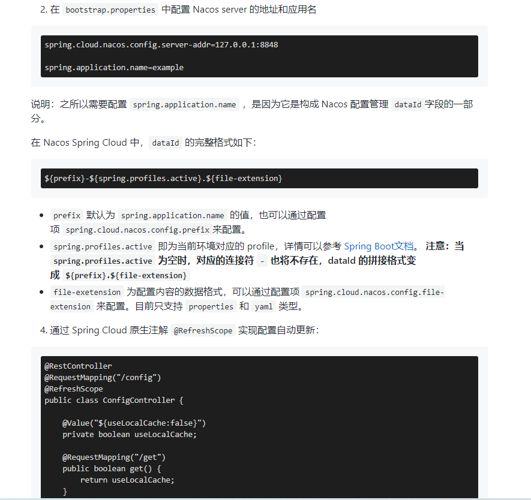

- [Spring常见问题](https://mp.weixin.qq.com/s/u3U1l3HvG6Dm6UJRB1epIA)
- [spring4all](http://www.spring4all.com/)
- [https://docs.spring.io/spring-framework/docs/](https://docs.spring.io/spring-framework/docs/)

# 目录
- [Spring](#Spring)
    - [为什么使用Spring](#为什么使用Spring)
    - [Spring模块](#Spring模块)
    - [IOC](#IOC)
        - [依赖注入](#依赖注入)
    - [AOP](#AOP)
    - [Spring MVC](#SpringMVC)
        - [SpringMVC流程](#SpringMVC流程)
    - [Spring Bean的生命周期](#SpringBean的生命周期)
    - [Spring事务](#Spring事务)
    - [访问数据库](#访问数据库)
    - [Web应用开发](#Web应用开发)
        - [使用REST](#使用REST)
        - [数据格式化 FormatterRegistry](#数据格式化)
    - [Spring Security](#SpringSecurity)
    - [Spring Data JPA](#SpringDataJPA)
    - [Spring注解](#Spring注解)
    - [Spring中使用的设计模式](#Spring中使用的设计模式)

- [SpringBoot](#SpringBoot)
    - [项目构建](#项目构建)
    - [起步依赖](#起步依赖)
    - [自动配置](#自动配置)
    - [自定义配置](#自定义配置)
        - [覆盖SpringBoot自动配置-TODO](#覆盖SpringBoot自动配置)
        - [通过属性文件外置配置](#通过属性文件外置配置)
            - [自动配置微调](#自动配置微调)
            - [应用程序Bean的配置外置-TODO](#应用程序Bean的配置外置)
            - [使用Profile进行配置](#使用Profile进行配置)
    - [Actuator：监控与管理](#Actuator监控与管理)
    - [SpringBoot注解](#SpringBoot注解)
        - [SpringBoot提供的自动配置中使用的条件化注解](#SpringBoot提供的自动配置中使用的条件化注解)

- [SpringCloud](#SpringCloud)
    - [Eureka](#Eureka)
    - [Feign](#Feign)
    - [Ribbon](#Ribbon)
    - [Hystrix](#Hystrix)
        - [客户端负载均衡模式](#客户端负载均衡模式)
        - [断路器模式](#断路器模式)
            - [断路器实现](#断路器实现)
            - [调用远程资源失败过多断路器设置](#调用远程资源失败过多断路器设置)
        - [后备模式](#后备模式)
            - [构建后备策略](#构建后备策略)
        - [舱壁模式](#舱壁模式)
            - [舱壁模式实现](#舱壁模式实现)
    - [Consul](#Consul)

- [SpringCloudAlibaba](#SpringCloudAlibaba)
    - [RPC框架 Dubbo](#Dubbo)
    - [注册配置中心 Nacos](#Nacos)
    - [流控组件 Sentinel](#Sentinel)
    - [分布式事务组件 Seata](#Seata)
    - [消息中间件 RocketMQ](#RocketMQ)
    
    **↓商业化组件↓**
    - [对象存储服务 OSS](#OSS)
    - [分布式任务调度组件 SchedulerX](#SchedulerX)
    - [全球短信服务 SMS](#SMS)
    
- [问题](#问题)
    - [注入对象为null](#注入对象为null)

[返回目录](#目录)

# Spring
## 为什么使用Spring
**Spring是一个轻量级的开发框架，旨在降低应用开发的复杂度，具有分层体系结构，可以集成其他框架。**

[返回目录](#目录)

## Spring模块
- Spring Core：基础,可以说 Spring 其他所有的功能都需要依赖于该类库。主要提供IOC依赖注入功能。
- Spring Aspects：该模块为与AspectJ的集成提供支持。
- Spring AOP：提供了面向切面的编程实现。
- Spring JDBC：Java数据库连接。
- Spring JMS：Java消息服务。
- Spring ORM：用于支持Hibernate等ORM工具。
- Spring Web：为创建Web应用程序提供支持。
- Spring Test：提供了对 JUnit 和 TestNG 测试的支持


[返回目录](#目录)

## IOC
- Inverse of Control:控制反转
- 应用本身不负责依赖对象的创建和维护，而是由外部容器负责，控制权由应用转移到外部容器。

[返回目录](#目录)

### 依赖注入
在运行期间，由外部容器动态的将依赖对象注入到组件中  
- **Spring依赖注入方式：**  
    - 构造函数注入
    - setter注入
    - 注解方式
        - `@Component`+`@Autowired`，@Component注解就相当于定义了一个Bean，它有一个可选的名称，默认是mailService，即小写开头的类名。@Autowired相当于把指定类型的Bean注入到指定的字段中。和XML配置相比，@Autowired大幅简化了注入，因为它不但可以写在set()方法上，还可以直接写在字段上，甚至可以写在构造方法中。
            ```java
            @Component
            public class UserService {
                @Autowired
                MailService mailService;
            
                ...
            }
            ```

[返回目录](#目录)

## AOP
- 将那些与业务无关，却为业务模块所共同调用的逻辑或责任封装起来，便于减少系统的重复代码，降低模块间的耦合度，并有利于未来的可拓展性和可维护性。  
- 使用动态代理的方式在执行方法前后或出现异常之后加入相关逻辑。  
- **用来：**
    - 事务处理
        - Spring提供的`@Transactional`可以声明在Bean上，表示希望在一个数据库事务中被调用：
            ```java
            @Component
            public class UserService {
                // 有事务:
                @Transactional
                public User createUser(String name) {
                    ...
                }
                // 无事务:
                public boolean isValidName(String name) {
                    ...
                }
                // 有事务:
                @Transactional
                public void updateUser(User user) {
                    ...
                }
            }
            ```
            - 或者直接在class级别注解，表示“所有public方法都被声明”：
                ```java
                @Component
                @Transactional
                public class UserService {
                    ...
                }
                ```
    - 权限控制
    - 日志管理
        - 不推荐使用：无差别全覆盖，即某个包下面的所有Bean的所有方法都会被这个check()方法拦截。
        - 引入依赖，依赖会自动引入AspectJ，使用AspectJ实现AOP比较方便。
            ```xml
            <dependency>
                <groupId>org.springframework</groupId>
                <artifactId>spring-aspects</artifactId>
                <version>${spring.version}</version>
            </dependency>
            ```
        - 定义一个LoggingAspect：
            - `@Before`后面的字符串是告诉AspectJ应该在何处执行该方法，这里写的意思是：执行UserService的每个public方法前执行doAccessCheck()代码。
            - `@Around`可以决定是否执行目标方法，因此，我们在doLogging()内部先打印日志，再调用方法，最后打印日志后返回结果。
            - `@Component`表示它本身也是一个Bean。
            - `@Aspect`表示它的`@Before`标注的方法需要注入到UserService的每个public方法执行前，`@Around`标注的方法需要注入到MailService的每个public方法执行前后。
            ```java
            @Aspect
            @Component
            public class LoggingAspect {
                // 在执行UserService的每个方法前执行:
                @Before("execution(public * com.itranswarp.learnjava.service.UserService.*(..))")
                public void doAccessCheck() {
                    System.err.println("[Before] do access check...");
                }
            
                // 在执行MailService的每个方法前后执行:
                @Around("execution(public * com.itranswarp.learnjava.service.MailService.*(..))")
                public Object doLogging(ProceedingJoinPoint pjp) throws Throwable {
                    System.err.println("[Around] start " + pjp.getSignature());
                    Object retVal = pjp.proceed();
                    System.err.println("[Around] done " + pjp.getSignature());
                    return retVal;
                }
            }
            ```
        - 给@Configuration类加上一个`@EnableAspectJAutoProxy`注解：
            - Spring的IoC容器看到这个注解，就会自动查找带有`@Aspect`的Bean，然后根据每个方法的`@Before`、`@Around`等注解把AOP注入到特定的Bean中。
            ```java
            @Configuration
            @ComponentScan
            @EnableAspectJAutoProxy
            public class AppConfig {
                ...
            }
            ```
        - 执行代码，我们可以看到以下输出：
            ```
            [Before] do access check...
            [Around] start void com.itranswarp.learnjava.service.MailService.sendRegistrationMail(User)
            Welcome, test!
            [Around] done void com.itranswarp.learnjava.service.MailService.sendRegistrationMail(User)
            [Before] do access check...
            [Around] start void com.itranswarp.learnjava.service.MailService.sendLoginMail(User)
            Hi, Bob! You are logged in at 2020-02-14T23:13:52.167996+08:00[Asia/Shanghai]
            [Around] done void com.itranswarp.learnjava.service.MailService.sendLoginMail(User)
            ```

[返回目录](#目录)

## SpringMVC
### SpringMVC流程
1. 用户发送请求到**`DispatcherServlet`前端控制器**；
2. `DispatcherServlet`收到请求后调用**`HandlerMapping`处理器映射器**；
3. 处理器映射器根据请求url找到具体的处理器，生成处理器对象和处理器拦截器(如果有则生成)，一并返回给`DispatcherServlet`；
4. `DispatcherServlet`之后通过**`HandlerAdapter`处理器适配器**调用、执行**处理器`Controller`(后端控制器)**，执行完后返回**`ModelAndView`**；
5. `DispatcherServlet`将`ModelAndView`传给**`ViewReslover`视图解析器**进行解析，解析完后返回具体**`View`视图**；
6. `DispatcherServlet`对解析后的`View`进行渲染(将模型数据填充到视图中)，并返回给用户。

[返回目录](#目录)

## SpringBean的生命周期

[Spring 的 Bean 生命周期](https://mp.weixin.qq.com/s/Vb54HLVKmD99KU0gppriUA)


[返回目录](#目录)

## Spring事务
### 事务的特性
- 原子性（Atomicity）：事务是一个原子操作，由一系列动作组成。事务的原子性确保动作要么全部完成，要么完全不起作用。
- 一致性（Consistency）：一旦事务完成（不管成功还是失败），系统必须确保它所建模的业务处于一致的状态，而不会是部分完成部分失败。在现实中的数据不应该被破坏。
- 隔离性（Isolation）：可能有许多事务会同时处理相同的数据，因此每个事务都应该与其他事务隔离开来，防止数据损坏。
- 持久性（Durability）：一旦事务完成，无论发生什么系统错误，它的结果都不应该受到影响，这样就能从任何系统崩溃中恢复过来。通常情况下，事务的结果被写到持久化存储器中。

### 事务的传播机制
事务的传播性一般用在事务嵌套的场景，比如一个事务方法里面调用了另外一个事务方法，那么两个方法是各自作为独立的方法提交还是内层的事务合并到外层的事务一起提交，这就是需要事务传播机制的配置来确定怎么样执行。  
常用的事务传播机制如下：  
- `PROPAGATION_REQUIRED` Spring默认的传播机制，能满足绝大部分业务需求，如果外层有事务，则当前事务加入到外层事务，一块提交，一块回滚。如果外层没有事务，新建一个事务执行
- `PROPAGATION_REQUIRES_NEW` 该事务传播机制是每次都会新开启一个事务，同时把外层事务挂起，当当前事务执行完毕，恢复上层事务的执行。如果外层没有事务，执行当前新开启的事务即可
- `PROPAGATION_SUPPORTS` 如果外层有事务，则加入外层事务，如果外层没有事务，则直接使用非事务方式执行。完全依赖外层的事务
- `PROPAGATION_NOT_SUPPORTED` 该传播机制不支持事务，如果外层存在事务则挂起，执行完当前代码，则恢复外层事务，无论是否异常都不会回滚当前的代码
- `PROPAGATION_NEVER` 该传播机制不支持外层事务，即如果外层有事务就抛出异常
- `PROPAGATION_MANDATORY` 与NEVER相反，如果外层没有事务，则抛出异常
- `PROPAGATION_NESTED` 该传播机制的特点是可以保存状态保存点，当前事务回滚到某一个点，从而避免所有的嵌套事务都回滚，即各自回滚各自的，如果子事务没有把异常吃掉，基本还是会引起全部回滚的。

### 事务的隔离级别
事务的隔离级别定义一个事务可能受其他并发务活动活动影响的程度，可以把事务的隔离级别想象为这个事务对于事物处理数据的自私程度。  
在一个典型的应用程序中，多个事务同时运行，经常会为了完成他们的工作而操作同一个数据。并发虽然是必需的，但是会导致以下问题：  
- `脏读（Dirty read）` 脏读发生在一个事务读取了被另一个事务改写但尚未提交的数据时。如果这些改变在稍后被回滚了，那么第一个事务读取的数据就会是无效的。
- `不可重复读（Nonrepeatable read）` 不可重复读发生在一个事务执行相同的查询两次或两次以上，但每次查询结果都不相同时。这通常是由于另一个并发事务在两次查询之间更新了数据。
- `幻读（Phantom reads）` 幻读和不可重复读相似。当一个事务（T1）读取几行记录后，另一个并发事务（T2）插入了一些记录时，幻读就发生了。在后来的查询中，第一个事务（T1）就会发现一些原来没有的额外记录。

在理想状态下，事务之间将完全隔离，从而可以防止这些问题发生。然而，完全隔离会影响性能，因为隔离经常涉及到锁定在数据库中的记录（甚至有时是锁表）。完全隔离要求事务相互等待来完成工作，会阻碍并发。因此，可以根据业务场景选择不同的隔离级别。
- `ISOLATION_DEFAULT`	使用后端数据库默认的隔离级别
- `ISOLATION_READ_UNCOMMITTED`	允许读取尚未提交的更改。可能导致脏读、幻读或不可重复读。
- `ISOLATION_READ_COMMITTED`	（Oracle 默认级别）允许从已经提交的并发事务读取。可防止脏读，但幻读和不可重复读仍可能会发生。
- `ISOLATION_REPEATABLE_READ`	（MYSQL默认级别）对相同字段的多次读取的结果是一致的，除非数据被当前事务本身改变。可防止脏读和不可重复读，但幻读仍可能发生。
- `ISOLATION_SERIALIZABLE`	完全服从ACID的隔离级别，确保不发生脏读、不可重复读和幻影读。这在所有隔离级别中也是最慢的，因为它通常是通过完全锁定当前事务所涉及的数据表来完成的。
### 只读
- 如果一个事务只对数据库执行读操作，那么该数据库就可能利用那个事务的只读特性，采取某些优化措施。通过把一个事务声明为只读，可以给后端数据库一个机会来应用那些它认为合适的优化措施。由于只读的优化措施是在一个事务启动时由后端数据库实施的， 因此，只有对于那些具有可能启动一个新事务的传播行为（PROPAGATION_REQUIRES_NEW、PROPAGATION_REQUIRED、 ROPAGATION_NESTED）的方法来说，将事务声明为只读才有意义。
### 事务超时
- 为了使一个应用程序很好地执行，它的事务不能运行太长时间。因此，声明式事务的下一个特性就是它的超时。
- 假设事务的运行时间变得格外的长，由于事务可能涉及对数据库的锁定，所以长时间运行的事务会不必要地占用数据库资源。这时就可以声明一个事务在特定秒数后自动回滚，不必等它自己结束。
- 由于超时时钟在一个事务启动的时候开始的，因此，只有对于那些具有可能启动一个新事务的传播行为（PROPAGATION_REQUIRES_NEW、PROPAGATION_REQUIRED、ROPAGATION_NESTED）的方法来说，声明事务超时才有意义。
### 回滚规则
- 在默认设置下，事务只在出现运行时异常（runtime exception）时回滚，而在出现受检查异常（checked exception）时不回滚（这一行为和EJB中的回滚行为是一致的）。
- 不过，可以声明在出现特定受检查异常时像运行时异常一样回滚。同样，也可以声明一个事务在出现特定的异常时不回滚，即使特定的异常是运行时异常。

### Spring声明式事务配置参考
事物配置中有哪些属性可以配置?以下只是简单的使用参考  

- 事务的传播性：`@Transactional(propagation=Propagation.REQUIRED)`
- 事务的隔离级别：`@Transactional(isolation = Isolation.READ_UNCOMMITTED)`
读取未提交数据(会出现脏读, 不可重复读) 基本不使用

- 只读：`@Transactional(readOnly=true)`
该属性用于设置当前事务是否为只读事务，设置为true表示只读，false则表示可读写，默认值为false。
- 事务的超时性：`@Transactional(timeout=30)`
- 回滚：
    - 指定单一异常类：`@Transactional(rollbackFor=RuntimeException.class)`
    - 指定多个异常类：`@Transactional(rollbackFor={RuntimeException.class, Exception.class})`

### 事务配置
```xml
<!--  
     事务管理： Spring声明式事务管理 。
     spring默认的事务隔离级别是用的数据库的默认事务隔离级别，不同数据库级别也不尽相同。
     使用事务，要引入aop和tx的命名空间 ：即文件头第4行。
    (开启注解事务，使用时在方法上加上注解@Transactional(...)即可 )
-->
<!-- 事务管理器 -->
<bean id="transactionManager"
    class="org.springframework.jdbc.datasource.DataSourceTransactionManager">
    <property name="dataSource" ref="dataSource" />
</bean>

<!-- 通知传播行为 -->
<tx:advice id="txAdvice" transaction-manager="transactionManager">
    <tx:attributes>
        <tx:method name="insert*" propagation="REQUIRED" />
        <tx:method name="delete*" propagation="REQUIRED" />
        <tx:method name="upd*" propagation="REQUIRED" />
        <!-- 只读表示对数据的操作是读取，报异常后不用回滚（不是只读的数据出异常，事务会回滚）。 -->
        <tx:method name="select*" propagation="SUPPORTS" read-only="true" />
        <tx:method name="get" propagation="SUPPORTS" read-only="true" />
    </tx:attributes>
</tx:advice>

<!-- 配置事务切入点 -->
<aop:config>
    <aop:pointcut id="servicePointcut" expression="execution(* com.service.impl..*ServiceImpl.*(..))"/>
    <aop:advisor advice-ref="txAdvice" pointcut-ref="servicePointcut"/>
</aop:config>
```

[返回目录](#目录)

## 访问数据库

[返回目录](#目录)

## Web应用开发
### 使用REST

[返回目录](#目录)


### 数据格式化

- 使用`FormatterRegistry`添加接口数据格式转换
```java
/**
 * 接口参数格式化
 * 作用：支持接口枚举参数小写格式
 *
 * @param registry
 */
@Autowired
public void addFormatters(FormatterRegistry registry) {
    registry.addConverter(String.class, WeatherTypeEnum.class, source -> WeatherTypeEnum.valueOf(source.toUpperCase()));
}
```

[返回目录](#目录)

## SpringSecurity
- 添加依赖
    ```xml
    <dependency>
        <groupId>org.springframework.boot</groupId>
        <artifactId>spring-boot-starter-security</artifactId>
        <version>2.3.0.RELEASE</version>
    </dependency>
    ```
- 安全特性
    - 所有的HTTP请求路径都需要认证；
    - 不需要特定的角色和权限；
    - 没有登录页面；
    - 认证过程是通过HTTP basic认证对话框实现的；
    - 系统只有一个用户，用户名为user。（密码随机生成，被写入应用日志中，大致为： `Using default security password：xxx`）
    
    - **要确保应用的安全性，至少还需要配置如下功能：**  
        - 通过登录页面来提示用户进行认证，而不是使用HTTP basic认证对话框；
        - 提供多个用户，并提供一个注册页面，以便新用户注册进来；
        - 对不同的请求路径，执行不同的安全规则。如：主页和注册页不需要认证。

- 配置Spring Security
//TODO
- 基于内存的用户存储
//TODO
- 基于JDBC的用户存储
//TODO
- 基于LDAP作为后端的用户存储
//TODO
- 自定义用户认证
//TODO

[返回目录](#目录)

## SpringDataJPA
- 添加依赖
    ```xml
    <dependency>
        <groupId>org.springframework.boot</groupId>
        <artifactId>spring-boot-starter-data-jpa</artifactId>
        <version>2.3.0.RELEASE</version>
    </dependency>
    ```
- 将领域对象标注为实体
//TODO
- 声明 JPA repository
//TODO
- 自定义 JPA repository
//TODO

[返回目录](#目录)

## Spring注解
### Spring注解使用
1. 在`applicationContext.xml`配置文件**导入命名空间及规范**
```xml
<?xml version="1.0" encoding="UTF-8"?>
<beans xmlns="http://www.springframework.org/schema/beans"
    xmlns:xsi="http://www.w3.org/2001/XMLSchema-instance"
    xmlns:aop="http://www.springframework.org/schema/aop"
    xmlns:context="http://www.springframework.org/schema/context"
    xmlns:tx="http://www.springframework.org/schema/tx"
    xsi:schemaLocation="http://www.springframework.org/schema/beans 
        http://www.springframework.org/schema/beans/spring-beans-3.0.xsd
        http://www.springframework.org/schema/context 
        http://www.springframework.org/schema/context/spring-context-3.0.xsd
        http://www.springframework.org/schema/tx 
        http://www.springframework.org/schema/tx/spring-tx-3.0.xsd
        http://www.springframework.org/schema/aop 
        http://www.springframework.org/schema/aop/spring-aop-3.0.xsd">
</beans>
```
2. 在`applicationContext.xml`配置文件**配置扫描包**
```xml
<!-- 指定Spring IoC容器扫描的包，自动扫描代码中的注解 -->
<context:component-scan base-package="com.outman.spring" />
```
3. 使用注解
```java
@Controller
public class TestController {
    @Autowired
    RestTemplate rest;
    @RequestMapping(value="/rest")
    public String rest() {
        return "test";
    }
}
```

[返回目录](#目录)

### Spring常用注解

[https://mp.weixin.qq.com/s/ZECIj3UCyBITJEbtLdE2gA](https://mp.weixin.qq.com/s/ZECIj3UCyBITJEbtLdE2gA)

类别 | 注解 | 位置 | 使用 | 作用  
---|---|---|---|---  
| Bean声明| @Component | |  | 定义基础层的通用组件，没有明确角色
|         | @Service | |  | 定义业务逻辑层的服务组件
|         | @Repository | |  | 在数据访问层定义数据资源服务
|         | @Controller | |  | 定义控制器，表现层使用
| Bean注入| @Autowired | |  | 服务依赖注入，一般用于注入@Component、@Service定义的组件
|         | @Resource | |  | 服务依赖注入，一般用于注入@Repository定义的组件
| 配置类注解 | @Configuration | |  | 声明该类为配置类，其中@Value 属性可以直接和配置文件属性映射
|           | @Bean | |  | 注解在方法上，声明该方法返回值为一个Bean示例
| AOP注解 | @EnableAspectJAutoProxy | |  | 开启Spring对AspectJ代理的支持
|         | @Aspect | |  | 声明一个切面，使用@After、@Before、@Around定义通知(Advice)，可直接将拦截规则(切点)作为参数
|         | @After | |  | 在方法执行之后执行
|         | @Before | |  | 在方法执行之前执行
|         | @Around | |  | 在方法执行之前 和执行之后都执行
|         | @PointCut | |  | 声明一个切点
| Bean属性 | @Scope | |  | 设置Spring容器Bean实例的生命周期，取值有：singleton、prototype、request、session、global session
|         | @PostConstruct | |  | 声明方法在构造函数执行完后开始执行
|         | @PreDestroy | |  | 声明方法在Bean销毁之前执行
|         | @Value | |  | 为属性注入值
|         | @PropertySource | |  | 声明 和加载配置文件
| 异步操作注解 | @EnableAsync | |  | 声明在类上，开启对异步任务的支持
|            | @Async | |  | 声明方法是一个异步任务，Spring后台基于线程池异步执行该方法
| 定时任务相关 | @EnableScheduling | |  | 声明在调度类上，开启对任务调度的支持
|            | @Scheduled | |  | 声明一个定时任务，包括cron、fixDelay、fixRate等参数
| 开启功能支持 | @EnableAspectJAutoProxy | |  | 开启对AspectJ自动代理的支持
|            | @EnableAsync | |  | 开启对异步方法的支持
|            | @EnableScheduling | |  | 开启对计划任务的支持
|            | @EnableWebMVC | |  | 开启对Web MVC的配置支持
|            | @EnableConfigurationProperties | |  | 开启对@ConfigurationProperties注解配置 Bean的支持
|            | @EnableJpaRepositories | |  | 开启对SpringData JPA Repository的支持
|            | @EnableTransactionManagement | |  | 开启对事务的支持
|            | @EnableCaching | |  | 开启对缓存的支持
| 测试相关注解 | @RunWith | |  | 运行器，Spring中通常对JUnit的支持
|            | @ContextConfiguration | |  | 用来加载配置ApplicationContext，其中classes属性用来加载配置类
| SpringMVC注解 | @Controller | |  | 声明控制器类
|            | @RequestMapping | |  | 声明映射Web请求的地址和参数，包括访问路径和参数
|            | @ResponseBody | |  | 支持将返回值放在Response Body 体中返回，通常用于返回Json数据到前端
|            | @RequestBody | |  | 允许Request 的参数在Request Body 体中
|            | @PathVariable | |  | 用于接收基于路径的参数，通常作为RESTful接口的实现
|            | @RestController | |  | 组合注解，相当于@Controller 和@ResponseBody的组合
|            | @ExceptionHandler | |  | 用于全局控制器的异常处理
|            | @InitBinder | |  | WebDataBinder 用来自动绑定前台请求的参数到模型(Model)中


[返回目录](#目录)

## Spring中使用的设计模式
- 工厂设计模式：Spring使用工厂模式通过BeanFactory、ApplicationContext创建bean对象。
- 代理设计模式：Spring AOP功能的实现。
- 单例设计模式：Spring中的Bean默认都是单例的。
- 观察者模式：Spring事件驱动模型就是观察者模式很经典的一个应用。
- 适配器模式：Spring AOP的增强或通知(Advice)使用到了适配器模式，spring MVC中也是用到了适配器模式适配Controller。
- ......

[返回目录](#目录)

## Spring支持的bean作用域 
- singleton：唯一 bean 实例，Spring 中的 bean 默认都是单例的。
- prototype：每次请求都会创建一个新的 bean 实例。
- request：每一次HTTP请求都会产生一个新的bean，该bean仅在当前HTTP request内有效。
- session：每一次HTTP请求都会产生一个新的 bean，该bean仅在当前 HTTP session 内有效。
- ~~global-session：全局session作用域，仅仅在基于portlet的web应用中才有意义，Spring5已经没有了。~~  


//TODO
怎样开启注解装配  
前端控制器和后置处理器的区别  
Spring MVC流程  
Spring MVC核心入口类

[返回目录](#目录)

------

# SpringBoot
**SpringBoot是一个简化Spring开发的框架。可以用来快速构建和监护spring应用开发。**

## 项目构建
- 代码位置：src/main/java
- 资源位置：src/main/resources
    - 静态资源：src/main/resources/static
    - 模板文件：src/main/resources/templates
- 测试代码位置：src/test/java

## 起步依赖
```
<?xml version="1.0" encoding="UTF-8"?>
<project xmlns="http://maven.apache.org/POM/4.0.0"
         xmlns:xsi="http://www.w3.org/2001/XMLSchema-instance"
         xsi:schemaLocation="http://maven.apache.org/POM/4.0.0 http://maven.apache.org/xsd/maven-4.0.0.xsd">
    <modelVersion>4.0.0</modelVersion>

    <groupId>com.test.mall</groupId>
    <artifactId>mall</artifactId>
    <version>1.0-SNAPSHOT</version>
    <packaging>pom</packaging>
	<!--<packaging>jar</packaging>-->

    <modules>
        <module>mall-test</module>
    </modules>

    <parent>
        <groupId>org.springframework.boot</groupId>
        <artifactId>spring-boot-starter-parent</artifactId>
        <version>2.1.3.RELEASE</version>
        <relativePath/> <!-- lookup parent from repository -->
    </parent>
	<!--起步依赖-->
    <dependencies>
        <dependency>
            <groupId>org.springframework.boot</groupId>
            <artifactId>spring-boot-starter-web</artifactId>
        </dependency>
        <dependency>
            <groupId>org.springframework.boot</groupId>
            <artifactId>spring-boot-starter-actuator</artifactId>
        </dependency>
        <dependency>
            <groupId>org.springframework.boot</groupId>
            <artifactId>spring-boot-starter-aop</artifactId>
        </dependency>
        <dependency>
            <groupId>org.springframework.boot</groupId>
            <artifactId>spring-boot-starter-test</artifactId>
            <scope>test</scope>
        </dependency>
    </dependencies>

</project>
```

[返回目录](#目录)

## 自动配置
- 每当应用启动时，SpringBoot的自动配置都会自动做出将近200个涵盖安全、集成、持久化、Web开发等方面的配置选择，避免自己写配置。

## 自定义配置
### 覆盖SpringBoot自动配置
// TODO

[返回目录](#目录)

### 通过属性文件外置配置
- SpringBoot自动配置的Bean提供300多个用于微调的属性，调整设置时，只要在环境变量、Java系统属性、JNDI、命令行参数、属性文件中进行指定就可以了。
    - 比如：命令行禁用Banner`java -jar ***.jar --spring.main.show-banner=false`
- **SpringBoot多属性源加载顺序(优先级高到低)：**  
(1) 命令行参数  
(2) java:comp/env里的JNDI属性  
(3) JVM系统属性  
(4) 操作系统环境变量  
(5) 随机生成的带random.*前缀的属性（在设置其他属性时，可以引用它们，比如${random.long}）  
(6) 应用程序以外的application.properties或者appliaction.yml文件  
(7) 打包在应用程序内的application.properties或者appliaction.yml文件  
(8) 通过@PropertySource标注的属性源  
(9) 默认属性  
- **application.properties和application.yml文件能放在以下四个位置（优先级高到低）：**  
(1) 外置，在相对于应用程序运行目录的/config子目录里。  
(2) 外置，在应用程序运行的目录里。  
(3) 内置，在config包内。  
(4) 内置，在Classpath根目录。  
- **同一优先级位置同时有application.properties和application.yml，那么application.yml里的属性会覆盖application.properties里的属性。**

[返回目录](#目录)

#### 自动配置微调
- **禁用模板缓存**：Thymeleaf模板默认缓存可以提升应用性能，应用重启模板配置变更才会生效。
    - 可以设置命令行参数：`java -jar xxx.jar --spring.thymeleaf.cache=false`
    - 或者配置application.yml每次运行都会禁用缓存：
        ```yaml
        spring:
          thymeleaf:
            cache: false
        ```
    - 通过环境变量禁用Thymeleaf缓存：`export spring_thymeleaf_cache=false`
- **配置嵌入式服务器**：运行SpringBoot应用时，应用会启动一个嵌入式的服务器（默认Tomcat），监听8080端口。如果有多个应用同时运行时就要设置监听端口防止冲突。
    - 命令行：`java -jar xxx.jar --server.port=8000`
    - application.yml：
        ```yaml
        server:
          port: 8000
        ```
- **配置日志**：SpringBoot默认使用Logback记录日志。
    - 若使用Log4j2：排除默认日志依赖，添加Log4j2依赖
        ```xml
        <dependency>
            <groupId>org.springframework.boot</groupId>
            <artifactId>spring-boot-starter</artifactId>
            <exclusions>
                <exclusion>
                    <groupId>org.springframework.boot</groupId>
                    <artifactId>spring-boot-starter-logging</artifactId>
                </exclusion>
            </exclusions>
        </dependency>
        
        <dependency>
            <groupId>org.springframework.boot</groupId>
            <artifactId>spring-boot-starter-log4j2</artifactId>
        </dependency>
        ```
    - 在`src/main/resources`下创建文件`logback.xml`：可以控制日志配置
        ```xml
        <configuration>
          <appender name="STDOUT" class="ch.qos.logback.core.ConsoleAppender">
            <encoder>
              <pattern>
                %d{HH:mm:ss.SSS} [%thread] %-5level %logger{36} - %msg%n
              </pattern>
            </encoder>
          </appender>
          <logger name="root" level="INFO" />
          <root level="INFO">
            <appender-ref ref="STDOUT" />
          </root>
        </configuration>
        ```
    - 使用application.yml配置，设置根日志级别WARN、SpringSecurity为DEBUG，输出日志到`var/logs/readinglist.log`，默认10M切分一次：
        ```yaml
        logging:
          path: /var/logs/
          file: readinglist.log
          level:
            root: WARN
            org:
              springframework:
                security: DEBUG
        ```
- **配置数据源**：
    - 使用application.yml配置：
        ```yaml
        spring:
          datasource:
            url: jdbc:mysql://localhost/readinglist
            username: dbuser
            password: dbpass
            driver-class-name: com.mysql.jdbc.Driver #指定JDBC驱动,一般不需要
        ```

[返回目录](#目录)

#### 应用程序Bean的配置外置
//TODO

[返回目录](#目录)

#### 使用Profile进行配置
- 向application.yml里添加spring.profiles.active属性：
```
spring:
  profiles:
    active: prod
```
- 命令行：  
```
java -jar xxx.jar --spring.profiles.active=prod
```
**多环境配置**  
命名格式：application-{profile}.properties 或 application-{profile}.yml  
- 开发环境：application-dev.yml
- 生产环境：application-prod.yml
- 测试环境：application-test.yml

**同一YAML文件进行多环境配置**  
```
logging:
  level:
    root: INFO
---
spring:
  profiles: dev
  
logging:
  level:
    root: DEBUG
---
spring:
  profiles: prod
  
logging:
  path: /tmp/
  file: BookWorm.log
  level:
    root: WARN
```

[返回目录](#目录)

## Actuator监控与管理
- **添加依赖**  
    ```
    <dependency>
      <groupId>org.springframework.boot</groupId>
      <artifactId>spring-boot-starter-actuator</artifactId>
    </dependency>
    ```
- **Actuator提供13个端点**  

HTTP方法 | 路径 | 描述  
---|---|---  
/autoconfig | 提供了一份自动配置报告，记录哪些自动配置条件通过了，哪些没通过 | GET 
/configprops | 描述配置属性（包含默认值）如何注入Bean | GET 
/beans | 描述应用程序上下文里全部的Bean，以及它们的关系 | GET 
/dump | 获取线程活动的快照 | GET 
/env | 获取全部环境属性 | GET 
/env/{name} | 根据名称获取特定的环境属性值 | GET 
/health | 报告应用程序的健康指标，这些值由HealthIndicator的实现类提供 | GET 
/info | 获取应用程序的定制信息，这些信息由info打头的属性提供 | GET 
/mappings | 描述全部的URI路径，以及它们和控制器（包含Actuator端点）的映射关系 | GET 
/metrics | 报告各种应用程序度量信息，比如内存用量和HTTP请求计数 | GET 
/metrics/{name} | 报告指定名称的应用程序度量值 | GET 
/trace | 提供基本的HTTP请求跟踪信息（时间戳、HTTP头等） | GET 
/shutdown | 关闭应用程序，要求endpoints.shutdown.enabled设置为true | POST  

- **查看配置明细**  
  向/beans（在本地运行时是`http://localhost:8080/beans`）发起GET请求后，返回一个描述每个Bean信息的JSON文档。  
  返回的JSON包含信息：
    - bean：Spring应用程序上下文中的Bean名称或ID。
    - resource：.class文件的具体路径。
    - dependencies：依赖的Bean名称。
    - scope：Bean的作用域（通常是单例，这也是默认作用域）。
    - type：Bean的Java类型。

[返回目录](#目录)

## SpringBoot注解
注解 | 位置 | 使用 | 作用  
-|-|-|-  
@SpringBootApplication | 类上 |  | 开启Spring的组件扫描和SpringBoot的自动配置功能
@Entity | 类上 |  | 表明它是一个JPA（java持久化接口）实体
@Id | 字段上 |  | 说明这个字段是实体的唯一标识
@GeneratedValue | 字段上 | @GeneratedValue(strategy=GenerationType.AUTO) | 这个字段的值是自动生成的
@Controller | 类上 |  | 这样组件扫描会自动将其注册为Spring应用程序上下文里的一个Bean
@RequestMapping | 类上 | @RequestMapping(value="/{reader}", method=RequestMethod.GET) | 将其中所有的处理器方法都映射到了“/”这个URL路径上
@Configuration | 类上 |  | 从其他配置类里导入了一些额外配置
@Conditional | | |
@ConfigurationProperties | 类上 | @ConfigurationProperties(prefix="amazon") | 说明该Bean的属性应该是（通过setter方法）从配置属性值注入的
@Profile | 类上 | @Profile("prod") | @Profile注解要求运行时激活prod Profile，从而应用该配置

[返回目录](#目录)

### SpringBoot提供的自动配置中使用的条件化注解
条件化注解 | 配置生效条件  
-|-  
@ConditionalOnBean | 配置了某个特定Bean
@ConditionalOnMissingBean | 没有配置特定的Bean
@ConditionalOnClass | Classpath里有指定的类，@ConditionalOnClass({ TestA.class, TestB.class })
@ConditionalOnMissingClass | Classpath里缺少指定的类
@ConditionalOnExpression | 给定的Spring Expression Language（SpEL）表达式计算结果为true
@ConditionalOnJava | Java的版本匹配特定值或者一个范围值
@ConditionalOnJndi | 参数中给定的JNDI位置必须存在一个，如果没有给参数，则要有JNDI InitialContext
@ConditionalOnProperty | 指定的配置属性要有一个明确的值
@ConditionalOnResource | Classpath里有指定的资源
@ConditionalOnWebApplication | 这是一个Web应用程序
@ConditionalOnNotWebApplication | 这不是一个Web应用程序

[返回目录](#目录)

------

# SpringCloud
- SpringCloud是一个解决微服务架构实施的综合性解决框架，它整合了许多被广泛实践和证明过的框架作为实施的基础部件，并在该体系基础上创建了一些优秀的边缘组件。通过一些简单的注解，就可以快速的在应用中配置一下常用模块并构建庞大的分布式系统。  
- SpringCloud是一个基于SpringBoot实现的微服务架构开发工具，为微服务架构中涉及的配置管理、服务治理、断路器、智能路由、微代理、控制总线、全局锁、决策竞选、分布式会话、集群状态管理等操作提供一种简单的开发方式。
- [Spring Cloud configuration properties](https://docs.spring.io/spring-cloud/docs/2020.0.0/reference/html/configprops.html)
    - [Spring-Cloud-configuration-properties.xlsx](../resources/static/doc/Spring-Cloud-configuration-properties.xlsx)
- [Spring Cloud 2020.0.0](https://docs.spring.io/spring-cloud/docs/2020.0.0/reference/html/)


## Eureka
- 服务治理组件，包含服务注册中心、服务注册与发现机制的实现


### [Eureka实战](https://github.com/Panl99/demo/tree/master/demo-eureka/src/main/java/com/lp/demoeureka/)


[目录](#目录)

## Feign
- 声明式、模板化的REST客户端，可以更加便捷、优雅的调用HTTP API
- 使用简单：
    - 创建一个接口
    - 给接口添加一些注解
- 启动注解：`@EnableFeignClients`
- 依赖：
```xml
<dependency>
    <groupId>org.springframework.cloud</groupId>
    <artifactId>spring-cloud-starter-openfeign</artifactId>
    <version>2.2.5.RELEASE</version>
</dependency>
```
- [官方文档：https://docs.spring.io/spring-cloud-openfeign/docs/2.2.5.RELEASE/reference/html/](https://docs.spring.io/spring-cloud-openfeign/docs/2.2.5.RELEASE/reference/html/)

[目录](#目录)

## Ribbon
- 客户端负载均衡器。
- 为Ribbon配置服务提供者地址列表后，Ribbon就会基于设置的负载均衡算法，自动的帮助服务消费者去请求。

[目录](#目录)

## Hystrix
- 容错管理组件，实现断路器模式，帮助服务依赖中出现延迟和为故障提供强大的容错能力
- 客户端弹性模式：远程服务发生错误时保护远程资源的客户端免于崩溃。目的使客户端“快速失败”，避免消耗资源（如：数据库连接、线程池），防止远程服务的问题向客户端的消费者传播。
    - 客户端负载均衡模式
    - 断路器模式
    - 后备模式
    - 舱壁模式
- 依赖：
    ```xml
    <dependency>
        <groupId>org.springframework.cloud</groupId>
        <artifactId>spring-cloud-starter-netflix-hystrix</artifactId>
        <version>2.2.5.RELEASE</version>
    </dependency>
    <!--下依赖停更，不建议使用-->
    <dependency>
        <groupId>org.springframework.cloud</groupId>
        <artifactId>spring-cloud-starter-hystrix</artifactId>
        <version>1.4.7.RELEASE</version>
    </dependency>
    ```
- 启动注解：`@EnableCircuitBreaker`（用于启动类Application.java）
### 客户端负载均衡模式
- 让客户端从服务注册中心查找服务所有实例，然后缓存服务实例的物理位置。
- 当消费者调用该服务实例时，客户端负载均衡器将从它维护的服务实例池中返回实例的一个位置。
- 客户端负载均衡器位于服务客户端和服务消费者之间，可以检测服务实例的健康状态，当检测到服务实例不健康时，会将它从服务实例池中移除，并禁止服务调用访问该实例。
- **[Ribbon](#Ribbon)** 提供客户端负载均衡功能。

### 断路器模式
- 远程服务被调用时间时间过长，断路器会中断此次调用。
- 断路器会监视所有对远程资源的调用，如果对某一远程资源调用失败过多，断路器会快速断开调用，并阻止再次调用失败的远程资源。

**断路器实现：**
- 标记方法由Hystrix断路器管理的注解：`@HystrixCommand`
    - 该注解会标示Spring生成一个动态代理包装该方法，并会通过专门用于处理远程调用的线程池来管理对该方法的所有调用。
    - 当调用被`@HystrixCommand`标注的方法超过`1000ms`（默认1秒）时，断路器会中断对该方法的调用。
- 自定义断路器超时时间：`@HystrixCommand(commandProperties = {@HystrixProperty(name = "executin.isolation.thread.timeoutInMilliseconds", value = "3000")})`
    - 设置最大超时时间`3s`。
- 类级属性设置注解：`@DefaultProperties`
    - 例如：类中所有资源超时时间均为10s
        ```java
        @DefaultProperties(
            commandProperties = {
                @HystrixProperty(name = "executin.isolation.thread.timeoutInMilliseconds", value = "10000")
            }
        )
        public class MyService {   }
        ```

**调用远程资源失败过多断路器设置：**
```java
@HystrixCommand(
    fallbackMethod = "buildFallbackLicenseList",
    threadPoolKey = "licenseByOrgThreadPool",   //线程池名称
    threadPoolProperties = {
         @HystrixProperty(name = "coreSize", value="30"),    //线程池中最大线程数
         @HystrixProperty(name = "maxQueueSize", value="10")    //定义一个位于线程池前的队列，可以对传入的请求排队
    },
    commandProperties = {
         @HystrixProperty(name="circuitBreaker.requestVolumeThreshold", value="10"), //断路器跳闸之前，10s之内连续调用数量
         @HystrixProperty(name="circuitBreaker.errorThresholdPercentage", value="75"),  //断路器跳闸之前，调用失败百分比
         @HystrixProperty(name="circuitBreaker.sleepWindowInMilliseconds", value="7000"),   //断路器跳闸之后，Hystrix尝试进行服务调用之前的等待时间
         @HystrixProperty(name="metrics.rollingStats.timeInMilliseconds", value="15000"),   //Hystrix监视服务调用问题的窗口大小，默认10000ms(10s)
         @HystrixProperty(name="metrics.rollingStats.numBuckets", value="5")    //Hystrix在一个监控窗口中维护的度量桶的数量，监视窗口内桶数越多，监控故障时间越低
    }
)
// 如上最后两个配置，Hystrix使用15s的窗口，将统计数据收集到长度为3s的5个桶中。
// 注意：检查的统计窗口越小 且窗口中保留的桶的数量越多，就越会加剧高请求服务的CPU利用率 和内存利用率。
```

### 后备模式
- 远程调用失败时，消费者会使用替代方式来执行操作，而不是生成异常。
- 通常涉及，从另一数据源查询数据，或将请求排队后续再来处理。

**构建后备策略：**
- 添加属性`fallbackMethod`：`@HystrixCommand(fallbackMethod = "buildFallbackLicenseList")`
    - 当调用该方法失败时，就会调用后备方法。
- 实现后备方法（必须与原始方法位于同一类中，并且与原始方法的参数一致：原始方法的参数都会传递给后备方法），例如：
    ```java
    private List<License> buildFallbackLicenseList(String organizationId){
        List<License> fallbackList = new ArrayList<>();
        License license = new License()
                .withId("0000000-00-00000")
                .withOrganizationId( organizationId )
                .withProductName("Sorry no licensing information currently available");
    
        fallbackList.add(license);
        return fallbackList;
    }
    ```

### 舱壁模式
- 应用于必须与多个远程资源交互的服务。
- 使用舱壁模式：可以把远程资源的调用分别分配到各自线程池中，降低了一个缓慢的远程资源调用拖垮整个应用程序的风险。
    - 默认，所有Hystrix命令会共享同一线程池来处理请求。
    - 每个远程资源都是隔离的，并分配给线程池。
    - 一个服务响应缓慢，那么这种服务调用的线程池会饱和并停止处理请求，但其他服务的调用会被分配给其他线程池而不受影响。

**舱壁模式实现：**
- 解决：在大量请求下，一个服务出现性能问题导致Java容器所有线程被刷爆，无法再继续处理请求，导致Java容器崩溃。
- 实现隔离的线程池：
    ```java
    @HystrixCommand(
        fallbackMethod = "buildFallbackLicenseList",  //后备方法
        threadPoolKey = "licenseByOrgThreadPool",   //线程池名称
        threadPoolProperties = {
             @HystrixProperty(name = "coreSize", value="30"),    //线程池中最大线程数
             @HystrixProperty(name = "maxQueueSize", value="10")    //定义一个位于线程池前的队列，可以对传入的请求排队
        }
    )
    ```

[目录](#目录)

## Consul

[目录](#目录)


# SpringCloudAlibaba
- [https://github.com/alibaba/spring-cloud-alibaba/wiki](https://github.com/alibaba/spring-cloud-alibaba/wiki)

## Dubbo

Apache Dubbo™ 是一款高性能 Java RPC 框架。

[dubbo github](https://github.com/apache/dubbo)

[Dubbo 2.7 官方文档](https://dubbo.apache.org/zh/docs/v2.7/user/quick-start/)

### 配置

```yml
# 将注册中心地址、元数据中心地址等配置集中管理，可以做到统一环境、减少开发侧感知。
dubbo:
  application:
    qos:
      port: 33333
  metadata-report:
    address: zookeeper://127.0.0.1:2181
  protocol:
    name: dubbo
    port: 20880
  registry:
    address: zookeeper://127.0.0.1:2181
    simplified: true
```

[目录](#目录)

## Nacos

阿里开源服务注册中心、配置中心组件。

配置中心：更适合将一些公共配置如注册中心、元数据中心配置等抽取以便做集中管理。

[Nacos官方文档](https://nacos.io/zh-cn/docs/quick-start-spring-cloud.html)

### 配置



### 启动

- 本地启动：`D:\Tools\Nacos\nacos\bin>startup.cmd -m standalone`

- 地址：`http://localhost:8848/nacos/`，`nacos/nacos`

[目录](#目录)

## Sentinel

阿里开源流控组件，把流量作为切入点，从流量控制、熔断降级、系统负载保护等多个维度保护服务的稳定性。

[github wiki](https://github.com/alibaba/Sentinel/wiki/%E4%BB%8B%E7%BB%8D)

[官方文档](https://sentinelguard.io/zh-cn/docs/introduction.html)


### 特性

#### 流量控制

流量控制有以下几个角度，可以自由选择控制的角度，并进行灵活组合，从而达到想要的效果。

- 资源的调用关系，例如资源的调用链路，资源和资源之间的关系；
- 运行指标，例如 QPS、线程池、系统负载等；
- 控制的效果，例如直接限流、冷启动、排队等。

#### 熔断降级

Sentinel 和 Hystrix 的原则是一致的: 当调用链路中某个资源出现不稳定(如timeout)，异常比例升高的时候，则对这个资源的调用进行限制，并让请求快速失败，避免影响到其它的资源。

在限制的手段上，Sentinel 和 Hystrix 采取了完全不一样的方法。

1. **Hystrix** 通过[线程池](https://github.com/Netflix/Hystrix/wiki/How-it-Works#benefits-of-thread-pools)的方式，来对依赖(对应Sentinel资源)进行了隔离。
   - 好处：资源和资源之间做到了最彻底的隔离。
   - 缺点：除了增加了线程切换的成本，还需要预先给各个资源做线程池大小的分配。

2. **Sentinel** 采取了两种手段:

   - 通过并发线程数进行限制

     和资源池隔离的方法不同，Sentinel 通过限制资源并发线程的数量，来减少不稳定资源对其它资源的影响。好处：这样不但没有线程切换的损耗，也不需要您预先分配线程池的大小。当某个资源出现不稳定的情况下，例如响应时间变长，对资源的直接影响就是会造成线程数的逐步堆积。当线程数在特定资源上堆积到一定的数量之后，对该资源的新请求就会被拒绝。堆积的线程完成任务后才开始继续接收请求。

   - 通过响应时间对资源进行降级

     除了对并发线程数进行控制以外，Sentinel 还可以通过响应时间来快速降级不稳定的资源。当依赖的资源出现响应时间过长后，所有对该资源的访问都会被直接拒绝，直到过了指定的时间窗口之后才重新恢复。

#### 系统负载保护

Sentinel 同时提供[系统维度的自适应保护能力](https://sentinelguard.io/zh-cn/docs/system-adaptive-protection.html)。防止雪崩，是系统防护中重要的一环。当系统负载较高的时候，如果还持续让请求进入，可能会导致系统崩溃，无法响应。在集群环境下，网络负载均衡会把本应这台机器承载的流量转发到其它的机器上去。如果这个时候其它的机器也处在一个边缘状态的时候，这个增加的流量就会导致这台机器也崩溃，最后导致整个集群不可用。

针对这个情况，Sentinel 提供了对应的保护机制，让系统的入口流量和系统的负载达到一个平衡，保证系统在能力范围之内处理最多的请求。

### 原理

在 Sentinel 里面，所有的资源都对应一个资源名称以及一个 Entry。Entry 可以通过对主流框架的适配自动创建，也可以通过注解的方式或调用 API 显式创建；每一个 Entry 创建的时候，同时也会创建一系列功能插槽（slot chain）。这些插槽有不同的职责，例如:

- `NodeSelectorSlot` 负责收集资源的路径，并将这些资源的调用路径，以树状结构存储起来，用于根据调用路径来限流降级；

  ```java
    ContextUtil.enter("entrance1", "appA");
    Entry nodeA = SphU.entry("nodeA");
    if (nodeA != null) {
      nodeA.exit();
    }
    ContextUtil.exit();
  
    ContextUtil.enter("entrance2", "appA");
    nodeA = SphU.entry("nodeA");
    if (nodeA != null) {
      nodeA.exit();
    }
    ContextUtil.exit();
  //  ContextUtil.enter() 创建了一个名为 entrance1 的上下文，同时指定调用发起者为 appA；接着通过 SphU.entry()请求一个 token，如果该方法顺利执行没有抛 BlockException，表明 token 请求成功。
  // 注意：每个 DefaultNode 由资源 ID 和输入名称来标识。换句话说，一个资源 ID 可以有多个不同入口的 DefaultNode。
  // 以上代码将在内存中生成以下结构：
                     machine-root
                     /         \
                    /           \
            EntranceNode1   EntranceNode2
                  /               \
                 /                 \
         DefaultNode(nodeA)   DefaultNode(nodeA)
  // 上面的结构可以通过调用 curl http://localhost:8719/tree?type=root 来显示。   
  EntranceNode: machine-root(t:0 pq:1 bq:0 tq:1 rt:0 prq:1 1mp:0 1mb:0 1mt:0)
  -EntranceNode1: Entrance1(t:0 pq:1 bq:0 tq:1 rt:0 prq:1 1mp:0 1mb:0 1mt:0)
  --nodeA(t:0 pq:1 bq:0 tq:1 rt:0 prq:1 1mp:0 1mb:0 1mt:0)
  -EntranceNode2: Entrance1(t:0 pq:1 bq:0 tq:1 rt:0 prq:1 1mp:0 1mb:0 1mt:0)
  --nodeA(t:0 pq:1 bq:0 tq:1 rt:0 prq:1 1mp:0 1mb:0 1mt:0)
  
  t:threadNum  pq:passQps  bq:blockedQps  tq:totalQps  rt:averageRt  prq: passRequestQps 1mp:1m-passed 1mb:1m-blocked 1mt:1m-total
  ```

- `ClusterBuilderSlot` 则用于存储资源的统计信息以及调用者信息，例如该资源的 RT, QPS, thread count 等等，这些信息将用作为多维度限流，降级的依据；

  此插槽用于构建资源的 `ClusterNode` 以及调用来源节点。`ClusterNode` 保持资源运行统计信息（响应时间、QPS、block 数目、线程数、异常数等）以及原始调用者统计信息列表。来源调用者的名字由 `ContextUtil.enter(contextName，origin)` 中的 `origin` 标记。可通过如下命令查看某个资源不同调用者的访问情况：`curl http://localhost:8719/origin?id=caller`：

  ```
  id: nodeA
  idx origin  threadNum passedQps blockedQps totalQps aRt   1m-passed 1m-blocked 1m-total 
  1   caller1 0         0         0          0        0     0         0          0        
  2   caller2 0         0         0          0        0     0         0          0        
  ```

- `StatisticSlot` 则用于记录、统计不同纬度的 runtime 指标监控信息；

  Sentinel 底层采用高性能的滑动窗口数据结构 `LeapArray` 来统计实时的秒级指标数据，可以很好地支撑写多于读的高并发场景。

  - `clusterNode`：资源唯一标识的 ClusterNode 的 runtime 统计
  - `origin`：根据来自不同调用者的统计信息
  - `defaultnode`: 根据上下文条目名称和资源 ID 的 runtime 统计
  - 入口的统计

- `FlowSlot` 则用于根据预设的限流规则以及前面 slot 统计的状态，来进行流量控制；

  如果一个资源对应两条或者多条流控规则，会按照以下优先级校验直到至少一个规则生效为止：

  - 指定应用生效的规则，即针对调用方限流的；
  - 调用方为 other 的规则；
  - 调用方为 default 的规则。

- `AuthoritySlot` 则根据配置的黑白名单和调用来源信息，来做黑白名单控制；

- `DegradeSlot` 则通过统计信息以及预设的规则，来做熔断降级；

  主要针对资源的平均响应时间（RT）以及异常比率，来决定资源是否在接下来的时间被自动熔断掉。

- `SystemSlot` 则通过系统的状态，例如 load1 等，来控制总的入口流量，让入口的流量和当前系统的预计容量达到一个动态平衡；

  系统规则只对入口流量起作用（调用类型为 `EntryType.IN`），对出口流量无效。可通过 `SphU.entry(res, entryType)` 指定调用类型，如果不指定，默认是`EntryType.OUT`。


- `ProcessorSlot` 作为 SPI 接口进行扩展（1.7.2 版本以前 `SlotChainBuilder` 作为 SPI），使得 Slot Chain 具备了扩展的能力。可以自行加入自定义的 slot 并编排 slot 间的顺序，从而可以给 Sentinel 添加自定义的功能。

  

- [Sentinel 核心类解析](https://github.com/alibaba/Sentinel/wiki/Sentinel-%E6%A0%B8%E5%BF%83%E7%B1%BB%E8%A7%A3%E6%9E%90)

### 资源与规则

#### 定义资源

- 方式1：主流框架的默认适配

  [主流框架的适配](https://sentinelguard.io/zh-cn/docs/open-source-framework-integrations.html)

- 方式2：把需要控制流量的代码用 Sentinel API `SphU.entry("resourceName")` 和 `entry.exit()` 包围起来即可。

    ```java
    public static void main(String[] args) {
        // 配置规则.
        initFlowRules();
    
        while (true) {
            //资源名可使用任意有业务语义的字符串，比如方法名、接口名或其它可唯一标识的字符串。
            try (Entry entry = SphU.entry("resourceName")) {
                // 被保护的逻辑
                System.out.println("hello world");
            } catch (BlockException ex) {
                // 处理被流控的逻辑：限流、降级
                System.out.println("blocked!");
            }
        }
    }
    ```

    **不能使用try-with-resources的场景：**

    - 若 entry 的时候传入了热点参数，那么 exit 的时候也一定要带上对应的参数（`exit(count, args)`），否则可能会有统计错误。这个时候不能使用 try-with-resources 的方式。
    - 通过 `Tracer.trace(ex)` 来统计异常信息时，由于 try-with-resources 语法中 catch 调用顺序的问题，会导致无法正确统计异常数，因此统计异常信息时也不能在 try-with-resources 的 catch 块中调用 `Tracer.trace(ex)`。

    ```java
    Entry entry = null;
    // 务必保证finally会被执行
    try {
      // 资源名可使用任意有业务语义的字符串
      entry = SphU.entry("自定义资源名");
      // 被保护的业务逻辑
      // do something...
    } catch (BlockException e1) {
      // 资源访问阻止，被限流或被降级
      // 进行相应的处理操作
    } finally {
      if (entry != null) {
        entry.exit();
      }
    }
    ```

- 方式3：可以通过 [注解支持模块](https://sentinelguard.io/zh-cn/docs/annotation-support.html)，来定义资源（注解支持模块需要配合 Spring AOP 或者 AspectJ 一起使用。）

  Sentinel 支持通过 `@SentinelResource` 注解定义资源并配置 `blockHandler` 和 `fallback` 函数来进行限流之后的处理。
  
  ```java
  // 原本的业务方法.
  @SentinelResource(blockHandler = "blockHandlerForGetUser")
  public User getUserById(String id) {
      throw new RuntimeException("getUserById command failed");
  }
  
  // blockHandler 函数，原方法调用被限流/降级/系统保护的时候调用
  public User blockHandlerForGetUser(String id, BlockException ex) {
      return new User("admin");
  }
  ```
  
  注意 ：`blockHandler` 函数会在原方法被限流/降级/系统保护的时候调用，而 `fallback` 函数会针对所有类型的异常。请注意 `blockHandler` 和 `fallback` 函数的形式要求[Sentinel 注解支持文档](https://sentinelguard.io/zh-cn/docs/annotation-support.html)
  
- 方式4：返回布尔值方式定义资源

    `SphO` 提供 if-else 风格的 API。用这种方式，当资源发生了限流之后会返回 `false`，这个时候可以根据返回值，进行限流之后的逻辑处理。

    ```java
      // 资源名可使用任意有业务语义的字符串
      if (SphO.entry("自定义资源名")) {
        // 务必保证finally会被执行
        try {
          /**
          * 被保护的业务逻辑
          */
        } finally {
          SphO.exit();
        }
      } else {
        // 资源访问阻止，被限流或被降级
        // 进行相应的处理操作
      }
    ```

- 方式5：异步调用支持

  Sentinel 支持异步调用链路的统计。在异步调用中，需要通过 `SphU.asyncEntry(xxx)` 方法定义资源，并通常需要在异步的回调函数中调用 `exit` 方法。

  ```java
  try {
      AsyncEntry entry = SphU.asyncEntry(resourceName);
  
      // 异步调用.
      doAsync(userId, result -> {
          try {
              // 在此处处理异步调用的结果.
          } finally {
              // 在回调结束后 exit.
              entry.exit();
          }
      });
  } catch (BlockException ex) {
      // Request blocked.
      // Handle the exception (e.g. retry or fallback).
  }
  ```

  `SphU.asyncEntry(xxx)` 不会影响当前（调用线程）的 Context，因此以下两个 entry 在调用链上是平级关系（处于同一层），而不是嵌套关系：

  ```java
  // 调用链类似于：
  // -parent
  // ---asyncResource
  // ---syncResource
  asyncEntry = SphU.asyncEntry(asyncResource);
  entry = SphU.entry(normalResource);
  ```

  若在异步回调中需要嵌套其它的资源调用（无论是 `entry` 还是 `asyncEntry`），只需要借助 Sentinel 提供的上下文切换功能，在对应的地方通过 `ContextUtil.runOnContext(context, f)` 进行 Context 变换，将对应资源调用处的 Context 切换为生成的异步 Context，即可维持正确的调用链路关系。

  ```java
  public void handleResult(String result) {
      Entry entry = null;
      try {
          entry = SphU.entry("handleResultForAsync");
          // Handle your result here.
      } catch (BlockException ex) {
          // Blocked for the result handler.
      } finally {
          if (entry != null) {
              entry.exit();
          }
      }
  }
  
  public void someAsync() {
      try {
          AsyncEntry entry = SphU.asyncEntry(resourceName);
  
          // Asynchronous invocation.
          doAsync(userId, result -> {
              // 在异步回调中进行上下文变换，通过 AsyncEntry 的 getAsyncContext 方法获取异步 Context
              ContextUtil.runOnContext(entry.getAsyncContext(), () -> {
                  try {
                      // 此处嵌套正常的资源调用.
                      handleResult(result);
                  } finally {
                      entry.exit();
                  }
              });
          });
      } catch (BlockException ex) {
          // Request blocked.
          // Handle the exception (e.g. retry or fallback).
      }
  }
  ```

  此时的调用链就类似于：

  ```
  -parent
  ---asyncInvocation
  -----handleResultForAsync
  ```

  [AsyncEntryDemo👇](https://github.com/alibaba/Sentinel/blob/master/sentinel-demo/sentinel-demo-basic/src/main/java/com/alibaba/csp/sentinel/demo/AsyncEntryDemo.java)

  ```java
  package com.alibaba.csp.sentinel.demo;
  
  import java.util.Arrays;
  import java.util.List;
  import java.util.concurrent.CompletableFuture;
  import java.util.concurrent.TimeUnit;
  import java.util.function.Consumer;
  
  import com.alibaba.csp.sentinel.AsyncEntry;
  import com.alibaba.csp.sentinel.Entry;
  import com.alibaba.csp.sentinel.SphU;
  import com.alibaba.csp.sentinel.context.ContextUtil;
  import com.alibaba.csp.sentinel.slots.block.BlockException;
  import com.alibaba.csp.sentinel.slots.block.RuleConstant;
  import com.alibaba.csp.sentinel.slots.block.flow.FlowRule;
  import com.alibaba.csp.sentinel.slots.block.flow.FlowRuleManager;
  
  /**
   * An example for asynchronous entry in Sentinel.
   *
   * @author Eric Zhao
   * @since 0.2.0
   */
  public class AsyncEntryDemo {
  
      private void invoke(String arg, Consumer<String> handler) {
          CompletableFuture.runAsync(() -> {
              try {
                  TimeUnit.SECONDS.sleep(3);
                  String resp = arg + ": " + System.currentTimeMillis();
                  handler.accept(resp);
              } catch (Exception ex) {
                  ex.printStackTrace();
              }
          });
      }
  
      private void anotherAsync() {
          try {
              final AsyncEntry entry = SphU.asyncEntry("test-another-async");
  
              CompletableFuture.runAsync(() -> {
                  ContextUtil.runOnContext(entry.getAsyncContext(), () -> {
                      try {
                          TimeUnit.SECONDS.sleep(2);
                          // Normal entry nested in asynchronous entry.
                          anotherSyncInAsync();
  
                          System.out.println("Async result: 666");
                      } catch (InterruptedException e) {
                          // Ignore.
                      } finally {
                          entry.exit();
                      }
                  });
              });
          } catch (BlockException ex) {
              ex.printStackTrace();
          }
      }
  
      private void fetchSync() {
          Entry entry = null;
          try {
              entry = SphU.entry("test-sync");
          } catch (BlockException ex) {
              ex.printStackTrace();
          } finally {
              if (entry != null) {
                  entry.exit();
              }
          }
      }
  
      private void fetchSyncInAsync() {
          Entry entry = null;
          try {
              entry = SphU.entry("test-sync-in-async");
          } catch (BlockException ex) {
              ex.printStackTrace();
          } finally {
              if (entry != null) {
                  entry.exit();
              }
          }
      }
  
      private void anotherSyncInAsync() {
          Entry entry = null;
          try {
              entry = SphU.entry("test-another-sync-in-async");
          } catch (BlockException ex) {
              ex.printStackTrace();
          } finally {
              if (entry != null) {
                  entry.exit();
              }
          }
      }
  
      private void directlyAsync() {
          try {
              final AsyncEntry entry = SphU.asyncEntry("test-async-not-nested");
  
              this.invoke("abc", result -> {
                  // If no nested entry later, we don't have to wrap in `ContextUtil.runOnContext()`.
                  try {
                      // Here to handle the async result (without other entry).
                  } finally {
                      // Exit the async entry.
                      entry.exit();
                  }
              });
          } catch (BlockException e) {
              // Request blocked, handle the exception.
              e.printStackTrace();
          }
      }
  
      private void doAsyncThenSync() {
          try {
              // First we call an asynchronous resource.
              final AsyncEntry entry = SphU.asyncEntry("test-async");
              this.invoke("abc", resp -> {
                  // The thread is different from original caller thread for async entry.
                  // So we need to wrap in the async context so that nested invocation entry
                  // can be linked to the parent asynchronous entry.
                  ContextUtil.runOnContext(entry.getAsyncContext(), () -> {
                      try {
                          // In the callback, we do another async invocation several times under the async context.
                          for (int i = 0; i < 7; i++) {
                              anotherAsync();
                          }
  
                          System.out.println(resp);
  
                          // Then we do a sync (normal) entry under current async context.
                          fetchSyncInAsync();
                      } finally {
                          // Exit the async entry.
                          entry.exit();
                      }
                  });
              });
              // Then we call a sync resource.
              fetchSync();
          } catch (BlockException ex) {
              // Request blocked, handle the exception.
              ex.printStackTrace();
          }
      }
  
      public static void main(String[] args) throws Exception {
          initFlowRule();
  
          AsyncEntryDemo service = new AsyncEntryDemo();
  
          // Expected invocation chain:
          //
          // EntranceNode: machine-root
          // -EntranceNode: async-context
          // --test-top
          // ---test-sync
          // ---test-async
          // ----test-another-async
          // -----test-another-sync-in-async
          // ----test-sync-in-async
          ContextUtil.enter("async-context", "originA");
          Entry entry = null;
          try {
              entry = SphU.entry("test-top");
              System.out.println("Do something...");
              service.doAsyncThenSync();
          } catch (BlockException ex) {
              // Request blocked, handle the exception.
              ex.printStackTrace();
          } finally {
              if (entry != null) {
                  entry.exit();
              }
              ContextUtil.exit();
          }
  
          TimeUnit.SECONDS.sleep(20);
      }
  
      private static void initFlowRule() {
          // Rule 1 won't take effect as the limitApp doesn't match.
          FlowRule rule1 = new FlowRule()
              .setResource("test-another-sync-in-async")
              .setLimitApp("originB")
              .as(FlowRule.class)
              .setCount(4)
              .setGrade(RuleConstant.FLOW_GRADE_QPS);
          // Rule 2 will take effect.
          FlowRule rule2 = new FlowRule()
              .setResource("test-another-async")
              .setLimitApp("default")
              .as(FlowRule.class)
              .setCount(5)
              .setGrade(RuleConstant.FLOW_GRADE_QPS);
          List<FlowRule> ruleList = Arrays.asList(rule1, rule2);
          FlowRuleManager.loadRules(ruleList);
      }
  }
  ```

  

#### 定义规则

Sentinel 的所有规则都可以在内存态中动态地查询及修改，修改之后立即生效。同时 Sentinel 也提供相关 API来定制自己的规则策略。

Sentinel 支持以下几种规则：

1. **流量控制规则(FlowRule)**

   |      Field      | 说明                                                         | 默认值                        |
   | :-------------: | :----------------------------------------------------------- | :---------------------------- |
   |    resource     | 资源名，资源名是限流规则的作用对象                           |                               |
   |      count      | 限流阈值                                                     |                               |
   |      grade      | 限流阈值类型，QPS 或线程数模式                               | QPS 模式                      |
   |    limitApp     | 流控针对的调用来源                                           | `default`，代表不区分调用来源 |
   |    strategy     | 调用关系限流策略：直接、链路、关联                           | 根据资源本身（直接）          |
   | controlBehavior | 流控效果（直接拒绝 / 排队等待 / 慢启动模式），不支持按调用关系限流 | 直接拒                        |

   同一个资源可以同时有多个限流规则。

   ```java
   private static void initFlowQpsRule() {
       List<FlowRule> rules = new ArrayList<>();
       FlowRule rule1 = new FlowRule();
       rule1.setResource(resource);
       // Set max qps to 20
       rule1.setCount(20);
       rule1.setGrade(RuleConstant.FLOW_GRADE_QPS);
       rule1.setLimitApp("default");
       rules.add(rule1);
       FlowRuleManager.loadRules(rules);
   }
   ```

   [流量控制](https://sentinelguard.io/zh-cn/docs/flow-control.html)

2. **熔断降级规则(DegradeRule)**

   |     **Field**      | **说明**                                                     | **默认值** |
   | :----------------: | :----------------------------------------------------------- | :--------- |
   |      resource      | 资源名，即规则的作用对象                                     |            |
   |       grade        | 熔断策略，支持慢调用比例/异常比例/异常数策略                 | 慢调用比例 |
   |       count        | 慢调用比例模式下为慢调用临界 RT（超出该值计为慢调用）；异常比例/异常数模式下为对应的阈值 |            |
   |     timeWindow     | 熔断时长，单位为 s                                           |            |
   |  minRequestAmount  | 熔断触发的最小请求数，请求数小于该值时即使异常比率超出阈值也不会熔断（1.7.0 引入） | 5          |
   |   statIntervalMs   | 统计时长（单位为 ms），如 60*1000 代表分钟级（1.8.0 引入）   | 1000 ms    |
   | slowRatioThreshold | 慢调用比例阈值，仅慢调用比例模式有效（1.8.0 引入）           |            |

   同一个资源可以同时有多个降级规则。

   ```java
   private static void initDegradeRule() {
       List<DegradeRule> rules = new ArrayList<>();
       DegradeRule rule = new DegradeRule(resource);
           .setGrade(CircuitBreakerStrategy.ERROR_RATIO.getType());
           .setCount(0.7); // Threshold is 70% error ratio
           .setMinRequestAmount(100)
           .setStatIntervalMs(30000) // 30s
           .setTimeWindow(10);
       rules.add(rule);
       DegradeRuleManager.loadRules(rules);
   }
   ```

   [熔断降级](https://sentinelguard.io/zh-cn/docs/circuit-breaking.html)

3. **系统保护规则(SystemRule)**

   Sentinel 系统自适应限流从整体维度对应用入口流量进行控制，结合应用的 Load、CPU 使用率、总体平均 RT、入口 QPS 和并发线程数等几个维度的监控指标，通过自适应的流控策略，让系统的入口流量和系统的负载达到一个平衡，让系统尽可能跑在最大吞吐量的同时保证系统整体的稳定性。

   |       Field       | 说明                                   | 默认值      |
   | :---------------: | :------------------------------------- | :---------- |
   | highestSystemLoad | `load1` 触发值，用于触发自适应控制阶段 | -1 (不生效) |
   |       avgRt       | 所有入口流量的平均响应时间             | -1 (不生效) |
   |     maxThread     | 入口流量的最大并发数                   | -1 (不生效) |
   |        qps        | 所有入口资源的 QPS                     | -1 (不生效) |
   |  highestCpuUsage  | 当前系统的 CPU 使用率（0.0-1.0）       | -1 (不生效) |

   ```java
   private void initSystemProtectionRule() {
     List<SystemRule> rules = new ArrayList<>();
     SystemRule rule = new SystemRule();
     rule.setHighestSystemLoad(10);
     rules.add(rule);
     SystemRuleManager.loadRules(rules);
   }
   ```

   [系统自适应保护](https://sentinelguard.io/zh-cn/docs/system-adaptive-protection.html)

4. **来源访问控制规则(AuthorityRule)**

   根据调用方来限制资源是否通过，这时候可以使用 Sentinel 的访问控制（黑白名单）的功能。黑白名单根据资源的请求来源（`origin`）限制资源是否通过，若配置白名单则只有请求来源位于白名单内时才可通过；若配置黑名单则请求来源位于黑名单时不通过，其余的请求通过。

   配置项：

   - `resource`：资源名，即限流规则的作用对象
   - `limitApp`：对应的黑名单/白名单，不同 origin 用 `,` 分隔，如 `appA,appB`
   - `strategy`：限制模式，`AUTHORITY_WHITE` 为白名单模式，`AUTHORITY_BLACK` 为黑名单模式，默认为白名单模式

   [来源访问控制](https://sentinelguard.io/zh-cn/docs/origin-authority-control.html)

5. **热点参数规则(ParamFlowRule)**

   [热点参数限流](https://sentinelguard.io/zh-cn/docs/parameter-flow-control.html)

**查询更改规则**（需引入 transport 模块）

- 获取所有已加载的规则：`http://localhost:8719/getRules?type=<XXXX>`
  - `type=flow` 以 JSON 格式返回现有的限流规则
  - `type=degrade` 返回现有生效的降级规则列表
  - `type=system` 返回系统保护规则
- 获取所有热点规则：`http://localhost:8719/getParamRules`

**自定义持久化规则**

上面的规则配置，都是存在内存中的。如果应用重启，这个规则就会失效。可以通过实现 [`DataSource`](https://github.com/alibaba/Sentinel/blob/master/sentinel-extension/sentinel-datasource-extension/src/main/java/com/alibaba/csp/sentinel/datasource/AbstractDataSource.java) 接口的方式，来自定义规则的存储数据源。

- 整合动态配置系统，如 ZooKeeper、[Nacos](https://github.com/alibaba/Nacos) 等，动态地实时刷新配置规则
- 结合 RDBMS、NoSQL、VCS 等来实现该规则
- 配合 Sentinel Dashboard 使用

[动态规则配置](https://sentinelguard.io/zh-cn/docs/dynamic-rule-configuration.html)

**规则是否生效的判断**

判断限流降级异常：

- Java代码：`BlockException.isBlockException(Throwable t);`
- HTTP接口：`curl http://localhost:8719/cnode?id=<资源名称>`，观察返回的数据。如果规则生效，在返回的数据栏中的 `block` 以及 `block(m)` 中会有显示。
- 观察日志，Sentinel 提供秒级的资源运行日志以及限流日志，[日志文档](https://sentinelguard.io/zh-cn/docs/logs.html)

block 事件：

Sentinel 提供以下扩展接口，可以通过 `StatisticSlotCallbackRegistry` 向 `StatisticSlot` 注册回调函数：

- `ProcessorSlotEntryCallback`: callback when resource entry passed (`onPass`) or blocked (`onBlocked`)
- `ProcessorSlotExitCallback`: callback when resource entry successfully completed (`onExit`)

可以利用这些回调接口来实现报警等功能，实时的监控信息可以从 `ClusterNode` 中实时获取。

#### 其它 API

**业务异常统计 Tracer**

业务异常记录类 `Tracer` 用于记录业务异常。相关方法：

- `trace(Throwable e)`：记录业务异常（非 `BlockException` 异常），对应的资源为当前线程 context 下 entry 对应的资源。
- `trace(Throwable e, int count)`：记录业务异常（非 `BlockException` 异常），异常数目为传入的 `count`。
- `traceEntry(Throwable, int, Entry)`：向传入 entry 对应的资源记录业务异常（非 `BlockException` 异常），异常数目为传入的 `count`。

如果用户通过 `SphU` 或 `SphO` 手动定义资源，则 Sentinel 不能感知上层业务的异常，需要手动调用 `Tracer.trace(ex)` 来记录业务异常，否则对应的异常不会统计到 Sentinel 异常计数中。注意不要在 try-with-resources 形式的 `SphU.entry(xxx)` 中使用，否则会统计不上。

从 1.3.1 版本开始，注解方式定义资源支持自动统计业务异常，无需手动调用 `Tracer.trace(ex)` 来记录业务异常。Sentinel 1.3.1 以前的版本需要手动记录。

**上下文工具类 ContextUtil**

相关静态方法：

1. **标识进入调用链入口（上下文）**：

   以下静态方法用于标识调用链路入口，用于区分不同的调用链路：

   - `public static Context enter(String contextName)``

   - `public static Context enter(String contextName, String origin)`

     其中 `contextName` 代表调用链路入口名称（上下文名称），`origin` 代表调用来源名称。默认调用来源为空。返回值类型为 `Context`，即生成的调用链路上下文对象。

   **注意**：`ContextUtil.enter(xxx)` 方法仅在调用链路入口处生效，即仅在当前线程的初次调用生效，后面再调用不会覆盖当前线程的调用链路，直到 exit。`Context` 存于 ThreadLocal 中，因此切换线程时可能会丢掉，如果需要跨线程使用可以结合 `runOnContext` 方法使用。

   流控规则中若选择“流控方式”为“链路”方式，则入口资源名即为上面的 `contextName`。

2. **退出调用链（清空上下文）**：
   - `public static void exit()`：该方法用于退出调用链，清理当前线程的上下文。

3. **获取当前线程的调用链上下文**：
   - `public static Context getContext()`：获取当前线程的调用链路上下文对象。

4. **在某个调用链上下文中执行代码**：
   - `public static void runOnContext(Context context, Runnable f)`：常用于异步调用链路中 context 的变换。

**指标统计配置**

Sentinel 底层采用高性能的滑动窗口数据结构来统计实时的秒级指标数据，并支持对滑动窗口进行配置。主要有以下两个配置：

- `windowIntervalMs`：滑动窗口的总的时间长度，默认为 1000 ms
- `sampleCount`：滑动窗口划分的格子数目，默认为 2；格子越多则精度越高，但是内存占用也会越多

可以通过 `SampleCountProperty` 来动态地变更滑动窗口的格子数目，通过 `IntervalProperty` 来动态地变更滑动窗口的总时间长度。

注意：这两个配置都是**全局生效**的，会影响所有资源的所有指标统计。

[目录](#目录)

### 流量控制

TODO

### 熔断降级

TODO

### 系统自适应保护

TODO

### 热点参数限流

TODO

### 来源访问控制

TODO

### 网关流量控制TODO

### 集群流量控制TODO

### 注解支持

TODO

### 动态规则扩展

TODO

### 日志

TODO

### 实时监控

TODO

### 启动配置项

TODO

### 控制台

TODO


[目录](#目录)


## Seata

阿里开源分布式事务组件。

[官方文档](https://seata.io/zh-cn/docs/ops/deploy-guide-beginner.html)

[demo-seata](https://github.com/Panl99/demo/tree/master/demo-seata)

### 安装部署

**服务端**

1. [下载安装包](https://github.com/seata/seata/releases)

2. 创建数据库、表

   - 数据库：`seata`

   - 表：全局事务表`global_table`、分支事务表`branch_table`、全局锁表`lock_table`

     ```mysql
     -- -------------------------------- The script used when storeMode is 'db' --------------------------------
     -- the table to store GlobalSession data
     CREATE TABLE IF NOT EXISTS `global_table`
     (
         `xid`                       VARCHAR(128) NOT NULL,
         `transaction_id`            BIGINT,
         `status`                    TINYINT      NOT NULL,
         `application_id`            VARCHAR(32),
         `transaction_service_group` VARCHAR(32),
         `transaction_name`          VARCHAR(128),
         `timeout`                   INT,
         `begin_time`                BIGINT,
         `application_data`          VARCHAR(2000),
         `gmt_create`                DATETIME,
         `gmt_modified`              DATETIME,
         PRIMARY KEY (`xid`),
         KEY `idx_gmt_modified_status` (`gmt_modified`, `status`),
         KEY `idx_transaction_id` (`transaction_id`)
     ) ENGINE = InnoDB
       DEFAULT CHARSET = utf8;
     
     -- the table to store BranchSession data
     CREATE TABLE IF NOT EXISTS `branch_table`
     (
         `branch_id`         BIGINT       NOT NULL,
         `xid`               VARCHAR(128) NOT NULL,
         `transaction_id`    BIGINT,
         `resource_group_id` VARCHAR(32),
         `resource_id`       VARCHAR(256),
         `branch_type`       VARCHAR(8),
         `status`            TINYINT,
         `client_id`         VARCHAR(64),
         `application_data`  VARCHAR(2000),
         `gmt_create`        DATETIME(6),
         `gmt_modified`      DATETIME(6),
         PRIMARY KEY (`branch_id`),
         KEY `idx_xid` (`xid`)
     ) ENGINE = InnoDB
       DEFAULT CHARSET = utf8;
     
     -- the table to store lock data
     CREATE TABLE IF NOT EXISTS `lock_table`
     (
         `row_key`        VARCHAR(128) NOT NULL,
         `xid`            VARCHAR(128),
         `transaction_id` BIGINT,
         `branch_id`      BIGINT       NOT NULL,
         `resource_id`    VARCHAR(256),
         `table_name`     VARCHAR(32),
         `pk`             VARCHAR(36),
         `gmt_create`     DATETIME,
         `gmt_modified`   DATETIME,
         PRIMARY KEY (`row_key`),
         KEY `idx_branch_id` (`branch_id`)
     ) ENGINE = InnoDB
       DEFAULT CHARSET = utf8;
     ```

3. 修改seata-->conf-->file.conf，store.mode="db"

4. 修改store.db的相关属性

5. 启动：`seata-server.sh -h 127.0.0.1 -p 8091 -m db -n 1 -e test`

   `sh seata-server.sh -p $LISTEN_PORT -m $STORE_MODE -h $IP(此参数可选)`

   `cmd seata-server.bat -p $LISTEN_PORT -m $STORE_MODE -h $IP(此参数可选)`

   ```
   -h: 注册到注册中心的ip
   -p: Server rpc 监听端口
   -m: 全局事务会话信息存储模式，file、db、redis，优先读取启动参数 (Seata-Server 1.3及以上版本支持redis)
   -n: Server node，多个Server时，需区分各自节点，用于生成不同区间的transactionId，以免冲突
   -e: 多环境配置参考 http://seata.io/en-us/docs/ops/multi-configuration-isolation.html
   ```

   - 源码启动：启动seata-server的main函数。

6. **启动完后查看下seata-server是否启动成功**

   - git bash查看进程是否存在：`$ jps -ml|findstr seata`，结果：10924 io.seata.server.Server
   - nacos上查看服务是否注册成功：服务列表是否存在seata-server服务。

**客户端**

1. 创建`UNDO_LOG`表(AT模式)

   ```
   -- 注意此处0.3.0+ 增加唯一索引 ux_undo_log
   DROP TABLE IF EXISTS `undo_log`;
   CREATE TABLE `undo_log` (
     `id` bigint(20) NOT NULL AUTO_INCREMENT,
     `branch_id` bigint(20) NOT NULL,
     `xid` varchar(100) NOT NULL,
     `context` varchar(128) NOT NULL,
     `rollback_info` longblob NOT NULL,
     `log_status` int(11) NOT NULL,
     `log_created` datetime NOT NULL,
     `log_modified` datetime NOT NULL,
     PRIMARY KEY (`id`),
     UNIQUE KEY `ux_undo_log` (`xid`,`branch_id`)
   ) ENGINE=InnoDB AUTO_INCREMENT=1 DEFAULT CHARSET=utf8;
   ```

2. 添加依赖：

```xml
<dependency>
    <groupId>io.seata</groupId>
    <artifactId>seata-spring-boot-starter</artifactId>
    <version>${seata.version}</version>
</dependency>
<dependency>
    <groupId>com.alibaba.cloud</groupId>
    <artifactId>spring-cloud-starter-alibaba-seata</artifactId>
    <exclusions>
        <exclusion>
            <groupId>io.seata</groupId>
            <artifactId>seata-spring-boot-starter</artifactId>
        </exclusion>
    </exclusions>
</dependency>
```

3. 示例：

   - 创建业务表：

     ```mysql
     DROP TABLE IF EXISTS `t_account`;
     CREATE TABLE `t_account` (
       `id` int(11) NOT NULL AUTO_INCREMENT,
       `user_id` varchar(255) DEFAULT NULL,
       `amount` double(14,2) DEFAULT '0.00',
       PRIMARY KEY (`id`)
     ) ENGINE=InnoDB AUTO_INCREMENT=2 DEFAULT CHARSET=utf8;
     INSERT INTO `t_account` VALUES ('1', '1', '4000.00');
     
     DROP TABLE IF EXISTS `t_order`;
     CREATE TABLE `t_order` (
       `id` int(11) NOT NULL AUTO_INCREMENT,
       `order_no` varchar(255) DEFAULT NULL,
       `user_id` varchar(255) DEFAULT NULL,
       `commodity_code` varchar(255) DEFAULT NULL,
       `count` int(11) DEFAULT '0',
       `amount` double(14,2) DEFAULT '0.00',
       PRIMARY KEY (`id`)
     ) ENGINE=InnoDB AUTO_INCREMENT=64 DEFAULT CHARSET=utf8;
     
     DROP TABLE IF EXISTS `t_storage`;
     CREATE TABLE `t_storage` (
       `id` int(11) NOT NULL AUTO_INCREMENT,
       `commodity_code` varchar(255) DEFAULT NULL,
       `name` varchar(255) DEFAULT NULL,
       `count` int(11) DEFAULT '0',
       PRIMARY KEY (`id`),
       UNIQUE KEY `commodity_code` (`commodity_code`)
     ) ENGINE=InnoDB AUTO_INCREMENT=2 DEFAULT CHARSET=utf8;
     INSERT INTO `t_storage` VALUES ('1', 'C201901140001', '水杯', '1000');
     ```

   - 启动服务：
   
     - [DemoAccountServiceApplication](https://github.com/Panl99/demo/tree/master/demo-seata/demo-account-service/src/main/java/com/lp/demo/account/DemoAccountServiceApplication.java) ：账号服务：扣减费用
     - [DemoStorageServiceApplication](https://github.com/Panl99/demo/tree/master/demo-seata/demo-storage-service/src/main/java/com/lp/demo/storage/DemoStorageServiceApplication.java) ：仓储服务：扣减库存
     - [DemoOrderServiceApplication](https://github.com/Panl99/demo/tree/master/demo-seata/demo-order-service/src/main/java/com/lp/demo/order/DemoOrderServiceApplication.java) ：订单服务：创建订单 => 账号服务(从账户扣钱)
     - [DemoBusinessServiceApplication](https://github.com/Panl99/demo/tree/master/demo-seata/demo-business-service/src/main/java/com/lp/demo/business/DemoBusinessServiceApplication.java) ：业务服务：处理业务 => 仓储服务(扣减库存)，订单服务(创建订单，扣钱)
   
   - 检查是否注册到nacos，配置是否导入nacos
   
     - 手动导入配置：[nacos-config.sh](https://github.com/Panl99/demo/tree/master/demo-seata/resources/config/nacos-config.sh) 放到安装包conf目录下，[config.txt](https://github.com/Panl99/demo/tree/master/demo-seata/resources/config/config.txt) 放到安装包根目录下，执行`sh nacos-config.sh -h localhost -p 8848 -g SEATA_GROUP -t 0af6e97b-a684-4647-b696-7c6d42aecce7 -u nacos -w nacos`
       - -h -p 指定nacos的端口地址；
       - -g 指定配置的分组，注意，是配置的分组；
       - -t 指定命名空间id； 
       - -u -w指定nacos的用户名和密码。
   
   - 测试：
   
     ```
     用postman测试：POST http://localhost:8104/business/dubbo/buy2
     
     curl报错：curl -X POST http://127.0.0.1:8104/business/dubbo/buy -H "Content-Type:application/json" -d \"{\"userId\":\"1\",\"amount\":100,\"commodityCode\":\"C201901140001\",\"name\":\"水杯\",\"count\":1}\"
     
     buy正常扣减库存，buy2会回滚触发分布式事务。
     ```
   
     

[目录](#目录)

## RocketMQ
Apache RocketMQ™ 基于 Java 的高性能、高吞吐量的分布式消息和流计算平台。

[目录](#目录)

**↓商业化组件↓**

## OSS
阿里云对象存储服务（Object Storage Service，简称 OSS）。

## SchedulerX
阿里中间件团队开发的一款分布式任务调度产品，支持周期性的任务与固定时间点触发任务。

## SMS
阿里云覆盖全球的短信服务。


[目录](#目录)

# 问题

## 注入对象为null
```java
package test;

import lombok.extern.slf4j.Slf4j;
import org.apache.dubbo.config.annotation.Reference;
import org.springframework.web.bind.annotation.PathVariable;
import org.springframework.web.bind.annotation.RequestMapping;
import org.springframework.web.bind.annotation.RequestMethod;
import org.springframework.web.bind.annotation.RestController;

import javax.servlet.http.HttpServletRequest;

@RestController
@Slf4j
public class Test {

    @Reference
    TestService testService;

    @RequestMapping(value = "/test", produces = {"application/json;charset=UTF-8"}, method = RequestMethod.GET)
    // 👇
    private JsonResult queryList(Integer pageNum, Integer pageSize, HttpServletRequest request) {
        //      👇 null
        return testService.queryList(pageNum, pageSize);
    }
}

```

根本原因是：代理类中private 方法无法获取被代理目标对象，也就无法获取注入的bean属性。👇

> [为什么你写的Controller里，private方法中的bean=null？](https://zhangxiaofan.blog.csdn.net/article/details/118118553?spm=1001.2101.3001.6650.1&utm_medium=distribute.pc_relevant.none-task-blog-2%7Edefault%7ECTRLIST%7Edefault-1.pc_relevant_aa&depth_1-utm_source=distribute.pc_relevant.none-task-blog-2%7Edefault%7ECTRLIST%7Edefault-1.pc_relevant_aa&utm_relevant_index=2)

[目录](#目录)