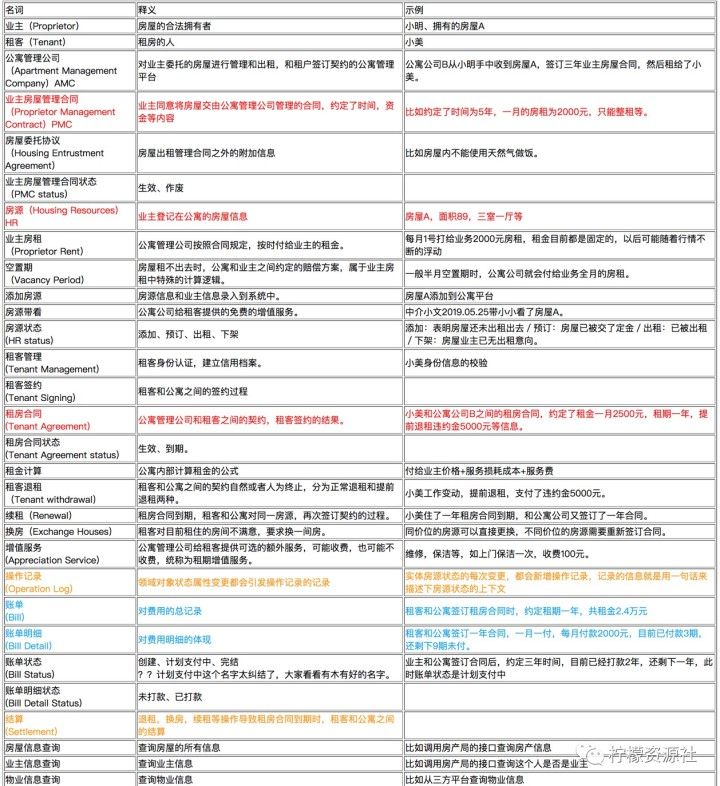
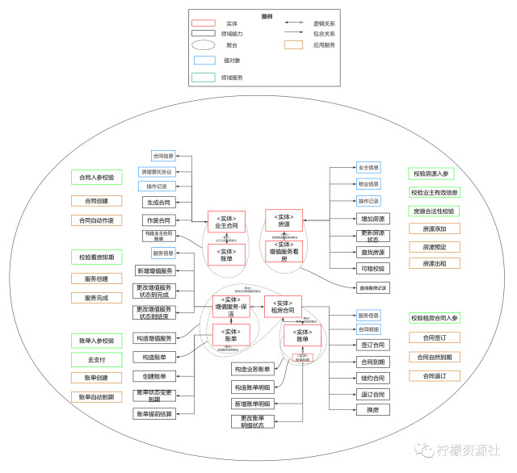
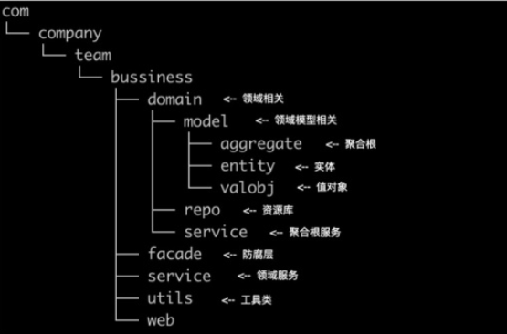

DDD (Domain-Driven Design)

# 名词解释
- DDD：Domain-Driven Design
- UL：Ubiquitous Language，通用语言，
    - 开发人员应该使用基于模型的语言来描述系统中的工件、任务和功能。这个模型应该为开发人员和领域专家提供一种用于相互交流的语言，而且领域专家还应该使用这种语言来讨论需求、开发计划和特性。
    - 将模型作为语言的支柱。确保团队在内部的所有交流中以及代码中坚持使用这种语言。在画图、写东西，特别是讲话时也要使用这种语言。
    - 通过尝试不同的表示方法（它们反映了备选模型）来消除难点。然后重构代码，重新命名类、方法和模块，以便与新模型保持一致。解决交谈中的术语混淆问题，就像我们对普通词汇形成一致的理解一样。
- DP(VO)：Domain Primitive
- Entity：
- Aggregate：

重要的是 领域建模

- 充血模型：
- 贫血模型：

- 领域划分、明确边界、统一语言
- 限界上下文划分、上下文关系梳理
- 模块结构组织
- 建模
- 编码

# 需求评审后产出

- **通用语言**
  - 描述直白简单，基本一句话，小白都能看懂。
  - 重点通用语言有英文描述。
  - 通用语言有顺序，会循序渐进。

  

- **领域模型**
  - DDD落地最复杂、最耗时的地方。
  - 通俗的来说：领域模型就是用来定义领域元素，和管理领域元素的上下文的。
  - 常见的领域元素有：实体、值对象、聚合、领域服务、应用服务、领域能力等。
  - 领域元素之间的上下文指：元素间包含关系和逻辑关系。
    
  

- **数据模型**
  - 就是在领域模型的基础上进行建表，表达出一种存储结构。

# 开发

目的：如何写出高内聚低耦合的代码。

- 高内聚：指的是对领域层的内聚。
- 低耦合：指的是领域层对上下游的耦合少。

分层

- Controller层原则：只做流程编排、参数转化、事务等事情，绝不写业务。（业务内聚到service层）
- DTO只出现在Controller层：避免DTO流转到 Service 层，导致上游的业务已经侵入到本域，违背了低耦合。
- Controller层 跟 service层边界划分：（来限定随着团队壮大、业务变复杂带来的业务耦合不可控）
  - 代码自动生成，生成的业务代码已经规定好了业务约束，开发人员不会乱写。
  - app 层和 domain 层的边界定义了约束，app 层只能够调用 domain 层的实体行为、聚合行为和领域服务三种领域元素，其他领域元素都不允许出现在 app 层。

依赖调用

- MVC 是 Service 层依赖 Model 层，DDD 却完全相反，domain 层的下游都需要去依赖 domain 层！（业务是内聚在 domain 层，然后 domain 层也不会去耦合下游的业务）

领域层的富血模型（非贫血、非充血）

为了达到富血模型，两点是特别重要的：
- 领域元素的定义要清楚
  - DDD 中的领域元素其实还满多的，有实体、聚合、领域能力、值对象、领域服务、应用服务、工厂、仓储等。
  - 看看 DDD 经典书籍：《领域驱动设计：软件核心复杂性应对之道》
- 领域元素的边界要清楚（思考：关系和逻辑关系）
  - 比如：聚合是来管理实体间一种固定的业务关系的，聚合和实体是一对多的关系，聚合会包含多个实体。
  - 比如：值对象是用来描述对象的，那么值对象只可能用来描述实体，而不是聚合。
  - 比如：领域服务是一种操作或动作，你会发现领域服务在边界解耦，组装领域能力方面也有很大的作用。

