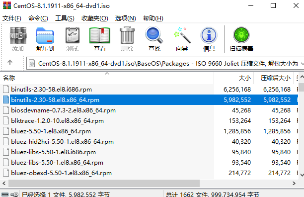
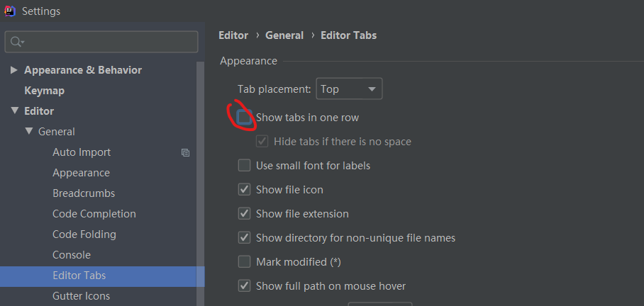
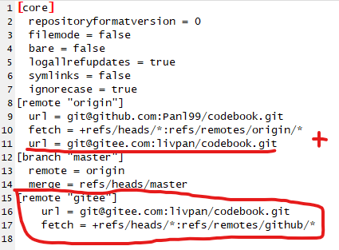
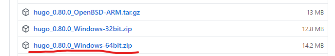
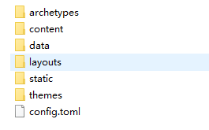
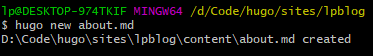
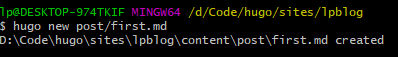
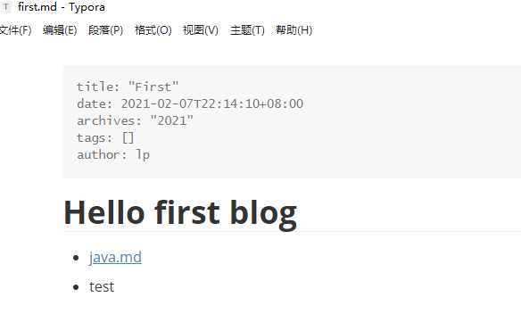
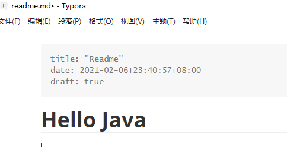
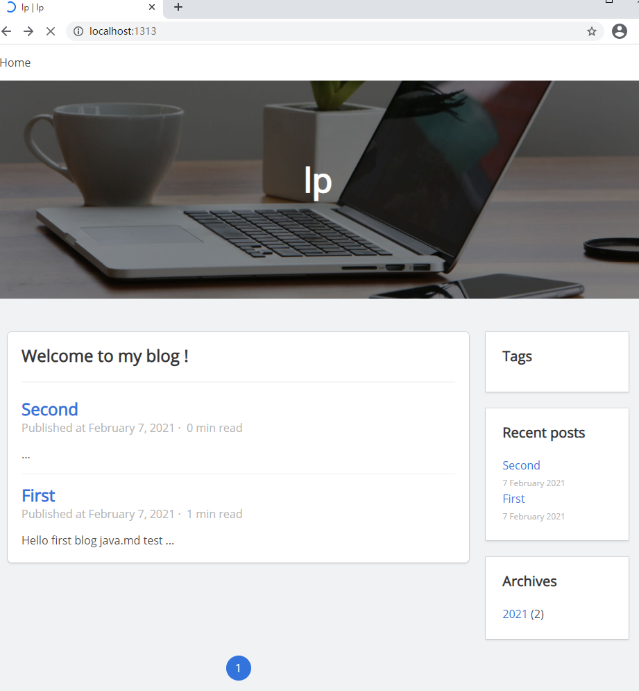

# 目录
- [win10相关](#win10相关)
    - [win10多分屏](#win10多分屏)
    - [win10自带截屏](#win10自带截屏)
    - [xshell6无法连接centos8的静态ip](#xshell6无法连接centos8的静态ip)
    - [xshell6、xftp6强制更新才能用](#xshell6xftp6强制更新才能用)
    - [centos8安装](#centos8安装)
    - [centos8离线安装Nginx](#centos8离线安装Nginx)
- [Chrome使用](#Chrome使用)
    - [网站登录才能复制](#网站登录才能复制)
    - [CSDN登录才能复制](#CSDN登录才能复制)
- [IDEA使用](#IDEA使用)
    - [快捷鍵](#快捷鍵)
    - [idea优化](#idea优化)
        - [启动优化](#启动优化)
        - [编码优化](#编码优化)
- [GitHub](#GitHub)
    - [修改github邮箱](#修改github邮箱)
    - [添加SSH公钥](#添加SSH公钥)
    - [Git推送到多个远端库](#Git推送到多个远端库)
    - [使用github1s在线vscode查看项目](#使用github1s在线vscode查看项目)
    - [GitHub加速](#GitHub加速)
- [hugo搭建个人博客](#hugo搭建个人博客)
    - [Windows安装hugo](#Windows安装hugo)
    - [hugo博客托管到github](#hugo博客托管到github)


# win10相关
## win10多分屏
```
打开一个界面，按win+左键；
或者，拖动一个界面到显示器左边缘，鼠标接触到左边缘时，会看到一个半透明的背景，松开鼠标即可
```

## win10自带截屏
- 快捷键：`win + shift + s`

## xshell6无法连接centos8的静态ip
``` 
--需要修改宿主机对应的网络适配器的IP地址与centos8所设置的静态ip地址等在同一网段
如：centos8静态ip：192.168.1.20，宿主机对应ip需要在192.168.1.x，子网掩码、网关、dns地址相同即可。
目前：xshell可以ping通虚拟机地址，但虚拟机还无法ping通宿主机ip
```

## xshell6、xftp6强制更新才能用
```
--修改安装目录下nslicense.dll：7F 0C 81 F9 80 33 E1 01 0F 86 81为：7F 0C 81 F9 80 33 E1 01 0F 83 81
xshell/ftp5的为：7F 0C 81 F9 80 33 E1 01 0F 86 80
```

## centos8安装
```
安装net-tools：net-tools软件包包含基本的联网工具，包括ifconfig，netstat，route等。
    连接地址：https://centos.pkgs.org/8/centos-baseos-x86_64/net-tools-2.0-0.51.20160912git.el8.x86_64.rpm.html
    下载地址：http://mirror.centos.org/centos/8/BaseOS/x86_64/os/Packages/net-tools-2.0-0.51.20160912git.el8.x86_64.rpm
    手动安装：rpm -ivh net-tools-2.0-0.51.20160912git.el8.x86_64.rpm
    联网自动安装：yum install net-tools
```

[目录](#目录)


## centos8离线安装Nginx
### 查找镜像包

用压缩软件打开centos8镜像包，

进入baseos/package下：存在软件包

AppStream\Packages：gcc、g++包



### 安装gcc

> 真正安装顺序①②③④⑤⑥⑦⑧⑨⑩

1. ①rpm -ivh libmpc-1.0.2-9.el8.x86_64.rpm --force

2. ②rpm -ivh cpp-8.3.1-4.5.el8.x86_64.rpm --force

3. ③rpm -ivh isl-0.16.1-6.el8.x86_64.rpm --force

4. ⑨rpm -ivh gcc-8.3.1-4.5.el8.x86_64.rpm --force

   - ④rpm -ivh binutils-2.30-58.el8.x86_64.rpm --force
   - ⑧rpm -ivh glibc-devel-2.28-72.el8.x86_64.rpm --force
     - ⑦rpm -ivh glibc-headers-2.28-72.el8.x86_64.rpm --force
       - ⑤rpm -ivh kernel-headers-4.18.0-147.el8.x86_64.rpm --force
     - ⑥rpm -ivh libxcrypt-devel-4.1.1-4.el8.x86_64.rpm --force --nodeps（忽略依赖，跟glibc-devel互相依赖，死循环了）
       - rpm -ivh glibc-devel-2.28-72.el8.x86_64.rpm --force
       - /usr/bin/pkg-config [安装pkg-config](#安装pkg-config)
 

#### 安装pkg-config

1. rpm -ivh pkgconf-pkg-config-1.4.2-1.el8.x86_64.rpm --force
   1. rpm -ivh pkgconf-1.4.2-1.el8.x86_64.rpm --force
      1. rpm -ivh libpkgconf-1.4.2-1.el8.x86_64.rpm --force
   2. rpm -ivh pkgconf-m4-1.4.2-1.el8.noarch.rpm --force

### 安装gcc-g++

1. rpm -ivh libstdc++-devel-8.3.1-4.5.el8.x86_64.rpm --force
2. rpm -ivh gcc-c++-8.3.1-4.5.el8.x86_64.rpm --force

### 安装pcre pcre-devel

1. rpm -ivh pcre-8.42-4.el8.x86_64.rpm --force
2. rpm -ivh pcre-devel-8.42-4.el8.x86_64.rpm --force
   - rpm -ivh pcre-cpp-8.42-4.el8.x86_64.rpm --force
   - rpm -ivh pcre-utf16-8.42-4.el8.x86_64.rpm --force
   - rpm -ivh pcre-utf32-8.42-4.el8.x86_64.rpm --force
   - /usr/bin/pkg-config [安装pkg-config](#安装pkg-config)

### 安装zlib zlib-devel

1. 查询系统已安装：`rpm -qa | grep "zlib"`
   1. zlib-1.2.11-10.el8.x86_64

1. rpm -ivh zlib-devel-1.2.11-10.el8.x86_64.rpm --force

### 安装openssl openssl-devel

1. rpm -ivh openssl-1.1.1c-2.el8.x86_64.rpm --force
2. rpm -ivh openssl-devel-1.1.1c-2.el8.x86_64.rpm --force
   1. rpm -ivh keyutils-libs-devel-1.5.10-6.el8.x86_64.rpm --force
   2. rpm -ivh libcom_err-devel-1.44.6-3.el8.x86_64.rpm --force
   3. rpm -ivh libkadm5-1.17-9.el8.x86_64.rpm --force
   4. rpm -ivh libverto-devel-0.3.0-5.el8.x86_64.rpm --force
   5. rpm -ivh libselinux-devel-2.9-2.1.el8.x86_64.rpm --force
      1. rpm -ivh libsepol-devel-2.9-1.el8.x86_64.rpm --force
      2. pkgconfig(libpcre2-8) [安装pcre2](#安装pcre2)

#### 安装pcre2

1. rpm -ivh pcre2-10.32-1.el8.x86_64.rpm --force
2. rpm -ivh pcre2-devel-10.32-1.el8.x86_64.rpm --force
   1. rpm -ivh pcre2-utf16-10.32-1.el8.x86_64.rpm --force
   2. rpm -ivh pcre2-utf32-10.32-1.el8.x86_64.rpm --force
   
### 安装其他

1. rpm -ivh tar-1.30-4.el8.x86_64.rpm --force
2. rpm -ivh make-4.2.1-9.el8.x86_64.rpm --force

### 安装Nginx

1. tar -zxvf nginx-1.19.6.tar.gz -C /opt/

2. ```shell
   cd nginx-1.19.6
   ./configure --prefix=/opt/nginx --sbin-path=/opt/nginx/sbin/nginx
   make
   make install
   ```
#### 测试
- ps aux|grep nginx

```shell
[root@localhost sbin]# cd /opt/nginx/sbin/
[root@localhost sbin]# ./nginx 
[root@localhost sbin]# curl http://localhost
<!DOCTYPE html>
<html>
<head>
<title>Welcome to nginx!</title>
<style>
    body {
        width: 35em;
        margin: 0 auto;
        font-family: Tahoma, Verdana, Arial, sans-serif;
    }
</style>
</head>
<body>
<h1>Welcome to nginx!</h1>
<p>If you see this page, the nginx web server is successfully installed and
working. Further configuration is required.</p>

<p>For online documentation and support please refer to
<a href="http://nginx.org/">nginx.org</a>.<br/>
Commercial support is available at
<a href="http://nginx.com/">nginx.com</a>.</p>

<p><em>Thank you for using nginx.</em></p>
</body>
</html>
[root@localhost sbin]# 

```
#### 防火墙
- rpm -ivh firewalld-0.7.0-5.el8.noarch.rpm --force
- 在 windows 系统中访问 linux 中 nginx ，默认不能访问的，因为防火墙问题
    - 1 ）关闭防火墙
    - 2 ）开放访问的端口号 80 端口
- 查看开放的端口号`firewall-cmd --list-all`
- 设置开放的端口号
    - `firewall-cmd --add-service=http --permanent`
    - `firewall-cmd --add-port=80/tcp --permanent`
- 重启防火墙`firewall-cmd --reload`

[目录](#目录)

# Chrome使用
## 网站登录才能复制
- 这类网站大多都是通过监听dom的copy事件实现的
- 解决：F12，输入下面代码移除eventlistener。
    ```
    (function() {
      let arr = Array.from(document.querySelectorAll("article.article"));
      if (arr && arr.length <= 0) { return; } 
      let articleContent = arr[0];
      let eventHolder = getEventListeners(articleContent);
      if (!eventHolder || !eventHolder.copy) { return; }
      eventHolder.copy.forEach(e => {
        articleContent.removeEventListener('copy',e.listener)
      })
    })();
    ```
## CSDN登录才能复制
`javascript:document.body.contentEditable='true';document.designMode='on';`

[目录](#目录)

# IDEA使用
## 快捷鍵  
- `Ctrl + Alt + L`：格式化代码
- `Alt + Insert`：生成构造方法、Getter、Setter等
- `Ctrl + Shift + u`：大小写字母切换

## idea优化  
### 启动优化  
- 文件位置：`/idea安装位置/bin/idea.exe.vmoptions`  
- 修改参数：
    ```
    -Xms1024m
    -Xmx2048m
    -XX:ReservedCodeCacheSize=500m
    ```
### 编码优化  
- 自动导包：`Settings/Editor/General/Auto Import`勾选Java下all、Add unambiguous...、Optimize imports...
- 导包不合为*：`Settings/Editor/Code Style/Java`选择Imports，将Class count to use import with ‘*’ 和Names count to use static import with ‘*’ 两项设置成9999
- Tab替换为4个空格：`Settings/Editor/Code Style/Java`取消勾选Use tab character，Tabs and Indents设置为4
- 代码提示时忽略输入大小写：`Settings/Editor/General/Code Completion`取消勾选Match case
- 鼠标悬浮提示：`Settings/Editor/Code Editing`勾选Show quick documentation on mouse move
- 打开的文件不折叠，多行显示：`Settings/Editor/General/Editor Tabs`取消勾选Show tabs in one row
    
- 字体设置：`Settings/Editor/Font`
- 注释模板设置：`Settings/Editor/File and Code Templates`选择Includes/File Header
    ```java
    /**
     * @create ${DATE} ${TIME}
     * @auther outman
     **/
    ```
- 编码格式：`Settings/Editor/File Encodings`选择Global Encodings、Project Encodings、Default encoding for properties files(右边自动转换勾上)为UTF-8
- 修改代码提示快捷键：`Settings/Keymap`，先点击Find Shortcut搜索Alt+/(或者选择Main menu/Code/Code Completion/Cyclic Expand Word)，把快捷键释放占用，再在Find Shortcut搜索Ctrl+空格(或者选择Main menu/Code/Code Completion/Basic)修改为Alt+/

[目录](#目录)

# GitHub
## 修改github邮箱
- settings -> Emails: Add email address
- 添加完设置为：Primary 
- **注意**：不要删除旧邮箱，删除后会出现以前的提交记录contributions不显示了(绿色小方块没有了)，恢复方法就是重新加回旧邮箱即可（不需要设置为主邮箱）。

## 添加SSH公钥
1. git bash输入：`ssh-keygen -t rsa -C "xxxxx@xxxxx.com"`
2. 一路回车
3. 查看：`C:\Users\lp\.ssh\id_rsa.pub` 填到gitee/设置/安全设置/SSH公钥
4. 测试gitee：`ssh -T git@gitee.com`

- [gitee-生成/添加SSH公钥](https://gitee.com/help/articles/4181#article-header0)

## Git推送到多个远端库
- git本地一次推送到github、gitee两个库
- 修改 隐藏.git/config：
```
[remote "origin"]
	url = git@github.com:Panl99/codebook.git
	fetch = +refs/heads/*:refs/remotes/origin/*
添加1：	url = git@gitee.com:livpan/codebook.git
[branch "master"]
	remote = origin
	merge = refs/heads/master
添加2：
[remote "gitee"]
    url = git@gitee.com:livpan/codebook.git
    fetch = +refs/heads/*:refs/remotes/github/*
```



[目录](#目录)

## 使用github1s在线vscode查看项目
[使用github1s在线使用vscode查看项目codebook](https://github1s.com/Panl99/codebook)

[目录](#目录)

## GitHub加速

[dev-sidecar](https://github.com/docmirror/dev-sidecar)

[目录](#目录)

# hugo搭建个人博客
- hugo使用go语言编写的静态网站生成器，但无需安装go就可使用，只需要获取预编译的二进制文件即可。
- hugo比hexo加载快

## [Windows安装hugo](https://gohugo.io/getting-started/installing)
1. 本地创建博客目录：`D:\Code\hugo` 、`D:\Code\hugo\bin` 、`D:\Code\hugo\sites` 
    - `hugo\bin\`下存放：hugo二进制文件
    - `hugo\sites\`下存放：站点文件
2. [下载二进制](https://github.com/gohugoio/hugo/releases)

3. 解压到`D:\Code\hugo\bin`，然后在环境变量中添加此路径
4. 验证：打开`cmd`，输入`hugo help`，有帮助内容说明安装好了

### 创建站点
1. 打开`cmd`，进入sites目录`D:\Code\hugo\sites\`，输入`hugo new site lpblog>`会在sites目录下生成一个lpblog目录存放网站文件，包含如下文件：

2. [添加主题](https://themes.gohugo.io/)
    - 进入sites目录`D:\Code\hugo\sites\lpblog\`
    - 克隆主题到themes目录下：`git clone https://github.com/Panl99/hugo-blog-jeffprod.git themes/jeffprod`
    - 克隆完后修改下默认的一些参数：
        - `lpblog\themes\jeffprod\archetypes\post.md`: 创建文章标题栏，改下 author
        - `lpblog\config.toml`：站点配置、分页个数等
        - [背景图](https://pixabay.com/)
3. 站点已经生成，现在创建一个文章：
    - 进入目录`D:\Code\hugo\sites\lpblog\`，执行`hugo new about.md`创建一个文章，会自动创建到`\lpblog\content\`下
    - 
    - 指定目录创建一个文章，注意一定是`post\`目录下
    - 
4. 打开创建的文章，编辑自己的博客内容
    - 
    - 
    - 要发布的时候，将草稿状态`draft: true`修改为`draft: false`
5. 启动站点：`hugo server`
6. 访问站点：`http://localhost:1313/`


## hugo博客托管到github
1. 在github上创建仓库：`Panl99.github.io`，一定要用自己的github用户名
    - settings往下拉 找到GitHub Pages，分支选择master，点击`Change theme`随便选择一个主题 提交，主要是要它给的网址
    - 过几分钟去访问下[https://panl99.github.io/](https://panl99.github.io/)能正常打开就OK了
    - 将`lpblog\config.toml`中的baseURL改成`baseURL = "https://panl99.github.io/"`
2. 在站点根目录执行`hugo`生成public目录，只需将该目录传到github上即可
    - 先在`\lpblog\`下执行`hugo`生成public目录
    - 再将新建的仓库`Panl99.github.io`pull到public目录下` git pull origin master`
    - 将public下的所有文件添加到git，并提交到github的`Panl99.github.io`仓库。
    ```
    cd public/
    git init
    git remote add origin https://github.com/Panl99/Panl99.github.io.git
    git add -A
    git commit -m "init hugo"
    git push -u origin master
    ```

[目录](#目录)