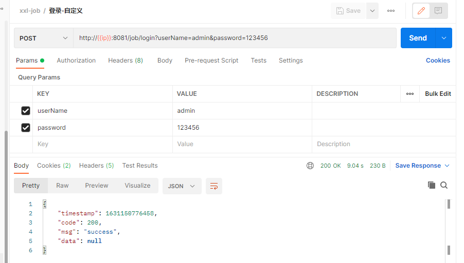

> [官方文档](https://www.xuxueli.com/xxl-job/)  
> [demo-xxljob](https://github.com/Panl99/demo/tree/master/demo-xxljob/src/main/java/com/lp/demo/xxljob)  


# 简介

## 调度中心(xxl-job-admin)
作用：可在界面统一管理任务调度平台上调度任务，负责触发调度执行，并且提供任务管理平台。

## 执行器(xxl-job-executor)
作用：负责接收【调度中心】的调度并执行；可直接部署执行器，也可以将执行器集成到现有业务项目中。

## 核心依赖(xxl-job-core)
本地项目依赖

## 配置文件属性说明
```
基础配置：
    - 执行器：任务的绑定的执行器，任务触发调度时将会自动发现注册成功的执行器, 实现任务自动发现功能; 另一方面也可以方便的进行任务分组。每个任务必须绑定一个执行器, 可在 "执行器管理" 进行设置;
    - 任务描述：任务的描述信息，便于任务管理；
    - 负责人：任务的负责人；
    - 报警邮件：任务调度失败时邮件通知的邮箱地址，支持配置多邮箱地址，配置多个邮箱地址时用逗号分隔；
触发配置：
    - 调度类型：
        无：该类型不会主动触发调度；
        CRON：该类型将会通过CRON，触发任务调度；
        固定速度：该类型将会以固定速度，触发任务调度；按照固定的间隔时间，周期性触发；
        固定延迟：该类型将会以固定延迟，触发任务调度；按照固定的延迟时间，从上次调度结束后开始计算延迟时间，到达延迟时间后触发下次调度；
    - CRON：触发任务执行的Cron表达式；
    - 固定速度：固件速度的时间间隔，单位为秒；
    - 固定延迟：固件延迟的时间间隔，单位为秒；
任务配置：
    - 运行模式：
        BEAN模式：任务以JobHandler方式维护在执行器端；需要结合 "JobHandler" 属性匹配执行器中任务；
        GLUE模式(Java)：任务以源码方式维护在调度中心；该模式的任务实际上是一段继承自IJobHandler的Java类代码并 "groovy" 源码方式维护，它在执行器项目中运行，可使用@Resource/@Autowire注入执行器里中的其他服务；
        GLUE模式(Shell)：任务以源码方式维护在调度中心；该模式的任务实际上是一段 "shell" 脚本；
        GLUE模式(Python)：任务以源码方式维护在调度中心；该模式的任务实际上是一段 "python" 脚本；
        GLUE模式(PHP)：任务以源码方式维护在调度中心；该模式的任务实际上是一段 "php" 脚本；
        GLUE模式(NodeJS)：任务以源码方式维护在调度中心；该模式的任务实际上是一段 "nodejs" 脚本；
        GLUE模式(PowerShell)：任务以源码方式维护在调度中心；该模式的任务实际上是一段 "PowerShell" 脚本；
    - JobHandler：运行模式为 "BEAN模式" 时生效，对应执行器中新开发的JobHandler类“@JobHandler”注解自定义的value值；
    - 执行参数：任务执行所需的参数；     
高级配置：
    - 路由策略：当执行器集群部署时，提供丰富的路由策略，包括；
        FIRST（第一个）：固定选择第一个机器；
        LAST（最后一个）：固定选择最后一个机器；
        ROUND（轮询）：；
        RANDOM（随机）：随机选择在线的机器；
        CONSISTENT_HASH（一致性HASH）：每个任务按照Hash算法固定选择某一台机器，且所有任务均匀散列在不同机器上。
        LEAST_FREQUENTLY_USED（最不经常使用）：使用频率最低的机器优先被选举；
        LEAST_RECENTLY_USED（最近最久未使用）：最久未使用的机器优先被选举；
        FAILOVER（故障转移）：按照顺序依次进行心跳检测，第一个心跳检测成功的机器选定为目标执行器并发起调度；
        BUSYOVER（忙碌转移）：按照顺序依次进行空闲检测，第一个空闲检测成功的机器选定为目标执行器并发起调度；
        SHARDING_BROADCAST(分片广播)：广播触发对应集群中所有机器执行一次任务，同时系统自动传递分片参数；可根据分片参数开发分片任务；
    - 子任务：每个任务都拥有一个唯一的任务ID(任务ID可以从任务列表获取)，当本任务执行结束并且执行成功时，将会触发子任务ID所对应的任务的一次主动调度。
    - 调度过期策略：
        - 忽略：调度过期后，忽略过期的任务，从当前时间开始重新计算下次触发时间；
        - 立即执行一次：调度过期后，立即执行一次，并从当前时间开始重新计算下次触发时间；
    - 阻塞处理策略：调度过于密集执行器来不及处理时的处理策略；
        单机串行（默认）：调度请求进入单机执行器后，调度请求进入FIFO队列并以串行方式运行；
        丢弃后续调度：调度请求进入单机执行器后，发现执行器存在运行的调度任务，本次请求将会被丢弃并标记为失败；
        覆盖之前调度：调度请求进入单机执行器后，发现执行器存在运行的调度任务，将会终止运行中的调度任务并清空队列，然后运行本地调度任务；
    - 任务超时时间：支持自定义任务超时时间，任务运行超时将会主动中断任务；
    - 失败重试次数；支持自定义任务失败重试次数，当任务失败时将会按照预设的失败重试次数主动进行重试；
```

# 开始

1. 创建数据库：`xxl-job`
2. 导入数据表：[tables_xxl_job.sql](https://github.com/Panl99/demo/tree/master/demo-xxljob/src/main/resources/static/sql/tables_xxl_job.sql)
3. 修改**调度中心**`xxl-job-admin`配置文件，启动调度中心：[http://localhost:8080/xxl-job-admin/](http://localhost:8080/xxl-job-admin/)，账密：admin/123456
4. 本地项目依赖：
    ```xml
    <dependency>
        <groupId>com.xuxueli</groupId>
        <artifactId>xxl-job-core</artifactId>
        <version>2.3.0</version>
    </dependency>
    ```
5. 修改本地项目配置文件，添加 执行器程序(xxl-job-executor)，运行项目：[demo-xxljob](https://github.com/Panl99/demo/tree/master/demo-xxljob/src/main/java/com/lp/demo/xxljob)

# 测试

## 接口测试

